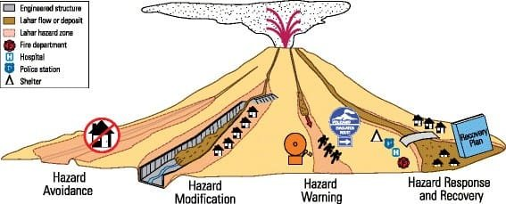
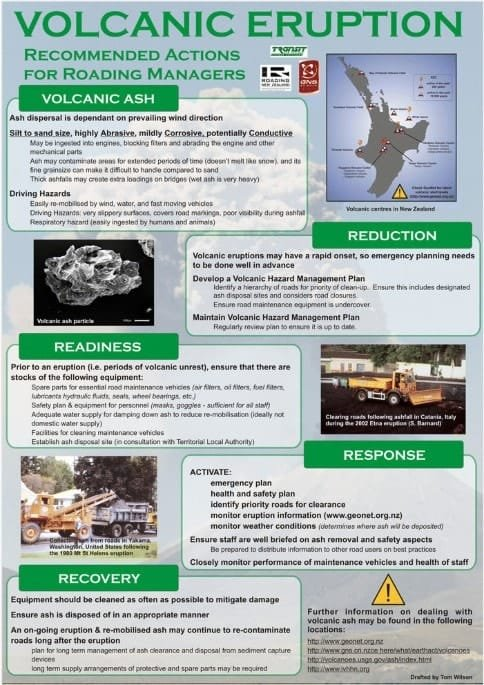
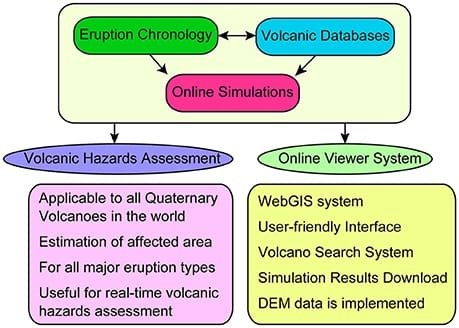

If you're looking for effective ways to minimize the dangers posed by volcanic activity, you've come to the right place. In this article, we'll explore ten of the best strategies to mitigate volcanic risks. From early warning systems to community preparedness measures, these strategies aim to protect lives and property in the face of potential eruptions. By understanding the complexities of volcanoes and implementing these strategies, we can work towards creating safer environments for communities living in volcanic regions. So let's dive in and discover the top strategies that can help mitigate the risks associated with volcanic activity.

<iframe width="560" height="315" src="https://www.youtube.com/embed/Z-w_z9yobpE" frameborder="0" allow="accelerometer; autoplay; encrypted-media; gyroscope; picture-in-picture" allowfullscreen></iframe>

  

## Understanding Volcanic Behavior

Volcanic eruptions can have a significant impact on both human lives and the environment. Therefore, it is crucial to study past eruptions to gain a better understanding of volcanic behavior. By examining historical records and data, scientists can analyze the various types and patterns of eruptions. This knowledge allows us to identify the signs of an imminent eruption and take appropriate measures to mitigate the risks.

### The importance of studying past eruptions

Studying past eruptions is essential because it provides valuable information about the characteristics and behavior of volcanoes. By analyzing historical records and geological evidence, scientists can identify patterns and trends that help predict future eruptions. This knowledge is vital for developing effective strategies to mitigate volcanic risks.

By understanding the different types of eruptions and their causes, scientists can better assess the hazards associated with each type. For example, some eruptions may produce large amounts of lava flows, while others may primarily release ash and volcanic gases. Understanding these variations in eruption behavior allows us to tailor our response and implement appropriate measures to protect vulnerable populations.

### Various types and patterns of eruptions

Volcanic eruptions can vary in intensity and duration, leading to different types of eruptions. Some of the most common types include effusive eruptions, explosive eruptions, and phreatomagmatic eruptions.

Effusive eruptions occur when magma rises to the surface and flows out in a slow and steady manner. These eruptions are characterized by the relatively gentle release of lava and are often associated with shield volcanoes, such as those found in Hawaii.

Explosive eruptions, on the other hand, involve the rapid release of volcanic gases and fragmented rock material. These eruptions can be highly destructive, generating pyroclastic flows, volcanic ash, and lahars. They are commonly associated with stratovolcanoes, like Mount St. Helens in the United States.

Phreatomagmatic eruptions occur when water comes into contact with magma, resulting in explosive activity. These eruptions can produce ash, steam, and volcanic bombs, posing a significant risk to nearby communities.

By studying the characteristics and behavior of these different types of eruptions, scientists can develop models and simulations to predict future volcanic activity. This information is crucial for implementing effective early warning systems and evacuation plans.

### Understanding signs of imminent eruption

One of the key components of mitigating volcanic risks is being able to recognize the warning signs of an imminent eruption. Volcanoes often exhibit several precursory indicators that can help scientists predict when an eruption is likely to occur.

One of the most reliable indicators of an imminent eruption is increased volcanic seismicity. [Monitoring seismic activity](https://magmamatters.com/the-art-and-science-of-volcano-monitoring/ "The Art and Science of Volcano Monitoring") allows scientists to detect the movement of magma beneath the surface and identify any changes in volcanic behavior. This information is crucial for determining the likelihood of an eruption and issuing timely warnings to at-risk communities.

Tracking gas emissions is another important aspect of monitoring volcanic activity. Volcanoes release varying amounts of gases, including sulfur dioxide, carbon dioxide, and hydrogen sulfide, prior to an eruption. By continuously measuring gas emissions, scientists can detect any changes in gas composition and volume, providing further insight into volcanic activity.

Surface deformation tracking using GPS or satellite technology is also an effective method for predicting volcanic eruptions. As magma rises to the surface, it causes the ground to deform, often resulting in uplift or subsidence. By monitoring these changes in surface elevation, scientists can assess the level of volcanic activity and anticipate an eruption.

By understanding and interpreting these signs, scientists can work towards implementing effective early warning systems that can save lives and minimize the impact of volcanic eruptions.

## Setting up Continuous Monitoring Systems

To effectively mitigate volcanic risks, it is crucial to set up continuous monitoring systems that can track volcanic activity and provide timely warnings. These monitoring systems play a vital role in assessing the current state of volcanoes, detecting any signs of imminent eruptions, and informing the relevant authorities and communities in a timely manner.

### Importance of seismic monitoring

One of the most important components of continuous monitoring systems is seismic monitoring. Seismic stations strategically placed near active [volcanoes can detect and record seismic activity associated with volcanic](https://magmamatters.com/understanding-volcanic-formation-a-comprehensive-guide/ "Understanding Volcanic Formation: A Comprehensive Guide") processes. By analyzing the pattern and intensity of seismic events, scientists can gain valuable insight into the movement of magma and the likelihood of an eruption.

Seismic monitoring can help determine the depth and location of magma chambers, which are crucial factors in assessing the potential hazards posed by a volcano. By continuously monitoring seismic activity, scientists can identify any changes in volcanic behavior and issue timely warnings to at-risk communities.

### Tracking gas emissions

Another essential aspect of continuous monitoring systems is tracking gas emissions. Volcanoes release various gases, including sulfur dioxide, carbon dioxide, and hydrogen sulfide, as a precursor to an eruption. Continuous monitoring of gas emissions allows scientists to detect any changes in gas composition and volume, providing valuable information about volcanic activity.

Gas monitoring involves the use of specialized equipment, such as gas analyzers and spectrometers, to measure the concentrations of different gases in the vicinity of a volcano. By monitoring changes in gas emissions over time, scientists can assess the level of volcanic activity and determine the likelihood of an eruption.

### Surface deformation tracking using GPS or satellite technology

Surface deformation tracking using GPS or satellite technology is another important tool in continuous monitoring systems. As magma rises to the surface, it causes the ground to deform, resulting in uplift or subsidence. By continuously monitoring these changes in surface elevation, scientists can assess the level of volcanic activity and predict the occurrence of an eruption.

GPS and satellite technologies provide accurate measurements of surface deformation over a large area. This information is crucial for assessing the current state of a volcano and determining the potential hazards it poses. By incorporating this data into continuous monitoring systems, scientists can improve their ability to predict volcanic activity and issue timely warnings.

Implementing and maintaining these continuous monitoring systems is essential for effectively mitigating volcanic risks. By combining data from seismic monitoring, gas emission tracking, and surface deformation tracking, scientists can gain a comprehensive understanding of volcanic behavior and make informed decisions to protect vulnerable populations.

This image is property of media.springernature.com.

## Implementing Early Warning Systems

Early warning systems play a crucial role in mitigating the risks associated with volcanic eruptions. These systems utilize various technologies and communication strategies to provide timely alerts and information to at-risk communities. By implementing effective early warning systems, we can significantly reduce the impact of volcanic eruptions and save lives.

### The role of communication technology in spreading alerts

Communication technology is an essential component of early warning systems for volcanoes. It enables the quick and efficient dissemination of alerts and information to at-risk communities.

One widely used communication technology for early warning systems is the Emergency Alert System (EAS). This system utilizes public broadcast channels, such as television and radio, to transmit alerts and instructions to the public. By interrupting regular programming and broadcasting emergency messages, the EAS ensures that people receive essential information in a timely manner.

In addition to traditional communication channels, modern technologies such as mobile phones and the internet have revolutionized the way we receive and share information. Mobile phone alerts, text messages, and push notifications can be used to deliver timely warnings and instructions directly to individuals in at-risk areas. Social media platforms and dedicated smartphone applications can also be utilized to disseminate information and reach a broader audience.

By leveraging communication technology, early warning systems can effectively reach at-risk communities and provide them with the information they need to take appropriate actions before, during, and after a volcanic eruption.

### Involvement of local communities in alert systems

Effective early warning systems require the active involvement of local communities. Engaging and empowering communities in the alert system is crucial for ensuring that warnings are understood, trusted, and acted upon.

By involving local communities in the design and implementation of early warning systems, their unique knowledge and experiences can be incorporated, enhancing the effectiveness of the system. This includes collaborating with community leaders, local organizations, and schools to raise awareness about volcanic risks and educate the community on how to respond to warnings.

Training programs can be conducted to educate community members on how to interpret warning messages, the appropriate actions to take in different scenarios, and the location of designated evacuation routes and shelters. Community drills and exercises can also be organized to simulate volcanic emergencies and test the responsiveness of the early warning system.

By actively involving local communities in the alert system, we can foster a sense of ownership and responsibility, ensuring that warnings are taken seriously and appropriate actions are taken to protect lives and property.

### Establishing procedures for interpreting and acting on warnings

To ensure the effectiveness of early warning systems, it is essential to establish clear procedures for interpreting and acting on warnings. These procedures should outline the roles and responsibilities of different stakeholders, including the authorities, emergency services, and the general public.

When a warning is issued, the authorities should have well-defined protocols for assessing the credibility and validity of the information. This includes verifying the source of the warning, analyzing the supporting data, and consulting with scientific experts to determine the level of risk.

Once the credibility of the warning is established, appropriate actions need to be taken promptly. This may involve initiating evacuation procedures, activating emergency services, and ensuring the availability of necessary resources, such as transportation and medical facilities.

For the general public, clear guidelines should be provided on how to respond to different warning levels. This includes instructions on evacuation routes, the location of designated shelters, and the actions to take to protect themselves and their families.

By establishing procedures for interpreting and acting on warnings, early warning systems can ensure a coordinated and effective response to volcanic emergencies. This ultimately helps to mitigate the risks and minimize the impact of eruptions on affected communities.

## Creating Volcano Preparedness Plans

Effective volcano preparedness plans are essential for minimizing the risks associated with volcanic eruptions. These plans outline the necessary measures and actions that need to be taken before, during, and after volcanic emergencies. By involving all relevant stakeholders and considering various aspects of risk mitigation, we can establish comprehensive preparedness plans that save lives and protect communities.

### Involving all relevant stakeholders

Creating volcano preparedness plans requires the involvement of all relevant stakeholders, including government authorities, emergency services, scientific experts, local communities, and non-governmental organizations (NGOs).

Government authorities play a vital role in coordinating and leading the preparedness efforts. They are responsible for allocating resources, establishing policies and regulations, and coordinating with various agencies and organizations involved in risk mitigation.

Emergency services, such as fire departments, police, and medical teams, are critical in responding to volcanic emergencies. Their involvement in the planning process ensures that their capabilities and limitations are considered, and appropriate measures are in place to support their operations during an eruption.

Scientific experts, including volcanologists, seismologists, and geologists, provide essential knowledge and expertise in understanding volcanic behavior and assessing the associated risks. Their input is invaluable in developing accurate risk assessments, designing early warning systems, and formulating appropriate response strategies.

Local communities should also be actively involved in the preparation process. They possess invaluable knowledge of the local terrain, cultural practices, and community dynamics. By engaging with the community, listening to their concerns, and incorporating their input, preparedness plans can be tailored to the specific needs and challenges of the population at risk.

Finally, NGOs and other relevant organizations can provide additional support and resources in the development and implementation of volcano preparedness plans. They often have specialized knowledge and experience in disaster management and can contribute valuable insights and best practices.

By involving all relevant stakeholders in the preparation process, volcano preparedness plans can be comprehensive and effective in mitigating risks and protecting communities.

### Planning evacuation routes and shelters

One crucial aspect of volcano preparedness plans is the planning of evacuation routes and the identification of suitable shelters for affected populations. As volcanic eruptions can occur with little warning, having clear evacuation routes and readily available shelters is essential to ensuring the safety of at-risk communities.

The planning of evacuation routes should take into account various factors, including the topography of the area, the potential hazards posed by the volcano, and the capacity of the transportation infrastructure. Evacuation routes should be well-marked and easily accessible to ensure a smooth and efficient evacuation process.

The identification of suitable shelters involves considering the capacity, location, and structural integrity of potential buildings or facilities. Shelters should be able to withstand volcanic hazards, such as ash fall and pyroclastic flows, and provide adequate protection for the affected population. Accessibility to basic amenities, such as clean water and sanitary facilities, is also important in ensuring the well-being of evacuees.

Particular attention should be given to vulnerable populations, such as the elderly, children, and individuals with disabilities, who may require additional support during evacuation. Specialized facilities and transportation arrangements should be made to accommodate their needs and ensure their safety.

By carefully planning evacuation routes and shelters, volcano preparedness plans can facilitate the timely and orderly evacuation of at-risk communities, minimizing the risks associated with volcanic eruptions.

### Stockpiling essential supplies

Another important element of volcano preparedness plans is the stockpiling of essential supplies that may be needed during and after a volcanic eruption. Disruption of essential services, such as water supply and electricity, is common during volcanic emergencies. Therefore, it is crucial to have sufficient reserves to support the affected population until normal services can be restored.

Emergency supplies should include items such as drinking water, non-perishable food, medical provisions, fuel, and basic hygiene products. The quantity of supplies should be based on the estimated number of affected individuals and the expected duration of the emergency situation.

Additionally, it is essential to regularly review and replenish these reserves to ensure their adequacy and usability. Regular training and drills should also be conducted to familiarize emergency responders and community members with the location and use of emergency supplies.

By stockpiling essential supplies, volcano preparedness plans can enhance the resilience of affected communities, ensuring that their basic needs are met during and after volcanic emergencies.

This image is property of www.explorevolcanoes.com.

## Establishing Exclusion Zones

Establishing exclusion zones around active volcanoes is a critical measure in minimizing the risks posed by volcanic eruptions. These exclusion zones define areas where access is restricted, protecting individuals and property from the potential hazards associated with volcanic activity.

### Determining safe distances from the volcano

The establishment of exclusion zones requires determining safe distances from the volcano, taking into account the potential hazards associated with volcanic eruptions. The specific safe distances vary depending on factors such as the type of eruption, the size of the volcano, and the local topography.

Volcanoes can produce a range of hazards, including ash fall, pyroclastic flows, lahars, and lava flows. The extent and reach of these hazards are influenced by factors such as the volume and viscosity of magma, prevailing wind patterns, and the terrain surrounding the volcano.

Scientific experts, particularly volcanologists and geologists, play a crucial role in assessing the potential hazards and determining the appropriate safe distances. Through their research and analysis, they can identify areas that are most vulnerable to volcanic activity and define exclusion zones accordingly.

Clear communication and signage are essential in informing the public about the boundaries of exclusion zones and the associated risks. This ensures that individuals understand the potential hazards and adhere to the restrictions put in place for their safety.

### Restricting access to high-risk areas

Once exclusion zones are established, it is vital to enforce restrictions on access to high-risk areas. This requires cooperation and coordination between government authorities, law enforcement agencies, and local communities.

Government authorities should implement legal measures, such as regulations and laws, that restrict access to exclusion zones. Penalties and fines may be imposed on individuals who venture into these restricted areas without authorization.

Law enforcement agencies play a critical role in enforcing access restrictions and ensuring public safety. They should be trained and equipped to monitor compliance and respond to violations promptly. By conducting regular patrols and inspections, law enforcement agencies can detect and deter unauthorized access, protecting individuals from potential hazards.

Local communities should also be actively engaged in enforcing access restrictions and reporting any violations. Their familiarity with the area and their commitment to the well-being of their community make them invaluable partners in this effort.

By effectively establishing and enforcing exclusion zones, we can mitigate the risks associated with volcanic eruptions and protect vulnerable populations from harm.

### Importance of adhering to enforced zones

Adhering to the enforced exclusion zones is essential for the safety of individuals and the overall effectiveness of risk mitigation efforts. Volcanic hazards can be highly unpredictable and can change rapidly, making it crucial to respect and follow the established restrictions.

Entering exclusion zones puts individuals at risk of encountering various hazards, including ash fall, pyroclastic flows, lahars, and lava flows. These hazards can cause severe injuries, property damage, and even loss of life.

By adhering to enforced exclusion zones, individuals can minimize the risks to themselves and allow emergency responders to focus their efforts on the areas of highest priority. It also helps to prevent unnecessary rescue missions and reduces the strain on resources and personnel.

Clear communication and public awareness campaigns play a significant role in encouraging adherence to enforced exclusion zones. Educational programs, signage, and social media campaigns can all be used to raise awareness about the importance of adhering to established restrictions and the potential consequences of non-compliance.

By understanding and respecting the enforced exclusion zones, individuals can contribute to their own safety and support the overall effectiveness of risk mitigation efforts.

## Building Disaster-Resistant Infrastructure

Building disaster-resistant infrastructure is crucial in minimizing the impact of volcanic eruptions on human lives and the environment. By constructing buildings and facilities that can withstand volcanic hazards, we can protect communities and critical infrastructure during volcanic emergencies.

### Constructing buildings capable of resisting ash fall and lahars

Ash fall and lahars are two common volcanic hazards that can cause significant damage to buildings and infrastructure. Therefore, constructing buildings capable of resisting these hazards is essential in minimizing the consequences of volcanic eruptions.

Buildings located in areas prone to ash fall should be designed with features that prevent the infiltration of volcanic ash. This includes sealing windows, doors, and ventilation systems to prevent the entry of ash particles into buildings. Roofs and exteriors should also be designed to minimize the accumulation of ash, which can cause structural damage and pose a risk of collapse.

Lahars, which are mudflows caused by volcanic activity, can be highly destructive and unpredictable. Buildings located in lahar-prone areas should be constructed elevated or on sturdy foundations to withstand the force of the flowing mud. Reinforced concrete and other resilient materials should be used in the construction of critical infrastructure, such as hospitals, schools, and emergency shelters.

Engineering and construction standards should take into account the specific hazards and risks associated with volcanic eruptions. Collaboration between architects, engineers, and geologists is essential in developing designs and construction techniques that ensure the resilience of the built environment in volcanic areas.

### Implementing protective measures for existing infrastructure

In addition to constructing disaster-resistant infrastructure, it is crucial to implement protective measures for existing buildings and facilities in volcanic areas. Retrofitting and reinforcing existing infrastructure can significantly enhance its resilience to volcanic hazards.

Retrofitting involves modifying existing buildings to improve their ability to withstand volcanic hazards. This may include strengthening structural elements, adding protective barriers, or installing ventilation systems that can filter volcanic ash.

Protective measures can also be implemented to safeguard critical infrastructure such as power plants, water treatment facilities, and transportation networks. For example, power plants can be equipped with air filters and ash removal systems to prevent equipment damage and ensure uninterrupted power supply during volcanic emergencies.

Public spaces, such as parks and recreational areas, can also be designed with volcanic hazards in mind. This includes the installation of warning signs, designated escape routes, and barriers to prevent access to high-risk areas during eruptions.

By implementing protective measures for existing infrastructure, we can enhance its resilience and minimize the impact of volcanic hazards on communities and essential services.

### Planning cities and settlements to limit exposure to volcanic hazards

The planning of cities and settlements in volcanic areas should prioritize limiting exposure to volcanic hazards. By carefully considering the location and design of urban environments, we can reduce the risks to the population and infrastructure.

Urban planning should involve a thorough assessment of the potential hazards posed by nearby volcanoes, taking into account factors such as lava flows, lahars, and ash fall. Building codes and zoning regulations should be updated to reflect these hazards and ensure that buildings and infrastructure are constructed in safe locations.

Settlements should be located outside of high-risk areas, away from potential lava flow paths and lahar channels. Buffer zones can be created to separate residential areas from hazardous zones, providing an additional layer of protection.

Land use planning should also incorporate green spaces and natural barriers, such as forests and wetlands, to help absorb volcanic ash and prevent its spread across urban areas. This can reduce the impact of ash fall on buildings, infrastructure, and public health.

By planning cities and settlements to limit exposure to volcanic hazards, we can minimize the risks to human lives, property, and the environment. This requires a collaborative effort between urban planners, architects, scientists, and government authorities to ensure that risk mitigation is integrated into the development process.

This image is property of media.springernature.com.

## Promoting Insurance Against Volcanic Hazard

Insurance plays a significant role in mitigating the financial risks associated with volcanic eruptions. By promoting insurance coverage against volcanic hazards, individuals and businesses can receive compensation for the damage caused by eruptions, reducing the economic impact on affected communities.

### Benefits of insurance to businesses and individuals

Insurance provides financial protection to businesses and individuals against the losses and damages incurred during volcanic eruptions. By transferring the risk to insurance companies, policyholders can receive compensation for property damage, business interruption, and other covered losses.

For businesses, insurance coverage can provide the necessary funds to repair or replace damaged assets, restock inventory, and cover the costs of reopening after an eruption. This helps businesses recover more quickly and resume their operations, minimizing the economic impact on employees and the local economy.

For individuals, insurance coverage can help with the costs of repairing or rebuilding their homes, replacing damaged belongings, and covering additional living expenses during evacuations. This provides peace of mind and financial stability during times of volcanic emergencies.

Insurance can also incentivize individuals and businesses to take preventive measures, such as constructing disaster-resistant buildings or implementing protective measures. By offering lower premiums or additional coverage for these proactive measures, insurance companies can promote risk reduction and resilience.

### Encouraging uptake of insurance

Encouraging the uptake of insurance against volcanic hazards requires raising awareness about the benefits of coverage and addressing any barriers that may limit its accessibility.

Awareness campaigns can be conducted to educate individuals and businesses about the risks posed by volcanic eruptions and the protection offered by insurance. This can include informational brochures, public seminars, and media campaigns that highlight real-life examples of the financial impact of volcanic emergencies.

Insurance companies can also work with local communities, government authorities, and NGOs to develop affordable and accessible insurance options specifically tailored to the needs of volcanic areas. This may involve collaborating with local insurers, setting up dedicated insurance programs, or offering specialized coverage as part of existing insurance policies.

Government incentives, such as tax rebates or grants, can be provided to individuals and businesses that purchase insurance against volcanic hazards. These incentives can help offset the costs of insurance premiums and encourage people to prioritize risk mitigation and financial protection.

By actively encouraging the uptake of insurance against volcanic hazards, we can help individuals and businesses manage their financial risks and ensure a more resilient recovery after eruptions.

### Understanding the limitations of insurance

While insurance provides valuable financial protection, it is important to understand its limitations, particularly when it comes to volcanic hazards.

Insurance policies often contain exclusions and limitations that may affect coverage for volcanic events. These can include specific timeframes for coverage, deductibles, and exemptions for certain types of property or losses. Policyholders should carefully review their insurance policies and seek clarification from their insurance providers to ensure they have a clear understanding of their coverage.

Additionally, the availability and affordability of insurance coverage may vary depending on the location and proximity to active volcanoes. Insurers may classify certain areas as high-risk and charge higher premiums, or even decline coverage altogether. This can pose challenges for individuals and businesses in volcanic regions seeking adequate insurance protection.

Understanding the limitations of insurance is crucial in managing expectations and making informed decisions regarding risk mitigation. It should be seen as one part of a comprehensive approach to volcanic risk management, complemented by other strategies such as early warning systems, preparedness planning, and infrastructure resilience.

## Educating Populations at Risk

Education plays a critical role in mitigating the risks associated with volcanic eruptions. By offering educational programs in schools and communities, raising awareness of risks and safety measures, and understanding cultural attitudes towards volcanoes, we can empower at-risk populations to make informed decisions and take appropriate actions during volcanic emergencies.

### Offering educational programs in schools and communities

Educational programs in schools and communities are instrumental in equipping individuals with the knowledge and skills necessary to understand and respond to volcanic hazards. These programs should be designed to cater to different age groups and cultural backgrounds, ensuring that the information is accessible and relevant to the target audience.

In schools, volcanic hazards can be incorporated into the curriculum, providing students with a solid foundation of knowledge about volcanoes, their behavior, and the associated risks. This can be done through interactive lessons, field trips to volcanic areas, and engaging activities that promote scientific inquiry and critical thinking.

Community-based educational programs can be conducted to raise awareness among the general population, providing information about the specific volcanic hazards in their area and the appropriate actions to take during volcanic emergencies. This may include public seminars, workshops, and information sessions facilitated by experts in volcanology and disaster management.

The involvement of local communities in the design and implementation of educational programs is crucial for ensuring their relevance and effectiveness. Community leaders, teachers, and local organizations should be actively engaged in the planning process, providing input and insights based on their unique knowledge of the local context.

### Raising awareness of risks and safety measures

Raising awareness of volcanic risks and safety measures is a key objective of educational programs. By informing individuals about the potential hazards associated with volcanic eruptions and the actions they can take to protect themselves and their communities, we can empower them to make informed decisions and respond effectively during volcanic emergencies.

Information campaigns can be conducted to communicate the risks and safety measures in a clear and accessible manner. This may include the distribution of informational brochures, posters, and flyers in multiple languages, ensuring that the messages reach a diverse audience.

Social media platforms and online resources can also be utilized to deliver educational content and engage with the community. This allows for real-time dissemination of information, interactive discussions, and the ability to reach a broader audience.

Emergency drills and exercises should be organized to simulate volcanic emergencies and test the preparedness of individuals and communities. These drills provide opportunities for practical learning, allowing individuals to practice emergency procedures, familiarize themselves with evacuation routes, and test their knowledge of safety measures.

By raising awareness of risks and safety measures, we can empower individuals and communities to make informed decisions and take appropriate actions to protect themselves during volcanic emergencies.

### Understanding cultural attitudes towards volcanoes to customize education strategies

Cultural attitudes towards volcanoes play a significant role in shaping individual and community responses to [volcanic hazards](https://magmamatters.com/the-environmental-impact-of-volcanic-eruptions-2/ "The Environmental Impact of Volcanic Eruptions"). Understanding these attitudes is crucial for customizing education strategies and ensuring their effectiveness.

Some cultures have deep-rooted beliefs and practices associated with volcanoes, viewing them as sacred or imbued with spiritual significance. These cultural attitudes can influence perceptions of risk, response strategies, and the willingness to evacuate during volcanic emergencies.

Engaging with local communities and understanding their cultural perspectives allows for the development of education strategies that are respectful, inclusive, and sensitive to cultural traditions. This may involve collaborating with community leaders, elders, and cultural experts to incorporate cultural insights and narratives into educational programs.

Education strategies should aim to bridge the gap between scientific knowledge and local cultural beliefs. By presenting scientific information in a culturally appropriate context, community members can make informed decisions that align with their cultural values while still prioritizing their safety.

By understanding and respecting cultural attitudes towards volcanoes, education strategies can effectively communicate the risks and safety measures associated with volcanic hazards, ensuring a more comprehensive and inclusive approach to volcanic risk management.

This image is property of www.frontiersin.org.

## Collaborating with Volcanologists and other Experts

Collaboration with volcanologists and other experts is crucial in effectively mitigating volcanic risks. These experts possess specialized knowledge and insights into volcanic behavior and can provide invaluable guidance in contingency planning, translating scientific knowledge into safety measures, and developing state-of-the-art technology and strategies.

### Involving experts in contingency planning

Contingency planning is an integral part of volcanic risk management. It involves developing comprehensive strategies and protocols to respond to volcanic emergencies and minimize their impact on affected communities. In this process, the involvement of experts, particularly volcanologists and geologists, is essential.

Volcanologists can provide valuable input in assessing volcanic hazards, determining the likelihood of an eruption, and predicting its potential impact. Their expertise allows for the development of accurate risk assessments, enabling authorities to make informed decisions regarding evacuation procedures, resource allocation, and emergency response.

Geologists contribute to contingency planning by conducting geological surveys and mapping, identifying potential risks and vulnerabilities, and assessing the stability of the terrain. This information is crucial in determining safe locations for infrastructure, evacuation routes, and the design of protective measures.

Involving experts in contingency planning ensures that decision-making is based on scientific evidence and the best available knowledge. Their contributions enhance the effectiveness of risk management strategies and improve the overall resilience of affected communities.

### Translating scientific knowledge into safety measures

Translating scientific knowledge into practical safety measures is a key component of mitigating volcanic risks. Experts in volcanology, geology, and related disciplines can bridge the gap between scientific research and the application of that knowledge in risk management strategies.

By analyzing data from monitoring systems and conducting research, scientists can gain insights into volcanic behavior and identify potential hazards. This information is then used to develop safety measures that can be implemented to protect communities and critical infrastructure.

For example, scientific knowledge about the behavior of pyroclastic flows can inform the design of diversion channels and barriers that redirect their flow away from populated areas. Similarly, understanding the effects of ash fall on buildings and infrastructure can lead to the development of construction standards that minimize damage and disruption.

Scientists can also contribute to the development of early warning systems by identifying precursory indicators of volcanic activity and developing models and simulations that improve the accuracy of predictions. This allows authorities to issue timely warnings and initiate proactive measures before an eruption occurs.

By translating scientific knowledge into safety measures, experts play a vital role in mitigating volcanic risks and protecting communities from the potential impacts of volcanic eruptions.

### Developing state-of-the-art technology and strategies

The development of state-of-the-art [technology and strategies](https://magmamatters.com/geothermal-energy-and-its-volcanic-origins/ "Geothermal Energy and Its Volcanic Origins") is essential for improving the effectiveness of volcanic risk management. Collaboration between experts in various disciplines can lead to innovative approaches and tools that enhance our ability to predict, monitor, and respond to volcanic emergencies.

Technological advancements in monitoring systems, such as improved seismic sensors, gas detectors, and satellite imaging, allow for more accurate and timely detection of volcanic activity. These advancements provide scientists with invaluable data that can be used to develop better predictive models and issue more precise warnings.

Furthermore, the integration of artificial intelligence and machine learning techniques can enhance the analysis and interpretation of scientific data. These technologies can identify patterns and trends in volcanic behavior that may not be immediately apparent to human analysts, enabling more accurate predictions and timely actions.

Collaboration with experts in other fields, such as engineering, architecture, and urban planning, can result in the development of innovative infrastructure designs and construction techniques that can withstand volcanic hazards. This includes the use of advanced materials, resilient designs, and adaptive infrastructure that can respond to changing conditions.

By collaborating and investing in the development of state-of-the-art technology and strategies, we can continually improve our ability to mitigate volcanic risks and enhance the safety and resilience of communities.

## Encouraging Proactive Government Policies

Proactive government policies are crucial in effectively mitigating volcanic risks. Governments play a vital role in providing support and funding for risk mitigation efforts, enacting legislation for volcano risk management, and incorporating volcanic risk management in development planning.

### Providing support and funding for risk mitigation

Government support and funding are essential for implementing and sustaining volcanic risk mitigation efforts. Governments should allocate sufficient resources to support research, monitoring systems, early warning systems, and emergency response capabilities.

Funding can be provided to research institutions and scientific organizations to conduct studies on volcanic behavior, hazards, and risk assessment. This research provides the foundation for understanding volcanic activity and developing effective risk mitigation strategies.

Government funding can also support the establishment and maintenance of monitoring systems that track volcanic activity. This includes the installation and maintenance of seismic stations, gas measurement equipment, and satellite imaging technologies. Continuous monitoring is crucial in detecting precursory indicators of volcanic eruptions and issuing timely warnings to at-risk communities.

Financial support should also be given to the development and implementation of early warning systems and emergency response capabilities. This includes investments in communication technology, public awareness campaigns, training programs for emergency responders, and the construction of evacuation centers and shelters.

By providing support and funding for risk mitigation, governments can demonstrate their commitment to the safety and well-being of their populations. This support is essential in building resilient communities that can effectively respond to volcanic emergencies.

### Enacting legislation for volcano risk management

Enacting legislation is crucial in formalizing volcano risk management and ensuring its implementation at various levels of governance. Laws and regulations provide a legal framework for addressing volcanic hazards and hold individuals and organizations accountable for their actions or lack thereof.

Legislation related to volcano risk management can cover various aspects, including land-use planning, infrastructure standards, early warning systems, and coordination among different government agencies. These laws help ensure compliance with safety measures, establish clear responsibilities, and facilitate a coordinated and efficient response to volcanic emergencies.

Government authorities should work with experts in volcanology and disaster management to develop legislation that reflects current scientific knowledge and best practices. This involves regular reviews and updates to ensure that the legislation remains relevant and responsive to the evolving nature of volcanic risks.

In addition to enacting legislation, governments should enforce compliance through regular inspections, monitoring, and penalties for violations. This creates a culture of accountability and encourages individuals and organizations to prioritize risk mitigation and safety.

By enacting legislation for volcano risk management, governments cement their commitment to protecting their populations and provide a solid legal framework for effective risk mitigation.

### Incorporating volcanic risk management in development planning

Incorporating volcanic risk management in development planning is essential in building sustainable and resilient communities. By considering volcanic hazards in land-use planning, infrastructure development, and disaster response strategies, governments can reduce the vulnerability of their populations and protect critical assets.

Volcanic risk assessments should be conducted as part of development planning, using scientific data and modeling to identify areas at risk and inform development decisions. This includes avoiding the construction of critical infrastructure and settlements in high-risk areas and promoting the use of safer locations.

Infrastructure projects, such as roads, bridges, and buildings, should be designed with volcanic hazards in mind. This includes incorporating resilience features, such as reinforced structures, flexible designs, and protective barriers against ash fall and lahars. Such measures ensure that infrastructure remains functional during volcanic emergencies and can withstand the associated hazards.

Disaster response strategies, including emergency evacuation plans, should be developed with volcanic hazards as a consideration. Emergency responders should be trained and equipped to handle volcanic emergencies, and public awareness campaigns should be conducted to ensure that individuals know how to respond and where to seek help during volcanic eruptions.

By incorporating volcanic risk management in development planning, governments can build resilient and sustainable communities that are better prepared to face volcanic emergencies. This proactive approach reduces the impact of volcanic eruptions on human lives and the environment and lays the foundation for long-term disaster resilience.

