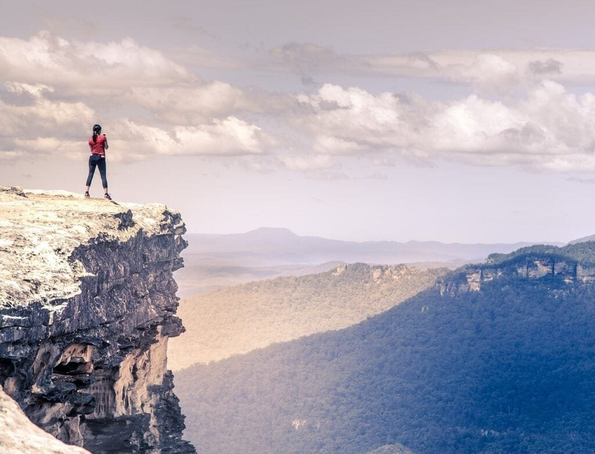
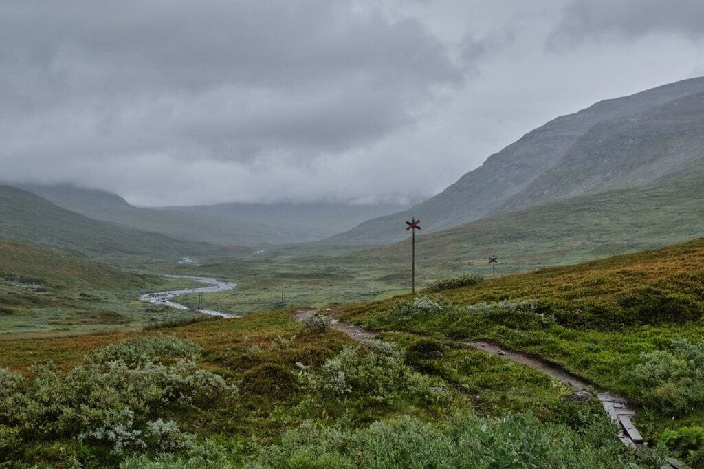
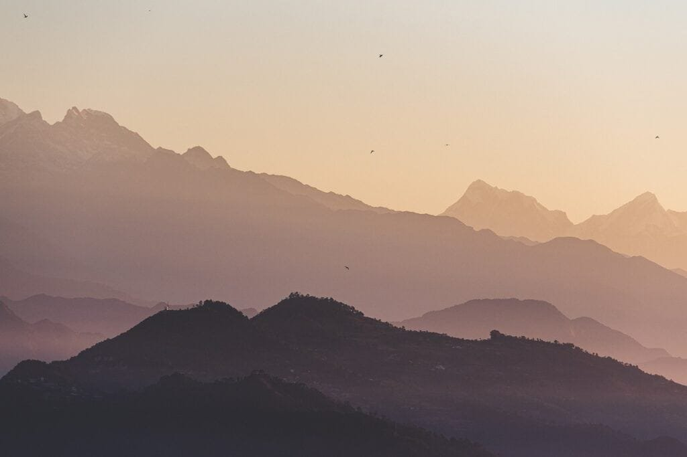

Imagine standing at the edge of a massive crater, feeling the ground rumble beneath your feet as molten lava flows down its sides. Witnessing the raw power and beauty of a volcano is truly a breathtaking experience. From the towering peaks of Mount Kilimanjaro in Tanzania to the sulfurous volcanic fields of Iceland, there are countless opportunities around the world to witness these geological wonders in action. In this article, we will explore the 10 best active volcanoes to witness globally, delving into their unique characteristics and the awe-inspiring sights they offer. So pack your bags, grab your camera, and get ready for an unforgettable adventure to some of the most captivating volcanic landscapes on Earth.

This image is property of pixabay.com.

## Mount Etna, Italy

### Eruption types and frequency

Mount Etna, located on the island of Sicily in Italy, is one of the most active volcanoes in the world. It is known for its frequent eruptions, which occur on average every few years. The volcano has both explosive and effusive eruption types. Explosive eruptions are characterized by the ejection of ash, gases, and pyroclastic material into the air, often accompanied by loud explosions. Effusive eruptions, on the other hand, involve the slow and steady flow of lava down the slopes of the volcano.

### Scenic attractiveness

Mount Etna offers breathtaking views and unique natural beauty. Its majestic slopes are covered in lush forests and vineyards, creating a picturesque landscape. The contrast between the dark volcanic rocks and the vibrant green vegetation is truly stunning. Additionally, the volcano is surrounded by beautiful coastal towns and villages, such as Taormina and Catania, providing visitors with the opportunity to enjoy the scenic charm of the region.

### Accessibility and nearby touristic attractions

Mount Etna is easily accessible, with several routes leading to its summit. Visitors can choose to hike the well-marked trails or take a cable car and then a special 4x4 vehicle for a more comfortable journey. At the summit, there are observation points that offer panoramic views of the volcanic landscape and the surrounding area.

Apart from Mount Etna itself, there are several touristic attractions nearby that are worth exploring. Taormina, a charming town perched on a hilltop, is famous for its ancient Greek theater and beautiful views of the Ionian Sea. Catania, the second-largest city in Sicily, is known for its vibrant street markets and baroque architecture. Additionally, the nearby coastal towns of Giardini Naxos and Aci Trezza offer picturesque beaches and traditional fishing villages to explore.

## Kilauea, Hawaii

### Eruption patterns and history

Kilauea, located on the Big Island of Hawaii, is one of the most active volcanoes in the world. It has been continuously erupting since 1983, making it one of the longest-lasting eruptions in recorded history. The volcano has a unique pattern of activity, with its lava flows primarily moving through a network of underground tubes. This allows the lava to flow over long distances, sometimes reaching the coast and creating new land.

### Unique features of Hawaii's volcanoes

Hawaii's volcanoes, including Kilauea, are known as shield volcanoes. These volcanoes have a gentle slope and are formed by the accumulation of multiple layers of lava flows over time. Unlike the explosive eruptions typically associated with other volcanoes, Hawaii's volcanoes have relatively low-viscosity lava, which allows it to flow more freely and creates spectacular lava fountains and flows.

### Opportunities for witnessing eruptions

Kilauea offers unique opportunities for witnessing volcanic activity up close. The Hawaii Volcanoes National Park, which encompasses Kilauea and the neighboring Mauna Loa volcano, provides visitors with the chance to see the lava flows, volcanic craters, and steam vents. Guided hikes and tours are available, allowing visitors to explore the park while learning about the geology and history of the area. The park also offers viewpoints and overlooks where visitors can safely observe the ongoing volcanic activity.

<iframe width="560" height="315" src="https://www.youtube.com/embed/zQ4QVe34mTk" frameborder="0" allow="accelerometer; autoplay; encrypted-media; gyroscope; picture-in-picture" allowfullscreen></iframe>

  

## Eyjafjallajökull, Iceland

### Infamous 2010 eruption and its global impact

Eyjafjallajökull, located in Iceland, gained worldwide attention with its eruption in 2010. The eruption generated a massive ash cloud that disrupted air travel across Europe for several weeks. The ash cloud, consisting of fine particles of volcanic glass and rock, posed a significant risk to aircraft engines, leading to widespread flight cancellations and airport closures. This event highlighted the vulnerability of modern air travel to volcanic eruptions.

### Volcano's role in shaping Iceland's landscape

Iceland is often referred to as the "Land of Fire and Ice" due to its numerous volcanoes and glaciers. Eyjafjallajökull, with its frequent eruptions, has played a significant role in shaping the country's unique landscape. The volcano sits beneath a glacier, creating a dramatic contrast between the fire of the eruption and the ice of the surrounding ice cap. The lava flows and ash deposits from past eruptions have formed vast lava fields and rich volcanic soil, supporting Iceland's lush vegetation and agriculture.

### Travel and sightseeing opportunities

Eyjafjallajökull offers travelers the opportunity to explore Iceland's stunning natural beauty. The volcano is situated within the Golden Circle, a popular tourist route that includes other notable attractions such as the Geysir geothermal area and the Gullfoss waterfall. Visitors can take guided tours that provide insights into the geology and history of the area while marveling at the breathtaking landscapes. Hiking and glacier tours are also available, allowing adventurers to get up close to the volcano and witness its unique features firsthand.

## Mount Fuji, Japan

### Historic and cultural significance

Mount Fuji, located in Japan, holds immense cultural and spiritual significance. It is the country's tallest peak and has been revered as a sacred site for centuries. The volcano has been a popular subject in Japanese art, literature, and poetry, symbolizing beauty, strength, and transcendence. Mount Fuji's iconic shape, covered in snow for most of the year, is recognized worldwide as a symbol of Japan.

### Eruption record of Mount Fuji

Mount Fuji is currently considered to be in a dormant state, with no recent eruptions. However, the volcano has a history of frequent eruptions, with the last recorded eruption occurring in 1707. These eruptions have shaped the landscape around the volcano and left behind lava flows and ash deposits. Despite its dormant status, Mount Fuji is continuously monitored for any signs of volcanic activity to ensure the safety of visitors and nearby communities.

### Visitor experiences and recommended viewpoints

Mount Fuji attracts millions of visitors each year, drawn by its cultural significance and breathtaking beauty. The volcano is accessible during the summer months, when the climbing season is open. Many visitors choose to climb to the summit, typically starting their ascent from the fifth station on the mountain. The climb can be challenging but offers rewarding views of the surrounding countryside and, on a clear day, even the distant Tokyo skyline. For those who prefer a less strenuous experience, there are also several viewpoints around the mountain that provide stunning vistas of Mount Fuji against the backdrop of the Japanese landscape.

This image is property of pixabay.com.

## Mount Vesuvius, Italy

### History and impact of the AD 79 eruption

Mount Vesuvius, located near Naples, Italy, is infamous for its catastrophic eruption in AD 79. This eruption buried the Roman cities of Pompeii and Herculaneum under layers of ash and pumice, preserving them in remarkable detail for centuries. The eruption was one of the deadliest volcanic disasters in history, claiming the lives of thousands and forever changing the landscape of the region.

### Current state and eruption risk

Mount Vesuvius is still an active volcano, although it has been in a state of dormancy since its last eruption in 1944. It is continuously monitored to assess any potential volcanic activity and eruption risks. The volcano poses a significant threat to the densely populated area surrounding it, and evacuation plans and emergency procedures are in place to ensure the safety of the local population.

### Tourist experience at Vesuvius and Pompeii

Visiting Mount Vesuvius and the nearby archaeological site of Pompeii provides a unique glimpse into the past. Tourists can hike to the summit of Mount Vesuvius and observe the massive crater that remains from past eruptions. From this vantage point, visitors can also enjoy panoramic views of the Bay of Naples and the surrounding countryside. A visit to Pompeii offers the opportunity to explore the well-preserved ancient city and witness the remarkable art, architecture, and daily life of the Roman civilization before the eruption.

## Mount St. Helens, USA

### Devastating 1980 explosion and its effects

Mount St. Helens, located in Washington State, experienced a catastrophic eruption in 1980 that had profound effects on the surrounding area. The eruption, triggered by a massive landslide, caused the entire north face of the mountain to collapse, resulting in a powerful lateral blast that devastated everything in its path. The explosion released a massive plume of ash that reached as far as the central United States and caused significant environmental and economic impacts.

### Current status and monitoring

Mount St. Helens is still an active volcano and is closely monitored by the United States Geological Survey (USGS). The volcano has exhibited periodic activity since the 1980 eruption, including smaller eruptions and the growth of a new lava dome within the crater. The USGS monitors volcanic gas emissions, ground deformation, and [seismic activity](https://magmamatters.com/the-art-and-science-of-volcano-monitoring/ "The Art and Science of Volcano Monitoring") to track any changes in volcanic behavior and to provide advance warning of potential eruptions.

### Visitor guides for Mount St. Helens National Volcanic Monument

The Mount St. Helens National Volcanic Monument offers visitors a variety of activities to explore and learn about the volcano and its eruption. The Johnston Ridge Observatory, located on the north side of the volcano, provides educational exhibits and informative programs that detail the history and science of the 1980 eruption. Visitors can also hike along the trails that offer stunning views of the blast zone and the volcanic crater. The monument is a popular destination for outdoor enthusiasts, offering opportunities for camping, fishing, and wildlife observation in the surrounding area.

This image is property of pixabay.com.

## Mount Bromo, Indonesia

### Volcanic activity and local legends

Mount Bromo, located in East Java, Indonesia, has a rich history of volcanic activity. The volcano is part of the Tengger massif, which consists of several volcanic cones. Mount Bromo is known for its active crater, which emits white smoke continuously. The volcano holds significant cultural and religious importance for the local Tengger people, who believe that it is a sacred site and conduct annual ceremonies and offerings to appease the spirits of the volcano.

### Sunrise viewings and other attractions

One of the main attractions of Mount Bromo is the opportunity to witness a breathtaking sunrise over the volcanic landscape. Visitors can choose to hike to one of the viewpoints near the volcano, such as Mount Penanjakan, where they can experience the awe-inspiring sight of the rising sun illuminating the surrounding mountains and the volcanic crater. In addition to the sunrise viewings, visitors can also explore the sand sea around Mount Bromo, a vast plain of volcanic ash where they can ride horses or take a 4x4 jeep tour.

### Travel preparations and safety advice

Before visiting Mount Bromo, it is important to make necessary travel preparations and be aware of safety precautions. The weather in the area can be cold and windy, so dressing in layers and bringing warm clothing is essential. It is also recommended to wear sturdy footwear and bring a flashlight for hiking in the dark. As with any volcanic area, it is important to heed any warnings or restrictions from local authorities and follow designated trails to ensure visitor safety.

## Popocatépetl, Mexico

### Status and eruption history of this active volcano

Popocatépetl, located in central Mexico, is one of the country's most active volcanoes. Its name, which means "Smoking Mountain" in the indigenous Nahuatl language, reflects its continuous emissions of volcanic gas. Popocatépetl has a long history of eruptions, with the most recent major eruption occurring in 2000. Since then, the volcano has remained active, with periodic eruptions and emissions of ash and gas.

### Cultural significance in Mexico

Popocatépetl holds great cultural and historical significance in Mexico. The volcano is part of the Trans-Mexican Volcanic Belt and is considered sacred by indigenous communities who reside in its vicinity. Legend has it that Popocatépetl and the nearby volcano Iztaccíhuatl were once lovers, and their peaks represent their entwined bodies. The volcano's prominence in Mexican culture is reflected in art, literature, and indigenous rituals that pay homage to its power and beauty.

### Adventurous tours offered

Popocatépetl's active nature offers adventurous travelers the chance to witness its volcanic activity firsthand. Several tour operators provide guided hikes and tours that take visitors to the vicinity of the volcano. These tours offer the opportunity to explore areas with impressive vistas of Popocatépetl and its surrounding landscape while learning about the geology and impact of volcanic activity. It is important to choose a reputable tour operator and follow all safety guidelines provided by the guides to ensure a safe and memorable experience.

## Mount Yasur, Vanuatu

### Eruption styles and hazards

Mount Yasur, located on the island of Tanna in Vanuatu, is known for its persistent Strombolian eruptions. These eruptions are characterized by frequent and relatively mild explosions that eject incandescent lava fragments into the air, creating a spectacular fireworks-like display. However, these eruptions can also pose hazards to visitors, as the volcano's activity can be unpredictable, and volcanic bombs and ash can be expelled from the crater.

### Touristic exploration in South Pacific

Mount Yasur offers a unique opportunity for tourists to explore the volcanic wonders of the South Pacific. The volcano is easily accessible, and guided tours are available to take visitors to the rim of the crater. From this vantage point, visitors can witness the fiery displays of eruptive activity and feel the ground rumble beneath their feet. The surrounding area is also home to lush rainforests, pristine beaches, and traditional villages, providing additional cultural and natural attractions for visitors to enjoy.

### Night-time viewing and nearby attractions

One of the most popular times to visit Mount Yasur is during the night, as the eruptive activity is even more impressive when illuminated by the darkness. Many tour operators offer night-time visits to the volcano, allowing visitors to witness the thrilling displays of molten lava while surrounded by the darkness of the night sky. In addition to Mount Yasur, the island of Tanna offers other attractions such as the underwater wonders of the Blue Cave and the unique cultural experiences of visiting local villages.

## Piton de la Fournaise, Réunion

### Among the world's most active volcanoes

Piton de la Fournaise, located on the island of Réunion in the Indian Ocean, is one of the most active volcanoes on Earth. It has a long history of eruptions, with an average of one eruption per year. The volcano is characterized by its frequent effusive eruptions, which involve the slow and steady flow of lava from the summit or flanks of the volcano. These eruptions provide scientists with valuable opportunities to study volcanic processes and monitor the volcano's behavior.

### Lunar landscapes and hiking routes

Piton de la Fournaise offers visitors the opportunity to explore otherworldly landscapes shaped by its volcanic activity. The volcano's eruptions have created vast lava fields, rugged cliffs, and unusual rock formations, resembling a lunar landscape. Several hiking routes are available, taking visitors through these unique landscapes and offering stunning views of the volcano and the surrounding Indian Ocean. The trails are well-marked and cater to different fitness levels, providing options for both experienced hikers and casual nature enthusiasts.

### How to plan your visit

When planning a visit to Piton de la Fournaise, it is important to consider the volcano's active nature and potential risks. Before setting out on a hike, it is advisable to check the volcano's current activity status and any safety restrictions or warnings issued by the local authorities or the Réunion Volcano Observatory. It is also recommended to be prepared with suitable hiking equipment, including sturdy footwear, sun protection, and plenty of water. Local tourist offices or guides can provide information on the best times to visit and offer guidance on safely exploring the volcano and its surrounding areas.

By exploring these 10 best active volcanoes, you can witness the raw power and beauty of these natural wonders. From the majestic slopes of Mount Etna in Italy to the lunar landscapes of Piton de la Fournaise in Réunion, each volcano offers a unique experience for travelers. Whether you are interested in the geological processes, cultural significance, or simply the breathtaking views, these volcanoes will leave you in awe of the extraordinary forces that shape our planet. So pack your bags, lace up your hiking boots, and embark on an unforgettable journey to witness the mesmerizing beauty of these world-renowned volcanoes.

