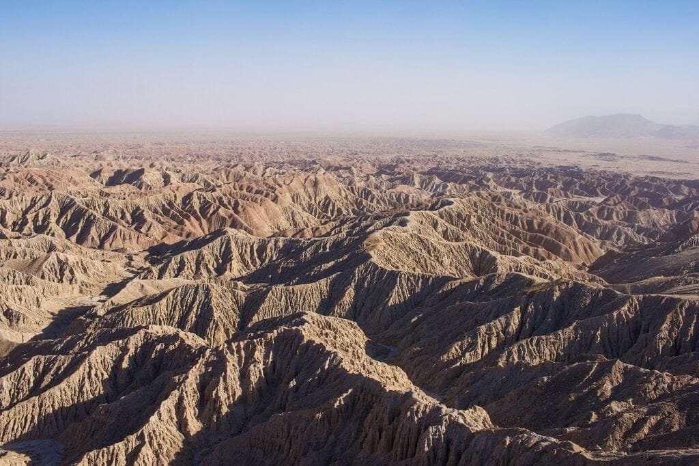
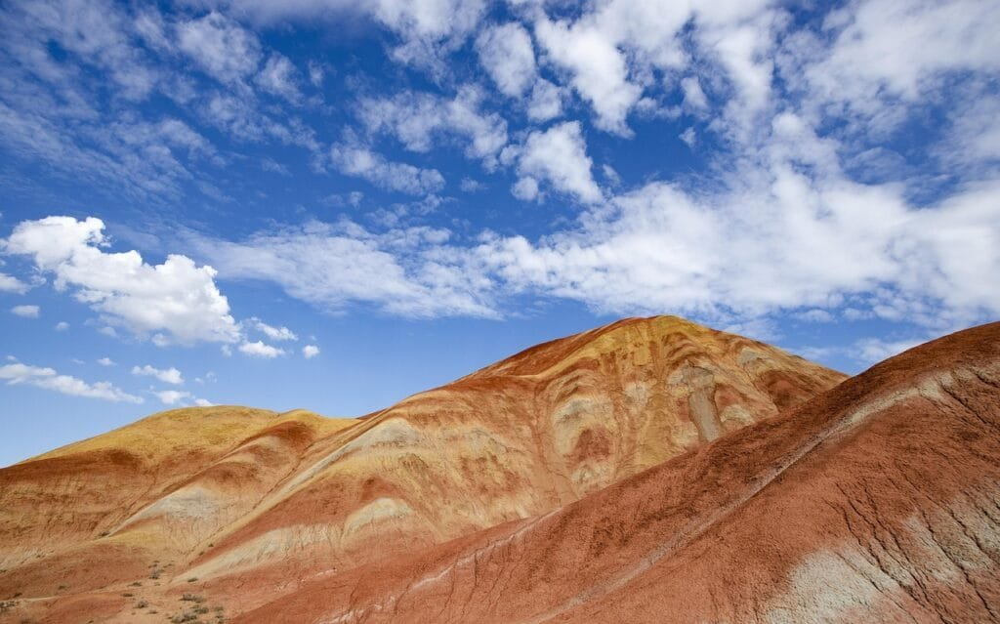

Volcanic rocks have fascinated scientists and explorers for centuries, and for good reason. In this article, we will uncover 10 key facts about these fascinating rocks that will leave you amazed. From understanding how volcanoes are formed to learning about the different types of volcanic eruptions and their impacts, this article aims to provide you with a comprehensive overview of everything you need to know about volcanic rocks. So, get ready to delve into the world of volcanoes and discover the industrial applications that make these rocks even more valuable. Whether you're a geology enthusiast or simply curious about the wonders of nature, this article is sure to captivate your interest.

This image is property of pixabay.com.

## Formation of Volcanic Rocks

### Process of volcanic rock formation

Volcanic rocks are formed through the solidification of molten rock material from volcanic eruptions. When a volcano erupts, hot magma, gases, and debris are released onto the Earth's surface. The magma, which is made up of molten rock, cools rapidly and solidifies, forming volcanic rocks. This process can occur both underwater, resulting in the formation of underwater volcanic rocks, and on land.

### Role of tectonic plates in volcanic rock formation

Tectonic plates play a crucial role in the formation of volcanic rocks. Volcanoes are often found along plate boundaries, especially at subduction zones where one tectonic plate is forced beneath another. The subducting plate sinks into the Earth's mantle, where it heats up and begins to melt, forming magma. This molten rock rises to the surface through cracks and fissures, resulting in volcanic eruptions. The lava and ash from these eruptions solidify and form volcanic rocks.

### Impact of volcanic eruptions on rock formation

Volcanic eruptions have a significant impact on the formation of rocks. The lava expelled during eruptions can flow across the Earth's surface, covering existing rocks and altering their composition. When the lava cools and solidifies, it transforms into volcanic rocks. These rocks can have different textures and compositions depending on the speed and duration of the eruption. The ash and pyroclastic material ejected during volcanic eruptions also contribute to the formation of volcanic rocks. As these materials settle, they can accumulate and consolidate, forming layers of volcanic rocks over time.

## Types of Volcanic Rocks

### Basalt

Basalt is a common type of volcanic rock that forms from the rapid cooling of lava. It is typically dark in color, ranging from black to dark gray. Basalt is fine-grained and can contain small cavities formed by gas bubbles trapped during the eruption. This type of volcanic rock is found in both oceanic and continental regions and is a fundamental component of the Earth's oceanic crust.

### Andesite

Andesite is an intermediate volcanic rock that forms from the cooling of magma enriched in silica. It is typically gray in color and has a medium to fine-grained texture. Andesite can be found in volcanic arcs, subduction zones, and continental volcanic regions. It is often associated with explosive eruptions and is commonly used in construction materials due to its durability.

### Rhyolite

Rhyolite is a light-colored, fine-grained volcanic rock that forms from the rapid cooling of high-silica magma. It is often pink, tan, or gray in color and can contain small crystals embedded within its matrix. Rhyolite is commonly found in volcanic areas with high levels of volcanic activity, such as calderas and volcanic domes. It is known for its explosive eruptions and is used in the production of ceramics and as a decorative stone.

### Scoria

Scoria is a mafic volcanic rock with a vesicular texture, which means it contains numerous small cavities or vesicles. It is typically black or dark brown in color and has a rough, porous surface. Scoria is formed from the rapid cooling of lava with a high gas content, which causes the release of bubbles and the formation of cavities. It is commonly found in cinder cones, lava fields, and other volcanic areas.

### Pumice

Pumice is a light and porous volcanic rock that forms from highly vesicular lava. It is usually light gray or white in color and is known for its low density and ability to float in water. Pumice forms when gas-rich lava rapidly cools and solidifies, trapping the gas bubbles within its structure. It is commonly used in construction materials, horticulture, and as a natural exfoliant in cosmetic products.

### Obsidian

Obsidian is a glassy volcanic rock that forms from rapidly cooled lava. It has a smooth, shiny appearance and is usually black or dark brown in color. Obsidian lacks a crystal structure and is produced when lava with a high silica content cools too quickly for crystals to form. It is commonly used in jewelry, tools, and as a raw material for the production of blades and sharp edges.

<iframe width="560" height="315" src="https://www.youtube.com/embed/VNGUdObDoLk" frameborder="0" allow="accelerometer; autoplay; encrypted-media; gyroscope; picture-in-picture" allowfullscreen></iframe>

  

## Characteristics of Volcanic Rocks

### Texture and composition

Volcanic rocks can have a range of textures, which are determined by the cooling rate of the magma and the amount of gas present. Fine-grained volcanic rocks, such as basalt and andesite, cool rapidly and have a smooth texture. On the other hand, volcanic rocks with larger, visible crystals, such as granite, cool slowly and have a coarse texture. The composition of volcanic rocks can vary, but they are often classified as mafic (rich in magnesium and iron), intermediate, or felsic (rich in silica).

### Density and hardness

The density and hardness of volcanic rocks can vary depending on their composition and the presence of minerals within them. Generally, mafic volcanic rocks like basalt and scoria are denser and harder, while felsic volcanic rocks like rhyolite and obsidian are less dense and softer. Pumice, due to its highly vesicular nature, has low density and is exceptionally light.

### Color variations

Volcanic rocks display a wide range of colors, which are influenced by the minerals present in their composition. Basalt is typically dark gray or black, while andesite can vary from gray to brown. Rhyolite can be pink, tan, or gray, and scoria is often black or dark brown. Pumice is light gray or white, and obsidian is black or dark brown. The color variations in volcanic rocks make them visually appealing and suitable for various uses, from construction materials to decorative purposes.

## Geographical Distribution of Volcanoes

### Volcanoes in the 'Ring of Fire'

The 'Ring of Fire' is a major area in the basin of the Pacific Ocean where numerous volcanic eruptions and earthquakes occur. It is home to approximately 75% of the world's active volcanoes. This region extends from the west coast of the Americas to the east coast of Asia and includes countries such as Chile, Japan, Indonesia, and the Philippines. The high concentration of volcanic activity in the 'Ring of Fire' is primarily due to the subduction of oceanic plates beneath continental plates, creating an environment conducive to volcanic eruptions.

### Hot spot volcanoes

Hot spot volcanoes are formed when a mantle plume, an upwelling of hot material from deep within the Earth, rises to the surface. These plumes generate massive amounts of magma, leading to the formation of volcanic islands or volcanic fields. Examples of hot spot volcanoes include the Hawaiian Islands, the Galapagos Islands, and Iceland. Hot spot [volcanoes](https://magmamatters.com/understanding-volcanic-formation-a-comprehensive-guide/ "Understanding Volcanic Formation: A Comprehensive Guide") are characterized by relatively peaceful eruptions and the formation of shield volcanoes.

### Volcanoes at tectonic rift zones

Tectonic rift zones occur where the Earth's tectonic plates are moving apart. This movement creates tension within the Earth's crust, causing the lithosphere to crack and form a rift. Magma from the mantle rises to fill the rift, resulting in the formation of volcanoes. The East African Rift Zone, for example, is an active region where the African Plate is splitting apart, creating a series of volcanic mountains. Volcanoes in rift zones can have both explosive and effusive eruptions.

This image is property of pixabay.com.

## Eruption Patterns and Their Effects on Volcanic Rocks

### Influence of lava viscosity

The viscosity of lava, a measure of its resistance to flow, plays a significant role in eruption patterns and the formation of volcanic rocks. Lava with low viscosity, such as basaltic lava, flows more easily and tends to result in effusive eruptions. These eruptions produce lava flows that can cover large areas and create extensive volcanic landscapes. Lava with high viscosity, such as rhyolitic lava, is more resistant to flow and tends to result in explosive eruptions. These [eruptions can produce pyroclastic flows](https://magmamatters.com/the-environmental-impact-of-volcanic-eruptions-2/ "The Environmental Impact of Volcanic Eruptions"), ash clouds, and volcanic cones.

### Role of gas content

The gas content of magma also influences eruption patterns and the characteristics of volcanic rocks. Magma contains dissolved gases, predominantly water vapor, [carbon dioxide](https://magmamatters.com/geothermal-energy-and-its-volcanic-origins/ "Geothermal Energy and Its Volcanic Origins"), and sulfur dioxide. As magma rises to the surface, the decreasing pressure causes these gases to come out of the solution and form bubbles. The gas content affects the explosiveness of an eruption. Magma with high gas content tends to produce explosive eruptions, leading to the formation of fragmented volcanic rocks such as scoria and pumice. Magma with low gas content allows for more effusive eruptions and the formation of smoother volcanic rocks such as basalt.

### Impact of eruption type on rock formation

The type of eruption, whether effusive or explosive, has a direct impact on the formation of volcanic rocks. Effusive eruptions, characterized by the relatively gentle flow of lava, result in the formation of volcanic rocks with a fine-grained texture. These rocks, such as basalt and andesite, cool slowly and solidify on the Earth's surface or underwater. Explosive eruptions, on the other hand, generate fragmented volcanic rocks such as scoria and pumice. These rocks form from the rapid cooling of pyroclastic material ejected during the eruption.

## Role of Volcanic Rocks in Soil Fertility

### Nutrient content of volcanic rocks

Volcanic rocks play a crucial role in soil fertility due to their mineral composition. When volcanic rocks weather, they release a range of essential nutrients, including potassium, phosphorus, calcium, and magnesium. These nutrients are crucial for plant growth and are often deficient in soils. Volcanic rocks, such as basalt, contain minerals that slowly release these nutrients over time, replenishing the soil and supporting plant growth.

### Volcanic rock weathering contribution to soil fertility

The weathering of volcanic rocks contributes to soil fertility through a process known as tropical or subtropical weathering. As volcanic rocks break down over time, they release minerals and nutrients into the soil, enriching its composition. The fine-grained texture of volcanic rocks allows for a larger surface area, facilitating the chemical reactions involved in weathering. The weathered volcanic rock material also helps improve soil structure and water retention, enhancing its overall fertility and productivity.

This image is property of pixabay.com.

## Volcanic Rocks and Natural Disasters

### Volcanic hazards associated with rock eruptions

Volcanic eruptions can pose various hazards to human populations and the surrounding environment. These hazards include pyroclastic flows, volcanic ashfall, lahars (mudflows), [volcanic gases](https://magmamatters.com/the-art-and-science-of-volcano-monitoring/ "The Art and Science of Volcano Monitoring"), and volcanic landslides. Pyroclastic flows are fast-moving currents of hot gas and volcanic debris that can destroy everything in their path. Volcanic ashfall can cause respiratory problems and disrupt air travel. Lahars are mudflows composed of volcanic ash and water, which can be triggered by heavy rain or melting ice and pose a significant threat to communities downstream. Volcanic gases, such as sulfur dioxide, can lead to acid rain and other harmful environmental effects. Volcanic landslides, triggered by eruptions or other processes, can cause massive destruction in volcanic areas.

### Mitigation of risks associated with volcanic rocks

Efforts to mitigate the risks associated with volcanic rocks and volcanic eruptions involve a combination of monitoring, early warning systems, and community preparedness. Monitoring techniques, including seismic activity measurement, volcanic gas monitoring, and ground deformation analysis, help scientists predict volcanic activity and provide timely warnings to at-risk communities. Early warning systems alert residents and authorities to potential eruptions, enabling them to evacuate and take necessary precautions. Community preparedness involves educating residents about volcanic hazards, developing evacuation plans, and establishing emergency response procedures. Improved understanding of volcanic rocks and their behavior is crucial for effective risk mitigation strategies.

## Industrial Applications of Volcanic Rocks

### Use in construction materials

Volcanic rocks have been used for centuries in construction materials due to their durability and aesthetic appeal. Basalt, due to its strength and resistance to weathering, is commonly used as a building material for roads, pavements, and even architectural structures. Rhyolite and andesite are also used in construction, particularly for decorative purposes such as cladding facades and creating ornamental features. The porous nature of volcanic rocks, such as pumice, also makes them suitable as lightweight aggregates in concrete and insulating materials.

### Agricultural applications

Volcanic rocks can be used in agriculture to improve soil fertility and crop productivity. Rock dust, derived from finely ground volcanic rocks, is rich in minerals and nutrients essential for plant growth. It can be applied to soils as a natural fertilizer, slowly releasing nutrients over time. The addition of rock dust to agricultural soils helps replenish nutrient levels, enhance soil structure, and promote the growth of healthy crops. Additionally, volcanic rocks can act as a soil amendment to adjust pH levels in acidic soils, making them more suitable for plant cultivation.

### Cosmetic industry uses

Volcanic rocks, particularly pumice and volcanic ash, are widely used in the cosmetic industry. The abrasive texture of pumice makes it an excellent natural exfoliant in skincare products, such as body scrubs and foot treatments. Volcanic ash, rich in minerals and antioxidants, is incorporated into facial masks and cleansers to detoxify the skin and improve its overall appearance. The benefits of volcanic rocks in cosmetics stem from their ability to gently remove dead skin cells, unclog pores, and promote skin renewal.

## Volcanic Rocks and Archaeology

### Historical use of volcanic rocks

Throughout history, volcanic rocks have been utilized by various civilizations for a wide range of purposes. The ancient Romans, for example, used volcanic rock in the construction of architectural structures, such as the Colosseum and the aqueducts. The Maya civilization in Central America also made extensive use of volcanic rock in the construction of temples, palaces, and other monumental structures. The durability and abundance of volcanic rocks made them a valuable resource for architectural and sculptural purposes.

### Volcanic rock in artifact dating

Volcanic rocks provide valuable clues for determining the age of archaeological artifacts. When lava flows over an archaeological site, it can cover and preserve artifacts, protecting them from weathering and decay. By dating the volcanic rock layer using radiometric dating techniques, archaeologists can establish a minimum age for the artifacts found beneath it. This allows for a better understanding of the chronology and development of ancient civilizations. The presence of volcanic rock layers can also provide insights into the environmental conditions and volcanic activity that occurred during specific time periods.

## Conservation and Sustainable Use of Volcanic Rocks

### Environmental impact of mining volcanic rocks

The extraction of volcanic rocks for various industrial purposes can have environmental impacts. Mining operations can disrupt ecosystems, displace wildlife, and cause habitat destruction. The extraction process itself can result in noise and air pollution, as well as the consumption of large amounts of energy and water. Additionally, improper disposal of mining waste can contaminate water sources and degrade surrounding lands. To mitigate these impacts, responsible mining practices, such as reclamation and rehabilitation of mined areas, can be implemented to restore ecosystems and minimize environmental degradation.

### Practices for sustainable use of volcanic rock resources

To ensure the sustainable use of volcanic rock resources, several practices can be implemented. This includes the promotion of recycling and reuse of volcanic rocks to minimize the need for excessive extraction. Choosing alternative materials when possible, such as using recycled aggregates in construction, can help reduce the demand for raw volcanic rocks. Implementing stricter regulations and guidelines for mining operations can ensure the protection of ecosystems and minimize environmental impacts. Engaging local communities in decision-making processes and providing them with support and alternatives can also contribute to the sustainable management of volcanic rock resources.

