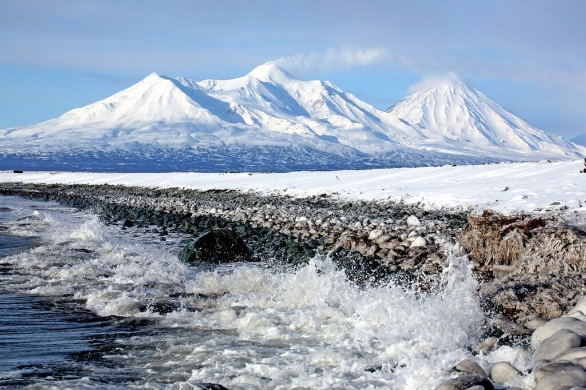
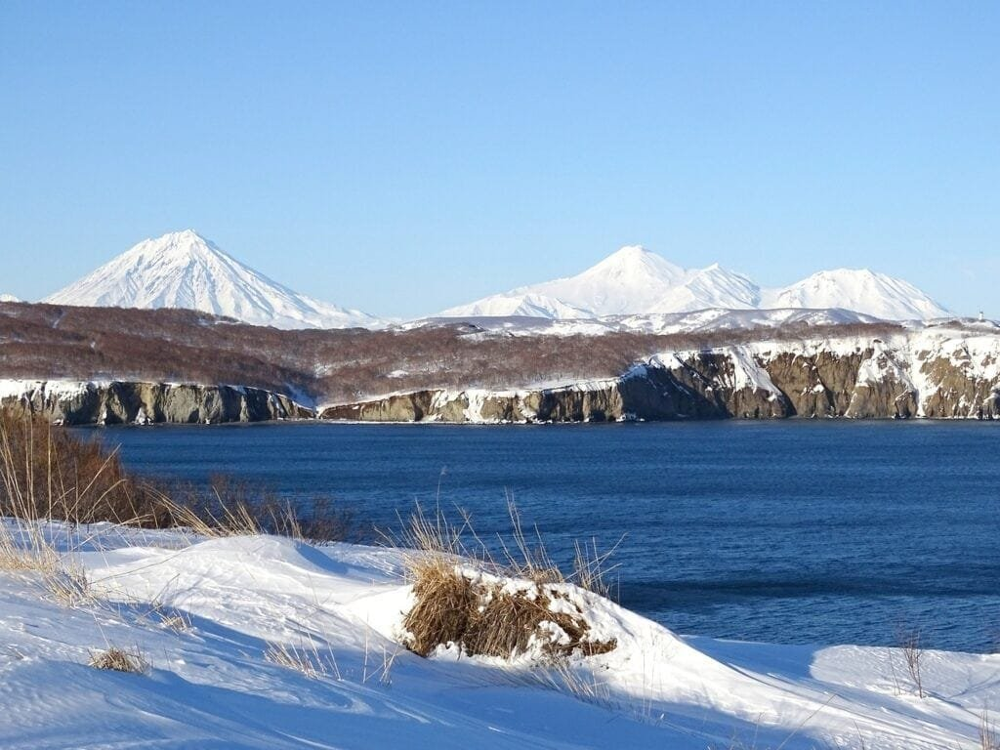
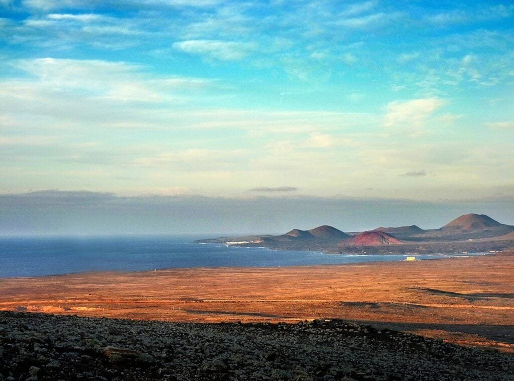

If you have ever been fascinated by the awe-inspiring power of volcanoes and their impact on our planet, then exploring submarine volcanoes is an adventure you won't want to miss. These natural wonders, formed when molten rock and gases escape to the ocean floor, not only provide valuable insights into the Earth's geological processes but also play a crucial role in supporting diverse and fragile ocean ecosystems. In this article, we will share ten essential tips for exploring submarine volcanoes, while also highlighting the importance of protecting these delicate marine habitats. So grab your diving gear and let's embark on an unforgettable journey beneath the waves!

This image is property of pixabay.com.

## Understanding Submarine Volcanoes

Submarine volcanoes, as the name suggests, are volcanoes that are located underwater. These volcanoes are formed when magma - molten rock beneath the Earth's surface - rises to the ocean floor and erupts. The process of formation is similar to that of terrestrial volcanoes, but the key difference is the presence of water. The interaction between magma and water leads to unique characteristics and eruption styles.

## Formation process of these volcanoes

The formation process of submarine volcanoes begins with the movement of tectonic plates beneath the ocean. When these plates separate or collide, magma from the Earth's mantle can rise to the surface. As the magma reaches the ocean floor, the surrounding seawater cools it rapidly, causing it to solidify. This solidified lava forms layers over time, building up the shape of the submarine volcano.

This image is property of pixabay.com.

## Comparison between submarine volcanoes and terrestrial volcanoes

While submarine volcanoes share many similarities with their terrestrial counterparts, they also have distinct differences. One significant difference is the cooling rate of the lava. Underwater eruptions cool lava more quickly, resulting in the formation of pillow lava formations. On land, the lava cools more slowly, leading to the formation of different types of solidified lava flows, such as basalt or andesite. Additionally, the water surrounding submarine volcanoes can change the behavior and the chemistry of the eruptions, creating unique underwater geological features.

## Exploration Techniques for Submarine Volcanoes

Exploring submarine volcanoes is a challenging task due to their remote and underwater location. However, advancements in technology have opened up new possibilities for scientists to study these volcanoes.

### Using advanced technologies like remotely operated vehicles (ROVs)

One of the most effective exploration techniques for submarine volcanoes involves the use of remotely operated vehicles (ROVs). These specially designed robots can be operated from the surface and can withstand the high-pressure environments of the deep-sea. Equipped with cameras, sampling tools, and manipulator arms, ROVs allow researchers to capture high-resolution images, collect samples, and study the geological features of submarine volcanoes.

### Application of sound navigation and ranging (sonar)

Another technique used in exploring submarine volcanoes is the application of sound navigation and ranging, commonly known as sonar. By emitting sound waves and analyzing their reflections, scientists can create detailed maps of the seafloor. Sonar technology helps to identify and locate underwater volcanic structures, providing valuable information on the size, shape, and distribution of submarine volcanoes.

### Utilizing fiber optic sensors to detect volcanic activity patterns

Fiber optic sensors are emerging as a promising tool for monitoring and detecting volcanic activity patterns in submarine volcanoes. These sensors are capable of detecting subtle changes in temperature and pressure, which are indicators of volcanic activity. By installing fiber optic cables in strategic locations around submarine volcanoes, scientists can gather continuous data and gain insights into the dynamic behavior of these volcanoes.

This image is property of pixabay.com.

## Importance of Exploring Submarine Volcanoes

While exploring submarine volcanoes may seem like an esoteric pursuit, it holds significant importance for several key reasons.

### Explaining how these volcanoes impact ocean chemistry

Submarine volcanoes release various gases and chemicals into the water, altering the chemistry of the surrounding ocean. By studying these volcanic processes, scientists can gain a deeper understanding of how the release of minerals, metals, and nutrients from submarine volcanoes impact ocean chemistry. This knowledge is crucial for understanding the delicate balance of marine ecosystems and the factors that contribute to their health and biodiversity.

### Understanding their role in climate change

Submarine [volcanoes play a role in climate change](https://magmamatters.com/geothermal-energy-and-its-volcanic-origins/ "Geothermal Energy and Its Volcanic Origins") through the release of greenhouse gases, particularly carbon dioxide. While the contribution of submarine [volcanoes to global carbon dioxide](https://magmamatters.com/the-art-and-science-of-volcano-monitoring/ "The Art and Science of Volcano Monitoring") emissions is relatively small compared to human activities, studying their emissions can provide valuable insights into Earth's natural carbon cycle. By understanding the connection between submarine volcanoes and climate change, researchers can refine climate models and predictions.

### Studying the unique ecosystems around these volcanoes

Submarine volcanoes create unique habitats that support a variety of organisms. These extreme environments are home to diverse and specialized species that have adapted to survive in the challenging conditions near the volcanic vents. By exploring these ecosystems, scientists can gain insight into the adaptability of life and uncover potential applications for medical and technological advancements. Additionally, understanding these ecosystems is essential for their conservation and the preservation of biodiversity in the world's oceans.

## Protecting Ocean Ecosystems around Submarine Volcanoes

The ecosystems surrounding submarine volcanoes are fragile and vulnerable to various threats. It is crucial to establish measures for their protection and conservation.

### Examining the threats to these ecosystems

Submarine volcanic ecosystems face threats from human activities such as deep-sea mining, oil and gas exploration, and commercial fishing. These activities can disrupt the delicate balance of the ecosystem, damage habitats, and harm the unique species that depend on the volcanic vents for survival. Understanding these threats is vital for implementing effective conservation strategies.

### Developing strategies for the conservation of these habitats

Conserving the ecosystems around submarine volcanoes requires collaborative efforts from scientists, policymakers, and stakeholders. It is essential to establish protected areas and regulations that restrict harmful activities in these areas. Additionally, raising awareness about the ecological importance of these habitats can help garner public support for their conservation and sustainable management.

### Role of international cooperation in preserving these ecosystems

Preserving the ecosystems around submarine volcanoes necessitates international cooperation. Given the global nature of the oceans, it is crucial for countries to work together to establish guidelines, share research, and coordinate conservation efforts. International agreements and organizations can play a vital role in promoting collaboration and ensuring the long-term preservation of these unique ecosystems.

## Safety Measures for Submarine Volcano Exploration

Exploring submarine volcanoes is inherently risky due to the remote and hazardous nature of the underwater environment. Implementing safety measures is crucial to ensure the well-being of researchers and minimize the potential risks associated with deep-sea exploration.

### Understanding the hazards associated with deep-sea exploration

Deep-sea exploration entails various hazards, including high-pressure environments, extreme temperatures, and limited visibility. Researchers must be aware of these hazards and undergo specialized training to mitigate risks. Understanding the potential dangers is essential for developing effective safety protocols.

### Implementing protocols for personal safety

To ensure personal safety during submarine volcano exploration, researchers must follow strict protocols. These protocols include using appropriate protective equipment, adhering to established safety guidelines, and monitoring the physical and mental well-being of the team members. Regular safety drills and communication protocols are also vital for emergency preparedness.

### Using technology to minimize human exposure to hazardous environments

To minimize human exposure to hazardous environments, technology plays a crucial role. Remotely operated vehicles (ROVs) and autonomous underwater vehicles (AUVs) allow scientists to explore submarine volcanoes without direct human presence. These robotic tools can withstand extreme conditions and collect valuable data while reducing the risks associated with human exploration.

## Examining the Role of Submarine Volcanoes in Nutrient Cycling

Understanding the role of submarine volcanoes in nutrient cycling is essential for comprehending the intricate processes that support marine biodiversity and primary production.

### How submarine volcanoes influence nutrient distribution in the ocean

Submarine volcanoes release minerals and other nutrients into the surrounding water through volcanic eruptions and hydrothermal vents. These nutrients, including nitrogen, phosphorus, and iron, are essential for biological processes and play a crucial role in supporting marine life. The volcanic inputs can enrich nutrient-depleted areas of the ocean, fueling the growth of phytoplankton and other primary producers.

### Understanding the significance of this nutrient cycling for marine biodiversity

Nutrient cycling facilitated by submarine volcanoes has significant implications for marine biodiversity. The availability of nutrients influences the productivity and diversity of marine ecosystems. Phytoplankton blooms, fueled by volcanic inputs, form the base of the food chain, supporting a wide range of organisms, from small zooplankton to large marine mammals. Thus, understanding the nutrient cycling processes driven by submarine volcanoes is key to appreciating the complexity and interconnectedness of marine life.

### Role of these volcanoes in supporting primary production in the ocean

Submarine volcanoes contribute to primary production in the ocean by supplying nutrients that are essential for the growth of photosynthetic organisms. The increased availability of nutrients near volcanic vents promotes the growth and proliferation of phytoplankton and other autotrophic organisms. The enhanced primary production, in turn, supports the entire food web, sustaining the diverse array of marine species that rely on these resources for survival.

## Studying the Unique Biodiversity around Submarine Volcanoes

The unique ecosystems around submarine volcanoes host a remarkable biodiversity that thrives in extreme and challenging conditions.

### Identifying unique species living near these volcanoes

Scientists have discovered numerous unique species in the vicinity of submarine volcanoes. These organisms, such as deep-sea tube worms, vent crabs, and giant clams, have adapted to the extreme environments near the volcanic vents. They possess specialized adaptations that enable them to survive in the high temperatures, high pressures, and chemical-rich waters surrounding the volcanoes. Studying these species helps to unravel the mysteries of extreme adaptation and evolution.

### Understanding how these species adapt to extreme environments

The extreme environments around submarine volcanoes pose various challenges to the organisms that inhabit them. The species living in these conditions have evolved remarkable adaptations to survive and thrive. These adaptations include heat resistance, chemical tolerance, and symbiotic relationships with bacteria that enable them to utilize the available resources efficiently. Detailed studies of these adaptations provide valuable insights into the limits of life on Earth and the potential for life in extreme environments elsewhere in the universe.

### Importance of this biodiversity for the overall health of the ocean ecosystem

The biodiversity found around submarine volcanoes plays a crucial role in maintaining the overall health of the ocean ecosystem. These unique species form intricate ecological networks and contribute to nutrient cycling, energy flow, and ecosystem resilience. The loss of any species within these ecosystems can have cascading effects on the entire food web and disrupt the delicate balance of the marine environment. Protecting this biodiversity is essential for preserving the health and stability of the world's oceans.

## Documenting and Mapping Submarine Volcanoes

Documenting and mapping submarine volcanoes is an essential step in understanding their characteristics, distribution, and potential impact.

### Techniques used for mapping these volcanoes

Mapping submarine volcanoes requires the use of advanced techniques and equipment. Multibeam sonar systems provide high-resolution bathymetric data, allowing scientists to create detailed maps of the volcanic structures on the seafloor. Additionally, side-scan sonar and imaging systems can capture images of the geological features and identify distinct volcanic formations. Combining these techniques with the analysis of sediment samples helps researchers gain a comprehensive understanding of the geology and morphology of submarine volcanoes.

### Importance of accurate mapping for further study and conservation

Accurate mapping of submarine volcanoes is crucial for further scientific study and conservation efforts. Detailed maps provide a foundation for analyzing the geological processes, identifying potential eruption sites, and predicting volcanic hazards. These maps also help scientists assess the vulnerability of surrounding ecosystems and develop targeted conservation strategies. Accurate mapping serves as a baseline for monitoring changes over time and evaluating the effectiveness of conservation measures.

### Challenges in documenting and monitoring undersea volcanic activity

Documenting and monitoring undersea volcanic activity is a challenging endeavor due to the remote and dynamic nature of submarine volcanoes. The deep-sea environment presents logistical difficulties, including high pressures, extreme temperatures, and limited access. Additionally, volcanic activity can be episodic and unpredictable, making continuous monitoring a complex task. Overcoming these challenges requires innovative technologies, international collaboration, and long-term commitment to studying these unique geological features.

## Promoting Awareness about Submarine Volcanoes and Ocean Ecosystems

Promoting awareness about submarine volcanoes and ocean ecosystems is crucial for fostering understanding, conservation, and sustainable management of marine resources.

### Involvement of the public in data gathering and conservation efforts

Engaging the public in data gathering and conservation efforts can significantly enhance understanding and create a sense of ownership and responsibility towards ocean ecosystems. Citizen science projects, where the public contributes to data collection and analysis, provide valuable insights while building a connection between individuals and the marine environment. By involving the public, scientists can gather large amounts of data, promote awareness, and foster appreciation for submarine volcanoes and the importance of ocean conservation.

### Integrating education about ocean conservation into the public curriculum

Integrating education about ocean conservation into the public curriculum is an effective way to promote awareness and inspire future generations to protect the marine environment. By educating students about the ecological importance of submarine volcanoes, their unique ecosystems, and the threats they face, schools can instill a sense of stewardship and responsibility towards the oceans. Furthermore, integrating ocean-focused topics into various subjects, such as science, geography, and social studies, can foster interdisciplinary learning and encourage a holistic understanding of marine conservation issues.

### Importance of public awareness in maintaining healthy marine ecosystems

Public awareness plays a vital role in maintaining healthy marine ecosystems. When individuals are informed about the ecological significance of submarine volcanoes and the importance of ocean conservation, they can make conscious choices to minimize their impact on the marine environment. By supporting sustainable fishing practices, reducing plastic consumption, and advocating for marine protected areas, individuals can contribute to the preservation of submarine volcanic ecosystems and the overall health of the oceans.

## Future Prospects in Submarine Volcano Research

Research on submarine volcanoes is an ever-evolving field, and ongoing advancements in technology and scientific understanding offer exciting prospects for the future.

### Potential new technologies for exploring these volcanoes

Continued development of technology holds great potential for advancing our exploration of submarine volcanoes. Miniaturized sensors, autonomous underwater vehicles, and more sophisticated ROVs are among the potential future technologies that can revolutionize the way we study these underwater geological features. These advancements will enable scientists to collect more precise data and gain deeper insights into the processes occurring within submarine volcanoes.

### Anticipated developments in understanding the role of these volcanoes in Earth's climate

As research on submarine volcanoes progresses, scientists anticipate further developments in understanding the role of these volcanoes in Earth's climate. By studying the emissions of gases and particulates from submarine volcanic eruptions, researchers can refine their understanding of the impact of these phenomena on climate patterns and global environmental changes. This knowledge will contribute to more accurate climate models and predictions, ultimately leading to better climate change mitigation and adaptation strategies.

### Predictions for how research on these ecosystems might influence marine conservation strategies

Research on submarine volcanoes and the unique ecosystems they harbor will likely have a significant influence on marine conservation strategies. The insights gained from studying these extreme environments can inform the establishment of marine protected areas, guiding policymakers in designating conservation zones that adequately protect submarine volcanic habitats. Furthermore, the development of sustainable ocean management practices can benefit from the understanding of the ecological interdependencies and biodiversity hotspots associated with submarine volcanoes.

In conclusion, exploring submarine volcanoes is crucial for understanding Earth's geological processes, studying unique ecosystems, and conserving marine biodiversity. Through advanced technologies, global collaboration, and public awareness, we can unlock the mysteries of these extraordinary underwater features and ensure the long-term health and sustainability of our oceans. With the ongoing research and the anticipation of future developments, the study of submarine volcanoes promises exciting opportunities for scientific discovery and environmental stewardship.

