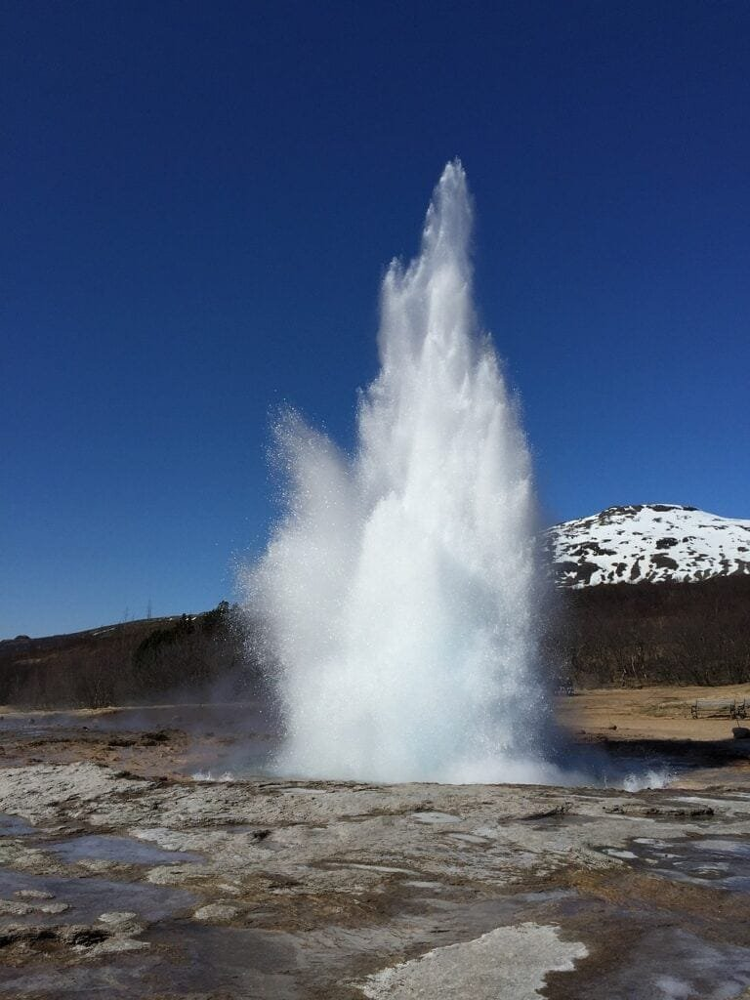

Are you interested in harnessing the power of volcanic geothermal energy? Volcanoes, with their explosive eruptions and powerful forces of nature, hold the potential to provide a sustainable source of energy. In this article, we will explore ten tips to overcome the challenges associated with harnessing volcanic geothermal energy. From understanding the different types of volcanoes to mitigating the risks and maximizing the benefits, we will delve into the world of geothermal energy and provide you with valuable insights to tap into this incredible resource. So, get ready to discover how you can make the most of the power beneath our feet.

This image is property of pixabay.com.

## Understanding Volcanic Geothermal Energy

Volcanic geothermal energy refers to the harnessing of heat energy generated by the Earth's volcanic activity. Geothermal energy is a renewable source of energy that utilizes the [natural](https://magmamatters.com/the-art-and-science-of-volcano-monitoring/ "The Art and Science of Volcano Monitoring") heat from the Earth's core. It is a clean and sustainable alternative to traditional fossil fuel-based energy sources. By [understanding the process and benefits of volcanic](https://magmamatters.com/understanding-volcanic-formation-a-comprehensive-guide/ "Understanding Volcanic Formation: A Comprehensive Guide") geothermal energy, we can explore its potential for widespread use.

### Clarifying what geothermal energy is

Geothermal energy is the heat energy stored within the Earth's crust that can be harnessed and used to generate electricity or heat buildings. It is a renewable and environmentally friendly source of energy that does not produce greenhouse gas emissions or contribute to [climate change](https://magmamatters.com/geothermal-energy-and-its-volcanic-origins/ "Geothermal Energy and Its Volcanic Origins"). Geothermal energy is derived from the natural processes of radioactive decay and heat conduction within the Earth.

### Discussing the relationship between volcanoes and geothermal energy

Volcanoes are closely related to geothermal energy because they are manifestations of the Earth's internal heat. Volcanic activity occurs when molten rock, gases, and debris reach the Earth's surface, causing eruptions of lava and ash. These eruptions are a result of the intense heat generated within the Earth's mantle and its interaction with the Earth's tectonic plates.

### Explaining how geothermal energy is harnessed from volcanic areas

Geothermal energy is harnessed from volcanic areas by drilling deep into the Earth's crust to access hot water or steam reservoirs. This hot water or steam is then used to drive turbines, which generate electricity. Geothermal power plants can either be dry steam, flash steam, or binary cycle plants, depending on the type of resource available. In dry steam plants, steam directly powers the turbines. Flash steam plants use high-pressure, high-temperature water that is flashed into steam to drive the turbines. Binary cycle plants use lower temperature water or brine, which is passed through a heat exchanger to vaporize a secondary fluid to drive the turbines.

<iframe width="560" height="315" src="https://www.youtube.com/embed/wXR6Vi_dHUY" frameborder="0" allow="accelerometer; autoplay; encrypted-media; gyroscope; picture-in-picture" allowfullscreen></iframe>

  

## Identifying Volcanic Geothermal Energy Sites

To identify potential geothermal energy sites, it is essential to understand the location of known geothermal resources and the geological conditions that facilitate their existence. By pinpointing these areas, we can determine the most viable locations for geothermal energy development.

### Discussing the location of known geothermal resources

Known geothermal resources are primarily found in areas with high volcanic activity, such as the "Ring of Fire," which encircles the Pacific Ocean. This region is known for its abundance of volcanic eruptions, making it an ideal location for geothermal energy harnessing. Other volcanic regions, such as the Yellowstone Caldera in the United States, also have significant geothermal resources. Additionally, regions with active or dormant volcanoes, geothermal hot springs, and geysers can be indicators of potential geothermal energy sites.

### Explaining how to identify potential geothermal energy sites

Identifying potential geothermal energy sites involves studying the geological characteristics of an area. Geologists and geothermal experts analyze factors such as the presence of volcanic activity, heat flow, subsurface temperature gradients, and the availability of groundwater. They also conduct surveys to locate potential reservoirs of hot water or steam that can be used to generate geothermal energy. Geological mapping, geophysical surveys, and geochemical analysis are some techniques used to identify suitable sites for geothermal energy development.

This image is property of pixabay.com.

## Analyzing the Potential of Volcanic Geothermal Energy

Analyzing the potential of volcanic geothermal energy requires an exploration and assessment of the geothermal resources available in a particular area. This involves measuring the energy potential of identified volcanic sites and conducting feasibility studies to determine their viability for development.

### Exploration and assessment of volcanic geothermal energy sources

Exploration involves collecting data on temperature gradients, subsurface geology, and fluid flow to understand the geothermal energy potential of a site. Geological surveys, seismic data analysis, and drilling are conducted to assess the resource size, temperature, and permeability of the geothermal reservoirs. These assessments help determine whether a site has the potential to produce sufficient heat for energy extraction.

### Measuring the energy potential of identified volcanic sites

The energy potential of identified volcanic sites is determined by measuring the temperature and flow rate of the geothermal resource. This is done through test drilling and sampling of the geothermal fluid. The volume and temperature of the fluid, as well as its chemical composition, provide valuable information about the energy potential of a site. By analyzing these factors, experts can estimate the potential electricity generation capacity and the heat output of the geothermal reservoir.

### Conducting feasibility studies for potential development

Feasibility studies are crucial in evaluating the technical, economic, and environmental aspects of developing a geothermal energy project. These studies analyze the available data to determine factors such as well depth, drilling costs, power generation capacity, and potential environmental impacts. Feasibility studies also consider the market demand for geothermal energy, potential revenue streams, and the regulatory framework for geothermal energy development. By conducting comprehensive feasibility studies, developers can make informed decisions about the viability and profitability of a geothermal energy project.

This image is property of pixabay.com.

## Investing in Volcanic Geothermal Energy

Investing in volcanic geothermal energy requires an understanding of the costs involved, funding opportunities, and the potential returns on investment. By assessing these factors, stakeholders can make informed decisions about supporting and investing in geothermal energy projects.

### Understanding the costs involved with volcanic geothermal energy

The costs involved in volcanic geothermal energy projects encompass exploration, drilling, power plant construction, and operation and maintenance. Exploration costs include geophysical surveys, drilling, and data collection to determine the resource potential. Drilling costs vary depending on the depth and geological characteristics of the site. Power plant construction costs involve the installation of turbines, generators, and infrastructure. Operation and maintenance costs include ongoing monitoring, maintenance of equipment, and labor expenses. It is essential to consider these costs when assessing the financial viability of geothermal energy projects.

### Discussing funding opportunities for the development of volcanic geothermal energy

Funding opportunities for volcanic geothermal energy projects can come from various sources, including government grants, private investments, and international development funds. Governments often provide financial incentives, tax credits, or loan guarantees to support geothermal energy development. Private investors can also fund geothermal projects through equity investments or project financing. International organizations such as the World Bank and the United Nations may offer grants and loans for renewable energy projects in developing countries. Exploring these funding opportunities can help developers secure the capital needed for geothermal energy projects.

### Assessing the returns on investment for geothermal energy production

The returns on investment for geothermal energy production depend on factors such as the resource quality, electricity generation capacity, market demand, and operating costs. Geothermal power plants have a relatively long lifespan and can provide a consistent and stable source of revenue over their operational years. The return on investment is influenced by factors such as the feed-in tariff, power purchase agreements, and the competitiveness of geothermal energy compared to other energy sources. By conducting thorough financial analysis and considering market conditions, developers and investors can assess the potential returns on investment and make informed decisions about geothermal energy projects.

Continue to Part 2.

