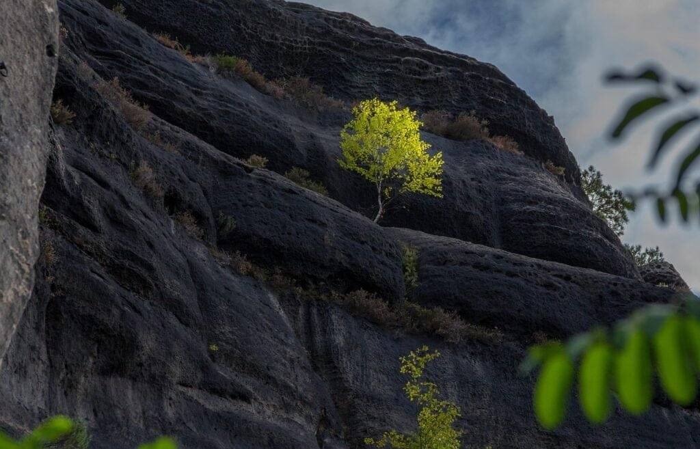

Are you fascinated by volcanoes and the rocks they produce? Whether you're an amateur geologist or simply curious about the world around you, being able to identify different types of volcanic rocks can be a fascinating and rewarding skill. With 10 tips on density and types of volcanic rocks, you'll learn how to distinguish between the various rock formations that result from volcanic activity. From the smooth and glassy obsidian to the porous and light pumice, this article will equip you with the knowledge to confidently identify and appreciate the diverse range of volcanic rocks. So, grab your magnifying glass and get ready to embark on a volcanic rock identification adventure!

<iframe width="560" height="315" src="https://www.youtube.com/embed/CeuYx-AbZdo" frameborder="0" allow="accelerometer; autoplay; encrypted-media; gyroscope; picture-in-picture" allowfullscreen></iframe>

  

## Understanding the Formation of Volcanic Rocks

### Role of Volcano in Rock Formation

Volcanic rocks are formed through the eruption of volcanoes. [Volcanoes are geological](https://magmamatters.com/geothermal-energy-and-its-volcanic-origins/ "Geothermal Energy and Its Volcanic Origins") features that occur when molten rock, gases, and debris escape to the Earth's surface, resulting in eruptions of lava and ash. The formation of volcanic rocks begins with the movement of tectonic plates, which can cause magma to rise to the Earth's surface. This magma is then expelled through the volcano's vent during an eruption.

The role of a volcano in rock formation is crucial. Volcanic eruptions provide a pathway for magma to reach the Earth's surface, allowing it to cool and solidify quickly. This rapid cooling process determines the type and texture of the resulting volcanic rock. The [type of volcano](https://magmamatters.com/understanding-volcanic-formation-a-comprehensive-guide/ "Understanding Volcanic Formation: A Comprehensive Guide") and the characteristics of the eruption, such as the viscosity of the lava and the gas content, also impact the formation of volcanic rocks.

### Types of Volcanic Eruptions and their Impact on Rock Type

There are different types of volcanic eruptions, each characterized by its own unique features. These eruption types include effusive eruptions, explosive eruptions, and phreatomagmatic eruptions.

Effusive eruptions occur when low-viscosity lava flows out of the volcano, forming extensive lava fields. These eruptions are often associated with shield volcanoes and result in the formation of basaltic rocks. Basaltic rocks have a fine-grained texture and are rich in iron and magnesium.

Explosive eruptions, on the other hand, involve the ejection of fragmented magma and volcanic ash into the atmosphere. These eruptions occur when high-viscosity lava and gas are trapped within the volcano, resulting in explosive release of pressure. The rocks formed during explosive eruptions are typically andesitic or rhyolitic in composition and have a variety of textures, ranging from fine-grained to glassy.

Phreatomagmatic eruptions are caused by the interaction between water and magma. When magma comes into contact with water, it can cause explosive eruptions. These eruptions can produce a variety of volcanic rocks depending on the composition of the magma and the water involved.

The type of volcanic eruption plays a significant role in determining the type of volcanic rock that is formed. The composition of the magma, the presence of water, and the gas content all contribute to the characteristics of the resulting volcanic rocks.

### Effects of Lava Viscosity and Gas Content on Rock Formation

Lava viscosity and gas content are two important factors that influence the formation of volcanic rocks. Lava viscosity refers to the resistance of lava to flow, and it can vary depending on the composition and temperature of the magma.

High-viscosity lava is thick and sticky, making it difficult for gas bubbles to escape. This can result in explosive eruptions as the pressure builds up within the volcano. The high gas content in the magma contributes to the explosive nature of these eruptions and can propel volcanic ash and fragmented magma into the air.

On the other hand, low-viscosity lava flows more easily and allows gas bubbles to escape more readily. This type of lava often results in effusive eruptions, where the lava flows out of the volcano and forms basaltic rocks.

The viscosity of the lava and the gas content play a significant role in determining the texture and composition of volcanic rocks. High-viscosity lava with high gas content can result in the formation of rocks with a range of textures, from fine-grained to glassy. Low-viscosity lava, on the other hand, often forms rocks with a more uniform and fine-grained texture.

Understanding the effects of lava viscosity and gas content on rock formation is essential for identifying and classifying volcanic rocks accurately. By examining these factors, geologists can gain insights into the eruption dynamics and the geological history of an area.

## Identifying and Classifying Igneous Rocks

### Difference Between Intrusive and Extrusive Igneous Rocks

Igneous rocks are classified into two main categories: intrusive and extrusive. The main difference between these two types of rocks lies in their formation process and where they are formed within the Earth's crust.

Intrusive igneous rocks, also known as plutonic rocks, form when magma cools and solidifies slowly beneath the Earth's surface. This slow cooling allows for the growth of large mineral crystals, giving the rocks a coarse-grained texture. Examples of intrusive igneous rocks include granite, diorite, and gabbro.

Extrusive igneous rocks, on the other hand, form when lava cools and solidifies quickly on the Earth's surface. This rapid cooling prevents the growth of large mineral crystals, resulting in a fine-grained or glassy texture. Examples of extrusive igneous rocks include basalt, andesite, and rhyolite.

The difference in cooling rates between intrusive and extrusive igneous rocks leads to variations in crystal size and texture. Intrusive rocks have larger crystal sizes due to the slow cooling process, while extrusive rocks have smaller crystal sizes as a result of rapid cooling.

### Role of Magma and Lava in Igneous Rock Formation

Both magma and lava play crucial roles in the formation of igneous rocks. Magma refers to molten rock that is located beneath the Earth's surface, while lava refers to magma that has reached the Earth's surface.

When magma cools and solidifies, it undergoes a process called crystallization, where minerals within the magma form solid crystals. This crystallization process occurs at various depths beneath the Earth's surface, resulting in the formation of different types of igneous rocks.

In the case of intrusive igneous rocks, the slow cooling of magma beneath the Earth's surface allows for the growth of large mineral crystals. The depth at which the magma cools determines the size of the crystals and the overall texture of the rock.

Extrusive igneous rocks, on the other hand, form when lava cools rapidly on the Earth's surface. The rapid cooling prevents the growth of large crystals, resulting in a fine-grained or glassy texture.

The composition of the magma or lava also plays a role in the formation of igneous rocks. The different minerals present in the magma or lava determine the type of igneous rock that will be formed. For example, rocks rich in silica, such as rhyolite, are formed from high-silica magma or lava.

### Significance of Crystal Size in Classification of Igneous Rocks

Crystal size is an essential characteristic that geologists use to classify igneous rocks. The size of the crystals in igneous rocks provides insights into the cooling history and formation process of the rock.

Intrusive igneous rocks, which form slowly beneath the Earth's surface, have larger crystal sizes. The slow cooling of the magma allows for the growth of large mineral crystals. Geologists can use the size of these crystals to determine the cooling rate and depth at which the rock formed.

Extrusive igneous rocks, on the other hand, have smaller crystal sizes due to rapid cooling on the Earth's surface. The quick cooling prevents the growth of large crystals, resulting in a fine-grained or glassy texture. The small crystal size in extrusive rocks indicates fast cooling and can provide insights into the volcanic eruption dynamics.

By examining the crystal size, geologists can classify igneous rocks into different categories and gain a better understanding of their formation history. The crystal size is a valuable tool in identifying and classifying different types of igneous rocks accurately.

This image is property of pixabay.com.

## Detecting Pumice

### Distinguishing Features of Pumice

Pumice is a unique volcanic rock with several distinguishing features that set it apart from other igneous rocks. It is known for its lightness and porous nature, as well as its distinctive appearance.

One of the most notable features of pumice is its low density. Due to its high porosity and the inclusion of gas bubbles during its formation, pumice is incredibly lightweight and can even float on water. This low density is a result of the rapid cooling of high-viscosity lava, which traps gas bubbles within the rock.

Another distinguishing feature of pumice is its abrasive texture. The rock has a gritty feel and can be easily identified by running your fingers across its surface. This texture is a result of the presence of vesicles or tiny pockets of gas within the rock structure.

Pumice also has a unique color range, varying from white and gray to black, depending on the minerals present in the volcanic eruption that formed it. The combination of these distinctive features makes pumice easy to identify and differentiate from other volcanic rocks.

### Typical Locations of Pumice Formation

Pumice is formed in volcanic eruptions that produce highly explosive and gas-rich magma. It is often found in areas with active or recently active volcanoes. The specific locations of pumice formation can vary depending on the tectonic setting and the type of volcanic activity.

One of the significant regions where pumice is commonly found is the "Ring of Fire." The Ring of Fire is a geologically active area encircling the Pacific Ocean, characterized by numerous tectonic plate boundaries and volcanic activity. Volcanoes in this region, such as those in Japan, Indonesia, and the West Coast of the United States, have produced significant deposits of pumice.

Other locations where pumice can be found include areas with volcanic calderas or explosive volcanic eruptions. These areas often have a history of violent volcanic activity, resulting in the formation of extensive pumice deposits. Examples of such locations include the Taupo Volcanic Zone in New Zealand and the Santorini Caldera in Greece.

It is important to note that pumice can also be transported by water and deposited in different locations. The lightness of pumice allows it to be easily carried by rivers and ocean currents, leading to the formation of pumice rafts and the deposition of pumice along coastlines.

### Understanding the Formation of Pumice

Pumice is formed through explosive volcanic eruptions that involve the rapid release of gas and fragmented magma. During these eruptions, high-viscosity lava with a high gas content is violently erupted into the air. The highly pressurized gas in the magma forms bubbles, which are then trapped within the rapidly cooling lava.

As the lava cools and solidifies, the trapped gas bubbles become preserved as vesicles within the rock, resulting in pumice's characteristic porous and lightweight nature. The vesicles give pumice its low density, making it one of the lightest rocks in the world.

The final texture and appearance of pumice are determined by the specific conditions of the volcanic eruption, including the composition of the magma, the gas content, and the cooling rate. These factors influence the size and distribution of the vesicles within the rock, as well as the overall texture and color.

Understanding the formation of pumice is essential for its identification and recognition. By knowing the specific features and locations associated with pumice formation, geologists and enthusiasts can easily recognize this unique volcanic rock.

## Recognizing Obsidian

### Defining Characteristics of Obsidian

Obsidian is a unique type of volcanic glass that is formed when lava cools rapidly, preventing mineral crystals from forming. It is known for its dark color and smooth, glossy texture, which distinguishes it from other igneous rocks.

One of the defining characteristics of obsidian is its glassy appearance. It has a reflective surface and can be almost black, brown, or even translucent. This glass-like texture is a result of the rapid cooling of lava, which prevents the crystallization of minerals.

Obsidian is also known for its conchoidal fracture. This means that when it breaks, it forms sharp edges and curved surfaces, similar to the shape of a shell (conchoidal in shape). This characteristic fracture pattern is a result of the absence of any preferred mineral orientation within the rock.

Another notable characteristic of obsidian is its high silica content. Silica is the main component of obsidian, and its high concentration gives the rock its unique properties. The high silica content also makes obsidian a very hard and durable material.

### Understanding the Rapid Cooling of Obsidian

The formation of obsidian is closely related to the rapid cooling of lava. When lava is expelled from a volcano during an eruption, it cools quickly on the Earth's surface or in water, preventing mineral crystallization.

The rapid cooling of lava inhibits the growth of mineral crystals, resulting in the formation of volcanic glass. Unlike other igneous rocks, which have a crystalline structure, obsidian lacks any organized internal structure. Instead, it consists of a random arrangement of atoms, giving it its glassy appearance.

The cooling rate of lava determines the texture and color of the resulting obsidian. The faster the cooling, the smaller the crystal size and the darker the color of the obsidian. Volcanic eruptions with high gas content and high viscosity lava promote rapid cooling, leading to the formation of obsidian.

### Occurrences and Uses of Obsidian

Obsidian can be found in various locations around the world, particularly in areas with a history of volcanic activity. Some well-known occurrences of obsidian include the Obsidian Cliffs in Yellowstone National Park, the Aeolian Islands in Italy, and the Obsidian Dome in California's Sierra Nevada.

Due to its durability and sharp edges, obsidian has been used for various purposes throughout history. In ancient times, obsidian was used for making tools and weapons, such as arrowheads, knives, and scrapers. Its sharp edges and ability to hold a fine edge made it a valuable material for hunting and cutting.

Obsidian is still used today for a variety of purposes. It is used in the production of surgical blades and scalpels due to its sharpness and lack of toxic reactions with the human body. It is also used in jewelry-making and as a decorative material due to its unique texture and appearance.

Recognizing obsidian is crucial for understanding its uses and cultural significance. Its distinct characteristics and widespread distribution make it an intriguing and valuable volcanic rock.

This image is property of pixabay.com.

## Inspecting Basalt

### Typical Features of Basalt

Basalt is a common type of volcanic rock that is characterized by its dark color and fine-grained texture. It is one of the most abundant types of rock on Earth's surface and can be found in various geological settings.

One of the typical features of basalt is its dark color, ranging from black to dark gray. This coloration is due to the high content of magnesium and iron minerals present in the rock. Basalt is also known for its fine-grained texture, often too small to be visible to the naked eye. The small crystal size is a result of the rapid cooling of lava during volcanic eruptions.

Basalt commonly exhibits a hexagonal columnar structure, known as columnar jointing. This structure forms when the lava cools and contracts, causing cracks to form perpendicular to the cooling surface. These cracks can create distinct prismatic columns that are a characteristic feature of basalt formations.

Another notable feature of basalt is its high density. Basalt has a higher density compared to other common igneous rocks, resulting from its mineral composition and the compactness of its structure.

### Formation and Distribution of Basaltic Rocks

Basaltic rocks, including basalt, are formed through volcanic activity. Basalt is mainly produced during effusive volcanic eruptions, where low-viscosity lava flows out of the volcano and spreads over a large area. This lava cools rapidly on the Earth's surface, resulting in the formation of basaltic rocks.

The distribution of basalt is widespread, and it can be found on every continent, including extensive volcanic regions such as the Columbia River Plateau in the United States, the Deccan Traps in India, and the Siberian Traps in Russia. Basalt can also be found on the ocean floor, making up a significant portion of the Earth's crust.

The formation of basaltic rocks is closely related to plate tectonics and the movement of tectonic plates. Basaltic eruptions often occur at divergent plate boundaries, where the Earth's tectonic plates are moving apart, and at hotspots, which are areas of intense volcanic activity deep underground.

### Industrial and Architectural Uses of Basalt

Basalt has several industrial and architectural uses due to its unique properties. Its durability, resistance to weathering, and abundance make it a valuable material for various applications.

In the construction industry, basalt is used as a building material for roads, bridges, and buildings. Its high strength and resistance to weathering make it suitable for structural purposes. Basalt is also used as crushed stone for the production of concrete and asphalt.

Due to its ability to retain heat, basalt is used in the manufacturing of thermal insulation products. It is used as a raw material in the production of basalt fiber, which can be used as insulation material in the construction industry.

Additionally, basalt is used in the production of stone tiles and countertops. Its fine-grained texture and dark color make it an attractive material for architectural applications. Basalt can also be polished to a highly reflective surface, giving it a luxurious appearance.

The versatility and abundance of basalt make it a valuable resource for various industries. Its distinctive features and uses make basalt an important rock to examine and understand.

## Examining Andesite

### Identifying Features of Andesite

Andesite is a volcanic rock that is characterized by its intermediate composition between basalt and rhyolite. It is often gray or greenish-gray in color and has a fine-grained texture. Several distinguishing features can help identify andesite from other volcanic rocks.

One of the identifying features of andesite is its composition. Andesite contains a balanced mixture of silica, iron, and magnesium minerals, giving it its intermediate composition. This composition is reflected in its physical properties and appearance.

Andesite typically has a fine-grained texture, with mineral crystals that are too small to be visible to the naked eye. This fine-grained structure is a result of the rapid cooling of lava during volcanic eruptions. The fine-grained texture can be observed by examining the rock under a microscope.

Andesite often exhibits a porphyritic texture, characterized by the presence of larger crystals, known as phenocrysts, embedded in a fine-grained matrix. The phenocrysts in andesite are usually composed of minerals such as plagioclase feldspar and amphibole.

The presence of these distinguishing features allows geologists to identify and classify andesite accurately.

### Formation Process of Andesite

Andesite is formed through volcanic activity and is commonly associated with composite volcanoes or stratovolcanoes. These volcanoes are characterized by their steep conical shape and alternating layers of ash, lava, and other volcanic materials.

Andesite forms when intermediate-viscosity magma erupts from a volcano and cools and solidifies on the Earth's surface. The magma that gives rise to andesite has an intermediate composition between basalt and rhyolite, containing minerals such as plagioclase feldspar, amphibole, and pyroxene.

The formation process of andesite is influenced by factors such as the composition of the magma, the cooling rate, and the gas content. These factors contribute to the specific characteristics and appearance of andesite, such as its fine-grained texture and intermediate composition.

Andesite can also be formed through the interaction of magma and existing rock in a process known as assimilation. During assimilation, the magma incorporates elements from the surrounding rock, resulting in a modification of its composition and the formation of andesite.

### Typical Geographical Locations of Andesite

Andesite can be found in various geographical locations, typically in areas with composite volcanoes or volcanic arcs. These regions are associated with subduction zones, where one tectonic plate is forced beneath another into the Earth's mantle.

One of the significant locations where andesite is commonly found is the Pacific Ring of Fire. The Ring of Fire is a geologically active area characterized by intense volcanic and [seismic](https://magmamatters.com/the-art-and-science-of-volcano-monitoring/ "The Art and Science of Volcano Monitoring") activity. Countries such as Japan, Indonesia, and the Philippines, which are located along the Pacific Ring of Fire, have extensive andesite formations.

Another notable location of andesite is the Andes Mountains in South America. The Andes are the longest continental mountain range in the world and are home to numerous composite volcanoes that have produced significant deposits of andesite.

Andesite can also be found in regions with volcanic arcs, such as the Cascade Range in North America, the Central Volcanic Zone in the Andes, and the Aleutian Islands in Alaska. These regions are associated with convergent plate boundaries and the subduction of oceanic plates beneath continental plates.

Understanding the typical geographical locations of andesite can provide important insights into the tectonic processes and geological history of a region.

This image is property of pixabay.com.

## Identifying Rhyolite

### Distinguishing Characteristics of Rhyolite

Rhyolite is a volcanic rock known for its light color, fine-grained texture, and high silica content. It is often light gray, pink, or tan in color and can be easily distinguished from other volcanic rocks by several key characteristics.

One of the distinguishing features of rhyolite is its composition. Rhyolite is rich in silica and contains a high percentage of quartz and feldspar minerals. This high silica content gives rhyolite its light color and is reflected in its physical properties, including its density and hardness.

Rhyolite typically has a fine-grained texture, with mineral crystals that are too small to be visible to the naked eye. This fine-grained structure is a result of the rapid cooling of lava during volcanic eruptions. The fine-grained texture can be observed by examining the rock under a microscope.

Rhyolite often exhibits a porphyritic texture, characterized by the presence of larger crystals, known as phenocrysts, embedded in a fine-grained matrix. The phenocrysts in rhyolite are usually composed of minerals such as quartz, feldspar, and biotite.

The combination of these distinguishing features allows for the accurate identification and classification of rhyolite.

### Understanding the Formation and Distribution of Rhyolite

Rhyolite is formed through volcanic activity and is commonly associated with explosive and silica-rich eruptions. It is closely related to the composition and properties of the magma from which it is derived.

Rhyolite forms when highly viscous magma, rich in silica and gas, erupts from a volcano and cools rapidly on the Earth's surface. The high silica content of the magma gives rise to the light color and high silica content of rhyolite. The magma's high viscosity prevents gas from escaping easily, leading to explosive eruptions and the ejection of fragmented magma and volcanic ash.

The distribution of rhyolite is often associated with volcanic arcs, such as the Andes Mountain Range in South America and the Cascades in North America. The subduction of oceanic plates beneath continental plates in these regions generates silica-rich magma, resulting in the formation of rhyolite.

Rhyolite can also be found in other volcanic environments, including calderas, lava domes, and hotspots. These geological settings can produce eruptions that lead to the formation of rhyolitic rocks.

Understanding the formation and distribution of rhyolite is essential for identifying and studying this unique volcanic rock accurately. It provides valuable insights into volcanic processes and the geological history of an area.

### Study of Rhyolite's Geochemical Traits

Rhyolite's unique geochemical characteristics provide valuable information about volcanic processes and the composition of the Earth's crust. The study of rhyolite's geochemical traits can reveal insights into the source of the magma, its evolution, and the tectonic processes associated with its formation.

Rhyolite is rich in silica, which makes it a useful tool for understanding the composition of the continental crust. The high silica content of rhyolite suggests that it is derived from the partial melting of continental crustal rocks, such as granitic or metamorphic rocks.

The isotopic composition of rhyolite can also be used to trace the origin of the magma and determine the source of various elements. Isotopic analysis helps identify the type and age of rocks that have contributed to the formation of rhyolite, providing insights into the geological history of an area.

Studying the trace elements present in rhyolite can provide information about the processes that occurred during magma generation and evolution. The concentration and distribution of trace elements reveal details about the source rocks, the melting conditions, and the degree of differentiation of the magma.

Overall, the study of rhyolite's geochemical traits contributes to a better understanding of volcanic processes, crustal evolution, and the dynamics of the Earth's lithosphere. It allows scientists to reconstruct the geological history of an area and gain insights into the processes that shaped the Earth's surface.

## Recognizing Scoria

### Defining Features of Scoria

Scoria is a type of volcanic rock known for its dark color, vesicular texture, and low density. It is often black, reddish-brown, or dark gray, and its distinct features make it easily distinguishable from other volcanic rocks.

One of the defining features of scoria is its vesicular texture. Scoria is full of gas bubbles, known as vesicles, which are trapped within the rock during the volcanic eruption. These vesicles give scoria a highly porous appearance and a low density. The low density of scoria allows it to float on water.

Scoria also has a unique physical appearance, characterized by its rough, jagged texture. It is often described as having a frothy or cinder-like appearance due to its vesicular nature. The surface of scoria can be highly irregular and may exhibit various weathering patterns.

In terms of composition, scoria is typically composed of basaltic or andesitic lava. The specific composition of scoria varies depending on the geological setting and the type of volcanic activity that produced it.

### How Scoria is Formed

Scoria is formed through explosive volcanic eruptions that eject gas-rich magma into the air. The gas bubbles, which are formed by the rapid expansion of dissolved gases within the magma, become trapped within the rapidly cooling lava, resulting in the formation of scoria.

During the eruption, magma with a high gas content and high viscosity is expelled from the volcano. The high gas content contributes to the explosive nature of the eruption, while the high viscosity prevents the gas bubbles from escaping easily. This combination of factors leads to the formation of scoria with its vesicular texture and low density.

The specific features of scoria, such as its color and composition, are influenced by various factors, including the composition of the magma, the cooling rate, and the gas content. These factors contribute to the unique appearance and characteristics of scoria.

### Common Occurrences and Uses of Scoria

Scoria can be found in various locations around the world, particularly in areas with volcanic activity. It is often associated with volcanic cones, cinder cones, and lava flows.

One of the most famous occurrences of scoria is found in the Red Mountain in Arizona, USA. The mountain is composed of layers of scoria, giving it its distinctive reddish-brown color. Scoria is also commonly found in other regions with volcanic activity, such as the Taupo Volcanic Zone in New Zealand and the Kamchatka Peninsula in Russia.

Due to its unique characteristics, scoria has several uses in different industries. It is commonly used as a lightweight aggregate in construction materials, such as concrete blocks, insulation, and drainage systems. Its low density and high porosity make it an ideal material for applications that require insulation or lightweight structures.

Scoria is also used in landscaping and gardening. Its distinct texture and color make it a popular choice for decorative purposes, such as in garden pathways, decorative rock gardens, and landscaping projects.

Overall, the common occurrences and uses of scoria highlight its significance and utility in various industries. Its distinctive features and widespread distribution make it a valuable volcanic rock to examine and understand.

## Utilizing Rock Density in Identification

### Understanding Rock Densities

Rock density refers to the mass per unit volume of a rock. It is a fundamental physical property that can provide valuable information about the composition and characteristics of rocks. Understanding rock densities is essential for the identification and classification of different types of volcanic rocks.

The density of a rock is determined by its mineral composition, porosity, and the arrangement of its constituent particles. Rocks with a high density typically have a high concentration of dense minerals, such as iron and magnesium silicates. Rocks with a low density, on the other hand, often have a high porosity or contain lightweight minerals.

The density of rocks is measured in grams per cubic centimeter (g/cm³) or kilograms per cubic meter (kg/m³). Different types of volcanic rocks have varying densities, which can aid in their identification and classification.

### Correlation Between Rock Types and Their Densities

There is a correlation between rock types and their densities due to the variation in mineral composition and porosity. Different types of volcanic rocks have different densities, which can be used as a distinguishing feature.

For example, basalt is a dense volcanic rock due to its high concentration of iron and magnesium silicates. It has an average density of around 2.8 g/cm³ to 3.0 g/cm³. Basalt's high density is reflected in its physical properties and its resistance to weathering and erosion.

In contrast, pumice is a lightweight volcanic rock with a low density. Pumice is highly porous and contains numerous gas bubbles, resulting in a density of around 0.25 g/cm³ to 0.9 g/cm³. Its low density allows pumice to float on water, making it easily distinguishable from other volcanic rocks.

The density of volcanic rocks can provide valuable information for their identification and classification. By comparing the density of a rock sample to known values, geologists can determine the type of volcanic rock present and gain insights into its geological history.

### Usage of Tools such as Hydrostatic Weighing for Density Measurement

To measure the density of rocks accurately, various tools and techniques can be used. One commonly employed method is hydrostatic weighing.

Hydrostatic weighing measures the volume and mass of a rock sample by immersing it in a fluid, usually water. The buoyant force acting on the rock sample is measured, and the density can be calculated by relating the rock's mass, volume, and the density of the fluid.

Other measurement techniques, such as pycnometry and Archimedes' principle, can also be used to determine the density of rocks. These methods involve measuring the volume of the rock sample and its mass to calculate the density.

By utilizing tools such as hydrostatic weighing, geologists can obtain accurate density measurements for different types of volcanic rocks. These measurements contribute to the identification, classification, and further understanding of volcanic rock formations.

## Applying Chemical Analysis in Rock Identification

### Role of Chemical Compositions in Rock Classification

Chemical composition plays a crucial role in the identification and classification of volcanic rocks. The unique combination of minerals and elements present in a rock can provide valuable information about its origin, formation process, and geological history.

Different types of volcanic rocks have distinct chemical compositions that can be analyzed and compared to determine their classification. The presence and abundance of specific minerals and elements allow geologists to identify and differentiate between rock types.

For example, basalt is characterized by its high levels of iron and magnesium minerals, giving it its dark color and dense composition. On the other hand, rhyolite has a high concentration of silica, resulting in its light color and fine-grained texture.

By analyzing the chemical composition of volcanic rocks, geologists can gain insights into the source of the magma, the processes involved in its formation, and the tectonic setting in which it was produced. Chemical analysis is a valuable tool for rock classification and provides a deeper understanding of volcanic processes.

### Methods of Conducting Chemical Analysis

Chemical analysis of volcanic rocks involves various methods and techniques to determine their elemental and mineralogical compositions. These methods can range from laboratory-based measurements to sophisticated equipment and analytical techniques.

One common method of chemical analysis is X-ray fluorescence (XRF). XRF is a non-destructive technique that measures the elemental composition of a rock by bombarding it with X-rays and measuring the energy emitted. This method provides quantitative data on the relative concentrations of different elements present in the sample.

Another widely used technique is electron microprobe analysis (EMA), which allows for the precise determination of elemental compositions on a microscopic scale. The EMA uses an electron beam to excite the atoms in the sample, and the emitted X-rays are detected and analyzed. This technique is especially useful for identifying trace elements and studying mineral chemistry.

Other methods, such as inductively coupled plasma mass spectrometry (ICP-MS) and atomic absorption spectroscopy (AAS), provide highly sensitive and accurate measurements of elemental concentrations in volcanic rocks.

Combined with mineralogical analysis, chemical analysis techniques help identify and classify volcanic rocks accurately. These methods provide valuable quantitative data that contributes to a better understanding of volcanic processes and the Earth's geology.

### Interpreting Rock Chemical Analysis Results

Interpreting the results of chemical analysis of volcanic rocks involves comparing the measured elemental concentrations to known values and established databases. The presence and abundance of specific elements can provide clues about the rock's origin and formation process.

The chemical analysis results can be used to calculate various ratios and indices that are commonly used in rock classification. For example, the SiO₂ (silica) content is used to distinguish between basaltic and rhyolitic rocks. The FeO/MgO ratio can provide insights into the magma's source and the degree of differentiation.

By cross-referencing the measured elemental compositions with established geochemical classification schemes, geologists can assign a specific rock type to the analyzed sample. This classification process is based on years of research and knowledge about volcanic rocks and allows for the accurate identification and description of volcanic formations.

The interpretation of chemical analysis results is an essential step in volcanic rock identification, classification, and further study. It enables geologists to reconstruct the geological history and processes that shaped the Earth's surface.

