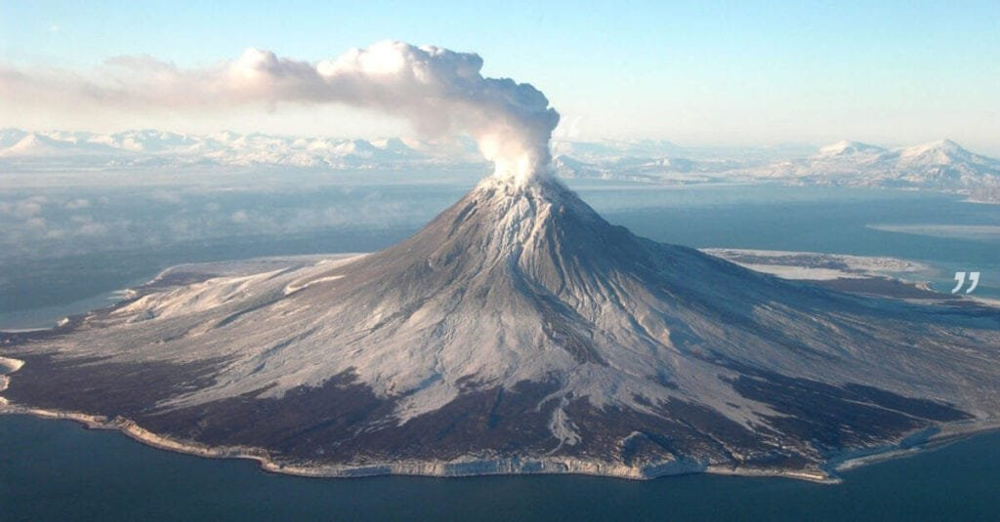
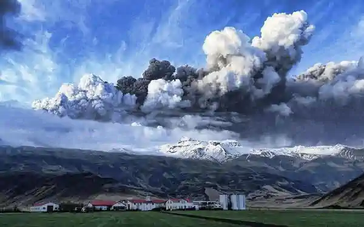
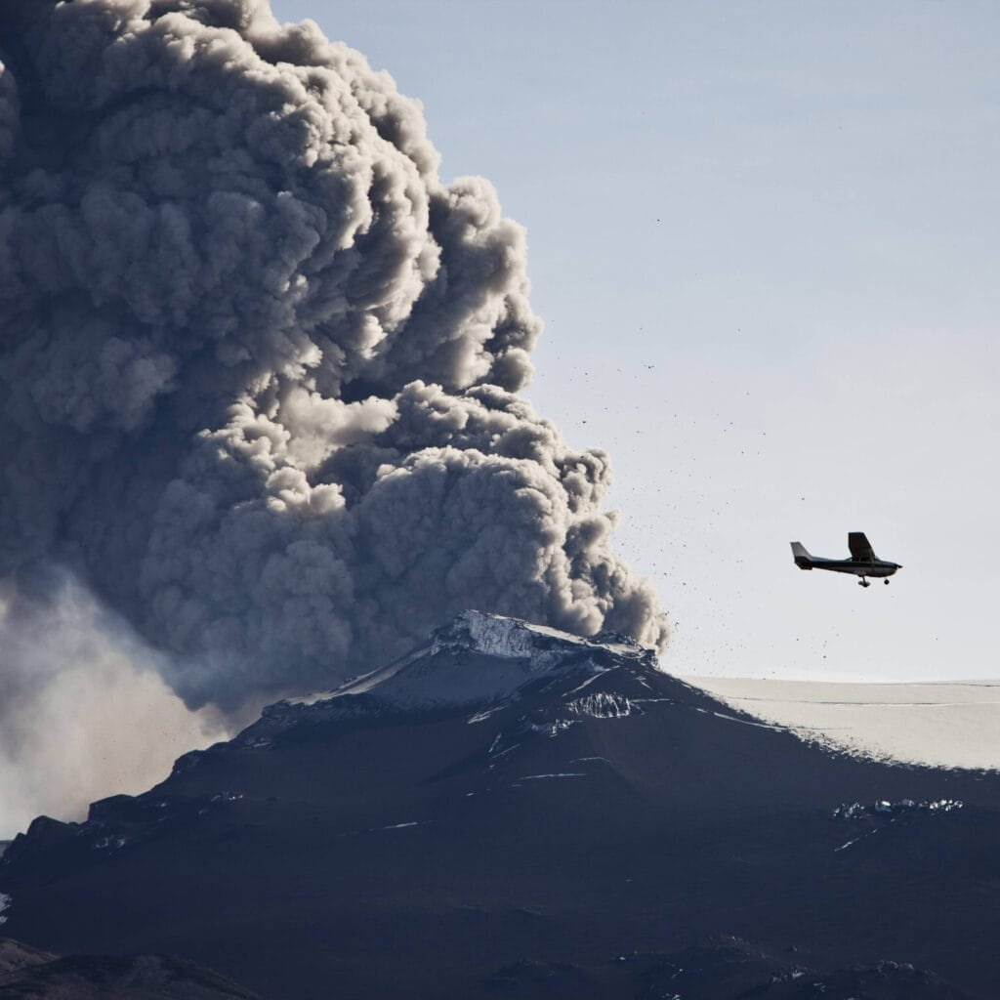

Volcanic ash can pose significant challenges for pilots during training exercises. As a pilot, it is crucial to be aware of the potential dangers and take necessary precautions to ensure a safe and successful flight. This article provides ten tips to help you navigate through areas with volcanic ash, including advice on monitoring ash clouds, understanding the effects of ash on aircraft, and developing contingency plans. By following these guidelines, you can enhance your training experience and ensure the safety of yourself and your crew amidst the unique hazards posed by volcanic ash.

This image is property of marvel-b1-cdn.bc0a.com.

## Understanding the Nature of Volcanoes

[Volcanoes are fascinating natural phenomena](https://magmamatters.com/the-art-and-science-of-volcano-monitoring/ "The Art and Science of Volcano Monitoring") that have been a subject of study for scientists and researchers for centuries. In order to navigate through volcanic areas safely, it is crucial to have a comprehensive understanding of the nature of volcanoes. This includes knowledge of the various [types of volcanoes](https://magmamatters.com/understanding-volcanic-formation-a-comprehensive-guide/ "Understanding Volcanic Formation: A Comprehensive Guide"), their geographic distribution, eruption causes, as well as the known hazards and benefits of volcanic activities.

### Knowledge of various types of volcanoes

Volcanoes come in different shapes and sizes, each with its own unique characteristics. Some of the common types of volcanoes include composite or stratovolcanoes, shield volcanoes, and [cinder cones](https://magmamatters.com/the-birth-of-new-land-understanding-cinder-cones/). Composite volcanoes, such as Mount Vesuvius in Italy and Mount St. Helens in the United States, are characterized by their steep slopes and explosive eruptions. Shield volcanoes, on the other hand, are broad and gently sloping, with lava flowing freely during eruptions. The volcanoes in Hawaii, such as Mauna Loa and Kilauea, are perfect examples of shield volcanoes. Lastly, cinder cones are small volcanic landforms that are formed from explosive eruptions, resulting in the accumulation of volcanic cinders and ash.

### Understanding the geography and distribution of volcanoes

Volcanoes are not randomly scattered around the Earth's surface; instead, they are often located in specific areas. The "Ring of Fire" is a prime example of a region with a high concentration of volcanoes. This ring encircles the Pacific Ocean and is known for its intense tectonic activity and volcanic eruptions. It stretches from the western coast of North and South America to the eastern coast of Asia and Oceania. In addition to the Ring of Fire, there are also volcanic hotspots, like those found in Hawaii and Iceland, where volcanoes form over stationary magma plumes. Understanding the geography and distribution of [volcanoes is essential for pilots](https://magmamatters.com/geothermal-energy-and-its-volcanic-origins/ "Geothermal Energy and Its Volcanic Origins") to be aware of the potential volcanic hazards in different regions of the world.

### Basics of eruption causes

Volcanic eruptions are a result of the movement and release of molten rock, gases, and debris from beneath the Earth's surface. These eruptions can be triggered by various factors, including tectonic activity, which occurs along plate boundaries, hotspots, and rift zones. Plate boundaries are areas where tectonic plates collide, slide past each other, or move apart, causing the release of volcanic materials. Hotspots, on the other hand, are areas where a stationary mantle plume rises to the Earth's surface, creating a source of volcanic activity. Rift zones are regions where the Earth's crust is being pulled apart, allowing magma to rise to the surface. By understanding the basic causes of eruptions, pilots can better assess the potential risks associated with volcanic activity and make informed decisions to ensure their safety and the safety of their passengers.

### Known hazards and benefits of volcanic activities

Volcanic eruptions can have both positive and negative consequences. On the positive side, volcanic eruptions provide essential nutrients to the soil, making it highly fertile for agricultural activities. This is why volcanic regions are often known for their rich and productive farmlands. Additionally, volcanic eruptions can contribute to the creation of new landforms, such as islands and mountains. On the other hand, volcanic activity can also have devastating effects. Ash clouds, pyroclastic flows, and lava flows can cause significant damage to surrounding areas, including infrastructure and homes. Volcanic ash, in particular, can pose a major threat to aviation due to its abrasive nature and potential to damage aircraft engines and critical systems. Understanding the hazards and benefits of volcanic activities is crucial for pilots to be prepared for flying in areas with volcanic ash and to mitigate any risks that may arise.

## Recognizing Volcanic Ash Clouds

When flying in areas with volcanic activity, it is essential for pilots to be able to recognize and identify volcanic ash clouds. These ash clouds pose a significant threat to the safety of aircraft and can have disastrous consequences if not detected and avoided. There are several methods and techniques that pilots can use to recognize volcanic ash clouds and take appropriate action.

### Discoloration and visibility reduction clues

One of the first signs of a volcanic ash cloud is a noticeable discoloration of the sky. The presence of ash particles in the atmosphere can cause a grayish or brownish tint to the sky, often accompanied by reduced visibility due to the fine particles scattering light. Pilots should be vigilant and pay close attention to any abnormal changes in sky color and visibility, as these can be indicators of an ash cloud in the vicinity.

### Detection through weather radar

Weather radar is an invaluable tool for pilots when it comes to detecting and avoiding volcanic ash clouds. Modern weather radar systems are capable of detecting the presence of ash particles in the atmosphere, allowing pilots to identify and navigate around these hazardous areas. It is crucial for pilots to familiarize themselves with the operation of weather radar systems and to regularly monitor the radar displays for any indications of volcanic ash.

### Real-time satellite data interpretation

Satellite imagery plays a crucial role in the detection and monitoring of volcanic ash clouds. Advanced satellite systems provide real-time data on the distribution and movement of ash clouds, allowing pilots to make informed decisions about their flight paths. By interpreting satellite data, pilots can determine the location, extent, and density of ash clouds, and adjust their flight plans accordingly. It is important for pilots to have access to reliable satellite imagery and to have the necessary knowledge and skills to interpret this data effectively.

### Cooperation with meteorological organizations for information

In order to stay well-informed about volcanic activity and the presence of ash clouds, pilots should establish good communication channels with meteorological organizations. These organizations play a crucial role in monitoring volcanic activity and providing timely information to pilots. By establishing regular contact and actively seeking information from meteorological organizations, pilots can stay updated on the latest volcanic activity and make informed decisions about their flight routes.

<iframe width="560" height="315" src="https://www.youtube.com/embed/KxQp5JyIry0" frameborder="0" allow="accelerometer; autoplay; encrypted-media; gyroscope; picture-in-picture" allowfullscreen></iframe>

  

## Effects of Volcanic Ash on Aircrafts

Volcanic ash poses significant risks to aircraft, including potential damage to engine components, navigation systems, airframes, and windows. Pilots must be aware of the various ways in which volcanic ash can impact an aircraft and take appropriate precautions to ensure the safety of the aircraft and its occupants.

### Aircraft engine issues due to volcanic ash

One of the most significant risks posed by volcanic ash is the potential damage to aircraft engines. Volcanic ash contains tiny abrasive particles that can enter the engine and cause erosion and wear on critical engine components. These particles can also melt and fuse together when exposed to high temperatures, leading to the formation of a glassy substance known as "ash melt." This ash melt can accumulate on compressor blades, turbine blades, and other engine components, leading to reduced engine performance and potentially catastrophic engine failure. Pilots must be aware of the risks associated with volcanic ash ingestion and take appropriate measures to minimize the impact on engine performance.

### Volcanic ash impact on navigation systems

In addition to engine issues, volcanic ash can also affect the performance of navigation systems onboard an aircraft. The presence of ash particles in the air can interfere with radio signals, affecting the accuracy and reliability of navigation equipment such as GPS and radio communication systems. Pilots must be prepared to rely on alternative navigation methods and ensure that they have up-to-date information on navigational aids and routes in ash-affected areas.

### Airframe damage risk

While engines and navigation systems are often the primary focus when it comes to volcanic ash hazards, the airframe of an aircraft is also at risk. The abrasive nature of volcanic ash can cause damage to the exterior surfaces of the aircraft, including the fuselage, wings, and control surfaces. This damage can compromise the structural integrity of the aircraft and affect its performance and handling characteristics. Pilots must conduct thorough inspections of the aircraft's exterior surfaces after exposure to volcanic ash and report any signs of damage to ensure proper maintenance and repairs.

### Window sandblasting and visibility issues

Another significant effect of volcanic ash on aircraft is the sandblasting of windows. The fine particles in volcanic ash can strike the aircraft's windows at high speeds, causing scratches and pitting. This can lead to reduced visibility for the pilots, making it more challenging to navigate and maintain situational awareness. Pilots should be prepared to adjust their flight altitudes and routes to minimize the risk of window damage and ensure optimal visibility.

## Pre-flight Preparations

Before embarking on a flight in an area with volcanic activity, pilots must undertake thorough pre-flight preparations to ensure a safe and successful journey. These preparations involve several important steps, including studying the weather forecast, double-checking the aircraft's mechanical condition, establishing communication channels with aircraft control and weather agencies, and creating an alternative flight plan.

### Studying the weather forecast

The weather forecast plays a crucial role in pre-flight preparations, especially when it comes to volcanic activity. Pilots should closely examine the weather forecast for the intended route and destination, paying particular attention to any indications of volcanic ash in the area. This includes analyzing meteorological data, satellite imagery, and other relevant information provided by meteorological agencies. By having a clear understanding of the weather conditions and any potential volcanic ash hazards, pilots can make informed decisions about their flight plans.

### Double-checking aircraft mechanical condition

Ensuring that the aircraft is in optimal mechanical condition is essential for safe flight operations, particularly in areas with volcanic activity. Pilots should conduct a thorough pre-flight inspection of the aircraft, paying close attention to critical systems and components that may be vulnerable to volcanic ash damage. This includes inspecting engine components, navigation systems, airframes, and windows to ensure that they are in good working order and free from any signs of damage or contamination. It is also important to ensure that the aircraft's filtration systems are clean and functioning properly to minimize the ingestion of volcanic ash.

### Establishing communication channels with aircraft control and weather agencies

Maintaining effective communication channels with aircraft control and weather agencies is vital for obtaining real-time information and updates regarding volcanic activity and ash cloud movements. Pilots should establish reliable communication channels before the flight, ensuring that they have access to the latest information and guidance from air traffic control and meteorological agencies. This enables pilots to make timely decisions and adjustments to their flight plans based on the most accurate and up-to-date information available.

### Creating an alternative flight plan

When flying in areas with volcanic activity, it is important to have a contingency plan in case the original flight plan needs to be altered due to the presence of volcanic ash. Pilots should create an alternative flight plan that includes routes and altitudes that minimize the exposure to volcanic ash. This plan should take into account information from meteorological agencies, weather forecasts, and current volcanic activity reports. By having an alternative flight plan in place, pilots can respond quickly and effectively to changes in the situation and ensure the safety of their aircraft and passengers.

This image is property of aertecsolutions.com.

## Decision-making in Flight

When faced with the presence of volcanic ash during a flight, pilots must make critical decisions to ensure the safety of their aircraft and passengers. These decisions involve recognizing the need for immediacy, considering options for flight diversion, prioritizing passenger and crew safety, and communicating with ground control.

### Recognizing the need for immediacy

Recognizing the need for immediacy is crucial when encountering volcanic ash during a flight. Time is of the essence, as volcanic ash can pose significant risks to the aircraft and its occupants. Pilots must be vigilant and responsive, closely monitoring the situation and taking appropriate action as soon as ash is detected. This may involve altering the flight path, descending to lower altitudes, or diverting the flight to an alternative airport. By recognizing the need for immediacy, pilots can minimize the time spent in ash-contaminated air and reduce the potential risks associated with volcanic ash.

### Considering options for flight diversion

When faced with the presence of volcanic ash, pilots should consider their options for flight diversion. This includes identifying alternative airports or landing sites that are outside the affected area and safe for landing. Pilots should be familiar with the airports and airstrips in the vicinity of their planned route, as well as any available navigational aids that can help guide them to a safe landing. By considering options for flight diversion in advance, pilots can make informed decisions and execute a safe diversion if necessary.

### Prioritizing passenger and crew safety

The safety of passengers and crew should always be the top priority during a flight, especially when encountering volcanic ash. Pilots must assess the risks and potential dangers associated with flying in ash-contaminated air and make decisions that prioritize the safety and well-being of everyone on board. This may involve altering the flight path, descending to lower altitudes, or even deciding to cancel the flight altogether if the risks are deemed too high. By prioritizing passenger and crew safety, pilots can ensure that appropriate measures are taken to mitigate the risks associated with volcanic ash.

### Communicating with ground control

Maintaining clear and effective communication with ground control is essential when flying in areas with volcanic ash. Pilots should promptly inform air traffic control of any encounters with volcanic ash and provide them with detailed information about the location, altitude, and extent of the ash cloud. This enables ground control to take appropriate action, such as alerting other aircraft in the area and coordinating alternative flight paths. Effective communication with ground control allows for a coordinated and proactive response to volcanic ash encounters, enhancing the safety of all aircraft in the affected area.

## Techniques for Navigating Ash Clouds

When flying in areas with volcanic ash, pilots must employ specific techniques to navigate safely through ash clouds. These techniques involve flying above the ash cloud, using radar to map the ash cloud, relying on visual cues and instruments, and maintaining open and clear communication lines with air traffic controllers.

### Flying above the ash cloud

One of the most effective techniques for navigating ash clouds is to fly above them. Pilots should carefully assess the altitude and extent of the ash cloud and select a flight level that ensures a safe separation from the ash particles. By flying above the ash cloud, pilots can minimize the risk of engine damage and reduce the likelihood of encountering reduced visibility caused by the ash particles. However, it is important to note that flying above the ash cloud may not always be feasible due to airspace restrictions or the presence of other aircraft. Therefore, pilots should always be prepared to consider alternative techniques if flying above the ash cloud is not possible.

### Using radar to map the ash cloud

Weather radar systems are a valuable tool for mapping the location and extent of ash clouds. Pilots should utilize their aircraft's radar systems to detect and monitor the presence of ash particles in the atmosphere. By analyzing the radar displays, pilots can determine the location and density of the ash cloud and adjust their flight paths accordingly. It is essential for pilots to have a clear understanding of their radar systems and to interpret the radar data accurately when navigating through ash clouds.

### Relying on visual cues and instruments

In addition to radar systems, pilots should also rely on visual cues and instruments to navigate through ash clouds. Visual cues, such as the discoloration of the sky or reduced visibility, can provide valuable information about the proximity and density of the ash cloud. Pilots should maintain constant visual scanning of the surrounding airspace and be alert to any signs of ash contamination. Instrumentation, such as altimeters and airspeed indicators, should also be closely monitored to ensure that the aircraft remains at the desired altitude and maintains a safe airspeed. By combining visual cues and instrument readings, pilots can navigate through ash clouds with increased situational awareness and confidence.

### Keeping communication lines with air traffic controllers open and clear

Maintaining open and clear communication with air traffic controllers is essential when navigating through ash clouds. Pilots should regularly update air traffic control on their position, altitude, and any changes in flight plans. This allows air traffic controllers to provide timely information and guidance, as well as coordinate with other aircraft in the vicinity. By keeping communication lines open, pilots can receive vital information about the location and movement of ash clouds and adjust their flight paths accordingly. Additionally, pilots should promptly report any encounters with volcanic ash to air traffic control, enabling them to take appropriate action to ensure the safety of all aircraft in the area.

This image is property of www.cfinotebook.net.

## Emergency Procedures in Ash Encounters

Despite all precautions, pilots may still encounter volcanic ash during a flight. In such situations, it is important for pilots to be familiar with emergency procedures to ensure the safety of the aircraft and its occupants. These procedures include immediate engine power reduction, initiating immediate descent as necessary, smoke removal procedures, and awareness of stalling speeds under these conditions.

### Immediate engine power reduction

If an aircraft encounters volcanic ash, the pilot should immediately reduce the engine power to minimize the ingestion of ash particles. By reducing the engine power, the likelihood of damage to critical engine components can be significantly reduced. The pilot should follow the manufacturer's guidelines for the specific aircraft type and engine, which may include reducing thrust levels or even shutting down one or more engines if necessary.

### Initiating immediate descent as necessary

Depending on the altitude and severity of the encounter with volcanic ash, the pilot may need to initiate an immediate descent to lower altitudes. Descending to lower altitudes can help minimize the exposure to ash particles and reduce the risks associated with flying in ash-contaminated air. The pilot should follow established emergency procedures and air traffic control instructions when conducting an immediate descent, ensuring the safety of the aircraft and passengers throughout the maneuver.

### Smoke removal procedures

In the event of encountering volcanic ash, the aircraft's ventilation system should be adjusted to minimize the infiltration of ash particles into the cabin. This may involve closing certain air vents, isolating affected areas, and increasing airflow through uncontaminated parts of the aircraft. Pilots should be familiar with the specific smoke removal procedures for their aircraft type and follow them accordingly. The safety and comfort of the passengers should be prioritized during the implementation of smoke removal procedures.

### Awareness of stalling speeds under these conditions

When encountering volcanic ash, pilots should be aware that the presence of ash particles can affect the aerodynamic performance of the aircraft. In particular, the accumulation of ash on the wings and control surfaces can disrupt airflow and increase the risk of stalling. Pilots should be vigilant and closely monitor airspeeds and control responses to ensure that the aircraft remains within its safe operating envelope. By maintaining awareness of the potential impact of volcanic ash on the aircraft's performance, pilots can take appropriate actions to prevent stalling and ensure a safe flight.

## Post-flight Actions After Ash Exposure

After encountering volcanic ash during a flight, it is essential for pilots to undertake post-flight actions to assess the aircraft's condition, report the ash encounter to appropriate agencies, provide information to meteorological organizations for future reference, and arrange for repairs if necessary.

### Engine inspections and maintenance

Following an encounter with volcanic ash, pilots should conduct thorough inspections of the aircraft's engines to assess any potential damage or contamination. This may involve removing engine components and inspecting them for signs of erosion, wear, or ash contamination. Pilots should follow the manufacturer's guidelines for engine inspections and consult with qualified maintenance personnel to ensure that any necessary maintenance or repairs are carried out promptly and effectively.

### Reporting the ash encounter to appropriate agencies

It is important for pilots to report any encounters with volcanic ash to the appropriate agencies. This includes filing a report with the aviation regulatory authority and providing detailed information about the location, altitude, and extent of the encounter. By reporting the ash encounter, pilots contribute to the accumulation of data and information that can help improve the understanding of volcanic ash hazards and enhance the safety measures in place for aviation operations.

### Providing information to meteorological organizations for future reference

Sharing information about volcanic ash encounters with meteorological organizations is crucial for improving the accuracy and timeliness of ash cloud forecasts and warnings. Pilots should provide relevant details about the encounter, such as the flight path, altitude, and any observed changes in ash cloud characteristics. This information can be used to refine models and enhance the forecasting capabilities of meteorological agencies, enabling them to provide more accurate and timely information to pilots and air traffic control.

### Repairing any airframe and window damages

After encountering volcanic ash, pilots should arrange for the necessary repairs to any identified damages to the aircraft's airframe and windows. This may involve replacing damaged components, conducting structural inspections, and carrying out repairs to restore the aircraft to its optimal condition. Pilots should work closely with maintenance personnel and follow the established repair procedures to ensure that all necessary repairs are carried out effectively and to prevent any further damage or safety risks.

This image is property of thepointsguy.global.ssl.fastly.net.

## Role of Simulators in Volcanic Ash Training

Simulators play a crucial role in providing pilots with realistic training scenarios for volcanic ash encounters. Through simulator training, pilots can develop a better understanding of the limitations of simulators, practice emergency procedures in a controlled environment, and improve their decision-making and crew resource management skills.

### Simulator model limitations

It is important for pilots to be aware of the limitations of simulator models when it comes to volcanic ash training. Simulators may not perfectly replicate the conditions and challenges associated with actual volcanic ash encounters. The behavior and characteristics of volcanic ash, such as its density, particle size distribution, and composition, can be difficult to simulate accurately. Pilots should keep these limitations in mind during simulator training and use the training as an opportunity to bridge the gap between simulated scenarios and real-life situations.

### Understanding simulator cues for ash detection

During simulator training, pilots should focus on understanding and interpreting the cues provided by the simulator for ash detection. This includes recognizing visual cues, such as changes in sky color and visibility, as well as interpreting instrument readings indicating the presence of volcanic ash. By becoming familiar with these cues and practicing their interpretation in a simulated environment, pilots can develop the skills necessary to recognize and respond appropriately to volcanic ash during actual flight operations.

### Practicing emergency procedures in a controlled environment

Simulator training provides an excellent opportunity for pilots to practice emergency procedures specific to volcanic ash encounters in a controlled environment. This includes practicing immediate engine power reduction, initiating immediate descent, implementing smoke removal procedures, and maintaining awareness of stalling speeds under ash-contaminated conditions. By repeatedly practicing these procedures in a safe and controlled environment, pilots can develop muscle memory and enhance their ability to respond effectively during real-life emergencies.

### Improving decision making and crew resource management skills

Simulator training also plays a vital role in improving pilots' decision-making and crew resource management (CRM) skills in the face of volcanic ash encounters. By simulating different scenarios and challenging the pilots with complex decision-making tasks, simulators allow pilots to develop and refine their decision-making processes. Additionally, simulators provide an opportunity for pilots to practice effective CRM techniques, such as clear and concise communication, task delegation, and teamwork, which are essential for safe and successful flight operations in ash-contaminated environments.

## Staying Up to Date with Volcanic Activity and Information

In order to ensure the safety of flight operations in areas with volcanic activity, pilots must stay up to date with the latest information and developments regarding volcanic activity. This includes maintaining constant communication with meteorological agencies, regularly reviewing scientific materials related to volcanic activities, registering for alerts and real-time updates, and participating in workshops and seminars for continual learning.

### Constant communication with meteorological agencies

Establishing and maintaining constant communication with meteorological agencies is crucial for staying informed about volcanic activity. Meteorological agencies monitor and analyze volcanic activity, issuing warnings, forecasts, and updates regarding ash cloud movements and characteristics. Pilots should actively seek the latest information from meteorological agencies and maintain regular contact to ensure that they have the most accurate and up-to-date information regarding volcanic activity in their operational areas.

### Regular review of scientific materials related to volcanic activities

Volcanic activity is a complex scientific subject, and keeping abreast of the latest research and scientific materials is essential for a comprehensive understanding of volcanic hazards. Pilots should regularly review scientific publications, reports, and studies related to volcanic activities, including ash cloud characteristics, dispersion models, and forecasting techniques. By staying informed about scientific advancements in the field, pilots can better assess risks and make informed decisions during flight operations in volcanic areas.

### Registering for alerts and real-time updates of volcanic activities

Many meteorological agencies and research institutions provide alert systems and real-time updates for volcanic activity. Pilots should take advantage of these services by registering for alerts and updates via email, SMS, or other communication channels. This ensures that pilots receive timely notifications about changes in volcanic activity and ash cloud movements, allowing them to adjust their flight plans and operations accordingly.

### Participation in workshops and seminars for continual learning

Continual learning and professional development are vital for pilots operating in areas with volcanic activity. Workshops, seminars, and training programs conducted by meteorological agencies, aviation authorities, and industry experts provide valuable opportunities for pilots to enhance their knowledge and skills related to volcanic hazards. These events often cover topics such as volcanic ash detection, forecasting techniques, emergency procedures, and decision-making in volcanic environments. By actively participating in such events, pilots can stay up to date with best practices and the latest information, ensuring the highest levels of safety for themselves, their passengers, and their aircraft.

In conclusion, understanding the nature of volcanoes and recognizing volcanic ash clouds are essential for safe flight operations in areas with volcanic activity. Pilots should possess knowledge of various types of volcanoes, understand their geographic distribution and eruption causes, and be aware of the hazards and benefits associated with volcanic activities. Recognizing volcanic ash clouds requires paying attention to cues such as discoloration, reduced visibility, weather radar detection, and interpretation of real-time satellite data. Pilots must also be aware of the effects of volcanic ash on aircraft, including engine issues, navigation system impact, airframe damage risks, and window sandblasting. Pre-flight preparations should include studying the weather forecast, checking the aircraft's mechanical condition, establishing communication channels, and creating alternative flight plans. Decision-making in flight involves recognizing the need for immediacy, considering options for flight diversion, prioritizing safety, and maintaining communication with ground control. Navigating ash clouds can be achieved by flying above the ash cloud, using radar to map the ash cloud, relying on visual cues and instruments, and communicating with air traffic controllers. Pilots should be familiar with emergency procedures in ash encounters, such as reducing engine power, initiating descent, smoke removal, and awareness of stalling speeds. Post-flight actions include engine inspections, reporting ash encounters, providing information to meteorological organizations, and arranging repairs. Simulators are valuable tools for volcanic ash training, improving understanding of simulator limitations, practicing emergency procedures, and enhancing decision-making and crew resource management skills. Lastly, staying up to date with volcanic activity and information involves constant communication with meteorological agencies, reviewing scientific materials, registering for alerts, and participating in workshops and seminars for continual learning. By following these guidelines, pilots can ensure safe flight operations in areas with volcanic ash and mitigate risks associated with volcanic activity.

