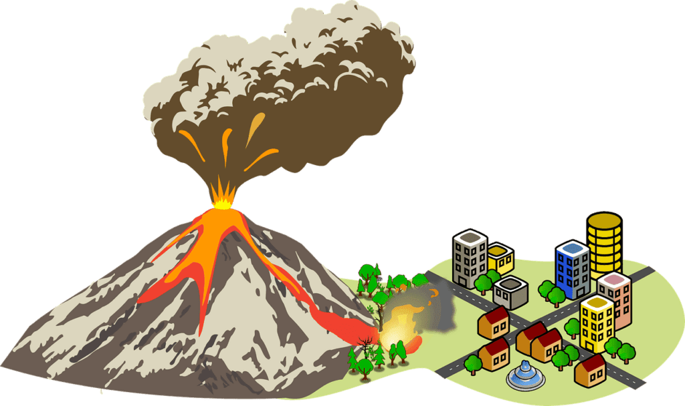
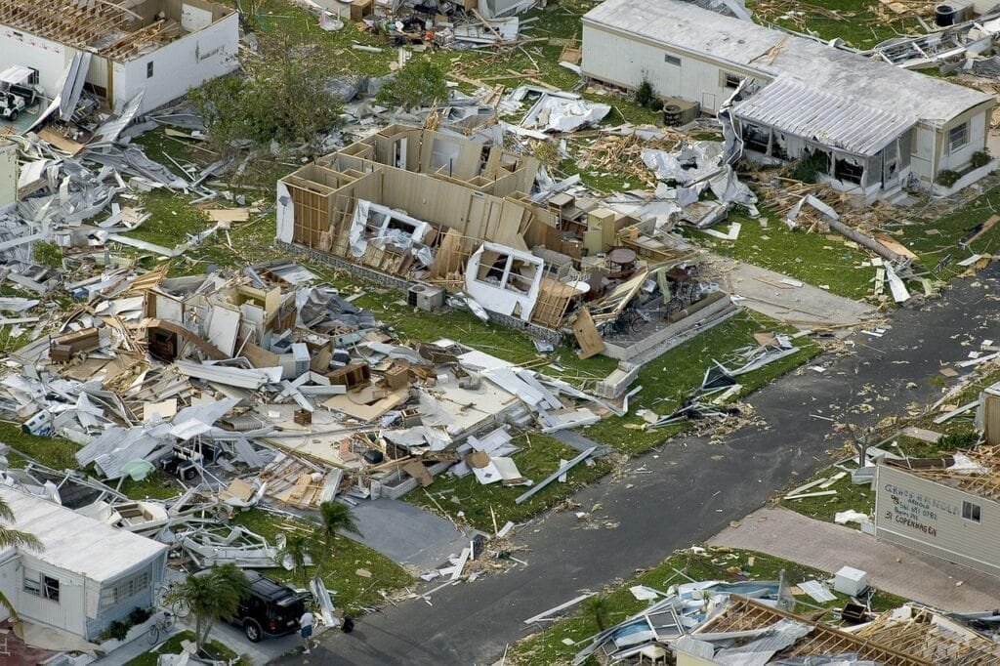

Volcanic landslides can present significant dangers and risks to communities living near active or dormant volcanoes. To ensure preparedness and mitigate the potential impacts of such events, it is crucial to have an understanding of the volcanic landscape and take necessary precautions. In this article, you will find 10 essential tips that can help you and your community stay safe and minimize the damage caused by volcanic landslides. These tips encompass various aspects, from monitoring volcanic activity to emergency planning and evacuation procedures. By implementing these strategies, you can enhance your preparedness and response capabilities, safeguarding lives and property in volcanic landslide-prone areas.

  

## Understanding Volcano Types and Eruption Patterns

### Identifying different types of volcanoes

Volcanoes come in various shapes and sizes, each with its own distinct characteristics. One [type of volcano is the shield](https://magmamatters.com/understanding-volcanic-formation-a-comprehensive-guide/ "Understanding Volcanic Formation: A Comprehensive Guide") volcano, such as those found in Hawaii. These volcanoes have a broad, gently sloping cone and are formed by layers of lava flowing steadily over time. Another type is the stratovolcano, which is characterized by its steep sides and symmetrical shape. Stratovolcanoes, like Mount Fuji in Japan, are known for their explosive [eruptions that can produce ash clouds and pyroclastic flows](https://magmamatters.com/the-environmental-impact-of-volcanic-eruptions-2/ "The Environmental Impact of Volcanic Eruptions").

### Recognizing their respective eruption patterns

Different types of volcanoes exhibit different eruption patterns. Shield volcanoes tend to have relatively calm and non-explosive eruptions, with lava flowing slowly and steadily. Stratovolcanoes, on the other hand, can have highly explosive eruptions due to the buildup of gas and pressure within their magma chambers. These eruptions can release ash, volcanic bombs, and pyroclastic flows, which are fast-moving clouds of hot gas, ash, and rock fragments.

### Analyzing the geography of volcanoes

Volcanoes are not randomly scattered across the Earth's surface; their distribution is closely tied to tectonic plate boundaries and hotspots. The "Ring of Fire" is a prime example of this. It is a horseshoe-shaped area in the Pacific Ocean where several tectonic plates meet, resulting in intense volcanic and [seismic activity](https://magmamatters.com/the-art-and-science-of-volcano-monitoring/ "The Art and Science of Volcano Monitoring"). Understanding the geography of volcanoes can help scientists and communities better prepare for potential eruptions and mitigate the associated risks.

### Understanding why and when they erupt

Volcanic eruptions occur when molten rock, called magma, rises to the surface. This can happen due to the movement and interaction of tectonic plates or the presence of a hotspot, which is a fixed source of heat within the Earth's mantle. Eruptions can be triggered by factors such as increased gas pressure, the accumulation of magma, or the rupture of a volcanic plug. The timing and frequency of eruptions can vary greatly, ranging from frequent eruptions to periods of dormancy lasting hundreds or thousands of years.

## Learning Volcanic Landslide Causes

### Understanding the role of eruptions in triggering landslides

Volcanic eruptions can trigger landslides through various mechanisms. One common cause is the destabilization of volcanic slopes due to the explosive force and pressure exerted by the eruption. This can result in the collapse of unstable rock and debris, leading to landslides. Additionally, the rapid and intense rainfall that often accompanies volcanic eruptions can saturate the soil, making it more prone to sliding.

### Studying how terrain and landscape affect landslide risks

The terrain and landscape surrounding a volcano can greatly influence the risks of landslides. Steep slopes, loose volcanic ash deposits, and unstable rock formations are factors that contribute to increased landslide hazards. The composition of the soil and its ability to retain water are also important considerations. Areas with dense vegetation, for example, may be more resistant to landslides due to the roots of plants helping to stabilize the soil.

### Recognizing the impact of heavy rains on volcanic slopes

Heavy rainfall can exacerbate the risks of landslides in volcanic areas. The loose and fragmented nature of volcanic soil and ash makes it highly susceptible to erosion when saturated with water. As the soil becomes more saturated, its stability decreases, increasing the likelihood of a landslide. Monitoring rainfall patterns and understanding the potential impact of heavy rains on volcanic slopes are crucial for assessing landslide risks and implementing appropriate measures to mitigate them.

This image is property of pixabay.com.

## Knowing the Warning Signs of a Potential Landslide

### Identifying early warning signs

Recognizing the early warning signs of a potential landslide can help save lives and minimize property damage. Signs to look out for include sudden ground movement, tilting or cracking of trees or structures, increased water flow in streams and rivers, and the appearance of new or expanded cracks in the soil. Any unusual or sudden changes in the landscape should be taken seriously and reported to local authorities.

### Monitoring changes in the landscape

Regular monitoring of the landscape surrounding a volcano is essential for detecting changes that may signal an imminent landslide. This can be done through the use of remote sensing technologies, such as satellite imagery and ground-based sensors. These tools can help identify shifts in ground elevation, changes in vegetation patterns, or abnormal gas emissions, all of which are indicators of potential landslide activity.

### Understanding landslide alert levels

Landslide alert levels are an important communication tool used to inform communities about the potential risks and hazards associated with landslides. These alert levels are typically based on scientific assessments of the current conditions and the likelihood of a landslide occurring. They can range from normal, indicating no immediate danger, to high alert, indicating an imminent or ongoing landslide event. Understanding these alert levels and following the guidance provided by local authorities is crucial for staying safe during a potential landslide situation.

## Planning for Volcanic Landslide Emergencies

### Creating a comprehensive emergency plan

When living in a volcanic area prone to landslides, it is important to have a well-developed emergency plan in place. This plan should outline evacuation routes, designated meeting points, and communication protocols. It should also include a list of essential supplies, emergency contacts, and instructions on how to respond during a landslide event. Regularly review and update the emergency plan to ensure it remains relevant and effective.

### Identifying safe evacuation routes

In the event of a volcanic landslide, having predetermined safe evacuation routes can be a matter of life and death. Identify multiple routes that lead to higher ground or safe shelter away from potential landslide areas. Consider the topography of the surrounding landscape, the presence of bridges or other potential obstacles, and the distance to designated safe locations when determining the best evacuation routes.

### Preparing a survival kit

A survival kit is an essential resource to have on hand in case of a volcanic landslide emergency. It should include items such as non-perishable food, drinking water, flashlights, batteries, a portable radio, a first aid kit, essential medications, and personal hygiene items. It is also recommended to include copies of important documents, cash, and any necessary items for infants, elderly family members, or pets. Check and replenish the survival kit regularly to ensure that it remains stocked and up to date.

This image is property of pixabay.com.

## Building Safe Structures

### Understanding the importance of building site selection

When constructing structures in volcanic areas, the selection of building sites is a crucial factor in minimizing the risks of landslides. Avoid building on steep slopes, areas with loose or unstable soil, or locations close to known channels of lava flow. Ensure that the chosen site is properly assessed for stability and consider consulting with geological and engineering experts to determine its suitability for construction.

### Constructing structures resistant to landslide forces

Designing and constructing structures that can withstand the forces exerted by landslides is essential for their safety and longevity. Employ techniques such as reinforcing foundations, using flexible and resistant building materials, and implementing appropriate structural design principles. By integrating landslide-resilient features into the construction process, the potential for damage and loss during a landslide event can be significantly reduced.

## Planting Vegetation on Vulnerable Slopes

### Understanding how vegetation helps prevent landslides

Vegetation plays a crucial role in preventing landslides on vulnerable slopes. The roots of plants help bind the soil together, increasing its stability and resistance to erosion. The dense foliage of vegetation also helps absorb rainwater, reducing the saturation of the soil and minimizing landslide risks. Planting a variety of native trees, shrubs, and ground cover plants on vulnerable slopes can provide a natural barrier against landslides.

### Choosing the right type of plants

When selecting plants to be planted on vulnerable slopes, it is important to choose species that are well-suited to the local climate, soil conditions, and topography. Native plant species are often the best choice, as they have adapted to the specific ecosystem and are more likely to thrive. Avoid planting invasive species, as they can disrupt the natural balance of the ecosystem and potentially exacerbate landslide risks.

This image is property of pixabay.com.

## Conducting Regular Safety Drills

### Understanding the importance of safety drills

Regular safety drills are essential for preparedness and ensuring that everyone knows what to do during a volcanic landslide emergency. These drills help familiarize individuals with evacuation routes, emergency procedures, and the use of safety equipment. By practicing safety drills, people can develop the necessary skills and confidence to respond effectively during high-stress situations.

### Planning and executing regular drills

To conduct effective safety drills, it is important to plan and execute them regularly. Coordinate with local authorities, emergency management agencies, and community organizations to organize drills that simulate realistic scenarios. Include different stakeholders such as residents, businesses, schools, and healthcare facilities to ensure a comprehensive approach. After each drill, evaluate the results, identify areas for improvement, and update the emergency plan accordingly.

## Staying Updated with Scientific Predictions and News

### Keeping track of volcano-related news

Staying informed about volcano-related news and developments is essential for understanding the risks and potential impacts in your area. Monitor reliable news sources, government communications, and websites of [geological agencies for updates on volcanic](https://magmamatters.com/geothermal-energy-and-its-volcanic-origins/ "Geothermal Energy and Its Volcanic Origins") activity, landslide risks, and any evacuation advisories or warnings that may be issued. Additionally, consider subscribing to email alerts or apps that provide real-time information and notifications about volcanic and landslide activity.

### Understanding scientific predictions about volcanoes and landslides

Scientists employ various methods to predict volcanic eruptions and landslide events. These methods include monitoring ground deformation, gas emissions, seismic activity, and changes in volcanic hydrology. By understanding the science behind these predictions and the indicators scientists use, you can gain insights into the likelihood and timing of a potential volcanic landslide. Familiarize yourself with the terminology and concepts used by scientists to make informed decisions and take appropriate actions based on their forecasts.

## Involving Community in Preparedness Efforts

### Promoting awareness about volcanic landslides

Raising awareness about volcanic landslides is crucial for ensuring community preparedness. Organize educational campaigns, workshops, and community meetings to share information about the risks and impacts of volcanic landslides. Collaborate with local schools, community organizations, and government agencies to develop educational materials and conduct outreach activities. Empowering individuals with knowledge can help them make informed decisions and take proactive measures to protect themselves and their communities.

### Cooperating with local disaster management authorities

Collaboration with local disaster management authorities is vital for effective preparedness and response to volcanic landslides. Stay informed about the resources, plans, and protocols that are in place to handle natural disasters in your area. Participate in community meetings and initiatives led by these authorities to provide input, share concerns, and contribute to the development and enhancement of disaster management strategies. By working together, communities and authorities can better protect lives and minimize the impact of volcanic landslides.

## Recovering After a Volcanic Landslide

### Understanding the need for post-disaster recovery plans

Recovery after a volcanic landslide is a challenging and complex process that requires careful planning and coordination. Post-disaster recovery plans should address immediate needs, such as emergency housing, medical support, and access to clean water. They should also include strategies for long-term recovery and rebuilding, such as restoring infrastructure, rehabilitating the environment, and providing psychosocial support to affected individuals and communities. Engaging with local authorities and community organizations is essential for developing comprehensive and sustainable recovery plans.

### Returning home safely after a landslide

Before returning home after a volcanic landslide, it is crucial to ensure that the area has been deemed safe by local authorities. Even if the immediate threat has passed, there may still be hidden dangers, such as unstable slopes, compromised structures, or toxic gases. Follow the guidance provided by local authorities and experts, and take necessary precautions to protect yourself and your family. Conduct thorough inspections of your property and seek professional assistance if needed, to assess and address any damages or risks that may have resulted from the landslide.

Related Posts: [Mitigating Risks: Forecasting Volcanic Activity in Prone Areas](https://magmamatters.com/mitigating-risks-forecasting-volcanic-activity-in-prone-areas/), [The Formation and Eruption Patterns of Volcanoes](https://magmamatters.com/the-formation-and-eruption-patterns-of-volcanoes-4/), [The Pyroclastic Phenomena of Pompeii: 7 Insights to Explore](https://magmamatters.com/the-pyroclastic-phenomena-of-pompeii-7-insights-to-explore/), [Tips for Capturing Volcano Pyroclastic Flow Photos](https://magmamatters.com/tips-for-capturing-volcano-pyroclastic-flow-photos/), [Understanding Volcanoes and Their Eruption Patterns](https://magmamatters.com/understanding-volcanoes-and-their-eruption-patterns/)
