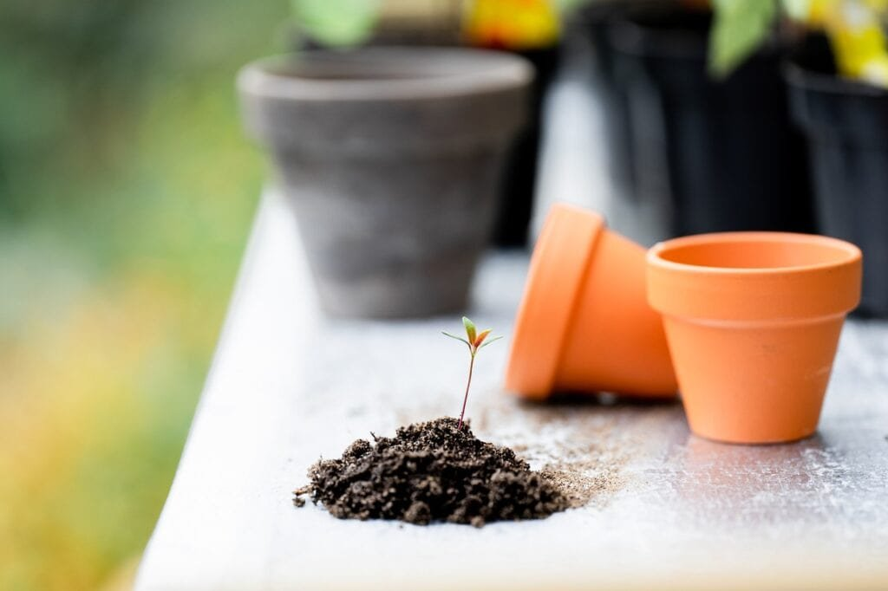
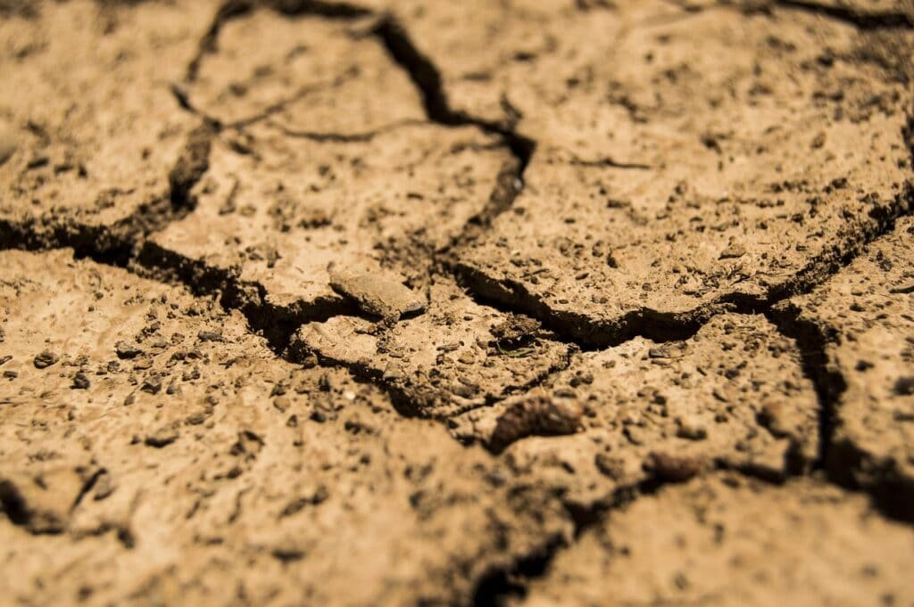
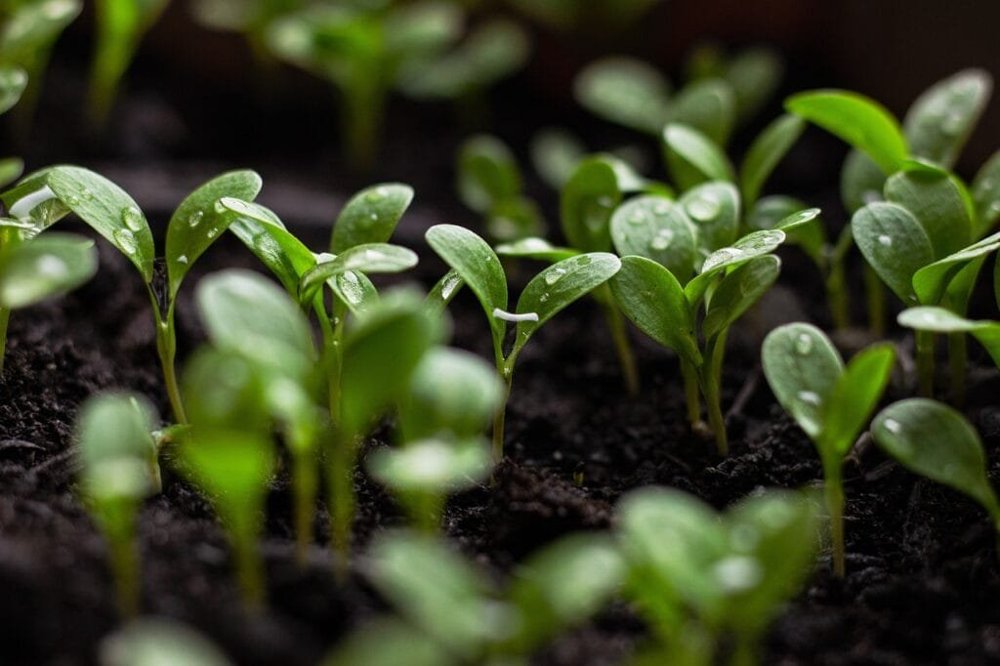

If you want to take your gardening skills to the next level and boost the fertility of your garden, then look no further than volcanic soil. Volcanic soil, also known as volcanic ash or tephra, is rich in minerals and nutrients that can benefit your plants in numerous ways. In this article, we will explore ten tips to help you make the most of volcanic soil in your garden. From understanding the volcanic eruption process to utilizing the unique properties of volcanic ash, these tips will guide you towards creating a thriving and lush garden. So grab your gardening gloves and get ready to discover the secrets of volcanic soil!

This image is property of pixabay.com.

## Understanding the Benefits of Volcanic Soil

Volcanic soil, also known as volcanic ash soil or volcanic sediment, is renowned for its unique properties and benefits. This type of soil is formed through the weathering and erosion of volcanic rock and is characterized by its rich mineral content and excellent drainage capabilities.

### Explanation of the unique properties of volcanic soil

Volcanic soil possesses unique properties that make it highly beneficial for plant growth. One of its key features is its porous structure, which allows for excellent water infiltration and drainage. This prevents waterlogging and helps maintain optimal moisture levels for plants. Additionally, the porous [nature](https://magmamatters.com/the-art-and-science-of-volcano-monitoring/ "The Art and Science of Volcano Monitoring") of volcanic soil allows roots to penetrate easily, promoting healthy root development.

Another important property of volcanic soil is its high cation exchange capacity (CEC). CEC refers to the soil's ability to retain and exchange nutrients with plant roots. Volcanic soil has a high CEC, meaning it can hold onto essential nutrients such as potassium, phosphorus, and calcium, making them readily available to plants.

### Discussion on the natural nutrients present in volcanic soil

Volcanic soil is rich in various essential nutrients that are beneficial for plant growth. The volcanic ash and rock fragments in the soil contain minerals like iron, magnesium, and sulfur, which are essential for healthy plant development. These minerals are released slowly over time, providing a continuous supply of nutrients to plants.

Additionally, volcanic soil contains trace elements like zinc, copper, and boron, which are vital for the overall health and productivity of plants. These trace elements are often lacking in other types of soil, making volcanic soil particularly advantageous for certain plants that have higher nutrient requirements.

### How volcanic soil aids in soil structure and plant growth

The unique properties of volcanic soil contribute to improved soil structure and plant growth. The porous structure of the soil allows for better aeration and root penetration, which enhances nutrient uptake and promotes robust plant growth.

Moreover, the presence of volcanic ash and rock fragments in the soil helps to improve soil fertility by increasing the organic matter content. This leads to improved soil structure, better moisture retention, and enhanced microbial activity, all of which contribute to the overall health and productivity of plants.

## Identifying Quality Volcanic Soil

When it comes to volcanic soil, not all options are created equal. It is important to identify and use quality volcanic soil to ensure optimal results in your garden.

### Characteristics of good volcanic components

High-quality volcanic soil is characterized by specific components that directly contribute to its fertility and nutrient content. Look for soil that primarily consists of volcanic ash, pumice, and other volcanic rock fragments. These components provide the crucial minerals and micronutrients that plants need for healthy growth.

Additionally, good volcanic soil should have a balanced pH level, typically ranging from slightly acidic to neutral. This pH range ensures that the soil can effectively retain and release nutrients, promoting optimal plant health.

### How to distinguish between optimal and sub-par volcanic soil

To distinguish between optimal and sub-par volcanic soil, consider its texture, color, and overall appearance. High-quality volcanic soil will generally have a loose and crumbly structure, allowing for easy root growth and water movement. It should also have a dark color, indicating a good amount of organic matter.

Avoid volcanic soil that is excessively compacted, excessively sandy or clayey, or has a heavy presence of large rocks. These characteristics can hinder plant growth and nutrient availability.

### Importance of freshness and rawness in volcanic soil

Freshness and rawness are crucial factors to consider when sourcing volcanic soil. Opt for soil that has not been excessively weathered or exposed to the elements for an extended period. Fresh volcanic soil retains its nutrient content and microbial activity, ensuring that it delivers the maximum benefits to your plants.

Weathered or aged volcanic soil may have depleted nutrient levels and reduced microbial activity, which can hinder plant growth and productivity.

This image is property of pixabay.com.

## Sourcing of Volcanic Soil

When sourcing volcanic soil, it is important to consider the regions known for natural volcanic soil and follow responsible and sustainable harvesting practices.

### Information on regions known for natural volcanic soil

There are several regions around the world that are known for their natural volcanic soil. Some notable examples include volcanic islands such as Iceland, the Azores, and Hawaii, as well as volcanic regions like the Cascade Range in the United States, the Andes in South America, and Mount Vesuvius in Italy.

Research and identify the specific volcanic regions in your area or those that are known for high-quality volcanic soil to ensure you are sourcing the best possible product for your garden.

### Recommendations for purchasing volcanic soil products

If you are unable to source natural volcanic soil directly from volcanic regions, there are reputable suppliers that offer volcanic soil products. When purchasing volcanic soil, look for trusted brands that have a good reputation for providing high-quality and authentic volcanic soil. Read customer reviews and seek recommendations from experienced gardeners to ensure you are getting a reliable product.

### Guidelines for harvesting soil from volcanic areas responsibly and sustainively

If you have access to volcanic regions and choose to harvest volcanic soil yourself, it is essential to do so responsibly and sustainably. Harvesting [volcanic soil can have environmental](https://magmamatters.com/geothermal-energy-and-its-volcanic-origins/ "Geothermal Energy and Its Volcanic Origins") impacts, so it is crucial to follow guidelines to minimize these effects.

Some guidelines for responsible harvesting include obtaining any necessary permits or permissions from local authorities, harvesting only a small amount of soil to minimize disturbance, and avoiding sensitive or protected areas. It is also important to prioritize the preservation of the natural landscape and ecosystem by practicing minimal impact harvesting techniques.

By following these guidelines, you can ensure that the volcanic soil you source is obtained in an environmentally responsible and sustainable manner.

## Adding Volcanic Soil to Your Garden

Once you have obtained quality volcanic soil, it is important to understand how to properly apply it to your garden for optimal results.

### Instructions for proper application of volcanic soil

Before adding volcanic soil to your garden, it is important to prepare the existing soil. Remove any weeds, rocks, or other debris, and loosen the soil to promote good drainage and root penetration.

Next, spread a layer of volcanic soil over the existing soil, ensuring an even distribution. The recommended depth of volcanic soil varies depending on the plant types you are growing, but a general guideline is to apply a 2-4 inch layer.

### Appropriate quantities of volcanic soil for different plant types

The quantity of volcanic soil needed for different plant types depends on their nutrient requirements and tolerance for volcanic soil. Generally, plants that thrive in nutrient-rich soil, such as fruit trees and flowering plants, can benefit from a thicker layer of volcanic soil. For these plants, consider applying a 4-inch layer to provide ample nutrients and improved soil structure.

For plants that have lower nutrient requirements or are more sensitive to changes in soil composition, such as certain vegetables or herbs, a thinner layer of volcanic soil, around 2 inches, can still provide significant benefits without overwhelming the plants.

### Optimal seasons for adding volcanic soil to a garden

The optimal season for adding volcanic soil to your garden depends on the climate and growing conditions in your region. In general, it is best to add volcanic soil during the spring or fall seasons when the weather is mild and conducive to plant growth.

During these seasons, the soil is typically moist and temperatures are moderate, allowing for the gradual incorporation of volcanic soil and proper establishment of plants. Avoid adding volcanic soil during extreme weather conditions, such as during the peak of summer or winter, as plants may be more vulnerable to stress.

This image is property of pixabay.com.

## Maintenance and Care with Volcanic Soil

Proper maintenance and care are essential for ensuring the long-term health and fertility of your garden with volcanic soil.

### Long-term care tips for garden with volcanic soil

To maintain the fertility and productivity of your garden with volcanic soil, it is important to provide consistent care. Regularly monitor the moisture levels of the soil and water as needed to keep it within the optimal range for your plants.

Additionally, periodically check the nutrient levels in the soil and adjust fertilization accordingly. While volcanic soil is rich in natural nutrients, plants may still require supplemental fertilization, especially during periods of rapid growth or heavy fruiting.

### Recognizing signs of insufficient nutrients

Despite the nutrient-rich nature of volcanic soil, plants may still show signs of insufficient nutrients. Common signs include slow growth, pale leaves, and decreased fruit or flower production. If you notice these signs, it may be necessary to supplement the soil with organic fertilizers or compost to provide an extra boost of nutrients.

Regular soil testing can help identify any nutrient deficiencies or imbalances and guide your fertilization efforts in targeting specific nutrient requirements.

### Steps to rejuvenate volcanic soil for continuous usage

Over time, the nutrient levels in volcanic soil may become depleted, requiring rejuvenation to ensure continuous usage. One effective method to rejuvenate volcanic soil is by incorporating organic matter, such as compost or well-rotted manure.

By regularly adding organic matter to the soil, you can replenish nutrient levels, improve soil structure, and enhance microbial activity. Additionally, crop rotation and cover cropping can help prevent nutrient depletion by diversifying plant species and adding organic matter to the soil.

## Specific Plant Guidelines

Different plants have varying soil preferences and requirements. Understanding the specific needs of your plants can help you customize your volcanic soil mix for optimal growth.

### Highlighting common garden plants that thrive in volcanic soil

Numerous garden plants thrive in volcanic soil due to its rich nutrient content and excellent drainage. Some common plants that perform well in volcanic soil include roses, lavender, tomatoes, peppers, and citrus trees. These plants benefit from the enhanced nutrient availability and improved soil structure provided by volcanic soil.

### Understanding plant-specific soil needs

Each plant has specific soil needs, such as pH preferences and nutrient requirements. Research the specific requirements of the plants you wish to grow in your garden to determine if they are suitable for volcanic soil. For example, some plants prefer slightly acidic soil while others prefer neutral or alkaline soil.

Understanding the pH preferences and nutrient requirements of your plants allows you to tailor your volcanic soil mix to meet their needs, promoting optimal growth and health.

### Customizing your volcanic soil mix according to plant types

To customize your volcanic soil mix for different plant types, consider blending volcanic soil with other soil amendments based on the specific needs of the plants. For example, adding compost or organic matter can enhance nutrient content and improve soil structure, especially for plants with higher nutrient requirements.

Similarly, adjusting the pH of the soil mix by incorporating acidic or alkaline amendments can create an optimal growing environment for plants with specific pH preferences.

## Complementing Volcanic Soil with Organic Compost

While volcanic soil provides numerous benefits, supplementing it with organic compost can further enhance its fertility and nutrient content.

### The role of organic compost in enhancing volcanic soil

Organic compost is a valuable addition to volcanic soil as it contributes to its overall fertility and nutrient availability. Compost is rich in organic matter, beneficial microbes, and essential nutrients, which can improve soil structure, enhance moisture retention, and promote healthy microbial activity.

By adding organic compost to your volcanic soil, you can further enrich its nutrient content and create an optimal environment for plant growth.

### Steps to create a homemade organic compost

Creating your own organic compost is a cost-effective and sustainable way to enhance your volcanic soil. Start by collecting organic materials such as kitchen scraps, yard waste, and plant trimmings.

Layer these materials in a compost bin or pile, alternating between green (nitrogen-rich) and brown (carbon-rich) materials. Keep the compost moist and periodically turn it to promote decomposition. With time and proper maintenance, your organic compost will transform into nutrient-rich humus that can be incorporated into your volcanic soil.

### Best practices for integrating compost with volcanic soil

To effectively integrate compost with volcanic soil, mix the two thoroughly before application. Ensure that the compost is well-aged and fully decomposed to prevent the introduction of weed seeds or pathogens.

For best results, apply the compost-volcanic soil mixture evenly throughout your garden, focusing on areas that may benefit from increased nutrient availability or improved soil structure.

## Monitoring Soil pH

Monitoring soil pH is crucial for maintaining optimal plant health and maximizing the benefits of volcanic soil.

### Importance of soil pH for plant health

Soil pH directly affects nutrient availability to plants. Different plants have specific pH preferences, and deviations from their preferred pH range can hinder nutrient uptake and impact plant growth. Monitoring soil pH allows you to identify any pH imbalances and make necessary adjustments.

### How to test soil pH at home

Testing soil pH at home is a simple process that can be done using a pH testing kit or meter. Collect soil samples from different areas of your garden and follow the instructions provided with the testing kit to obtain accurate pH readings.

Testing soil pH regularly, especially before and after adding volcanic soil or other soil amendments, helps ensure that your plants are growing in an optimal pH range.

### Ways to adjust soil pH using volcanic soil

Volcanic soil can influence and adjust soil pH, making it a valuable tool for pH management. If your soil is too acidic, adding volcanic soil can help raise the pH and make it more alkaline. Conversely, if your soil is too alkaline, volcanic soil can help lower the pH.

To adjust soil pH using volcanic soil, gradually incorporate it into the existing soil while monitoring pH levels over time. Regular soil testing will help you determine the appropriate quantity of volcanic soil needed to achieve the desired pH range.

## Addressing Common Misconceptions

Despite its numerous benefits, there are common misconceptions surrounding volcanic soil that need to be addressed.

### Debunking common myths about volcanic soil

One common myth about volcanic soil is that it is excessively acidic and unsuitable for plant growth. While volcanic soil can have varying pH levels, it is not inherently acidic and can be adjusted to meet the specific pH preferences of different plants.

Another myth is that volcanic soil contains harmful substances or toxins that can negatively impact plant [health](https://magmamatters.com/the-environmental-impact-of-volcanic-eruptions-2/ "The Environmental Impact of Volcanic Eruptions"). However, volcanic soil is naturally formed through the weathering and erosion of volcanic rock and does not contain toxic elements or substances in harmful concentrations.

### Addressing concerns about potential toxicity of volcanic soil

There are concerns that volcanic soil may contain heavy metals or toxins that can be harmful to plants or humans. However, studies have shown that, when properly sourced and used, volcanic soil does not pose a significant risk.

It is important to source volcanic soil from reputable suppliers or natural volcanic regions and to follow responsible harvesting practices. Additionally, conducting regular soil testing can help ensure that the soil is free from potentially harmful substances.

### Presenting scientific evidence on the safety and benefits of volcanic soil

Numerous scientific studies have been conducted to validate the safety and benefits of volcanic soil. These studies have consistently shown that volcanic soil is highly beneficial for plant growth and does not pose significant health risks when used appropriately.

Researchers have highlighted the unique properties of volcanic soil, such as its nutrient content, moisture retention capabilities, and positive impact on soil structure. The scientific evidence supports the use of volcanic soil as a valuable tool for gardeners seeking to enhance soil fertility and promote healthy plant growth.

## Sharing Success Stories

To inspire readers and provide further evidence of the benefits of volcanic soil, sharing success stories is crucial.

### Real-life examples of gardens transformed with volcanic soil

There are numerous real-life examples of gardens that have been transformed with the use of volcanic soil. Gardeners report improved plant growth, increased fruit or flower production, and overall healthier and more resilient plants.

These success stories highlight the positive impact that volcanic soil can have on different types of gardens, from small backyard plots to large-scale agricultural operations.

### Interviews with experienced gardeners

Interviewing experienced gardeners who have successfully used volcanic soil can provide valuable insights and practical tips. These interviews can showcase different approaches and techniques used by experienced gardeners to maximize the benefits of volcanic soil and overcome potential challenges.

By sharing the experiences and knowledge of experienced gardeners, readers can gain a deeper understanding of the potential of volcanic soil and how to implement it effectively in their own gardens.

### Inspiring readers to start their journey with volcanic soil gardening

The ultimate goal of sharing success stories is to inspire readers to embark on their own journey with volcanic soil gardening. By highlighting the transformative effects of volcanic soil, addressing concerns and misconceptions, and providing practical guidance, the article aims to motivate readers to explore the benefits of volcanic soil and experience the joys of a thriving, nutrient-rich garden.

