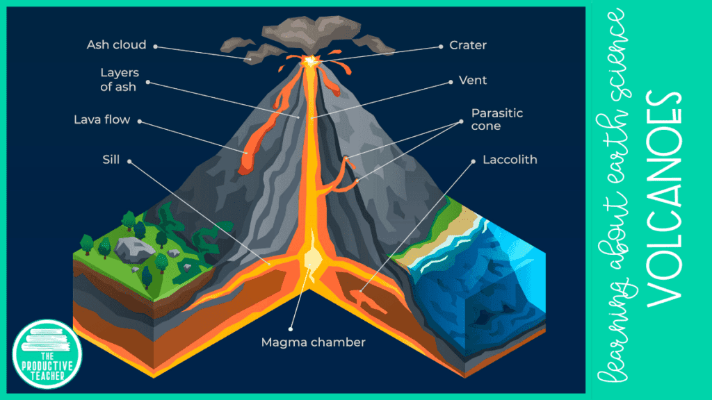
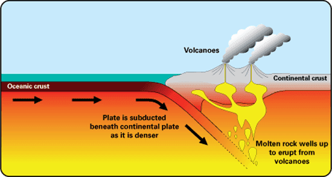
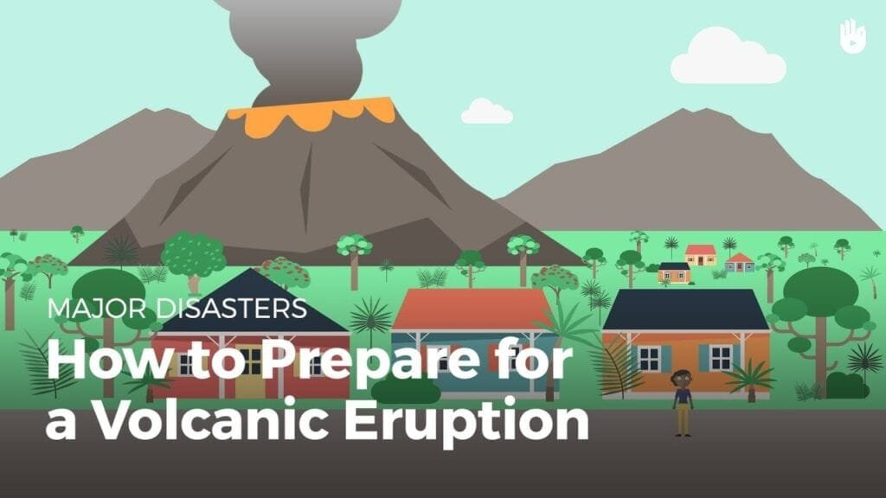

Have you ever wondered how volcanoes are formed and what causes them to erupt? Understanding the process of volcano formation is not only fascinating but also crucial for predicting future volcanic activity and mitigating risks to surrounding communities. Volcanoes are formed when molten rock, gases, and debris escape to the earth's surface, resulting in eruptions of lava and ash. They can occur at sites along plate boundaries, hotspots under the earth's crust, or rift zones where tectonic plates are moving apart. In this article, we will explore five tips that will help you gain a deeper understanding of volcano formation and the factors that influence eruption patterns. From the different types of volcanoes and their geographic distribution to the causes of eruptions and the hazards and benefits they bring, this captivating journey into the world of volcanoes will leave you in awe of these natural wonders. So let's dive in and unravel the mysteries of volcano-induced crust formation together!

This image is property of theproductiveteacher.com.

## Understanding the Basics of Volcano Formation

Volcanoes are natural geological formations on the Earth's surface that are formed when molten rock, gases, and debris from below the surface escape and erupt, producing lava and ash. It is essential to understand the basics of volcano formation to grasp the intricate processes involved in their development and eruption.

### The role of magma in volcano formation

At the heart of volcano formation lies magma, which is molten rock beneath the Earth's surface. Magma is generated by the partial melting of the Earth's mantle or the crust. It is less dense than its surrounding rocks, allowing it to rise towards the surface through cracks and fractures in the Earth's crust. As magma rises, it accumulates in magma chambers, large underground reservoirs, and it becomes the primary source of volcanic eruptions.

### How tectonic plate movements influence volcano formation

Tectonic plate movements play a crucial role in the formation of volcanoes. The Earth's lithosphere is divided into several large plates that float on the semi-fluid asthenosphere beneath them. These plates can move apart, collide, or slide past each other. When two plates separate, magma can rise to fill the gap, forming new crust and resulting in volcanic activity. Likewise, when two plates converge, one plate may be forced beneath the other in a process called subduction. This subduction can lead to the formation of volcanoes known as stratovolcanoes.

### The eruption process and its stages

Volcanic eruptions occur when the pressure of the trapped gases and build-up of magma within the volcano becomes too great, forcing its release. The eruption process is dynamic, consisting of several distinct stages.

1. **Precursory signs:** Prior to an eruption, there are often warning signs such as [increased seismic activity](https://magmamatters.com/the-art-and-science-of-volcano-monitoring/ "The Art and Science of Volcano Monitoring"), ground deformation, and gas emissions. Monitoring these signs helps scientists predict and prepare for potential eruptions.
    
2. **Volcanic unrest:** This stage is characterized by an increase in volcanic activity, including heightened seismicity, ground deformation, and the release of volcanic gases. It is a crucial period for monitoring and assessing the potential hazards associated with the volcano.
    
3. **Eruption onset:** During this stage, the volcano begins to release gases, ash, and lava. The eruption can vary in intensity, duration, and type depending on several factors, including the volcano's type and composition.
    
4. **Climactic eruption:** This stage represents the peak of the eruption, where there is a significant release of volcanic materials such as ash, pyroclastic flows, and lava. The eruption can cause widespread disruption and pose substantial risks to both human life and the environment.
    
5. **Post-eruption activity:** After the main eruption, volcanic activity may continue in the form of smaller eruptions, gas emissions, and the formation of new volcanic features. Understanding post-eruption activity is crucial for long-term monitoring and assessment of volcanic hazards.
    

## Examining Different Types of Volcanoes

Volcanoes come in various shapes and sizes, each with distinct characteristics and eruption patterns. Understanding these different types of volcanoes provides valuable insights into their behavior and potential hazards they pose.

### Characteristics and features of shield volcanoes

Shield volcanoes derive their name from their broad, gently sloping shape, resembling an ancient warrior's shield. They are typically composed of basaltic lava, which has low viscosity and can flow for long distances before solidifying. Shield volcanoes are generally not prone to explosive eruptions but, instead, experience relatively mild eruptions with the effusion of lava flows. This type of volcano is commonly found in Hawaii, where the hot spot beneath the Pacific Plate has formed a chain of shield volcanoes, such as Mauna Loa and Mauna Kea.

### Stratovolcanoes and their explosive eruptions

Stratovolcanoes, also known as composite volcanoes, are tall and steep-sided structures composed of alternating layers of hardened lava, volcanic ash, and other volcanic debris. These volcanoes are associated with explosive eruptions due to the high viscosity of their magma, which traps gases and leads to pressure build-up. The explosive nature of [stratovolcanoes can result in the formation of pyroclastic flows](https://magmamatters.com/understanding-volcanic-formation-a-comprehensive-guide/ "Understanding Volcanic Formation: A Comprehensive Guide"), volcanic ash clouds, and lahars (volcanic mudflows). Famous examples of stratovolcanoes include Mount Vesuvius in Italy and Mount Fuji in Japan.

### Cinder cones, their shape, and eruption patterns

[Cinder cones](https://magmamatters.com/the-birth-of-new-land-understanding-cinder-cones/), also known as scoria cones, are small, steep-sided volcanoes characterized by their conical shape and loose, fragmented material known as cinders. They form from the eruption of gas-rich magma, which explodes into the air and falls back to the ground, accumulating and forming a cone-shaped structure. Cinder cones typically have short eruptions and can occur as standalone volcanoes or as secondary cones on larger volcanoes.

### The uniqueness of the dome-shaped lava dome volcanoes

Lava domes, also called volcanic domes, are rounded mounds or bulbous structures composed of highly viscous lava that does not flow easily. They form when thick and sticky lava erupts and piles up around the vent instead of flowing away. Lava dome eruptions are often characterized by slow and continuous lava extrusion, with the potential for explosive activity when the dome collapses or is disrupted. Mount St. Helens in the United States exhibited lava dome growth and subsequent eruption during its 1980 eruption.

### Maar and caldera types: caused by violent explosions

Maars and calderas are volcanic features associated with explosive volcanic eruptions. Maars are shallow, wide craters that form when rising magma interacts with groundwater, causing a steam-driven explosion. Calderas, on the other hand, are large, basin-shaped depressions resulting from the collapse of a volcano into an emptied magma chamber. Examples of calderas include the Yellowstone Caldera in the United States and Lake Toba Caldera in Indonesia.

<iframe width="560" height="315" src="https://www.youtube.com/embed/lAmqsMQG3RM" frameborder="0" allow="accelerometer; autoplay; encrypted-media; gyroscope; picture-in-picture" allowfullscreen></iframe>

  

## Geographic Distribution of Volcanoes

Volcanoes are not evenly distributed across the Earth's surface but tend to occur in specific geologically active regions. Understanding the geographic distribution of volcanoes provides valuable insights into their formation and helps identify areas prone to volcanic activity.

### Examining the 'Ring of Fire' and its high volcanic activity

The "Ring of Fire" is a term used to describe a major area in the basin of the Pacific Ocean, where a large number of earthquakes and volcanic eruptions occur. It stretches from the western coast of the Americas, through the Aleutian Islands, down to Japan, Southeast Asia, and New Zealand. The 'Ring of Fire' is associated with the presence of tectonic plate boundaries, including subduction zones, where one tectonic plate is forced beneath another, leading to the formation of volcanic arcs.

### Understanding why Hawaii has active shield volcanoes

Hawaii is renowned for its active shield volcanoes, such as Mauna Loa and Kilauea. These volcanoes are formed by the movement of the Pacific Plate over a fixed hot spot in the mantle beneath the Earth's crust. The hot spot generates magma, which rises towards the surface, forming a chain of shield volcanoes over millions of years. The eruptions in Hawaii are typically characterized by the effusion of relatively low-viscosity lava, resulting in the gradual growth of the shield volcanoes.

### Mid-Atlantic Ridge: A glimpse into underwater volcano formation

The Mid-Atlantic Ridge is a submarine mountain range that runs down the center of the Atlantic Ocean. It marks the boundary between two diverging tectonic plates, the Eurasian Plate and the North American Plate. As the plates move away from each other, magma from the Earth's mantle rises to fill the gap, creating new crust and forming underwater volcanoes along the ridge. These volcanic eruptions are generally not explosive and contribute to the continuous growth of the ocean floor.

### East African Rift Zone and its influence on volcano formation

The East African Rift Zone is a geologically active region in East Africa where the Earth's crust is being pulled apart, resulting in the formation of a series of rift valleys. Volcanoes in this region are associated with the process of continental rifting, where the lithosphere thins and allows the ascent of magma to the surface. The East African Rift Zone is home to several notable volcanoes, including Mount Kilimanjaro and Mount Nyiragongo. The volcanic activity in this area provides valuable insights into the process of rift formation and the associated volcanism.

## Understanding the Causes of Volcano Eruptions

Volcanic eruptions are complex events that result from a combination of factors, including pressure build-up, gas content, and lava viscosity. Understanding the causes of volcano eruptions is crucial for predicting their occurrence and assessing the potential hazards they pose.

### The role of pressure build-up in volcano eruptions

One of the primary causes of volcanic eruptions is the build-up of pressure within the volcano's magma chamber. As magma rises towards the surface, it can become trapped and accumulate in the chamber, leading to an increase in pressure. When the pressure becomes too great, it overcomes the resistance of the confining rocks and triggers an explosive eruption.

### The effect of gas content on eruption patterns

The presence of gases in magma plays a significant role in determining the eruption patterns of volcanoes. Magma contains dissolved gases, predominantly water vapor, carbon dioxide, and sulfur dioxide. As magma rises, the decrease in pressure allows these gases to escape, leading to the formation of bubbles. If the magma is highly viscous, these bubbles can become trapped, causing a build-up of pressure and potentially explosive eruptions. In contrast, if the magma is low in viscosity, the gases can escape more freely, resulting in less explosive eruptions characterized by effusive lava flows.

### How lava viscosity influences the explosiveness of eruptions

The viscosity of lava, or its resistance to flow, plays a crucial role in determining the explosiveness of volcanic eruptions. Lava viscosity is primarily controlled by its composition, temperature, and gas content. Highly viscous lava, such as andesitic or rhyolitic lava, has a thick and sticky consistency and tends to trap gases. As a result, the pressure build-up can become significant, leading to explosive eruptions. In contrast, low-viscosity lava, such as basaltic lava, flows more easily and allows gases to escape, resulting in less explosive eruptions characterized by lava flows rather than explosive pyroclastic activity.

This image is property of www.bgs.ac.uk.

## Investigating Volcanic Hazards

Volcanic eruptions have the potential to cause a wide range of hazards, including pyroclastic flows, lahars, lava flows, volcanic gases, and ashfall. Investigating these hazards is crucial for understanding their impacts and implementing effective measures to mitigate risks.

### The destructive power of pyroclastic flow

One of the most deadly volcanic hazards is a pyroclastic flow, a fast-moving cloud of hot gas, ash, and volcanic debris that travels down the slopes of a volcano. Pyroclastic flows can reach speeds of several hundred kilometers per hour and have temperatures exceeding 1,000 degrees Celsius. They can devastate everything in their path, incinerating and suffocating living organisms and destroying infrastructure. Pompeii's destruction during the eruption of Mount Vesuvius in 79 AD is a historical example of the catastrophic power of pyroclastic flows.

### Lahars: Explaining these dangerous volcanic mudflows

Lahars are volcanic mudflows that occur when melted snow and ice, or heavy rainfall, mixes with volcanic ash and other debris, creating a fast-moving slurry of mud and rock. Lahars can travel down river valleys and can be highly destructive, burying communities, destroying infrastructure, and altering the landscape. They are a significant hazard associated with volcanoes that are covered by glaciers or experience heavy rainfall.

### Lava flow hazards and the risks they pose

Lava flows, although relatively slow-moving compared to other volcanic hazards, can still cause significant damage. Lava flows can destroy structures, block roads, and engulf vegetation. The extent of the damage depends on the volume and speed of the flowing lava, as well as the topography of the surrounding area. Effusive lava flows are common in shield volcanoes, such as those found in Hawaii, and can pose risks to nearby communities and infrastructure.

### Volcanic gases: Threats to both the environment and life

[Volcanic gases](https://magmamatters.com/the-environmental-impact-of-volcanic-eruptions-2/ "The Environmental Impact of Volcanic Eruptions") released during eruptions can pose significant threats to both the environment and human health. The most common volcanic gases include water vapor, carbon dioxide, sulfur dioxide, and hydrogen sulfide. These gases can cause respiratory problems, acid rain, and contribute to the formation of smog and haze. In high concentrations, volcanic gases can be toxic, leading to asphyxiation and death. Monitoring and mitigating the impacts of volcanic gases are essential to protect both the environment and human populations.

### Understanding the impact of ashfall

Ashfall is a widespread hazard associated with volcanic eruptions. Volcanic ash consists of small volcanic glass fragments and rock particles that are ejected into the atmosphere during an eruption. Ashfall can travel long distances and settle on the ground, causing a range of impacts. It can damage crops, contaminate water sources, disrupt air travel by damaging aircraft engines, and pose health risks due to its abrasive and irritating nature. Volcanic ash can also have long-term impacts on the environment, affecting ecosystems and soil fertility.

## Benefits of Volcanoes to the Environment

While volcanic eruptions can pose significant risks and hazards, they also bring valuable benefits to the environment. Understanding these benefits provides a balanced view of the role of volcanoes in shaping the Earth's landscapes and ecosystems.

### Nutrient enrichment of soil due to volcanic eruptions

Volcanic eruptions contribute to the nutrient enrichment of soil, making it more fertile for plant growth. Volcanic ash and lava contain essential minerals and organic matter that can enhance soil quality. This nutrient-rich soil can promote the growth of crops, supporting agriculture in volcanic regions and providing opportunities for sustainable livelihoods.

### Creation of new landmasses and islands by volcanic activity

Volcanic activity plays a significant role in the creation of new landmasses and islands. When lava erupts and cools, it solidifies, building up layers over time and forming new land. Examples of this process include the formation of the Hawaiian Islands and other volcanic archipelagos around the world. These newly formed landmasses provide unique habitats for various plant and animal species, contributing to biodiversity.

### Natural hot springs creation: A leisurely benefit of Vulcanicity

Volcanic activity also gives rise to natural hot springs, which are enjoyed by people around the world for their relaxing and therapeutic properties. Hot springs result from heated groundwater that is heated by geothermal activity associated with volcanic systems. These hot springs attract tourists and provide economic benefits to local communities. They also hold cultural and spiritual significance in many societies and have been used for healing purposes for centuries.

This image is property of www.nps.gov.

## Predicting Volcanic Activity

Predicting volcanic activity is crucial for the safety and well-being of communities living near active volcanoes. Scientists utilize various monitoring techniques to detect signs of volcanic unrest and anticipate potential eruptions.

### Monitoring seismic activity to predict eruptions

Monitoring seismic activity is a fundamental tool for predicting volcanic eruptions. Seismometers, instruments that detect and record ground vibrations, are deployed around volcanoes to monitor earthquake activity. As magma moves beneath the surface, it generates seismic waves that can be detected and analyzed. Changes in the frequency, intensity, and location of earthquakes can indicate the movement and rise of magma, helping scientists predict potential eruptions.

### Studying deformation patterns around volcanoes

Monitoring ground deformation is another critical aspect of predicting volcanic activity. Satellites equipped with specialized radar instruments are used to measure minute changes in the Earth's surface around volcanoes. These measurements can detect inflation or deflation of the ground caused by the movement or accumulation of magma. By analyzing deformation patterns, scientists can gain insights into the behavior of a volcano and its potential for eruption.

### Observing gas emissions to anticipate eruptions

Gas emissions from volcanoes provide essential information about the activity occurring beneath the surface. Gas analyzers, remote sensing techniques, and ground-based sampling are used to measure and analyze volcanic gases, such as sulfur dioxide and carbon dioxide. Changes in the composition and intensity of these gases can indicate conditions conducive to an eruption. Monitoring gas emissions allows scientists to anticipate volcanic activity and issue timely warnings to at-risk populations.

## Mitigating Risks from Volcano Eruptions

Mitigating the risks associated with volcano eruptions is crucial to protect human lives and infrastructure. Effective measures can be implemented to reduce the impacts of volcanic activity on vulnerable communities.

### Understanding different evacuation plans

Creating and implementing well-designed evacuation plans is essential for minimizing the risks associated with volcanic eruptions. These plans should include clear instructions on evacuation procedures, designated safe zones or shelters, routes, and communication channels. Regular drills and public awareness campaigns can help ensure that communities are prepared and know what actions to take in the event of an eruption.

### The role of land use planning in reducing eruption-related risks

Land use planning plays a significant role in reducing eruption-related risks. Identifying areas prone to volcanic hazards and implementing zoning regulations can prevent or restrict human settlements in high-risk areas. Building codes can also be enforced to ensure that infrastructure is constructed to withstand volcanic hazards such as ashfall, pyroclastic flows, or lahars. By incorporating volcano hazard assessments into land use planning, the potential for loss and damage can be minimized.

### The importance of early warning systems

Early warning systems are crucial for providing timely information and alerts to communities at risk. These systems utilize real-time monitoring data, such as seismic activity, gas emissions, and ground deformation, to detect signs of volcanic unrest. When abnormal volcanic activity is detected, warnings can be issued to the public through various communication channels, including sirens, text messages, or social media. Rapid and accurate warnings can provide individuals with the necessary time to evacuate and mitigate the impacts of volcanic eruptions.

This image is property of i.ytimg.com.

## The Role of Volcanoes in Climate Change

Volcanic eruptions can have significant impacts on the Earth's climate system. Understanding the role of [volcanoes in climate change](https://magmamatters.com/geothermal-energy-and-its-volcanic-origins/ "Geothermal Energy and Its Volcanic Origins") is essential for accurately assessing and predicting the long-term effects of volcanic activity.

### How volcanoes influence global temperatures

Volcanic eruptions can have both cooling and warming effects on global temperatures. During large explosive eruptions, volcanic aerosols (tiny particles suspended in the atmosphere) are injected into the stratosphere, where they can remain for several years. These aerosols reflect sunlight back into space, resulting in a cooling effect on the Earth's surface. However, volcanic eruptions can also release greenhouse gases, such as carbon dioxide and methane, into the atmosphere, contributing to the warming of the planet over longer timescales.

### Volcanic eruptions and their impact on atmospheric composition

Volcanic eruptions have a significant impact on the composition of the Earth's atmosphere. In addition to releasing gases, volcanic eruptions emit aerosols, sulfur dioxide, and other trace gases. These emissions can interact with the atmosphere, altering the concentration of greenhouse gases, and affecting atmospheric chemistry. The resulting changes in atmospheric composition can, in turn, influence climate patterns and weather conditions regionally and globally.

### Understanding the particulates produced by volcanic eruptions and their climatic effects

Particulates, such as volcanic ash and aerosols, produced during volcanic eruptions have diverse climatic effects. Volcanic ash can be reflective, causing a cooling effect by scattering sunlight and reducing the amount of solar radiation reaching the Earth's surface. On the other hand, volcanic aerosols, particularly those rich in sulfur dioxide, can react with water vapor in the atmosphere, forming reflective sulfate aerosols known as volcanic haze or vog. These aerosols can contribute to the cooling effect of volcanic eruptions by scattering sunlight. However, the specific climatic effects depend on the size, composition, and distribution of the particulates, as well as the duration and intensity of the eruption.

## Historic Volcano Eruptions and Their Impacts

Throughout history, several volcanic eruptions have left a lasting impact on both the environment and human societies. Examining these historic eruptions provides valuable insights into the consequences of volcanic events and the measures taken to deal with their aftermath.

### Looking back at the catastrophic eruption of Mount Vesuvius

One of the most infamous volcanic eruptions in history is the eruption of Mount Vesuvius in 79 AD. This catastrophic event buried the ancient cities of Pompeii and Herculaneum under several meters of volcanic ash and rock, preserving them for centuries. The eruption resulted in the loss of thousands of lives and had a significant impact on the region. Today, the ruins of Pompeii serve as a remarkably preserved historical site and provide a glimpse into the daily life of ancient Romans.

### The devastating consequences of Mount St. Helens' eruption

The eruption of Mount St. Helens in Washington State, United States, in 1980 was one of the most destructive volcanic events in recent history. The eruption caused the partial collapse of the volcano's north flank, triggering a powerful lateral blast that devastated the surrounding area. The eruption resulted in the loss of several dozen lives, the destruction of miles of forests, and significant disruption to infrastructure and ecosystems. The event also provided valuable data for scientists studying eruption dynamics, helping to improve eruption forecasting and hazard mitigation measures.

### The recent eruption of Krakatoa and its aftereffects

The eruption of Krakatoa in 1883 remains one of the most powerful volcanic events ever recorded. The eruption resulted in the collapse of the volcano, triggering a series of catastrophic explosions and generating tsunamis that devastated coastal regions. The eruption ejected a massive amount of volcanic ash and gases into the atmosphere, causing global climate effects. The atmospheric impact of the eruption led to unusual weather patterns and spectacular sunsets observed worldwide.

### Analyzing the long-term impact of these volcanic events

Studying the long-term impact of historic volcanic events is critical for understanding the lasting effects they have on the environment and human societies. These events reshape landscapes, alter ecosystems, and can have significant socio-economic impacts. By analyzing the aftermath of these eruptions, both immediate and long-term, scientists can improve their understanding of volcanic hazards and contribute to the development of effective mitigation strategies.

In conclusion, understanding the basics of volcano formation, examining different types of volcanoes, studying the geographic distribution of volcanoes, comprehending the causes of volcano eruptions, investigating volcanic hazards, recognizing the benefits of volcanoes to the environment, predicting volcanic activity, mitigating risks from volcano eruptions, understanding the role of volcanoes in climate change, and analyzing historic volcano eruptions and their impacts are all essential aspects of comprehensively understanding and studying volcanoes. By expanding our knowledge of volcanoes, we can better predict their behavior, mitigate risks to surrounding communities, and appreciate the diverse benefits they bring to our environment.

