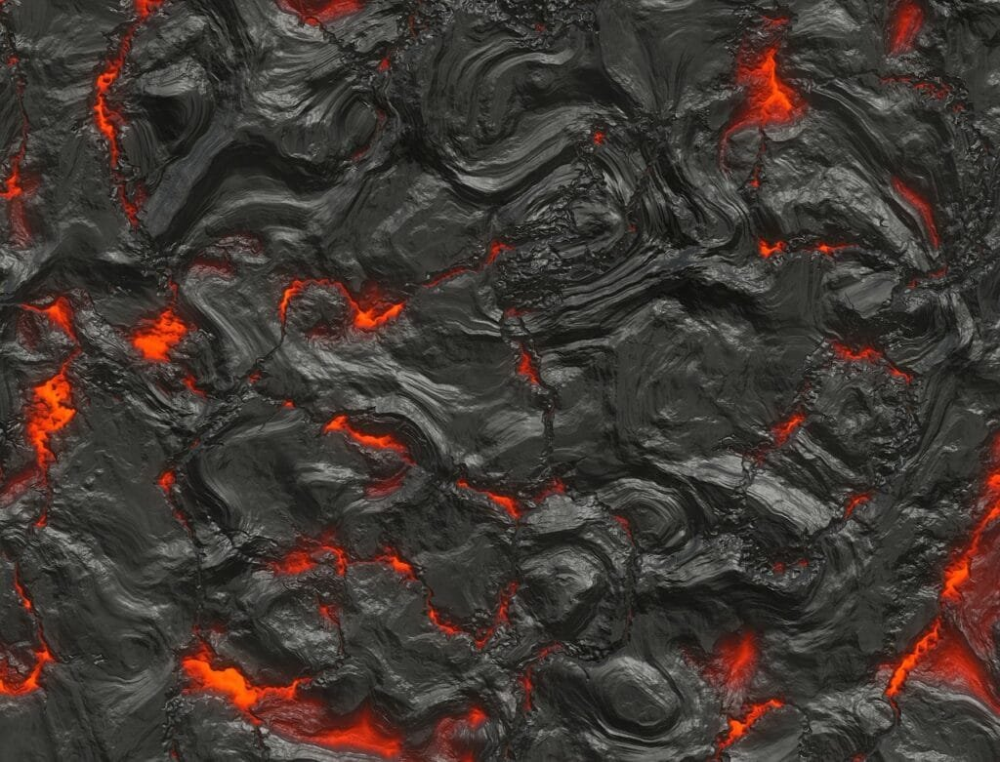
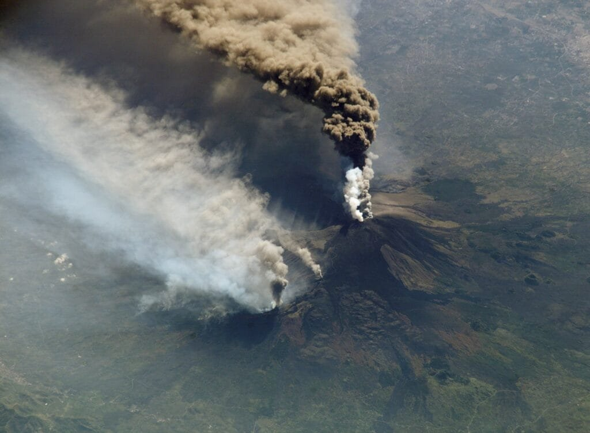
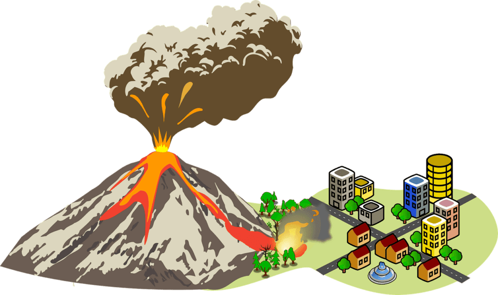

Imagine standing at the edge of a breathtaking island, surrounded by crystal-clear waters and lush vegetation. Have you ever wondered how these awe-inspiring islands came to be? Look no further, because in this article, we are going to explore the 7 best examples of island formation through volcanic eruptions. Volcanoes, those magnificent forces of nature, have the power to shape and create entire islands. From the explosive eruptions of the Ring of Fire to the gradual formation of shield volcanoes in Hawaii, the world is filled with fascinating examples of these volcanic marvels. Join us as we delve into the mesmerizing world of island formation and discover the incredible geological processes behind these [natural](https://magmamatters.com/the-art-and-science-of-volcano-monitoring/ "The Art and Science of Volcano Monitoring") wonders.

This image is property of pixabay.com.

## Hawaii Island Formation

Hawaii, also known as the Big Island, is a unique archipelago that was formed through a series of volcanic eruptions. The formation of these islands is attributed to hotspot eruptions, where a plume of hot material rises from deep within the Earth's mantle. This hotspot, known as the Hawaiian hotspot, has been stationary for millions of years while the Pacific tectonic plate moves over it. As the plate moves, new volcanoes form, resulting in the creation of the Hawaiian islands.

The volcanic eruptions that have formed the Hawaiian islands are primarily of two types: [shield volcanoes and volcanic](https://magmamatters.com/understanding-volcanic-formation-a-comprehensive-guide/ "Understanding Volcanic Formation: A Comprehensive Guide") fissure eruptions. Shield volcanoes are characterized by broad, gently sloping sides and are formed by the accumulation of low-viscosity lava flows. These eruptions are typically non-explosive and are known for their steady, effusive flows of lava. In contrast, volcanic fissure eruptions occur when the Earth's crust cracks open, allowing lava to escape through multiple fissures. This type of eruption can result in extensive lava flows and the formation of lava channels.

One of the unique characteristics of the Hawaiian volcanoes is their continuous eruption activity. Unlike many other volcanoes, which have periodic eruption cycles, the Hawaiian volcanoes have been erupting nearly continuously for thousands of years. This sustained eruption activity has led to the gradual growth of the islands, with new lava flows extending the coastline and adding to the landmass. The volcanic activity has also given rise to a diverse range of landscapes, including black sand beaches, lava tubes, and volcanic craters.

Currently, the Hawaiian islands are in a state of active volcanic activity. The most active volcano on the Big Island is Kilauea, which has been erupting since 1983. Kilauea is known for its frequent lava flows and occasional explosive eruptions. The volcanic activity plays a significant role in shaping the island's geography and creating new land. However, it also poses risks to the local communities, as lava flows can destroy homes and infrastructure. Continuous monitoring and research are essential to understand and predict the volcanic activity of the Hawaiian islands.

## Galapagos Islands Formation

The Galapagos Islands, located in the Pacific Ocean off the coast of Ecuador, are another fascinating example of island formation through volcanic eruptions. The islands were formed by a series of volcanic eruptions that occurred over millions of years. Like the Hawaiian islands, the Galapagos Islands were formed through hotspot eruptions.

The volcanic eruptions that formed the Galapagos Islands were primarily of the shield volcano type. Shield volcanoes are characterized by their low and broad profiles, which are created by the accumulation of fluid lava flows. These eruptions are typically non-explosive and result in the gradual buildup of new land. Over time, the lava flows cool and solidify, creating the distinctive volcanic landscapes found on the Galapagos Islands.

One of the remarkable aspects of the Galapagos Islands is the unique wildlife and ecosystem that has evolved as a result of volcanic activities. The islands' isolation and volcanic origins have allowed for the development of many endemic species found nowhere else on Earth. Darwin's famous observations on the islands paved the way for his theory of evolution. The volcanic terrain provides a variety of habitats, including barren lava fields, lush forests, and diverse marine environments. This diversity has made the Galapagos Islands a haven for numerous species, including giant tortoises, marine iguanas, and unique bird species such as the Galapagos finches.

Currently, the Galapagos Islands are a UNESCO World Heritage site and a national park. The islands are carefully protected to preserve their unique ecosystems and biodiversity. However, they are also facing challenges due to human activities and [climate change](https://magmamatters.com/geothermal-energy-and-its-volcanic-origins/ "Geothermal Energy and Its Volcanic Origins"). Conservation efforts are crucial to ensure the long-term survival of the Galapagos Islands and their remarkable wildlife.

This image is property of pixabay.com.

## Icelandic Volcanic Eruption

Iceland, located in the North Atlantic Ocean, is a land of fire and ice, shaped by volcanic eruptions. The island's formation is a result of volcanic activity along the Mid-Atlantic Ridge, where the two tectonic plates that separate North America and Eurasia are diverging. The divergent boundary allows magma from the Earth's mantle to rise to the surface, leading to volcanic eruptions and the formation of new land.

The volcanic eruptions in Iceland are primarily of the fissure volcano type. Fissure volcanoes are characterized by long cracks in the Earth's crust, through which lava erupts. These eruptions can result in extensive lava flows, covering vast areas of land. Iceland's volcanic activity is also influenced by its location on the Mid-Atlantic Ridge, where the volcanic activity is linked to the movement of the tectonic plates.

Iceland is known for its unique characteristics and behaviors of volcanic activity. The country has numerous active volcanoes, with eruptions occurring regularly. The volcanic landscape is dominated by lava fields, volcanic craters, and geothermal features such as hot springs and geysers. The most famous volcano in Iceland is Eyjafjallajökull, which erupted in 2010, causing significant disruptions to air travel in Europe.

Currently, Iceland is in a state of active volcanic activity, and eruptions continue to shape the island's geography. The volcanic activity provides a source of geothermal energy, which is harnessed for heating and electricity production. However, the eruptions also pose risks to the local communities, as lava flows and volcanic ash can cause damage to infrastructure and affect air quality. Vigilant monitoring and preparedness are essential to mitigate these risks and ensure the safety of the population.

## Santorini Island Formation

Santorini, a picturesque island located in the Aegean Sea, was formed through a massive volcanic eruption. The island's formation is attributed to the collapse of a caldera, a large volcanic crater, following an eruption. The eruption of Santorini is one of the largest volcanic events in history, known as the Minoan eruption.

The Minoan eruption, which occurred around 3,600 years ago, had a significant impact on the Mediterranean civilization. The eruption was highly explosive and resulted in the collapse of the volcanic cone, forming a crescent-shaped caldera. The explosion sent a massive amount of volcanic ash and pumice into the atmosphere, affecting the climate and causing widespread destruction.

Today, the caldera of Santorini is filled with crystal clear blue water, creating a stunning natural landscape. The island's unique crescent shape is a testament to the volcanic activity that shaped its formation. The cliffs of the caldera provide breathtaking views, while the beaches of Santorini are renowned for their black and red volcanic sand. The volcanic soil also contributes to the island's fertile land, allowing for the cultivation of unique agricultural products, including the famous Santorini tomatoes and Assyrtiko grapes.

Currently, Santorini is a popular tourist destination, attracting visitors from around the world. The island's volcanic history and beautiful landscapes make it a unique and captivating destination. While the volcanic activity on Santorini is currently dormant, the potential for future eruptions remains. Ongoing monitoring and research are crucial to understanding the island's volcanic behavior and ensuring the safety of its residents and visitors.

This image is property of pixabay.com.

## The Formation of the Aleutian Islands

The Aleutian Islands, a chain of volcanic islands located in the northern Pacific Ocean, were formed through a process known as subduction. Subduction occurs when one tectonic plate is forced beneath another, resulting in the melting of the subducting plate and the formation of magma. This magma then rises to the surface, leading to volcanic eruptions and the creation of new land.

The volcanic eruptions that formed the Aleutian Islands are primarily associated with subduction zone volcanism. These eruptions occur when the Pacific tectonic plate subducts beneath the North American plate, resulting in the formation of a chain of composite volcanoes. Composite volcanoes are characterized by their steep slopes and explosive eruptions, which are caused by the interaction between viscous magma and gas-rich magma.

The Aleutian Islands are known for their unique features and diverse ecosystem, which have developed due to volcanic activities. The volcanic landscape is dominated by high peaks, deep valleys, and rugged coastlines. Glaciers, formed by the accumulation of snow and ice on the volcanic slopes, add to the islands' scenic beauty. The volcanic activity has also created a variety of habitats, supporting a rich biodiversity of plants and animals.

Currently, the Aleutian Islands are in a state of active volcanic activity, with several volcanoes monitored for potential eruptions. The volcanic activity poses risks to the local communities, as eruptions can produce ash clouds, tsunamis, and pyroclastic flows. Understanding the behavior of the volcanoes and implementing effective monitoring and warning systems are essential for minimizing the impact of volcanic eruptions and ensuring the safety of the residents.

## Islands Formed by Indonesia's Volcanoes

Indonesia, an archipelago located in Southeast Asia, is home to a vast number of islands formed through volcanic activities. The Indonesian archipelago is situated in the Ring of Fire, a region with intense tectonic activity, making it prone to volcanic eruptions and earthquakes. The islands in Indonesia have been formed through a combination of hotspot volcanism and subduction zone volcanism.

The volcanic eruptions that have formed the islands in Indonesia are primarily associated with subduction zone volcanism. The country is situated on the boundary between two tectonic plates, the Australian plate and the Eurasian plate, where the Australian plate subducts beneath the Eurasian plate. This subduction process has resulted in the formation of a chain of volcanic islands, including Java, Bali, Sumatra, and Sulawesi.

The volcanic activity in Indonesia has contributed to the unique characteristics and biodiversity of the islands. The volcanic landscapes are diverse and range from towering stratovolcanoes to volcanic cones and calderas. The fertile volcanic soil supports lush rainforests, terraced rice fields, and diverse agricultural production. The volcanic activity has also created a network of hot springs and geothermal resources, which are harnessed for energy and tourism.

Currently, Indonesia has numerous active volcanoes, and volcanic eruptions occur regularly. These eruptions pose risks to the local communities, as they can produce ash clouds, lahars, and pyroclastic flows. The country has implemented volcano monitoring systems and evacuation plans to mitigate these risks. Ongoing research and preparedness are essential to ensuring the safety and well-being of the population living in the volcanic areas.

## Formation of the Canary Islands

The Canary Islands, an archipelago located off the northwest coast of Africa, were formed through volcanic eruptions. The formation of these islands is attributed to hotspot volcanism, similar to the formation of the Hawaiian islands. The Canary Islands are situated on a hotspot, where a plume of hot material rises from deep within the Earth's mantle, creating volcanic activity.

The volcanic eruptions that formed the Canary Islands are primarily associated with shield volcanoes. Shield volcanoes are characterized by their low and broad profiles, which are formed by the accumulation of low-viscosity lava flows. These eruptions are typically non-explosive and result in the gradual buildup of new land. The volcanic activity has created a range of landscapes on the Canary Islands, including volcanic cones, lava tubes, and calderas.

The volcanic landscape of the Canary Islands is known for its unique characteristics. The islands are dominated by rocky coastlines, rugged mountain ranges, and sandy beaches. The volcanic soil is highly fertile and supports a diverse range of flora, including endemic species found only on the islands. The islands' climate, influenced by the trade winds and ocean currents, further adds to the biodiversity and ecological richness of the Canary Islands.

Currently, the Canary Islands are in a state of active volcanic activity, with several volcanoes considered potentially active. The volcanic activity poses risks to the local communities, as eruptions can produce lava flows and ash clouds. Effective volcano monitoring and emergency response systems are essential for protecting the population and minimizing the impact of volcanic eruptions. Studying the volcanic behavior and understanding the islands' geological history also contribute to the preservation of this unique archipelago.

In conclusion, the formation of islands through volcanic eruptions is a fascinating process that occurs in various parts of the world. From the gradual growth of the Hawaiian islands to the dramatic collapse of Santorini's caldera, each volcanic event has shaped the landscape and ecosystems in unique ways. Understanding the volcanic activity and its implications is crucial for predicting future eruptions and ensuring the safety of the communities living on these volcanic islands.

