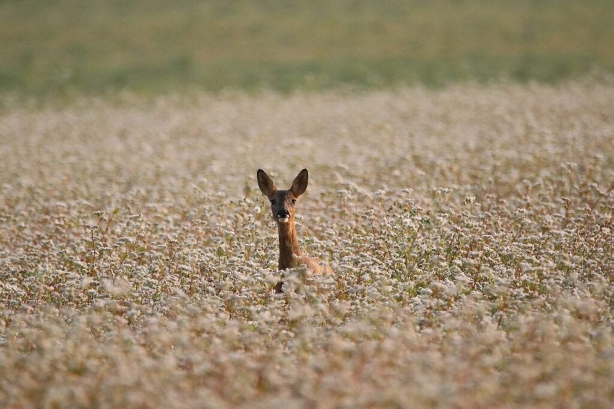

Picture this: a landscape once barren and desolate, transformed into a thriving ecosystem teeming with life. Volcanic eruptions, though destructive in nature, have the incredible power to breathe life back into the land. In this article, we will explore seven extraordinary examples of post-volcanic eruption biodiversity recoveries. From the lush rainforests of Mount St. Helens to the vibrant underwater world of the Kavachi volcano, these stories of resilience and regeneration will leave you in awe of the Earth's extraordinary ability to bounce back from devastation. So buckle up and prepare to be amazed by the incredible tales of nature's incredible recovery after volcanic eruptions.

This image is property of pixabay.com.

## Mount St. Helens, USA

### Blast and Aftermath

In 1980, Mount St. Helens in Washington State underwent a catastrophic eruption that resulted in the loss of its iconic symmetrical cone. The eruption, triggered by a magnitude 5.1 earthquake, caused the entire northern face of the mountain to collapse, releasing a tremendous pyroclastic flow and ash cloud. The blast annihilated the surrounding landscape, destroying vegetation, animals, and even human settlements. The eruption also generated lahars (fast-moving mudflows) that further devastated the area.

### Plant and Animal Regeneration

Despite the destruction caused by the eruption, Mount St. Helens became a living laboratory for studying [natural](https://magmamatters.com/the-art-and-science-of-volcano-monitoring/ "The Art and Science of Volcano Monitoring") regeneration and ecological recovery. Within the first year, scientists observed pioneering plant species colonizing the barren landscape. These species, known as "early successional species," are characterized by their ability to establish quickly in disturbed habitats. Lupine, fireweed, and various grasses were among the first plants to reclaim the ash-covered slopes.

As time went on, these pioneer plants created a more favorable environment for other plants to grow. Shrubs such as willows and alders began to establish, providing shade, shelter, and nutrients for other species. Eventually, conifer trees like Douglas fir and western hemlock started to dominate the landscape.

The resurgence of plants attracted a diverse array of wildlife back to the area. Elk, black bears, and mountain goats returned to feed on the growing vegetation, while smaller mammals like mice and squirrels found refuge in the newly established plant communities. Birds such as raptors, woodpeckers, and songbirds also made a comeback, utilizing the restored habitat for nesting and foraging.

### Current Biodiversity Status

Today, Mount St. Helens showcases a remarkable recovery in biodiversity. The once desolate landscape has transformed into a thriving ecosystem, housing a diverse range of plant and animal species. Researchers have documented over 150 species of birds, 41 species of mammals, 8 species of amphibians, and 14 species of fish in the area surrounding the volcano. The recovery of vegetation and the subsequent return of wildlife illustrate the resilience of nature in the face of tremendous destruction.

## Krakatoa, Indonesia

### 1883 Eruption and Consequences

The eruption of Krakatoa in 1883 was one of the most catastrophic volcanic events in recorded history. The eruption resulted in a series of massive explosions and [pyroclastic flows](https://magmamatters.com/the-environmental-impact-of-volcanic-eruptions-2/ "The Environmental Impact of Volcanic Eruptions") that unleashed a devastating tsunami, causing widespread destruction in coastal regions of Indonesia. The colossal ash cloud generated by the eruption dispersed across the globe, affecting global climate patterns and leading to vibrant sunsets in various parts of the world.

### Flora and Fauna Restoration

Following the eruption, the remnants of Krakatoa's islands were stripped of vegetation and wildlife. However, just a few years after the eruption, scientists began to witness the slow return of plant life to the volcanic islands. Pioneer plant species like ferns and mosses were the first to establish themselves, gradually paving the way for larger plants like shrubs and trees.

As the vegetation began to recover, animals started to repopulate the area. Insects and birds were among the first creatures to make a comeback. Over time, the migrants were joined by larger animals, including bats, reptiles, and mammals. The reestablishment of the diverse plant and animal communities created a self-sustaining ecosystem on the once-devastated islands.

### Present Biodiversity Overview

Today, Krakatoa has become a haven of biodiversity, showcasing a remarkable recovery since the 1883 eruption. The islands surrounding the volcano are home to a wide range of plant species, including various tropical trees, vines, and orchids. Wildlife on the islands includes birds such as hornbills and kingfishers, as well as reptiles like monitor lizards and pythons. The marine ecosystems surrounding Krakatoa also host an abundance of fish, corals, and other marine organisms, making it a popular destination for divers and researchers alike.

This image is property of pixabay.com.

## Kilauea, USA (Hawaii)

### Periodic Eruptions and Impacts

Kilauea, located on the Big Island of Hawaii, is one of the world's most active volcanoes. It has been erupting periodically for over three decades, with the most recent eruption occurring in 2018. The volcanic activity, while posing risks to human settlements, has also played a crucial role in shaping the island's unique landscape and promoting biodiversity.

During eruptions, the lava flows from Kilauea destroy everything in their path, including vegetation and animal habitats. Despite these destructive events, Kilauea's continuous eruptions also provide opportunities for new ecosystems to arise. Fresh lava creates barren landscapes, which eventually become fertile grounds for pioneer plant species.

### Plant and Wildlife Resurgence

In the aftermath of lava flows, the first plants to recolonize the newly formed terrain are typically fast-growing species like ferns and grasses. These plants help stabilize the soil and initiate the process of ecological succession. Over time, other plant species, such as shrubs and trees, establish themselves, transforming the once-barren lava fields into lush forests.

The revival of plant life attracts a diverse range of wildlife to Kilauea's surrounding areas. Insects, including endemic species found nowhere else on Earth, return to feed on the new vegetation. Birds like the 'apapane and the 'io (Hawaiian hawk) find suitable nesting sites in the rejuvenated forests. The resurgence of plant and animal life on Kilauea demonstrates the resilience of nature in adapting to volcanic disturbances.

### Biodiversity at Present Status

Kilauea's diverse ecosystems support a wide variety of flora and fauna. The volcano and its surrounding areas are home to over 90 native bird species, numerous endangered plants, and unique insects found only in Hawaii. Within the Hawaii Volcanoes National Park, which encompasses Kilauea, visitors can witness the ongoing process of volcanic regeneration and experience the incredible biodiversity that has emerged from the volcanic activity.

## Pinatubo, Philippines

### 1991 Eruption and Its Effects

In 1991, the eruption of Mount Pinatubo in the Philippines was one of the most significant volcanic events of the 20th century. The eruption released a massive ash cloud and pyroclastic flows, causing extensive damage to surrounding towns and cities. The volcanic ash spread across vast regions and even circled the Earth, leading to temporary global cooling.

### Flora and Fauna Recuperation

After the eruption, Pinatubo's surrounding landscape was devastated, with forests buried under ash and lahar deposits. However, nature proved resilient once again, and within a few years, plant life began to reestablish itself. Pioneer plant species like grasses, legumes, and ferns played a vital role in stabilizing the volcanic slopes, preventing erosion, and creating conditions for succession.

As the vegetation recovered, animals slowly returned to the area. Insects, birds, and small mammals were among the first to repopulate the rejuvenating landscape. The return of these animals contributed to the dispersal of seeds and the regeneration of plant communities, enhancing the overall recovery process.

### Current Biodiversity Assessment

Today, Mount Pinatubo and its surroundings exhibit encouraging signs of biodiversity recovery. The emergence of new forests and grasslands has provided habitat for a diverse range of species. The area is home to various bird species, including the Philippine eagle, known for its iconic appearance and endangered status. Other animals, such as deer, wild boars, and monkeys, also thrive in the rejuvenated ecosystem. The resilience displayed by the flora and fauna of Pinatubo is a testament to the power of nature's ability to rebound after a catastrophic event.

This image is property of pixabay.com.

## Eyjafjallajökull, Iceland

### 2010 Eruption and Ramifications

The Eyjafjallajökull eruption in 2010 captured worldwide attention due to its disruption of air travel across Europe. The eruption ejected significant amounts of ash and gases into the atmosphere, resulting in the closure of airspace and affecting millions of travelers. While the eruption had significant socioeconomic consequences, it also influenced the local environment.

### Plant and Animal Revival

In the wake of the eruption, Eyjafjallajökull's surrounding area experienced the deposition of volcanic ash and other materials, creating a challenging environment for plant life. However, the ash also acted as a fertilizer, delivering essential nutrients to the soil. Thus, despite the initial harsh conditions, plant species gradually colonized the ash-covered landscapes.

Pioneer plant species, particularly mosses and lichens, were critical in kickstarting the recovery process. They formed a protective layer over the barren land, allowing other plants to establish and grow. Over time, grasses, shrubs, and even trees reclaimed the landscape, transforming the post-eruption scene into a thriving ecosystem once again.

Animals also returned to Eyjafjallajökull's vicinity as vegetation recovered. Birds such as ptarmigans and snow buntings were among the first to come back, taking advantage of the new plant growth and nesting sites. Insects, small mammals, and grazing animals like sheep and reindeer also found their way back to the rejuvenated area.

### Present State of Biodiversity

Eyjafjallajökull's recovery following the 2010 eruption highlights nature's resilience. The area now supports a rich array of plant species, including various grasses, wildflowers, and dwarf shrubs. These plants, in turn, provide food and shelter for a diverse range of animals. Arctic foxes, which had temporarily relocated to other areas during the eruption, returned to their natural habitat. Birds, including migratory species, use the restored vegetation as breeding and stopover sites. The remarkable turnaround in Eyjafjallajökull's biodiversity serves as a reminder of nature's ability to rebound even after substantial disturbances.

## Sakurajima, Japan

### Frequent Eruptions and Results

Sakurajima, located in southern Japan, is one of the country's most active volcanoes. This highly active nature has had significant impacts on the local environment and communities. The volcano experiences frequent eruptions, emitting ash clouds, lava flows, and pyroclastic flows, which pose risks to nearby towns and cities.

### Flora and Fauna Reestablishment

Despite the ongoing eruptions, Sakurajima's surrounding areas have witnessed the resilience of life. After each eruption, plant life begins to regrow on the fresh lava and ash-covered slopes. Pioneer plant species, such as ferns, grasses, and mosses, play a crucial role in initiating ecological succession.

As the vegetation recovers, animals return to Sakurajima. Birds, including herons and wagtails, utilize the newly established plant communities for nesting and foraging. Insects, small mammals, and reptiles also repopulate the area, gradually reestablishing a diverse ecosystem.

### Existing Biodiversity Evaluation

Sakurajima's ongoing volcanic activity poses constant challenges to local ecosystems. However, despite the frequent disturbances, the area supports a remarkable diversity of plant and animal life. The volcano itself provides habitat for unique plant species, including several orchid varieties. Birdwatchers can spot various migratory bird species, as well as endemic birds like the Sakurajima wagtail. The resilience observed in Sakurajima's biodiversity demonstrates that life can adapt and thrive even under seemingly inhospitable conditions.

## Vesuvius, Italy

### 79 AD Eruption and Aftermath

The eruption of Mount Vesuvius in 79 AD was one of the most infamous volcanic events in history. The catastrophic eruption buried the Roman towns of Pompeii and Herculaneum under a thick layer of volcanic ash and debris, preserving them for future generations to discover and study.

### Regulation of Flora and Fauna

The eruption of Vesuvius in 79 AD caused widespread devastation, including the destruction of existing plant and animal communities. However, over time, the volcanic ash and debris acted as a natural fertilizer, enriching the soil with essential minerals.

As a result, the surrounding area experienced a resurgence of plant life. Pioneer species like grasses and shrubs were the first to recolonize the landscape, followed by tree species like pines and oaks. These plants played a vital role in stabilizing the soil and attracting a variety of animals back to the area.

### Biodiversity at Present

Today, the fertile slopes of Mount Vesuvius support a diverse array of plant and animal species. The volcano's National Park is home to more than 1,000 plant species, including Mediterranean scrub, orchids, and endemic wildflowers. Mammals such as foxes, wild boars, and hedgehogs roam the park, while numerous bird species nest in the trees and cliffs. Mount Vesuvius serves as a testament to the power of nature to regenerate and support thriving ecosystems, even in the aftermath of catastrophic events.

## Understanding Biodiversity Recovery

### Ecosystem Resilience after Eruption

Following a volcanic eruption, ecosystems have shown remarkable resilience in recovering from the destruction caused by lava flows, ash deposits, and toxic gases. The ability of ecosystems to rebound is due to several factors, including the unique adaptations of pioneer species, the dispersal of seeds, and the availability of ecological niches for colonization.

### Role of Pioneer Species in Recovery

Pioneer species, which are typically fast-growing and resilient plants, play a crucial role in kickstarting the recovery process after a volcanic eruption. These species can thrive in inhospitable environments, such as barren lava fields or ash-covered slopes. They stabilize the soil, create favorable microclimates, and enrich the soil with organic matter, making it conducive for other plants to establish and grow.

### Impact of Environmental Factors on Recovery

Environmental factors, such as climate, topography, and availability of nutrients, significantly influence the pace and extent of biodiversity recovery after a volcanic eruption. Different regions and ecosystems exhibit varying rates of recovery based on these factors. Additionally, the severity and longevity of the eruption itself also impact the recovery process, with more intense eruptions causing more severe damage and longer recovery timelines.

## Factors Affecting Biodiversity Regeneration

### Temporal Pattern and Severity of Eruption

The temporal pattern and severity of a volcanic eruption directly influence the extent to which biodiversity can recover in the affected area. Eruptions that are short-lived and less severe in their impacts may result in quicker recovery and minimal disturbances to ecosystems. However, more prolonged and intense eruptions can cause greater damage, resulting in longer recovery periods and potential long-term alterations to ecosystem dynamics.

### Species Traits

The specific traits of plant and animal species also play a role in their ability to regenerate after a volcanic eruption. Pioneer species, as mentioned earlier, have adaptations that enable them to establish themselves quickly in disturbed habitats. Additionally, species with efficient dispersal mechanisms, such as wind-dispersed seeds or migratory animals, have a higher likelihood of recolonizing the area and contributing to biodiversity recovery.

### Geographical and Climatic Factors

The geographical and climatic characteristics of the affected region can influence the recovery of biodiversity after a volcanic eruption. Regions with favorable climates, such as moderate temperatures and ample rainfall, are more conducive to plant growth and establishment. Additionally, proximity to other habitats or ecological corridors can facilitate the recolonization of animal species, promoting faster recovery.

## Effective Conservation Strategies

### Monitoring and Documenting Changes

After a volcanic eruption, ongoing monitoring and documentation of biodiversity recovery are crucial for assessing the success of ecological restoration efforts. Regular surveys and data collection allow scientists and conservationists to identify changes in species composition, population sizes, and ecosystem dynamics. This information helps inform further conservation strategies and ensures the long-term resilience of the recovered ecosystems.

### Promotion of Native Species

The promotion and restoration of native plant and animal species are vital for enhancing biodiversity recovery after a volcanic eruption. Native species are adapted to the specific environmental conditions of the region and play key ecological roles in their respective ecosystems. By reintroducing and supporting native species, conservation efforts can accelerate the recovery process and enhance the overall health and functionality of the ecosystem.

### Controlled Human Intervention and Minimal Disturbance

In some cases, controlled human intervention can aid in the recovery of biodiversity after a volcanic eruption. This intervention may involve activities such as habitat restoration, reforestation, and the translocation of endangered species to safer areas. However, it is crucial to minimize disturbance and ensure that interventions align with the natural processes of ecosystem recovery. Human activities should be carefully managed to avoid unintended negative consequences and to prioritize the preservation of natural ecological processes.

In conclusion, volcanic eruptions have the power to cause widespread devastation, but they also create unique opportunities for biodiversity recovery. Mount St. Helens, Krakatoa, Kilauea, Pinatubo, Eyjafjallajökull, Sakurajima, and Vesuvius serve as examples of the resilience and regenerative capacity of nature. From the establishment of pioneering plants to the return of diverse animal communities, these volcanoes have shown that life can flourish even in the face of immense destruction. Understanding the factors that affect biodiversity recovery, such as eruption severity, species traits, and environmental conditions, can guide effective conservation strategies. By monitoring, promoting native species, and minimizing disturbance, we can support the recovery of ecosystems and ensure their long-term sustainability.

