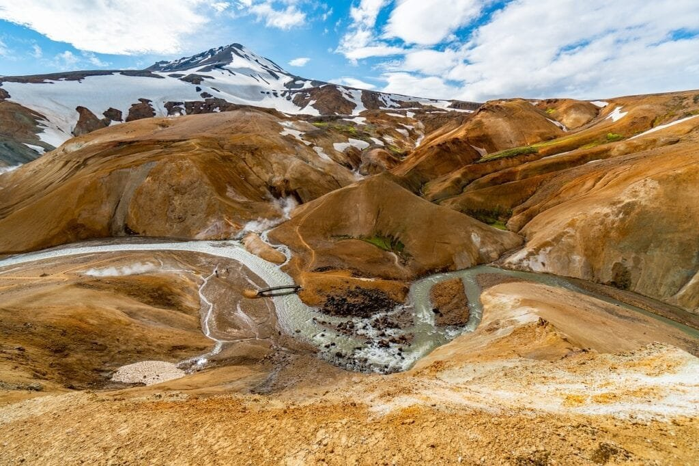

In this article, you will discover 7 tips for monitoring volcanic greenhouse gas emissions. Volcanoes, with their eruptions of lava and ash, are formed when molten rock, gases, and debris escape to the Earth's surface. Understanding the different types of volcanoes, their eruption patterns, and the geographic distribution is essential in predicting future volcanic activity and mitigating risks to surrounding communities. Volcanic eruptions not only provide nutrients to soil but also contribute to climate change through the release of greenhouse gases. By monitoring these emissions, scientists can gain valuable insights into the impact of volcanoes on our environment and work towards developing strategies for managing their effects. So, let's dive into these 7 tips and unravel the fascinating world of volcanic greenhouse gas emissions and climate change.

This image is property of pixabay.com.

## Understanding the Connection Between Volcanoes and Greenhouse Gas Emissions

Volcanoes play a significant role in the release of greenhouse gases, which are known to contribute to global warming. The combination of molten rock, gases, and debris escaping to the Earth's surface during volcanic eruptions results in the release of these gases into the atmosphere. This release occurs through various [volcanic emission processes, including the eruption of lava, ash, and volcanic gases such as carbon dioxide](https://magmamatters.com/the-art-and-science-of-volcano-monitoring/ "The Art and Science of Volcano Monitoring") (CO2) and sulphur dioxide (SO2).

The greenhouse gases emitted by volcanoes, particularly carbon dioxide and sulphur dioxide, contribute to global warming in several ways. Carbon dioxide, which is considered a primary volatile emitted by volcanoes, is a known greenhouse gas that traps heat in the Earth's atmosphere. When released in large quantities, it adds to the overall concentration of greenhouse gases and intensifies the greenhouse effect. This leads to an increase in the Earth's average temperature and contributes to climate change.

Sulphur dioxide, another significant gas emitted by volcanoes, can also have harmful effects on the environment. When sulphur dioxide combines with water vapor in the atmosphere, it forms aerosols that can reflect sunlight back into space. This phenomenon, known as volcanic cooling, can temporarily lower global temperatures. However, these aerosols can also have adverse effects on air quality and human health when they descend to ground level as acid rain or volcanic smog (also known as vog).

It is essential to distinguish between natural greenhouse gas emissions from volcanoes and those initiated by human activities. While volcanic emissions are considered natural processes, human activities, such as the burning of fossil fuels, agricultural practices, and deforestation, have substantially increased greenhouse gas concentrations in recent decades. By understanding the distinction between these sources, scientists can better assess the contributions of each to global warming and develop effective strategies for mitigating climate change.

## Identifying Key Gases Emitted by Volcanoes

When it comes to volcanic emissions, several key gases play important roles. Carbon dioxide (CO2) is one of the primary volatile gases released during volcanic eruptions. CO2 is a greenhouse gas that contributes to global warming, as mentioned earlier. The sheer amount of carbon dioxide released during volcanic eruptions can significantly impact the Earth's climate system and surface temperature.

Sulphur dioxide (SO2) is another critical gas emitted by volcanoes. This gas can have both short-term and long-term effects on the environment. In the short term, SO2 can lead to the formation of aerosols that reflect sunlight, causing a temporary cooling effect. However, in the long term, sulphur dioxide can contribute to air pollution and acid rain, resulting in harmful effects on ecosystems and human health.

In addition to carbon dioxide and sulphur dioxide, volcanic emissions also contain water vapor and other gases. Water vapor is a greenhouse gas, but its concentration in volcanic emissions is relatively low compared to carbon dioxide and sulphur dioxide. Other gases present in volcanic emissions can include nitrogen, hydrogen chloride, and hydrogen fluoride, among others. These gases may have varying impacts on the environment and climate, but their contributions to global warming are generally less significant compared to carbon dioxide and sulphur dioxide.

<iframe width="560" height="315" src="https://www.youtube.com/embed/8AIIj3F8ArE" frameborder="0" allow="accelerometer; autoplay; encrypted-media; gyroscope; picture-in-picture" allowfullscreen></iframe>

  

## Investigating Volcanic Emission Monitoring Methods

Monitoring volcanic emissions is crucial for understanding their impact on climate and the environment. Several methods and techniques have been developed to study volcanic emissions, allowing scientists to accurately measure and analyze the gases released during eruptions.

Remote sensing techniques, such as satellite-based measurements, play a vital role in detecting and monitoring volcanic emissions. Satellites equipped with specialized instruments can measure the concentration of gases like sulphur dioxide and carbon dioxide in the Earth's atmosphere. This data helps scientists track volcanic activity and the dispersion of volcanic plumes, providing valuable information for understanding the global distribution of emissions.

Ground-based measurements and sampling are also essential in monitoring volcanic emissions. Scientists can install gas analyzers in strategic locations around active volcanoes to measure gas concentrations directly. This method allows for real-time monitoring and provides more precise data on gas composition and emission rates.

Advancements in technology have also led to the use of drones and aircraft for monitoring volcanic emissions. These airborne platforms can collect gas samples and measure environmental parameters while flying through volcanic plumes. This approach offers a more comprehensive understanding of volcanic emissions, as it allows for sampling at different altitudes and locations within the volcanic plume.

## Implementing Safety Measures During Monitoring

Monitoring volcanic emissions can be a hazardous task, as it often requires scientists and researchers to work in close proximity to active volcanoes. To ensure personal safety, it is crucial to implement proper safety measures during monitoring activities.

One of the key safety measures is the use of personal protective equipment (PPE). This includes items such as gas masks, goggles, gloves, and protective clothing, which help protect individuals from inhaling harmful gases or coming into direct contact with volcanic ash or debris.

Adhering to site-specific safety guidelines is also essential. Each volcanic site may have unique hazards and risks, and it is crucial to understand and follow the specific safety protocols put in place for that particular location. This may include restrictions on access to certain areas, evacuation routes in case of emergencies, and guidelines for working in hazardous conditions.

Proper usage of monitoring equipment is critical for both accurate data collection and personal safety. Scientists and researchers must receive appropriate training on operating monitoring equipment and understand how to interpret the data obtained. This ensures that monitoring activities are conducted efficiently and that potential risks are minimized.

This image is property of pixabay.com.

## Using Technological Advances to Aid Monitoring

Technological advances have greatly enhanced the monitoring of volcanic emissions, providing scientists with valuable tools and resources. Some of these technological advancements include the use of satellite imagery, global positioning systems (GPS), robotic systems, unmanned aerial vehicles (UAVs), and high-end spectrometry instruments.

Satellite imagery and GPS systems provide valuable data for monitoring volcanic emissions. Satellites can capture images of volcanic plumes, allowing scientists to track their movement and estimate the concentration of gases released. GPS systems can help measure ground deformation, providing insights into underground magma movements and potential volcanic eruptions.

Robotic systems and UAVs offer new possibilities for monitoring volcanic emissions safely and more efficiently. These technologies can be equipped with gas analyzers and other instruments to capture data in real-time, eliminating the need for humans to be in close proximity to potentially dangerous volcanic environments.

High-end spectrometry instruments, such as Fourier transform infrared spectrometers, provide precise measurements of gas concentrations in volcanic emissions. These instruments use sophisticated techniques to detect and quantify various gases present in volcanic plumes, allowing scientists to analyze their impact on climate and the environment more accurately.

## Interpreting Data from Volcanic Emission Studies

Collecting data on volcanic emissions is just the first step. Interpreting this data is crucial for understanding the effects of volcanic emissions on climate and the environment. Several key aspects need to be considered when interpreting data from volcanic emission studies.

Understanding emission rates is essential for assessing the impact of volcanic activity. Emission rates refer to the amount of gases released from a volcano within a specific time frame. By measuring and analyzing these rates, scientists can determine the magnitude of volcanic emissions and how they may contribute to global warming.

Assessing gas concentrations is another critical aspect of interpreting data from volcanic emission studies. Measuring the concentration of gases like carbon dioxide and sulphur dioxide allows scientists to analyze the potential effects of these gases on climate and the environment. It also helps in establishing correlations between gas emissions and volcanic activity.

Establishing correlations between gas emissions and volcanic activity is an important step in understanding the behavior of volcanoes. By analyzing the data collected from monitoring volcanic emissions, scientists can identify patterns and relationships between gas emissions and different stages of volcanic activity. This knowledge can aid in predicting future eruptions and mitigating potential risks.

This image is property of pixabay.com.

## Enhancing Knowledge on Volcanic Activity with Data Analysis

By analyzing and interpreting data from volcanic emission studies, scientists can gain a holistic understanding of volcanic behaviors. This knowledge is crucial for predicting eruptions and mitigating risks to surrounding communities. Several key areas can be enhanced through the analysis of volcanic emission data.

A holistic approach to understanding volcanic behaviors can be achieved by combining data from various sources, such as gas emission measurements, ground deformation measurements, and seismic activity monitoring. By analyzing these different aspects together, scientists can gain valuable insights into the complex processes occurring beneath volcanic systems. This comprehensive understanding helps in predicting volcanic activities more accurately.

Predicting eruptions based on gas emission patterns is another area where data analysis plays a vital role. By analyzing the trends and patterns in gas emissions, scientists can identify precursors to volcanic eruptions. Changes in gas composition, emission rates, or the presence of specific gases can indicate an impending eruption. This information can be used to issue early warnings and implement effective evacuation plans.

Conducting ongoing research and collaboration is essential for enhancing knowledge on volcanic activity. By continuously monitoring and analyzing volcanic emissions, scientists can contribute to the existing body of knowledge and improve our understanding of how volcanoes impact climate and the environment. Collaboration between scientists, researchers, and organizations from different fields can also provide new insights and promote innovative approaches to monitoring and predicting volcanic activity.

## Applying Information from Monitoring to Disaster Mitigation Plans

The information obtained from monitoring volcanic emissions can be crucial for formulating effective disaster mitigation plans. By understanding the behavior of volcanoes and the potential risks they pose, authorities can implement proactive strategies that prioritize areas at risk and ensure the safety of nearby communities.

Formulating effective emergency response strategies relies on accurate and timely information. By continuously monitoring volcanic emissions, scientists can provide authorities with up-to-date data on gas concentrations, emission rates, and other critical parameters. This information enables authorities to make informed decisions regarding evacuation plans, emergency shelter locations, and the allocation of resources during volcanic eruptions.

Prioritizing areas at risk is another important aspect of disaster mitigation planning. By analyzing data on gas emissions and geological activity, scientists can identify regions that are more likely to be affected by volcanic eruptions. This information allows authorities to focus their resources on these areas, implementing measures to reduce the potential impact on human lives and infrastructure.

Educating communities on early warning signs and evacuation procedures is essential for effective disaster mitigation. By integrating the information obtained from monitoring volcanic emissions into educational programs, communities can be better prepared to respond to volcanic threats. This includes understanding the signs of an impending eruption, knowing the evacuation routes, and being aware of precautionary measures to take in case of volcanic activity.

## Integrating Volcano Monitoring Reports into the Science of Climate Change

The data collected from monitoring volcanic emissions is valuable not only for understanding volcanic activity but also for enhancing our knowledge of climate change. Integration of [volcano monitoring reports into the science of climate change](https://magmamatters.com/understanding-volcanic-formation-a-comprehensive-guide/ "Understanding Volcanic Formation: A Comprehensive Guide") helps in developing more accurate climate models and predicting future climate trends.

Facilitating climate models is one of the key benefits of integrating volcano monitoring reports into the science of climate change. By incorporating data on volcanic emissions into climate models, scientists can improve the accuracy of these models in predicting future climate scenarios. The inclusion of volcanic emissions allows for a more comprehensive understanding of the factors influencing global temperature changes and climate patterns.

Incorporating volcanic emissions into the global carbon budget is another significant aspect of integrating volcano monitoring reports. The global carbon budget refers to the balance between carbon dioxide emissions and removals from the atmosphere. By accounting for volcanic emissions in this budget, scientists can have a more accurate estimate of the sources and sinks of carbon dioxide, enabling better assessments of human-induced climate change.

Predicting future climate trends based on volcanic activities is another benefit of integrating [volcano monitoring reports into the science of climate change](https://magmamatters.com/geothermal-energy-and-its-volcanic-origins/ "Geothermal Energy and Its Volcanic Origins"). By analyzing historical data on volcanic emissions and correlating them with climate records, scientists can identify patterns and trends that help predict future volcanic impacts on climate. This information is vital for developing strategies to mitigate the potential adverse effects of volcanic emissions on climate and the environment.

## Promoting Advocacy and Public Policy Changes Based on Findings

The findings from monitoring volcanic greenhouse gas emissions can be utilized to promote environmental advocacy and effect positive policy changes. By exploiting the data collected and analyzed during volcanic emission studies, scientists and researchers can raise public awareness about the impact of volcanic emissions on climate change.

Exploiting data for environmental advocacy involves disseminating information to the public, policymakers, and relevant organizations. By sharing the findings from volcanic emission studies, scientists and researchers can raise awareness about the role of [volcanoes in greenhouse gas emissions](https://magmamatters.com/the-environmental-impact-of-volcanic-eruptions-2/ "The Environmental Impact of Volcanic Eruptions") and their contribution to climate change. This increased awareness can help motivate individuals and communities to take action in reducing their carbon footprint and promoting sustainable practices.

Influencing policy decisions to mitigate climate change is another crucial aspect of promoting advocacy based on findings from volcanic emissions studies. By presenting accurate and compelling data to policymakers, scientists can influence decision-making processes and advocate for policies that target the reduction of greenhouse gas emissions. These policies may include measures to promote renewable energy sources, increase energy efficiency, and regulate industrial emissions.

Raising public awareness on the impact of volcanic greenhouse gas emissions is an essential part of promoting environmental advocacy. By effectively communicating the findings from volcanic emission studies to the public, scientists can foster a greater understanding of the challenges posed by climate change and volcanoes. This increased awareness can lead to changes in behavior and public support for policies that address the issue of greenhouse gas emissions.

In conclusion, understanding the connection between volcanoes and greenhouse gas emissions is crucial for addressing the challenges posed by climate change. By identifying key gases emitted by volcanoes, investigating monitoring methods, implementing safety measures, and utilizing technological advances, scientists can collect valuable data on volcanic emissions. Interpreting and analyzing this data enhances our knowledge of volcanic activity, aids in disaster mitigation planning, and contributes to the science of climate change. By applying the information obtained from monitoring volcanic emissions to disaster mitigation plans, integrating it into climate models, and promoting advocacy, positive changes can be made towards mitigating climate change and reducing the impact of volcanic greenhouse gas emissions.

