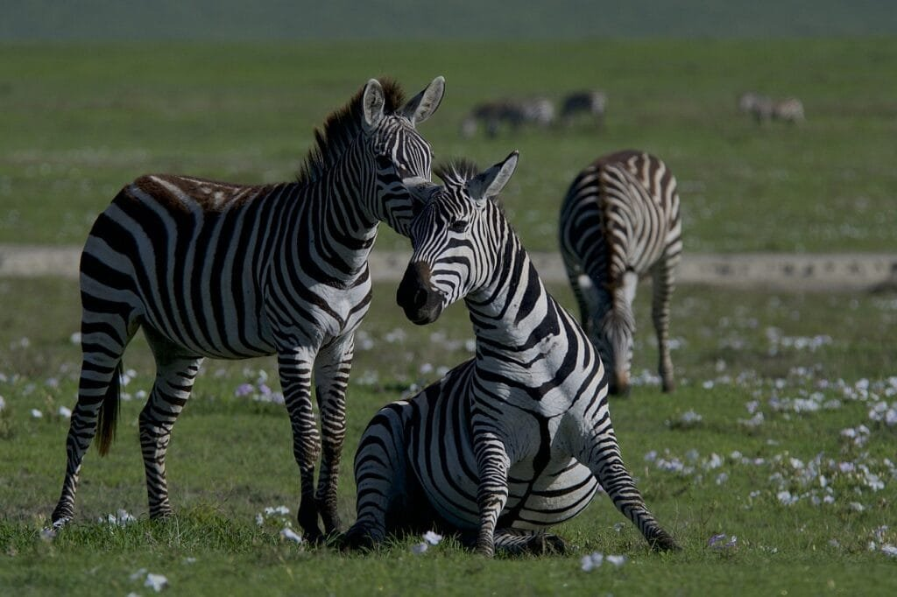
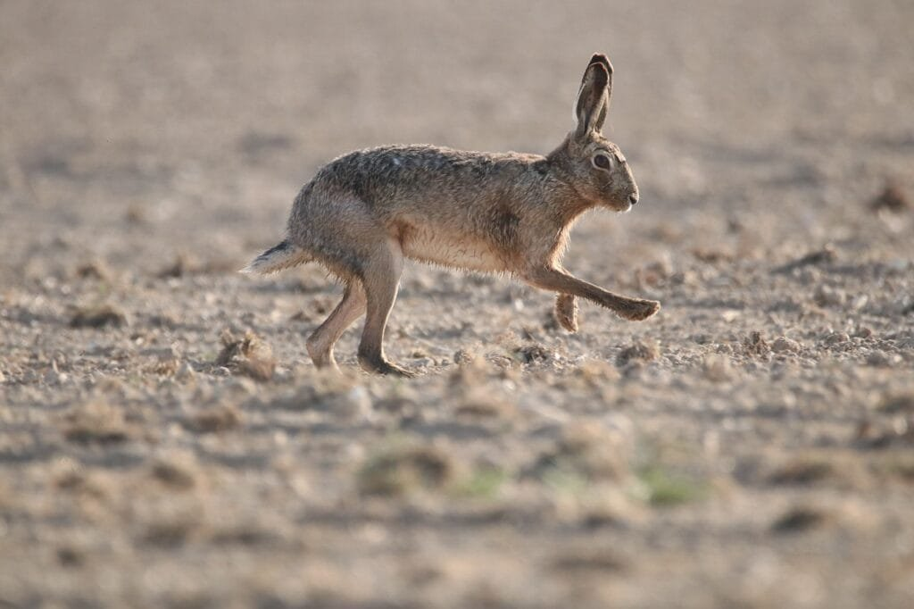

Protecting wildlife biodiversity in volcanic regions is crucial to ensuring the preservation of fragile ecosystems that inhabit these unique areas. Volcanoes, with their eruptions of lava and ash, create lands of both destruction and growth. Understanding the different types of volcanoes, their eruption patterns, and the hazards they pose can help us develop strategies to mitigate the impact on surrounding communities and wildlife. In this article, we will explore seven tips for protecting wildlife biodiversity in volcanic regions, providing valuable insights on how to strike a balance between the natural force of volcanoes and the preservation of thriving ecosystems.

This image is property of pixabay.com.

## Understanding Volcanic Activity and Its Effects on Wildlife

Volcanoes, with their powerful eruptions and molten lava flows, have captivated humans for centuries. However, it's not just the magnificent display of nature's raw power that makes volcanoes intriguing - they also have a significant impact on the surrounding wildlife and ecosystems. Understanding how volcanic activity affects wildlife is essential for conservation efforts and the preservation of biodiversity.

### Identifying the types of volcanoes

To comprehend the effects of volcanic activity on wildlife, it's crucial to identify the different [types of volcanoes](https://magmamatters.com/understanding-volcanic-formation-a-comprehensive-guide/ "Understanding Volcanic Formation: A Comprehensive Guide") and their characteristics. Volcanoes can be classified into various categories, such as stratovolcanoes, shield volcanoes, and [cinder cones](https://magmamatters.com/the-birth-of-new-land-understanding-cinder-cones/). Each type has distinct eruption patterns and levels of intensity, which in turn determine their impact on the surrounding environment.

Stratovolcanoes, also known as composite volcanoes, are characterized by steep slopes and a cone-like shape. These volcanoes often have explosive eruptions, resulting in the release of ash, pyroclastic flows, and toxic gases. Shield volcanoes, on the other hand, have gently sloping sides and are formed by the accumulation of fluid lava flows. Their eruptions are usually less explosive but can last for extended periods, affecting wildlife and their habitats differently.

### Recognizing different eruption patterns

Understanding the various eruption patterns exhibited by volcanoes is essential for predicting and preparing for their potential impacts on wildlife. Volcanic eruptions can be explosive or effusive, depending on the viscosity and gas content of the magma.

Explosive eruptions occur when highly viscous magma traps gases, resulting in powerful, explosive bursts of ash, rock fragments, and gases. These eruptions can cause significant destruction to wildlife habitats, such as forest fires and the burial of vegetation under volcanic ash.

Effusive eruptions, on the other hand, involve the release of less viscous magma that flows out of the volcano in a steady stream. These eruptions may lead to the creation of new landforms, such as lava fields and volcanic islands, presenting both challenges and opportunities for wildlife.

### Assessing the geography of volcanic regions

The geographical location of volcanic regions plays a vital role in determining their impact on wildlife. Volcanoes are often found along tectonic plate boundaries, where the movement of these plates promotes the formation of magma chambers. The "Ring of Fire" surrounding the Pacific Ocean, for example, is known for its high concentration of active volcanoes due to the subduction of tectonic plates under the Earth's crust.

Volcanic regions can differ significantly in terms of ecological characteristics, such as climate, soil composition, and biodiversity. Some volcanic regions may have rich and diverse ecosystems due to the unique combination of factors such as fertile volcanic soil and periodic disturbances caused by volcanic activity.

### Analyzing how eruptions affect nearby wildlife

Volcanic eruptions can have both immediate and long-term effects on wildlife in the surrounding areas. The immediate impacts can include the destruction of habitats, loss of food sources, and the direct killing of animals through pyroclastic flows or lava flows. The ash and gases emitted during eruptions can also have detrimental effects on plant life, leading to cascading impacts on wildlife that depend on these plants for food and shelter.

However, volcanic eruptions can also create new opportunities for wildlife. For example, the fertile volcanic soil resulting from volcanic activity can lead to enhanced plant growth and provide a source of food for herbivorous animals. The creation of new landforms, such as volcanic islands, can also offer new habitats and colonization opportunities for various plant and animal species.

Understanding the specific impacts of volcanic eruptions on wildlife in different contexts is crucial for developing effective conservation strategies and mitigating the negative repercussions of these natural events.

## Emphasizing Volcanic Soil Fertility and Its Benefits to Biodiversity

Volcanic eruptions, while presenting challenges to wildlife, also bring about unexpected benefits by enriching the surrounding soil. The fertile volcanic soil resulting from these eruptions provides vital nutrients for plant growth and thus contributes to the overall biodiversity of the region.

### Explaining the nutrients found in volcanic soil

Volcanic soil, also known as volcanic ash or tephra, contains a wide range of essential nutrients that are crucial for the growth and development of plants. The ash is rich in minerals such as potassium, phosphorus, and calcium, which are vital for the health and productivity of vegetation. These nutrients are readily available for uptake by plants, promoting their growth and resilience.

Additionally, volcanic ash has a high water-holding capacity, allowing plants growing in volcanic regions to withstand dry conditions. This characteristic of [volcanic soil helps facilitate plant survival in often challenging environments](https://magmamatters.com/geothermal-energy-and-its-volcanic-origins/ "Geothermal Energy and Its Volcanic Origins").

### Discussing the enhancement of soil fertility after volcanic eruptions

One of the significant benefits of volcanic eruptions is the immediate increase in soil fertility in the affected areas. The deposition of volcanic ash onto the land helps replenish the soil with essential nutrients, creating favorable conditions for plant colonization and growth.

Over time, the volcanic ash breaks down, further enriching the soil with organic matter and nutrients. This gradual process of decomposition enhances the fertility of the soil, promoting the establishment of diverse plant species within the volcanic region.

### Showing how fertile soil encourages diverse plant species

The fertility of volcanic soil plays a crucial role in supporting diverse plant species within volcanic regions. The availability of nutrients, combined with the unique characteristics of volcanic soil, encourages the growth of various plants with different ecological requirements.

Volcanic regions often host a wide range of plant species, each adapted to the specific conditions created by volcanic activity. Some plants have evolved to tolerate high levels of [volcanic gases](https://magmamatters.com/the-art-and-science-of-volcano-monitoring/ "The Art and Science of Volcano Monitoring") or extreme temperatures, while others have developed mechanisms to quickly colonize newly formed volcanic landforms.

The presence of diverse plant species within volcanic regions is essential for the overall biodiversity of the ecosystem. These plants provide food and shelter for a variety of wildlife species, contributing to the interconnectedness and resilience of the ecosystem as a whole.

### Highlighting the link between plant diversity and wildlife biodiversity

The richness and diversity of plant species within volcanic regions directly impact wildlife biodiversity. The availability of a variety of plant resources supports a wide range of animals, from herbivores that feed on plants to carnivores that prey on herbivores.

The interconnectedness between plant and animal species within volcanic regions creates a complex web of interactions, promoting biodiversity and ensuring the stability of the ecosystem. By protecting and preserving the diverse plant species found in volcanic areas, we can safeguard the habitats and resources necessary for the survival of wildlife.

Understanding the relationship between volcanic soil fertility, plant diversity, and wildlife biodiversity is crucial for implementing effective conservation strategies in these unique ecosystems.

This image is property of pixabay.com.

## Identifying Wildlife Species Common in Volcanic Regions

Volcanic regions are home to a diverse range of plant and animal species that have adapted to the challenging conditions created by volcanic activity. These regions offer unique habitats and ecological niches, resulting in the development of species with specialized traits and adaptations.

### Creating a catalog of species endemic to volcanic regions

One of the first steps in understanding the wildlife diversity in volcanic regions is to create a comprehensive catalog of the species found in these areas. This catalog should include both endemic species found exclusively in volcanic regions and those that rely on these environments for part of their life cycle.

Researchers and scientists can gather data through field studies, surveys, and collaborations with local communities to identify and document the different species present. This catalog serves as a valuable resource for monitoring population trends, tracking species abundance, and informing conservation efforts.

### Discussing the unique adaptations of these species

Wildlife species found in volcanic regions often possess unique adaptations that allow them to thrive in otherwise inhospitable conditions. These adaptations can range from physical features like heat tolerance, specialized feeding strategies, or the ability to colonize newly formed volcanic landforms.

For example, some bird species have evolved to tolerate high levels of volcanic gases, while others have developed specialized beaks for feeding on fruits adapted to volcanic soil. Invertebrates may exhibit heat-resistant behaviors or rely on decomposing vegetation for survival.

Understanding these unique adaptations can provide insights into the evolutionary processes that have shaped wildlife in volcanic regions and guide conservation efforts to protect these species and their habitats.

### Highlighting the importance of these species in the ecosystem

The wildlife species present in volcanic regions play vital roles in maintaining the balance and functioning of the ecosystem. Each species, no matter how small or seemingly insignificant, contributes to the overall resilience and stability of the ecosystem.

Pollinators, such as bees and butterflies, facilitate plant reproduction by transferring pollen between flowers, promoting plant diversity and ensuring the availability of food resources for other wildlife. Predators help regulate prey populations, maintaining a delicate balance that prevents any one species from dominating and disrupting the ecosystem.

Additionally, some wildlife species may have cultural or spiritual significance to local communities who have coexisted with volcanic activity for generations. Recognizing the importance of these species in the wider ecological and socio-cultural context can help foster greater appreciation and understanding of the need for their conservation.

Identifying and valuing the wildlife species found in volcanic regions is essential for the development of effective conservation strategies that ensure the long-term survival of these unique ecosystems.

## Implementing Protective Measures During Eruptions

During volcanic eruptions, wildlife populations within the affected areas face immediate threats to their survival. Implementing protective measures can help mitigate these risks and provide wildlife with a better chance of recovering after the eruption subsides.

### Creating evacuation plans for wildlife

Similar to evacuation plans for human populations, the development of evacuation plans specifically designed for wildlife is essential during volcanic eruptions. These plans should take into account the movement patterns and behaviors of different animal species in the affected areas.

By identifying safe evacuation routes and areas away from the path of lava flows or pyroclastic flows, wildlife can be guided to safer habitats where they can ride out the eruption. Providing clear and accessible information about these evacuation plans to local communities and wildlife rescue teams is crucial for effectively protecting wildlife during volcanic emergencies.

### Building and maintaining animal shelters

Designing and constructing animal shelters in volcanic regions can provide temporary refuge for wildlife during and after eruptions. These shelters should be strategically located in areas safe from volcanic hazards, such as lava flows or falling ash.

Animal shelters should be built with the specific needs and requirements of different species in mind. For example, shelters for burrowing animals should be equipped with appropriate soil or substrate, while aerial nests for birds should be constructed in areas away from potential falling debris.

Regular maintenance and monitoring of these shelters are vital to ensure their effectiveness and readiness for use during volcanic emergencies.

### Training wildlife rescue teams

Training dedicated wildlife rescue teams is crucial for efficiently and safely responding to volcanic emergencies. These teams should be equipped with the necessary knowledge and skills to handle and care for various wildlife species affected by volcanic activity.

Training programs should include proper capture and handling techniques, species identification, and first aid for injured animals. Additionally, these teams should collaborate and coordinate with other emergency response teams to ensure a cohesive and integrated approach to wildlife rescue and recovery efforts.

### Developing methods for habitat restoration post-eruption

After volcanic eruptions, the affected habitats and ecosystems may be severely degraded or completely destroyed. Developing methods for habitat restoration is essential in promoting the recovery and regeneration of wildlife populations in these areas.

Restoration efforts may include reforestation initiatives, the reintroduction of plant species, and the creation of artificial habitats suitable for the recovery of specific animal species. These initiatives should be based on scientific research and carried out in collaboration with local communities and conservation organizations.

Efforts should also focus on creating buffer zones or protected areas around restored habitats to minimize the risks of future eruptions on wildlife populations.

Implementing these protective measures can help safeguard wildlife populations during volcanic emergencies and promote their recovery in the aftermath of eruptions.

This image is property of pixabay.com.

## Creating Controlled Zones Around Active Volcanoes

To ensure the safety and protection of both wildlife and human populations, establishing controlled zones around active volcanoes is crucial. These zones restrict human activities to minimize the negative impacts on wildlife and promote effective conservation.

### Defining controlled zones in volcanic regions

Controlled zones, also known as no-entry zones, are designated areas around active volcanoes where human activity is strictly regulated or prohibited. The exact boundaries and restrictions of these zones should be determined based on scientific research and risk assessments.

The size and characteristics of controlled zones may vary depending on factors such as the volcano's eruption history, the size of the affected area, and the vulnerability of wildlife species. These zones are intended to create a safe space for wildlife to inhabit and minimize disturbances that can disrupt their natural behaviors and life cycles.

### Discussing the rationale for establishing no-entry zones

The establishment of no-entry zones around active volcanoes serves multiple purposes in wildlife conservation. Firstly, these zones help protect wildlife from potential hazards associated with volcanic eruptions, such as falling ash, pyroclastic flows, and toxic gases. By keeping humans out of these danger zones, wildlife is given a better chance of survival during volcanic emergencies.

Secondly, no-entry zones can provide wildlife with undisturbed habitats, creating sanctuaries free from human activity. This allows animal populations to thrive without human encroachment or disturbance, promoting natural behaviors and ecological processes.

Finally, the presence of no-entry zones acts as a constant reminder of the importance of protecting and preserving the unique ecosystems found in volcanic regions. It serves as a tangible symbol of the commitment to wildlife conservation and the recognition of the value of these fragile environments.

### Explaining the benefits of these restricted zones for wildlife conservation

Controlled zones are essential tools for wildlife conservation in volcanic regions. By limiting human access and disturbance, these zones provide a vital refuge for wildlife populations, particularly sensitive or vulnerable species.

The establishment of no-entry zones allows wildlife to maintain natural behaviors such as breeding, foraging, and migration without disruption. It also helps reduce the risk of habitat degradation or fragmentation caused by human encroachment, allowing for the long-term preservation of the unique ecological processes within volcanic regions.

Furthermore, by safeguarding wildlife populations, controlled zones contribute to the overall biodiversity and ecological integrity of the surrounding landscape. The protection of wildlife in volcanic regions fosters the resilience of ecosystems and enhances their capacity to adapt to environmental changes.

Creating and effectively managing controlled zones around active volcanoes is a critical step in ensuring the long-term survival and protection of wildlife in these unique and fragile ecosystems.

## Promoting Sustainable Tourism in Volcanic Regions

Volcanic regions have long been an attraction for tourists, offering awe-inspiring vistas, geothermal wonders, and unique ecosystems. However, the influx of visitors can also pose risks to wildlife and their habitats. Promoting sustainable tourism practices in volcanic regions is essential to strike a balance between tourism and conservation.

### Highlighting the uniqueness of volcanic tourism

Volcanic tourism offers visitors a chance to witness the raw power and beauty of volcanic landscapes, geothermal features, and unique ecosystems. From exploring lava fields and volcanic craters to relaxing in natural hot springs, volcanic regions provide a wide range of captivating experiences.

The [geological and ecological diversity found in volcanic regions](https://magmamatters.com/the-environmental-impact-of-volcanic-eruptions-2/ "The Environmental Impact of Volcanic Eruptions") is a major draw for tourists seeking encounters with awe-inspiring natural phenomena. Highlighting these unique features can help raise awareness about the importance of conserving these fragile ecosystems and promote responsible tourism practices.

### Developing guidelines for ethical tourism practices in volcanic regions

To ensure the long-term sustainability of tourism in volcanic regions, it is crucial to establish guidelines for ethical tourism practices. These guidelines should encourage behaviors that minimize the impact on wildlife and their habitats while allowing visitors to appreciate the natural beauty of these unique environments.

Guidelines may include recommendations for respectful behavior, such as staying on designated trails, not disturbing wildlife, and avoiding the removal of rocks, plants, or other natural resources. The guidelines should also address waste management to prevent pollution or contamination of volcanic ecosystems.

By educating visitors about the importance of ethical tourism practices and providing them with clear guidelines, we can foster a culture of responsible tourism and ensure the conservation of wildlife and their habitats in volcanic regions.

### Promoting the appreciation of wildlife and biodiversity in tourism

One of the key aspects of promoting sustainable tourism in volcanic regions is to cultivate an appreciation for the wildlife and biodiversity found in these areas. Tourism operators, guides, and local communities have a significant role to play in educating visitors about the importance of conserving these unique ecosystems.

By incorporating wildlife-focused activities such as birdwatching tours, guided hikes to observe unique plant species, or educational programs about local fauna, visitors can develop a deeper understanding of the ecological significance of volcanic regions.

Furthermore, the promotion of wildlife-focused eco-tourism initiatives can provide economic incentives for local communities to engage in conservation efforts. By showcasing the value of wildlife and biodiversity in tourism, communities can be encouraged to actively participate in wildlife protection and habitat conservation.

Promoting sustainable tourism practices that prioritize wildlife conservation and encourage appreciation for biodiversity can create a harmonious balance between tourism and conservation in volcanic regions.

## Enhancing Local Communities' Awareness and Participation

The active involvement of local communities is crucial in achieving effective wildlife conservation efforts in volcanic regions. By enhancing awareness and encouraging participation, we can foster a sense of ownership and responsibility among community members towards the protection of wildlife and their habitats.

### Organizing educational programs about volcanoes and biodiversity

Education is the cornerstone of effective wildlife conservation. By organizing educational programs about volcanoes and the unique biodiversity found in volcanic regions, we can raise awareness among local communities about the significance of these ecosystems.

These programs can include workshops, seminars, or field trips that provide community members with an opportunity to learn about the ecological processes, wildlife species, and the importance of maintaining a balance between human activities and conservation efforts.

Education programs should also emphasize the economic value of wildlife and biodiversity, showcasing the potential benefits of sustainable tourism and the role of these ecosystems in supporting local livelihoods.

### Promoting community involvement in wildlife protection efforts

Creating opportunities for local communities to actively participate in wildlife protection efforts is vital for building a sense of ownership and empowerment. Collaborative initiatives, such as community-based monitoring or citizen science projects, can involve community members in collecting data, tracking wildlife populations, and monitoring ecosystem health.

Involving local communities in decision-making processes and management strategies can ensure that conservation efforts are informed by traditional knowledge and local perspectives. This collaboration helps build trust and create a shared responsibility for the long-term protection of wildlife and their habitats.

### Encouraging sustainable practices among local households and businesses

Sustainable practices at the household and business level can significantly contribute to the conservation of wildlife in volcanic regions. Encouraging local households to adopt environmentally friendly practices, such as waste management and energy conservation, helps reduce the environmental footprint of communities living in close proximity to volcanic ecosystems.

Businesses, including tourism operators and hospitality providers, play a critical role in promoting sustainable practices. Encouraging the use of renewable energy, minimizing waste generation, and supporting local wildlife-focused initiatives can contribute to the long-term sustainability of both the community and the surrounding ecosystems.

By enhancing awareness, encouraging participation, and promoting sustainable practices, local communities can become valuable allies in wildlife conservation efforts in volcanic regions.

## Cooperating with Scientific Research Institutions

Scientific research plays a crucial role in understanding the complex dynamics between volcanic activity and wildlife in order to develop effective conservation strategies. Collaboration with scientific research institutions can provide valuable insights, data, and expertise to support wildlife protection efforts in volcanic regions.

### Supporting research about volcanic eruptions and their impact on biodiversity

Volcanic eruptions are dynamic events that present unique challenges and opportunities for wildlife conservation. Collaborating with scientific research institutions in studying volcanic eruptions and their impact on biodiversity can shed light on the ecological effects and inform conservation strategies.

Research efforts may include studying the immediate and long-term impacts of volcanic eruptions on wildlife populations, the recovery processes of affected ecosystems, and the role of volcanic activity in shaping biodiversity patterns over time. The results of these studies can guide habitat restoration efforts and the management of protected areas.

### Assisting in the study of species native to volcanic regions

Many species found in volcanic regions are well-adapted to the challenging environments shaped by volcanic activity. Collaborating with scientific research institutions in studying these species and their unique adaptations can provide valuable insights into their biology, behavior, and ecological roles.

Research on these native species can address knowledge gaps, such as their reproductive strategies, feeding habits, or migratory patterns, enabling a more comprehensive understanding of their conservation needs. This knowledge can guide the development of targeted conservation measures and the preservation of key wildlife habitats.

### Facilitating the sharing of research findings to the public and policy makers

Efforts to protect wildlife in volcanic regions are most effective when they are supported by evidence-based decision-making. Facilitating the sharing of research findings with the wider public and policy makers is essential for fostering a deeper understanding of the ecological significance of these regions and informing conservation policies.

Scientific research institutions can collaborate with local governments, conservation organizations, and media outlets to enhance the accessibility and dissemination of research findings. This can be achieved through public lectures, workshops, scientific publications, or online platforms dedicated to sharing scientific knowledge.

By fostering cooperation between research institutions, communities, and decision-making bodies, we can bridge the gap between scientific research and conservation action, ensuring the long-term protection of wildlife in volcanic regions.

## Formulating and Implementing Wildlife Protection Policies

Formulating and implementing wildlife protection policies is crucial for creating a legal framework that outlines the responsibilities and obligations of different stakeholders involved in conservation efforts in volcanic regions.

### Calling for the integration of biodiversity considerations in emergency planning

The integration of biodiversity considerations in emergency planning is essential to ensure the protection of wildlife during and after volcanic eruptions. Wildlife populations in volcanic regions may be at greater risk of displacement or extinction due to the immediate and long-term impacts of volcanic activity.

By including provisions for wildlife protection in emergency plans, such as evacuation protocols, the establishment of safe zones, and the allocation of resources for wildlife rescue and rehabilitation, the welfare of wildlife can be prioritized within the broader framework of disaster management.

### Appealing for stricter penalties for harmful activities in volcanic regions

To prevent the destruction of wildlife habitats and the illegal exploitation of resources in volcanic regions, it is crucial to have stricter penalties for harmful activities. Poaching, illegal logging, and the collection of rare species or artifacts can have devastating impacts on wildlife populations and their habitats.

By imposing and enforcing appropriate penalties for these activities, the value of protecting wildlife and maintaining ecological integrity can be emphasized. This deterrent effect can contribute to reducing the pressure on wildlife populations and promote responsible behavior among individuals and businesses operating in volcanic regions.

### Advocating for the creation of wildlife reserves in volcanic regions

The establishment of wildlife reserves or protected areas in volcanic regions is a proactive approach to safeguarding the unique biodiversity found in these ecosystems. Wildlife reserves provide legal protection for habitats and wildlife populations, ensuring their long-term conservation and management.

Advocating for the creation of wildlife reserves involves collaborating with local communities, government agencies, and conservation organizations to identify and designate suitable areas for protection. This process should consider the ecological significance of volcanic regions, the presence of endangered or endemic species, and the connectivity between different habitats.

The formulation and implementation of wildlife protection policies in volcanic regions are instrumental in creating a legal framework that guides conservation efforts and ensures the sustainable management of these fragile ecosystems.

## Building Strategic Partnerships for Biodiversity Conservation

Addressing the complex challenges posed by wildlife conservation in volcanic regions requires collaboration and cooperation among various stakeholders. The formation of strategic partnerships can help pool resources, expertise, and knowledge to tackle these challenges effectively.

### Creating networks among wildlife conservation NGOs

Wildlife conservation non-governmental organizations (NGOs) play a vital role in protecting biodiversity and advocating for wildlife in volcanic regions. Creating networks among these NGOs allows for the sharing of best practices, information, and resources, promoting collective action and synergy.

By working together, NGOs can leverage their unique strengths and expertise to address common conservation challenges, such as habitat fragmentation, poaching, or the establishment of protected areas. These partnerships can also facilitate the exchange of knowledge and joint initiatives aimed at raising public awareness and promoting conservation-friendly practices.

### Fostering cooperation between the government and non-government organizations

Collaboration between government agencies and non-government organizations is essential for effective wildlife conservation in volcanic regions. Government agencies have the authority to enforce wildlife protection laws and regulate human activities, while NGOs often possess specialized knowledge and experience in conservation practices.

By fostering cooperation between these entities, joint efforts can be made to develop and implement conservation strategies, establish protected areas, and address key issues related to wildlife conservation. This collaboration ensures that wildlife protection is integrated into broader environmental policies and promotes a multi-sectoral approach to conservation.

### Forming partnerships with international bodies to lobby for wildlife protection

Volcanic regions are often of global significance in terms of their ecological and geological value. Forming partnerships with international bodies, such as the United Nations or international conservation organizations, can help raise awareness about the unique biodiversity found in these regions and advocate for effective wildlife protection measures.

These partnerships can facilitate the sharing of expertise, financial resources, and best practices, strengthening the capacity of local communities and organizations to undertake conservation initiatives. International collaborations also provide opportunities for joint research projects, capacity-building initiatives, and the exchange of knowledge and experiences.

Building strategic partnerships for biodiversity conservation ensures a unified approach towards protecting wildlife in volcanic regions, harnessing the collective efforts of various stakeholders and promoting global awareness and action.

In conclusion, understanding volcanic activity and its effects on wildlife is crucial for effective conservation efforts in volcanic regions. By identifying different types of volcanoes, recognizing eruption patterns, and assessing the geography of volcanic regions, we can better comprehend how eruptions impact wildlife and their habitats. Additionally, emphasizing the fertility of volcanic soil and its benefits to biodiversity highlights the vital role it plays in supporting diverse plant species and, in turn, wildlife populations. Identifying and cataloging wildlife species common in volcanic regions allows us to appreciate their unique adaptations and ecological importance. Implementing protective measures, such as creating evacuation plans, building animal shelters, and training rescue teams, safeguards wildlife during eruptions. Establishing controlled zones and promoting sustainable tourism practices in volcanic regions strike a balance between human activities and wildlife conservation. Enhancing local communities' awareness, cooperating with scientific research institutions, and formulating wildlife protection policies contribute to the longevity and success of conservation efforts. Lastly, building strategic partnerships for biodiversity conservation strengthens collaboration, knowledge-sharing, and advocacy for wildlife protection in volcanic regions. By implementing these comprehensive approaches, we can ensure the preservation and conservation of wildlife biodiversity in volcanic regions for generations to come.

