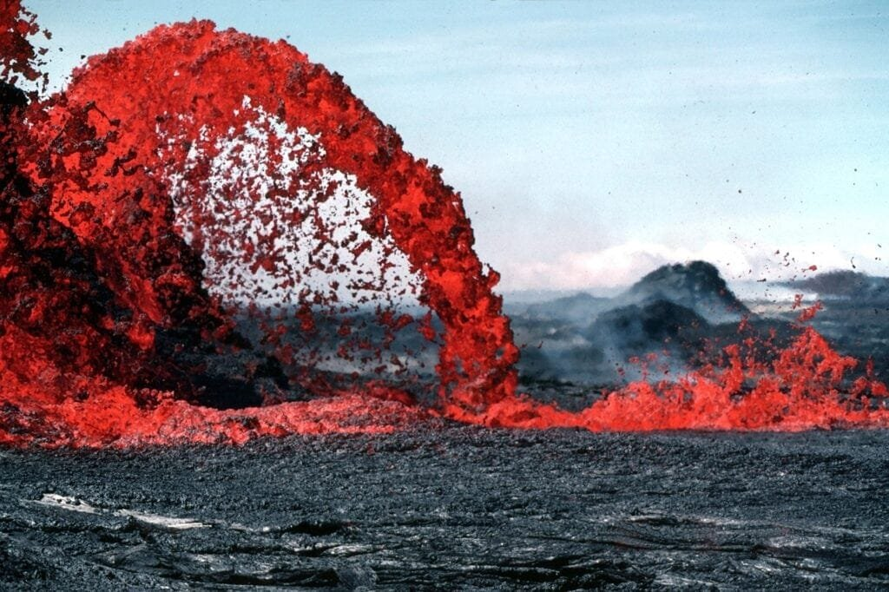

If you're fascinated by the mysteries of the past and the wonders of the natural world, studying archaeology with volcanic rock types might just be the perfect combination for you. Volcanoes, with their explosive eruptions and powerful forces, have played a significant role in shaping our planet. By studying volcanic rocks, archaeologists can uncover valuable insights about ancient civilizations, their lifestyles, and even geological events that occurred thousands of years ago. In this article, we'll explore seven tips that will help you navigate the world of archaeology with a focus on volcanic rock types. So grab your trowel and let's begin this thrilling journey into the past!

<iframe width="560" height="315" src="https://www.youtube.com/embed/K5EgjISBGkM" frameborder="0" allow="accelerometer; autoplay; encrypted-media; gyroscope; picture-in-picture" allowfullscreen></iframe>

  

## Understanding the Basics of Volcanic Rocks

Volcanic rocks are formed during volcanic eruptions when molten rock, gases, and debris are expelled from the earth's mantle and reach the surface. These eruptions can occur at locations where tectonic plates meet, such as the Ring of Fire around the Pacific Ocean, or in areas with hotspots beneath the earth's crust. The type of volcanic rock formed depends on several factors, including the composition of the magma, the eruption style, and the cooling rate of the lava.

Different types of volcanic rocks can be distinguished based on their mineral composition, texture, and color. The three main types of volcanic rocks are igneous, sedimentary, and metamorphic. Igneous rocks are formed when molten lava or magma cools and solidifies. Sedimentary rocks are formed from the accumulation of sediments, such as ash and pumice, while metamorphic rocks are formed through the transformation of other types of rocks under high pressure and temperature.

Volcanoes are not evenly distributed across the globe but are concentrated in certain regions. The Ring of Fire, which spans the Pacific Ocean, is one such region known for its high volcanic activity. Other areas with volcanic activity include the East African Rift, Iceland, and the Canary Islands. The distribution of volcanoes is closely related to tectonic plate boundaries and hotspots, where magma rises from deep within the mantle.

Volcanic eruptions play a crucial role in the [natural](https://magmamatters.com/the-art-and-science-of-volcano-monitoring/ "The Art and Science of Volcano Monitoring") life cycles of Earth. They can have both positive and negative impacts on the environment. Volcanic eruptions release gases and mineral-rich lava that nourish soil and promote plant growth, making volcanic soils some of the most fertile in the world. However, volcanic eruptions can also cause widespread devastation. Ash clouds can disrupt air travel and cover large areas with thick layers of ash, affecting local ecosystems and agriculture. Volcanic eruptions can also trigger landslides, tsunamis, and [pyroclastic flows](https://magmamatters.com/the-environmental-impact-of-volcanic-eruptions-2/ "The Environmental Impact of Volcanic Eruptions"), which pose significant threats to human settlements.

## Identifying the Types of Volcanic Rocks

To properly [understand volcanic](https://magmamatters.com/understanding-volcanic-formation-a-comprehensive-guide/ "Understanding Volcanic Formation: A Comprehensive Guide") rocks, it is important to be familiar with the different types and their characteristics. Igneous volcanic rocks are formed directly from the cooling and solidification of lava or magma. They can be further classified into two main categories: intrusive and extrusive igneous rocks. Intrusive rocks, such as granite, form beneath the Earth's surface as magma cools slowly, allowing larger mineral crystals to form. Extrusive rocks, such as basalt, form when lava erupts onto the surface and cools rapidly, resulting in smaller mineral crystals.

Sedimentary volcanic rocks, on the other hand, are formed from the accumulation of volcanic ash, pumice, and other sediments. These rocks can contain layers of volcanic debris that provide valuable information about past volcanic activity. Metamorphic volcanic rocks, as the name suggests, are volcanic rocks that have undergone metamorphism due to high pressure and temperature. This process can transform the original volcanic rock into new minerals and textures.

Identifying volcanic rocks in the field requires a combination of visual observation and knowledge of their characteristics. Igneous rocks often have a glassy or crystalline texture and can be identified by their mineral composition. Sedimentary volcanic rocks may have distinctive layered structures or contain fragments of volcanic ash and pumice. Metamorphic volcanic rocks may exhibit foliation, a texture characterized by the alignment of minerals in parallel layers.

This image is property of pixabay.com.

## Understanding the Impact of Volcanic Eruptions on Geography and Archaeology

Volcanic eruptions can have a profound impact on geographical features. The deposition of volcanic ash and lava can result in the formation of new landforms, such as lava fields, volcanic cones, and calderas. Over time, these landforms can shape the landscape and create unique habitats for plants and animals. Volcanic activity can also lead to the formation of hot springs, geysers, and fumaroles, which are important geological features.

In addition to their impact on geography, volcanic eruptions can significantly affect archaeological sites. The deposition of volcanic ash and sediment can bury and preserve artifacts and structures, providing valuable insights into past civilizations. Volcanic eruptions can also destroy existing archaeological sites, making it crucial for archaeologists to understand the impact of volcanic activity on the preservation and excavation of sites.

Studying the impact of volcanic eruptions on archaeology involves various methods and approaches. Archaeologists can analyze layers of volcanic ash and sediment to determine the timing and intensity of past eruptions. This information can help establish chronological sequences and understand the cultural and environmental changes that occurred during different volcanic events. In some cases, volcanic eruptions can provide a clear marker for dating archaeological materials, serving as important chronological reference points.

## Studying the Stratigraphy of Archaeological Sites with Volcanic Sediments

Stratigraphy is a fundamental principle in archaeology, referring to the study of layers or strata within archaeological deposits. Volcanic sediments play a crucial role in archaeological stratigraphy, as they can provide valuable information about the sequence of events and the chronology of a site.

Volcanic sediments often form distinctive layers within archaeological deposits. These layers can be identified based on their composition, texture, and color. By carefully excavating and documenting these layers, archaeologists can establish a stratigraphic sequence, allowing them to reconstruct the history and development of a site.

Case studies of volcanic stratigraphy in archaeology have yielded significant insights into past civilizations. For example, the eruption of Mount Vesuvius in 79 AD preserved the Roman cities of Pompeii and Herculaneum under layers of volcanic ash. Excavations at these sites have provided a detailed glimpse into daily life in ancient Rome and have uncovered well-preserved artifacts, frescoes, and even human remains.

This image is property of pixabay.com.

## Using Petrography in the Study of Volcanic Rocks

Petrography is the study of rocks and minerals using microscopic analysis and petrographic techniques. In the study of volcanic rocks, petrography can provide valuable information about their mineral composition, texture, and formation processes.

By examining thin sections of volcanic rocks under a polarized light microscope, petrographers can identify and classify different minerals present in the rock. They can also determine the size, shape, and arrangement of mineral grains, which can provide insights into the conditions under which the rock formed.

Petrography is particularly useful in the study of volcanic rocks because it can reveal important details about their volcanic history. For example, the presence of vesicles, or gas bubbles, can indicate the gas content and eruption style of the volcano. The textures and mineral assemblages within the rock can also provide information about the cooling rate of the lava and the depth at which it formed.

Archaeologists have successfully employed petrography in the study of volcanic rocks to understand ancient civilizations and their interactions with volcanic environments. By analyzing volcanic artifacts and structures, petrographers can determine the source of the volcanic rock used and trace trade routes and cultural connections. This information can shed light on the social, economic, and technological aspects of past societies.

## Implementing Geochemical Analysis in Archaeological Studies

Geochemical analysis involves the study of the chemical composition and elemental abundance of rocks, minerals, and other materials. In the context of archaeological studies with volcanic rocks, geochemical analysis can provide valuable information about the origin, geological history, and cultural significance of volcanic materials.

Geochemical analysis techniques such as X-ray fluorescence (XRF) and inductively coupled plasma mass spectrometry (ICP-MS) allow archaeologists to determine the elemental composition of volcanic rocks. This information can help identify the geological source of the rocks and provide insights into the geological processes that formed them.

By comparing the geochemical signatures of volcanic rocks from different archaeological sites, researchers can establish connections and identify trade networks between ancient civilizations. Geochemical analysis can also reveal the use of specific volcanic materials for various purposes, such as tool production, construction, or artistic expressions.

Case studies of geochemical analysis in archaeology have provided fascinating insights into ancient volcanic rock usage. For example, the sourcing of obsidian, a volcanic glass, has helped reconstruct ancient trade routes and understand the socio-economic interactions between different cultures. Geochemical analysis has also been instrumental in identifying the sources of volcanic pigments used in ancient rock art, allowing for a better understanding of artistic practices and symbolism.

This image is property of pixabay.com.

## Archaeological Artifacts made from Volcanic Rock

Artifacts made from volcanic rock have been found in various cultures throughout history. The use of volcanic rock for tool production can be attributed to its unique physical properties. Volcanic rocks such as obsidian are known for their sharp edges, making them excellent materials for cutting, scraping, and puncturing tools.

In ancient Mesoamerica, obsidian was highly valued and widely used for the production of tools and weapons. The availability of different types of volcanic rocks in the region allowed for the creation of a wide variety of tools with various functions and designs. Obsidian artifacts have been found in archaeological sites like Teotihuacan and the Maya city of Tikal, providing valuable insights into the daily lives and technological achievements of these ancient civilizations.

Volcanic rocks have also been used for artistic purposes. In ancient Egypt, basalt was often used for the creation of statues and stelae. These volcanic rock artifacts can be found in temples and tombs, depicting gods, kings, and important events. The durability of volcanic rock made it an ideal material for creating long-lasting and visually striking artworks.

The process of making artifacts from volcanic rock involves several steps. First, the appropriate type of volcanic rock is selected based on its texture, hardness, and other properties. The rock is then shaped through grinding, cutting, or knapping techniques to achieve the desired form. Finally, the artifact is polished, engraved, or decorated, depending on the cultural traditions and artistic styles of the civilization.

## Recognizing Volcanic Rock Changes during Excavations

Volcanic rocks can undergo changes over time due to various [geological processes and environmental](https://magmamatters.com/geothermal-energy-and-its-volcanic-origins/ "Geothermal Energy and Its Volcanic Origins") conditions. These changes can affect their appearance, texture, and mineral composition. Recognizing these changes is essential during archaeological excavations to accurately interpret the geological history and cultural context of a site.

One of the prominent changes volcanic rocks can undergo is weathering. Exposure to the elements, such as wind, water, and temperature fluctuations, can cause physical and chemical alterations in the rock. Weathering can lead to the breakdown of minerals, the formation of secondary minerals, and the alteration of rock textures. These changes may affect the preservation of artifacts and the integrity of stratigraphic layers.

Volcanic rocks can also undergo alteration due to hydrothermal processes. In areas with hot springs or geothermal activity, volcanic rocks can come into contact with hot water and dissolved minerals, leading to the alteration of rock minerals and the formation of new minerals. These hydrothermally altered volcanic rocks can provide important clues about past volcanic activity and the availability of natural resources.

Recognizing signs of volcanic activity in archaeological sites is crucial for understanding the impact of volcanic eruptions on past civilizations. Layers of volcanic ash, tephra, or pumice can indicate the occurrence of volcanic eruptions, while volcanic bombs or lapilli can suggest the violence and intensity of the eruption. By identifying these volcanic signatures, archaeologists can correlate them with historical records and gain a better understanding of the social, economic, and environmental consequences of volcanic activity.

## Sourcing of Volcanic Rock in Archaeological Analysis

Sourcing volcanic rock in archaeological analysis involves determining the geological origin of the rock used in ancient artifacts or structures. Identifying the specific volcanic source can provide valuable insights into ancient trade networks, cultural interactions, and technological capabilities.

There are several methods for determining the origin of volcanic rocks. One approach involves geochemical analysis, as mentioned earlier. By analyzing the elemental composition of volcanic rocks, researchers can compare them to known geological sources and establish a match. This method can provide a rapid and non-destructive way of identifying the source of volcanic rock artifacts.

Another method for sourcing volcanic rocks is through the analysis of their trace element and isotopic compositions. The presence of specific trace elements or isotopic signatures can be characteristic of certain volcanic sources. By comparing these signatures with known volcanic areas, researchers can narrow down the possible origins of the volcanic rock.

In some cases, archaeological artifacts may contain unique chemical or isotopic compositions that can directly link them to a specific volcanic source. For example, the elemental composition of obsidian artifacts can be highly specific to particular volcanic sources. By analyzing the trace elements or isotopes in the obsidian, researchers can pinpoint the exact location from which the rock was sourced.

The sourcing of volcanic rocks in archaeology can provide important insights into ancient trade networks, migration patterns, and cultural interactions. It can help reconstruct ancient supply chains, understand the movement of raw materials, and gain a deeper understanding of the socio-economic dynamics of past civilizations.

## Successful Field Work Involving Volcanic Rocks in Archaeology

Conducting fieldwork involving volcanic rocks in archaeology requires careful planning, preparation, and specific techniques. Here are some tips to ensure successful fieldwork:

1. Research and map out geological features: Before heading to the field, gather as much information as possible about the geological features of the area. Identify potential volcanic sites, volcanic rock outcrops, and any known archaeological sites in the vicinity.
    
2. Equip yourself with the necessary tools: Depending on the type of volcanic rocks you will encounter, equip yourself with appropriate tools such as geological hammers, chisels, brushes, and safety equipment like goggles and gloves.
    
3. Document and record: Whenever you encounter volcanic rocks or relevant archaeological materials, ensure proper documentation and record-keeping. Take photographs, make detailed notes, and create accurate sketches to capture the context and characteristics of the materials.
    
4. Employ careful excavation techniques: When excavating archaeological sites with volcanic rock layers, use careful excavation techniques to preserve the stratigraphy and the integrity of the layers. Work in small increments, and record the location and orientation of each layer.
    
5. Collect samples for analysis: If necessary, collect samples of volcanic rocks or related materials for further analysis. Ensure proper labeling, packaging, and documentation of the samples to maintain their integrity.
    
6. Consult with experts: Collaborate with experts in volcanology and petrography to get a better understanding of the volcanic rocks you encounter during fieldwork. Their expertise can help you interpret the geological context and cultural significance of the materials.
    
7. Share experiences and collaborate: After completing fieldwork, share your experiences and findings with fellow archaeologists and researchers. Collaboration and discussions with others in the field can lead to new insights and discoveries.
    

By following these tips, archaeologists can conduct successful fieldwork involving volcanic rocks, contribute to the understanding of past civilizations, and shed light on the complex interactions between humans and volcanoes throughout history.

