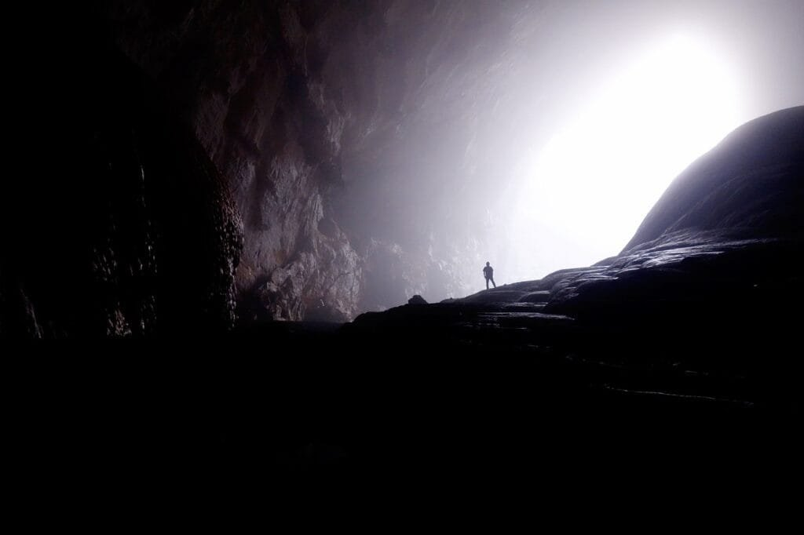

If you've ever wondered about how volcanic soils differ from regular soils, you're in for an enlightening read. Volcanoes, with their explosive eruptions of lava and ash, can create unique soil compositions that differ from those found in other areas. These volcanic soils can be rich in nutrients, making them excellent for agriculture and plant growth. However, the same volcanic eruptions that create these fertile soils can also bring about devastating natural disasters. In this article, we'll explore the different characteristics of volcanic soils compared to regular soils, allowing you to gain a better understanding of this fascinating topic. So, let's dig in and uncover the secrets hidden beneath the earth's surface!

This image is property of pixabay.com.

## Formation of Volcanic Soil

### Principles of volcanic soil formation

Volcanic soil is formed through a combination of processes that occur during volcanic eruptions. When a volcano erupts, it releases hot molten lava, gases, and ash into the surrounding areas. As these materials cool and settle, they begin the process of soil formation. The lava, which is rich in minerals, breaks down over time and becomes part of the soil. The gases and ash, on the other hand, contribute to the fertility of the soil by providing essential nutrients.

### Influence of eruption factors

The formation of volcanic soil is greatly influenced by the factors that accompany volcanic eruptions. The type of eruption, the composition of the lava, and the duration of the eruption all play a role in determining the characteristics of the soil. For example, explosive eruptions that release large amounts of ash result in soil that is high in nutrients. On the other hand, effusive eruptions, which release more lava than ash, create soil that is rich in minerals but lower in nutrients.

### Role of climate and location

Climate and location also play a significant role in the formation of volcanic soil. The type and amount of rainfall, as well as temperature variations, can affect the rate at which the volcanic materials break down and become part of the soil. Additionally, the proximity of the volcano to other geographical features, such as rivers or bodies of water, can influence the distribution and composition of the soil. Overall, the climate and location of a volcanic area contribute to the unique characteristics of its soil.

## Formation of Regular Soil

### Processes of regular soil formation

Regular soil, unlike volcanic soil, is not formed through volcanic eruptions. Instead, it is formed through a process called weathering. Weathering refers to the gradual breakdown of rocks into smaller particles by physical, chemical, and biological forces. Over time, weathering transforms these particles into soil. Physical forces, such as temperature changes and the actions of wind and water, contribute to the mechanical breakdown of rocks. Chemical processes, such as the dissolution of minerals, also play a role in soil formation. Finally, the activity of organisms, such as plants and animals, further breaks down rocks and helps create organic matter in the soil.

### Role of weathering in soil development

Weathering is a crucial process in the development of regular soil. As rocks weather, they release minerals and nutrients that are essential for plant growth. These minerals accumulate in the soil and provide a fertile environment for plants to thrive. The type and intensity of weathering can vary depending on factors such as climate, the composition of the parent rock, and the presence of organisms. In regions with a high amount of rainfall, for example, weathering may be more intense due to increased water and chemical interactions, resulting in the formation of deeper and more developed soil profiles.

### Influence of vegetation and climate

Vegetation and climate also have a significant influence on the formation of regular soil. The presence of plants can accelerate the weathering process by releasing organic acids and root exudates that break down rocks. Moreover, when plants die and decompose, they contribute to the organic matter content of the soil, enhancing its fertility. Climate, particularly temperature and rainfall patterns, affects the rate of weathering and the overall development of soil. In regions with a warm and wet climate, for instance, weathering processes are generally more intense, leading to the formation of thick and nutrient-rich soil.

This image is property of pixabay.com.

## Physical Properties of Volcanic Soil

### Texture and structure

Volcanic soil exhibits unique characteristics in terms of texture and structure. The texture of volcanic soil can range from coarse and sandy to fine and clay-like, depending on the composition of the volcanic materials. It tends to have a granular or crumbly structure, which allows for good drainage and aeration. The presence of volcanic glass particles in the soil can also contribute to its unique texture.

### Porosity and permeability

One of the notable physical properties of volcanic soil is its high porosity and permeability. The porous [nature](https://magmamatters.com/the-art-and-science-of-volcano-monitoring/ "The Art and Science of Volcano Monitoring") of volcanic soil allows for efficient water infiltration and storage, which is beneficial for plant growth. Additionally, the permeability of volcanic soil enables the movement of air and nutrients through the soil profile, facilitating root development and nutrient uptake by plants.

### Color and temperature

Volcanic soil often exhibits distinct colors due to the presence of various minerals. These colors can range from red, orange, and yellow to black or even white, depending on the mineral composition. The color of volcanic soil can provide valuable information about its fertility and nutrient content. In terms of temperature, volcanic soil tends to retain heat more efficiently compared to other types of soil. This can be advantageous for plant growth, especially in cooler climates, as it provides a warmer environment for root development.

## Physical Properties of Regular Soil

### Texture and structure

Regular soil, similar to volcanic soil, exhibits a range of textures and structures. The texture can vary from sandy to clay-like, depending on the composition of the parent rocks and the extent of weathering. The structure of regular soil can be granular, blocky, or even platy, with varying degrees of aggregation. The arrangement of particles in the soil affects its permeability, porosity, and water-holding capacity.

### Porosity and permeability

The porosity and permeability of regular soil depend on various factors, including particle size, compaction, and organic matter content. Soils with larger particles, such as sandy soils, generally have higher porosity and permeability, allowing for easy water movement and drainage. In contrast, soils with smaller particles, such as clay soils, have lower porosity and permeability, leading to slower water movement and higher water-holding capacity.

### Color and temperature

The color of regular soil can vary widely, depending on factors such as the presence of organic matter, iron oxides, and moisture content. Soils with a higher organic matter content tend to be darker in color, while those with high iron oxide content may exhibit a reddish or yellowish hue. Temperature-wise, regular soil typically retains less heat compared to volcanic soil, making it more suitable for plants in warmer climates.

This image is property of pixabay.com.

## Chemical composition of Volcanic Soil

### Presence of volcanic ash and minerals

One of the distinguishing features of volcanic soil is the presence of volcanic ash and minerals. Volcanic ash, which is fine, rock fragments resulting from volcanic eruptions, contributes to the texture and fertility of the soil. It contains various beneficial minerals and nutrients that are essential for plant growth, such as potassium, phosphorus, and trace elements. Additionally, volcanic soil can contain a wide range of minerals, depending on the [type of volcano](https://magmamatters.com/understanding-volcanic-formation-a-comprehensive-guide/ "Understanding Volcanic Formation: A Comprehensive Guide") and the composition of the lava.

### Acidity and alkalinity

The acidity or alkalinity of volcanic soil can vary depending on the composition of the volcanic materials. Volcanic ash tends to be more acidic, while volcanic minerals may contribute to the alkalinity of the soil. The pH level of volcanic soil can influence the availability of nutrients to plants and the overall fertility of the soil. Some plants thrive in acidic soil, while others prefer a neutral or alkaline environment.

### Nutrient content

Volcanic soil is generally rich in nutrients, thanks to the minerals present in the volcanic materials. These nutrients, including nitrogen, phosphorus, and potassium, are crucial for plant growth and development. In addition to these macronutrients, volcanic soil can also contain a range of micronutrients, such as iron, manganese, and zinc, which are necessary in smaller quantities. The nutrient content of volcanic soil makes it highly fertile and suitable for various crops and plant species.

## Chemical Composition of Regular Soil

### Residual minerals from parent rock

The chemical composition of regular soil is influenced by the parent rock from which it is derived. When rocks weather and break down, residual minerals are left behind in the soil. Depending on the composition of the parent rock, these residual minerals can vary widely. For example, soils derived from granite may contain higher concentrations of minerals such as quartz and feldspar, while soils derived from limestone may have higher calcium and carbonate content.

### Acidity and alkalinity

The acidity or alkalinity of regular soil, often referred to as soil pH, is determined by the presence of acid or alkaline-forming substances. These substances can come from various sources, including the parent rock, organic matter, and environmental factors. Soil pH impacts nutrient availability and microbial activity in the soil, influencing plant growth and overall soil fertility. Different plant species have different preferences for soil pH, with some thriving in acidic conditions and others preferring alkaline conditions.

### Nutrient content

Regular soil contains a wide range of nutrients that are essential for plant growth. These nutrients come from both the parent rock and organic matter present in the soil. Macronutrients such as nitrogen, phosphorus, and potassium are required in larger quantities, while micronutrients such as iron, manganese, and zinc are needed in smaller quantities. The nutrient content of regular soil can vary depending on factors such as parent rock composition, weathering processes, and organic matter decomposition. Fertilizers and soil amendments may be necessary to maintain optimal nutrient levels for plant growth.

## Volcanic Soil and Plant Growth

### Effectiveness for particular plant species

Volcanic soil has certain characteristics that make it particularly suitable for the growth of specific plant species. The high mineral content and nutrient availability in volcanic soil can benefit plants that require these elements for their growth and development. Additionally, the porosity and permeability of volcanic soil allow for efficient root penetration and nutrient uptake. Some plants, such as citrus fruits and coffee, have been found to thrive in volcanic soil due to their specific nutrient requirements and adaptability to the unique properties of volcanically derived soil.

### Need for additional fertilizers and additives

While volcanic soil is naturally rich in nutrients, its fertility can vary depending on factors such as the age of the soil and the specific mineral composition. In some cases, additional fertilizers and soil additives may be necessary to meet the specific nutrient requirements of certain crops or to address deficiencies in the soil. Regular soil testing and analysis can help determine the optimal nutrient levels and inform the application of fertilizers and amendments to maximize plant growth and yield.

### Impacts of volcanic soil's distinct properties on plant growth

The distinct physical and chemical properties of volcanic soil can have both positive and negative impacts on plant growth. The high porosity and permeability of volcanic soil facilitate good drainage and aeration, which can prevent waterlogging and promote healthy root development. The mineral-rich composition of volcanic soil provides a fertile environment for plant growth, supporting nutrient uptake and overall plant health. However, the relatively rapid weathering and leaching processes in volcanic soil can lead to nutrient depletion over time, requiring periodic supplementation of nutrients to maintain soil fertility.

## Regular Soil and Plant Growth

### Versatility for plant species

Regular soil, due to its diverse composition and characteristics, offers a wide range of benefits for plant growth. Its ability to retain moisture and nutrients, and its capacity to support root development, make it suitable for a variety of plant species. From fruits and vegetables to ornamental plants and trees, regular soil can accommodate the growth needs of different crops and horticultural plants. The versatility of regular soil allows for various cultivation practices, including both conventional and organic farming.

### Need for additional fertilizers and additives

Similar to volcanic soil, regular soil may require additional fertilizers and soil amendments to maintain optimal nutrient levels for plant growth. The nutrient content of regular soil can vary depending on factors such as weathering processes, organic matter content, and cultivation practices. Soil testing and analysis can help determine the nutrient requirements of specific crops and guide the application of fertilizers and amendments. Additionally, organic matter, such as compost or manure, can be added to regular soil to improve its fertility and structure.

### Impacts of regular soil's distinct properties on plant growth

The unique physical and chemical properties of regular soil can have significant impacts on plant growth. The texture and structure of regular soil influence water movement, root penetration, and nutrient availability. Soils with good drainage and aeration promote healthy root development and prevent waterlogging, while soils with high water-holding capacity can support plants during dry periods. The nutrient content and pH of regular soil also affect plant growth and can influence the availability of essential nutrients. Understanding the properties of regular soil is essential for optimizing plant growth and ensuring successful crop production.

## Geographic Distribution of Volcanic Soil

### Extreme conditions fostering volcanic soil's formation

The formation of volcanic soil is closely tied to the presence of active or dormant volcanoes. Volcanic eruptions and the subsequent deposition of volcanic materials, including lava, ash, and gases, contribute to the formation of volcanic soil. As a result, volcanic soil is predominantly found in regions with a history of volcanic activity. These regions often experience extreme conditions such as frequent volcanic eruptions, high levels of volcanic ash deposition, and rapid weathering processes facilitated by a combination of factors like temperature variations and precipitation.

### Distribution patterns

The distribution of volcanic soil is not uniform and is influenced by various factors, including the type of volcano, the age of the soil, and the geological history of the area. Volcanic soil is commonly found in volcanic regions around the world, such as the Pacific Ring of Fire, which encircles the Pacific Ocean and is known for its high volcanic activity. Other regions with a history of volcanic eruptions, such as Iceland, the Canary Islands, and parts of Italy and Greece, also have significant deposits of volcanic soil. The distribution of volcanic soil is highly localized, often occurring in patches or pockets within larger geographical areas.

### Famous regions of volcanic soil

Several regions around the world are renowned for their fertile volcanic soil, which has supported agriculture and played a significant role in the local economy. For example, the fertile slopes of Mount Etna in Sicily, Italy, are known for their volcanic soil and are used for cultivating vineyards and orchards. The rich volcanic soil in Hawaii, particularly on the Big Island, has made it an ideal location for growing various crops such as coffee, macadamia nuts, and tropical fruits. Volcanic soils in regions like the Napa Valley in California and the Hawke's Bay region in New Zealand have also gained recognition for their suitability for wine grape cultivation.

## Use Case Studies: Regular Soil

### Agriculture and horticulture

Regular soil plays a vital role in agriculture and horticulture, supporting the growth of crops and plants. Farmers and gardeners utilize regular soil for cultivating various types of crops, including grains, vegetables, fruits, and ornamental plants. The ability of regular soil to retain water and nutrients, as well as its texture and structure, contribute to the successful growth of these plants. Regular soil is often amended with organic matter and fertilizers to enhance its fertility and provide the necessary nutrients for optimal plant growth.

### Architecture and construction

Regular soil also has applications in architecture and construction. The properties of regular soil, such as its load-bearing capacity and stability, make it suitable for various construction purposes. It is used as a foundation material for buildings and infrastructures, providing support and stability to structures. Regular soil is also employed in the construction of earthen structures, such as rammed earth buildings, where its cohesive properties and thermal insulation qualities are utilized.

### Environmental and geological significance

Regular soil has significant [environmental and geological](https://magmamatters.com/geothermal-energy-and-its-volcanic-origins/ "Geothermal Energy and Its Volcanic Origins") significance. It serves as a habitat for various organisms, including bacteria, fungi, insects, and worms, contributing to the biodiversity of ecosystems. Regular soil also plays a crucial role in the cycling of nutrients and the storage of carbon. Furthermore, the study of regular soil provides valuable insights into the history of landscapes, including past climate conditions, geological processes, and human activity. Understanding regular soil's composition, formation, and properties is essential for environmental conservation and sustainable land management practices.

