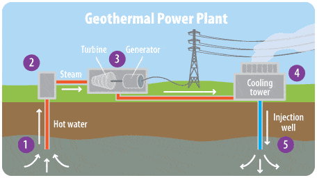
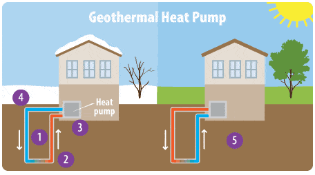
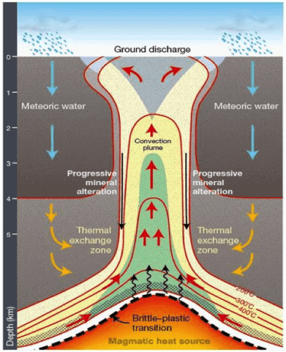
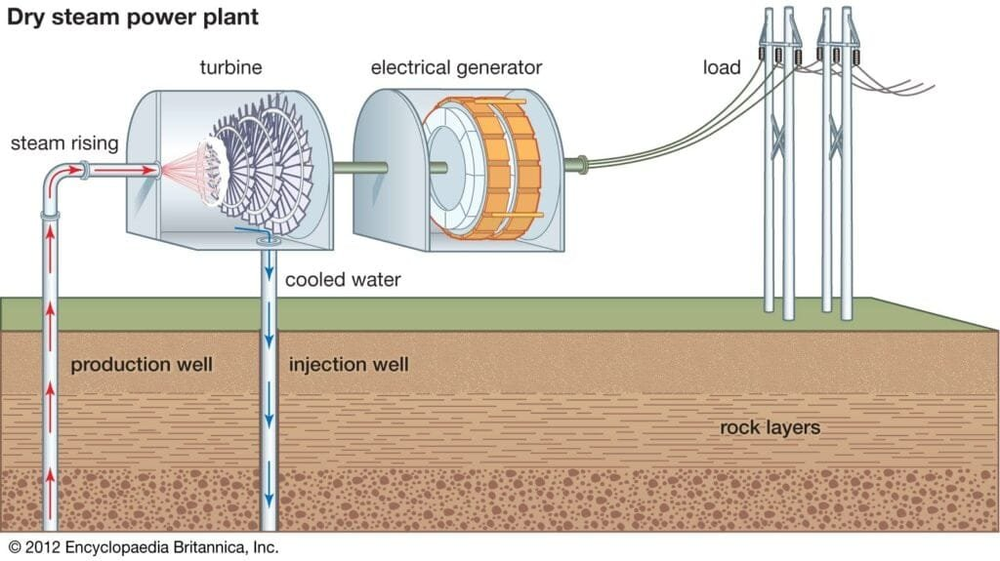

In "A Comprehensive Guide to Harnessing Geothermal Energy from Volcanoes," we explore the fascinating world of volcanoes and their potential as a source of renewable energy. Volcanoes, formed by the eruption of molten rock and debris onto the Earth's surface, can be found in various locations and exhibit different eruption patterns. By understanding the types of volcanoes, their geographical distribution, and eruption causes, we gain insights into the benefits and hazards they present. This article dives into the concept of harnessing geothermal energy, a sustainable approach that utilizes the immense heat trapped within these natural wonders. Join us as we delve into the intricacies of geothermal energy extraction and its potential as a clean and renewable energy source for the future.

<iframe width="560" height="315" src="https://www.youtube.com/embed/ZGqxSd40jvE" frameborder="0" allow="accelerometer; autoplay; encrypted-media; gyroscope; picture-in-picture" allowfullscreen></iframe>

  

## Understanding Geothermal Energy

Geothermal energy refers to the heat energy that is generated and stored within the Earth. This energy can be harnessed and used for various purposes, including electricity generation and heating. The main sources of geothermal energy are volcanoes and geothermal reservoirs. Volcanoes, as a result of the molten rock and gases they contain, are a particularly abundant source of geothermal energy.

The distribution and availability of geothermal energy are influenced by several factors. Firstly, the location of volcanoes plays a crucial role. Volcanoes are typically found along plate boundaries or in hotspot regions. The "Ring of Fire" is a prime example of an area with a high concentration of volcanoes. These regions have a greater potential for geothermal energy extraction.

The [geological conditions surrounding volcanoes also affect geothermal energy](https://magmamatters.com/geothermal-energy-and-its-volcanic-origins/ "Geothermal Energy and Its Volcanic Origins") availability. The presence of suitable rocks and formations that allow for the storage and transfer of heat is essential. Additionally, the depth and temperature of the geothermal reservoirs play a role in determining the feasibility of harnessing this energy.

## Exploring the Connection Between Geothermal Energy and Volcanoes

There is a strong connection between geothermal energy and volcanoes. Volcanoes provide an abundant and readily accessible source of heat that can be harnessed for various applications. [Understanding the different types of volcanoes](https://magmamatters.com/understanding-volcanic-formation-a-comprehensive-guide/ "Understanding Volcanic Formation: A Comprehensive Guide") and their energy potential is crucial in exploring the possibilities of geothermal energy extraction.

Volcanoes can be classified into different types based on their characteristics. Some examples include stratovolcanoes, shield volcanoes, and calderas. Each type of volcano has its own unique features and eruption patterns. These differences contribute to variations in energy potential.

Stratovolcanoes, for instance, are known for their explosive eruptions and steep slopes. These characteristics make them a prime candidate for geothermal energy extraction. Shield volcanoes, on the other hand, have a more gradual eruption style and generally have a larger surface area, providing a different set of opportunities for harnessing geothermal energy.

The location and geological conditions surrounding a volcano are also crucial in determining its energy potential. Factors such as the depth and temperature of the magma chamber, the presence of permeable rocks, and the accessibility of the geothermal reservoirs play a significant role in the feasibility of harnessing energy from a particular volcano.

This image is property of archive.epa.gov.

## Process of Harnessing Geothermal Energy from Volcanoes

The process of harnessing geothermal energy from volcanoes involves several steps. The first step is the drilling process, where wells are drilled into the ground to access the geothermal reservoirs. This allows for the extraction of hot water or steam present in the reservoir. The drilling process requires expertise and careful planning to ensure the safety and efficiency of the operation.

Once the hot water or steam is extracted, the heat energy is harnessed through various methods. In the case of volcanoes, one method involves harnessing the heat from molten magma. This is done by bringing the magma closer to the surface using a well and transferring its heat to a secondary fluid.

The secondary fluid, which can be water or a mixture of water and additives, is then circulated through a network of pipes and heat exchangers. As it passes through these systems, the heat from the magma is transferred to the fluid, which subsequently undergoes a phase change, often turning into steam. This steam can then be used to rotate turbines and generate electricity.

## Volcano Geothermal Energy Plants

Geothermal power plants are the backbone of harnessing geothermal energy from volcanoes. These plants are specifically designed to extract the heat from geothermal reservoirs and convert it into electricity. Understanding the structure and functioning of these plants is crucial for effective and efficient energy production.

Geothermal power plants typically consist of several components. These include the wellhead, where the geothermal fluid is extracted from the reservoir, and the steam separator, where the steam is separated from the liquid. The steam is then directed towards the turbines, which are connected to generators, ultimately producing electricity. The remaining liquid is reinjected back into the reservoir.

Some existing geothermal power plants are located near volcanoes, taking advantage of the abundant geothermal energy sources available in these regions. Examples include the Hellisheiði Power Station in Iceland, which is located near active volcanoes, and the Geysers Geothermal Complex in California, situated on the Pacific Ring of Fire.

Innovations in volcano-based geothermal energy production are continuously being explored to improve the efficiency and sustainability of these plants. These include advancements in drilling technology, heat transfer systems, and the integration of renewable energy storage technologies.

This image is property of archive.epa.gov.

## Risks Involved in Harnessing Geothermal Energy from Volcanoes

While harnessing geothermal energy from volcanoes offers numerous benefits, it is not without risks. The process of drilling near volcanoes can be inherently dangerous, as it involves working in close proximity to volcanic activity. The unpredictability of volcanic eruptions poses a significant risk to workers and equipment.

Potential environmental impacts also need to be considered when exploring geothermal energy from volcanoes. The extraction of geothermal fluids can lead to the release of greenhouse gases, such as [carbon dioxide](https://magmamatters.com/the-art-and-science-of-volcano-monitoring/ "The Art and Science of Volcano Monitoring") and hydrogen sulfide. Additionally, the reinjection of the fluid back into the reservoir can cause seismic activities, including earthquakes.

Mitigation measures are in place to minimize these risks. Comprehensive risk assessments, monitoring systems, and emergency response plans are implemented to ensure the safety of workers and surrounding communities. Additionally, proper waste management practices and greenhouse gas mitigation strategies are employed to minimize environmental impacts.

## Benefits of Harnessing Geothermal Energy from Volcanoes

Harnessing geothermal energy from volcanoes offers numerous benefits. Firstly, it contributes to the production of renewable energy. Geothermal energy is a sustainable and virtually inexhaustible resource, unlike fossil fuels. By utilizing this energy source, we can reduce our reliance on non-renewable resources and decrease our carbon footprint.

Geothermal energy from volcanoes also has the potential to be a constant and reliable energy source. Unlike solar or wind energy, geothermal energy is not dependent on weather conditions or daylight hours. Therefore, it can provide a stable and continuous supply of electricity, ensuring energy security and grid stability.

Furthermore, harnessing geothermal energy from volcanoes helps reduce carbon emissions. Geothermal power plants produce minimal greenhouse gases compared to traditional fossil fuel-based power plants. This contributes to mitigating climate change and reducing air pollution, ultimately promoting a cleaner and healthier environment.

This image is property of uwiseismic.com.

## Economic Aspects of Generating Geothermal Energy from Volcanoes

Setting up geothermal power plants near volcanoes involves certain costs. These costs include drilling expenses, infrastructure development, and the installation of power generation equipment. However, once operational, geothermal power plants have relatively low operational and maintenance costs compared to conventional power plants.

A comparative analysis of the cost of volcano geothermal energy and other energy sources is crucial in understanding the economic feasibility of geothermal energy. While the initial costs may be higher, the long-term benefits and the reduction in operational costs make geothermal energy a cost-effective solution in the long run.

Moreover, the generation of geothermal energy from volcanoes provides economic benefits for local communities. These projects create job opportunities in various sectors, including construction, drilling, operations, and maintenance. Additionally, the revenue generated from selling electricity can be reinvested in the local economy, stimulating growth and development.

## Regulatory and Policy Aspects

Regulations and policies play a crucial role in governing the harnessing of volcano geothermal energy. Existing regulations aim to ensure the safe and sustainable extraction of geothermal energy, taking into account environmental protection and worker safety.

Policies supporting the growth of the geothermal energy sector are implemented at various levels. Governments incentivize the development of geothermal power plants through tax breaks, grants, and loan programs. These policies encourage private investments in geothermal projects, promoting the expansion of the sector.

At the global level, there is cooperation and agreements relevant to geothermal energy. The International Renewable Energy Agency (IRENA) works towards the promotion of renewable energy, including geothermal energy. Agreements such as the Paris Agreement also emphasize the need for transitioning to clean energy sources, including geothermal energy.

This image is property of cdn.britannica.com.

## Future Prospects of Volcano Geothermal Energy

Technological advancements in volcano geothermal energy harnessing hold promising prospects for the future. Ongoing research and development focus on improving drilling techniques, increasing energy conversion efficiency, and exploring new heat exchange systems. These advancements aim to make geothermal energy extraction more productive and cost-effective.

The potential for growth and expansion of volcano geothermal energy is significant. As the demand for clean and renewable energy continues to rise, geothermal energy presents a viable solution. The abundance of geothermal resources near volcanoes and the continuous innovations in energy production make volcano geothermal energy an attractive option for sustainable development.

However, the sector also faces future challenges. These challenges include the need for continuous monitoring and mitigation of environmental impacts, ensuring worker safety in volcanic areas, and addressing potential conflicts between geothermal energy development and conservation efforts. Overcoming these challenges will be crucial in realizing the full potential of geothermal energy from volcanoes.

## Case Studies of Harnessing Geothermal Energy from Volcanoes

Examining case studies of successful geothermal energy projects can provide valuable insights for future endeavors. Iceland serves as an excellent example of a country harnessing volcano geothermal energy. With its abundant volcanic activity, Iceland has developed a robust geothermal energy sector, meeting a significant portion of its electricity and heating needs.

Another notable case study is the Geysers Geothermal Complex in California, USA. Located in an area with high volcanic activity, the Geysers Complex has been operational for several decades and is one of the largest geothermal power production facilities in the world. This case study demonstrates the long-term viability and economic benefits of harnessing geothermal energy from volcanoes.

The Indonesian experience in volcano geothermal energy harnessing also offers valuable lessons. Indonesia has a large number of active volcanoes and has made significant progress in utilizing geothermal energy. However, the country faces challenges related to volcanic hazards and regulatory frameworks. Understanding these challenges can inform strategies for future geothermal energy projects in similar contexts.

In conclusion, harnessing geothermal energy from volcanoes provides a sustainable and renewable energy source. Understanding the sources and factors affecting the availability of geothermal energy, the connection between geothermal energy and volcanoes, and the process of harnessing this energy is crucial. Recognizing the benefits, economic aspects, and regulatory framework can pave the way for the future growth and expansion of volcano geothermal energy, while also mitigating risks and addressing environmental concerns. The case studies presented highlight successful examples and lessons learned, contributing to the ongoing development and adoption of geothermal energy from volcanoes.

