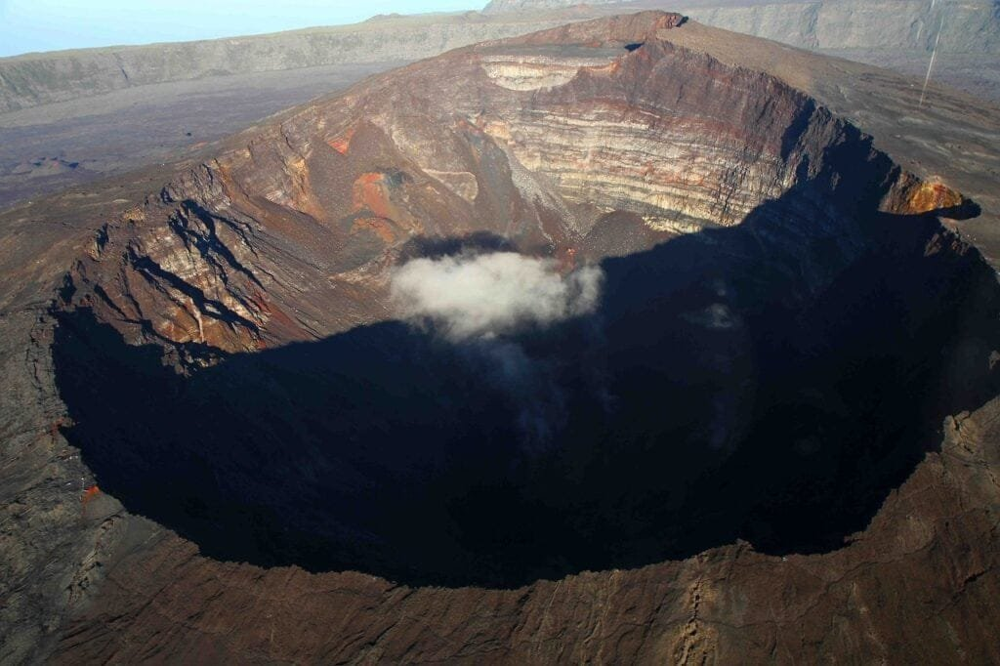
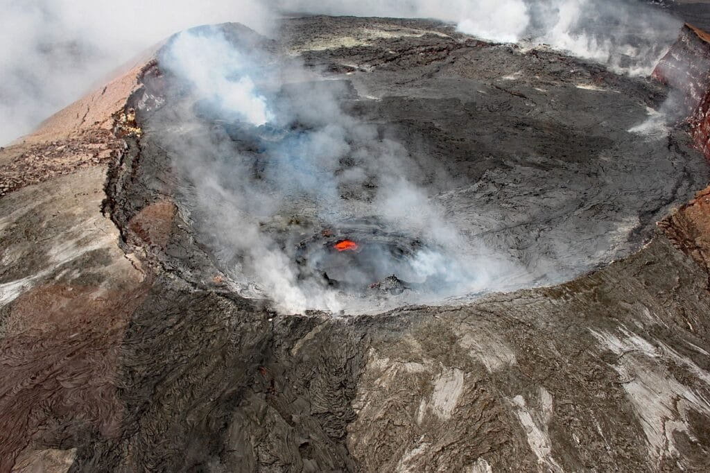
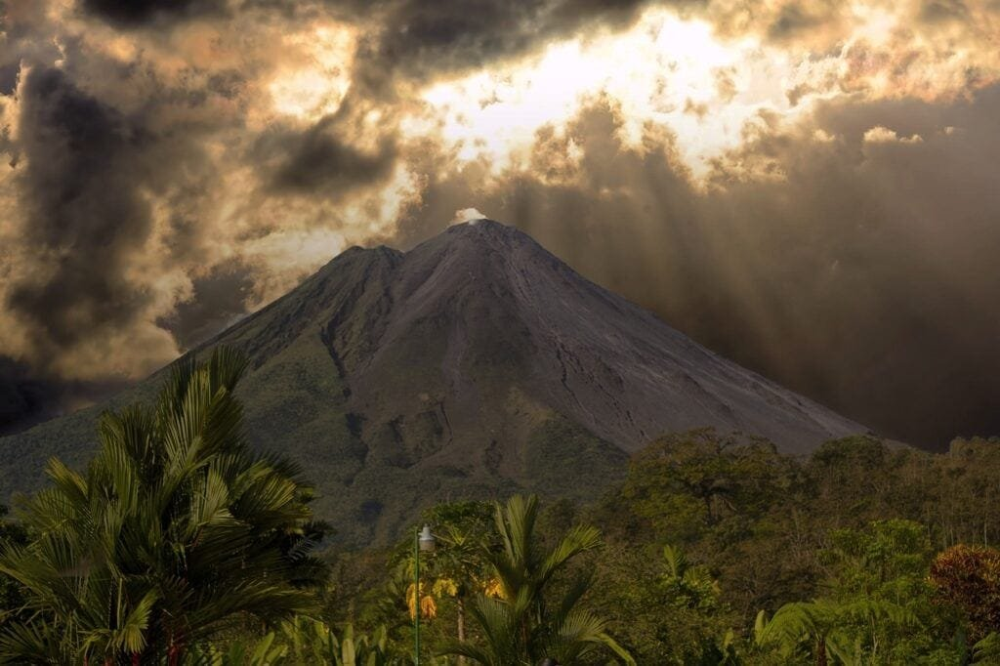

Get ready to explore the breathtaking volcanic landforms of Hawaii! In this comprehensive guide, we will take a closer look at the fascinating world of volcanoes - from how they are formed to the various types found in Hawaii. We'll delve into the factors that contribute to volcanic eruptions, as well as the hazards and benefits they bring to the surrounding areas. With this knowledge, you'll be better equipped to understand and appreciate the majestic beauty and power of these volcanic wonders. So, put on your explorer's hat and get ready to embark on an unforgettable journey through Hawaii's notable volcanic landforms!

This image is property of pixabay.com.

## A Brief on Hawaii's Geological Setting

Hawaii's location in the Pacific Ocean makes it a unique and fascinating place, both geologically and culturally. Situated in the central Pacific, Hawaii is an archipelago composed of a chain of volcanic islands. These islands are located over a hotspot, a stationary area of intense volcanic activity deep under the earth's crust. This hotspot has been responsible for the creation and formation of the Hawaiian Islands over millions of years.

## Understanding Hawaii's location over a volcanic hotspot

The Hawaiian Islands are a product of the movement of the Pacific tectonic plate over a hotspot in the Earth's mantle. As the plate moves, the hotspot remains stationary, causing a chain of islands to form. The oldest island in the chain is located to the northwest, while the youngest island is located to the southeast. This pattern of island formation provides evidence of the movement of the tectonic plate over the hotspot.

<iframe width="560" height="315" src="https://www.youtube.com/embed/sQu8A9repo8" frameborder="0" allow="accelerometer; autoplay; encrypted-media; gyroscope; picture-in-picture" allowfullscreen></iframe>

  

## The formation of the Hawaiian Islands due to volcanic activity

Volcanic activity is the driving force behind the formation and growth of the Hawaiian Islands. The hotspot beneath the Pacific tectonic plate causes magma to rise to the surface, creating volcanic eruptions. As the magma cools and solidifies, it forms layers of solidified lava over time. These layers build up, eventually forming the landmass of the islands. The continuous eruptions over millions of years have led to the formation of a chain of volcanic islands that is unique to Hawaii.

## Hawaii's Shield Volcanoes

[Shield volcanoes are the dominant type of](https://magmamatters.com/understanding-volcanic-formation-a-comprehensive-guide/ "Understanding Volcanic Formation: A Comprehensive Guide") volcano found in Hawaii. They are characterized by their gently sloping sides and broad, flat shape, resembling a warrior's shield. These volcanoes are formed by the effusion of low-viscosity lava, which spreads out over a large area rather than erupting explosively. The lava flows from shield volcanoes are typically fluid and can travel great distances.

This image is property of pixabay.com.

## Kilauea and Mauna Loa: Two notable shield volcanoes in Hawaii

Two notable shield volcanoes in Hawaii are Kilauea and Mauna Loa. Kilauea is located on the southeastern coast of the Big Island of Hawaii and is considered one of the most active volcanoes in the world. Mauna Loa, on the other hand, is the largest volcano on Earth in terms of volume and height. Both Kilauea and Mauna Loa have shaped the landscape of Hawaii with their continuous eruptions and lava flows.

## Different stages in a shield volcano's life span

A shield volcano goes through various stages throughout its life span. The first stage is the submarine stage, where eruptions occur under the ocean's surface, gradually building up the volcano. As the volcano grows, it enters the shield-building stage, characterized by the growth of the volcano above sea level. The shield-building stage is followed by the explosive stage, where more explosive eruptions occur, creating ash clouds and pyroclastic flows. The final stage is the erosional stage, where weathering and erosion gradually wear down the volcano.

This image is property of pixabay.com.

## The Active Volcano: Kilauea

Kilauea is one of the most active volcanoes in the world and is known for its continuous eruptive activity. It is located on the southeastern coast of the Big Island of Hawaii. Kilauea has a unique geological structure, with a large summit caldera and multiple rift zones extending from it. These rift zones serve as pathways for lava to flow during eruptions.

Throughout history, Kilauea has had numerous eruptions, some of which have had significant impacts on the surrounding communities. The most notable eruption in recent history occurred in 2018 when lava flows from Kilauea destroyed homes and displaced residents. Such eruptions highlight the need for continuous monitoring of Kilauea's activity to ensure the safety and well-being of the communities living in its vicinity.

## The Dormant Volcano: Mauna Kea

Mauna Kea, located on the Big Island of Hawaii, is one of the dormant volcanoes in the Hawaiian Islands. Unlike Kilauea, which is characterized by frequent eruptions, Mauna Kea has been inactive for thousands of years. It is a massive shield volcano, rising over 13,800 feet above sea level. Despite its dormant status, Mauna Kea holds great cultural significance to the Hawaiian people and is a sacred site in their traditions.

Mauna Kea is also home to world-renowned astronomical observatories. Its high elevation and minimal light pollution make it an ideal location for observing the night sky. The combination of cultural significance and astronomical importance makes Mauna Kea a unique and cherished landmark in Hawaii.

## The Majestic Mauna Loa

Mauna Loa is an awe-inspiring shield volcano located on the Big Island of Hawaii. It is the largest volcano on Earth, with a volume estimated to be around 18,000 cubic miles. Mauna Loa rises over 13,600 feet above sea level and spans an area of approximately 2,035 square miles. Its massive size and prominent presence make Mauna Loa a symbol of Hawaii's volcanic grandeur.

Mauna Loa has a long history of eruptions, with its most recent eruption occurring in 1984. These eruptions have had significant effects on the surrounding landscape and communities. Due to its active nature, Mauna Loa is closely monitored by scientists to detect any potential signs of volcanic activity.

## Hawaii's Water-filled Volcano: Hālēmaʻumaʻu Crater

Hālēmaʻumaʻu Crater is a unique feature located within the larger summit caldera of Kilauea. Over time, it has transformed from a dry, rocky vent to a water-filled crater. This transformation is believed to be the result of a combination of volcanic activity and rainwater accumulation. The presence of water in the crater holds great significance in Hawaiian culture, and it is considered a sacred and spiritual place.

Hālēmaʻumaʻu Crater serves as a reminder of the ever-changing nature of [volcanoes and their impact on the surrounding environment](https://magmamatters.com/geothermal-energy-and-its-volcanic-origins/ "Geothermal Energy and Its Volcanic Origins"). It is a testament to the power and beauty of Hawaii's volcanic landforms.

## A Look at Hawaii's Volcanic Landforms: Lava Tubes

Lava tubes are fascinating geological formations that occur when lava flows and solidifies, leaving behind a hollow tunnel. The formation process begins with a volcanic eruption, where lava flows rapidly and cools at the surface, forming a hard crust. As the eruption continues, the lava underneath the crust drains away, leaving behind a vacant space. The result is a lava tube.

Hawaii is home to several notable lava tubes, including the Thurston Lava Tube in Hawaii Volcanoes National Park. These natural wonders provide an opportunity for visitors to explore the unique underground environment created by volcanic activity. However, it is essential to take safety precautions when exploring lava tubes, as they can be hazardous and unstable.

## Volcanic Islands and Islets around Hawaii

In addition to the main Hawaiian Islands, there are several smaller landforms surrounding the archipelago that have been formed by volcanic activity. These islands and islets are often the result of underwater volcanic eruptions, where lava erupts from the seafloor and builds up over time. Examples of volcanic landforms surrounding Hawaii include Lehua, Kaula, and Necker Island.

These smaller landforms play a crucial role in Hawaii's ecosystem, providing habitats for unique flora and fauna. They also serve as breeding grounds for seabirds and are important sites for scientific research.

## Volcano-induced Phenomena in Hawaii

Volcanoes in Hawaii can produce various intriguing phenomena that capture the imagination. One such phenomenon is volcanic smog, known as "Vog." Vog is created when [volcanic gases](https://magmamatters.com/the-art-and-science-of-volcano-monitoring/ "The Art and Science of Volcano Monitoring"), such as sulfur dioxide, react with sunlight, oxygen, and other atmospheric components. The resulting pollutant can have adverse effects on air quality and human health, particularly for those with respiratory conditions.

Another fascinating phenomenon associated with volcanic activity is the formation of volcanic glass. Pele's Hair and Pele's Tears are two types of volcanic glass that can be found in Hawaii. Pele's Hair is thin strands of volcanic glass that form when molten lava is ejected into the air and spun out by the wind. Pele's Tears, on the other hand, are tear-shaped droplets of volcanic glass that form from ejected lava droplets.

Hawaii's volcanic activity has also given rise to its unique black sand beaches. The black sand is a result of the rapid cooling of lava as it comes into contact with the ocean. The erosion of volcanic rock over time creates fine particles of black sand, giving Hawaii's beaches a distinct and striking appearance.

## Volcano Safety and Preservation in Hawaii

Living near a volcano presents unique risks and challenges. It is essential to understand these risks and take necessary precautions to ensure the safety of individuals and communities. Hawaii has a robust volcano monitoring system in place to detect signs of volcanic activity and provide timely warnings to residents.

Educative programs are also available to educate the public about volcano safety and preservation. These programs emphasize the importance of preparedness, such as having an emergency plan and being aware of evacuation routes. Additionally, safety rules and guidelines are in place for tourists visiting volcanic areas, including staying on designated paths and heeding any warnings or closures.

By understanding the geology and behavior of Hawaii's volcanoes, we can appreciate the beauty and power of these natural wonders while also promoting their preservation and ensuring the safety of those who call Hawaii their home or visit its captivating landscapes.

