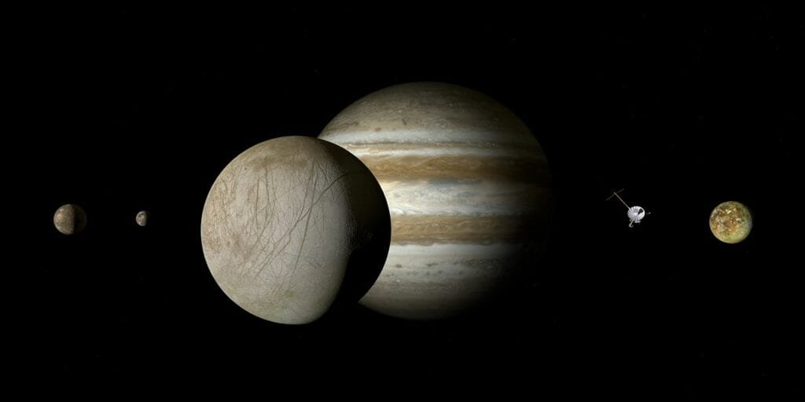
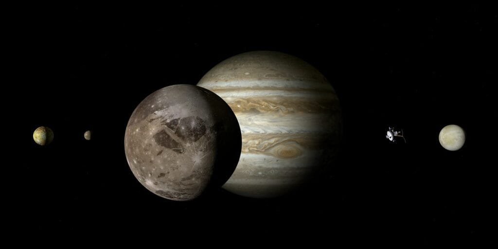

If you've ever been curious about the captivating world of volcanic activity on Io, then look no further. This comprehensive guide will provide you with all the essential information you need to understand the fascinating processes that occur on this enigmatic moon of Jupiter. From the formation of volcanoes to the different eruption patterns and the hazards and benefits they bring, this guide will give you a deeper insight into the volatile nature of Io's volcanic activity. So grab a cup of coffee, sit back, and prepare to embark on a journey into the intriguing world of Io's volcanoes.

This image is property of pixabay.com.

## Understanding Io: The Most Volcanically Active Body in Our Solar System

Io, one of Jupiter's moons, is a fascinating celestial body that has captured the attention and curiosity of scientists for many years. Its remarkable volcanic activity sets it apart from any other known body in our solar system. In this comprehensive guide, we will explore the origin, characteristics, and interior structure of Io, as well as delve into the mechanism of its volcanism and the various types of volcanic emissions it exhibits. We will also compare Io's volcanic activity to that of Earth, discuss the methods and tools used to study Io's volcanism, highlight significant scientific milestones in our understanding of Io, and explore the implications of its volcanism for astrobiology. Additionally, we will address the potential hazards and risk mitigation associated with future missions to Io and examine the future directions in the study of its volcanic activity. So, let's embark on this journey to unravel the mysteries of Io's volcanism!

## Origin and Basic Characteristics of Io

Io, discovered by Galileo Galilei in 1610, is the innermost of Jupiter's four Galilean moons. It is roughly the same size as Earth's Moon but boasts a vibrant and complex volcanic landscape. The primary source of Io's volcanism lies in its substantial tidal heating caused by the gravitational interactions with Jupiter and its fellow Galilean moons. This intense heating generates the energy required to power the volcanic activity on Io's surface.

Io has a highly elliptical orbit around Jupiter, which causes significant tidal forces acting on its interior. These tidal forces result in a phenomenon known as "tidal heating," where the moon's interior experiences significant frictional heating due to the stretching and compressing effects of Jupiter's immense gravitational pull. As a result, Io is the most volcanically active body in our solar system, with hundreds of active volcanoes and ongoing eruptions.

<iframe width="560" height="315" src="https://www.youtube.com/embed/Ordn2nAOfIc" frameborder="0" allow="accelerometer; autoplay; encrypted-media; gyroscope; picture-in-picture" allowfullscreen></iframe>

  

## Io's Position in the Solar System

Io is situated in a region of the solar system called the Jovian system, which comprises Jupiter, its rings, and its numerous moons. The Jovian system is located beyond the asteroid belt and is part of the outer regions of the solar system. Among Jupiter's four largest moons, also known as the Galilean moons, Io is the closest to the planet. Its proximity to Jupiter plays a vital role in the mechanism of its volcanism, as we will explore further in the next section.

## Io's Interior Structure and Composition

Io's interior structure is primarily composed of a rocky mantle and a dense iron core. The mantle consists of various rock materials, including silicates, sulfides, and volatiles such as sulfur and [sulfur dioxide](https://magmamatters.com/understanding-volcanic-formation-a-comprehensive-guide/ "Understanding Volcanic Formation: A Comprehensive Guide"). These volatile materials are crucial contributors to Io's unique volcanic activity.

The intense tidal heating experienced by Io generates a constant churning of its interior. This ongoing process melts the volatile-rich mantle and generates a subsurface magma ocean beneath its crust. The presence of this subsurface magma ocean plays a significant role in the creation of the diverse volcanic features observed on Io's surface. It leads to the escape of various materials, such as molten lava, gas, and dust, through volcanic eruptions.

This image is property of pixabay.com.

## Mechanism of Volcanism on Io

The volcanic activity on Io is primarily driven by two main factors: tidal heating and its orbit's resonance with other Galilean moons. These factors contribute to the unique and extreme [volcanic environment](https://magmamatters.com/geothermal-energy-and-its-volcanic-origins/ "Geothermal Energy and Its Volcanic Origins") experienced by Io.

### Role of Tidal Heating

Tidal heating, as mentioned earlier, is the result of the gravitational interactions between Jupiter, Io, and the other Galilean moons. Due to the elliptical nature of Io's orbit and its relatively close proximity to Jupiter, the tidal forces acting on Io's interior are exceptionally strong. This immense gravitational energy is dissipated as heat within Io's interior, leading to widespread melting and the formation of subsurface magma oceans.

The intense tidal heating creates a continuous cycle of melting and solidification within Io's interior, driving the constant eruption of its volcanoes. The energy generated through tidal heating provides the necessary fuel for maintaining Io's volcanic activity, making it an incredibly dynamic and ever-changing world.

### Impact of Io's Orbit and Resonance with Other Moons

Io's orbit around Jupiter is not perfectly circular but rather elliptical, causing the moon's distance from Jupiter to vary significantly. This distance variation leads to periodic changes in the strength of the tidal forces acting on Io's interior. Furthermore, Io's orbit happens to be in a 2:1 mean-motion resonance with Europa, another of Jupiter's moons.

## Implications of Io's Volcanism for Astrobiology

The extraordinary volcanic activity witnessed on Io has significant implications for the field of astrobiology. While Io itself is unlikely to harbor life as we know it, the knowledge gained from studying its volcanic processes can provide valuable insights into the potential habitability of other icy moons in our solar system and beyond.

### Potential for Prebiotic Chemistry

Volcanic activity on Io releases a variety of volatile compounds, including sulfur, sulfur dioxide, and other elements. These compounds can react with one another and with the moon's surface materials, potentially producing complex organic molecules and prebiotic chemistry. By studying these processes on Io, scientists can gain a better understanding of the chemical reactions that could have occurred on early Earth and other celestial bodies, providing insights into the origins of life.

### Implications for Other Icy Moons and Exomoons

Io's [volcanism serves as a natural laboratory for studying the geological](https://magmamatters.com/the-environmental-impact-of-volcanic-eruptions-2/ "The Environmental Impact of Volcanic Eruptions") and geochemical processes that shape icy moons. By comprehensively analyzing Io's volcanic activity, scientists can gain insights into the processes and mechanisms that shape the surfaces of other icy moons in our solar system, such as Europa and Enceladus.

Furthermore, understanding Io's volcanism can contribute to our understanding of exomoons, moons that orbit planets outside our solar system. With the discovery of numerous exoplanets in the habitable zone, the study of Io's volcanic activity can aid in determining the potential habitability of exomoons and the conditions necessary for the emergence and sustainability of life beyond Earth.

### Volcanism and the Search for Extraterrestrial Life

The discovery of microbial life forms in extreme environments on Earth has significantly expanded our understanding of the diversity and adaptability of life. Io's extreme volcanic environment, with its high temperatures, toxic gases, and active lava flows, provides scientists with an opportunity to examine the limits of life and the potential for microbial organisms to survive in hostile conditions. By studying Io's volcanism, scientists can gain insights into the potential habitability of celestial bodies with extreme environments, thereby informing future searches for extraterrestrial life.

This image is property of pixabay.com.

## Potential Hazards and Risk Mitigation of Future Missions to Io

While exploring Io's volcanic activity is undoubtedly enticing, it poses numerous challenges and potential hazards to future missions. Understanding these hazards and developing effective risk mitigation strategies are essential to ensure the safety and success of future missions to this volatile moon.

### Hazards Posed by High-Energy Particles in Jupiter's Magnetosphere

Jupiter's magnetosphere is a highly energetic and dynamic environment filled with high-energy particles, such as electrons and ions. When spacecraft approach Io, they are exposed to these energetic particles, which can pose a significant risk to their electronic systems and instruments. Shielding spacecraft from these particles requires careful design and planning to ensure the safety of both the mission and the scientific instruments.

### Risks Associated with Volcanic Activity

Io experiences frequent and intense volcanic eruptions, with lava flows, plumes, and eruptive activities occurring regularly across its surface. These volcanic activities create hazardous conditions for spacecraft in close proximity to the moon. The high temperatures, gases, and volcanic debris could pose risks to the integrity and functionality of spacecraft instruments and potentially jeopardize mission objectives. Therefore, proper risk assessment and mitigation strategies must be implemented to protect spacecraft and ensure mission success.

### Potential Strategies for Safe Mission Design

To mitigate the hazards associated with the exploration of Io, several strategies could be employed. One approach is to carefully plan spacecraft trajectories and orbits to minimize the exposure to high-energy particles and avoid regions of intense volcanic activity. Additionally, shielding techniques, such as the use of radiation-hardened electronic components and insulating heat-resistant materials, can be employed to protect spacecraft from extreme temperatures, radiation, and volcanic debris. Furthermore, ongoing monitoring and mapping of Io's volcanic activity can aid in selecting safe landing sites and optimizing mission operations.

## Future Directions in the Study of Io's Volcanism

As our understanding of Io's volcanism continues to expand, future missions and studies are expected to shed even more light on the intricacies of this unique moon. Several exciting avenues of research and exploration are on the horizon, promising to deepen our knowledge and challenge our current understanding of Io's volcanic activity.

### Objectives of the Planned Europa Clipper Mission

While the primary focus of the Europa Clipper mission is Jupiter's moon Europa, the spacecraft will also conduct flybys of Io during its journey. These flybys will provide scientists with valuable opportunities to gather data and images of Io's volcanic plumes, surface changes, and geologic features. The data obtained from these flybys will contribute to our understanding of Io's volcanism and help guide future exploration missions to this enigmatic moon.

### Prospects for an Io Dedicated Mission

Although there are currently no dedicated missions planned specifically for Io, the success and discoveries made by previous missions have sparked interest in the scientific community to propose future missions solely dedicated to Io. Such a mission would enable more comprehensive and detailed investigations of Io's volcanism, focusing on specific regions, volcanic processes, and the moon's overall geology. The information gathered through an Io dedicated mission would undoubtedly revolutionize our understanding of the moon's volcanic activity and provide invaluable insights into the dynamics of volcanic processes.

### Questions Yet to Be Answered

Despite extensive research and numerous missions, many questions regarding Io's volcanism remain unanswered. For instance, scientists are still investigating the factors contributing to the continuous activity of Io's volcanoes and the mechanisms behind the variability in eruption styles. Additionally, the exact role of specific volcanic hotspots and their relationships within Io's geologic framework are yet to be fully understood. Future studies will continue to address these puzzling questions, unraveling the complexities of Io's volcanic activity and fueling further scientific exploration.

## In Conclusion

Io's volcanic activity stands as a testament to the awe-inspiring diversity and complexity of our solar system. Its abundant volcanoes, lava flows, and plumes provide scientists with a window into the intricate processes that shape celestial bodies. As we continue to explore and understand Io's volcanism, we are not only unraveling the secrets of this mesmerizing moon but also expanding our knowledge of volcanic activity in general. The study of Io's volcanic processes has wide-ranging implications for astrobiology, the exploration of other icy moons, and the search for extraterrestrial life. By carefully considering the hazards and risks associated with future missions to Io, we can ensure the safe exploration of this remarkable world. As we venture further into the study of Io's volcanism, we anticipate exciting discoveries, innovative technologies, and a deeper appreciation for the wonders of our solar system.

