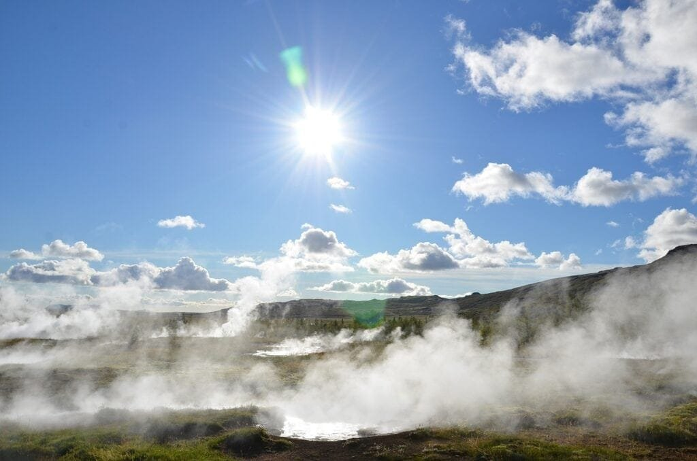
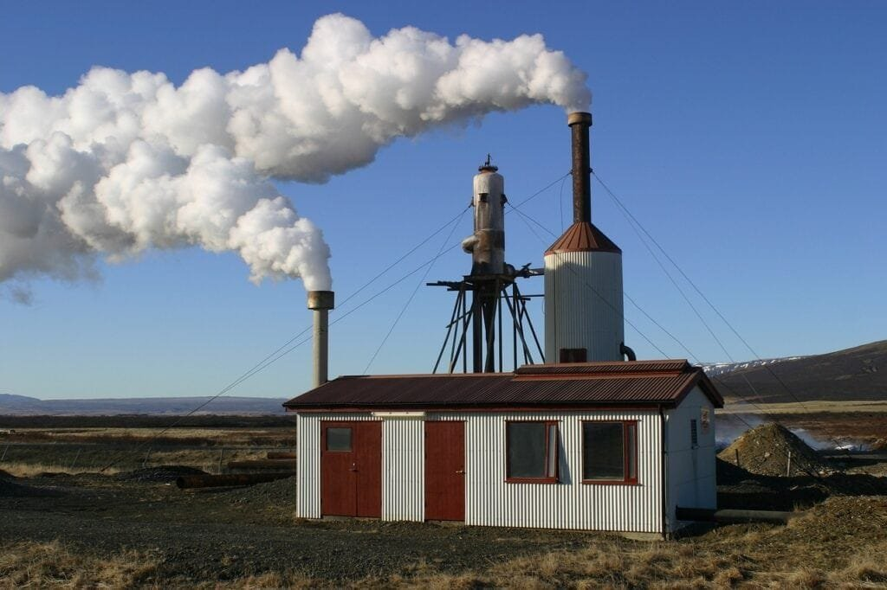
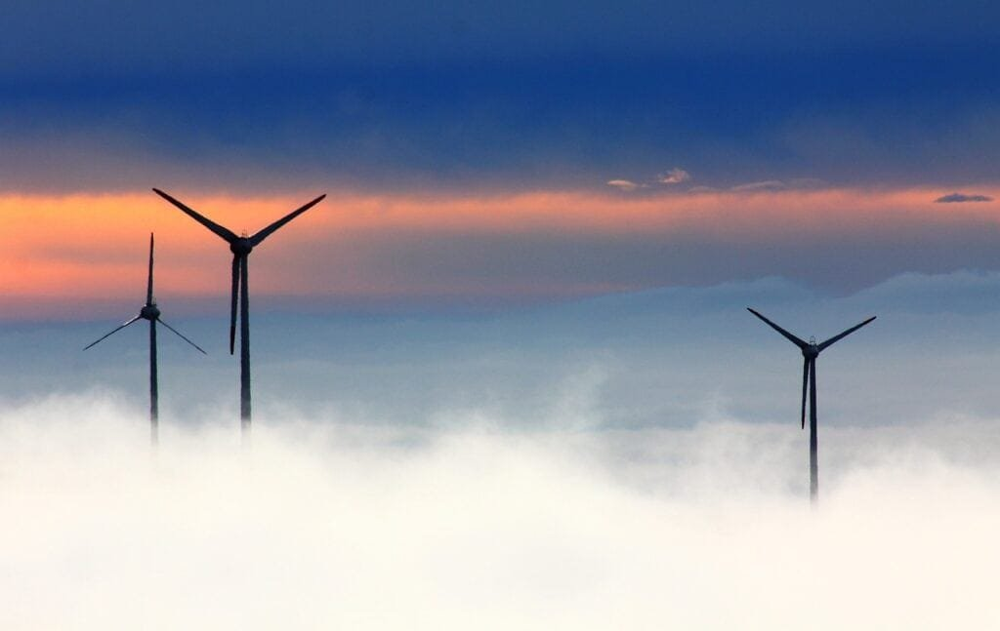

In this comprehensive guide to volcanic geothermal energy, you'll gain a deeper understanding of the fascinating world of volcanoes and how they can be a potential source of renewable energy. From the formation of volcanoes to their geographic distribution and different eruption patterns, this article provides valuable context to explore the concept of harnessing geothermal energy efficiently. By delving into the topic, you'll discover the immense benefits and potential hazards associated with volcanic geothermal energy, allowing you to appreciate the importance of studying and utilizing this incredible natural resource.

This image is property of pixabay.com.

## Understanding Volcanic Geothermal Energy

Volcanic geothermal energy refers to the utilization of the heat energy generated by the volcanic activity beneath the Earth's surface. This renewable energy source has gained significant attention in recent years due to its abundance and potential for sustainable power generation. Understanding the various aspects of volcanic geothermal energy is crucial in harnessing its full potential and maximizing its efficiency.

### Definition of Volcanic Geothermal Energy

Volcanic geothermal energy is the heat energy produced by the geothermal reservoirs that exist within volcanic areas. This energy is generated by the molten rock, or magma, beneath the Earth's surface. It can be harnessed and converted into electricity or used directly for heating purposes. Volcanic geothermal energy is considered a renewable energy source as its heat is continuously replenished by the Earth's internal processes.

### Types of Volcanic Geothermal Energy

There are two primary types of volcanic geothermal energy: high-temperature geothermal energy and low-temperature geothermal energy. High-temperature geothermal energy is derived from reservoirs with temperatures above 150 degrees Celsius and is typically found in areas with active volcanic activity. Low-temperature geothermal energy, on the other hand, is obtained from reservoirs with temperatures ranging from 30 to 149 degrees Celsius and is usually found in regions with dormant or extinct volcanoes.

### The Science Behind Volcanic Geothermal Energy

The science behind volcanic geothermal energy lies in the heat generated by the Earth's core and mantle. Heat from the core and mantle causes the molten rock, or magma, to rise towards the Earth's surface, creating volcanic activity. When this magma comes into contact with groundwater, it heats it up, creating geothermal reservoirs. This heat can be extracted and used to generate electricity or provide heating for various applications.

## The Source of Volcanic Geothermal Energy

### Formation of Volcanoes

Volcanoes are formed when molten rock, gases, and debris escape to the Earth's surface, causing eruptions of lava and ash. They occur at sites along plate boundaries, hotspots under the Earth's crust, or rift zones where the Earth's tectonic plates are moving apart. Volcanoes like those in the "Ring of Fire" encircling the Pacific Ocean are located atop spots where tectonic plates meet, making them prone to eruptions. Other volcanoes, like [shield volcanoes](https://magmamatters.com/understanding-volcanic-formation-a-comprehensive-guide/ "Understanding Volcanic Formation: A Comprehensive Guide") in Hawaii, form gradually over hot spots deep underground and erupt less explosively. Volcanoes display different eruption patterns depending on factors like lava viscosity and gas content.

### Geographical Distribution of Volcanoes

Volcanoes are distributed worldwide, with the highest concentration along plate boundaries and tectonic plate hotspots. The "Ring of Fire" is a prime example of a region with intense volcanic activity, stretching from the western coast of the Americas, through the Pacific Ocean, to Southeast Asia. Other volcanic regions include the East African Rift System, Iceland, and the Kamchatka Peninsula in Russia. The geographical distribution of volcanoes plays a significant role in determining the availability of volcanic geothermal energy resources.

### Tectonic Plate Movements and Hotspots

Tectonic plate movements play a key role in the formation of volcanoes and the availability of volcanic geothermal energy. There are three primary types of plate boundaries: convergent boundaries, divergent boundaries, and transform boundaries. Convergent boundaries occur when two tectonic plates collide, causing one plate to be forced beneath the other in a process known as subduction. This subduction can lead to the formation of volcanic arcs and associated geothermal reservoirs. Divergent boundaries, on the other hand, occur when two tectonic plates move apart, resulting in the upward movement of magma towards the Earth's surface. This process leads to the creation of rift zones and the potential for geothermal resources. Hotspots, which are areas of intense volcanic activity, are believed to be caused by mantle plumes rising from deep within the Earth. These hotspots can create long-lasting volcanic regions, such as the Hawaiian Islands.

This image is property of pixabay.com.

## The Geology of Volcanic Geothermal Energy

### Volcanic Rock Types and Properties

Volcanic rock plays a crucial role in the geology of volcanic geothermal energy. Different types of volcanic rock, such as basalt, andesite, and rhyolite, have varying properties that can affect the efficiency of geothermal energy extraction. Basalt, for example, is a common volcanic rock that possesses excellent heat conductivity, making it an ideal host rock for geothermal reservoirs. Andesite and rhyolite, on the other hand, have lower heat conductivity, which can make geothermal extraction more challenging. Understanding the properties of volcanic rock is essential in identifying suitable locations for geothermal energy projects.

### Volcanic Soil and Heat Conduction

Volcanic soil, also known as volcanic ash or tephra, plays a critical role in the conduction of heat in volcanic geothermal systems. Volcanic ash has a high porosity and lower thermal conductivity compared to solid rock, allowing the movement of heat within the geothermal reservoir. The presence of volcanic soil enhances the efficiency of geothermal energy extraction by acting as a natural insulator, reducing heat loss from the reservoir. Additionally, volcanic soil is rich in nutrients, which can benefit agriculture in areas where geothermal energy is harnessed.

### Role of Volcanic Gases in Energy Production

Volcanic geothermal systems often contain a variety of gases, including steam, [carbon dioxide](https://magmamatters.com/the-environmental-impact-of-volcanic-eruptions-2/ "The Environmental Impact of Volcanic Eruptions"), hydrogen sulfide, and methane. These gases play a crucial role in energy production from geothermal sources. Steam, for instance, is the primary energy carrier in high-temperature geothermal systems. It is extracted, separated from other gases, and used to drive turbines for electricity generation. Carbon dioxide, while being a potential greenhouse gas, can be used for various industrial processes, including enhanced geothermal system (EGS) technologies. Proper management and utilization of volcanic gases are essential to minimize environmental impacts and maximize the efficiency of volcanic geothermal energy.

## Mechanisms of Harnessing Volcanic Geothermal Energy

### Geothermal Power Plants

Geothermal power plants are the main mechanisms used to harness volcanic geothermal energy. There are several types of geothermal power plants, including flash steam power plants, binary power plants, and dry steam power plants. Flash steam power plants are the most common and employ high-pressure, high-temperature geothermal fluids to produce steam, which drives turbines connected to generators. Binary power plants, on the other hand, utilize a heat exchanger to transfer heat from geothermal fluid to a secondary working fluid with a lower boiling point. The vaporized secondary fluid then drives turbines to generate electricity. Dry steam power plants directly use steam extracted from the geothermal reservoirs to drive turbines. The choice of geothermal power plant depends on factors such as the temperature and composition of the geothermal fluid.

### Steam and Hot Water Extraction

Steam and hot water extraction is another method of harnessing volcanic geothermal energy, particularly in areas with lower temperatures or where the geothermal fluid is not suitable for direct electricity generation. In this method, high-temperature geothermal fluids are extracted from the reservoirs and used for direct heat applications such as district heating or industrial processes. The extracted steam or hot water can be transported through pipelines to supply heat to various buildings or facilities.

### Volcanic Ground Reservoirs

Volcanic ground reservoirs are underground structures that hold the geothermal fluids in volcanic geothermal energy systems. These reservoirs can consist of highly permeable fractured rock or porous sedimentary layers. To harness the energy from these reservoirs, wells are drilled into the reservoir, allowing the extraction of the geothermal fluid. The design and construction of these wells are essential in maintaining the integrity of the reservoir and maximizing energy extraction.

This image is property of pixabay.com.

## Technology Used in Volcanic Geothermal Energy

### Drilling Equipment and Techniques

Drilling is a critical aspect of volcanic geothermal energy extraction. Specialized drilling equipment, such as rotary rigs or geothermal drilling rigs, is used to reach the geothermal reservoir beneath the ground. These drilling rigs are designed to withstand high temperatures and pressures encountered during drilling operations. Techniques such as directional drilling, which allows for drilling at specific angles or depths, and slim-hole drilling, which uses smaller diameter drill bits, enhance the efficiency and accuracy of drilling operations.

### Heat Exchangers and Turbine Technology

Heat exchangers and turbine technology are integral components of geothermal power plants. Heat exchangers facilitate the transfer of heat from the geothermal fluid to the working fluid in binary power plants. These heat exchangers are designed to maximize heat transfer efficiency while maintaining the integrity of the fluids. Turbine technology, on the other hand, converts the energy of the vaporized fluids into mechanical energy, which is then transformed into electricity through the use of generators. Advanced turbine designs and materials are continually being developed to improve the efficiency and reliability of geothermal power plants.

### Monitoring and Control Systems

Monitoring and control systems play a vital role in the operation and maintenance of volcanic geothermal energy projects. These systems help monitor the performance of geothermal power plants, well integrity, and reservoir conditions. They provide real-time data on the temperature, pressure, and flow rate of the geothermal fluids, allowing operators to optimize energy extraction. Additionally, control systems enable operators to regulate and adjust various parameters to ensure the safe and efficient operation of the geothermal energy system.

## Efficiency of Volcanic Geothermal Energy

### Energy Conversion Efficiency

The energy conversion efficiency of volcanic geothermal power plants is a key factor in determining the overall efficiency of harnessing geothermal energy. The efficiency of a geothermal power plant is influenced by factors such as the temperature and flow rate of the geothermal fluid, the design of the power plant, and the performance of the heat exchangers and turbines. Higher temperatures and well-designed power plants tend to result in higher energy conversion efficiency, leading to more effective use of the geothermal resource.

### Evaluation of Energy Output

The evaluation of energy output from volcanic geothermal energy projects is crucial in assessing their efficiency and economic viability. The overall energy output is measured in terms of electricity generated or heat delivered to end-users. Various performance indicators, such as the capacity factor and net capacity factor, are used to evaluate the efficiency and reliability of geothermal power plants. These indicators take into account factors such as the availability of the power plant, maintenance downtime, and the actual electricity or heat production relative to the maximum potential.

### Comparison with Other Renewable Sources

Volcanic geothermal energy is often compared to other renewable energy sources to assess its competitiveness and potential contribution to the energy mix. Compared to solar or wind energy, volcanic geothermal energy offers consistent and continuous power generation regardless of weather conditions. It is not dependent on the availability of sunlight or wind, making it a reliable and stable energy source. However, the initial investment and exploration costs associated with volcanic geothermal energy projects can be higher than those of solar or wind energy. Considering economic factors, site-specific conditions, and policy support, a comprehensive evaluation is necessary to determine the most suitable renewable energy options.

## Environmental Impact of Volcanic Geothermal Energy

### Emissions and Greenhouse Gases

Volcanic geothermal energy is considered a relatively clean energy source compared to fossil fuels. However, it can still have some environmental impact. The main emissions associated with geothermal power plants are primarily related to the release of gases, such as carbon dioxide, hydrogen sulfide, and methane, during the extraction and utilization of geothermal fluids. These emissions are generally lower compared to conventional power plants, but their magnitude is influenced by factors such as the composition of the geothermal fluids and the efficiency of gas separation systems. Proper management of emissions and the implementation of [technologies](https://magmamatters.com/geothermal-energy-and-its-volcanic-origins/ "Geothermal Energy and Its Volcanic Origins") for gas capture and treatment are essential in reducing the environmental impact of volcanic geothermal energy.

### Impact on Local Ecology and Geology

The development and operation of volcanic geothermal energy projects can have localized impacts on the surrounding ecology and geology. Drilling activities, for example, may disturb the natural habitat of local fauna and flora. However, appropriate environmental impact assessments and mitigation measures can help minimize these disturbances. Geothermal fluids, if not managed properly, can also potentially interact with the surrounding groundwater or surface water, leading to changes in water quality and affecting aquatic ecosystems. Proper monitoring and management of geothermal fluids and their potential impacts on the local environment are essential to ensure sustainable development.

### Waste Disposal and Management

Waste disposal and management are important considerations in volcanic geothermal energy projects. The extraction of geothermal fluids can result in the generation of solid waste, such as drill cuttings, and liquid waste, such as geothermal brine. Proper handling, treatment, and disposal of these wastes are necessary to prevent potential contamination of the environment. Various methods, including recycling and reusing waste materials, are being employed to minimize the environmental impact of waste disposal in volcanic geothermal energy projects. Additionally, the reinjection of geothermal fluids back into the reservoirs after energy extraction can help mitigate any potential environmental risks associated with fluid disposal.

## Cost and Economic Viability of Volcanic Geothermal Energy

### Capital Expenditure and Operation Costs

The cost of developing and operating volcanic geothermal energy projects can vary depending on factors such as resource characteristics, well drilling depths, and infrastructure requirements. The initial capital expenditure for drilling wells, constructing power plants, and installing transmission lines can be significant. Operation costs include expenses related to well maintenance, fluid extraction and treatment, and power plant operations. However, once established, geothermal power plants have relatively low operating costs compared to conventional power plants as the main fuel source, heat from the geothermal reservoir, is free.

### Economic Benefits for Local Communities

Volcanic geothermal energy projects can bring substantial economic benefits to local communities. The development and operation of geothermal power plants create job opportunities, both during the construction phase and for ongoing plant operations and maintenance. Additionally, revenues generated from geothermal energy projects can contribute to the local economy through taxes, royalties, and lease payments. These economic benefits help support local businesses, infrastructure development, and community initiatives, enhancing the overall well-being of the surrounding communities.

### Competitiveness in the Renewable Energy Market

The competitiveness of volcanic geothermal energy in the renewable energy market is influenced by various factors. The overall costs and economic viability of geothermal projects are essential considerations in determining their competitiveness. Policy support and incentives, such as feed-in tariffs or tax credits, can further enhance the economic viability of geothermal energy and make it more competitive against other renewable energy sources. As advancements in technologies and drilling techniques continue, the costs of geothermal energy projects are expected to decrease, further improving their competitiveness in the renewable energy market.

## Safety and Risks Associated with Volcanic Geothermal Energy

### Risks Associated with Drilling

Drilling activities in volcanic geothermal energy projects carry inherent risks that need to be carefully managed. High temperatures and pressures encountered during drilling operations can pose risks to workers and equipment. Proper training, advanced drilling techniques, and use of appropriate safety measures are essential to minimize these risks. Additionally, the interaction between drilling fluids and geothermal fluids can lead to chemical reactions and potential well integrity issues. Regular inspection and maintenance of wells are crucial in ensuring the long-term safety and efficiency of volcanic geothermal energy projects.

### Volcanic Eruption and Earthquake Risks

Volcanic geothermal energy projects are often located in volcanic regions, making them susceptible to the risks associated with volcanic eruptions and earthquakes. Volcanic eruptions can cause physical damage to infrastructure and pose risks to human safety. Earthquakes, which are common in tectonically active areas, can also potentially disrupt the operation of geothermal power plants and infrastructure. Comprehensive risk assessments, early warning systems, and emergency response plans are essential in mitigating the potential risks associated with volcanic eruptions and earthquakes.

### Mitigation and Management of Risks

The mitigation and management of risks associated with volcanic geothermal energy projects require a multidisciplinary approach. Proper site selection, based on thorough geological and geophysical studies, helps minimize the exposure to potential risks. Advanced monitoring systems, including seismic monitoring and remote sensing, aid in the early detection of any changes in volcanic activity or ground movements. Comprehensive risk management plans, emergency response protocols, and regular drills ensure the safety of workers and surrounding communities. Collaboration between stakeholders, including government agencies, researchers, and industry experts, is crucial in mitigating and managing risks associated with volcanic geothermal energy projects.

## Future Prospects of Volcanic Geothermal Energy

### Potentials for Growth and Expansion

Volcanic geothermal energy has significant growth potential, considering the abundance of volcanic regions worldwide. As technology continues to advance, the access to previously untapped geothermal reservoirs, such as those located at greater depths, is becoming more feasible. Enhanced geothermal systems (EGS) technology, which involves creating artificial geothermal reservoirs through the stimulation of existing rock formations, holds promise for expanding volcanic geothermal energy resources. Additionally, the utilization of low-temperature geothermal resources in district heating and other direct applications can further enhance the growth and expansion of volcanic geothermal energy.

### Technological Advancements and Their Impact

Technological advancements play a crucial role in the development and efficiency of volcanic geothermal energy projects. Improvements in drilling techniques, such as the use of slim-hole drilling and advanced geophysical imaging, allow for more precise targeting and extraction of geothermal reservoirs. Advanced turbines and heat exchangers increase the efficiency of geothermal power plants, resulting in improved energy conversion. Additionally, advancements in monitoring, control, and automation systems enhance the reliability and safety of volcanic geothermal energy operations. Ongoing research and development efforts continue to drive technological advancements, ensuring the continuous improvement of volcanic geothermal energy technologies.

### Geopolitical and Environmental Considerations

Volcanic geothermal energy offers several geopolitical and environmental advantages. Countries with access to volcanic regions can reduce their dependence on imported energy sources and enhance their energy security by tapping into local geothermal resources. Additionally, volcanic geothermal energy can contribute to the reduction of greenhouse gas emissions, as it is a clean and renewable energy source. The development of geothermal energy projects in volcanic regions can also stimulate local economies, create jobs, and support sustainable development. However, it is essential to consider the potential environmental impacts, such as the release of greenhouse gases and the management of waste, to ensure the long-term sustainability of volcanic geothermal energy.

In conclusion, understanding volcanic geothermal energy is crucial in harnessing its full potential and maximizing its efficiency. The formation of volcanoes, their geographical distribution, and the underlying science of volcanic geothermal energy are key factors determining the availability and characteristics of geothermal resources. The geology of volcanic areas, including the properties of volcanic rock and soil, influences the efficiency of energy extraction. Mechanisms such as geothermal power plants, steam and hot water extraction, and volcanic ground reservoirs enable the harnessing of volcanic geothermal energy. The technology used, the efficiency of energy conversion, and the evaluation of energy output contribute to the overall efficiency and economic viability of geothermal projects.

Considering the environmental impact, cost, and safety aspects of volcanic geothermal energy helps in addressing potential challenges and risks associated with its utilization. The future prospects of volcanic geothermal energy lie in its growth potential, technological advancements, and consideration of geopolitical and environmental factors. With continued research and development, volcanic geothermal energy can play a significant role in meeting the world's energy needs in a sustainable and environmentally friendly manner.

