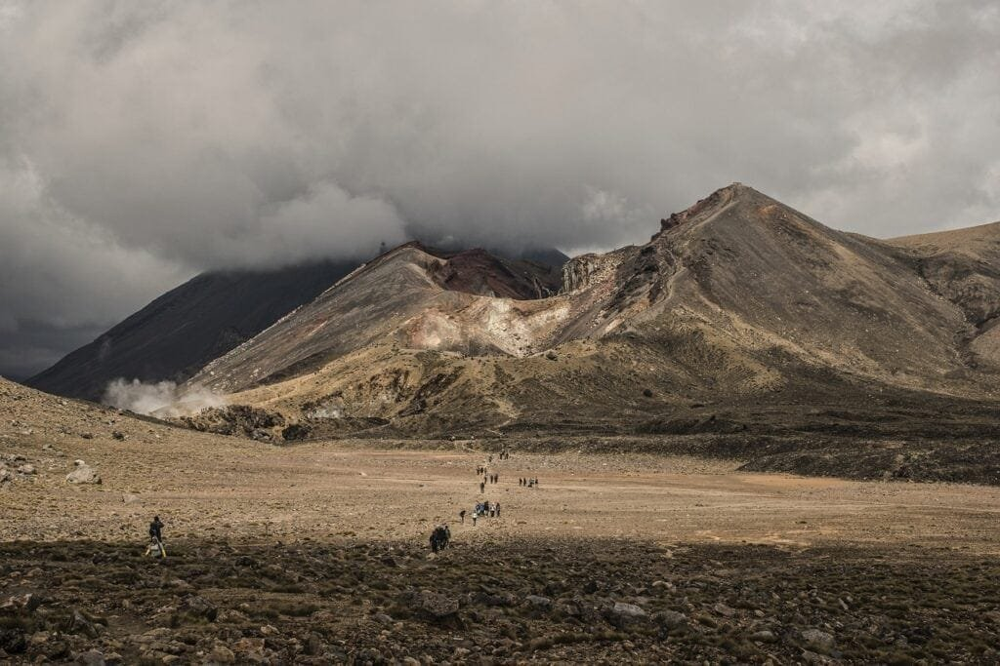

Embark on an exciting journey through geological history as we explore the fascinating world of volcanic eruptions. Volcanoes, formed when molten rock and debris escape to the earth's surface, are awe-inspiring natural phenomena that have shaped the landscapes we see today. Whether they are found along plate boundaries, hotspots under the earth's crust, or rift zones, volcanoes provide a captivating display of the earth's power. From the explosive eruptions of the Ring of Fire to the gradual formation of shield volcanoes in Hawaii, each volcano tells its own unique story. In this article, we will delve into the chronological journey of volcanic eruptions, examining the types of volcanoes, their geographic distribution, eruption causes, hazards, and benefits. By understanding these fiery giants, we can better predict future activity and safeguard communities at risk. Get ready to bask in the wonders of our volcanic past and gain a deeper appreciation for the incredible forces at work beneath our feet.

# Origins of Volcanic Eruptions

Volcanic eruptions have fascinated humans for centuries. The origins of these incredible natural phenomena can be traced back to the movements of tectonic plates, which make up the Earth's crust. The theory of plate tectonics explains how the Earth's lithosphere is divided into several large and small plates that are constantly moving. These movements can result in the formation of volcanoes.

When two tectonic plates collide, one can be forced beneath the other in a process called subduction. As the subducting plate sinks into the Earth's mantle, it begins to melt due to the intense heat and pressure. The melted rock, known as magma, is lighter than the surrounding rocks and rises towards the surface, eventually leading to volcanic eruptions.

<iframe width="560" height="315" src="https://www.youtube.com/embed/Azu6NN5bZWc" frameborder="0" allow="accelerometer; autoplay; encrypted-media; gyroscope; picture-in-picture" allowfullscreen></iframe>

  

## Role of Plate Tectonics

Plate tectonics play a crucial role in the formation of volcanoes. Convergent plate boundaries, where two plates are moving towards each other, are particularly prone to volcanic activity. In these areas, subduction zones can be found, such as the Ring of Fire surrounding the Pacific Ocean, which is notorious for its frequent and violent volcanic eruptions.

At these subduction zones, the denser oceanic plate is forced beneath the less dense continental plate. This process results in the formation of volcanoes along the subduction zone. The melted rock from the subducting plate rises through the overlying plate, creating a conduit for volcanic activity.

## Formation of Magma

Magma is the molten rock that is found beneath the Earth's surface. It is formed when solid rocks in the Earth's mantle melt due to high temperatures and pressures. The composition of magma can vary depending on the minerals present in the rocks that are melting.

One type of magma commonly found in volcanic eruptions is basaltic magma. This type of magma has a low silica content and is relatively fluid, allowing it to flow easily during an eruption. On the other hand, andesitic and rhyolitic magmas have a higher silica content and are more viscous, making them less likely to flow and causing more explosive eruptions.

This image is property of pixabay.com.

## Underground Journey of Magma

Once formed, magma begins its underground journey towards the Earth's surface. This movement is driven by the buoyancy of the magma, as it is lighter than the surrounding rocks. As the magma rises, it can accumulate in magma chambers, which are large pockets of molten rock located beneath the surface.

As the magma continues to rise, it can encounter fractures and weaknesses in the Earth's crust. These pathways, called conduits, provide a route for the magma to reach the surface. When the pressure of the magma overcomes the resistance of the Earth's crust, an eruption occurs, and the magma is expelled as lava onto the Earth's surface.

## Types of Volcanoes

Volcanoes come in various shapes and sizes, each with its own unique characteristics and eruption styles. [Understanding the different types of volcanoes](https://magmamatters.com/understanding-volcanic-formation-a-comprehensive-guide/ "Understanding Volcanic Formation: A Comprehensive Guide") is essential in predicting their behavior and potential hazards. The three main types of volcanoes are shield volcanoes, composite or stratovolcanoes, and [cinder cone](https://magmamatters.com/the-birth-of-new-land-understanding-cinder-cones/) volcanoes.

### Shield Volcanoes

Shield volcanoes are characterized by their broad, gently sloping sides and large summit craters. These volcanoes are formed by the gradual accumulation of fluid basaltic lava flows over time. The lava flows out of long cracks or fissures in the Earth's crust and spreads out in thin layers, building up the shield-shaped mountain.

Shield volcanoes typically have effusive eruptions, where lava flows steadily and can travel long distances. While these eruptions are generally not explosive, they can still pose risks to nearby communities due to the high volume of lava and potential for lava flows to reach residential areas.

### Composite or Stratovolcanoes

Composite or stratovolcanoes are large, steep-sided volcanoes formed by alternating layers of lava, ash, and volcanic debris. These volcanoes are usually found at subduction zones, where one tectonic plate is being forced beneath another. The magma produced in these areas is often more viscous, leading to explosive eruptions.

Stratovolcanoes are known for their explosive eruptions that can send pyroclastic flows, ash clouds, and volcanic gases high into the atmosphere. These eruptions can result in significant destruction of the surrounding landscape and pose serious threats to nearby communities.

### Cinder Cone Volcanoes

Cinder cone volcanoes are small volcanic landforms that usually form as a result of short-lived eruptions. These volcanoes are characterized by their steep-sided, conical shape and are made up of loose volcanic material, such as cinders and ash.

Eruptions from cinder cone volcanoes are typically relatively small and short-lived. The volcanic material is ejected into the air and falls back around the vent, building up the cone-shaped mountain. While these eruptions are not as explosive as those of stratovolcanoes, they can still pose risks to nearby areas due to ashfall and the potential for lava flows.

### Underwater and Subglacial Volcanoes

Volcanic activity is not limited to land; it also occurs beneath the oceans and ice sheets. Underwater volcanoes, also known as submarine volcanoes, can be found along mid-ocean ridges or near tectonic plate boundaries. These volcanoes play a vital role in the formation of new oceanic crust and the release of heat and gases into the ocean.

Subglacial volcanoes, on the other hand, are volcanoes that erupt beneath ice sheets or glaciers. The intense heat from the volcanic activity can cause the ice to melt, leading to the formation of meltwater lakes or glacial outbursts. These volcanic eruptions can have significant impacts on ice sheet stability and contribute to changes in sea level rise.

This image is property of pixabay.com.

## Eruption Styles and Influencing Factors

Volcanic eruptions can vary greatly in their intensity and eruption styles. Several factors can influence these eruption styles, including the viscosity of the lava, the gas content in the magma, and the influence of the environment surrounding the volcano.

### Lava Viscosity and Gas Content

The viscosity of lava refers to its resistance to flow. The higher the silica content of the magma, the more viscous the lava becomes. Viscous lava tends to be thicker and less fluid, which can lead to more explosive eruptions.

When magma has a high gas content, such as water vapor, carbon dioxide, and sulfur dioxide, it can contribute to more explosive eruptions. As magma rises to the surface, the decrease in pressure allows the dissolved gases to come out of the solution, creating bubbles. If the magma is viscous, these gas bubbles can become trapped, resulting in an increase in pressure and an explosive eruption.

### Environmental Influences

The environment surrounding a volcano can also influence the style of volcanic eruptions. If a volcano is located near bodies of water, such as lakes or oceans, eruptions can result in the interaction of the magma with the water. This interaction can lead to the generation of steam explosions, where water is rapidly vaporized, causing explosive eruptions.

The presence of glaciers or ice sheets can also influence volcanic eruptions. When a volcano erupts beneath an ice sheet, the intense heat can melt the ice, leading to the formation of meltwater. This meltwater can then mix with the volcanic material, resulting in the generation of lahars, or volcanic mudflows, which can be extremely destructive.

### Distinctive Eruption Patterns

Volcanic eruptions can exhibit distinctive patterns that provide valuable insights into the behavior of a volcano. Some volcanoes may have intermittent eruptions, where periods of explosive activity are followed by periods of relative calm. This pattern suggests that the volcano is undergoing cycles of building up pressure and releasing it through eruptions.

Other volcanoes may experience constant low-level activity, where lava flows steadily from the vent without explosive eruptions. This type of eruption pattern can result in the gradual growth of a shield volcano, as observed in the Hawaiian Islands.

## Prehistoric Volcanic Eruptions

Volcanic eruptions have been occurring for millions of years, shaping the Earth's surface and influencing the development of life. Although we may not have written records of these ancient eruptions, geologists have been able to uncover evidence of their occurrence through various geological techniques.

### Oldest Known Eruptions

The oldest known volcanic eruptions occurred billions of years ago during the formation of the Earth's early crust. Ancient rocks, such as those found in Western Greenland, provide evidence of these early volcanic activities. The remains of lava flows and volcanic ash layers found in these rocks help scientists understand the conditions and types of eruptions that occurred in the distant past.

### Earliest Human Records

While we may not have written records of prehistoric volcanic eruptions, some ancient civilizations left behind accounts of their experiences with volcanic activity. For example, the Minoan civilization on the island of Santorini in Greece experienced a catastrophic eruption around 1600 BCE. The eruption devastated the island and may have influenced the legend of Atlantis.

The eruption of Mount Vesuvius in 79 CE is another well-documented volcanic event. The Roman cities of Pompeii and Herculaneum were buried under volcanic ash, preserving a snapshot of life in ancient Rome. These volcanic remains provide valuable insights into the impact of volcanic eruptions on human societies and civilizations.

### Impact on Animal and Plant Life

Volcanic eruptions have had a profound impact on the environment throughout history. The release of gases and particulate matter during eruptions can lead to changes in atmospheric conditions, affecting the Earth's climate and ecosystems.

In some cases, volcanic ash and gases can be beneficial to the surrounding environment. Volcanic ash is rich in nutrients, such as phosphorus and potassium, which can fertilize soils and promote plant growth. The volcanic soils formed from these eruptions are highly fertile and are often sought after for agriculture.

However, large-scale volcanic eruptions can also have detrimental effects on animal and plant life. The release of large amounts of volcanic ash into the atmosphere can block sunlight, resulting in global cooling and reduced photosynthesis. This can have far-reaching effects on ecosystems, causing crop failures, disruptions in food chains, and even mass extinctions.

This image is property of pixabay.com.

## Famous Eruptions in Antiquity

Throughout history, several volcanic eruptions have left a lasting impact on human civilization. These eruptions have been recorded in various ancient texts and have shaped the course of events in ancient societies.

### Eruption of Mount Vesuvius

The eruption of Mount Vesuvius in 79 CE is one of the most famous volcanic eruptions in history. Located near the city of Pompeii, the eruption buried the city under meters of volcanic ash, preserving it in remarkable detail. The eruption resulted in the loss of thousands of lives and had a profound impact on the region.

The ruins of Pompeii provide a unique glimpse into ancient Roman life and have yielded invaluable archaeological insights. The area surrounding Mount Vesuvius remains an active volcanic region, reminding us of the potential hazards associated with living near a volcano.

### Eruption of Mount Tambora

The eruption of Mount Tambora in 1815 is considered one of the most powerful eruptions in recorded history. The volcano, located in present-day Indonesia, experienced a cataclysmic eruption that spewed ash, gases, and pyroclastic flows into the atmosphere. The effects of this eruption were felt globally, leading to a year without summer in many parts of the world.

The eruption of Mount Tambora had devastating consequences on a global scale. Crop failures, famine, and disease outbreaks followed as a result of the reduced sunlight and altered climate conditions. This eruption serves as a stark reminder of the far-reaching impacts that volcanic eruptions can have on human societies.

### Other Significant Ancient Eruptions

Several other volcanic eruptions have made their mark on ancient history. The eruption of Santorini in ancient Greece around 1600 BCE had significant cultural and environmental impacts. The Minoan civilization on the island was decimated, and the effects of the eruption may have contributed to the decline of the civilization.

In the Americas, the eruption of the Taupo Volcano in New Zealand around 180 CE left behind a volcanic crater that is now filled with the pristine waters of Lake Taupo. This eruption was one of the most powerful in the world's recent history and had a significant impact on the local Maori population.

## Volcanic Eruptions in the Middle Ages

The Middle Ages were marked by several notable volcanic eruptions that impacted medieval societies across the globe. These eruptions influenced everything from agriculture and trade to social and political landscapes.

### Mount Asama Eruption in Japan

In 1108 CE, Mount Asama, located in present-day Japan, experienced a powerful eruption that devastated nearby villages. The eruption sent volcanic ash and [pyroclastic flows down the slopes of the volcano](https://magmamatters.com/the-environmental-impact-of-volcanic-eruptions-2/ "The Environmental Impact of Volcanic Eruptions"), leading to the loss of many lives and the destruction of livelihoods.

The eruption of Mount Asama was a significant event in Japanese history and has been documented in historical records and artwork. The impact of this eruption on medieval Japanese society serves as a reminder of the risks associated with living near an active volcano.

### Huaynaputina Eruption in Peru

In 1600 CE, the Huaynaputina volcano in present-day Peru erupted explosively, releasing a massive amount of volcanic ash and gases. The eruption had devastating effects on the local population, with significant loss of life and destruction of farmland.

The eruption of Huaynaputina had far-reaching consequences beyond Peru. The enormous amount of ash ejected into the atmosphere caused a temporary cooling of global temperatures, resulting in a year without a summer in many parts of the world. The effects of this eruption were felt as far away as Europe and North America.

### Effects on Medieval Societies

Volcanic eruptions during the Middle Ages had significant impacts on medieval societies. The loss of farmland due to volcanic ash deposition led to crop failures and reduced food supplies. This, in turn, caused famine and increased social unrest within affected communities.

Volcanic eruptions also disrupted trade routes and economic activities. The impact of volcanic ash on transportation and infrastructure made it difficult for goods to be transported, leading to shortages of essential goods and increased prices.

Additionally, the psychological impact of volcanic eruptions cannot be underestimated. The awe-inspiring and destructive power of a volcanic eruption had a profound effect on medieval societies, shaping their beliefs, legends, and worldview.

## Modern Volcanic Eruptions

Modern times have witnessed some of the most dramatic and memorable volcanic eruptions in recorded history. These eruptions have had far-reaching consequences on global scales, often serving as reminders of the power and unpredictability of nature.

### Eruption of Krakatoa

One of the most famous volcanic eruptions of modern times occurred in 1883 on the Indonesian island of Krakatoa. The eruption of Krakatoa was one of the most violent in recorded history, with explosions that could be heard over 3,000 miles away. The eruption generated enormous tsunamis that killed tens of thousands of people and devastated nearby coastlines.

The eruption of Krakatoa had a significant impact on global climate conditions. The ash and gases released during the eruption caused a temporary cooling of the Earth's surface temperatures, resulting in vivid sunsets observed worldwide.

### Eruption of St. Helens

The eruption of Mount St. Helens in 1980 was a highly significant volcanic event in the United States. Located in the state of Washington, Mount St. Helens experienced a catastrophic eruption that resulted in the loss of 57 lives and widespread destruction of forests and infrastructure.

The eruption of Mount St. Helens served as a wake-up call for volcanic hazard mitigation in the United States. The event led to the development of improved monitoring and prediction techniques and highlighted the need for effective emergency response plans.

### Other Notable Modern Eruptions

Several other modern volcanic eruptions have left their mark on history. The eruption of Pinatubo in the Philippines in 1991 was one of the most powerful eruptions of the 20th century. The release of volcanic ash and gases during this eruption caused a global cooling effect, leading to a measurable decrease in global temperatures.

In 2010, Eyjafjallajökull volcano in Iceland erupted, causing widespread disruption to air travel across Europe. The eruption sent massive ash clouds into the atmosphere, which posed a significant risk to aircraft engines and led to the closure of airspace in many countries.

## Effects of Volcanic Eruptions

Volcanic eruptions have both immediate and long-term effects on the environment, climate, and human societies. These effects can range from devastating natural disasters to the creation of new landforms and ecosystems.

### Hydrological Changes

Volcanic eruptions can cause significant changes in the hydrological cycle. The release of large amounts of water vapor during eruptions can lead to the formation of thunderstorms and torrential rainfall. This can result in flash floods and lahars, which are fast-moving mudflows composed of volcanic ash and water.

In some cases, volcanic eruptions can also lead to the formation of new lakes. When volcanic craters fill with water, they can create stunning bodies of water, such as Crater Lake in the United States or Lake Toba in Indonesia.

### Atmospheric Impact

Volcanic eruptions can have a profound impact on the Earth's atmosphere. The release of ash, gases, and aerosols during eruptions can reach the upper atmosphere and interact with solar radiation.

Volcanic ash, composed of tiny rock and mineral particles, can reflect sunlight back into space, resulting in a temporary cooling effect on the Earth's surface. This cooling effect can last for years and has the potential to disrupt weather patterns and agricultural productivity.

Additionally, the release of volcanic gases, such as sulfur dioxide, can react with sunlight and other atmospheric components to form sulfate aerosols. These aerosols can also contribute to the cooling effect by reflecting incoming solar radiation back to space.

### Effects on Human Societies and Civilizations

Volcanic eruptions have had significant impacts on human societies throughout history. The destruction and loss of life caused by explosive eruptions can be devastating, as seen in the destruction of Pompeii or the widespread destruction caused by the eruption of Mount St. Helens.

The ashfall from volcanic eruptions can also pose risks to human health. Breathing in volcanic ash can cause respiratory problems, eye irritation, and other health issues. The impacts of volcanic eruptions are not limited to physical damage; they can also have profound social, economic, and psychological effects on affected communities.

However, volcanic eruptions are not always detrimental to human societies. The ash and gases released during eruptions can enrich the surrounding soil with nutrients, making it highly fertile for agriculture. Volcanic landscapes can also attract tourists and provide opportunities for geothermal energy generation.

## Volcanic Eruptions and Climate Change

Volcanic eruptions have the potential to influence Earth's climate both in the short-term and the long-term. The release of gases and particles into the atmosphere can have significant implications for global warming and the Earth's carbon cycle.

### Contribution to Global Warming

Volcanic eruptions are a natural source of greenhouse gases, such as carbon dioxide. While the amount of [carbon dioxide released by volcanoes](https://magmamatters.com/geothermal-energy-and-its-volcanic-origins/ "Geothermal Energy and Its Volcanic Origins") is small compared to human activities, it can still contribute to global warming over long periods.

Additionally, volcanic eruptions can release other gases, such as sulfur dioxide, which can have a cooling effect on the Earth's surface temperatures. These cooling effects, however, are usually short-lived and offset by the long-term warming effects of greenhouse gas emissions.

### Cooling Effects of Aerosols

The release of ash and aerosols during volcanic eruptions can have a cooling effect on the Earth's climate. These particles reflect sunlight back into space, reducing the amount of solar radiation reaching the Earth's surface.

Large volcanic eruptions, such as the 1991 eruption of Mount Pinatubo, have been known to cause temporary global cooling. The resulting decrease in global temperatures can influence weather patterns, precipitation levels, and crop yields.

### Impact on Natural Carbon Cycle

Volcanic eruptions can also impact the natural carbon cycle on Earth. The release of carbon dioxide during eruptions can influence the balance between carbon stored in the Earth's crust and carbon stored in the atmosphere.

While volcanic eruptions release carbon dioxide into the atmosphere, weathering reactions between volcanic rocks and atmospheric carbon dioxide can draw carbon out of the atmosphere, leading to long-term carbon storage. Over geologic timescales, volcanic activity plays a significant role in regulating the Earth's carbon cycle.

## Predicting Future Volcanic Eruptions

Predicting future volcanic eruptions is a challenging task, but significant advancements have been made in recent decades. Scientists employ various monitoring techniques and analyze multiple parameters to assess the state of volcanoes and identify signs of potential eruptions.

### Monitoring Seismic Activity

Seismic activity is one of the key indicators of volcanic unrest and potential eruptions. Scientists use seismometers to detect and locate earthquakes and ground vibrations associated with volcanic activity. Changes in the frequency, magnitude, and depth of earthquakes can provide valuable insights into the movement of magma beneath the Earth's surface.

In addition to seismic monitoring, ground deformation measurements, such as GPS and tiltmeters, help track changes in the shape and elevation of the volcano. These measurements can indicate the accumulation and movement of magma, providing crucial information for eruption forecasts.

### Analysis of Gas Emissions

The composition and quantity of gases emitted by a volcano can provide critical information about the state of volcanic activity. Scientists collect gas samples from volcanic vents and analyze them for the presence of specific gases, such as [sulfur dioxide and carbon](https://magmamatters.com/the-art-and-science-of-volcano-monitoring/ "The Art and Science of Volcano Monitoring") dioxide.

Changes in gas emissions, such as an increase in sulfur dioxide concentrations, can indicate rising magma levels and increased potential for eruptions. Continuous monitoring of gas emissions helps scientists track volcanic activity and provides additional data for eruption forecasting and hazard assessment.

### Satellite Imaging Techniques

Remote sensing techniques, such as satellite imaging, have revolutionized the monitoring of volcanic activity. Satellites equipped with specialized sensors can detect changes in the thermal energy emitted by volcanoes, allowing scientists to identify hotspots and monitor volcanic unrest over large areas.

Satellite imaging can also provide information on gas emissions, ash plumes, and ground deformation. These data help scientists track volcanic activity in real-time, allowing for more accurate eruption forecasts and timely warnings to at-risk communities.

While predicting the exact timing and intensity of volcanic eruptions remains a challenge, these monitoring techniques and analyses have greatly improved our understanding of volcanic processes. Continued advancements in volcano monitoring and research are crucial for reducing the risks associated with volcanic hazards and protecting vulnerable populations.

In conclusion, a comprehensive understanding of volcanic eruptions is essential for predicting future activity and mitigating risks to surrounding communities. The origins of volcanic eruptions can be traced back to the movements of tectonic plates and the formation of magma. Different types of volcanoes have distinct eruption styles, influenced by factors such as lava viscosity, gas content, and environmental conditions. Throughout history, volcanic eruptions have shaped landscapes, impacted human societies, and affected the Earth's climate. By monitoring seismic activity, analyzing gas emissions, and utilizing satellite imaging techniques, scientists are making significant strides in predicting future volcanic eruptions. This knowledge is vital in developing effective hazard mitigation strategies and ensuring the safety of communities living in volcanic regions.

