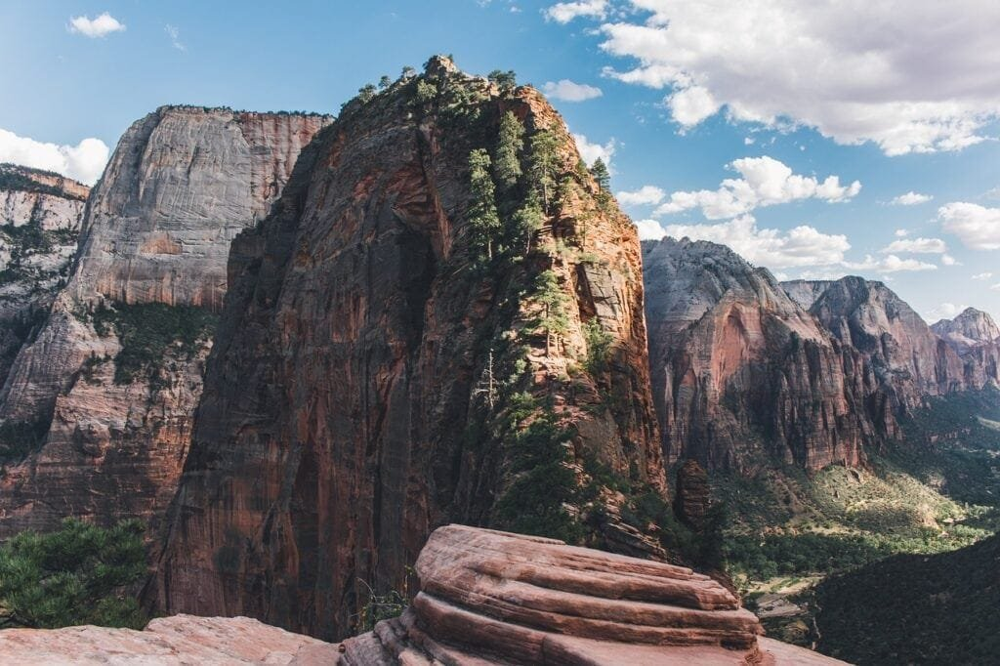

Imagine standing on the edge of a breathtaking volcanic island, surrounded by the beauty and raw power of nature. But have you ever wondered how these islands actually form? In this step-by-step guide, we will take you on a journey to understand the fascinating process behind the creation of volcanic islands. From the molten rock and gases beneath the earth's surface to the explosive eruptions that shape the landscape, we will explore the different types of volcanoes, their geographic distribution, eruption causes, hazards, and benefits. By delving into the formation of volcanic islands, we can gain a deeper appreciation for these natural wonders and better predict and mitigate the risks they pose to surrounding communities. So, let's embark on this captivating journey and unravel the secrets behind these magnificent volcanic islands.

<iframe width="560" height="315" src="https://www.youtube.com/embed/KnYX4mXao68" frameborder="0" allow="accelerometer; autoplay; encrypted-media; gyroscope; picture-in-picture" allowfullscreen></iframe>

  

## Understanding the Earth's Crust

The Earth's crust is the outermost layer of the Earth, and it is composed of a variety of different rocks and minerals. It is the thinnest layer of the Earth, ranging from 5 to 70 kilometers in thickness. The crust can be divided into two types: continental crust and oceanic crust.

The continental crust is the type of crust that makes up the continents and is generally thicker and less dense than the oceanic crust. It is primarily composed of granitic rocks and is less dense because it contains a higher percentage of light elements such as silicon and aluminum.

On the other hand, the oceanic crust is found beneath the Earth's oceans and is thinner and more dense than the continental crust. It is primarily composed of basaltic rocks, which are darker in color and have a higher density compared to granitic rocks.

## Differences between the Earth's Crust and Mantle

While the Earth's crust and mantle are both part of the Earth's interior, there are some key differences between the two. The main difference lies in their composition and physical properties.

As mentioned earlier, the Earth's crust is composed of primarily granitic and basaltic rocks, while the mantle is made up of dense, ultramafic rocks such as peridotite. The mantle is hotter and more viscous than the crust, and it makes up the majority of the Earth's volume.

Another difference between the crust and mantle is their behavior under stress. The crust is more brittle, meaning it is more likely to fracture or break when subjected to high pressures and temperatures. In contrast, the mantle is more ductile, meaning it can flow or deform under stress without breaking.

This image is property of pixabay.com.

## Importance of Tectonic Plates

Tectonic plates are large, rigid pieces of the Earth's lithosphere that fit together like a jigsaw puzzle and move over the semi-fluid asthenosphere beneath them. These plates play a crucial role in shaping the Earth's surface and causing geological phenomena such as earthquakes, volcanic activity, and the formation of mountain ranges.

The movement of tectonic plates is driven by the convective currents in the Earth's mantle. As these currents circulate, they generate forces that cause the plates to either move apart, collide, or slide past each other. The boundaries between these plates are known as plate boundaries, and they are the sites where most geological activity occurs.

Tectonic plates are essential for maintaining the Earth's heat budget and regulating the carbon cycle. The interaction of these plates is responsible for the recycling of oceanic crust through subduction, which plays a crucial role in the long-term carbon cycle. This process affects the Earth's climate, as it helps regulate the amount of [carbon dioxide](https://magmamatters.com/geothermal-energy-and-its-volcanic-origins/ "Geothermal Energy and Its Volcanic Origins") in the atmosphere.

Understanding tectonic plates is essential for studying and predicting the occurrence of geological hazards such as earthquakes and volcanic eruptions. By monitoring the movement and interactions of these plates, scientists can better understand the processes that lead to these events and develop strategies to mitigate their impacts.

## Plate Tectonics and Volcanic Activity

Plate tectonics is the theory that explains the movement of the Earth's tectonic plates and the resulting geological phenomena. It is based on the idea that the Earth's lithosphere is divided into several large plates that interact with each other at plate boundaries.

Volcanic activity is intimately linked to plate tectonics, as most volcanoes are located along plate boundaries or hotspots. Hotspots are areas where plumes of hot mantle material rise up towards the Earth's surface, creating a localized source of heat energy.

At convergent plate boundaries, where two plates are moving towards each other, one plate may dive beneath the other in a process called subduction. This subducting plate can melt as it descends into the mantle, forming a magma chamber. This molten rock can then rise to the surface, triggering volcanic activity.

At divergent plate boundaries, where two plates are moving away from each other, magma from the mantle can rise up to fill the gap, creating new crust. This process is often associated with volcanic activity, as the rising magma can erupt onto the Earth's surface and form volcanic features such as rift volcanoes.

This image is property of pixabay.com.

## Volcanic Hotspots and Their Role in Island Formation

A volcanic hotspot is a localized area of high volcanic activity that is not directly related to plate boundaries. These hotspots are thought to be caused by plumes of hot mantle material that rise up from the deep mantle and melt as they approach the Earth's surface.

One of the most well-known examples of volcanic hotspots is the Hawaiian Islands. The Hawaiian Islands are a chain of volcanic islands located in the Pacific Ocean. The islands were formed by a hotspot beneath the Pacific plate, which has been responsible for the continuous volcanism that created the islands.

As the Pacific plate moves over the hotspot, new volcanoes form and older ones become dormant or extinct. The resulting chain of islands is known as a volcanic island chain or seamount chain. The most recent volcanic activity in the Hawaiian Islands is focused on the island of Hawaii, which is home to the active Kilauea and Mauna Loa volcanoes.

Hotspots can also be responsible for the formation of volcanic islands in other parts of the world, such as the Galapagos Islands and the Azores. These islands are formed when the movement of tectonic plates carries them over a hotspot, leading to the eruption of volcanic material and the growth of new land.

## Different Types of Volcanoes

Volcanoes can be classified into different types based on their shape, eruption style, and composition of erupted materials. Two common [types of volcanoes are stratovolcanoes and shield](https://magmamatters.com/understanding-volcanic-formation-a-comprehensive-guide/ "Understanding Volcanic Formation: A Comprehensive Guide") volcanoes.

Stratovolcanoes, also known as composite volcanoes, are large and symmetrical in shape. They are typically formed by the alternating layers of lava flows, volcanic ash, and other volcanic materials. These [volcanoes are characterized by explosive eruptions and the formation](https://magmamatters.com/the-environmental-impact-of-volcanic-eruptions-2/ "The Environmental Impact of Volcanic Eruptions") of pyroclastic flows, which are fast-moving currents of hot gas and volcanic debris.

Shield volcanoes, on the other hand, are characterized by their broad and gently sloping shape, similar to a warrior's shield. They are mainly composed of fluid basaltic lava flows that spread out over large areas. Shield volcanoes generally have non-explosive eruptions and are known for their relatively calm and continuous lava flows.

The main difference between stratovolcanoes and shield volcanoes lies in their eruption styles and the types of volcanic materials they produce. Stratovolcanoes are associated with explosive eruptions and the formation of pyroclastic flows, while shield volcanoes have non-explosive eruptions and produce relatively quiet lava flows.

This image is property of pixabay.com.

## Phases in the Formation of a Volcanic Island

The formation of a volcanic island typically goes through several phases that shape its geologic evolution. These phases include the submarine phase, the Surtseyan phase, and the erosional phase.

The submarine phase is the initial stage in the formation of a volcanic island. It starts with volcanic activity occurring underwater, where lava erupts from the seafloor and builds up a volcanic cone. Over time, as volcanic activity persists, the cone grows taller and eventually emerges from the water, forming an island.

Once the volcanic cone breaches the surface of the water, it enters the Surtseyan phase. During this phase, explosive eruptions are common, and volcanic materials such as ash and cinders are ejected into the air. These materials fall back to the surface and accumulate, building up the island's surface and shaping its landscape.

The final phase in the formation of a volcanic island is the erosional phase. As the volcanic island continues to erode due to weathering and sedimentation, it undergoes changes in its shape and size. Erosional processes, such as wave action and wind, wear down the island's surface, redistributing the accumulated volcanic materials.

## The Role of Eruptions in Forming Volcanic Islands

Eruptions play a crucial role in the growth and formation of volcanic islands. When molten rock or magma rises to the surface during an eruption, it adds new material to the island, causing it to grow in size and height.

There are several types of volcanic eruptions, including explosive eruptions and effusive eruptions. Explosive eruptions occur when the magma is high in gas content and viscosity. These eruptions are often violent and result in the ejection of volcanic ash, rocks, and other materials. The accumulation of these ejected materials contributes to the growth of the volcanic island.

Effusive eruptions, on the other hand, are characterized by the relatively gentle flow of lava from the volcano. The lava is low in gas content and viscosity, allowing it to flow easily and spread over large distances. This type of eruption leads to the formation of new land as the lava cools and solidifies, contributing to the growth of the volcanic island.

The frequency and scale of volcanic eruptions can vary greatly, ranging from small, relatively frequent eruptions to large, infrequent eruptions. These eruptions can have a significant impact on the growth and formation of volcanic islands, as they provide the necessary materials to build and shape the land.

## Volcanic Islands within the 'Ring of Fire'

The 'Ring of Fire' is a term used to describe a major area in the basin of the Pacific Ocean where a large number of earthquakes and volcanic eruptions occur. It is a direct result of plate tectonics and the movement and interaction of tectonic plates along the Pacific plate boundaries.

Volcanic islands within the 'Ring of Fire' are formed due to the convergence of tectonic plates. These islands are primarily located along subduction zones, where one tectonic plate is being forced beneath another. This subduction process leads to the formation of volcanic arcs, which are chains of volcanoes that are parallel to the subduction zone.

The 'Ring of Fire' is known for its high volcanic activity, with around 75% of the world's active volcanoes located within this region. These volcanic islands are prone to frequent volcanic eruptions and seismic activity, making them both a scientific interest and a potential hazard for nearby communities.

One reason for the high volcanic activity within the 'Ring of Fire' is the large number of tectonic plate boundaries and subduction zones present in this region. The subduction of oceanic crust beneath continental crust creates conditions that are conducive to the formation of magma and volcanic activity.

## The Lifecycle of a Volcanic Island

A volcanic island goes through different stages throughout its lifecycle, from its initial formation to its eventual decline and disappearance. The lifecycle of a volcanic island can be divided into several distinct stages: the formation stage, the growth stage, the mature stage, and the decline stage.

During the formation stage, a volcanic island begins to emerge from the sea as volcanic activity produces new material that breaches the water's surface. This stage is characterized by the accumulation of volcanic materials and the growth of the island's land area.

In the growth stage, the volcanic island continues to expand as eruptive activity adds more material to its surface. This stage is often marked by frequent eruptions and the buildup of volcanic cones or mountains. The island's landscape becomes more diverse, with the formation of valleys, ridges, and other geologic features.

Once a volcanic island reaches the mature stage, it has reached its maximum size and has entered a period of relative stability. Eruptions become less frequent, and the island's topography becomes more smoothed out through erosion and weathering processes. The mature stage can last for thousands or even millions of years.

Finally, in the decline stage, a volcanic island begins to erode and subside due to weathering, erosion, and other geologic processes. The island's size starts to decrease, and its volcanic activity becomes less frequent and less explosive. Eventually, the island may disappear beneath the ocean and become a seamount.

## Hazards and Benefits of Volcanic Islands

Living on a volcanic island can present both hazards and benefits for the communities inhabiting these areas. It is important to understand and manage these risks to ensure the safety and well-being of the island's residents.

One of the primary hazards associated with living on a volcanic island is the risk of volcanic eruptions. Eruptions can produce ash clouds, pyroclastic flows, lahars (volcanic mudflows), and lava flows, which can cause significant damage to infrastructure and pose a threat to human life. The rapid onset of volcanic hazards leaves little time for evacuation or emergency response.

However, volcanic islands also provide various benefits to the communities living on them. Volcanic soils are highly fertile due to the presence of minerals and nutrients in volcanic ash and lava. This fertility makes the land suitable for agriculture, allowing communities to grow crops and sustain themselves.

Additionally, volcanic islands often attract tourists due to their unique landscapes and the opportunity to observe volcanic activity. Tourism can bring economic benefits to the local communities, contributing to their development and providing job opportunities.

Efforts are made to mitigate the risks associated with living on volcanic islands. These include monitoring volcanic activity, providing early warning systems, and developing evacuation plans. Scientists and government agencies work together to study and understand volcanic behavior, allowing for more accurate predictions and improved emergency response.

## Case Study: The Formation of the Hawaiian Islands

The Hawaiian Islands provide an excellent case study for understanding the formation of volcanic islands. The islands are located in the Pacific Ocean and were formed by a hotspot beneath the Pacific plate.

The geological history of the Hawaiian Islands can be traced back millions of years. As the Pacific plate slowly moves northwestward over the hotspot, new volcanic islands are formed and older ones become dormant or extinct. The islands are arranged in a chain, with the youngest and most active volcanoes located on the eastern end of the chain, near the island of Hawaii.

The Hawaiian hotspot is responsible for the continuous volcanic activity that has formed and shaped the islands over time. The hotspot is thought to be caused by a plume of hot mantle material that rises up from the Earth's mantle, producing magma that erupts onto the surface.

Currently, the island of Hawaii is home to two active volcanoes: Kilauea and Mauna Loa. Kilauea is one of the most active volcanoes in the world and has been erupting continuously since 1983. It has produced vast lava flows that have added new land to the island and reshaped its landscape.

Mauna Loa, on the other hand, is the largest volcano on Earth in terms of volume. It is considered a shield volcano and is characterized by its gentle slopes and non-explosive eruptions. Mauna Loa has erupted numerous times in the past, with the most recent eruption occurring in 1984.

The Hawaiian Islands serve as an excellent example of how volcanic islands can form and evolve over time. They highlight the importance of hotspots in the formation of volcanic islands and the dynamic nature of volcanic activity on these islands.

In conclusion, understanding the formation and characteristics of volcanic islands is crucial for scientists and communities living in these areas. By studying the Earth's crust, the role of tectonic plates, and the processes that shape volcanic islands, we can gain valuable insights into the geologic history of our planet and better prepare for the hazards and benefits associated with volcanic activity.

