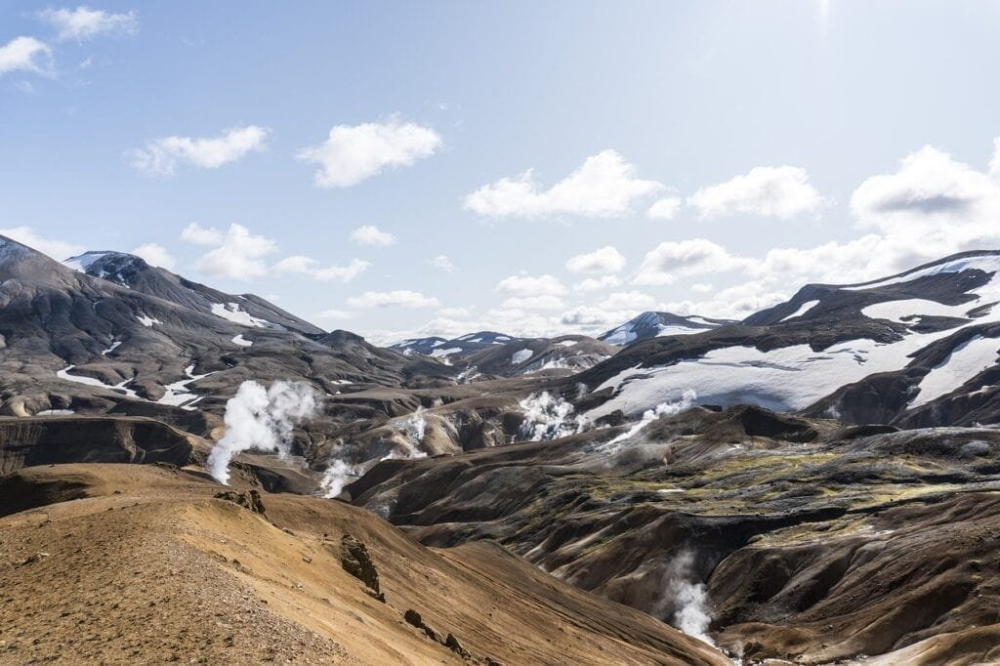
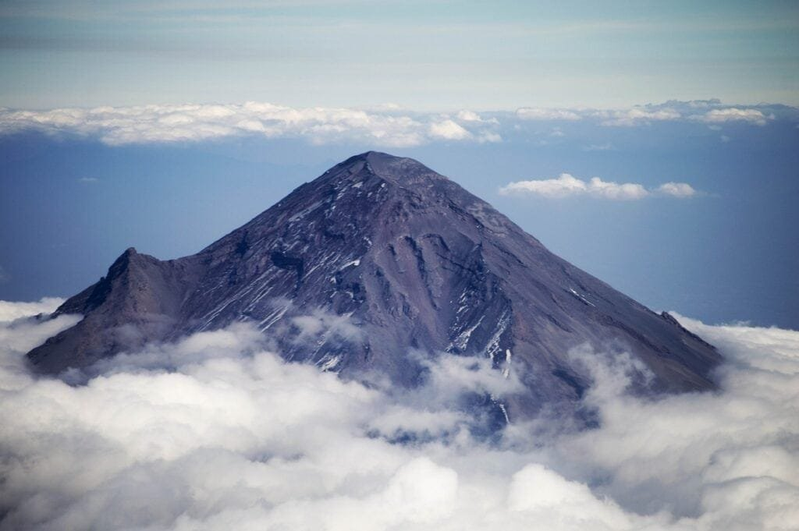

If you're looking for a thrilling adventure for the whole family, why not consider exploring some of the top volcano destinations around the world? Volcanoes, formed by the explosive release of molten rock and gases, offer a fascinating insight into the Earth's geology and the powerful forces that shape our planet. Whether it's the majestic peaks of the Ring of Fire or the gentle slopes of Hawaii's shield volcanoes, each volcano destination offers a unique experience for both young and old alike. From witnessing awe-inspiring eruptions to learning about the benefits and hazards that volcanoes bring, these destinations are sure to create lasting memories and a sense of wonder. So grab your hiking boots and get ready for an exciting family adventure like no other.

This image is property of pixabay.com.

## Understanding Volcanoes

[Volcanoes are a fascinating natural](https://magmamatters.com/the-art-and-science-of-volcano-monitoring/ "The Art and Science of Volcano Monitoring") phenomenon that have captured the curiosity of humans for centuries. They are formed when molten rock, gases, and debris escape to the earth's surface, causing eruptions of lava and ash. These eruptions can occur at sites along plate boundaries, hotspots under the earth's crust, or rift zones where the earth's tectonic plates are moving apart.

Volcanoes come in various types and shapes, each with its own unique characteristics. For example, volcanoes in the "Ring of Fire" encircling the Pacific Ocean are located atop spots where tectonic plates meet, making them prone to eruptions. On the other hand, shield volcanoes in Hawaii form gradually over hot spots deep underground and erupt less explosively.

The eruption patterns of volcanoes can vary greatly depending on factors such as the viscosity of the lava and the gas content. Some volcanoes have frequent small eruptions, while others may have infrequent but extremely powerful eruptions. Understanding these patterns and the causes behind them is crucial for predicting future volcanic activity and mitigating risks to surrounding communities.

In addition to their potential hazards, volcanoes also bring benefits to the environment. Volcanic eruptions release minerals and nutrients into the soil, making it fertile and supporting the growth of vegetation. This has historically attracted human settlements to volcanic areas. Furthermore, volcanoes have played a significant role in the formation of certain landscapes, such as volcanic islands and calderas.

Overall, studying volcanoes not only helps us understand the geological processes that shape our planet, but also enables us to better appreciate the power and beauty of nature.

## Planning a Volcano Adventure

If you're looking to embark on a volcano adventure, there are several important factors to consider. From choosing the ideal volcano destination to making safety preparations, careful planning can ensure a memorable and enjoyable trip for the whole family.

### Choosing the Ideal Volcano Destination

The first step in planning your volcano adventure is to choose the perfect destination. With so many volcanoes around the world, each offering its own unique experience, it can be a tough decision. Consider factors such as accessibility, safety, and the activities available in the area.

### Safety Preparations

Volcano exploration can be an exciting and educational experience, but it’s important to prioritize safety. Before setting off on your adventure, make sure to research and follow any safety guidelines provided by local authorities. It is also advisable to bring essential safety equipment such as sturdy footwear, protective clothing, and a first aid kit.

### Ideal Time for Visit

Timing is crucial when planning a volcano adventure. Some volcanoes are more active during certain times of the year, so it's important to visit when the chances of witnessing an eruption or other volcanic activity are higher. Research the seasonal patterns of the volcano you've chosen and plan your trip accordingly.

### Selecting Suitable Accommodations

When choosing accommodations for your volcano adventure, consider staying in a location that provides easy access to the volcano while also offering basic amenities and comfort for your family. Look for hotels or lodges that are situated in scenic areas and offer breathtaking views of the volcano.

<iframe width="560" height="315" src="https://www.youtube.com/embed/zmkYzDYVeKc" frameborder="0" allow="accelerometer; autoplay; encrypted-media; gyroscope; picture-in-picture" allowfullscreen></iframe>

  

## Mount Vesuvius, Italy

Mount Vesuvius is one of the most famous and iconic volcanoes in the world. Its historical significance, stunning views, and proximity to cultural attractions make it an ideal destination for a volcano adventure.

### Historical Significance

Mount Vesuvius is best known for its catastrophic eruption in 79 AD, which resulted in the destruction of the ancient Roman cities of Pompeii and Herculaneum. Today, visitors can explore the preserved ruins of these ancient cities and gain insight into the daily life and culture of the Roman Empire.

### Things to do Around Mount Vesuvius

Apart from its historical significance, Mount Vesuvius offers a range of activities for visitors. One of the highlights is hiking to the summit of the volcano, where you can witness breathtaking panoramic views of the surrounding landscape. Additionally, [guided tours are available to explore the volcanic](https://magmamatters.com/understanding-volcanic-formation-a-comprehensive-guide/ "Understanding Volcanic Formation: A Comprehensive Guide") crater and learn more about the geology of the area.

### Visitor Information and Accessibility

Mount Vesuvius is located near the city of Naples in southern Italy. It is easily accessible by road and public transportation. Visitors can reach the base of the volcano by bus and then hike up to the summit.

### Nearby Attractions

While visiting Mount Vesuvius, take the opportunity to explore the nearby attractions. Naples, with its rich history, vibrant culture, and delicious cuisine, is worth a visit. Additionally, the ancient ruins of Pompeii and Herculaneum offer a fascinating glimpse into the past.

## Kilimanjaro, Tanzania

Mount Kilimanjaro is not only Africa's tallest peak but also one of the most popular destinations for mountaineers and adventure seekers. Its majestic beauty, diverse wildlife, and unique hiking experience make it an excellent choice for a volcano adventure.

### Climbing to the Summit

Climbing Mount Kilimanjaro is a challenging but rewarding experience. The mountain offers several different routes, each with its own level of difficulty. Whether you're a seasoned climber or a beginner, there is a route suitable for your level of fitness and experience.

### Wildlife and Vegetation

One of the remarkable aspects of Mount Kilimanjaro is its rich biodiversity. The mountain is home to a variety of wildlife, including elephants, leopards, and buffalo. As you ascend the mountain, you will also pass through different vegetation zones, ranging from lush rainforests to barren alpine deserts.

### Visitor Information and Accessibility

Mount Kilimanjaro is located in northern Tanzania and is easily accessible by plane from major international airports. There are several entry points to the mountain, with the most popular being the town of Moshi. From there, guided tours and porters can assist you in your ascent.

### Nearby Attractions

While in Tanzania, take the opportunity to explore other attractions in the area. The Serengeti National Park and Ngorongoro Crater offer incredible wildlife viewing experiences, while the island of Zanzibar provides the perfect tropical getaway with its pristine beaches and rich cultural heritage.

This image is property of pixabay.com.

## Eyjafjallajökull, Iceland

Iceland is known for its breathtaking landscapes, and Eyjafjallajökull volcano is a prime example. From its eruption history to the family-friendly activities in the surrounding area, this volcano offers a unique adventure for visitors.

### Eruption History

Eyjafjallajökull gained international attention in 2010 when it erupted, causing massive disruptions to air travel across Europe. While the eruption caused inconvenience at the time, it also brought attention to the natural beauty and power of Iceland's volcanic landscapes.

### Family Fun Around Eyjafjallajökull

Guests visiting Eyjafjallajökull can enjoy a range of family-friendly activities. Hiking trails, suitable for all ages and fitness levels, provide opportunities to explore the stunning landscapes surrounding the volcano. Additionally, horseback riding and snowmobiling tours are available, allowing visitors to experience the unique terrain of Iceland.

### Visitor Information and Accessibility

Eyjafjallajökull is situated in the southern part of Iceland, approximately a two-hour drive from the capital, Reykjavik. The volcano is accessible by car, and there are organized tours available for those who prefer not to drive.

### Nearby Attractions

While exploring Eyjafjallajökull, be sure to check out other attractions in the area. The Golden Circle, a popular tourist route, includes iconic sites such as the Geysir geothermal area and Gullfoss waterfall. The glacier tongue of Sólheimajökull is also nearby and offers breathtaking views as well as opportunities for glacier hiking and ice climbing.

## Mount Saint Helens, USA

Mount Saint Helens in Washington State, USA, is notorious for its massive eruption in 1980. Today, it serves as an educational destination for both kids and adults, offering a range of activities and experiences.

### Massive Eruption in 1980

The eruption of Mount Saint Helens in 1980 was one of the most significant volcanic events in recent history. The blast caused the collapse of the mountain's northern slope, resulting in the loss of human lives and widespread destruction of the surrounding area. Visitors can learn about this historic event through exhibits and interpretive centers located near the volcano.

### Educational Activities for Kids

Mount Saint Helens provides an excellent opportunity for children to learn about volcanoes and the natural world. Interactive exhibits and ranger-led programs offer educational experiences that engage kids and teach them about geology, ecology, and the impact of volcanoes on the environment.

### Visitor Information and Accessibility

Mount Saint Helens is located in the Cascade Range of southwestern Washington State. The Johnston Ridge Observatory, situated near the crater, is a popular visitor center that provides panoramic views of the volcano. The area is accessible by car, and there are several hiking trails available for visitors to explore.

### Nearby Attractions

When visiting Mount Saint Helens, consider exploring other attractions in the area. Mount Rainier National Park, known for its stunning alpine landscapes and diverse wildlife, is located within driving distance. Additionally, the city of Portland, Oregon, is a short distance away and offers a vibrant urban experience with its unique blend of art, culture, and culinary delights.

This image is property of pixabay.com.

## Mount Fuji, Japan

Mount Fuji, Japan's highest mountain, holds great cultural significance and is considered a symbol of the country. With its rich history, family-friendly activities, and accessibility, it is an ideal destination for a volcano adventure.

### Presence in Japanese Culture

Mount Fuji has been a source of inspiration for artists, writers, and poets throughout Japanese history. It has served as a sacred site for pilgrims and a place of spiritual significance. The mountain's symmetrical cone shape and its snow-capped summit have made it an iconic symbol of Japan.

### Family Activities Around Mount Fuji

Visiting Mount Fuji offers a range of activities for families. The mountain has several hiking trails suitable for different fitness levels, allowing kids and adults to enjoy the scenic beauty and panoramic views. During the summer months, climbing Mount Fuji is a popular challenge for many, providing a unique adventure for the whole family.

### Visitor Information and Accessibility

Mount Fuji is located about 100 kilometers southwest of Tokyo and is easily accessible by public transportation. The mountain has several stations where visitors can start their ascent, with the most common being the fifth station. Buses and trains connect the surrounding areas to the mountain.

### Nearby Attractions

While in the Mount Fuji area, explore the nearby attractions to make the most of your trip. The Fuji Five Lakes region, known for its stunning landscapes and recreational activities, offers opportunities for boating, hiking, and hot spring bathing. The Kawaguchiko Music Forest Museum is also worth a visit, showcasing a collection of automatic musical instruments from around the world.

## Yellowstone Caldera, USA

Yellowstone National Park is not just a beloved national treasure; it is also home to the largest volcanic system in North America, known as the Yellowstone Caldera. With its geothermal wonders, abundant wildlife, and family-friendly activities, it is a perfect destination for a volcano adventure.

### What Is a Caldera?

A caldera is a large volcanic crater formed by the collapse of a volcano following a massive eruption. The Yellowstone Caldera is one of the world's most famous calderas and is characterized by its geothermal features, including the iconic Old Faithful geyser. This unique landscape provides visitors with an opportunity to witness the power and beauty of volcanism up close.

### Family Activities in Yellowstone National Park

Yellowstone National Park offers a wide range of activities for families. From hiking to camping, wildlife watching to geothermal exploration, there is something for everyone. Kids can participate in ranger-led programs, learn about the park's geology and ecology, and even earn Junior Ranger badges.

### Visitor Information and Accessibility

Yellowstone National Park spans parts of Wyoming, Montana, and Idaho in the United States. There are several entrances to the park, each offering access to different areas and attractions. The park is open year-round, but certain sections may be inaccessible during the winter months due to heavy snowfall.

### Nearby Attractions

While exploring the Yellowstone Caldera, take the time to explore the surrounding area. The Grand Teton National Park, known for its majestic mountain peaks and pristine lakes, is located to the south of Yellowstone and offers stunning landscapes for hiking and wildlife viewing. The town of Jackson, Wyoming, is also nearby and provides a variety of dining, shopping, and entertainment options.

## Kilauea, Hawaii

When it comes to volcanoes, it's hard to beat the natural spectacle of Kilauea on the Big Island of Hawaii. With its continuous volcanic activity, lush landscapes, and rich Hawaiian culture, Kilauea offers a unique experience for visitors of all ages.

### Nature's Spectacle of Fire and Water

Kilauea is renowned for its ongoing volcanic activity, making it one of the most active volcanoes in the world. Witnessing the fiery lava flows and glowing steam vents is a mesmerizing experience that showcases the raw power of nature. Visitors can take guided tours around the volcano and even witness lava entering the ocean, creating dramatic steam plumes.

### Interacting with the Hawaiian Culture

Exploring Kilauea provides an opportunity to immerse yourself in Hawaiian culture. The nearby Hawaii Volcanoes National Park offers cultural demonstrations, traditional storytelling, and guided walks led by Native Hawaiian guides. Visitors can also learn about the significance of the volcano in Hawaiian mythology and the historical relationship between the Hawaiian people and their volcanic island home.

### Visitor Information and Accessibility

Kilauea is located within the Hawaii Volcanoes National Park on the Big Island of Hawaii. The park is easily accessible by car, and there are designated viewing areas and hiking trails that allow visitors to explore the volcano and its surrounding landscapes.

### Nearby Attractions

While on the Big Island, take advantage of the opportunity to explore other attractions in the area. The Punalu'u Black Sand Beach, known for its unique volcanic sands and sea turtle sightings, is a must-visit. Additionally, Mauna Kea, the tallest mountain in Hawaii, offers world-class stargazing opportunities and the chance to witness breathtaking sunsets above the clouds.

## Uses of Volcano Adventure Learnings

Embarking on a volcano adventure not only provides an exhilarating experience but also offers valuable opportunities for education, cultural exposure, and family bonding. Here are some of the benefits of incorporating volcano adventures into your travel plans:

### Education and Culture Exposure

Visiting [volcanoes allows travelers to gain firsthand knowledge of geological](https://magmamatters.com/geothermal-energy-and-its-volcanic-origins/ "Geothermal Energy and Its Volcanic Origins") processes and volcanic phenomena. Through guided tours, interpretive centers, and interactive exhibits, visitors can learn about the formation, eruption patterns, and the impact of volcanoes on the environment. Additionally, exploring volcanic regions provides an opportunity to immerse oneself in local cultures and gain insight into the historical, spiritual, and social significance of volcanoes in different communities.

### Introduction to Geography and Geology

Volcano adventures provide an excellent platform for introducing children to the fascinating fields of geography and geology. Witnessing volcanic activity, studying different types of volcanoes, and observing the unique landscapes they create can spark curiosity and foster a deeper understanding of the Earth's inner workings. Exploring volcanic regions also offers hands-on learning experiences that can enhance classroom lessons and ignite a lifelong passion for science.

### Instilling an Appreciation for Nature

Experiencing the power and beauty of volcanoes can instill a profound appreciation for the natural world. Witnessing how volcanic eruptions shape the landscape, support ecological systems, and contribute to the planet's overall biodiversity can foster a sense of wonder and responsibility towards environmental conservation. Volcano adventures can inspire individuals, particularly children, to become advocates for the earth and take actions to protect its fragile ecosystems.

### Enhancing Family Bond

Volcano adventures provide unique opportunities for families to bond and create lasting memories. Whether it's hiking to the summit, witnessing an eruption, or exploring the surrounding areas, shared experiences in the presence of natural wonders create a sense of unity and adventure. Family members can learn together, conquer challenges, and support each other through the enriching process of exploring volcanoes.

