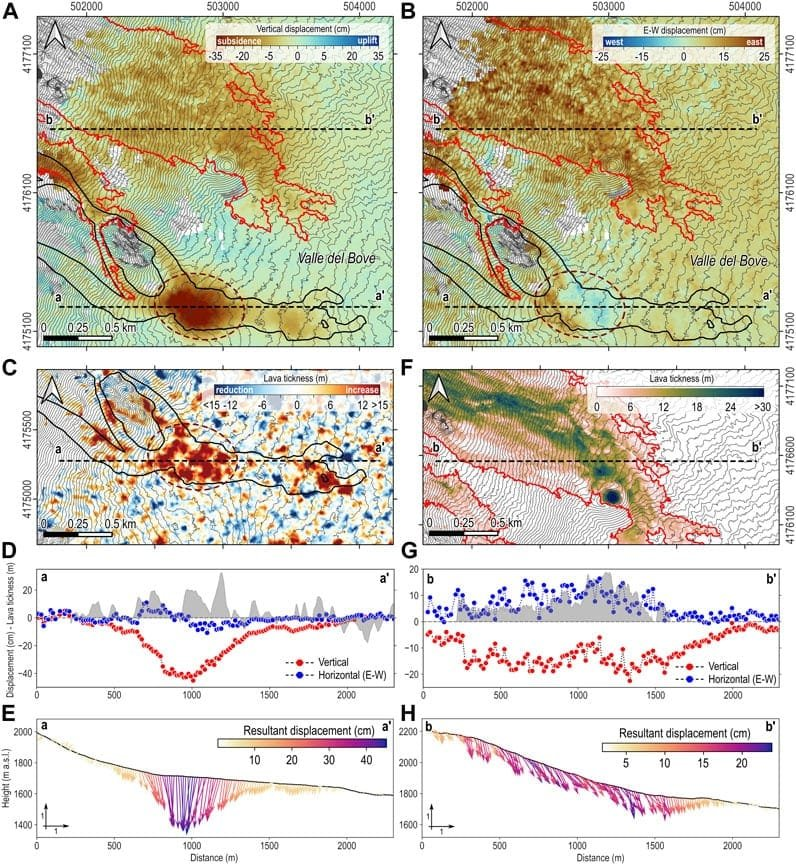

In the article "Analyzing Lava Flow Speeds: Insights and Findings," we explore the fascinating world of volcanoes and their explosive eruptions. Volcanoes, formed by the escape of molten rock and other materials from beneath the Earth's surface, can be found in various locations, from plate boundaries to hotspots and rift zones. We delve into the different types of volcanoes and their eruption patterns, highlighting the importance of understanding lava viscosity and gas content. Moreover, we examine the hazards and benefits associated with volcanic activity, emphasizing the need for predicting future eruptions and protecting communities at risk. Join us as we uncover the three best insights into lava flow speeds, providing a deeper understanding of these natural wonders and their impact on our planet. Analyzing Lava Flow Speeds: Insights and Findings

[Volcanoes are fascinating natural phenomena](https://magmamatters.com/the-art-and-science-of-volcano-monitoring/ "The Art and Science of Volcano Monitoring") that have captivated human interest for centuries. The flow of lava, a mixture of molten rock, gases, and debris from volcanic eruptions, is a cause for both awe and concern. The speed at which lava flows can greatly influence the consequences of an eruption, impacting the surrounding environment and communities. In this article, we will delve into the factors influencing lava flow speeds, explore methods of measuring these speeds, examine the historical analysis of lava flow speeds, discuss the relationship between volcano types and lava flow speeds, analyze lava flow speeds in different geographic locations, highlight the impact of lava flow speeds on human activity and disaster management, assess the role of lava flow speeds in ecosystem impacts, discuss future projects to understand lava flow speeds, and identify knowledge gaps and challenges in understanding this complex phenomenon.

This image is property of media.kauainownews.com.

## Factors Influencing Lava Flow Speeds

### The Role of Lava Viscosity

One of the key factors influencing lava flow speeds is its viscosity. Viscosity refers to the resistance of a substance to flow. Lava with high viscosity is thick and sticky, flowing slowly, while lava with low viscosity is thin and fluid, flowing rapidly. The composition of the lava plays a significant role in determining its viscosity. Lava high in silica content tends to have higher viscosity, resulting in slower flow speeds. On the other hand, lava with low silica content, such as basaltic lava, has lower viscosity and flows more quickly. Other factors that can influence lava viscosity include temperature, gas content, and crystal content.

### The Impact of Gas Content on Lava Speed

The gas content within lava also plays a crucial role in determining its flow speed. As magma rises to the surface, the decrease in pressure allows dissolved gases, such as water vapor, carbon dioxide, and sulfur dioxide, to escape. The presence of gases within the lava creates channels and bubbles, making it more buoyant and reducing its viscosity. This reduction in viscosity leads to faster flow speeds. Conversely, high gas content can also lead to explosive eruptions, as the pressure builds up within the magma, resulting in fragmented flows and reduced overall speed.

### Temperature as a Determinant of Lava Flow Speeds

Temperature is another critical factor that influences the speed at which lava flows. Higher temperatures correspond to lower viscosity, as the increased heat causes the lava to become more fluid. Therefore, hotter lava tends to flow more rapidly than cooler lava. It is important to note that the temperature of the lava can vary throughout the eruption, depending on factors such as distance from the volcanic vent and the duration of the eruption. Understanding the temperature variations can provide insights into the behavior and flow speeds of lava during an eruption.

### Slope Angle and Its Influence on Lava Flow

The slope angle of the terrain over which the lava flows significantly affects its speed. Lava flows tend to accelerate when moving down steeper slopes and decelerate when encountering flatter terrain. This relationship between slope angle and lava flow speed is influenced by gravity. As the gradient becomes steeper, the force of gravity pulls the lava downhill, increasing its velocity. Conversely, on flatter slopes, the force of gravity is less pronounced, resulting in slower flow speeds. The topography plays a crucial role in shaping the flow of lava and influencing its potential impact on surrounding areas.

## Methods of Measuring Lava Flow Speeds

Understanding the speed at which lava flows is essential for assessing its potential hazards and impacts. Various techniques and technologies have been developed to measure lava flow speeds. Some of the commonly used methods include time-lapse photography, thermal infrared imaging, the use of ultrasonic sensors, and laser scanning techniques.

### Time-Lapse Photography

Time-lapse photography involves capturing images of the advancing lava flow at regular intervals and then compiling them into a sequence. By analyzing the distance traveled by the lava within a specific time frame, researchers can estimate the flow speed. Time-lapse photography provides valuable visual evidence of the dynamic nature of lava flows and offers insights into the variations in flow speeds over time.

### Thermal Infrared Imaging

Thermal infrared imaging utilizes special cameras capable of detecting the heat emitted by the flowing lava. By measuring the temperature differences across the advancing flow, researchers can estimate the speed at which the lava is moving. Thermal infrared imaging provides a non-contact method of measuring lava flow speeds and can capture data from a safe distance.

### Use of Ultrasonic Sensors

Ultrasonic sensors offer a direct and precise method of measuring lava flow speeds. These sensors emit sound waves that bounce off the lava surface and return to the sensor. By analyzing the time it takes for the sound waves to travel to and from the lava, researchers can calculate the flow speed. Ultrasonic sensors can provide accurate real-time measurements and are often deployed in specially designed instruments or unmanned aerial vehicles (UAVs).

### Laser Scanning Techniques

Laser scanning techniques, such as Light Detection and Ranging (LiDAR), can also be used to measure lava flow speeds. LiDAR systems emit laser beams and measure the time it takes for the light to reflect back from the lava surface. By measuring the changes in distance over time, researchers can determine the flow speed. Laser scanning techniques offer high-resolution measurements and can provide detailed information about the topography and morphology of the advancing lava flow.

This image is property of www.frontiersin.org.

## Historical Analysis of Lava Flow Speeds

Studying the historical records of lava flow speeds can provide valuable insights into the behavior and impact of volcanic eruptions. By examining past events, researchers can identify the fastest recorded lava flows, the slowest recorded lava flows, and those with average speeds. Analyzing these historical data sets allows scientists to understand the range of possible velocities during different eruption scenarios and the factors that influenced them.

### Fastest Recorded Lava Flows

Throughout history, there have been several instances of exceptionally fast lava flows. One notable example is the eruption of Mount Nyiragongo in the Democratic Republic of Congo in 2002. The lava flows from this eruption reached speeds of up to 97 kilometers per hour (60 mph), making it one of the fastest recorded lava flows in recent times. The rapid flow speed of the lava posed significant challenges for evacuation efforts and resulted in widespread destruction.

### Slowest Recorded Lava Flows

On the other end of the spectrum, there have been instances of lava flows with exceptionally low speeds. These slow-moving flows often occur when the lava has high viscosity or when it encounters obstacles that hinder its movement. One example is the Mauna Loa eruption in Hawaii in 1984, where some lava flows advanced at speeds as low as 300 meters per day (0.18 mph). These sluggish flows allowed for more effective evacuation measures and minimized the immediate impact on surrounding communities.

### Lava Flows with Average Speeds

The majority of lava flows fall within the realm of average speeds, neither exceptionally fast nor slow. These flows can still pose significant risks and have substantial impacts on the surrounding areas. The average flow speeds vary depending on various factors, such as the volcano type, lava composition, and eruptive style. By analyzing the historical records, scientists have been able to determine the typical range of speeds associated with different types of eruptions and volcanoes.

### Impact of Lava Flow Speeds on Eruption Consequences

The speed at which lava flows greatly influences the consequences of volcanic eruptions. Faster flows have the potential to cover larger distances in a shorter period, increasing the affected area and the likelihood of destruction. Additionally, the high kinetic energy associated with fast flows can result in more significant impacts on structures, infrastructure, and the natural environment. Slower flows, while less destructive in their immediate impact, can still cause severe disruption to local communities and economies. Understanding the relationship between flow speed and eruption consequences is crucial for effective disaster management strategies and mitigation measures.

## Volcano Types and Lava Flow Speeds

Different types of volcanoes exhibit unique characteristics in terms of eruption patterns and lava flow speeds. The following sections will explore the relationship between volcano types and the speeds at which lava flows.

### Lava Flows in Shield Volcanoes

Shield volcanoes, characterized by their broad, gentle slopes, are often associated with relatively low-viscosity lava flows. These lava flows can be expansive and extend over long distances. Shield volcanoes, such as those in Hawaii, often experience effusive eruptions, where lava steadily flows out of the volcano's vent and cascades down the gentle slopes. The low-viscosity lava allows for relatively fast flow speeds, resulting in the gradual growth of these volcanoes over time.

### Lava Flows in Composite or Stratovolcanoes

Composite or stratovolcanoes, found in subduction zones, are known for their steep profiles and explosive eruptions. The lava associated with these volcanoes tends to have higher viscosity, resulting in slower flow speeds. During explosive eruptions, lava fragments and pyroclastic flows can cascade down the slopes, resulting in turbulent avalanches. However, during periods of effusive eruptions, the slower-moving lava allows for the building of volcanic domes and the formation of lava flows with more moderate speeds.

### Lava Flows in Cinder Cone Volcanoes

[Cinder cone](https://magmamatters.com/the-birth-of-new-land-understanding-cinder-cones/) volcanoes, characterized by their conical shape and steep slopes, exhibit a unique eruption pattern. These volcanoes often experience short-lived and relatively small-scale eruptions. The lava associated with cinder cone volcanoes tends to be both low in viscosity and gas content, resulting in relatively fast flow speeds. These lava flows can extend only a short distance from the volcanic vent before solidifying, creating the distinctive cone shape.

### Lava Flows in Lava Domes

Lava domes, also known as volcanic plugs or lava plugs, are formed when lava solidifies within the volcanic vent. These structures are often associated with explosive eruptions and can be found in various types of volcanoes. The lava within lava domes tends to have high viscosity, resulting in slow flow speeds. This slow movement of the lava creates bulbous or steep-sided formations within the volcanic crater. Lava domes can pose risks due to the buildup of pressure and the potential for collapse and explosive eruptions.

This image is property of pub.mdpi-res.com.

## Lava Flow Speeds in Different Geographic Locations

The speed at which lava flows can vary depending on the geographic location of the volcano. Different regions exhibit distinct geological and tectonic characteristics that influence the behavior of volcanic eruptions and, consequently, lava flow speeds. The following sections will explore lava flow speeds in specific geographic locations.

### Lava Flow Speeds along the 'Ring of Fire'

The 'Ring of Fire,' encircling the Pacific Ocean, is known for its high concentration of active volcanoes and frequent volcanic activity. The volcanoes within this region experience a wide range of eruption styles and associated flow speeds. For example, volcanic eruptions along the subduction zones of the 'Ring of Fire' often result in explosive eruptions with slower-moving lava flows. In contrast, volcanoes located along the mid-oceanic ridges within the 'Ring of Fire' tend to produce effusive eruptions with faster lava flows.

### Lava Flow Speeds in Hawaii's Hot Spots

Hawaii, located in the middle of the Pacific Ocean, is home to a unique volcanic hotspot that has given rise to a chain of shield volcanoes. These volcanoes, including Mauna Loa and Kilauea, are characterized by frequent eruptions and relatively fast lava flow speeds. The low-viscosity basaltic lava allows for the formation of broad and fluid lava flows, which can travel significant distances before cooling and solidifying. The study of lava flow speeds in Hawaii's hot spots has provided valuable insights into the behavior and impacts of volcanic eruptions.

### Lava Flow Speeds in Rift Zones

Rift zones, where tectonic plates are moving apart, are also hotspots for volcanic activity and can exhibit unique lava flow speeds. As the plates separate, magma rises to the surface, resulting in intermittent volcanic eruptions along the rift. The lava associated with these eruptions tends to have lower viscosity due to its lower silica content, allowing for faster flow speeds. However, the specific speed of the lava flows can vary depending on factors such as the composition of the magma and the topography of the rift zone.

### Comparison of Lava Flow Speeds in Various Locations

A comprehensive comparison of lava flow speeds in different geographic locations allows scientists to identify patterns and trends. By analyzing data from volcanoes around the world, researchers can gain a better understanding of the factors driving variations in flow speeds. This comparative analysis can contribute to the development of models and frameworks for predicting and managing volcanic hazards in diverse locations.

## Impact of Lava Flow Speeds on Human Activity

The speed at which lava flows can have significant impacts on human activity in volcanic areas. The following sections will explore how lava flow speeds can disrupt transport and infrastructure, influence evacuation measures and timeframes, affect the economy, and impact local geology and soil fertility.

### Disruption of Transport and Infrastructure

Lava flows can pose a significant threat to transport routes, roads, and infrastructure in the path of the advancing flow. Fast-moving lava can quickly engulf and destroy bridges, roads, and buildings, rendering them impassable or unusable. The disruption of transport and infrastructure can isolate communities, impede evacuation efforts, and hinder access to critical services and supplies.

### Evacuation Measures and Timeframes

The speed of lava flows plays a crucial role in determining evacuation measures and timeframes. When faced with rapidly approaching lava, the window of opportunity for safe evacuation becomes narrower, requiring swift and well-coordinated response and evacuation plans. Conversely, slower-moving lava flows may allow for more extended evacuation timeframes, enabling authorities to plan and execute evacuations more efficiently. Understanding lava flow speeds is essential for managing evacuation procedures effectively and ensuring the safety of affected communities.

### Impact on the Economy

Volcanic eruptions and the associated lava flows can have a profound impact on local economies. The destruction of infrastructure, including tourist facilities and industries, can cripple economies that heavily rely on tourism revenue. Furthermore, the displacement of communities and the loss of productive agricultural land can result in long-term economic setbacks. Analyzing lava flow speeds allows policymakers and planners to assess the potential economic impacts of eruptions, develop strategies for recovery, and implement measures to mitigate economic losses.

### Influence on Local Geology and Soil Fertility

Lava flows can significantly impact the local geology and soil fertility of affected areas. The deposition of lava creates new landforms and alters existing topography, shaping the physical landscape. The lava itself can act as a source of potential new soil, as it weathers and breaks down over time. However, the impact of lava flow speeds on soil fertility depends on various factors, such as the composition of the lava, the duration of the eruption, and the pre-existing soil conditions. Understanding these influences is crucial for determining the long-term viability of agricultural practices and land use in volcanic regions.

This image is property of www.mdpi.com.

## Role of Lava Flow Speeds in Disaster Management

Lava flow speeds play a vital role in disaster management efforts, contributing to various aspects of mitigating volcanic hazards. The sections below will explore the prediction of eruption patterns based on lava flow speeds, evacuation strategies informed by lava flow speeds, post-eruption recovery efforts, and the development of mitigation strategies.

### Prediction of Eruption Patterns Based on Lava Flow Speeds

Analyzing lava flow speeds can provide valuable insights into the behavior and patterns of volcanic eruptions. By determining the speed at which lava flows during specific eruption scenarios, scientists can develop models and predictions regarding the potential extent and impacts of future eruptions. These predictions can aid in disaster preparedness, allowing authorities to allocate resources and plan evacuation measures in anticipation of volcanic activity.

### Evacuation Strategies Informed by Lava Flow Speeds

Understanding the speeds at which lava flows can greatly inform evacuation strategies in volcanic areas. By incorporating data on previous lava flow speeds, authorities can determine evacuation zones, plan evacuation routes, and estimate the required evacuation timeframes. The information derived from the study of lava flow speeds enables policymakers and emergency responders to make informed decisions and issue timely and effective evacuation orders, thus minimizing the potential risks to human life.

### Post-Eruption Recovery and Lava Flow Speeds

After a volcanic eruption, communities and ecosystems affected by lava flows must undergo a process of recovery. The speed at which the lava flows can influence the extent and duration of recovery efforts. Fast-moving flows may result in more extensive destruction and more prolonged recovery periods, requiring targeted interventions and support for affected communities. Slower flows, while causing less immediate damage, can still require significant resources and time to restore infrastructure, habitats, and services.

### Mitigation Strategies and Lava Flow Speeds

Developing effective mitigation strategies for volcanic hazards relies on a comprehensive understanding of lava flow speeds. By considering the potential impacts of different flow speeds, authorities can implement measures to minimize the exposure of vulnerable areas and populations. These mitigation strategies may include land-use planning, the establishment of buffer zones, the construction of protective barriers, and the development of early warning systems. The analysis of lava flow speeds provides a crucial foundation for developing informed and targeted mitigation measures.

## Lava Flow Speeds and Ecosystem Impacts

Lava flows can have profound and long-lasting impacts on ecosystems. The flow speed of lava plays a critical role in determining the effects on local fauna and flora, the long-term changes to ecosystems, the recovery of biodiversity post-lava flows, and the impact on aquatic ecosystems.

### Effects on Local Fauna and Flora

The rapid and destructive nature of fast-moving lava flows can result in the immediate loss of habitat and the displacement or death of local fauna. The intense heat and toxic gases associated with lava flows can have devastating effects on plant and animal life. However, slower-moving lava flows may allow for some degree of survival and the regeneration of vegetation over time. Assessing the flow speed of lava is essential for understanding the immediate and long-term impacts on local ecosystems and developing conservation strategies.

### Long-Term Ecosystem Changes due to Lava Flows

Lava flows have the potential to create significant changes in ecosystems over the long term. The deposition of new landforms and the alteration of topography reshape the physical landscape, influencing the distribution of habitats and species. The introduction of new soils and minerals through volcanic activity can impact nutrient cycling and soil fertility, ultimately affecting plant growth and ecosystem dynamics. Studying the flow speeds of lava is crucial for understanding the long-term ecological consequences and assessing the potential for ecosystem recovery and adaptation.

### Recovery of Biodiversity Post-Lava Flows

The recovery of biodiversity in areas affected by lava flows depends on various factors, including the flow speed of the lava. Fast-moving lava flows can result in significant habitat destruction, potentially leading to extinctions or local extirpation of species. However, volcanic eruptions and the resulting lava flows can also create new habitats, fostering the colonization of pioneering species. The study of lava flow speeds allows scientists to assess the potential for biodiversity recovery, identify areas for targeted habitat restoration, and monitor the success of recovery efforts over time.

### Lava Flow Impact on Aquatic Ecosystems

Lava flows can have significant impacts on aquatic ecosystems, particularly in volcanic island settings and coastal regions. Fast-moving lava flows entering the ocean can cause explosive interactions, resulting in the generation of steam, gas bubbles, and the fragmentation of lava into volcanic glass shards. These interactions can severely impact marine organisms, leading to high mortality rates and the alteration of local marine ecosystems. Lava flow speeds are crucial in determining the potential extent and duration of these impacts on aquatic ecosystems, providing essential information for the management and conservation of marine biodiversity.

This image is property of media.springernature.com.

## Future Projects to Understand Lava Flow Speeds

As our knowledge and understanding of lava flow speeds continue to evolve, ongoing and future research projects aim to uncover new insights and findings. The following sections will explore emerging technologies for lava flow speed measurement, the impact of climate change on lava flow, innovative approaches to studying lava flows, and ongoing and planned lava flow studies.

### Emerging Technologies for Lava Flow Speed Measurement

Advancements in technology present exciting opportunities for improving the measurement of lava flow speeds. Researchers are exploring the use of unmanned aerial vehicles (UAVs) equipped with advanced sensors and imaging systems to collect real-time data on lava flows. Additionally, remote sensing techniques, such as satellite imagery and aerial surveys, can provide valuable information about lava flow dynamics on a larger scale. These emerging technologies hold great promise for enhancing our understanding of lava flow speeds and the associated volcanic hazards.

### Understanding the Impact of Climate Change on Lava Flow

Climate change is expected to have wide-ranging effects on Earth's natural systems, including volcanic activity and lava flow speeds. Rising global temperatures and changing precipitation patterns can influence the behavior and characteristics of volcanic eruptions. Research projects are dedicated to understanding how climate change may alter lava composition, viscosity, and gas content, ultimately affecting flow speeds. By examining the relationship between climate change and lava flow speeds, scientists can improve predictions and models for future volcanic activity.

### Innovative Approaches to Study Lava Flows

In addition to technological advancements, researchers are also exploring innovative approaches to studying lava flows. This includes the use of scale models and experimental simulations to recreate the behavior of lava in controlled settings. Through these experiments, scientists can gain insights into the fundamental principles governing lava flow speeds and test theoretical models. These innovative approaches complement field observations and provide a deeper understanding of the complex dynamics of lava flows.

### Ongoing and Planned Lava Flow Studies

Numerous ongoing and planned research projects aim to further our understanding of lava flow speeds and their implications. Field expeditions to active volcanic sites, including those in Hawaii, the 'Ring of Fire,' and other volcanic regions, collect data on real-time eruptions and lava flows. Laboratory experiments and numerical modeling studies simulate different eruption scenarios and lava flow speeds, providing valuable insights into the underlying processes. The collaboration between volcanologists, geologists, remote sensing specialists, and other experts in the field ensures a multidisciplinary approach to studying lava flow speeds and advancing our understanding of this intricate phenomenon.

## Knowledge Gaps and Challenges in Understanding Lava Flow Speeds

Despite significant advancements in volcano monitoring and research, there remain several knowledge gaps and challenges in understanding lava flow speeds. Addressing these gaps is crucial for improving our ability to predict volcanic hazards and mitigate risks. The following sections will explore inaccessible areas and data collection challenges, the shortcomings of current measurement techniques, the lack of historical data and comparisons, and predicting future changes in lava flow speeds.

### Inaccessible Areas and Data Collection Challenges

The nature of volcanic eruptions and lava flows often creates challenges in accessing and collecting data from affected areas. Active volcanic sites can be hazardous and pose risks to researchers, limiting the collection of real-time measurements. Additionally, the rapid changes in lava flow behavior and the unpredictable nature of volcanic eruptions make it challenging to gather comprehensive and accurate data. Developing innovative methods and instruments that can overcome these challenges is essential for improving our understanding of lava flow speeds.

### Shortcomings of Current Measurement Techniques

While various measurement techniques exist, there are still limitations and shortcomings in accurately and precisely measuring lava flow speeds. Each method has its own constraints, such as the need for proximity to the lava flow, the distortion caused by the environment, or the inability to capture real-time data. Researchers are continually refining existing techniques and developing new methodologies to overcome these limitations and enhance the accuracy and reliability of lava flow speed measurements.

### Lack of Historical Data and Comparisons

The availability of historical data on lava flow speeds is often limited, particularly for regions with infrequent volcanic activity. This lack of data makes it challenging to establish comprehensive benchmarks and comparisons for future eruptions. Obtaining historical data from well-documented eruptions and conducting detailed analyses can help fill these knowledge gaps. Collaborative efforts between volcanic observatories, research institutions, and archival organizations play a critical role in ensuring the preservation and accessibility of historical volcanic data.

### Predicting Future Changes in Lava Flow Speeds

Predicting future changes in lava flow speeds is a complex task, as it requires understanding the intricate and interconnected dynamics of volcanic systems. The impact of climate change, evolving geological conditions, and other factors make it challenging to anticipate the behavior of future eruptions. Improving our predictive capabilities involves developing sophisticated models and linking them with real-time monitoring data. By combining laboratory experiments, numerical simulations, and field observations, scientists can strive to improve our understanding of lava flow speeds and enhance our ability to forecast volcanic hazards.

In conclusion, the study of lava flow speeds encompasses a multidisciplinary field of research that spans geology, volcanology, remote sensing, and environmental science. By examining the factors influencing lava flow speeds, employing various measurement techniques, analyzing historical records, understanding volcano types, and assessing the impacts on human activity, disaster management, ecosystems, and other aspects, scientists aim to unravel the complexities of this natural phenomenon. Ongoing research projects, technological innovations, and collaborative efforts are continuously expanding our knowledge and providing valuable insights into lava flow speeds. With this growing understanding, we can improve our ability to predict volcanic hazards, inform mitigation strategies, and protect vulnerable communities and ecosystems.

