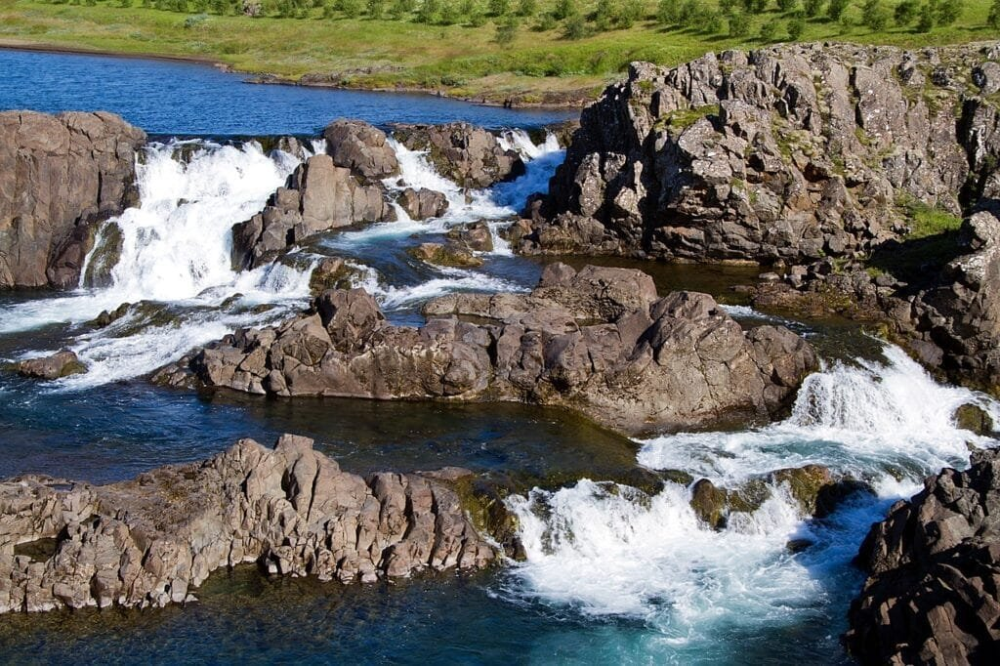

In the vastness of the Solar System, volcanoes are not exclusive to Earth. They can also be found on other celestial bodies such as Mars, Jupiter's moon Io, and even Saturn's moon Enceladus. These extraterrestrial volcanoes emit gases into their respective atmospheres, which have a significant impact on their surrounding environments. By analyzing the effects of volcanic gases on the Solar System, scientists strive to gain a deeper understanding of these cosmic phenomena and their role in shaping the landscapes of other planets and moons. Join us on this captivating journey as we explore the fascinating world of volcanoes beyond Earth.

This image is property of pixabay.com.

## Understanding Volcanic Gases on Earth

[Volcanic gases](https://magmamatters.com/the-art-and-science-of-volcano-monitoring/ "The Art and Science of Volcano Monitoring") are an important aspect of volcanic emissions and play a crucial role in volcanology. By recognizing the main constituents of these gases, scientists can gain valuable insights into volcanic activity and its potential impact. The main gas constituents of volcanic emissions include water vapor (H2O), carbon dioxide (CO2), sulfur dioxide (SO2), hydrogen sulfide (H2S), and various other gases. These gases are released during volcanic eruptions, with their compositions varying depending on factors such as the type of volcano and the depth of the magma chamber.

Gas measurements in volcanology are of utmost significance as they provide valuable information about the eruptive processes and the behavior of volcanoes. By monitoring the gas emissions, scientists can gain insights into the dynamics of volcanic activity, predict eruptions, and assess potential hazards. Gas measurements help in understanding the underlying processes, such as magma degassing and the release of volatile compounds. They also aid in assessing the impact of volcanic emissions on the environment and human health.

The consequences of varying gas compositions in volcanic emissions can be far-reaching. Different gases have different effects on the environment, weather patterns, and climate. For example, [carbon dioxide](https://magmamatters.com/geothermal-energy-and-its-volcanic-origins/ "Geothermal Energy and Its Volcanic Origins") is a potent greenhouse gas that contributes to global warming and climate change. Sulfur dioxide, on the other hand, can lead to the formation of sulfuric acid aerosols, which have a cooling effect on the atmosphere. Understanding the varying gas compositions and their consequences is crucial for assessing the overall impact of volcanic eruptions on Earth's climate and environment.

## Volcanic Gases and Climate Change on Earth

The impact of volcanic emissions on global temperatures and weather patterns is a topic of great interest in climate science. Volcanic eruptions can release large quantities of carbon dioxide and other greenhouse gases into the atmosphere. These gases trap heat from the sun, leading to an increase in global temperatures. The release of volcanic aerosols and ash can also have a cooling effect on the atmosphere by reflecting sunlight back into space.

The relationship between volcanic eruptions and the greenhouse effect is complex. While volcanic emissions contribute to the increase in greenhouse gases, they also have short-term cooling effects due to the release of aerosols. The cooling effect is often temporary, and the long-term implications of volcanic emissions on climate change need to be studied further.

High-scale volcanic eruptions can have profound effects on long-term weather patterns. The release of large quantities of gases and ash into the atmosphere can disrupt the global climate system, leading to changes in precipitation patterns and atmospheric circulation. Volcanic eruptions have been linked to periods of prolonged cooling, known as volcanic winters, which can have significant impacts on agriculture and human societies. Understanding these weather implications is vital for predicting the potential effects of future volcanic eruptions on Earth's climate.

<iframe width="560" height="315" src="https://www.youtube.com/embed/XS5Zm1TPa10" frameborder="0" allow="accelerometer; autoplay; encrypted-media; gyroscope; picture-in-picture" allowfullscreen></iframe>

  

## Volcanic Activity on Terrestrial Planets

While we have primarily focused on volcanism on Earth, it is fascinating to explore volcanic activity on other planets in our solar system. Mars, for example, exhibits signs of both current and ancient volcanic activities. Volcanic features such as shield volcanoes, volcanic plains, and lava flows indicate a history of volcanic eruptions on the red planet. By studying volcanic activity on Mars, scientists can gain insights into the planet's geological evolution and its potential for supporting life.

Venus, another terrestrial planet, also shows evidence of ancient volcanic activities. The planet's surface is covered in vast volcanic plains, suggesting a history of extensive volcanic eruptions. These volcanic activities have shaped Venus' surface and contributed to its extreme atmospheric conditions. Studying the evidence of ancient volcanic activities on Venus can provide valuable information about the planet's past and its potential for harboring life.

Mercury, the closest planet to the Sun, exhibits tectonic activity that is closely related to its volcanic history. The planet's surface is marked by numerous cliffs and scarps, indicating the contraction and deformation caused by volcanic activity. By understanding the tectonic activity on Mercury, scientists can gain insights into the planet's geological processes and its volcanic history.

## Volcanic Activity on Jovian Moons

Volcanic activity is not limited to terrestrial planets; it is also observed on several moons of Jupiter. Io, one of Jupiter's largest moons, is known for its extensive volcanic activity. The moon's volcanic plumes spew forth sulfur compounds, creating an eerie landscape of colorful eruptions. Studying the significance of volcanic plumes on Io can provide insights into the dynamics of volcanic activity in extreme environments.

Cryovolcanism, or the eruption of volatile compounds such as water and ammonia, is observed on moons like Enceladus and Europa. These icy moons of Jupiter harbor subsurface oceans, which interact with the moon's interior and lead to the eruption of cryovolcanoes. By studying cryovolcanism on these moons, scientists can gain insights into the potential for habitable environments and the search for extraterrestrial life.

This image is property of pixabay.com.

## Potential Effect of Extraplanetary Volcanic Gases on their Atmospheres

The exploration of other planets and moons within our solar system has revealed the potential effects of volcanic gases on their atmospheres. Mars, for instance, has a tenuous atmosphere comprising mainly carbon dioxide. The release of volcanic gases on Mars can contribute to changes in atmospheric composition and climate. By exploring the potential climate implications of volcanic gases on Mars, we can gain a better understanding of its past and present environmental conditions.

Venus, with its thick atmosphere and extreme greenhouse effect, experiences drastic atmospheric changes induced by volcanic activities. The release of sulfur dioxide from volcanic eruptions can react with other compounds in the atmosphere, leading to the formation of sulfuric acid clouds. These clouds can significantly influence the planet's climate and atmospheric dynamics. Examining the atmospheric changes on Venus induced by volcanic activities can provide valuable insights into the planet's complex climate system.

Jovian moons, such as Io, Enceladus, and Europa, also experience the effects of volcanic gases on their atmospheres. Cryovolcanism on these moons releases volatile substances into their thin atmospheres and contributes to the complex interactions between the surface, subsurface, and atmosphere. Studying the potential weather implications of cryovolcanism on Jovian moons can provide insights into the unique environments of these celestial bodies.

## Detecting Volcanic Gases in the Solar System

Detecting volcanic gases in the solar system is a challenging task that requires sophisticated instruments and spacecraft missions. Current spacecraft missions, such as those by NASA and other space agencies, are equipped with specialized sensors to measure the composition of gases on other planets and moons. These missions provide valuable data on the presence and distribution of volcanic gases in the solar system.

Despite the advancements in space exploration, remote sensing of volcanic gases remains a challenge. The vast distances and inhospitable environments make it difficult to obtain accurate measurements. However, advancements in technology, such as more sensitive and compact instruments, are paving the way for improved gas detection capabilities. Future missions to other planets and moons will further enhance our understanding of volcanic gases in the solar system.

Spectroscopy plays a crucial role in detecting and analyzing extraterrestrial volcanic gases. By analyzing the interaction of light with gases, scientists can identify specific gas compositions and measure their abundance. Spectroscopic techniques are widely used in planetary science to study the atmospheres of other celestial bodies. The significance of spectroscopy in detecting extraterrestrial volcanic gases cannot be overstated, as it provides valuable insights into the composition and dynamics of planetary atmospheres.

This image is property of pixabay.com.

## Implications of Volcanic Activities for Planetary Evolution

Volcanic gases play a vital role in the evolution of planetary atmospheres. The release of gases during volcanic eruptions can significantly impact the composition and structure of a planet's atmosphere. Volcanic gases, such as water vapor, carbon dioxide, and sulfur dioxide, can interact with the planetary surface and contribute to atmospheric evolution.

Volcanism also influences the surface and landscape formations of planets. Lava flows, ash deposits, and other volcanic features shape the topography of a celestial body. The constant eruption and deposition of volcanic materials can lead to the formation of mountains, valleys, and other geological formations. By understanding the influence of volcanism on planetary surface and landscape formations, scientists can gain insights into the geological processes shaping a planet.

The relationship between volcanism and the potential formation of extraterrestrial life is also an area of active research. Volcanic gases can contribute to the availability of essential elements and compounds necessary for life. Volcanic activity can also create environments conducive to the emergence and sustainment of life. By studying the relationships between volcanism and potential extraterrestrial life formation, scientists can further our understanding of the conditions required for life beyond Earth.

## Model Predictions of Solar System Volcanic Gas Impact

Model predictions are valuable tools for understanding the impact of volcanic gases on the solar system. Gas-driven climate changes can have significant implications for the habitability of planets and moons. By simulating the release, dispersion, and interaction of volcanic gases in planetary atmospheres, scientists can predict the potential effects of these gases on climate and environment.

Current lava flow and ash dispersal models provide valuable insights into the behavior and impact of volcanic eruptions. These models take into account various factors such as volcano morphology, eruption style, and atmospheric conditions to simulate the spread of lava and ash. By interpreting gas emission rates and their potential effects on planetary atmospheres, scientists can refine these models and improve our ability to predict the impacts of volcanic activity.

Differentiating the effects of terrestrial and extraplanetary volcanic gases is essential for understanding the unique characteristics of each environment. Variations in volcanic gas compositions can arise due to different geological processes and compositions of planetary surfaces. Additionally, the gravitational field strengths of celestial bodies can affect the behavior and distribution of volcanic gases. By reflecting on these variations, scientists can gain insights into the diverse effects of volcanic gases on terrestrial and extraterrestrial atmospheres.

## Knowledge Gaps and Future Research Directions

While significant progress has been made in understanding volcanic gases in the solar system, there are still many unanswered questions. Identifying the most important knowledge gaps is crucial for guiding future research efforts.

Forecasting potential advances in technology that could aid research is another essential aspect. Technological advancements in space exploration, remote sensing, and analytical techniques can revolutionize our understanding of volcanic gases. By staying informed about the latest developments, scientists can leverage new tools and techniques to enhance their research capabilities.

The implications of upcoming or proposed missions for the understanding of Solar System volcanism are also worth discussing. Space agencies around the world are planning and executing missions to various celestial bodies. These missions aim to gather more data on volcanic gases and their effects, thereby filling critical gaps in our knowledge. By considering the implications of these missions, scientists can anticipate new insights and discoveries that will shape our understanding of volcanic activity in the solar system.

In conclusion, understanding volcanic gases is crucial for comprehending the complex dynamics of volcanic activity on Earth and other celestial bodies. By recognizing the main gas constituents, studying their significance, and assessing the consequences of varying gas compositions, scientists can gain valuable insights into volcanism and its impact. Exploring the effects of [volcanic gases on climate change](https://magmamatters.com/understanding-volcanic-formation-a-comprehensive-guide/ "Understanding Volcanic Formation: A Comprehensive Guide"), extraplanetary atmospheres, model predictions, and knowledge gaps can open doors to further discoveries and advancements in the field of volcanology.

