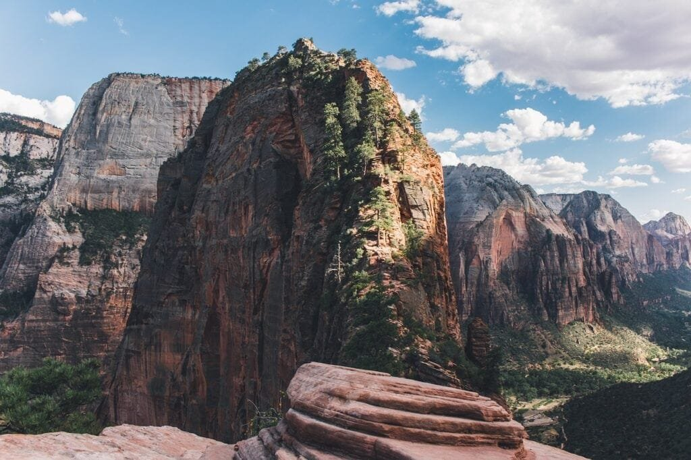
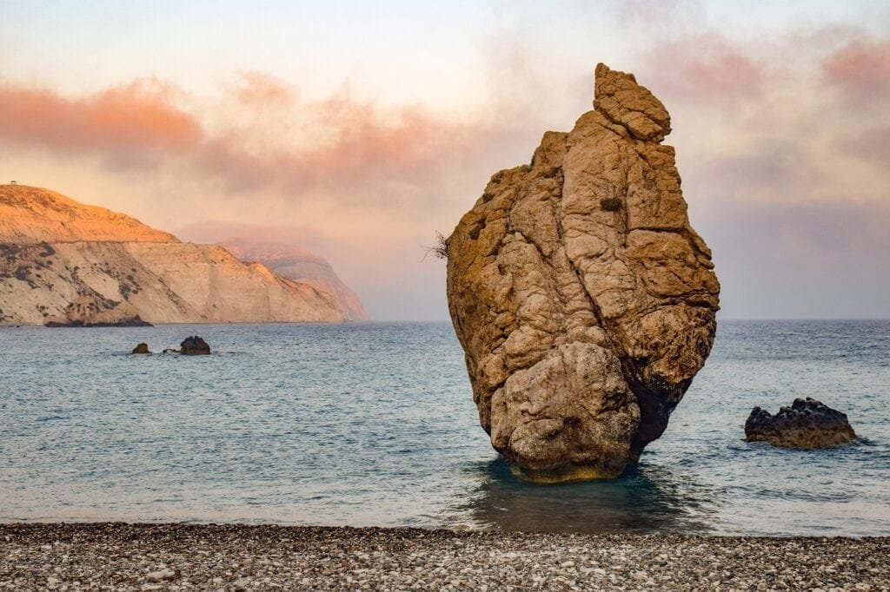

In the article "Analyzing the Geological Formation of Volcanoes," you will explore the fascinating world of volcanoes and gain a deeper understanding of how these awe-inspiring natural formations are created. Volcanoes are not just the dramatic explosions we often envision; they are a result of molten rock, gases, and debris breaking free from beneath the earth's surface, causing eruptions of lava and ash. By examining the various factors that contribute to their formation, such as plate boundaries, hotspots, and rift zones, we can better comprehend the diverse types of volcanoes and their eruption patterns. Additionally, we will delve into the benefits and hazards that volcanoes bring, which play a crucial role in predicting and mitigating the risks associated with these majestic yet potentially destructive forces of nature.

<iframe width="560" height="315" src="https://www.youtube.com/embed/Fq8NtkPOzfA" frameborder="0" allow="accelerometer; autoplay; encrypted-media; gyroscope; picture-in-picture" allowfullscreen></iframe>

  

## Understanding the Geological Composition of Volcanoes

Volcanoes are geological formations that are formed when molten rock, gases, and debris escape to the Earth's surface, resulting in eruptions of lava and ash. To better understand these fascinating [natural phenomena](https://magmamatters.com/the-art-and-science-of-volcano-monitoring/ "The Art and Science of Volcano Monitoring"), it is important to explore their geological composition.

### The primary components of volcanoes

Volcanoes are primarily composed of three main components: magma chamber, conduit, and vent. The magma chamber is a reservoir beneath the volcano's surface where molten rock, known as magma, accumulates. As pressure builds up within the magma chamber, the magma travels through a conduit, a narrow vertical tube-like structure, towards the surface. Finally, the magma reaches the vent, a opening on the volcano's surface, through which the magma is released during an eruption.

In addition to these primary components, volcanoes also contain various types of rock formations, such as lava flows, pyroclastic deposits (consisting of volcanic ash, cinders, and bombs), and volcanic gases.

### How the geological composition affects volcano behavior

The geological composition of a volcano plays a crucial role in determining its behavior during an eruption. The characteristics of the magma, including its viscosity and gas content, heavily influence the explosiveness and style of the eruption.

Magma viscosity refers to the resistance of the magma to flow. Magma with high viscosity is thick and sticky, making it difficult for gases to escape. This type of magma is associated with explosive eruptions, as the trapped gases build up pressure until a violent release occurs. On the other hand, magma with low viscosity flows more freely, allowing gases to escape more easily. This results in less explosive eruptions, characterized by effusive lava flows.

The gas content of magma also affects volcanic behavior. Volcanic gases, such as water vapor, carbon dioxide, sulfur dioxide, and hydrogen sulfide, are dissolved in the magma at high pressures. As the magma rises to the surface and pressure decreases, these dissolved gases begin to separate, forming bubbles. The expansion of these gas bubbles during an eruption can contribute to explosive eruptions.

Understanding the [geological composition of volcanoes](https://magmamatters.com/geothermal-energy-and-its-volcanic-origins/ "Geothermal Energy and Its Volcanic Origins") and how it influences eruption behavior is crucial for predicting and mitigating the potential risks associated with volcanic activity.

## Tectonic Plate Interaction and the Formation of Volcanoes

The formation of volcanoes is closely linked to the interaction of tectonic plates, which are large, rigid sections of the Earth's lithosphere that fit together like a jigsaw puzzle.

### Convective movement of tectonic plates

Tectonic plates are in constant motion due to the convective forces within the Earth's mantle. The heat generated by radioactive decay in the Earth's core creates convection currents, causing the molten rock in the mantle to rise and sink. This movement of the mantle material drives the motion of tectonic plates at the surface.

### Role of plate boundaries in volcano formation

Volcanoes are often formed at plate boundaries, where tectonic plates interact with each other in different ways. The three main types of plate boundaries are divergent boundaries, convergent boundaries, and transform boundaries.

Divergent boundaries occur when two tectonic plates move apart, creating a gap. Magma from the mantle rises to fill this gap, leading to the formation of new crust and volcanic activity. Mid-ocean ridges, such as the Mid-Atlantic Ridge, are examples of divergent boundaries where new crust is continuously being formed.

Convergent boundaries occur when two tectonic plates collide. In this case, one plate is usually forced beneath the other in a process known as subduction. As the subducted plate sinks into the mantle, it undergoes partial melting, leading to the formation of magma that rises to the surface and causes volcanic eruptions. The Pacific Ring of Fire, a region encircling the Pacific Ocean, is a prime example of convergent boundaries with numerous volcanic activities.

Transform boundaries occur when two tectonic plates slide past each other horizontally. Although most transform boundaries do not exhibit significant volcanic activity, there are some instances where fracturing and shearing of the plates can create fissures in the Earth's crust, allowing magma to escape and form volcanoes.

### Specific examples of volcanoes formed by tectonic interactions

The formation of volcanoes through tectonic plate interactions can be observed in many parts of the world. For example, the Cascade Range in the western United States is a result of the subduction of the Juan de Fuca Plate beneath the North American Plate. This subduction has led to the formation of iconic volcanoes such as Mount St. Helens and Mount Rainier.

Another notable example is the East African Rift, where the African Plate is slowly splitting apart, creating a divergent boundary. Volcanoes such as Mount Kilimanjaro and Mount Nyiragongo are a consequence of this tectonic activity.

Understanding the role of tectonic plate interactions in volcano formation provides valuable insights into the distribution and behavior of volcanoes around the world.

This image is property of pixabay.com.

## Hotspots: A Unique Phenomenon in Volcano Formation

In addition to volcanoes formed through tectonic plate interactions, there is another intriguing phenomenon known as hotspots. Hotspots are unique geological features that give rise to volcanic activity.

### Definition and explanation of hotspots

Hotspots are areas of intense volcanic activity that are not associated with plate boundaries. They are believed to be caused by plumes of extremely hot mantle material, known as mantle plumes, rising from deep within the Earth's mantle. As the mantle plume ascends, it can melt the overlying lithosphere, resulting in the formation of volcanoes.

Hotspots are so named because they are stationary, unlike tectonic plate boundaries which are in constant motion. This stationary position allows the formation of volcanic chains, where successive volcanic eruptions occur over long periods of time.

### Examples of hotspot volcanoes and their characteristics

One of the most famous examples of hotspot volcanism is the Hawaiian Islands. The Hawaiian hotspot is responsible for the formation of a chain of volcanic islands, including the Big Island of Hawaii, Maui, Oahu, and Kauai. These islands were formed as the Pacific Plate moved over the hotspot, creating a series of volcanic eruptions over millions of years.

Hotspot volcanoes, such as those in Hawaii, are characterized by shield volcanoes. Shield volcanoes have a broad, gently sloping shape resembling a warrior's shield. They are the result of low-viscosity, basaltic lava flows that spread out over large areas, creating wide and shallow slopes.

### The difference between hotspot volcanoes and those formed at plate boundaries

While both hotspot volcanoes and those formed at plate boundaries result in volcanic eruptions, there are distinct differences between the two.

Volcanoes formed at plate boundaries, such as those in the Pacific Ring of Fire, are often associated with explosive eruptions due to the subduction of one tectonic plate beneath another. These eruptions can be highly destructive and result in the formation of stratovolcanoes, which are characterized by steep sides and a cone-like shape. Stratovolcanoes are built up by alternating layers of lava flows, pyroclastic deposits, and volcanic ash.

Hotspot volcanoes, on the other hand, are typically characterized by effusive eruptions with low explosivity. The volcanic activity at hotspots is often more continuous and less violent compared to the eruptions at plate boundaries. This results in the formation of shield volcanoes, which have a distinct shape and erupt basaltic lava that flows easily.

Understanding the difference between hotspot volcanoes and those formed at plate boundaries provides further insights into the diverse nature of volcanic phenomena.

## Classification of Volcanoes by Shape and Size

Volcanoes come in various shapes and sizes, each with its own distinct characteristics. By classifying volcanoes based on their shape and size, scientists can gain a deeper understanding of their physical properties and eruption styles.

### The four main types of volcanoes: shield, stratovolcano, cinder cone, and lava dome

There are four main types of volcanoes: shield volcanoes, stratovolcanoes, [cinder cones](https://magmamatters.com/the-birth-of-new-land-understanding-cinder-cones/), and lava domes.

[Shield volcanoes are the largest type of](https://magmamatters.com/understanding-volcanic-formation-a-comprehensive-guide/ "Understanding Volcanic Formation: A Comprehensive Guide") volcano and have a broad, gently sloping shape resembling a warrior's shield. They are primarily formed by the eruption of low-viscosity basaltic lava flows that spread out over large areas. Shield volcanoes, such as Mauna Loa in Hawaii, have a relatively calm eruption style characterized by effusive lava flows.

Stratovolcanoes, also known as composite volcanoes, are tall and conical in shape with steep sides. They are primarily composed of alternating layers of solidified lava flows, pyroclastic deposits, and volcanic ash. Stratovolcanoes are associated with explosive eruptions due to the high viscosity of their magma, which traps gases until a violent release occurs. Mount Fuji in Japan and Mount St. Helens in the United States are examples of stratovolcanoes.

Cinder cones are the simplest and smallest type of volcano. They form from the eruption of gas-rich lava fragments called cinders. Cinder cones have a steep and conical shape, and their eruptions are generally not as explosive as those of stratovolcanoes. Paricutin in Mexico is a famous example of a cinder cone volcano.

Lava domes are formed by the extrusion of highly viscous lava that does not flow easily. They have a rounded and bulbous shape, resembling a dome. Lava domes are associated with relatively slow and continuous eruptions, and they often form within the craters or on the flanks of other volcanoes. The Soufriere Hills volcano in Montserrat is an example of a lava dome volcano.

### Physical characteristics and eruption styles of each type

Each type of volcano has its own distinct physical characteristics and eruption styles.

Shield volcanoes, as mentioned earlier, have a broad and gently sloping shape. Their eruptions are generally non-explosive and characterized by the effusion of low-viscosity basaltic lava flows. The continuous eruption of magma from shield volcanoes results in the gradual growth of the volcano over time.

Stratovolcanoes, with their tall and conical shape, are associated with more explosive eruptions. The magma in stratovolcanoes is highly viscous, trapping gases and leading to violent eruptions. These eruptions often produce pyroclastic flows, which are extremely hot and fast-moving mixtures of volcanic ash, rocks, and gases.

Cinder cones are small, conical volcanoes that form from the explosive eruption of gas-rich lava fragments. The eruptions of cinder cones are generally less explosive compared to stratovolcanoes, and the resulting cinder cone volcanoes are often characterized by the accumulation of loose cinder deposits.

Lava domes, with their rounded and bulbous shape, are formed by the extrusion of highly viscous lava. The eruptions of lava domes are relatively slow and continuous, with the lava piling up and solidifying over time. Lava domes can sometimes lead to explosive eruptions if pressure builds up within the dome.

### Geographic distribution of different volcano types

Different types of volcanoes are distributed unevenly around the world, often associated with specific tectonic settings.

Shield volcanoes, characterized by effusive eruptions of basaltic lava, are typically found in areas with hotspot activity. The Hawaiian Islands, as mentioned earlier, are a prime example of a chain of shield volcanoes formed over a hotspot. Other examples include the Galapagos Islands and the Iceland hotspot.

Stratovolcanoes, with their explosive eruptions, are often found in subduction zones, where one tectonic plate is forced beneath another. The Pacific Ring of Fire is a region known for its abundance of stratovolcanoes, including Mount Rainier, Mount Fuji, and the Philippines' Mount Mayon.

Cinder cones can be found in various tectonic settings, but they are most commonly associated with rift zones and areas of frequent volcanic activity. The Paricutin volcano in Mexico, which formed as a result of a new vent opening during the 1940s, is a well-known example of a cinder cone volcano.

Lava domes are typically found in the vicinity of other volcanoes, either within their craters or on their flanks. They often form as the result of the slow extrusion of viscous lava from the volcano. The Soufriere Hills volcano in Montserrat, which has been erupting since 1995, is a prominent example of a lava dome volcano.

Understanding the classification and geographic distribution of different volcano types provides valuable insights into their formation and behavior.

This image is property of pixabay.com.

## Diving Deeper into Lava Viscosity and Gas Content

Lava viscosity and gas content are two important factors that greatly influence volcanic eruptions and the behavior of volcanoes.

### The science behind lava viscosity

Lava viscosity refers to the resistance of lava to flow. It is primarily determined by the composition and temperature of the magma from which the lava originates. The two main types of lava viscosity are high viscosity and low viscosity.

High viscosity lava is thick and sticky, much like honey or toothpaste. It does not flow easily and tends to pile up around the vent during eruptions. High viscosity lava is usually associated with more explosive volcanic activity due to its inability to allow trapped gases to escape. This can result in the buildup of pressure and violent eruptions.

On the other hand, low viscosity lava is much more fluid and flows easily. It has a watery consistency and can travel significant distances from the vent during eruptions. Low viscosity lava is commonly associated with less explosive eruptions, as the gases can escape more freely. This results in more effusive eruptions characterized by the slow flow of lava.

The viscosity of lava is influenced by several factors, including temperature, silica content, and gas content. Higher temperatures tend to decrease viscosity, making the lava flow more easily. Higher silica content, on the other hand, tends to increase viscosity, making the lava more resistant to flow.

### How gas content impacts eruptions

Volcanic gases play a critical role in eruption dynamics. When magma rises towards the Earth's surface, the decrease in pressure allows dissolved gases to separate from the magma and form gas bubbles. These gas bubbles then expand as the magma approaches the surface, leading to the explosive release of gases during an eruption.

The most common volcanic gases include water vapor (H2O), carbon dioxide (CO2), sulfur dioxide (SO2), and hydrogen sulfide (H2S). These gases are released into the atmosphere during volcanic eruptions and can have significant environmental and climatic impacts.

The amount and composition of volcanic gases are closely related to the behavior and style of volcanic eruptions. Higher gas content in magma can lead to more explosive eruptions. This is because the gas bubbles, when trapped by high viscosity magma, can create immense pressure until the magma fails to contain it, resulting in explosive release.

In contrast, lower gas content in magma can lead to more effusive eruptions, characterized by the slow and steady flow of lava. This is because the gas bubbles can easily escape from low viscosity magma, preventing the buildup of pressure and explosive eruptions.

Understanding the role of lava viscosity and gas content in volcanic eruptions is essential for assessing eruption styles, predicting volcanic behavior, and minimizing the risks associated with volcanic activity.

## Geographical Patterns in Volcanic Distribution

Volcanoes are not randomly distributed around the world but instead follow certain geographic patterns. Understanding these patterns can provide valuable insights into the relationship between tectonic plates and volcanic activity.

### Famous volcanic belts such as the 'Ring of Fire'

One of the most prominent geographical patterns in volcanic distribution is the presence of volcanic belts. These belts are areas where a large number of volcanoes are concentrated, often following the boundaries of tectonic plates.

The Pacific Ring of Fire is the most famous volcanic belt, encircling the Pacific Ocean. It is characterized by intense volcanic and seismic activity, accounting for approximately 75% of the world's active volcanoes. The Ring of Fire spans the coasts of North and South America, Asia, and the islands of the Pacific, and is associated with convergent plate boundaries where subduction occurs.

Other notable volcanic belts include the Alpide Belt, which stretches from the Mediterranean through the Middle East and into Southeast Asia, and the East African Rift, which runs through Eastern Africa. Both of these volcanic belts are associated with divergent plate boundaries.

### Impact of tectonic plates on geographical distribution

The movement and interaction of tectonic plates have a significant impact on the geographical distribution of volcanoes. Volcanoes are most commonly found along plate boundaries, where tectonic forces create conditions favorable for volcanic activity.

At convergent plate boundaries, subduction of one tectonic plate beneath another creates intense volcanic activity. The collision of two plates can cause rocks to melt, leading to the formation of magma and subsequent volcanic eruptions. This is evident in areas such as the Pacific Ring of Fire.

Divergent plate boundaries, on the other hand, result in the pulling apart of tectonic plates, creating gaps through which magma can rise to the surface. This process leads to the formation of new crust and the creation of volcanic activity. The East African Rift is an example of a divergent boundary with significant volcanic activity.

Volcanic activity at transform plate boundaries, where two plates slide past each other horizontally, is generally less common. However, in certain circumstances, the fracturing and shearing of the plates can create fissures through which magma can escape, resulting in volcanic eruptions.

### Location of hotspots and their effect on volcanic distribution

Hotspots, as discussed earlier, are stationary plumes of hot mantle material that can melt the overlying lithosphere and create volcanic activity. These hotspots are not directly linked to plate boundaries and can be found in various locations around the world.

The location of hotspots can have a significant impact on volcanic distribution. As tectonic plates move over hotspots, successive volcanic eruptions occur, leading to the formation of volcanic chains or clusters. The Hawaiian Islands, formed by the Pacific Plate moving over the Hawaiian hotspot, are a prime example of this phenomenon.

Understanding the impact of tectonic plates and hotspots on the geographical distribution of volcanoes provides valuable insights into the underlying processes that drive volcanic activity.

This image is property of pixabay.com.

## Analyzing Volcanic Eruptions: Causes and Patterns

Volcanic eruptions are the result of complex geological processes and can exhibit various patterns and styles. By analyzing the causes and patterns of volcanic eruptions, scientists can gain a deeper understanding of these natural phenomena.

### Molten rock movements leading to eruptions

Volcanic eruptions are triggered by the movement of molten rock, known as magma, from the Earth's interior to the surface. The exact mechanisms that cause magma to rise and erupt are still being studied, but there are several key factors involved.

The primary driving force behind magma ascent is the buoyancy of the magma itself. Magma is less dense than the surrounding rocks, so it rises towards the surface due to the pressure difference. As magma moves upwards, it can be influenced by other factors such as the presence of gas bubbles, the shape of the magma chamber, and the characteristics of the conduits and vents.

The ascent of magma can be slow and gradual, or it can occur more rapidly, depending on the specific conditions and characteristics of the volcano. Factors such as magma viscosity, gas content, and the underlying geological structure can all influence the speed and style of magma ascent.

### Patterns in volcanic activity and eruption styles

Volcanic activity can exhibit various patterns, ranging from frequent eruptions to long periods of dormancy. Different volcanoes and volcanic regions can have unique eruption patterns, which are influenced by factors such as the type of volcano, the characteristics of the magma, and the underlying tectonic forces.

Some volcanoes exhibit a relatively regular pattern of eruptions, with fairly predictable intervals between eruptive events. This is often the case with volcanoes located along subduction zones, where the movement and interaction of tectonic plates create a continuous supply of magma.

Other volcanoes may show a more irregular pattern of eruptions, with long periods of dormancy followed by sudden and intense eruptions. These volcanoes, known as "sleeping giants," can pose a significant challenge in terms of predicting and preparing for future eruptions. The unpredictability of these eruptions is often linked to the characteristics of the magma, including its viscosity and gas content.

Ultimately, understanding the patterns of volcanic activity and eruption styles is crucial for assessing volcanic hazards and developing effective monitoring and mitigation strategies.

### Influence of geological composition on eruption patterns

The geological composition of a volcano, including the characteristics of the magma and the structure of the volcano itself, plays a significant role in determining eruption patterns.

As mentioned earlier, magma viscosity and gas content greatly influence eruption styles. High-viscosity magma, which is thick and sticky, tends to trap gas bubbles and can lead to explosive eruptions. In contrast, low-viscosity magma allows gases to escape more easily, resulting in less explosive eruptions characterized by effusive lava flows.

The structure of the volcano, including the presence of conduits, vents, and magma chambers, also affects eruption patterns. The pathway and speed of magma ascent can be influenced by the size and shape of these structures, which in turn can impact the style and intensity of volcanic eruptions.

By analyzing the geological composition of volcanoes, scientists can gain insights into the factors that control eruption patterns. This knowledge is crucial for monitoring and predicting volcanic activity, as well as mitigating the risks associated with volcanic eruptions.

## Hazards and Impacts of Volcanic Eruptions

While volcanoes are awe-inspiring geological features, they can also pose significant hazards and have far-reaching impacts on both the natural environment and human populations. Understanding these hazards and impacts is crucial for mitigating the risks associated with volcanic eruptions.

### Types of volcanic hazards

Volcanic eruptions can result in various types of hazards, ranging from [pyroclastic flows and volcanic ash to lahars and volcanic gases](https://magmamatters.com/the-environmental-impact-of-volcanic-eruptions-2/ "The Environmental Impact of Volcanic Eruptions"). The specific hazards associated with a volcanic eruption depend on factors such as the type of volcano, the nature of the eruption, and the surrounding environment.

Pyroclastic flows are one of the most deadly and destructive volcanic hazards. These fast-moving mixtures of hot gases, volcanic ash, and rock fragments can travel down the slopes of a volcano at high speeds, causing significant damage to everything in their path.

Volcanic ash, consisting of tiny particles of pulverized rock and volcanic glass, can be carried by wind and spread over large areas. Ashfall can disrupt air travel, contaminate water supplies, and pose health risks by causing respiratory problems and damaging vegetation.

Lahars, or volcanic mudflows, occur when volcanic ash and debris mix with water, either from heavy rainfall or the melting of snow and ice on the volcano. Lahars can flow rapidly down river valleys, burying communities and causing significant damage to infrastructure.

Volcanic gases, such as sulfur dioxide, carbon dioxide, and hydrogen sulfide, can be released during eruptions and pose a threat to human health when inhaled. These gases can also have environmental impacts, contributing to acid rain and air pollution.

### How varying eruption styles dictate the nature of hazards

The style of volcanic eruption greatly influences the nature and severity of the hazards associated with it. Explosive eruptions, often associated with volcanoes that have high-viscosity magma and a high gas content, can produce more devastating and widespread hazards.

During explosive eruptions, large amounts of volcanic ash, volcanic bombs, and gases are ejected into the atmosphere. The ash can travel long distances, impacting areas far from the erupting volcano. The release of gases can have significant environmental implications, affecting air quality and contributing to climate change.

In contrast, effusive eruptions, characterized by the slow and steady flow of low-viscosity lava, tend to produce hazards that are more localized and less destructive. The lava flows from shield volcanoes, for example, can move relatively slowly, allowing people and communities to evacuate in a timely manner.

Understanding the different eruption styles and the hazards they can generate is crucial for assessing risks and implementing appropriate measures to protect communities in volcanic regions.

### Case studies demonstrating the impacts of past eruptions

Throughout history, volcanic eruptions have had profound impacts on human populations and the environment. Studying past eruptions provides valuable insights into the potential hazards and impacts of future volcanic activity.

The eruption of Mount Vesuvius in AD 79 is a well-known case study. The eruption buried the Roman cities of Pompeii and Herculaneum under layers of ash and pyroclastic material, preserving these ancient cities and offering valuable information about life during the Roman Empire.

The 1815 eruption of Mount Tambora in Indonesia also had a significant impact, causing widespread destruction and leading to a global climate anomaly known as the "Year Without a Summer" in 1816. The eruption affected weather patterns worldwide, resulting in crop failures and famine in many parts of the world.

More recent examples include the 1991 eruption of Mount Pinatubo in the Philippines, which caused a significant drop in global temperatures and had wide-ranging social and economic impacts, and the 2010 eruption of Eyjafjallajökull in Iceland, which disrupted air travel across Europe due to the large amount of volcanic ash ejected into the atmosphere.

Studying these case studies and others allows scientists to better understand the potential impacts of future eruptions and develop strategies for mitigating their effects.

## Bountiful Benefits of Volcanoes

While volcanic eruptions can be destructive, volcanoes also provide numerous benefits and play a vital role in shaping our planet's geology, ecosystems, and human societies.

### Nutrient enrichment of soil due to volcanic activity

Volcanic eruptions can enrich soil with essential nutrients that are beneficial for plant growth. When volcanoes erupt, they release minerals and elements such as potassium, phosphorus, and magnesium into the surrounding environment. These nutrients can contribute to the fertility of the soil and support the growth of diverse plant communities.

Volcanic ash, in particular, is rich in trace elements and minerals that can enhance soil fertility. Over time, the weathering and decomposition of volcanic ash contribute to the development of fertile soils that support agricultural activities and sustain ecosystems.

### Creation of fertile agricultural lands and diverse ecosystems

Volcanic activity can create new landforms that are conducive to agriculture and the development of diverse ecosystems. Volcanic soils, known as Andisols, are prized for their fertility and ability to retain moisture, making them ideal for agriculture.

Regions with active or dormant volcanoes often have fertile agricultural lands that support the cultivation of various crops. The volcanic soils of places like Hawaii, the Canary Islands, and parts of Italy have enabled the growth of thriving agricultural industries.

Volcanic islands and their unique ecosystems are also of great ecological importance. The isolation of these islands, coupled with the diverse range of habitats and microclimates created by volcanic activity, has led to the evolution of numerous endemic species found nowhere else on Earth.

### Economic benefits through geothermal energy and tourism

Volcanoes provide economic benefits through their potential for geothermal energy production and tourism.

Geothermal energy harnesses the heat stored in the Earth's crust, including that generated by volcanic activity. Areas with active volcanoes or geothermal reservoirs can tap into this source of renewable energy, which can be used for heating, electricity generation, and other industrial processes.

Tourism related to volcanoes is also a significant economic driver in many regions. Volcanoes, with their unique landscapes and geological features, attract visitors from around the world. Tourists can explore volcanic craters, visit geothermal springs, and even witness volcanic activity, providing local communities with an important source of income.

Understanding the benefits that volcanoes provide allows us to appreciate their role in our environment and consider how to manage the potential risks while maximizing their positive contributions.

## Tracing the Evolution of Volcano Monitoring Methods

Advances in volcano monitoring methods have greatly improved our ability to detect, analyze, and predict volcanic activity. The development and evolution of these monitoring techniques have revolutionized the field of volcano seismology and volcanic hazard assessment.

### Early methods of observing and predicting volcanic activity

Historically, volcanic activity was monitored through visual observations and local reports. Early observers would document the appearance of volcanic ash clouds, changes in volcanic gases, and ground deformation associated with volcanic unrest. However, these observational methods were limited in their ability to provide timely and accurate information.

With the advent of seismometers in the early 20th century, scientists gained the ability to detect and analyze seismic waves associated with volcanic activity. Seismic monitoring became an essential method for detecting volcanic tremors, volcanic earthquakes, and other seismic phenomena associated with magma movements.

### How technology has improved volcano monitoring

Technological advancements have significantly improved volcano monitoring capabilities. Infrared satellite imagery has enabled scientists to detect the thermal activity associated with volcanic eruptions and monitor the movement of volcanic clouds. This information is instrumental in assessing the spread of volcanic ash and determining potential hazards for aviation.

Global Positioning System (GPS) technology has revolutionized ground deformation monitoring, allowing scientists to detect and measure changes in the shape of a volcano. By analyzing subtle changes in the positions of GPS stations surrounding a volcano, scientists can gain insights into magma movement and potential eruption risks.

Volcano observatories equipped with real-time monitoring instruments, such as seismometers, gas analyzers, and webcams, provide continuous data streams that help scientists monitor volcanic activity and issue early warnings to the public. This has been crucial in improving response capabilities and mitigating risks associated with volcanic eruptions.

### Current techniques and their role in disaster prevention and mitigation

Current volcano monitoring techniques encompass a range of methods, including seismic monitoring, ground deformation measurements, gas sampling and analysis, thermal monitoring, and remote sensing through satellite imagery. These techniques are integrated into monitoring networks that provide comprehensive data on volcanic activity in real-time.

These monitoring networks are operated by volcano observatories and government agencies responsible for volcano hazard management. The data collected through these monitoring techniques enable scientists to assess the state of volcanoes, recognize pre-eruptive signals, and issue timely warnings to communities at risk.

The information obtained from volcano monitoring networks plays a vital role in disaster prevention and mitigation efforts. Early warning systems can provide valuable time for evacuation and preparedness measures, minimizing the impacts of volcanic eruptions on human populations and infrastructure.

Continued advancements in monitoring technology, combined with comprehensive data analysis and modeling techniques, are essential for improving our understanding of volcanic activity and maximizing our ability to forecast and mitigate volcanic hazards.

With a comprehensive understanding of the geological formation of volcanoes, including their primary components, tectonic plate interactions, hotspots, classification by shape and size, lava viscosity and gas content, geographical distribution, eruption analysis, hazards and impacts, benefits, and evolution of monitoring methods, we can better appreciate the complexity and significance of these remarkable natural phenomena. By continuing to study and monitor volcanoes, we can not only unravel the mysteries of our planet's inner workings but also protect the communities living in volcanic regions and harness the bountiful benefits volcanoes provide.

