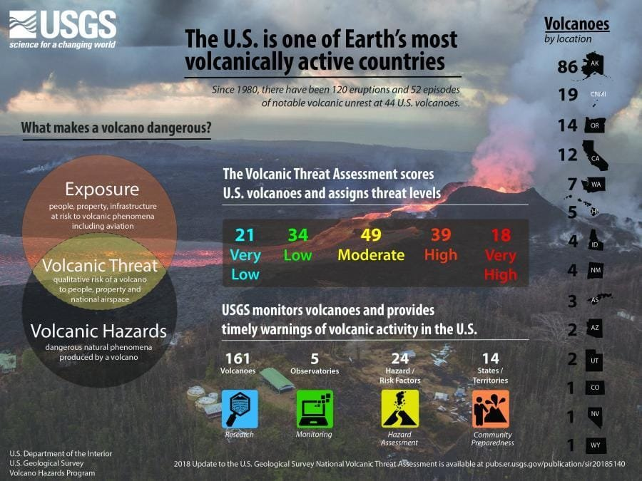
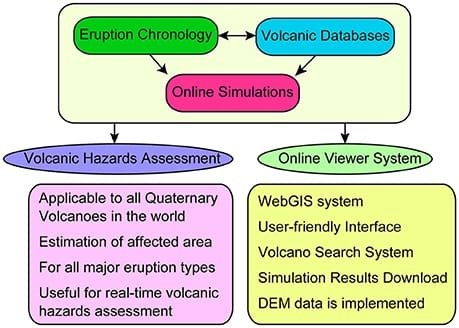
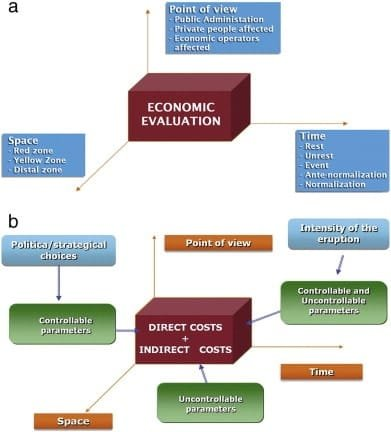
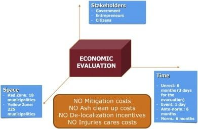

Volcanoes have long captivated scientists and adventurers alike with their awe-inspiring power and beauty. But beyond their mesmerizing appearance, volcanoes also pose significant risks to human communities. From the explosive eruptions of the "Ring of Fire" to the slow and steady lava flows in Hawaii, volcanic hazards can have profound economic consequences. In this article, we will delve into the economic impact of volcanic hazards, exploring the costs and benefits associated with these natural disasters. By understanding the economic consequences, we can better prepare and mitigate the risks posed by volcanoes, ensuring the safety and well-being of the communities living in their shadow. So, join us as we assess the economic impact of volcanic hazards and uncover the hidden factors that shape our understanding of these magnificent [natural phenomena](https://magmamatters.com/the-art-and-science-of-volcano-monitoring/ "The Art and Science of Volcano Monitoring").

This image is property of www.geoengineer.org.

## Types of volcanic hazards

### Lava flows

Lava flows are one of the most common volcanic hazards. When a volcano erupts, molten lava can flow down the slopes of the volcano, destroying everything in its path. Lava flows can cause extensive damage to infrastructure, including roads, bridges, and buildings. They can also pose a threat to human life, especially if communities are located in close proximity to the volcano.

### Pyroclastic flows

Pyroclastic flows are highly destructive and dangerous volcanic events. These flows consist of a mixture of hot ash, rock fragments, and gases that move rapidly down the sides of a volcano. Pyroclastic flows can reach speeds of up to 700 kilometers per hour and temperatures exceeding 1,000 degrees Celsius. They can cause widespread devastation, burying entire communities and leaving behind a trail of destruction.

### Ash fall

Ash fall is another significant volcanic hazard. When a volcano erupts, it releases a cloud of ash into the atmosphere. This ash can be carried by wind for hundreds of kilometers, blanketing the surrounding areas in a layer of fine particles. Ash fall can have numerous impacts on the economy, including damage to crops, disruption of air travel, and health risks for the local population.

### Volcanic bombs

Volcanic bombs are large, solid fragments of lava that are ejected from a volcano during an explosive eruption. These projectiles can travel significant distances and cause damage to infrastructure and harm to humans. The impact of volcanic bombs can be devastating, especially if they land in populated areas.

### Gas emissions

Volcanic eruptions emit a variety of gases, including sulfur dioxide, carbon dioxide, and hydrogen sulfide. These gases can have adverse effects on both human health and the environment. Inhaling volcanic gases can lead to respiratory problems and other health issues. Additionally, [volcanic gases can contribute to air pollution and climate change](https://magmamatters.com/geothermal-energy-and-its-volcanic-origins/ "Geothermal Energy and Its Volcanic Origins").

### Tsunamis caused by volcanic eruptions

In some cases, volcanic eruptions can trigger tsunamis. When a volcano erupts underwater or if a landslide occurs as a result of an eruption, it can generate powerful ocean waves that can travel great distances. These tsunamis can cause significant damage to coastal communities and have a profound economic impact.

## Methodologies in Evaluating Economic Impact

### Direct Cost Method

The direct cost method is a commonly used approach to assess the economic impact of volcanic hazards. This method involves quantifying the direct costs incurred as a result of the volcanic event, such as the cost of repairing infrastructure, rebuilding communities, and providing emergency services. By estimating these direct costs, policymakers and researchers can gauge the immediate financial implications of a volcanic eruption on the affected area.

### Replacement Cost Method

The replacement cost method focuses on the potential costs of replacing damaged or destroyed assets. This approach takes into account the cost of rebuilding infrastructure, replacing agricultural equipment, and restoring the tourism industry, among other factors. By considering the replacement costs, this method provides insight into the long-term economic impact of volcanic hazards and helps inform decision-making for recovery and rehabilitation efforts.

### Case Study Analysis Method

The case study analysis method involves studying past volcanic eruptions and their economic impacts to gain insights into the potential consequences of future events. By examining historical data and considering multiple variables, such as the specific characteristics of each eruption, the affected region's economic structure, and the response measures taken, researchers can provide valuable information for assessing the economic impact of volcanic hazards. This method allows for a more nuanced understanding of the long-term effects on the economy and helps in developing effective mitigation strategies.

  

## Direct Impact of Volcanic Hazards on Economy

### Damage to infrastructure

Volcanic hazards can cause severe damage to infrastructure, including roads, bridges, buildings, and power lines. The destruction of essential infrastructure can disrupt local economies, hinder transportation networks, and lead to long-term economic setbacks. The cost of repairing and rebuilding damaged infrastructure can be substantial and can take years to fully recover from.

### Disruption of transportation routes

Volcanic eruptions often result in the closure of airports, seaports, and major transportation routes. The ash clouds and poor visibility associated with eruptions can make air travel unsafe, leading to cancellations and delays. Additionally, lava flows and pyroclastic flows can block roads and railways, further disrupting the movement of goods and people. These disruptions have a significant impact on trade and tourism, causing financial losses for businesses and impacting the overall economy.

### Loss of agricultural produce

Volcanic hazards can devastate agricultural areas, destroying crops and livestock. The deposition of ash on farmland can smother plants and prevent photosynthesis, leading to reduced crop yields. The impact on agriculture has far-reaching consequences, as it can affect food security, increase food prices, and impact export revenues. The loss of agricultural produce can have long-term economic implications for both local and global markets.

### Influence on tourism industry

Many volcanic regions are popular tourist destinations, attracting visitors from around the world. However, when a volcano erupts, it can have a significant impact on the tourism industry. Ash fall and the threat of volcanic hazards can deter tourists from visiting the area, leading to a decline in revenue for hotels, restaurants, and other tourism-related businesses. The long-term effects on the tourism industry can be substantial, as travelers may develop negative perceptions of the region and choose alternative destinations for future trips.

## Indirect Impact of Volcanic Hazards on Economy

### Economic consequences of loss of lives

Volcanic eruptions can result in the loss of human lives, causing profound emotional and social impacts. Beyond the personal tragedy, the loss of lives has economic consequences as well. It can lead to a decrease in the labor force and a loss of productivity. The affected communities may also experience higher healthcare costs and a greater need for social services. The economic impact of the loss of lives is not just limited to the local level but can also have broader economic implications for the region and the country.

### Long-term effects on tourism

The indirect impact of volcanic hazards on the tourism industry extends beyond the immediate disruptions caused by an eruption. Even after the immediate threat has subsided, the perception of the area as unsafe or unstable can linger in the minds of potential tourists. This can lead to a long-lasting decline in tourism, affecting the local economy for years to come. Rebuilding the reputation of a tourist destination after a volcanic eruption requires significant effort and investment.

### Increase in insurance rates

Volcanic hazards can lead to an increase in insurance rates for both individuals and businesses in affected areas. Insurance companies factor in the potential risks associated with volcanic activity when determining premiums. After a significant eruption, insurance rates may rise to account for the increased likelihood of future volcanic hazards. This can place an additional financial burden on individuals and businesses, affecting the overall economy of the region.

### Impacts on health and the associated healthcare costs

Volcanic eruptions can have adverse effects on human health, with respiratory problems being a common consequence. The inhalation of volcanic ash and gases can lead to respiratory diseases, such as asthma and bronchitis. This, in turn, results in increased healthcare costs for individuals and governments. The healthcare system may also be under strain due to the influx of patients seeking treatment for volcanic-related health issues. The long-term impacts on public health and healthcare costs can be significant, further adding to the economic burden of volcanic hazards.

This image is property of www.frontiersin.org.

## Real-life Case Studies

### Eruption of Mount St. Helens in 1980

The eruption of Mount St. Helens in 1980 serves as a significant case study on the economic impact of volcanic hazards. The eruption resulted in the destruction of extensive areas of forest, the loss of wildlife, and the disruption of transportation networks. The recovery efforts required substantial financial resources and took years to complete. The tourism industry in the surrounding area also suffered, as visitors were deterred by the ongoing volcanic activity and the perceived risk of future eruptions. The case of Mount St. Helens highlights the importance of effective planning, preparedness, and long-term recovery strategies in mitigating the economic impact of volcanic hazards.

### Eruption of Eyjafjallajökull in 2010

The eruption of Eyjafjallajökull in Iceland in 2010 had significant economic consequences, particularly in the aviation industry. The ash plume resulting from the eruption led to the closure of airspace over large parts of Europe for several days. This disrupted air travel, resulting in canceled flights, stranded passengers, and financial losses for airlines and airports. The impact on the tourism industry was also notable, as travelers were deterred from visiting destinations affected by the ash cloud. This case study emphasizes the global nature of the economic impact of volcanic hazards, as the effects can extend far beyond the immediate area of the eruption.

### Eruption of Mount Pinatubo in 1991

The eruption of Mount Pinatubo in the Philippines in 1991 had severe economic consequences for the country. The eruption led to the displacement of hundreds of thousands of people and caused widespread damage to infrastructure. The agricultural sector, a vital component of the Philippine economy, was significantly impacted, with extensive crop losses and damage to irrigation systems. The recovery and rehabilitation efforts required substantial financial resources and took several years to complete. The case of Mount Pinatubo highlights the importance of comprehensive disaster management plans and the need for international cooperation in mitigating the [economic impact](https://magmamatters.com/understanding-volcanic-formation-a-comprehensive-guide/ "Understanding Volcanic Formation: A Comprehensive Guide") of volcanic hazards.

## Risk Assessment and Management

### Early warning and monitoring systems

To mitigate the economic impact of volcanic hazards, the establishment of early warning and monitoring systems is crucial. These systems involve the continuous monitoring of volcanic activity, including seismic activity, gas emissions, and ground deformation. By detecting changes in these parameters, scientists can issue timely warnings to communities at risk, allowing for the implementation of evacuation plans and the preparation of emergency response measures. Early warning systems play a vital role in reducing the potential loss of lives and minimizing the economic impact of volcanic hazards.

### Community preparedness

Communities living in volcanic hazard zones should be prepared to respond effectively to volcanic eruptions. This includes educating residents about volcanic hazards, conducting regular drills and exercises, and developing communication networks to disseminate critical information during an eruption. Preparedness measures can help reduce panic, enhance evacuation processes, and minimize the potential economic consequences associated with volcanic hazards. Community involvement and engagement are essential in fostering resilience and ensuring a coordinated response to volcanic events.

### Disaster management plans

The development and implementation of comprehensive disaster management plans are vital for mitigating the economic impact of volcanic hazards. These plans should include strategies for coordinating emergency response efforts, allocating resources, and providing support to affected communities. Additionally, disaster management plans should address long-term recovery and rehabilitation, focusing on restoring critical infrastructure, revitalizing the economy, and promoting sustainable development. Regular updates and revisions to these plans are necessary to account for changing volcanic hazards and ensure their effectiveness.

### Recovery and rehabilitation plans

Following a volcanic eruption, the affected area requires a well-defined recovery and rehabilitation plan. This plan should outline the necessary steps to rebuild infrastructure, revive economic activities, and restore the social fabric of the affected communities. It should involve collaboration between government agencies, international organizations, and local stakeholders to ensure a coordinated and efficient recovery process. The timely implementation of recovery and rehabilitation plans is critical in minimizing the long-term economic impact of volcanic hazards and facilitating the return to normalcy.

This image is property of ars.els-cdn.com.

## Government Policies and Volcanic Hazards

### Regulations on land use in volcanic hazard zones

Government policies play a crucial role in mitigating the economic impact of volcanic hazards. One essential policy measure is the implementation of regulations on land use in volcanic hazard zones. These regulations aim to restrict or prohibit the construction of critical infrastructure, such as hospitals, schools, and power plants, in high-risk areas. By enforcing these regulations, governments can reduce the potential loss of lives and minimize the economic consequences associated with infrastructure damage.

### Disaster insurance schemes

Governments can also play a role in promoting disaster insurance schemes to mitigate the economic impact of volcanic hazards. These schemes can provide financial support to individuals, businesses, and governments affected by volcanic eruptions. By offering affordable insurance coverage, governments can help alleviate the economic burden of recovery and rehabilitation efforts. Disaster insurance schemes can also incentivize proactive risk reduction measures and promote the resilience of communities in volcanic hazard zones.

### Funding for research and mitigation strategies

Government funding for research and mitigation strategies is crucial in improving our understanding of volcanic hazards and developing effective mitigation measures. Governments can allocate resources to support scientific research on volcanoes, including monitoring and modeling efforts. Funding can also be directed towards public education campaigns, training programs, and the development of innovative technologies for early warning and response. By investing in research and mitigation strategies, governments can enhance their ability to prepare for and mitigate the economic impact of volcanic hazards.

## Role of International Cooperation in Damage Control

### Sharing of expertise and resources

International cooperation plays a vital role in mitigating the economic impact of volcanic hazards. Countries with expertise in volcanic research, disaster management, and recovery can share their knowledge and resources with those in need. Collaboration between scientists, policymakers, and emergency management agencies can lead to the development of best practices and the implementation of effective strategies. By fostering international cooperation, the global community can work together to reduce the economic consequences of volcanic hazards.

### Transboundary disaster management strategies

Volcanic hazards can affect multiple countries and regions, making transboundary disaster management strategies essential. International cooperation can facilitate the coordination of emergency response efforts, the sharing of information, and the development of joint mitigation plans. By establishing communication channels and protocols, countries can work together to mitigate the economic impact of volcanic hazards on a regional scale. Transboundary disaster management strategies can enhance the resilience and preparedness of all involved parties.

### International funding for recovery

International funding can be instrumental in supporting the recovery and rehabilitation efforts of countries affected by volcanic hazards. Financial assistance from international organizations, such as the World Bank and the United Nations, can help bridge the financial gap faced by affected countries and facilitate the implementation of recovery plans. This funding can be used to rebuild critical infrastructure, restore livelihoods, and support the development of long-term mitigation measures. International cooperation in providing financial resources can significantly contribute to reducing the economic impact of volcanic hazards.

This image is property of ars.els-cdn.com.

## Future Prospects

### Predicting volcanic activity and the resultant economic impact

Advancements in scientific research and monitoring technology hold promise for improving the prediction of volcanic activity and its economic impact. Researchers are continuously refining models and monitoring techniques to enhance our ability to forecast eruptions and understand their likely consequences. By refining these predictive capabilities, governments and communities can be better prepared for future volcanic events, leading to more effective risk mitigation strategies and reduced economic impact.

### Improvements in disaster management

Ongoing efforts are being made to improve disaster management practices related to volcanic hazards. These include the development of innovative technologies, such as remote sensing and early warning systems, as well as the integration of real-time data into emergency response planning. Additionally, the sharing of best practices and lessons learned from past volcanic events can help inform future disaster management strategies. With continued investments in disaster management, governments and communities can enhance their ability to respond to volcanic hazards and minimize the economic impact.

### Climate change and volcanic activity

The potential link between climate change and volcanic activity is an area of ongoing research and debate. While volcanic eruptions themselves do not directly result from climate change, some studies suggest that the changing climate could influence volcanic activity indirectly. For example, melting glaciers and ice caps could relieve pressure on underlying magma chambers, potentially leading to increased volcanic eruptions. Understanding the relationship between climate change and volcanic activity is crucial for predicting future eruptions and assessing their economic impact.

## Conclusion: Lessons for Effective Mitigation of Economic Impacts

The economic impact of volcanic hazards can be substantial and far-reaching. However, by understanding the different types of volcanic hazards and their potential consequences, policymakers, researchers, and communities can develop effective strategies to mitigate these impacts.

The direct impact of volcanic hazards on the economy can be observed through the damage to infrastructure, disruption of transportation routes, loss of agricultural produce, and the influence on the tourism industry. These immediate consequences require immediate action and planning to minimize their economic impact.

Furthermore, the indirect impact of volcanic hazards, such as the economic consequences of loss of lives, long-term effects on tourism, the increase in insurance rates, and impacts on health and associated healthcare costs, must be addressed to ensure a sustainable recovery and future resilience.

Real-life case studies, like the eruption of Mount St. Helens, Eyjafjallajökull, and Mount Pinatubo, provide valuable insights into the economic impact of volcanic hazards and offer lessons for better preparedness, response, and recovery efforts.

Risk assessment and management, along with government policies and international cooperation, play critical roles in minimizing the economic impact of volcanic hazards. Early warning and monitoring systems, community preparedness, comprehensive disaster management plans, and recovery and rehabilitation strategies are essential components in effective mitigation.

Looking towards the future, continued advancements in predicting volcanic activity, improvements in disaster management, and understanding the potential link between climate change and volcanic activity will further enhance our ability to mitigate the economic impacts of volcanic hazards.

In conclusion, the lessons learned from assessing the economic impact of volcanic hazards emphasize the significance of planning and preparedness, the importance of continuous research and data analysis, and the relevance of community-centered strategies. By prioritizing these lessons, governments, communities, and international organizations can work together to build resilience and minimize the economic consequences of volcanic hazards.

Related Posts: [Mitigating Risks: Forecasting Volcanic Activity in Prone Areas](https://magmamatters.com/mitigating-risks-forecasting-volcanic-activity-in-prone-areas/), [The Formation and Eruption Patterns of Volcanoes](https://magmamatters.com/the-formation-and-eruption-patterns-of-volcanoes-4/), [The Pyroclastic Phenomena of Pompeii: 7 Insights to Explore](https://magmamatters.com/the-pyroclastic-phenomena-of-pompeii-7-insights-to-explore/), [Tips for Capturing Volcano Pyroclastic Flow Photos](https://magmamatters.com/tips-for-capturing-volcano-pyroclastic-flow-photos/), [Understanding Volcanoes and Their Eruption Patterns](https://magmamatters.com/understanding-volcanoes-and-their-eruption-patterns/)
