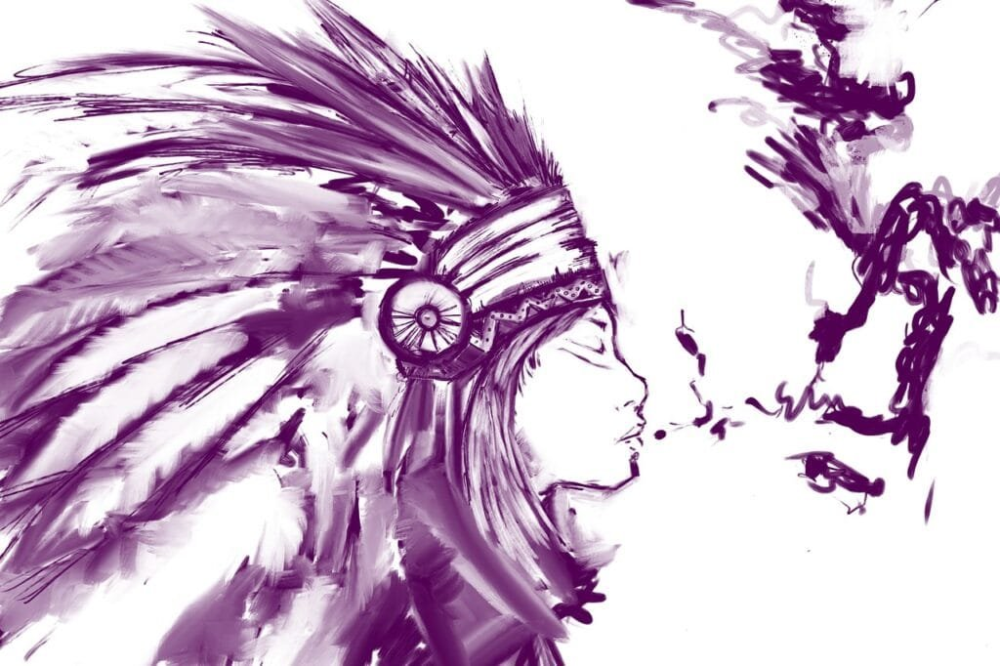
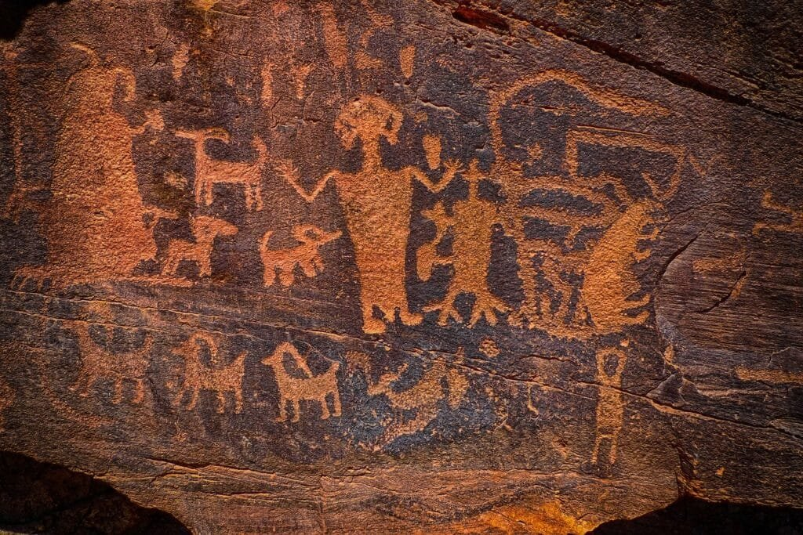
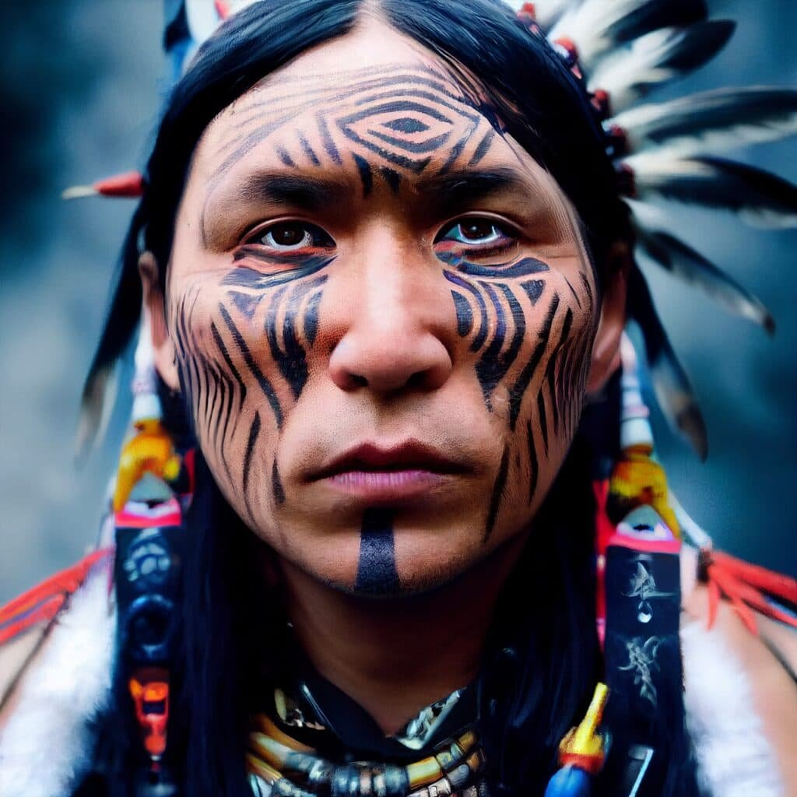

In "Deciphering Native American Legends about Volcanoes," you will explore the rich and captivating world of Native American legends surrounding volcanoes. Volcanoes, formed by the release of molten rock, gases, and debris, have always held a mystique that has fascinated civilizations throughout history. This article will provide you with valuable context on different types of volcanoes, their causes, hazards, and benefits. By delving into Native American legends, we can gain insights into the cultural significances and interpretations of these great natural phenomena. So, join us on this journey as we unravel the hidden meanings and messages behind the mythologies of volcanic eruptions.

This image is property of pixabay.com.

## Background of Native American Volcano Legends

### Definition and relevance of Native American mythology

Native American mythology refers to the collection of stories, beliefs, and cultural traditions that have been passed down orally through generations within Indigenous communities. These myths and legends hold great significance as they provide insights into the worldview, values, and spiritual practices of Native American tribes. Volcanoes, being a natural phenomenon of great power and mystery, often feature prominently in these mythologies, serving as symbols that represent both the destructive and creative forces of nature.

### Brief of geology and phenomena of volcanoes

Volcanoes are geological formations that result from the eruption of molten rock, gases, and debris from the Earth's mantle and crust. These eruptions occur due to the movement and interaction of tectonic plates, which create openings for magma to rise to the surface. The volcanic activity can range from slow and gradual lava flows to explosive eruptions that release ash, gas, and pyroclastic materials. [Volcanoes are not only awe-inspiring natural phenomena](https://magmamatters.com/the-art-and-science-of-volcano-monitoring/ "The Art and Science of Volcano Monitoring") but also have a significant impact on the surrounding environment, shaping landscapes and influencing local climate patterns.

### Association of volcanoes in Native American culture and traditions

For many Native American tribes, who have lived in close harmony with the natural world for centuries, volcanoes hold immense cultural and spiritual significance. These volcanoes are often seen as sacred sites and are believed to be inhabited by powerful beings or spirits. Their eruptions and the resulting volcanic landscapes are seen as manifestations of divine power and are closely connected to the spiritual identity of the tribes. Native American cultures have developed rich mythologies around volcanoes, weaving stories that explain the [origins of these volcanic](https://magmamatters.com/geothermal-energy-and-its-volcanic-origins/ "Geothermal Energy and Its Volcanic Origins") features and their impact on the world.

## Native American tribes and their associated volcano legends

### Identification of major Native American tribes

There are numerous Native American tribes across North America, each with its distinct culture, language, and spiritual beliefs. Some of the major tribes known for their volcano legends include the Haida, Cowlitz, and Shasta tribes.

### Enumeration of their respective volcano legends

1. **The Volcano Woman legend of the Haida tribe**: The Haida tribe, indigenous to the Pacific Northwest, tells the story of a powerful Volcano Woman who resides within a volcano. She has the ability to control volcanic eruptions and uses her powers to punish those who disrespect the natural world.
2. **Mount St. Helen's legend of the Cowlitz tribe**: The Cowlitz tribe, located in the region surrounding Mount St. Helens, has a legend that tells the story of a great battle between two volcanic spirits. This battle resulted in the creation of the mountain and the surrounding landscape.
3. **Mount Shasta legend of the Shasta tribe**: The Shasta tribe, situated near the majestic Mount Shasta in California, has a legend that revolves around the belief that the mountain is a sacred place inhabited by powerful spirits. The legends tell of the mountain as a gateway to the spirit world and a place of healing and transformation.

This image is property of pixabay.com.

## Interpretation of Native American Volcano symbols

### Understanding symbolic representations in legends

Native American legends are often filled with symbolism, where natural phenomena like volcanoes represent deeper spiritual concepts. Understanding the symbolic representations allows us to unravel the metaphorical meanings embedded within the legends and gain insights into the cultural values and beliefs of the tribes.

### Analyzing volcano symbols in Native American tribes

Volcanoes in Native American cultures symbolize a range of concepts, including power, creation, destruction, purification, and spiritual transformation. The eruptions of volcanoes are seen as a metaphorical cleansing, purging the land of negative energies and allowing for renewed growth and spiritual growth. The volcano symbols also connect tribes to their ancestral lands, emphasizing their deep relationship with the natural world.

## In-depth Analysis of Famous Native American Volcano Legends

### The Volcano Woman legend of the Haida tribe

The legend of the Volcano Woman is one of the most well-known volcano legends among the Haida tribe. According to their myth, the Volcano Woman controls the volcanic eruptions and punishes those who disrespect the natural world. The legend highlights the Haida's reverence for nature and their belief in the consequences of human actions. It serves as a reminder of the importance of living in harmony with the environment.

### Mount St. Helen's legend of the Cowlitz tribe

The Cowlitz tribe's legend surrounding Mount St. Helens tells the story of a battle between two volcanic spirits. The eruption and subsequent formation of Mount St. Helens are attributed to this mythical battle. This legend reflects the Cowlitz tribe's connection to the land and their understanding of the powerful forces at work in the natural world. It reinforces their respect for the land and the need to maintain a balanced relationship with it.

### Mount Shasta legend of the Shasta tribe

The Shasta tribe's legend associated with Mount Shasta describes the mountain as a sacred place inhabited by powerful spirits. The mountain is believed to be a gateway to the spirit world and a source of healing and transformation. This legend highlights the Shasta tribe's spiritual connection to the mountain and their belief in its mystical powers. The legend serves as a reminder of the importance of seeking spiritual harmony with nature.

This image is property of pixabay.com.

## Compare and contrast between different tribes' volcano legends

### Differences in depiction and interpretation

While each tribe has its unique volcano legends, there are notable differences in the way these legends are depicted and interpreted. The Haida legend focuses on a powerful Volcano Woman who controls eruptions, emphasizing the consequences of disrespecting nature. The Cowlitz legend centers around a battle between volcanic spirits, highlighting the creation of Mount St. Helens through a mythical event. The Shasta legend portrays Mount Shasta as a sacred place of healing and spiritual transformation, emphasizing the mountain's mystical qualities.

### Common themes and motifs in different tribes' legends

Despite the differences, there are common themes and motifs in Native American volcano legends. These include the belief in the power and sacredness of volcanoes, the connection between volcanic eruptions and human behavior, and the idea of purification and renewal through volcanic activity. These shared themes reflect the deep-rooted respect Indigenous tribes hold for the natural world and their understanding of the cyclical nature of life and spiritual growth.

## Link between volcanic eruptions and myth creation

### Interplay of natural phenomena and human interpretation

Volcanic eruptions are powerful natural events that have profoundly impacted human civilizations throughout history. The devastating and awe-inspiring nature of volcanic eruptions often leads to the creation of myths and [legends](https://magmamatters.com/understanding-volcanic-formation-a-comprehensive-guide/ "Understanding Volcanic Formation: A Comprehensive Guide") as humans seek to understand and make sense of these events. Native American tribes, being intimately connected with their natural environments, interpret volcanic eruptions through their cultural lenses, attributing spiritual significance to these occurrences.

### Influence of volcanic eruptions on myth and legend formation

Volcanic eruptions shape the physical landscapes and ecosystems surrounding them. The destruction and subsequent regeneration caused by eruptions are seen as cycles of creation and destruction, mirroring the human experience. These catastrophic events also reinforce the belief in the power and unpredictability of nature, leading to the formation of legends that warn against disrespecting the natural world and emphasize the need for balance and harmony.

## Rituals and traditions related to volcano legends

### Survey of practices carried out by tribes in context of volcanoes

Native American tribes have various rituals and traditions associated with their volcano legends. These practices often involve ceremonial dances, songs, and offerings made to the volcanic sites. Tribes may also have specific rituals performed during volcanic eruptions or in preparation for potential eruptions. These rituals serve to honor and communicate with the spirits believed to inhabit the volcanoes and seek their protection and guidance.

### Meaning and relevance of these rituals in contemporary society

While some of these rituals may seem outdated in contemporary society, they still hold deep meaning and relevance for Native American communities. The rituals serve as a way to connect with their cultural heritage and ancestral lands. They also provide a sense of continuity and identity, reinforcing the tribes' spiritual beliefs and values. Additionally, these rituals remind individuals and communities of the need to respect and care for the natural world, promoting environmental stewardship and sustainability.

## Contemporary relevance of Native American volcano legends

### Preservation efforts of these legends

In recent years, there has been an increased awareness and appreciation for Native American cultures and their traditional knowledge. Efforts are being made to preserve and promote these legends through oral storytelling, written records, and cultural events. Organizations and Indigenous communities are working together to ensure that these valuable cultural treasures are passed down to future generations.

### Modern interpretations and adaptations of these legends

Native American volcano legends continue to inspire modern interpretations and adaptations, finding expression in various forms of art, literature, and performances. Artists and writers draw inspiration from these legends to explore themes of nature, spirituality, and cultural identity. These contemporary interpretations help bridge the gap between traditional knowledge and the modern world, allowing for a deeper understanding and appreciation of Native American cultures.

## Influence of volcano legends on tribal culture and lifestyle

### Influence on art, culture, and language

Volcano legends have had a profound influence on various aspects of tribal culture and lifestyle. They have inspired artwork, such as paintings, sculptures, and pottery, that depict volcanic imagery and symbolism. They have also influenced traditional dances, songs, and storytelling practices, keeping the legends alive and ensuring their transmission to younger generations. Additionally, volcano legends have contributed to the development and preservation of Indigenous languages, as they are often integral to oral traditions and linguistic expressions.

### Lessons and morals derived from the legends influencing societal norms

The lessons and morals derived from Native American volcano legends have had a significant impact on tribal societies, influencing societal norms and values. These legends often convey messages of respect for nature, the importance of balance and harmony, and the consequences of human actions. These teachings help shape the ethical framework of tribal communities, guiding their interactions with the natural world and with one another.

## Inference and concluding thoughts on Native American volcano legends

### Breakdown of the role and significance of volcanoes in Native American folklore

Volcanoes hold a central and multifaceted role in Native American folklore. They are not merely geological formations but rather symbols of power, creation, destruction, and spiritual transformation. Volcano legends serve to transmit cultural knowledge, reinforce spiritual beliefs, and provide moral guidance. These legends reflect the deep reverence and profound connection that Native American tribes have with the natural world, emphasizing the need for harmonious and sustainable coexistence.

### Reflection on the enduring influence of these legends on Native American culture and history

The enduring influence of Native American volcano legends on Native American culture and history cannot be overstated. These legends are part of a rich and diverse tapestry of Indigenous knowledge and spirituality. They offer insights into the cultural heritage and traditional wisdom of Native American tribes, helping to preserve their unique identities and fostering a deeper appreciation for their contributions to the broader human experience. As these legends continue to be passed down through generations, they ensure the continuity of Native American cultures, promoting cultural resilience and celebrating the enduring spirit of Indigenous peoples.

