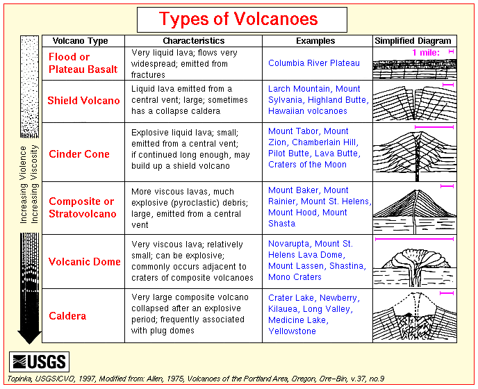
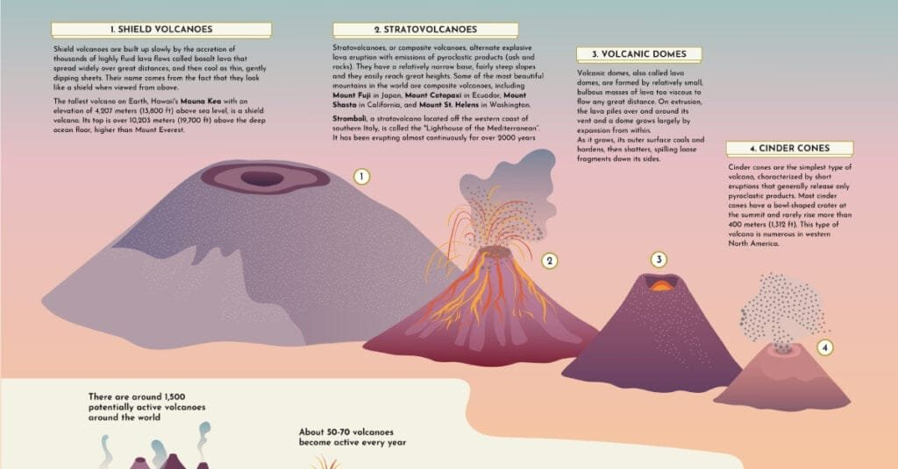
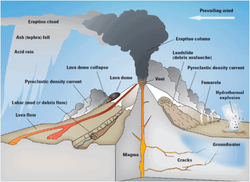

Volcanoes, those majestic wonders of nature that command both respect and fear, have long captivated our attention. From their fiery eruptions to their towering peaks, volcanoes have a mesmerizing power that is both fascinating and dangerous. But not all volcanoes are alike, and today we will explore the intriguing differences in pyroclastic flows between two distinct types: stratovolcanoes and shield volcanoes. These terms may sound unfamiliar, but fear not, as we will delve into what sets them apart and why their pyroclastic flows differ. So, grab a virtual hard hat and join us on this journey to uncover the secrets of these awe-inspiring natural phenomena.

This image is property of www.explorevolcanoes.com.

## Understanding Volcanoes

[Volcanoes are fascinating natural phenomena](https://magmamatters.com/the-art-and-science-of-volcano-monitoring/ "The Art and Science of Volcano Monitoring") that have captivated humans for centuries. They are formed when molten rock, gases, and debris escape to the earth's surface, causing eruptions of lava and ash. These eruptions occur at sites along plate boundaries, hotspots under the earth's crust, or rift zones where the earth's tectonic plates are moving apart.

### Definition and Nature of Volcanoes

A volcano can be defined as a rupture in the Earth's crust that allows hot lava, volcanic ash, and gases to escape from a magma chamber below the surface. They come in various sizes and shapes, from small cones to massive mountains. The nature of volcanoes is dynamic, as they are constantly evolving through eruptions and other geological events.

### Types of Volcanoes: Stratovolcanoes and Shield Volcanoes

Two main [types of volcanoes are stratovolcanoes and shield](https://magmamatters.com/understanding-volcanic-formation-a-comprehensive-guide/ "Understanding Volcanic Formation: A Comprehensive Guide") volcanoes. Stratovolcanoes, also known as composite volcanoes, are characterized by their steep sides and symmetrical cone-shaped structure. They are formed by alternating layers of lava, ash, and other volcanic materials. On the other hand, shield volcanoes have a broad, gently sloping shape, resembling a warrior's shield. They are formed by the accumulation of fluid lava flows over time.

### The Volcanic Eruption Process

When a volcano erupts, it goes through a series of stages known as the volcanic eruption process. The process begins with the accumulation of magma in the volcano's magma chamber. As the pressure builds, the magma rises towards the surface, eventually reaching a point where it erupts explosively or effusively. Explosive eruptions occur when the magma contains high levels of gas and other volatile materials. In contrast, effusive eruptions involve the slow flow of lava from the volcanic vent.

## Pyroclastic Flows: An Overview

One of the most hazardous phenomena associated with volcanic eruptions is pyroclastic flows. Pyroclastic flows are fast-moving, high-density mixtures of hot volcanic ash, rock fragments, and gases that flow down the slopes of a volcano with great speed and destructive force.

### What are Pyroclastic Flows?

Pyroclastic flows are extremely dangerous and can reach speeds of over 100 kilometers per hour. They are formed when explosive eruptions cause the collapse of eruption columns, resulting in a dense mixture of hot materials rapidly descending the volcano's slopes. These flows can travel for several kilometers, destroying everything in their path.

### The Composition of Pyroclastic Flows

Pyroclastic flows consist of various materials, including volcanic ash, pumice, rock fragments, and gases such as sulfur dioxide. The exact composition depends on the type of volcano and the characteristics of the eruption. These flows can have temperatures exceeding 800 degrees Celsius, making them extremely destructive and deadly.

### The Risks and Hazards of Pyroclastic Flows

Pyroclastic flows pose significant risks and hazards to both human populations and the environment. They can cause extensive damage to infrastructure, agriculture, and natural ecosystems. The extreme temperatures of pyroclastic flows can incinerate everything in their path and result in the loss of human life. In addition, the ash and gases emitted by these flows can have long-term effects on air quality and climate.

This image is property of sciencenotes.org.

## Distinguishing Factors Between Stratovolcanoes and Shield Volcanoes

While all volcanoes share some common characteristics, there are key differences between stratovolcanoes and shield volcanoes.

### Geographical Locations of Stratovolcanoes and Shield Volcanoes

Stratovolcanoes are commonly found in subduction zones where one tectonic plate is forced beneath another. These volcanic arcs can be seen in regions such as the Pacific Ring of Fire, which includes countries like Japan, Mexico, and Chile. Shield volcanoes, on the other hand, are often found over hotspots, which are areas of intense volcanic activity unrelated to plate boundaries. One of the most famous examples of shield volcanoes is the Hawaiian Islands.

### Variation in Size and Structure

Stratovolcanoes are typically larger and taller than shield volcanoes. They can reach heights of several kilometers and have steep slopes due to the accumulation of layers of hardened lava, ash, and other volcanic materials. In contrast, shield volcanoes have a low, broad profile. They are characterized by gentle, sloping sides formed by the gradual accumulation of fluid lava flows.

### Different Eruption Styles

The eruption styles of stratovolcanoes and shield volcanoes also differ. Stratovolcanoes are known for their explosive eruptions, which occur when highly viscous magma and gas are trapped in the volcano's plumbing system. These eruptions can produce pyroclastic flows and volcanic ash clouds that pose significant hazards to surrounding areas. Shield volcanoes, on the other hand, typically experience effusive eruptions with low viscosity lava. These eruptions result in the slow flow of lava that can cover large areas over time.

## Understanding Stratovolcanoes

Stratovolcanoes are awe-inspiring geological features that can be found in various parts of the world. Understanding their formation, eruption patterns, and relationship with pyroclastic flows is crucial for predicting and mitigating the risks associated with these volcanoes.

### Formation of Stratovolcanoes

Stratovolcanoes are formed through a series of volcanic events over a long period of time. As magma rises towards the surface, it accumulates in a reservoir called a magma chamber. Over time, pressure builds within the chamber, causing the volcano to grow. Stratovolcanoes are characterized by their alternating layers of hardened lava, pyroclastic deposits, and other volcanic materials, creating their distinctive cone shape.

### Eruption Patterns of Stratovolcanoes

Stratovolcanoes are known for their explosive eruption patterns. These eruptions occur when the highly viscous magma in the volcano's plumbing system becomes trapped, leading to a buildup of pressure. When the pressure exceeds the strength of the volcano's crater, an explosive eruption ensues. These eruptions can produce pyroclastic flows, which are one of the most hazardous phenomena associated with stratovolcanoes.

### Stratovolcanoes and Pyroclastic Flows

Stratovolcanoes are closely associated with the occurrence of pyroclastic flows. The explosive nature of their eruptions, combined with the high gas content and viscosity of their magma, creates conditions conducive to the formation of pyroclastic flows. These fast-moving mixtures of hot volcanic ash, rock fragments, and gases can travel down the slopes of stratovolcanoes with great speed and destructive force.

This image is property of cdn.zmescience.com.

## Understanding Shield Volcanoes

Shield volcanoes, like the ones found in Hawaii, represent a different type of volcanic feature compared to stratovolcanoes. Understanding the formation and eruption patterns of shield volcanoes is essential in assessing the risks associated with them.

### Formation of Shield Volcanoes

Shield volcanoes are formed through the accumulation of fluid lava flows over time. These volcanoes are often found near hotspots, which are areas of intense volcanic activity unrelated to plate boundaries. As magma rises through the earth's crust, it reaches the surface and flows out of the volcano in a gentle and continuous manner. Over time, the repeated eruptions of fluid lava create a broad, shield-like structure.

### Eruption Patterns of Shield Volcanoes

Shield volcanoes are known for their relatively calm and effusive eruption patterns. The lava erupted by these volcanoes has low viscosity, allowing it to easily flow and spread over large areas. The eruptions are usually characterized by streams of lava that can cover vast distances. Unlike the explosive eruptions of stratovolcanoes, the eruptions of shield volcanoes are less hazardous to human populations due to their predictable and slow-moving nature.

### Shield Volcanoes and Pyroclastic Flows

Unlike stratovolcanoes, shield volcanoes are not prone to producing pyroclastic flows. The low viscosity of the lava erupted by shield volcanoes prevents the formation of the dense, fast-moving mixtures of ash and rock fragments characteristic of pyroclastic flows. Instead, the lava flows from shield volcanoes tend to spread out slowly, posing fewer immediate risks to surrounding areas.

## Differences in Pyroclastic Flows in Stratovolcanoes and Shield Volcanoes

While both stratovolcanoes and shield volcanoes have the potential to produce pyroclastic flows, there are distinguishing factors between the two in terms of composition, speed and flow patterns, and impact on surrounding areas.

### Composition Difference

The composition of pyroclastic flows differs between stratovolcanoes and shield volcanoes. In stratovolcanoes, the flows consist of a mixture of volcanic ash, pumice, and rock fragments, along with gases such as sulfur dioxide. The explosive nature of stratovolcanic eruptions contributes to the high concentration of these materials in pyroclastic flows. Shield volcanoes, on the other hand, primarily produce lava flows with relatively low gas and ash content. As a result, pyroclastic flows from shield volcanoes are less common and less dense.

### Speed and Flow Patterns

Pyroclastic flows from stratovolcanoes tend to be faster and more destructive than those from shield volcanoes. The steep slopes and explosive nature of stratovolcanoes can propel pyroclastic flows at speeds exceeding 100 kilometers per hour. In contrast, pyroclastic flows from shield volcanoes, if they occur at all, are usually slower due to the lower viscosity of the lava. The slower speed of shield volcano pyroclastic flows gives people more time to evacuate and reduces the immediate danger.

### Impact on Surrounding Areas

The difference in composition and speed of pyroclastic flows from stratovolcanoes and shield volcanoes results in varying impacts on surrounding areas. Pyroclastic flows from stratovolcanoes are capable of causing widespread destruction, incinerating everything in their path and burying communities under layers of ash and debris. In contrast, pyroclastic flows from shield volcanoes, if they occur, are typically less severe due to their lower density and slower speeds. This lower impact provides some relief to communities living near shield volcanoes.

This image is property of www.visualcapitalist.com.

## Case Studies of Pyroclastic Flows

To further illustrate the types of pyroclastic flows that can occur, let's examine two case studies: the pyroclastic flows from Mt. St. Helens, a stratovolcano, and Mauna Loa, a shield volcano.

### Pyroclastic Flows from Stratovolcanoes: The Case of Mt. St. Helens

In 1980, Mt. St. Helens, located in Washington State, experienced a devastating eruption that resulted in the release of pyroclastic flows. The eruption began with a massive lateral blast that triggered the collapse of the volcano's north flank. This collapse generated a high-velocity pyroclastic flow that traveled down the mountain, obliterating everything in its path. The eruption of Mt. St. Helens highlighted the destructive power and rapid movement of pyroclastic flows associated with stratovolcanoes.

### Pyroclastic Flows from Shield Volcanoes: The Case of Mauna Loa, Hawaii

Mauna Loa, located in Hawaii, is one of the most active shield volcanoes in the world. While it is known for its effusive eruptions, it has also produced pyroclastic flows in the past. The 1950 eruption of Mauna Loa resulted in the formation of [pyroclastic flows that traveled down the volcano's](https://magmamatters.com/the-environmental-impact-of-volcanic-eruptions-2/ "The Environmental Impact of Volcanic Eruptions") slopes. These flows were characterized by their lower density and slower speeds compared to those from stratovolcanoes. Nonetheless, they posed risks to nearby communities and highlighted the importance of preparedness in volcanic regions.

## Impact of Pyroclastic Flows on Human Population

The occurrence of pyroclastic flows poses significant risks to human populations living near active volcanoes. These risks include the potential loss of human life, economic impact, and the displacement and relocation of affected populations.

### Risk to Human Life

Pyroclastic flows are highly destructive and can cause the loss of human life. The extreme temperatures and high speeds at which these flows travel make them difficult to escape. People caught in the path of a pyroclastic flow are at risk of severe burns, as well as being buried beneath layers of hot ash and debris. The 1902 eruption of Mount Pelée in Martinique resulted in the death of approximately 30,000 people due to pyroclastic flows, highlighting the catastrophic consequences they can have on human populations.

### Economic Impact

The impact of pyroclastic flows on the economy can be significant. The destruction caused by these flows can result in the loss of infrastructure, agriculture, and natural resources. The cost of rebuilding and recovery efforts can be substantial, affecting local economies for years or even decades. Additionally, areas affected by pyroclastic flows may experience a decline in tourism, further impacting the local economy.

### Displacement and Relocation of Populations

The occurrence of pyroclastic flows often leads to the displacement and relocation of affected populations. Communities living in high-risk areas must evacuate promptly to ensure their safety. The process of relocation can be challenging and traumatic, as people are forced to leave behind their homes, belongings, and often their livelihoods. The long-term impact of displacement can extend beyond the physical and economic, affecting the social and psychological well-being of those affected.

This image is property of earthhow.com.

## Role of Scientific Study in Predicting Pyroclastic Flows

Scientific study plays a crucial role in predicting and mitigating the risks associated with pyroclastic flows. Through the use of advanced techniques and advancements in the field of volcanology, scientists can better understand the behavior of volcanoes and anticipate the occurrence of pyroclastic flows.

### Techniques used to Study and Anticipate Pyroclastic Flows

Scientists use a variety of techniques to study and anticipate pyroclastic flows. These include remote sensing tools such as satellite imagery and ground-based monitoring systems that track volcanic activity in real-time. In addition, scientists collect and analyze data on gas emissions, ground deformation, and seismic activity, all of which can provide valuable insights into a volcano's behavior.

### Advancements in Volcanology and Impact on Community Safety

Advancements in the field of volcanology have greatly contributed to community safety in volcanic regions. Improved understanding of volcanic processes, eruption dynamics, and the behavior of pyroclastic flows has allowed scientists to develop more accurate models for predicting volcanic activity. This knowledge enables authorities to issue timely warnings and evacuation orders, minimizing the risks posed by pyroclastic flows to human populations.

## Mitigating the Risks of Pyroclastic Flows

While volcanic eruptions and pyroclastic flows cannot be prevented, various measures can be taken to mitigate the risks and minimize the impact on surrounding communities.

### Prevention Measures

Prevention measures for pyroclastic flows focus on land use planning and zoning regulations. Identifying high-risk areas prone to pyroclastic flows and restricting or discouraging development in these zones can reduce the exposure of human populations. Additionally, the implementation of early warning systems and emergency preparedness plans can help ensure a prompt and organized response in the event of an eruption.

### Emergency Best Practices in the Event of a Pyroclastic Flow

In the event of a pyroclastic flow, the safety of human populations is of utmost importance. Emergency best practices include staying informed through official communication channels, adhering to evacuation orders, and following designated evacuation routes. Seeking higher ground or taking shelter in sturdy structures can provide added protection from the flow. It is essential for communities to have well-established emergency protocols and regularly conduct drills to ensure preparedness.

### Role of Government and Community Preparedness

The role of government and community preparedness cannot be overstated in mitigating the risks of pyroclastic flows. Governments play a critical role in implementing and enforcing building codes, land use regulations, and evacuation procedures. Communities, on the other hand, must actively participate in preparedness efforts, including educating residents about volcanic hazards, establishing evacuation plans, and maintaining emergency supplies. The collaboration between government agencies and communities is vital in reducing the vulnerability of populations to pyroclastic flows.

As we continue to explore and understand volcanoes, it is essential to recognize the risks associated with pyroclastic flows. Through scientific study, community preparedness, and effective mitigation measures, we can work towards minimizing the impact of these hazardous phenomena on human populations. By staying informed and working together, we can ensure the safety and resilience of communities living in volcanic regions around the world.

