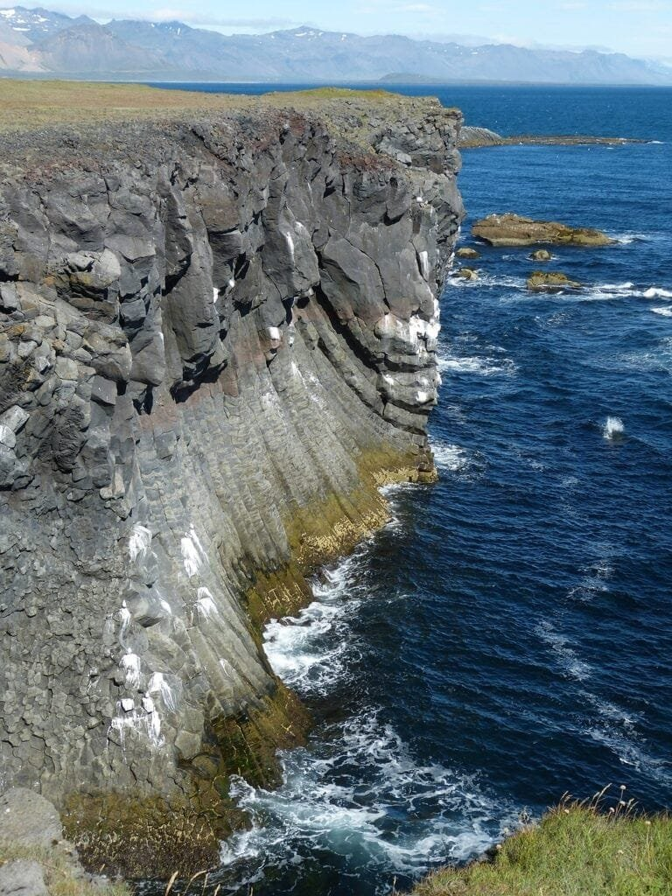
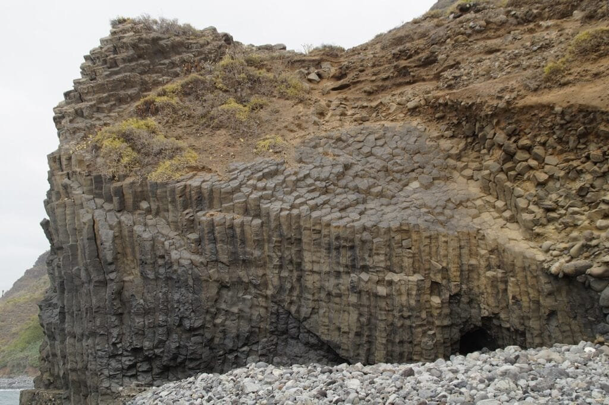
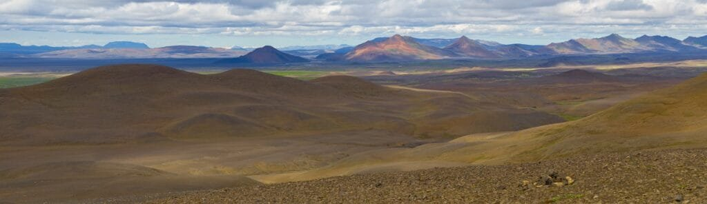

Volcanic rocks are a fascinating subject to explore, as they offer a glimpse into the powerful forces that shape our planet. These rocks are formed through volcanic eruptions, when molten rock, gases, and debris escape to the earth's surface. The resulting lava and ash solidify, creating various types of volcanic rocks. What makes these rocks even more intriguing is their mineral composition, which can vary greatly depending on the type of volcano and the conditions under which the eruption occurred. By understanding the minerals that make up different volcanic rock types, we can unravel the geological processes that have shaped our world and gain insights into the potential hazards and benefits associated with volcanic activity.

<iframe width="560" height="315" src="https://www.youtube.com/embed/cjuV35Wvu8E" frameborder="0" allow="accelerometer; autoplay; encrypted-media; gyroscope; picture-in-picture" allowfullscreen></iframe>

  

## Basaltic Rocks

### Mineral Composition of Basaltic Rocks:

Basaltic rocks are primarily composed of volcanic glass, pyroxene, and feldspar minerals. The most common pyroxene mineral found in basalt is augite, while the feldspar minerals present are usually plagioclase feldspar. Basaltic rocks may also contain small amounts of olivine and other minerals such as magnetite and ilmenite.

### Formation and Characteristics of Basaltic Rocks:

Basaltic rocks are formed from the rapid cooling of lava flows on the Earth's surface or the solidification of magma underground. This rapid cooling results in fine-grained textures, with individual mineral crystals often not visible to the naked eye. Basaltic rocks are typically dark in color, ranging from black to dark gray. They have a dense and hard composition, making them resistant to weathering and erosion.

### Distribution of Basaltic Rocks:

Basaltic rocks are found in various parts of the world, both on land and beneath the ocean. They are commonly associated with volcanic regions such as the mid-ocean ridges and hotspot volcanic areas. Basaltic rocks can be found in significant quantities in places like Iceland, the Deccan Traps in India, and the Columbia River Basalt Group in the United States.

## Andesitic Rocks

### Mineral Composition of Andesitic Rocks:

Andesitic rocks are composed of minerals such as plagioclase feldspar, amphibole, and biotite. Unlike basaltic rocks, andesitic rocks have a higher silica content, which gives them a lighter color. The plagioclase feldspar minerals in andesitic rocks can range from sodium-rich to calcium-rich compositions.

### Formation and Characteristics of Andesitic Rocks:

Andesitic rocks are formed through the partial melting of the Earth's crust in subduction zones, where one tectonic plate is forced beneath another. The melted rock, known as magma, then rises to the surface and solidifies to form andesitic rocks. These rocks have an intermediate composition between basaltic and rhyolitic rocks, and they often exhibit porphyritic textures, with larger crystals surrounded by a fine-grained matrix.

### Distribution of Andesitic Rocks:

Andesitic rocks are commonly found in volcanic arcs associated with subduction zones. They are abundant in regions such as the Andes Mountains in South America, the Cascade Range in North America, and the Ring of Fire encircling the Pacific Ocean. The explosive eruptions of andesitic [volcan](https://magmamatters.com/understanding-volcanic-formation-a-comprehensive-guide/ "Understanding Volcanic Formation: A Comprehensive Guide")oes can result in the formation of stratovolcanoes, characterized by steep slopes and a conical shape.

This image is property of pixabay.com.

## Rhyolitic Rocks

### Mineral Composition of Rhyolitic Rocks:

Rhyolitic rocks are rich in silica and contain minerals such as quartz, potassium feldspar, and plagioclase feldspar. These rocks often have a light color, ranging from white to light gray, due to their high silica content. Rhyolitic rocks may also contain smaller amounts of biotite, muscovite, and amphibole minerals.

### Formation and Characteristics of Rhyolitic Rocks:

Rhyolitic rocks are formed from the cooling and solidification of highly viscous magma with high silica content. This magma is often generated in continental volcanic arcs or calderas, where the melting of continental crust occurs. Rhyolitic rocks have a fine-grained to glassy texture and can display flow banding or obsidian-like textures. They are generally associated with explosive volcanic eruptions.

### Distribution of Rhyolitic Rocks:

Rhyolitic rocks are commonly found in volcanic regions associated with continental crust. They are prevalent in areas such as the Yellowstone Caldera in the United States, Taupo Volcanic Zone in New Zealand, and the Valles Caldera in New Mexico. Rhyolitic eruptions can result in the formation of large calderas, which are volcanic depressions formed by the collapse of the magma chamber after eruption.

## Dacitic Rocks

### Mineral Composition of Dacitic Rocks:

Dacitic rocks have a composition intermediate between andesitic and rhyolitic rocks. They primarily contain plagioclase feldspar, quartz, and smaller amounts of biotite and hornblende minerals. Dacitic rocks often exhibit porphyritic textures, with larger crystals embedded in a fine-grained matrix.

### Formation and Characteristics of Dacitic Rocks:

Dacitic rocks form through the partial melting of the Earth's crust in volcanic arcs and subduction zones. The magma generated in these areas has an intermediate composition and can crystallize to form dacitic rocks. These rocks are often associated with explosive eruptions and can display both fine-grained and glassy textures, depending on the cooling rate.

### Distribution of Dacitic Rocks:

Dacitic rocks are found in volcanic regions associated with subduction zones and continental volcanic arcs. They can be found in areas such as the Central Andes in South America, the Central Volcanic Zone in Mexico, and the Cascade Range in North America. Dacitic eruptions can result in the formation of stratovolcanoes, similar to andesitic eruptions.

This image is property of pixabay.com.

## Obsidian Rocks

### Mineral Composition of Obsidian Rocks:

Obsidian rocks are a type of volcanic glass formed from rapidly cooled lava. They do not have a crystal structure like other rocks, as they solidify too quickly for minerals to form. However, obsidian can contain small inclusions of minerals such as magnetite, feldspar, or quartz.

### Formation and Characteristics of Obsidian Rocks:

Obsidian rocks are formed when lava with a high silica content cools rapidly, preventing the formation of crystalline structures. This rapid cooling results in a smooth and glassy texture. Obsidian can be black, brown, or even translucent depending on impurities and gas bubbles trapped within the glass.

### Distribution of Obsidian Rocks:

Obsidian rocks can be found in areas with recent volcanic activity and can often be seen in regions that have experienced explosive eruptions. They are found in places such as the volcanic regions of the Pacific Northwest in the United States, as well as countries like Mexico and Japan. Obsidian has been used by humans for thousands of years for making sharp tools and weapons.

## Pumice Rocks

### Mineral Composition of Pumice Rocks:

Pumice rocks are formed from frothy lava that solidifies rapidly. They are composed of volcanic glass, with numerous gas bubbles trapped within the rock. The minerals present in pumice can vary, but they often include feldspar, pyroxene, and amphibole minerals.

### Formation and Characteristics of Pumice Rocks:

Pumice rocks are created during explosive volcanic eruptions when gas-rich magma is ejected into the air. The lava cools rapidly, allowing the gas bubbles within to become trapped, resulting in a highly porous and lightweight rock. Pumice rocks are typically light in color and have a frothy appearance due to the presence of these trapped gas bubbles.

### Distribution of Pumice Rocks:

Pumice rocks can be found in volcanic areas around the world, especially in regions with explosive eruptions. They are commonly found in volcanic arcs, such as the Cascade Range in North America, and volcanic islands like Santorini in Greece and the Azores in Portugal. Due to their lightweight and porous [nature](https://magmamatters.com/the-art-and-science-of-volcano-monitoring/ "The Art and Science of Volcano Monitoring"), pumice rocks are often used in industries such as construction and horticulture.

This image is property of pixabay.com.

## Scoria Rocks

### Mineral Composition of Scoria Rocks:

Scoria rocks are dark-colored volcanic rocks that are often rich in iron and magnesium minerals. They contain a mixture of minerals such as plagioclase feldspar, pyroxene, and olivine. The presence of iron oxide gives scoria its characteristic reddish-brown color.

### Formation and Characteristics of Scoria Rocks:

Scoria rocks are formed from basaltic magma that is ejected during explosive volcanic eruptions. The magma quickly cools in the air, resulting in the formation of small gas bubbles within the rock. Scoria rocks often have a vesicular texture, with a rough and pitted surface. They are generally lighter in weight compared to other volcanic rocks.

### Distribution of Scoria Rocks:

Scoria rocks can be found in volcanic regions worldwide, especially in places with basaltic eruptions. They are commonly found in volcanic islands like Iceland and Hawaii, as well as regions with cinder cone volcanoes. Scoria is often used in construction and landscaping due to its lightweight nature and attractive appearance.

## Tuff Rocks

### Mineral Composition of Tuff Rocks:

Tuff rocks are composed of volcanic ash and other fragmental volcanic materials. The minerals present in tuff can vary depending on the type of eruption and the source of the volcanic ash. Tuff can contain a mixture of minerals such as quartz, feldspar, biotite, and volcanic glass.

### Formation and Characteristics of Tuff Rocks:

Tuff rocks are formed from the accumulation of volcanic ash and other pyroclastic materials. These materials are ejected during explosive volcanic eruptions and can be deposited over a wide area. Tuff rocks have a fine-grained texture and can vary in color depending on the composition of the volcanic ash.

### Distribution of Tuff Rocks:

Tuff rocks can be found in volcanic regions worldwide, especially in areas with explosive eruptions. They are commonly associated with calderas, volcanic craters formed by the collapse of a magma chamber. Examples of regions with significant tuff deposits include the Yellowstone Caldera in the United States and the Ignimbrite Flows in Italy.

## Pyroclastic Rocks

### Mineral Composition of Pyroclastic Rocks:

Pyroclastic rocks are formed from the accumulation of different sizes of fragmented volcanic material, known as pyroclasts. The mineral composition of pyroclastic rocks can vary widely depending on the type of volcanic eruption and the source of the pyroclasts. They can contain a mixture of minerals such as quartz, feldspar, volcanic glass, and various fragments of other rocks.

### Formation and Characteristics of Pyroclastic Rocks:

Pyroclastic rocks are formed during explosive volcanic eruptions when volcanic material is ejected into the air. This material can range in size from fine ash to larger rocks and boulders. As these materials settle back to the ground, they can accumulate to form pyroclastic rocks. These rocks can have a wide range of textures, from fine-grained tuffs to coarse-grained breccias.

### Distribution of Pyroclastic Rocks:

Pyroclastic rocks can be found in volcanic regions worldwide, especially in areas with explosive eruptions. They are often associated with volcanic calderas, volcanic cones, and tectonic features such as grabens. Pyroclastic rocks can be found in regions such as the Taupo Volcanic Zone in New Zealand, the Campi Flegrei in Italy, and the Long Valley Caldera in the United States.

## Understanding the Implication of Mineral Composition in Volcanic Rocks

### Environmental and Economic Implications:

The mineral composition of [volcanic rocks can have important implications for the environment](https://magmamatters.com/geothermal-energy-and-its-volcanic-origins/ "Geothermal Energy and Its Volcanic Origins") and the economy. Certain minerals, such as sulfide minerals, can release harmful gases and contribute to acid rain when exposed to the atmosphere. The release of toxic gases during volcanic eruptions can have adverse effects on air quality and human [health](https://magmamatters.com/the-environmental-impact-of-volcanic-eruptions-2/ "The Environmental Impact of Volcanic Eruptions"). On the other hand, volcanic rocks can also serve as a source of valuable minerals and resources. For example, deposits of sulfide minerals in volcanic rocks can contain economically significant amounts of copper, nickel, and other precious metals.

### Geographic and Tectonic Implications:

The distribution of different types of volcanic rocks can provide valuable insights into the geological history and tectonic activity of a region. Basaltic rocks, for example, are commonly associated with divergent plate boundaries and hotspot volcanic activity. Andesitic rocks and rhyolitic rocks are often found in areas with convergent plate boundaries and subduction zones. The presence of specific volcanic rock types can help geologists understand the past and present tectonic processes occurring in an area.

### Influence on Volcanic Eruptions:

The mineral composition of volcanic rocks can influence the nature and style of volcanic eruptions. Rocks with high silica content, such as rhyolitic rocks, tend to have more explosive eruptions due to their high viscosity and gas content. Basaltic rocks, with low silica content, generally produce less explosive eruptions and more fluid lava flows. The mineral composition also affects the magma's ability to trap and release gases, influencing the explosiveness of volcanic eruptions.

Overall, understanding the mineral composition of volcanic rocks is crucial for studying volcanic activity, predicting eruptions, and assessing the potential hazards and benefits associated with volcanic regions. Volcanic rocks not only provide valuable insights into Earth's geologic processes but also play a significant role in shaping landscapes and influencing human activities.

