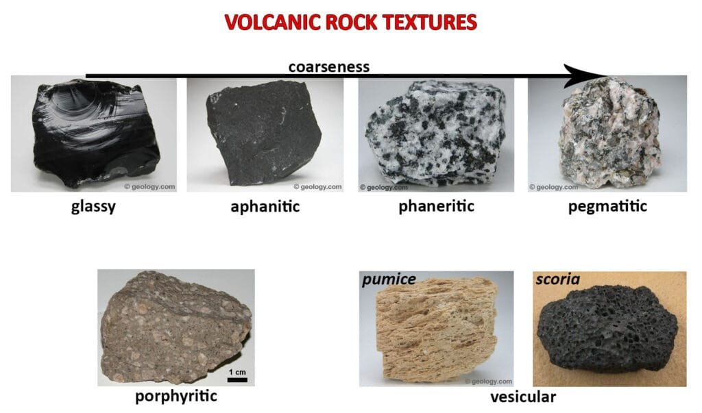
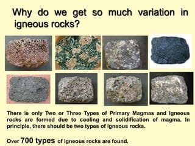
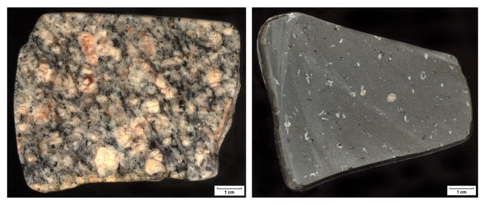
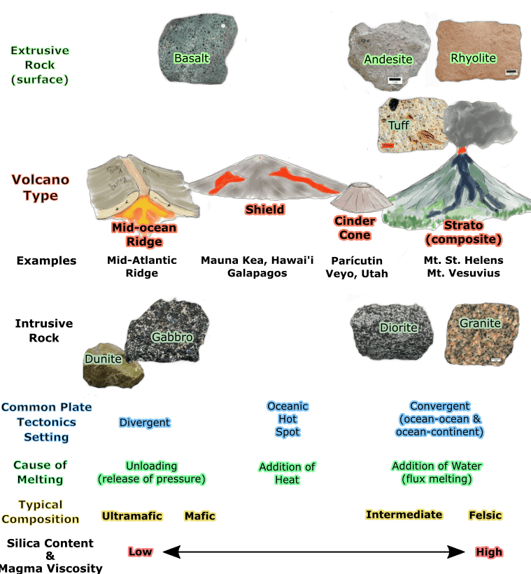

In the fascinating world of volcanoes, understanding the intricacies of volcanic rock types is essential for deciphering the secrets beneath the Earth's surface. Differentiating Volcanic Rock Types Through Color Decoding provides a comprehensive exploration of this topic, delving into the diverse array of volcanic formations and their unique characteristics. From the explosive eruptions of the "Ring of Fire" to the slowly emerging shield volcanoes in Hawaii, the eruption patterns, hazards, and benefits of various volcanoes are examined. By decoding the colors of different volcanic rock types, scientists can gain valuable insights into the past and future activity of these awe-inspiring natural wonders, ensuring the safety and well-being of surrounding communities.

<iframe width="560" height="315" src="https://www.youtube.com/embed/Zbz4e-9pjY4" frameborder="0" allow="accelerometer; autoplay; encrypted-media; gyroscope; picture-in-picture" allowfullscreen></iframe>

  

## Understanding Volcanic Rocks and Minerals

Volcanic rocks are formed from molten lava that cools and solidifies on the Earth's surface. They are classified based on their compositions and textures. These rocks are rich in minerals, which contribute to their unique characteristics and colors.

### Definition of volcanic rocks

Volcanic rocks are igneous rocks that are formed through volcanic activity. They are created when molten lava, ash, and other [volcanic materials are erupted from a volcano](https://magmamatters.com/geothermal-energy-and-its-volcanic-origins/ "Geothermal Energy and Its Volcanic Origins") and rapidly cooled. This rapid cooling allows the lava to solidify and form rocks.

### Key minerals commonly found

Volcanic rocks are composed of various minerals, with some being more abundant than others. The key minerals commonly found in volcanic rocks include quartz, feldspar, pyroxene, olivine, and amphibole. These minerals give the rocks their distinct textures and colors.

### How minerals contribute to color differences

The minerals present in volcanic rocks contribute to the diverse range of colors observed in these rocks. For example, the presence of iron-rich minerals such as hematite and pyrite can give volcanic rocks a reddish or brownish color. On the other hand, rocks with a high content of feldspar minerals may appear lighter in color, ranging from white to light gray.

## Typical Colors in Volcanic Rocks

Volcanic rocks exhibit a wide range of colors, which can vary depending on various factors such as mineral composition, weathering, and exposure to atmospheric conditions.

### General attributes of volcanic rock coloration

The color of volcanic rocks can be influenced by the presence of different minerals. For instance, rocks containing iron-rich minerals tend to have darker colors such as black or dark gray. Additionally, volcanic rocks can also display shades of red, brown, green, and even blue, depending on the mineral content.

### Impact of weathering and oxidation on rock coloration

Weathering and oxidation can significantly impact the coloration of volcanic rocks over time. When exposed to the elements, rocks can undergo chemical reactions, leading to changes in their color. For example, the oxidation of iron minerals can cause volcanic rocks to develop a reddish or brownish color.

### Effects of exposure to atmospheric conditions

Exposure to atmospheric conditions such as sunlight, moisture, and air pollutants can also affect the coloration of volcanic rocks. Ultraviolet radiation from the sun can cause some minerals to darken or fade, altering the overall color of the rocks. Additionally, moisture can promote the growth of algae or lichens on the rock's surface, further influencing its color.

This image is property of www.luckysci.com.

## Identifying Basalt Rocks

Basalt is a common type of volcanic rock that is known for its dark color and fine-grained texture. It is found in various geological settings and has distinct characteristics that help in its identification.

### Characteristics of basalt rocks including color

Basalt rocks are typically dark in color, ranging from black to dark gray. This dark color is due to the high content of mafic minerals such as pyroxene and olivine. The fine-grained texture of basalt is also a characteristic feature, resulting from its rapid cooling process.

### Geological settings where basalt is typically found

Basalt can be found in a variety of geological settings. It is often associated with volcanic activity, such as basaltic lava flows and volcanic eruptions. Basaltic rocks are commonly found in areas with extensive volcanic activity, such as volcanic islands, mid-oceanic ridges, and rift zones.

### Key minerals present in basalt

Basalt rocks are composed of several key minerals, including plagioclase feldspar, pyroxene, and olivine. These minerals contribute to the rock's color, texture, and overall composition. Plagioclase feldspar gives basalt its light gray color, while pyroxene and olivine add to its dark and dense appearance.

## Andesite Rock Properties

Andesite is another type of volcanic rock that is known for its intermediate composition and characteristic colors and textures. Understanding its properties can help in its identification and classification.

### Color and texture of andesite rocks

Andesite rocks can have various colors, ranging from gray to dark green and even reddish hues. The specific colors are determined by the presence of different minerals within the rock. Andesite also has a porphyritic texture, characterized by larger crystals embedded in a finer-grained matrix.

### Typical locations for andesite occurrence

Andesite is often found in volcanic regions and areas associated with volcanic arcs. It commonly occurs in subduction zones where oceanic crust is being pushed beneath continental crust. Volcanic complexes, volcanic islands, and volcanic cones are typical locations where andesite can be found.

### Mineral compositions of andesite

Andesite is composed of plagioclase feldspar, pyroxene, and sometimes amphibole. The plagioclase feldspar contributes to the rock's light to medium gray coloration, while the pyroxene and amphibole add darker shades. These minerals form as a result of the cooling and crystallization of magma beneath the Earth's surface.

This image is property of image.slidesharecdn.com.

## Distinguishing Rhyolite Rocks

Rhyolite is a type of volcanic rock that is known for its light-colored appearance and fine-grained texture. It can be easily distinguished from other volcanic rocks based on its characteristic features.

### Identifying rhyolite through color and texture

Rhyolite rocks are typically light in color, ranging from white to gray, yellow, or pink. This light color is due to the high content of light-colored minerals such as quartz and feldspar. Rhyolite also has a fine-grained texture, similar to basalt, but with a lighter appearance.

### Locations where rhyolite materializes

Rhyolite can be found in various geological settings, particularly in areas of volcanic activity. It is often associated with explosive volcanic eruptions, such as those occurring in calderas or volcanic domes. Rhyolitic lava flows and volcanic ash deposits are common occurrences where rhyolite materializes.

### What minerals make up rhyolite

Rhyolite is composed mainly of quartz, feldspar, and lesser amounts of biotite and hornblende. These minerals contribute to the rock's light color and fine-grained texture. Quartz gives rhyolite its glassy appearance, while feldspar adds to its overall composition and texture.

## Trachyte Rock Features

Trachyte is a volcanic rock that exhibits a range of colors and textures. Its unique characteristics can help in its identification and differentiation from other volcanic rocks.

### Characteristic colors of trachyte rocks

Trachyte rocks can display various colors, including light gray, cream, brown, and even green. These colors are influenced by the presence of different minerals, such as feldspar and mica. Trachyte can also have a banded appearance, with alternating light and dark-colored layers.

### Geological environments where trachyte is formed

Trachyte is typically formed in volcanic environments where the lava has an intermediate composition. It can occur in volcanic arcs, volcanic islands, and regions with extensive volcanic activity. Trachytic lavas are often associated with explosive eruptions, which result in the [formation of volcanic](https://magmamatters.com/understanding-volcanic-formation-a-comprehensive-guide/ "Understanding Volcanic Formation: A Comprehensive Guide") domes and cones.

### Composition of trachyte rocks

Trachyte rocks are composed of feldspar, mica, and lesser amounts of quartz and amphibole. Feldspar minerals contribute to trachyte's light gray or cream color, while mica adds darker shades. These minerals are formed through the crystallization of magma beneath the Earth's surface.

This image is property of earthathome.org.

## Dacite Volcanic Rocks

Dacite is a type of volcanic rock that is known for its medium to dark gray color and porphyritic texture. Understanding the properties of dacite can aid in its identification and differentiation from other volcanic rocks.

### Color attributes of dacite rocks

Dacite rocks are typically medium to dark gray in color, resembling shades of gray commonly associated with volcanic rocks. The exact shade can vary depending on the specific mineral composition of the rock. Dacite often appears speckled due to the presence of larger crystals embedded in a finer-grained matrix.

### Typical dacite rock sources

Dacite can be found in various geological settings, particularly in regions with volcanic activity. It often occurs in volcanic arcs, volcanic domes, and stratovolcanoes. Dacitic lava flows and volcanic ash deposits are common sources of dacite rocks.

### Key minerals found in dacite

Dacite rocks contain minerals such as plagioclase feldspar, quartz, and biotite. Plagioclase feldspar contributes to dacite's light to medium gray color, while the presence of quartz adds variation to the rock's appearance. Biotite, a dark-colored mineral, may also be present, giving dacite a speckled or mottled look.

## Color Decoding and Geographic Distribution

The colors of volcanic rocks can serve as indicators of their volcanic type and provide insights into their geographic distribution.

### Connections between volcanic rock colors and volcanic type

The colors of volcanic rocks are influenced by various factors, including mineral composition, crystal size, and texture. For example, rocks with a high content of iron-rich minerals tend to have darker colors. Lighter-colored rocks, on the other hand, may indicate a higher content of feldspar minerals. These color variations can help identify the volcanic type.

### Correlation between rock colors and geographical location

Different types of volcanic rocks are associated with specific geological settings, which can influence their colors. For instance, basalt is commonly found in volcanic islands and mid-oceanic ridges, typically displaying dark colors. On the other hand, rhyolite is often associated with explosive volcanic eruptions in calderas, exhibiting light colors. These correlations between rock colors and geographical locations aid in understanding volcanic activity.

### Influence of tectonic activity on rock coloration

Tectonic activity plays a significant role in the formation and distribution of volcanic rocks, ultimately affecting their colors. Areas with active plate boundaries or volcanic hotspots are more prone to volcanic eruptions, resulting in the formation of diverse volcanic rocks. The specific tectonic activity in a region can influence the mineral content and composition of the volcanic rocks, thus impacting their colors.

This image is property of opengeology.org.

## The Impact of Eruptions on Rock Coloration

Volcanic eruptions have a profound influence on the coloration of volcanic rocks, often resulting in distinct patterns and variations.

### The role of lava viscosity

Lava viscosity, or its resistance to flow, affects the way volcanic rocks are formed during an eruption. More viscous lava tends to trap gases within the rock, resulting in the formation of gas bubbles. These gas bubbles can create light-colored or vesicular volcanic rocks. On the other hand, less viscous lava allows gases to escape more easily, resulting in denser, darker rocks.

### How gas content influences color

The gas content within magma can have a significant impact on the coloration of volcanic rocks. For example, sulfur-rich gases can react with minerals in the rock, resulting in the formation of minerals with distinct colors. Higher gas content during an eruption can also lead to the formation of vesicular rocks, which appear lighter due to the presence of gas bubbles.

### Eruption temperature's effect on coloration

The temperature at which a volcanic eruption occurs can influence the coloration of the resulting volcanic rocks. Higher eruption temperatures can cause minerals to crystallize differently, altering their colors. Additionally, different minerals form under specific temperature conditions, contributing to the varied coloration observed in volcanic rocks.

## Tools and Techniques for Rock Identification

Identifying volcanic rocks can be done using various tools and techniques, which range from visual observations to laboratory analyses.

### On-field visual observation

Visual observation is an essential tool for identifying volcanic rocks. Characteristics such as color, texture, and crystal size can be observed and compared to known volcanic rock types. Field guides and geology reference books can aid in the identification process by providing descriptions and images of different volcanic rocks.

### Geochemical laboratory analysis

Geochemical laboratory analysis can provide further insights into the mineral composition and characteristics of volcanic rocks. Techniques such as X-ray diffraction and electron microscopy can help determine the specific minerals present in a rock sample. Chemical analysis can also be conducted to measure the elemental composition of the rock.

### Use of handheld devices and technology for color decoding

Advancements in [technology](https://magmamatters.com/the-art-and-science-of-volcano-monitoring/ "The Art and Science of Volcano Monitoring") have made it possible to use handheld devices for color decoding of volcanic rocks. Spectrometers and colorimeters can measure the specific wavelengths of light reflected by a rock, providing detailed data on its color. These devices can help identify subtle differences in color that may not be easily discernible to the human eye.

In conclusion, understanding volcanic rocks and minerals is crucial for geologists and researchers in their study of volcanic activity and its implications. By examining the colors, textures, and compositions of volcanic rocks, valuable insights can be gained regarding their formation, distribution, and the processes that occur during volcanic eruptions. Through the use of various tools and techniques, such as visual observation, laboratory analysis, and handheld devices, the identification and differentiation of volcanic rocks become more accurate and reliable.

