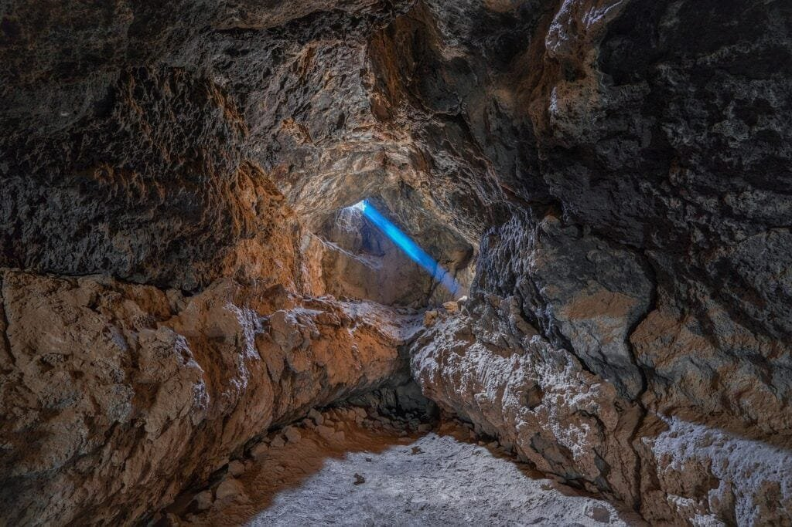

Volcanoes are not only awe-inspiring and majestic natural phenomena, but they also play a significant role in shaping the Earth's surface. In this article, we will explore the distinct rock types formed by volcanoes and understand the fascinating processes behind their formation. From the explosive eruptions of the Ring of Fire to the relatively calm shield volcanoes in Hawaii, each volcano has its unique characteristics and geological features. By uncovering the secrets behind volcanic rocks, we can gain a deeper understanding of the Earth's dynamic nature and the hazards and benefits associated with these magnificent forces of nature. So, let's embark on this volcanic adventure and discover the intriguing world of distinct rock types formed by volcanoes.

This image is property of pixabay.com.

## Why Do Volcanoes Form Distinct Rock Types?

Volcanoes are fascinating geological features that have shaped our world for millions of years. They not only create majestic landscapes, but they also produce distinct types of rocks that vary in composition, texture, and characteristics. The formation of these rock types is influenced by various factors, including plate tectonics, magma's origin, and eruption dynamics. Understanding the processes behind the formation of these rock types can provide valuable insights into the Earth's history and help us better comprehend the natural forces that shape our planet.

### Role of Plate Tectonics

Plate tectonics play a crucial role in the formation of distinct volcanic rock types. The Earth's surface is divided into several large plates that move and interact with each other. Volcanic activity primarily occurs at plate boundaries, where the movement of these plates leads to the upwelling of magma from the Earth's mantle. The type of plate boundary largely determines the kind of volcanic rock that will be formed.

At divergent plate boundaries, where plates move apart, shield volcanoes are typically formed. These types of volcanoes produce basaltic rocks, which have unique characteristics and composition. On the other hand, at convergent plate boundaries, where plates collide, stratovolcanoes are common. These volcanoes produce andesitic rocks, which differ from basaltic rocks in their composition and characteristics.

### Influence of Magma's Origin

The origin of magma is another significant factor in the formation of distinct rock types. Magma is generated in different ways and from different sources, such as melting of the Earth's mantle or the partial melting of the Earth's crust. Each source contributes different elements and minerals to the magma, resulting in varying compositions and textures of the rocks formed.

For example, shield volcanoes, which are typically associated with hotspot volcanism, produce basaltic rocks. Basaltic magma originates from the Earth's mantle and contains high amounts of iron and magnesium. This composition gives the rocks a dark color and a relatively low viscosity, allowing the lava to flow easily.

In contrast, andesitic rocks, which are commonly found in stratovolcanoes, are formed from magma that originates from the partial melting of the Earth's crust. This type of magma has a higher silica content and is richer in elements like aluminum and potassium. As a result, andesitic rocks have a lighter color and higher viscosity compared to basaltic rocks.

### Effect of Eruption Dynamics

The dynamics of volcanic eruptions also play a crucial role in shaping the distinct rock types that are formed. Different eruption styles, such as explosive eruptions or effusive eruptions, have a significant impact on the texture and characteristics of the rocks.

Explosive eruptions, characterized by the rapid release of gas and magma, result in the formation of fragmented rocks. These rocks are formed when the magma is shattered into small fragments as it is forcefully ejected from the volcano. Pumice stone and scoria rock are examples of fragmented rocks formed during explosive eruptions.

Effusive eruptions, on the other hand, are characterized by a steady flow of lava from the volcano. These eruptions result in the formation of rocks with a more uniform and solid texture. Basaltic rocks, which are formed from effusive eruptions of shield volcanoes, are a prime example of this type of volcanic rock.

## Magma's Composition Determines Rock Type

The composition of magma plays a vital role in the formation of distinct volcanic rock types. Magma is a complex mixture of molten rock, dissolved gases, and solid crystals. Understanding the components of magma and how they interact during volcanic eruptions is essential in determining the characteristics of the resulting rocks.

### Components of Magma

Magma primarily consists of three major components: liquid (melt), solids (crystals), and gas (volatiles). The liquid component is the molten rock that forms the bulk of the magma. It contains various elements and minerals, which give the magma its composition and ultimately determine the type of rock that will be formed.

Solids, also known as crystals, are another important component of magma. These crystals are formed from the solidification of previously melted rock or minerals that were present in the magma. The size, shape, and arrangement of these crystals have a significant impact on the texture and appearance of the resulting volcanic rock.

Gas, or volatiles, is the third component of magma. It consists mainly of water vapor, [carbon dioxide](https://magmamatters.com/the-art-and-science-of-volcano-monitoring/ "The Art and Science of Volcano Monitoring"), and sulfur dioxide. The presence of gas in the magma affects its viscosity and explosiveness. Higher gas content leads to more explosive eruptions, whereas lower gas content results in relatively calm effusive eruptions.

### Magma's Viscosity and Gas Content

The viscosity of magma, which refers to its resistance to flow, is a crucial factor in determining the type of volcanic rock formed. Magma viscosity is largely dependent on its silica content and temperature. High silica content increases magma viscosity, making it thicker and more resistant to flow. On the other hand, low silica content results in a less viscous magma that flows more easily.

The gas content of magma also influences its viscosity and explosiveness. Volatiles, such as water vapor and carbon dioxide, dissolved in the magma, create bubbles of gas. As magma rises to the surface during an eruption, the decrease in pressure causes these gas bubbles to expand. The presence of gas bubbles makes the magma more buoyant and less viscous, allowing it to flow more easily.

When magma with a high gas content reaches the surface, the rapid expansion of gas bubbles can lead to explosive eruptions. On the other hand, magma with lower gas content tends to produce more effusive eruptions, with the lava flowing steadily without violent explosions.

### Impact on Rock Formation

The composition, viscosity, and gas content of magma significantly impact the formation of distinct volcanic rock types. Basaltic rocks, formed from low-viscosity magma with a lower gas content, are characterized by their fine-grained texture and dark color. These rocks often have a smooth and uniform appearance due to the easy flow of lava during effusive eruptions.

Andesitic rocks, formed from higher-viscosity magma with a higher gas content, have a more intermediate texture and color. These rocks can be both fine-grained and coarse-grained, depending on the specific eruption dynamics. They tend to have a higher resistance to flow, resulting in a more explosive eruption style.

Ryolitic rocks, formed from high-viscosity magma with a high gas content, are characterized by their light color and coarse-grained texture. They have a tendency to erupt in a highly explosive manner, due to the high gas content and the high resistance to flow of the magma.

Understanding the impact of magma's composition, viscosity, and gas content on rock formation is essential in studying and predicting volcanic eruptions. It provides valuable insights into the processes that shape our planet and helps us better comprehend the geological forces responsible for the formation of distinct volcanic rock types.

<iframe width="560" height="315" src="https://www.youtube.com/embed/cjuV35Wvu8E" frameborder="0" allow="accelerometer; autoplay; encrypted-media; gyroscope; picture-in-picture" allowfullscreen></iframe>

  

## Basaltic Rocks from Shield Volcanoes

[Shield volcanoes are one of the most common types](https://magmamatters.com/understanding-volcanic-formation-a-comprehensive-guide/ "Understanding Volcanic Formation: A Comprehensive Guide") of volcanoes on Earth. They are characterized by their broad, gently sloping profile, resembling a warrior's shield. Shield volcanoes typically form over hotspots, where a localized area of the Earth's mantle is significantly hotter than its surroundings, causing magma to rise to the surface.

### Formation of Shield Volcanoes

Shield volcanoes form over thousands or even millions of years, as repeated eruptions of basaltic lava gradually build up the volcano's cone-shaped structure. The lava erupted by shield volcanoes is typically low in viscosity and gas content, allowing it to flow easily over long distances. This results in the characteristic broad, gently sloping profile of shield volcanoes.

The lava flows from shield volcanoes can be extensive, covering vast areas of land and creating massive lava fields. These flows are often characterized by their relatively low temperature and smooth, ropy texture, known as pahoehoe lava. Pahoehoe lava flows resemble a twisted, braided rope and are a distinctive feature of shield volcanoes.

### Characteristics of Basaltic Rocks

Shield volcanoes predominantly produce basaltic rocks, which have distinct characteristics that set them apart from other volcanic rock types. Basaltic rocks are typically dark in color, ranging from a deep black to a dark gray. They have a fine-grained texture, with individual mineral grains too small to be seen with the naked eye.

Basaltic rocks are rich in iron and magnesium, giving them a high density and hardness. They are also relatively low in silica content compared to other volcanic rock types. This low silica content contributes to the low viscosity of basaltic magma, allowing it to flow easily during eruptions.

### Influential Volcanoes that Form Basaltic Rocks

Some of the most influential shield volcanoes that have shaped the geological landscape and produced vast amounts of basaltic rocks include:

- The Hawaiian Islands: The Hawaiian Islands are the result of hotspot volcanism, with a series of shield volcanoes forming over a hotspot in the Earth's mantle. Mauna Loa and Kilauea are among the most well-known shield volcanoes in the Hawaiian Islands. They have both produced extensive lava flows and have been active for thousands of years.
    
- Iceland: Iceland is home to a large number of shield volcanoes due to its location on the Mid-Atlantic Ridge. The island's unique geology and positioning along the ridge result in frequent volcanic activity. The most famous shield volcano in Iceland is Snæfellsjökull, which is surrounded by glacial ice and has been an important landmark in Icelandic folklore and literature.
    
- Galápagos Islands: The Galápagos Islands, located in the Pacific Ocean off the coast of Ecuador, are another hotspot for shield volcanoes. The islands are of great scientific interest due to their unique geology and diverse ecosystems. The shield volcanoes on the islands, such as Fernandina and Sierra Negra, have shaped the landscape and provided a habitat for unique plant and animal species.
    

The basaltic rocks produced by these influential shield volcanoes have not only shaped the physical geography of their respective regions but also had significant ecological impacts on the surrounding ecosystems. The fertile soil created by basaltic rocks supports diverse plant growth and provides essential nutrients for agriculture. These shield [volcanoes](https://magmamatters.com/geothermal-energy-and-its-volcanic-origins/ "Geothermal Energy and Its Volcanic Origins") are also home to unique and specialized species that have adapted to the harsh volcanic environment.

Understanding the formation and characteristics of basaltic rocks from shield volcanoes provides valuable insights into the Earth's geology and the interactions between volcanoes and their surrounding ecosystems. It helps us appreciate the dynamic nature of our planet and the profound effects that volcanic activity can have on the environment.

## Andesitic Rocks from Stratovolcanoes

Stratovolcanoes, also known as composite volcanoes, are another common type of volcano that produces distinct rock types. Unlike shield volcanoes, stratovolcanoes are characterized by their steep and conical shape, composed of alternating layers of hardened lava, volcanic ash, and other volcanic materials.

### Formation of Stratovolcanoes

Stratovolcanoes are typically formed in subduction zones, where one tectonic plate is being forced beneath another. This process, known as subduction, occurs when an oceanic plate collides with a continental plate, causing the denser oceanic plate to sink into the Earth's mantle. The subducting plate undergoes partial melting, leading to the formation of magma that rises to the surface, resulting in the creation of stratovolcanoes.

The repeated eruptions of stratovolcanoes lead to the accumulation of layers of lava, volcanic ash, and other volcanic materials. These layers gradually build up over time, creating the characteristic steep and conical shape of stratovolcanoes.

### Characteristics of Andesitic Rocks

Stratovolcanoes primarily produce andesitic rocks, which have distinct characteristics that set them apart from other volcanic rock types. Andesitic rocks are typically light to medium gray in color, ranging from a pale gray to a bluish-gray. They have a medium to coarse-grained texture, with individual mineral grains visible to the naked eye.

Andesitic rocks are composed of minerals such as plagioclase feldspar, amphibole, and pyroxene. These minerals give the rocks their characteristic appearance and properties. Compared to basaltic rocks, andesitic rocks have a higher silica content, resulting in a higher viscosity of the magma. This higher viscosity contributes to more explosive eruptions from stratovolcanoes.

### Influential Stratovolcanoes that Form Andesitic Rocks

Some of the most influential stratovolcanoes that have shaped the Earth's geology and produced vast amounts of andesitic rocks include:

- Mount Fuji, Japan: Mount Fuji is an iconic stratovolcano located in Japan. It is one of the most famous landmarks in the country and is a UNESCO World Heritage site. Mount Fuji's symmetrical cone and picturesque beauty have made it a subject of numerous artworks and poems throughout history.
    
- Mount St. Helens, United States: Mount St. Helens is a stratovolcano located in the state of Washington in the United States. It gained worldwide attention with its cataclysmic eruption in 1980, which resulted in the collapse of its northern flank. The eruption caused significant loss of life and property and had a profound impact on the surrounding landscape.
    
- Mount Vesuvius, Italy: Mount Vesuvius is one of the most notorious stratovolcanoes in the world. It is located near the city of Naples, Italy, and is infamous for its eruption in 79 AD, which buried the cities of Pompeii and Herculaneum under layers of ash and volcanic debris. The well-preserved ruins of these ancient cities provide valuable insights into Roman life and culture.
    

These influential stratovolcanoes have not only shaped the physical landscape but also had significant cultural and historical impacts. The andesitic rocks produced by these volcanoes have been used as building materials and have been an essential part of the local culture and architecture. However, the explosive nature of stratovolcanoes poses significant risks to nearby communities, highlighting the importance of understanding their behavior and implementing appropriate risk mitigation measures.

This image is property of pixabay.com.

## Rhyolitic Rocks from Dome Volcanoes

Dome volcanoes, also known as plug volcanoes or lava domes, are a unique type of volcano that produces distinct rock types. They are characterized by their steep-sided, dome-shaped appearance and the extrusion of highly viscous magma.

### Formation of Dome Volcanoes

Dome volcanoes form when highly viscous rhyolitic magma rises to the surface but does not flow easily. The magma accumulates near the vent, forming a steep-sided dome-shaped structure. Dome volcanoes are often found within the craters of larger volcanoes or as standalone structures formed by the slow extrusion of viscous magma.

The formation of dome volcanoes is often associated with effusive eruptions, where the magma slowly oozes out from the vent and forms a growing dome over time. The growth of dome volcanoes is usually gradual and can continue over many years or even decades.

### Characteristics of Rhyolitic Rocks

Dome volcanoes primarily produce rhyolitic rocks, which have distinct characteristics that set them apart from other volcanic rock types. Rhyolitic rocks are typically light in color, ranging from white to pale pink or gray. They have a fine-grained to glassy texture, with minerals not readily visible to the naked eye.

Rhyolitic rocks are composed of minerals such as quartz, feldspar, and biotite. These minerals give the rocks their characteristic appearance and composition. Compared to basaltic and andesitic rocks, rhyolitic rocks have the highest silica content, resulting in their high viscosity and resistance to flow.

### Influential Dome Volcanoes that Form Rhyolitic Rocks

Some of the most influential dome volcanoes that have shaped the Earth's geology and produced significant amounts of rhyolitic rocks include:

- Mono-Inyo Craters, United States: The Mono-Inyo Craters are a chain of dome volcanoes located in eastern California in the United States. They are situated at the southern end of the Long Valley Caldera, a large volcanic depression. The Mono-Inyo Craters have been active for thousands of years and have produced a variety of rhyolitic and obsidian rocks.
    
- Soufrière Hills, Montserrat: The Soufrière Hills volcano is a dome volcano located on the Caribbean island of Montserrat. It became active in 1995, resulting in the evacuation of the southern part of the island. The dome growth and subsequent eruptions have resulted in the destruction of the island's capital city, Plymouth, and significant changes in the island's landscape.
    

These influential dome volcanoes have had significant impacts on their surrounding environments and communities. The rhyolitic rocks produced by these volcanoes are often used as construction materials and have been important for the local economy. However, the slow but persistent growth of dome volcanoes poses a constant threat to nearby communities, highlighting the importance of monitoring and preparedness in volcanic areas.

## Understanding Obsidian Formation in Volcanoes

Obsidian is a unique type of volcanic rock that forms when lava cools rapidly, resulting in the formation of a glass-like substance. Its distinctive appearance and properties make it an important material for tools, weapons, and decorative items.

### How Obsidian is Formed

Obsidian is formed when lava, typically rhyolitic or andesitic in composition, cools rapidly with minimal crystallization. When highly viscous magma is erupted from a volcano and quickly comes into contact with the cooler air or water, it solidifies almost instantly, creating a glass-like substance known as obsidian.

The rapid cooling prevents the mineral crystals within the lava from forming, resulting in a homogeneous, non-crystalline structure. The lack of mineral crystals gives obsidian its characteristic smooth, shiny, and jet-black appearance. However, obsidian can also occur in other colors, such as dark green, brown, gray, or even translucent.

### Characteristics of Obsidian

Obsidian is known for its unique set of characteristics that set it apart from other volcanic rock types. Its glass-like appearance and smooth texture make it a popular material for jewelry and decorative items. Obsidian is extremely sharp and can be easily fractured to produce cutting edges, making it an ideal material for tools and weapons.

Obsidian is also known for its conchoidal fracture, which means it breaks into smooth, curved surfaces resembling the inside of a seashell. This fracture pattern gives obsidian its characteristic shape and sharpness when fractured. The presence of tiny gas bubbles trapped within the rock can create a frosted appearance in some types of obsidian.

### Volcanoes that form Obsidian

Obsidian is commonly associated with dome volcanoes and stratovolcanoes where highly viscous rhyolitic or andesitic magma is erupted. Some of the notable volcanoes that have produced obsidian include:

- Mount Mazama, United States: Mount Mazama, located in Oregon, is the volcano responsible for the formation of Crater Lake. The collapse of the volcano's summit during a massive eruption around 7,700 years ago resulted in the formation of a caldera. Within this caldera, obsidian flows and domes can be found, often referred to as the "Obsidian Cliffs."
    
- Mount Hekla, Iceland: Mount Hekla is a stratovolcano located in Iceland and is one of the country's most active volcanoes. It has a long history of eruptions, and some of these eruptions have produced significant amounts of obsidian. The obsidian from Mount Hekla is often characterized by its deep black color and smooth texture.
    

The formation of obsidian plays a significant role in understanding volcanic processes and provides valuable insights into volcanic eruptions. Its unique properties have made it a useful material for human civilizations throughout history. Obsidian artifacts found in archaeological sites offer important clues about past human cultures and their interactions with volcanic environments.

This image is property of pixabay.com.

## Pumice Stone's Formation from Explosive Eruptions

Pumice stone is a lightweight and highly porous volcanic rock formed by explosive volcanic eruptions. Its unique characteristics and multiple uses have made it a valuable material in various industries, including construction, horticulture, and personal care.

### How Pumice Stone is Formed

Pumice stone forms during highly explosive volcanic eruptions when frothy magma containing a high concentration of gas bubbles is erupted into the air. The presence of trapped gas within the magma causes it to expand rapidly, resulting in a violent eruption.

As the magma is forcefully ejected from the volcano, it undergoes rapid cooling and solidification. The cooling magma rapidly releases its gas bubbles, leaving behind a rock with a highly porous texture. This rock is pumice stone, characterized by its lightweight nature and numerous interconnected gas bubbles or vesicles.

### Pumice Stone Characteristics

Pumice stone possesses several unique characteristics that make it highly valuable and versatile. Its lightweight nature is a result of the high concentration of gas bubbles within its structure, making it one of the lightest rocks on Earth. This property has made pumice stone useful in a variety of applications, including as an abrasive material in skincare products, as lightweight aggregate in concrete, and as a soil amendment in horticulture.

One of the distinctive features of pumice stone is its high porosity. The numerous interconnected gas bubbles or vesicles create a sponge-like structure that allows pumice stone to float on water. This porosity also provides excellent insulating properties, making pumice stone an ideal material for thermal and acoustic insulation.

Pumice stone varies in color, ranging from light gray or white to pink or brown, depending on the specific minerals present in the volcanic magma. It also has a gritty texture due to the presence of trapped gas bubbles, making it an effective abrasive for exfoliating the skin or polishing surfaces.

### Volcanoes that form Pumice Stone

Pumice stone is predominantly formed during explosive eruptions from volcano types such as stratovolcanoes and pyroclastic cones. Some notable volcanoes that have produced significant amounts of pumice stone include:

- Mount Vesuvius, Italy: Mount Vesuvius, located near Naples, Italy, is infamous for its devastating eruption in 79 AD that buried the cities of Pompeii and Herculaneum. This eruption produced vast quantities of pumice stone, which covered the surrounding landscape and contributed to the preservation of the ancient cities.
    
- Mount Pinatubo, Philippines: Mount Pinatubo is an active stratovolcano located in the Philippines. Its eruption in 1991 was one of the most significant volcanic eruptions of the 20th century. The eruption expelled massive amounts of pumice stone and ash, causing widespread damage and significant changes in the landscape.
    

The formation of pumice stone plays a crucial role in understanding the destructive potential of explosive volcanic eruptions. Its unique properties and diverse applications highlight the importance of volcanic materials in various industries and their impact on human activities.

## Scoria Rock Formation from Cinder Cone Volcanos

Cinder cones are small and steep-sided volcanoes that produce a type of volcanic rock known as scoria. Scoria rocks are characterized by their dark color, highly vesicular texture, and lightweight nature. Understanding the formation and characteristics of scoria rocks provides valuable insights into volcanic processes and the geological history of an area.

### How Scoria Rock is Formed

Scoria rock is formed during explosive eruptions from cinder cone volcanoes. Cinder cones are formed when gas-rich magma is erupted into the air and cools rapidly, resulting in the formation of small, pyroclastic fragments. These fragments, known as cinders or scoria, are made up of small, frothy lava droplets.

As the gas-rich magma is ejected from the volcano, it undergoes rapid cooling and solidification. The cooling magma releases gas bubbles and transforms into solid scoria rock. The presence of numerous gas bubbles or vesicles gives scoria its highly vesicular texture and lightweight nature.

### Scoria Rock Characteristics

Scoria rocks possess distinctive characteristics that differentiate them from other volcanic rock types. They are typically dark in color, ranging from deep red or black to brown or dark gray. The color is determined by the specific mineral composition and the degree of oxidation undergone by the scoria.

Scoria rocks have a highly vesicular texture, characterized by numerous interconnected gas bubbles or vesicles. These vesicles can vary in size, ranging from small, microscopic cavities to larger, visible holes. The presence of vesicles gives scoria its lightweight nature and porous structure.

The porosity of scoria makes it an excellent material for insulation and filtration. Its lightweight nature also makes it suitable for lightweight aggregate in construction materials such as concrete.

### Cinder Cone Volcanoes that Form Scoria Rock

Scoria rock is predominantly formed during explosive eruptions from cinder cone volcanoes. Cinder cones are typically small and conical, often composed of loose pyroclastic material. Some notable cinder cone volcanoes that have produced significant amounts of scoria include:

- Parícutin, Mexico: Parícutin is a cinder cone volcano located in the state of Michoacán, Mexico. It is one of the youngest volcanoes in the world, having formed in 1943. The eruption of Parícutin lasted for several years, resulting in the rapid growth of the cinder cone and the formation of extensive scoria deposits.
    
- Sunset Crater, United States: Sunset Crater is a cinder cone volcano located in Arizona, United States. It is part of the San Francisco volcanic field and formed approximately 900 years ago. The eruption of Sunset Crater created a large cone-shaped structure and resulted in the deposition of scoria rocks in the surrounding area.
    

The formation of scoria rock from cinder cone volcanoes demonstrates the explosive nature of volcanic eruptions and their ability to shape the landscape. The unique characteristics of scoria make it a valuable resource in various industries and provide insights into the geology of the region.

## Volcanic Bomb Formation from Violent Eruptions

Volcanic bombs are large, spherical rocks that are ejected during volcanic eruptions and solidify before hitting the ground. They are typically formed from highly viscous magma that undergoes rapid cooling and solidification while being propelled through the air. Understanding the formation and characteristics of volcanic bombs provides valuable insights into the explosive nature of certain volcanic eruptions.

### How Volcanic Bombs are Formed

Volcanic bombs are formed during highly explosive eruptions when viscous magma is forcibly ejected from the volcano. The magma is projected through the air in a molten state but rapidly cools and solidifies before reaching the ground. The process of cooling and solidification shapes the magma into large, spherical or ellipsoidal bombs.

During their flight through the air, volcanic bombs often undergo further deformation. This can result in the formation of various shapes and structures, including elongated or streamlined forms. The size of volcanic bombs can range from a few centimeters to several meters in diameter, depending on the specific eruption dynamics.

The formation of volcanic bombs is typically associated with highly explosive volcanic eruptions, where the ejection of magma is forceful and violent.

### Characteristics of Volcanic Bombs

Volcanic bombs possess several distinctive characteristics that set them apart from other volcanic rock types. They are typically spherical or ellipsoidal in shape and have smooth or slightly rough surfaces. The smoothness of the surface is a result of the rapid cooling and solidification of the magma during flight through the air.

Volcanic bombs can vary in size, ranging from small projectiles to large boulders. The size is determined by various factors, including the initial velocity of the ejecta, the viscosity of the magma, and the length of the flight path.

The composition of volcanic bombs is dependent on the specific composition of the magma from which they are formed. Therefore, volcanic bombs can be composed of various rock types, including basalt, andesite, dacite, or rhyolite.

### Volcanoes Known for Volcanic Bomb Eruptions

Volcanic bombs are commonly associated with highly explosive volcanoes that produce viscous magma. Some notable volcanoes known for their volcanic bomb eruptions include:

- Stromboli, Italy: Stromboli is a stratovolcano located in the Aeolian Islands, Italy. It is one of the most active volcanoes in the world and is known for its nearly continuous explosive activity. The eruptions from Stromboli often produce volcanic bombs that are ejected into the air and fall around the summit area.
    
- Mount Mayon, Philippines: Mount Mayon is an active stratovolcano located in the Philippines. It is well-known for its perfectly symmetrical cone and frequent eruptions. The eruption plumes from Mount Mayon often contain volcanic bombs that are ejected from the volcano's summit and deposited on its slopes.
    

Understanding the formation and characteristics of volcanic bombs provides valuable insights into the eruptive behavior of volcanoes and the potential hazards associated with explosive volcanic eruptions. The study of volcanic bombs contributes to our understanding of volcanic processes and helps in the development of hazard mitigation strategies.

## Impacts of Distinct Volcanic Rock Types on Ecosystems

Volcanic eruptions have a profound impact on the environment, including both positive and negative effects on ecosystems. The distinct types of volcanic rock formed during eruptions play a vital role in shaping the surrounding landscape and influencing the ecological dynamics of the affected regions.

### Soil Enrichment from Volcanic Soil

Volcanic rocks, particularly basaltic rocks, have a significant impact on soil composition and fertility. When basaltic lava flows into an area, it breaks down into small particles over time, resulting in the formation of volcanic soil. Volcanic soil is known for its high nutrient content and excellent moisture retention properties, making it highly fertile.

Volcanic soil is rich in minerals such as potassium, magnesium, and phosphorous, which are essential for plant growth. These minerals are easily accessible to plant roots, promoting healthy growth and enhancing crop yields. Volcanic soil also has favorable drainage properties, ensuring that excess water does not accumulate around plant roots, which can lead to root rot.

The fertility of volcanic soil has made volcanic regions highly suitable for agriculture. Farmers in areas with volcanic soil often benefit from higher crop yields and increased productivity. The rich volcanic soil also supports the growth of unique plant species, contributing to the biodiversity of volcanic ecosystems.

### Habitat Formation from Volcanic Rock

Distinct volcanic rock types create diverse habitats that support a wide range of plant and animal species. Volcanic landscapes, with their unique topography and rock formations, offer various microhabitats that provide different niches for plant and animal life.

For instance, basaltic lava flows create a barren landscape initially, but over time, pioneer plant species colonize the rocks, eventually leading to a thriving ecosystem. Mosses, lichens, and small herbaceous plants are often the first to establish themselves on the rocky surfaces. These plants create a favorable environment for other plant species, gradually leading to the establishment of a diverse plant community.

The distinct features of volcanic rock formations, such as cracks, crevices, and caves, offer shelter and nesting sites for a variety of animal species. Insects, reptiles, and birds often find refuge in these rock formations. Additionally, volcanic rock offers substrate options for the attachment and growth of various marine organisms, contributing to the creation of rich marine ecosystems.

The habitat diversity created by distinct volcanic rock types supports a wide array of plant and animal species, contributing to the overall biodiversity of volcanic regions.

### Negative Ecological Impacts of Volcanic Rocks

While volcanic eruptions provide favorable conditions for certain plant and animal species, they can also have negative ecological impacts on the surrounding environment.

The deposition of volcanic ash and rock fragments during explosive eruptions can cover vegetation, leading to its destruction. Plant species not adapted to the harsh conditions of volcanic environments may struggle to survive. Additionally, the weight of volcanic ash can cause structural damage to trees and other plants.

In the case of highly explosive eruptions, the release of toxic gases can have devastating effects on local ecosystems. High concentrations of sulfur dioxide and other noxious gases can lead to the loss of vegetation and damage to animal respiratory systems. The ashfall resulting from explosive eruptions can smother aquatic ecosystems, suffocating fish and other aquatic organisms.

Volcanic eruptions can also trigger other natural hazards, such as landslides, lahars (volcanic mudflows), and pyroclastic flows. These phenomena can cause significant damage to ecosystems, including the destruction of habitats and the loss of plant and animal life.

Understanding the impacts of distinct volcanic rock types on ecosystems is essential for assessing the potential risks associated with volcanic eruptions. It also emphasizes the need for effective conservation strategies to protect the unique biodiversity found in volcanic regions.

In conclusion, the formation of distinct rock types by volcanoes is a fascinating process that is influenced by various factors such as plate tectonics, magma composition, and eruption dynamics. The composition and characteristics of the volcanic rocks produced, including basaltic rocks, andesitic rocks, ryolitic rocks, obsidian, pumice stone, scoria rock, and volcanic bombs, have significant ecological impacts on surrounding ecosystems. From soil enrichment to habitat formation, volcanic rocks shape the landscape and support diverse plant and animal species. Understanding the processes behind the formation of these rock types not only provides insights into the Earth's geological history but also helps us better comprehend the environmental forces that drive ecosystem dynamics. With this knowledge, we can work towards the sustainable management of volcanic regions and mitigate the potential risks associated with volcanic eruptions.

