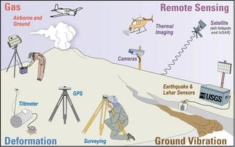

Are you fascinated by the raw power and unpredictable nature of volcanoes? If so, you're not alone. Volcanoes have captivated scientists and adventurers alike for centuries. But understanding these mighty forces of nature is not just a matter of curiosity; it's also a matter of safety. In order to minimize the risks associated with volcanic activity, scientists have developed essential techniques for monitoring volcanoes. By closely studying their behavior, scientists can detect warning signs of eruptions and provide crucial information for communities and governments to prepare and respond. In this article, we will explore the key techniques used in monitoring volcanoes and how they contribute to our understanding of these majestic yet dangerous natural phenomena.

<iframe width="560" height="315" src="https://www.youtube.com/embed/t3Bm_xUgFms" frameborder="0" allow="accelerometer; autoplay; encrypted-media; gyroscope; picture-in-picture" allowfullscreen></iframe>

  

## Monitoring Seismic Activity

### Utilizing Seismometers to Detect Underground Movements

One of the most essential techniques for monitoring volcanoes is the use of seismometers to detect underground movements. Seismometers are devices that measure and record the vibrations of the Earth, including seismic waves caused by volcanic activity. By analyzing the seismic data collected by these instruments, scientists can gain valuable insights into the behavior of volcanoes.

Seismometers are strategically placed around active volcanoes to effectively monitor seismic activity. These devices can detect various types of seismic waves, such as P-waves and S-waves, which provide information about the location and intensity of volcanic activity. By tracking the frequency, amplitude, and duration of these waves, scientists can determine the size and depth of volcanic events, as well as the movement of magma beneath the surface.

### Analyzing Seismic Patterns for Eruption Predictions

Analyzing seismic patterns is crucial for predicting volcanic eruptions. By studying the frequency and intensity of seismic events leading up to an eruption, scientists can identify precursory signs and issue early warnings to at-risk communities. Changes in seismic activity, such as an increase in the number of small earthquakes or the occurrence of harmonic tremors, can indicate the movement of magma and the build-up of pressure beneath the volcano.

Seismic monitoring also helps scientists differentiate between different types of volcanic eruptions. For example, a sudden increase in the amplitude of volcanic tremors accompanied by low-frequency events may suggest an explosive eruption, while a gradual increase in shallow volcanic earthquakes may indicate a less explosive eruption with the potential for lava flows.

### Role of Seismic Tomography in Understanding Volcanic Structures

Seismic tomography plays a vital role in understanding the internal structures of volcanoes. This technique involves analyzing the seismic waves produced by volcanic activity to create detailed images of the subsurface. By utilizing data from multiple seismometers positioned around the volcano, scientists can construct three-dimensional models that reveal the distribution of magma chambers, fractures, and other geological features.

Seismic tomography provides valuable information about the depth, size, and composition of magma reservoirs, which are crucial factors in determining the behavior of volcanoes. This technique helps scientists identify potential pathways for magma ascent and eruption, as well as understand the dynamics of volcanic systems. By combining seismic tomography with other monitoring techniques, scientists can gain a comprehensive understanding of volcanic structures and make more accurate predictions about eruption timing and style.

## Gas Emission Monitoring

### Methods for Measuring Sulphur Dioxide and Carbon Dioxide Levels

Monitoring gas emissions from volcanoes is essential for understanding their activity and assessing potential hazards. Two critical gases monitored are sulphur dioxide (SO2) and carbon dioxide (CO2). Methods for measuring these gases include ground-based gas analyzers, remote gas sensors, and satellite-based monitoring systems.

Ground-based gas analyzers, such as multi-gas analyzers and spectrometers, are commonly used near active volcanoes to measure concentrations of SO2 and CO2. These instruments sample the air and analyze its chemical composition, providing valuable data on gas emissions. Remote gas sensors utilize infrared spectroscopy to detect and quantify volcanic gases from a safe distance, allowing for continuous monitoring without direct access to volcanic areas.

Satellite-based monitoring systems, such as the Ozone Monitoring Instrument (OMI) and the Tropospheric Emission Monitoring Internet Service (TEMIS), provide a global perspective on volcanic gas emissions. These satellite sensors can detect and track SO2 and CO2 plumes over large areas, providing valuable information about the magnitude and dispersion of volcanic gases.

### Correlation between Gas Emission and Volcanic Activities

There is a strong correlation between gas emissions and volcanic activities, making gas monitoring a crucial tool for volcano monitoring. Changes in the composition and quantity of emitted gases can provide insight into the movement and behavior of magma beneath the volcano. Increased gas emissions, especially of SO2, often indicate a rise in volcanic activity and can be an early warning sign of an impending eruption.

Monitoring gas emissions also helps scientists understand the environmental impact of volcanic eruptions. Volcanic gases, such as sulphur dioxide and hydrogen sulfide, can have significant effects on air quality, climate, and human health. By studying gas emissions, scientists can assess the potential hazards and develop strategies to mitigate the impact on both local and global scales.

### Understanding of Fumarolic Gas Chemistry

Fumaroles are openings in the Earth's crust that emit volcanic gases and steam. Monitoring the chemistry of fumarolic gases provides valuable insights into the inner workings of volcanoes. Fumarolic gas composition can vary depending on factors such as the depth of the magma chamber, the surrounding rock type, and the degree of volcanic unrest.

Analyzing the chemistry of fumarolic gases can help scientists identify different volcanic processes and monitor changes over time. For example, changes in the ratio of certain gases, such as [sulfur dioxide to carbon](https://magmamatters.com/the-art-and-science-of-volcano-monitoring/ "The Art and Science of Volcano Monitoring") dioxide, can indicate shifts in volcanic activity and the potential for an eruption. By continuously monitoring fumarolic gases, scientists can gather data that contributes to a deeper understanding of volcanic systems and their behavior.

This image is property of d9-wret.s3.us-west-2.amazonaws.com.

## Analyzing Ground Deformation

### Tools like GPS and InSARs to Track Ground Changes

Ground deformation, or changes in the shape and elevation of the land surface, is an important indicator of volcanic activity. Various tools and techniques are used to track ground changes, including Global Positioning System (GPS) receivers and Interferometric Synthetic Aperture Radar (InSAR).

GPS receivers consist of multiple ground-based stations that measure the precise locations of points on the Earth's surface. By monitoring these points over time, scientists can detect and measure even subtle changes in ground position and elevation. GPS data helps track the movement of magma beneath the volcano, as well as the deformation of the surrounding rock due to volcanic activity.

InSAR, on the other hand, utilizes satellite-based radar imagery to measure ground deformation. By comparing multiple radar images acquired over different time periods, InSAR can detect and quantify surface changes caused by volcanic activity. This technique is particularly useful for monitoring large-scale ground deformation associated with volcanic unrest, such as uplift or subsidence.

### Assessing Volcano Bulging using Tiltmeters

Tiltmeters are instruments used to measure changes in the tilt of the Earth's surface. These devices are instrumental in assessing volcano bulging, which occurs when pressure from rising magma causes the ground to deform and expand. By monitoring changes in tilt, scientists can determine the level of volcanic unrest and predict the potential for an eruption.

Tiltmeters are typically installed in boreholes or along the flanks of a volcano. They consist of sensitive sensors that can detect even small changes in tilt. As magma accumulates beneath the surface, the ground begins to deform and tilt in response to the increased pressure. By continuously measuring the tilt, scientists can assess the rate and magnitude of volcano deformation, providing valuable information for eruption forecasting and hazard assessment.

### Associate Ground Deformation with Volcanic Unrest

Monitoring ground deformation is crucial for associating the observed changes with volcanic unrest. By combining data from tools like GPS, InSAR, and tiltmeters, scientists can develop a comprehensive understanding of the underlying volcanic processes and assess the level of risk to surrounding communities.

Ground deformation often occurs in conjunction with other volcanic indicators, such as seismic activity and gas emissions. By analyzing the spatial and temporal relationships between these signals, scientists can determine the likelihood of an eruption and issue appropriate warnings and evacuation orders. Understanding the complex interplay between ground deformation and other monitoring parameters is essential for effective volcano surveillance and risk management.

## Hydrological Monitoring

### Examining Changes in Thermal Springs and Gas Emissions from Ground Water

Hydrological monitoring plays a significant role in understanding volcanic activity and associated hazards. Examining changes in thermal springs and gas emissions from groundwater can provide valuable insights into the behavior of volcanoes.

Thermal springs are natural hot water sources that emerge from the ground near volcanic areas. These springs are often associated with the upwelling of hot fluids from the underlying volcanic system. Monitoring changes in the temperature and chemistry of thermal springs can indicate variations in the heat and fluid transfer within the volcano. Significant changes in these parameters may suggest increased volcanic activity and the potential for an eruption.

Gas emissions from groundwater, such as [carbon dioxide and hydrogen sulfide](https://magmamatters.com/understanding-volcanic-formation-a-comprehensive-guide/ "Understanding Volcanic Formation: A Comprehensive Guide"), can also provide important information about volcanic processes. These gases can be dissolved in groundwater as it circulates through the volcanic system. Monitoring the composition and quantity of gases released by groundwater can help scientists identify changes in magma degassing and hydrothermal activity, providing valuable insights into the overall state of volcanic unrest.

### Impact of Seismic Activities on Underground Water Systems

Seismic activities associated with volcanic unrest can have a significant impact on underground water systems. Earthquakes caused by volcanic activity can disrupt aquifers and alter the flow of groundwater within a volcanic system. Understanding these impacts is crucial for assessing the potential for volcanic-induced flooding, landslides, and other hydrological hazards.

Seismic waves generated by volcanic earthquakes can cause the fracturing and collapse of aquifer systems, leading to changes in water availability and quality. Ground shaking can also trigger the release of gases dissolved in groundwater, resulting in the sudden ejection of water and steam. By monitoring seismic activities and their effects on underground water systems, scientists can better understand the hydrological response to volcanic unrest and develop strategies to mitigate associated hazards.

### Tracking Volcanic-induced Tsunamis

Volcanic eruptions can trigger tsunamis, which are massive sea waves capable of causing widespread devastation. Hydrological monitoring plays a crucial role in tracking volcanic-induced tsunamis and issuing timely warnings to coastal communities.

During a volcanic eruption, the explosive release of magma and gas can generate powerful shockwaves that propagate through the ocean. These shockwaves can produce tsunamis, which can travel great distances and impact coastal areas. By monitoring changes in sea level, coastal monitoring stations can detect the onset of a tsunami and provide immediate warnings to at-risk populations.

Hydrological monitoring also helps scientists understand the factors that contribute to the generation and propagation of volcanic-induced tsunamis. By analyzing data from tide gauges, buoys, and other monitoring systems, scientists can study the characteristics of tsunami waves and develop models to predict their behavior. This knowledge is crucial for coastal planning and emergency preparedness in volcanic regions.

This image is property of volcanofoundation.org.

## Aerial Surveillance

### Use of Drones to Capture Real-Time Images & Data

Aerial surveillance using drones has revolutionized volcano monitoring, allowing for the capture of real-time images and data from areas that are otherwise inaccessible or dangerous. Drones equipped with high-resolution cameras and specialized sensors provide valuable insights into volcanic processes and help scientists make informed decisions during volcanic crises.

Drones can be deployed to capture detailed images and videos of volcanic features such as craters, vents, and lava flows. These visuals provide scientists with valuable information about the size, shape, and activity of volcanic eruptions. Drones can also be equipped with thermal cameras to detect and map thermal anomalies associated with volcanic activity, such as hotspots and lava flows.

In addition to visual data, drones can collect other types of information, such as gas samples and atmospheric measurements. This allows scientists to assess the chemical composition of volcanic gases, track the dispersion of ash clouds, and monitor changes in air quality in real-time. The use of drones in aerial surveillance has greatly enhanced our understanding of volcanic processes and improved the accuracy of eruption predictions.

### Studying Volcanic plumes using Satellite Imagery

Satellite imagery is another important tool for aerial surveillance of volcanoes. Satellites equipped with high-resolution cameras and advanced sensors provide a wide-area view of volcanic plumes and ash clouds, offering valuable insights into the magnitude and dynamics of volcanic eruptions.

Satellite imagery helps scientists track the movement and dispersion of volcanic plumes, which are columns of gas, ash, and volcanic debris ejected from an erupting volcano. By analyzing the shape, size, and composition of these plumes, scientists can estimate the amount of material being ejected, monitor the direction of ash transport, and assess the potential impact on aviation and air quality.

Satellite data also allows for the detection and monitoring of volcanic hotspots, which are regions of intense heat associated with volcanic activity. These hotspots can indicate the presence of lava flows, new vents, or other volcanic features. By continuously monitoring volcanic hotspots using satellite imagery, scientists can track changes in volcanic activity and provide up-to-date information to relevant authorities and communities at risk.

### LiDAR technology for Mapping Volcanic Topography

LiDAR (Light Detection and Ranging) technology is commonly used in aerial surveillance to map the topography of volcanic areas. LiDAR uses laser pulses to accurately measure the distance between the sensor and the Earth's surface, creating high-resolution digital elevation models (DEMs).

By conducting LiDAR surveys of volcanic regions, scientists can generate detailed and precise three-dimensional models of the land surface. This information is crucial for understanding the morphology of volcanoes, including the shape of their craters, lava flows, and other features. LiDAR data also provides valuable information about the extent and distribution of volcanic deposits, which can help assess the potential impact of future eruptions.

LiDAR technology has greatly improved our ability to map and analyze volcanic topography, enabling scientists to better understand the dynamics of volcanic systems. By combining LiDAR data with other monitoring techniques, researchers can gain comprehensive insights into the structure, evolution, and hazards posed by volcanoes.

## Geological Studies

### Analyzing Rock and Ash Samples

Geological studies of rocks and ash samples are essential for understanding the history and behavior of volcanoes. By analyzing the composition, texture, and mineralogy of these samples, scientists can reconstruct the eruption history of a volcano and gain insights into its future activity.

Volcanic rocks and ash preserve valuable information about past eruptions. By studying the different layers and deposits, scientists can determine the frequency and style of volcanic activity over time. They can also identify the type of volcano responsible for the eruption, such as stratovolcano or shield volcano, and assess its potential for future eruptions.

Analyzing the chemical composition of rocks and ash samples can also provide insights into the source of magma and the processes occurring within the volcanic system. By studying the presence and abundance of certain elements and minerals, scientists can infer the temperature, pressure, and depth conditions at which the magma formed and evolved. This information is crucial for understanding the behavior and potential hazards of a volcano.

### Understanding Volcanic Eruption History Through Geological Layers

Geological layers, or stratigraphy, provide valuable information about the eruption history of a volcano. By studying the sequence of volcanic deposits, scientists can reconstruct the order and timing of past eruptions, as well as identify any recurring patterns.

Each volcanic eruption produces distinct layers of deposits, such as ash, pumice, and lava flows. By analyzing the thickness, composition, and structure of these layers, scientists can determine the magnitude and style of past eruptions. They can also correlate the deposits from different eruptions to understand the spatial extent and distribution of volcanic materials.

Understanding the eruption history of a volcano is crucial for predicting future activity. By identifying patterns and trends in past eruptions, scientists can estimate the likelihood and potential impacts of future eruptions. This information is essential for hazard assessment, land-use planning, and the safety of communities living near volcanoes.

### Role of Geochronology in Predicting Future Activities

Geochronology plays a crucial role in predicting future volcanic activities. Geochronology is the science of dating geological materials and events, providing valuable information about the timing and frequency of past volcanic eruptions.

By analyzing the radioactive decay of certain isotopes within volcanic rocks and minerals, scientists can determine their age. This age dating allows them to establish a timeline of volcanic activity and assess the recurrence interval of eruptions.

Geochronological data can also help scientists identify dormant or extinct volcanoes that may still pose a threat. By dating volcanic deposits and determining the time since the last eruption, scientists can estimate the potential for reawakening or renewed volcanic activity.

By combining geochronological data with other monitoring techniques, scientists can gain a better understanding of the temporal behavior of volcanoes and make more accurate predictions about future eruptions. This knowledge is essential for managing volcanic hazards and ensuring the safety of communities living in volcanic regions.

This image is property of www.frontiersin.org.

## Temperatures Monitoring

### Usage of Thermometers and Thermal Cameras

Monitoring temperatures is crucial for understanding the behavior of volcanoes and predicting eruptive activity. Thermometers and thermal cameras provide valuable insights into the temperature changes associated with magma movement and volcanic processes.

Thermometers are commonly used to measure the temperature of volcanic gases, fumaroles, and thermal springs. By continuously monitoring these temperatures, scientists can detect changes that may indicate variations in volcanic activity. For example, a sudden increase in fumarole temperature might suggest an inflow of hotter volcanic gases, while a decrease might indicate a decline in volcanic activity.

Thermal cameras, on the other hand, allow scientists to capture images of the heat emitted by volcanic features. By analyzing these images, they can identify areas of increased thermal activity, such as lava flows, lava domes, or areas of fresh volcanic ejecta. Thermal monitoring also helps track changes in the temperature distribution within a volcano, providing insights into magma movement and eruption potential.

### Monitoring Fluctuations of Magma Temperature

Monitoring the fluctuations of magma temperature is crucial for understanding the dynamics of volcanic systems. By studying the temperature changes of magma over time, scientists can gain insights into the behavior of volcanoes, such as the movement of magma within the volcano and the potential for eruption.

Volcanic magma is a mixture of molten rock, gases, and solid crystals. Its temperature can vary depending on its composition and depth within the volcano. By monitoring the temperature of magma chambers and conduits, scientists can detect changes that may indicate magma movement and the accumulation of new magma beneath the volcano.

Temperature monitoring can be done using specialized instruments, such as thermal probes or thermal imaging techniques. These techniques allow scientists to measure the heat emitted by magma and track its temperature changes over time. By continuously monitoring magma temperature, scientists can gather data that contributes to a better understanding of volcanic processes and improves eruption forecasting capabilities.

### Relation between Volcanic Temperature and Eruptive Behavior

There is a strong relationship between volcanic temperature and eruptive behavior. Changes in volcanic temperature can provide valuable insights into the state of volcanic activity and the likelihood of an eruption.

An increase in volcanic temperature often indicates the ascent of hotter magma from deeper within the Earth's crust. This influx of hot magma can cause an increase in volcanic activity and the potential for explosive eruptions. Monitoring the temperature changes in volcanic systems, such as the temperature of fumaroles or thermal springs, can therefore provide crucial information about the current state of volcanic unrest.

On the other hand, a decrease in volcanic temperature can suggest a decrease in volcanic activity. This cooling trend may be caused by the emplacement of cooler magma, the loss of volcanic gases, or the waning of volcanic unrest. By monitoring the temperature changes in volcanic systems, scientists can assess the potential for eruptive behavior and issue appropriate warnings and advisories to at-risk communities.

## Acoustic Monitoring

### Role of Infrasound Sensors in Detecting Invisible Explosions

Acoustic monitoring using infrasound sensors plays a crucial role in detecting invisible explosions associated with volcanic activity. Infrasound refers to sound waves with frequencies below the threshold of human hearing, typically below 20 Hz. Infrasound sensors are capable of detecting and analyzing these low-frequency waves produced by volcanic explosions.

Invisible explosions, also known as phreatomagmatic explosions, occur when magma comes into contact with water, resulting in a rapid release of steam and volcanic gases. These explosions may not be visible to the naked eye, but they generate distinct infrasound signals that can be detected and analyzed using specialized sensors.

By monitoring infrasound signals, scientists can detect and locate volcanic explosions that may go unnoticed by other monitoring techniques. Infrasound data can provide valuable information about the intensity, duration, and frequency content of volcanic explosions, enabling scientists to assess the potential hazards and issue appropriate warnings to nearby communities.

### Perception of Stress Wave Propagation Using Hydroacoustic Systems

Hydroacoustic systems are used to perceive the propagation of stress waves in water bodies associated with volcanic activity. These systems consist of submerged sensors that detect and measure the underwater pressure changes generated by volcanic explosions or other seismic events.

During a volcanic eruption, explosions and seismic activity can generate powerful pressure waves that propagate through the surrounding water bodies. By monitoring these pressure waves using hydroacoustic systems, scientists can gain valuable insights into the timing and intensity of volcanic activity.

Hydroacoustic data helps scientists understand the dynamics of volcanic explosions and their potential impact on nearby water bodies. By analyzing the characteristics of underwater pressure waves, such as their amplitude and frequency, scientists can estimate the size and energy of volcanic explosions. This information is crucial for assessing the hazards posed by volcanic-induced tsunamis and other hydrological phenomena.

### Determining Eruption Size from Acoustic Waves

Acoustic waves generated by volcanic eruptions carry valuable information about the size and intensity of the eruption. By analyzing these waves using specialized sensors and monitoring techniques, scientists can determine the scale and characteristics of volcanic eruptions.

The amplitude, frequency, and duration of acoustic waves can provide insights into the energy released during an eruption. By quantifying these parameters, scientists can estimate the volume of erupted material, the height of ash plumes, and the potential for associated hazards, such as pyroclastic flows or lahars.

Determining the eruption size from acoustic waves is crucial for assessing the potential impacts on aviation, air quality, and surrounding communities. By combining acoustic data with other monitoring techniques, such as visual observations and satellite imagery, scientists can develop a comprehensive understanding of volcanic eruptions and make informed decisions to protect lives and property.

This image is property of www.nps.gov.

## Atmospheric Studies

### Impact of Volcanic Aerosols on Climate

Volcanic aerosols, tiny solid or liquid particles suspended in the atmosphere, can have a significant impact on climate. During volcanic eruptions, vast amounts of dust, ash, and sulfurous gases are ejected into the atmosphere, where they can remain for months or even years.

Volcanic aerosols can affect the climate in several ways. They can reflect incoming solar radiation back into space, leading to global cooling. The small particles can also act as nuclei for cloud formation, potentially altering precipitation patterns. Additionally, volcanic aerosols can interact with atmospheric chemistry, affecting the ozone layer and contributing to air pollution.

By studying the composition and dispersion of volcanic aerosols, scientists can better understand their impact on climate and develop models to predict their behavior. Atmospheric studies provide valuable insights into the long-term effects of volcanic eruptions and contribute to the broader understanding of [climate change](https://magmamatters.com/geothermal-energy-and-its-volcanic-origins/ "Geothermal Energy and Its Volcanic Origins").

### Assessing Air Quality Near Active Volcanoes

Monitoring air quality near active volcanoes is crucial for protecting the health and well-being of nearby communities. Volcanic eruptions release a wide range of gases, particles, and hazardous substances into the atmosphere, which can pose significant risks to human health.

Volcanic gases, such as sulfur dioxide and hydrogen sulfide, can cause respiratory problems and contribute to the formation of acid rain. Fine particles, known as volcanic ash, can irritate the respiratory system and cause eye irritation. Volcanic ash can also damage infrastructure, disrupt transportation, and contaminate water sources.

By continuously monitoring air quality near active volcanoes, scientists can assess the risks and issue appropriate warnings and advisories to communities. This monitoring involves the use of air quality sensors, particulate matter analyzers, and gas analyzers deployed in strategic locations. Real-time air quality data can help inform evacuation plans, health advisories, and mitigation strategies in volcanic regions.

### Use of Weather Radars to Track Ash Clouds and Plumes

Weather radars are valuable tools for tracking and monitoring ash clouds and plumes generated by volcanic eruptions. These radar systems use radio waves to detect and track the movement of particles in the atmosphere, including volcanic ash.

During a volcanic eruption, large amounts of ash are ejected into the atmosphere, forming dense clouds that can travel long distances. Weather radars can detect and characterize these ash clouds, providing valuable information about their location, composition, and movement.

By analyzing radar data, scientists can track the dispersion of ash clouds, estimate their height and thickness, and predict their potential impact on aviation and air quality. This information is crucial for air traffic management, providing real-time updates to pilots and air traffic controllers about hazardous airspace conditions. Weather radars also help in issuing timely warnings to communities living downwind of an erupting volcano, informing them about potential ashfall and associated health risks.

## Advanced Computer Modeling

### Use of Mathematical Models to Predict Eruptions

Advanced computer modeling plays a crucial role in predicting volcanic eruptions and assisting in hazard assessment. Mathematical models are developed based on physical principles and empirical data to simulate and forecast the behavior of volcanoes.

These models take into account various factors, such as magma viscosity, gas content, and the shape of the volcanic conduit. By inputting data collected from monitoring instruments, such as seismometers, tiltmeters, and gas analyzers, scientists can simulate the behavior of a specific volcano and predict the likelihood and style of future eruptions.

Mathematical models also help scientists understand the dynamics of volcanic processes, such as magma ascent, magma-water interactions, and the generation of pyroclastic flows. By continuously updating and refining these models with real-time monitoring data, scientists can improve their predictive capabilities and provide more accurate eruption forecasts.

### Simulation of Lava Flows and Ash Dispersion

Computer modeling allows scientists to simulate the flow of lava and the dispersion of volcanic ash, providing valuable insights into the potential impact of volcanic eruptions. By inputting data such as topography, eruption parameters, and atmospheric conditions, scientists can accurately predict the paths and extents of lava flows and ash clouds.

Simulating lava flows helps scientists assess the potential impact on infrastructure, land use, and nearby communities. By mapping the flow paths and estimating the speed of lava, scientists can identify areas at risk and develop effective mitigation strategies. This information is crucial for land-use planning, evacuation plans, and emergency response.

Similarly, modeling the dispersal of volcanic ash aids in assessing the potential impact on air quality, aviation, and public health. By considering factors such as wind speed, atmospheric stability, and particle size distribution, scientists can forecast the movement and deposition of ash particles. This information helps inform aviation authorities, air quality management agencies, and communities about the risks associated with volcanic eruptions.

### Role of Machine Learning in Understanding Volcanic Patterns

Machine learning techniques are increasingly being employed to analyze and understand complex volcanic patterns. By utilizing algorithms that can learn from and make predictions based on large datasets, scientists can uncover hidden patterns and relationships within the monitoring data.

Machine learning can be used to identify patterns in seismic signals, such as the occurrence of specific waveforms associated with volcanic activity. By training algorithms on a vast collection of seismic data, scientists can develop models that can automatically classify different types of seismic events, such as volcanic earthquakes or rockfall events. This automated classification enhances the efficiency and accuracy of volcano monitoring systems.

Furthermore, machine learning algorithms can be applied to analyze satellite imagery and detect changes in volcanic activity. By training algorithms to identify specific features, such as crater formation or lava flow extent, scientists can develop tools that can automatically track and monitor volcanic processes.

By combining machine learning with other monitoring techniques, scientists can gain a deeper understanding of volcanic patterns and improve our ability to predict and mitigate volcanic hazards.

In conclusion, monitoring volcanoes is essential for understanding their behavior, predicting eruptions, and mitigating the risks to surrounding communities. From seismic monitoring to gas emission tracking, ground deformation analysis to hydrological studies, aerial surveillance to advanced computer modeling, a wide range of techniques and tools are employed to gather data and gain insights into volcanic systems. By combining these monitoring techniques and analyzing the collected data, scientists can enhance our understanding of volcanoes and make informed decisions to protect lives and property.

