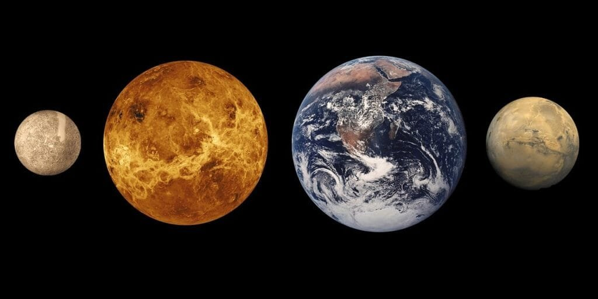

Imagine a world where volcanoes not only shape the landscape but also hold the key to unlocking the potential for life. This is precisely the case when it comes to Mars, our enigmatic neighbor in the solar system. Recent studies have revealed that the red planet has a rich history of volcanic activity, suggesting that it may have all the necessary ingredients for nurturing life. Volcanoes on Mars provide valuable insights into the planet's geological processes and the possibility of habitable environments. By delving into the mysteries of Mars' volcanic activity, scientists are uncovering fascinating clues about the potential for life beyond our own planet.

<iframe width="560" height="315" src="https://www.youtube.com/embed/QIkFrr-hMmg" frameborder="0" allow="accelerometer; autoplay; encrypted-media; gyroscope; picture-in-picture" allowfullscreen></iframe>

  

## Why Does Mars' Volcanic Activity Hint at Life Potential?

Mars, often referred to as the "Red Planet," has always been a subject of fascination for scientists and space enthusiasts alike. One of the most intriguing aspects of Mars is its volcanic activity and the potential implications it holds for the existence of life.

### Link Between Volcanic Activity and Life

Volcanic activity on Mars can provide valuable insights into the possibility of life on the planet. Volcanoes act as a window into the planet's interior, allowing scientists to study its composition and understand the dynamics at play beneath the surface. The presence of volcanic activity indicates the presence of geological processes, which are often intertwined with the conditions necessary for life to thrive.

### Connection Between Heat and Organic Elements

Volcanic activity on Mars generates an immense amount of heat, which can create conditions conducive to the development of life. Heat is an essential factor for the existence of organic elements, as it provides the necessary energy for chemical reactions to occur. The heat generated by volcanic activity could potentially create an environment where organic compounds can form and interact, laying the groundwork for the emergence of life.

### Possible Presence of Water Through Volcanic Activity

Water is a fundamental requirement for life as we know it, and the presence of water on Mars has been a subject of extensive research. Volcanic activity plays a crucial role in the potential presence of water on Mars. Eruptions can release trapped water vapor from beneath the surface, which can then condense and form liquid water. The combination of heat, water, and the necessary building blocks of life could create an environment suitable for microbial life to thrive.

## Understanding Mars' Volcanoes

To comprehend the relationship between Mars' volcanic activity and life potential, it is essential to delve into the various aspects of the planet's volcanoes.

### Types of Volcanoes on Mars

There are several [types of volcanoes](https://magmamatters.com/understanding-volcanic-formation-a-comprehensive-guide/ "Understanding Volcanic Formation: A Comprehensive Guide") found on Mars, each with unique characteristics. Shield volcanoes, like Olympus Mons, are massive structures with broad slopes. They are formed by the gradual eruption of basaltic lava, which spreads over large areas. Other types include composite and patera volcanoes, which have different eruption patterns and forms. Studying these volcanoes can provide valuable insights into the processes occurring beneath the Martian surface.

### Geographical Distribution

Volcanoes on Mars are not evenly distributed across the planet. There are regions that exhibit a higher density of volcanoes, such as the Tharsis region, which is home to several notable volcanoes, including Olympus Mons. Understanding the geographical distribution of Martian volcanoes can help scientists identify areas of interest for further exploration and study.

### Causes of Eruptions in Mars Volcanoes

The causes of volcanic eruptions on Mars are still the subject of ongoing research. While some factors, such as mantle plumes and tectonic activity, are thought to play a role, the exact mechanisms behind Martian volcanic eruptions are not yet fully understood. Exploring these causes can provide valuable insights into the planet's geological history and its potential for sustaining life.

### Historic Activity and Dormancy

Mars' volcanic activity is not limited to its distant past. Evidence suggests that volcanic activity has occurred relatively recently on the planet. Studying the historic activity of Mars' volcanoes can help scientists determine the frequency and intensity of eruptions, which, in turn, provides insights into the potential for life to exist. Additionally, understanding the periods of dormancy between eruptions is crucial in deciphering the long-term volcanic behavior on Mars.

This image is property of pixabay.com.

## Differences Between Earth and Mars Volcanoes

While there are several similarities between Earth and Mars in terms of volcanic activity, there are also notable differences that set them apart.

### Variations in Size and Structure

One of the most striking differences between Earth and Mars volcanoes is the sheer size. Mars boasts the largest volcano in the solar system, Olympus Mons, which is approximately three times the height of Mount Everest. The difference in size is attributed to several factors, including the lower gravity on Mars and the absence of tectonic plate movement. Understanding these variations provides valuable insights into Mars' unique volcanic activity and its potential implications for life.

### Eruption Patterns and Frequencies

Eruption patterns and frequencies on Mars differ significantly from those on Earth. Mars' volcanoes tend to have eruptions that last for an extended period, with lava flowing over longer distances. On Earth, eruptions can be more explosive and violent, with shorter durations. These differences in eruption patterns and frequencies can have profound implications for the formation of habitable environments on Mars.

### Lava Composition and Viscosity

The composition and viscosity of lava on Mars also differ from those on Earth. Martian lavas are primarily composed of basalt, while Earth's lavas have more diverse compositions due to the planet's geological activity. The viscosity of Martian lava is generally higher than that of Earth's lava, affecting the behavior and flow dynamics of volcanic eruptions. Understanding these differences helps scientists interpret the volcanic processes on Mars and their potential effects on life formation.

## Mars' Most Known Volcano: Olympus Mons

Among the numerous volcanoes dotting the Martian landscape, Olympus Mons stands out as the most prominent and intriguing.

### Geographical Location and Structure

Olympus Mons is located in the Tharsis region of Mars and is the largest volcano not only on Mars but also in the entire solar system. Its impressive size and height make it a fascinating subject for study. The vast shield volcano stretches approximately 600 kilometers in diameter and rises nearly 22 kilometers above the Martian surface. Understanding the geographic location and structure of Olympus Mons helps scientists unravel its connection to the potential for life on Mars.

### Historic and Recent Volatile Activity

While Olympus Mons is currently dormant, evidence suggests that it was once an active volcano. The presence of lava flows and volcanic ash deposits indicates a significant history of volatile activity. Additionally, recent studies suggest that volcanic activity might have occurred on Olympus Mons as recently as two million years ago. Analyzing the historical and recent volatile activity of Olympus Mons provides valuable insights into the potential for life-supporting conditions on Mars.

### Evidence of Life-Supporting Conditions

Olympus Mons exhibits several characteristics that could support life. The presence of volcanic activity is often associated with the release of gases and the formation of geothermal vents, which can create warm and chemically diverse environments. These conditions, combined with the previously mentioned potential for water formation, create an environment that could harbor extremophiles or other forms of microbial life. Studying Olympus Mons helps scientists assess the habitability of Mars and the likelihood of life's existence.

This image is property of pixabay.com.

## Volcanic Eruptions As Catalysts for Life

While the connection between volcanoes and life on Earth is well-established, the implications of volcanic activity for life on Mars are still being explored.

### The Role of Volcanoes in Earth’s Life Evolution

On Earth, volcanic activity has played a significant role in the development and evolution of life. Volcanic eruptions release essential nutrients into the environment, enriching the soil and creating fertile grounds for life to thrive. Additionally, the heat generated by volcanoes provides the energy necessary for chemical reactions, which can lead to the formation of organic compounds. The connection between volcanic activity and life on Earth provides a basis for exploring similar scenarios on Mars.

### Potential Parallel Scenarios on Mars

Given the similarities between Earth and Mars' volcanic activity, it is plausible to consider that similar processes and conditions could exist on the Red Planet. Volcanic eruptions on Mars could potentially release vital nutrients and create the necessary heat for life to emerge. While the specifics of Martian volcanic activity may differ, studying the connection between volcanoes and life on Earth can help inform our understanding of potential parallel scenarios on Mars.

### Implications for Extremophiles

Extremophiles are organisms that thrive in extreme environments, and volcanic environments on both Earth and Mars provide suitable habitats for them. The conditions of high heat, chemical diversity, and potential water presence create an environment where extremophiles could survive and adapt. Studying the connection between volcanoes and extremophiles on Earth provides insights into the possibility of similar life forms on Mars.

## The Role of Water in Volcanic Activity and Life Evolution

Water is a crucial element in the search for life, and its connection to volcanic activity on Mars is of great interest to scientists.

### Potential for Water Formation During Eruptions

Volcanic eruptions on Mars have the potential to release significant amounts of trapped water vapor from beneath the surface. As the vapor rises and reaches the colder atmosphere, it can condense and form liquid water. This process, known as phreatomagmatic eruptions, could create localized water sources and contribute to the overall water cycle on Mars. Understanding the potential for water formation during volcanic eruptions provides valuable insights into Mars' habitability and the possibility of life.

### Exploring Mars' Ancient Ocean Theories

The presence of water on Mars has been a topic of extensive research, with theories suggesting that the planet may have had ancient oceans billions of years ago. Volcanic activity could have played a significant role in shaping the planet's geological features and redistributing water across its surface. Exploring these ancient ocean theories in conjunction with volcanic activity helps scientists piece together the puzzle of Mars' past and its potential for sustaining life.

### Water as a Key Element for Life

Water is an essential element for life as we know it. Its presence provides a medium for chemical reactions to occur and is crucial for the survival of most organisms. The potential connection between volcanic activity and water on Mars creates an intriguing possibility for the existence of life. Understanding the role of water in the context of volcanic activity helps scientists assess the habitability of Mars and refine their search for extraterrestrial life.

This image is property of pixabay.com.

## The Influence of Mars' Thin Atmosphere on Volcanoes

Mars' thin atmosphere has a significant impact on the behavior and characteristics of its volcanoes.

### Effects on Eruption Patterns

The thin atmosphere on Mars affects the behavior of volcanic eruptions. Unlike Earth, where atmospheric pressure can restrain [volcanic gases](https://magmamatters.com/the-art-and-science-of-volcano-monitoring/ "The Art and Science of Volcano Monitoring") and explosive eruptions, Mars' low atmospheric pressure allows for the release of gases more easily. This can lead to quieter and longer-lasting eruptions with lava flows extending over larger areas. Understanding the influence of Mars' thin atmosphere on eruption patterns helps scientists decipher the dynamics of Martian volcanic activity.

### Atmospheric Composition and Volatiles Release

The composition of Mars' atmosphere differs from that of Earth, with a higher proportion of carbon dioxide and a lack of oxygen. [Volcanic eruptions on Mars release gases such as sulfur dioxide](https://magmamatters.com/the-environmental-impact-of-volcanic-eruptions-2/ "The Environmental Impact of Volcanic Eruptions"), water vapor, and carbon dioxide, which interact with the thin Martian atmosphere. These gases can have implications for Mars' climate and the potential for life. Studying the release and behavior of volatiles in Mars' atmosphere provides valuable insights into the habitability of the planet.

### Impacts on Potential Life-Harboring Conditions

Mars' thin atmosphere can have both positive and negative impacts on the potential for life on the planet. On one hand, the low atmospheric pressure allows for the release of gases and the potential creation of habitable environments. On the other hand, the thin atmosphere provides less protection against harmful radiation and cosmic rays. Understanding the interplay between Mars' thin atmosphere and its volcanic activity helps scientists assess the overall conditions necessary for life to exist.

## Mars Volcanoes as Targets for Future Explorations

The study of Mars' volcanoes holds significant promise for future explorations and research in the field of astrobiology.

### Significance for Astrobiology Research

Astrobiology, the study of life beyond Earth, relies on the exploration of environments that could potentially harbor life. Mars' volcanoes provide unique and exciting opportunities for astrobiology research. The connection between volcanic [activity and the formation of habitable environments makes Mars' volcanoes](https://magmamatters.com/geothermal-energy-and-its-volcanic-origins/ "Geothermal Energy and Its Volcanic Origins") prime targets for studying the potential for life on the Red Planet.

### Selecting Landing Sites for Rovers

Selecting landing sites for rovers and future missions is a crucial aspect of exploring Mars. Volcanoes can offer enticing landing sites due to their geological complexity and potential for life-supporting conditions. By carefully analyzing the geological characteristics of Martian volcanoes, scientists can identify areas of interest and maximize the chances of discovering evidence of past or present life.

### Conducting Life-Detecting Experiments

Future missions to Mars can incorporate life-detecting experiments to explore the potential presence of life in volcanic environments. The understanding gained from studying Earth's volcanic environments can inform the design and implementation of these experiments on Mars. By targeting Mars' volcanoes, scientists can increase the likelihood of detecting signs of life and unraveling the mysteries of its potential existence.

## Critiques and Counterarguments

While the connection between Mars' volcanic activity and life potential is a fascinating topic, there are several critiques and counterarguments that need to be considered.

### Discrepancies in Data Interpretation

Interpreting data and making accurate conclusions can be challenging, especially when dealing with complex geological phenomena. Different interpretations of data related to Martian volcanoes can lead to varying conclusions about the potential for life. It is crucial to address these discrepancies and establish a consensus to ensure the scientific validity of the findings.

### Challenges of Extrapolating Earth-based Models

Applying Earth-based models and knowledge to Mars can be a challenge due to the differences in geological history and environmental conditions. The processes and dynamics that govern Martian volcanism may differ significantly from those on Earth, making it difficult to directly extrapolate findings. Scientists must account for these challenges and develop specific models and theories tailored to Mars' unique characteristics.

### Understanding Mars' Geologic and Climate History

Interpreting Mars' geologic and climate history is pivotal in understanding the potential for life on the planet. The complex interactions between volcanic activity, climate, and other geological processes require a thorough understanding of Mars' past. As our knowledge expands, we can gain deeper insights into the relationship between volcanoes and the potential for life on Mars.

## Way Forward and Future Research

To further our understanding of Mars' volcanoes and their implications for life potential, continued research and exploration are necessary.

### Promising Areas of Study

Several areas of study hold promise for advancing our knowledge of Mars' volcanoes and their connection to life potential. Analyzing the mineralogy of Martian lava samples, studying the chemical composition of gases released during volcanic eruptions, and mapping the subsurface structure of volcanoes are all avenues for future research. These studies will provide valuable data and shed light on the complexities of Martian volcanic activity.

### Technological Advancements for Deeper Understanding

Technological advancements in space exploration and scientific instrumentation play a crucial role in advancing our understanding of Mars' volcanoes. Improved imaging capabilities, remote sensing techniques, and sample return missions can significantly enhance our ability to study Mars' volcanoes and their implications for life potential. Investing in these technological advancements will pave the way for more detailed and comprehensive research.

### Impacts on Plans for Human Mars Missions

As plans for human missions to Mars progress, understanding the planet's volcanic activity becomes even more critical. Volcanoes could provide valuable resources, such as water and geothermal energy, for future human settlements. Additionally, studying volcanic environments can help scientists assess potential landing sites and mitigate risks associated with volcanic hazards. Incorporating the findings from research on Mars' volcanoes into mission planning ensures the safety and success of future human endeavors.

In conclusion, Mars' volcanic activity holds significant potential for unravelling the mysteries of life beyond Earth. The link between volcanic activity and the conditions necessary for life provides a compelling basis for further exploration and research. By understanding the various aspects of Mars' volcanoes, their differences from Earth volcanoes, and the implications for life potential, scientists can push the boundaries of our knowledge and pave the way for future discoveries. Mars' volcanoes present a fascinating field of study, offering insights into the planet's past, present, and future, and potentially unlocking the secrets of life on Mars.

