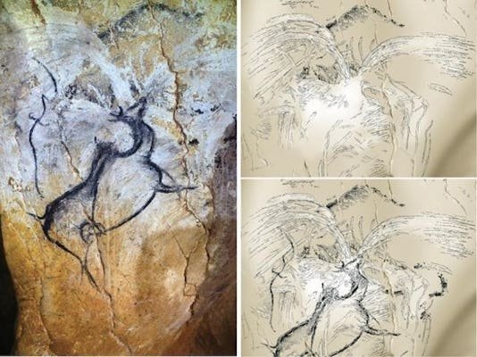
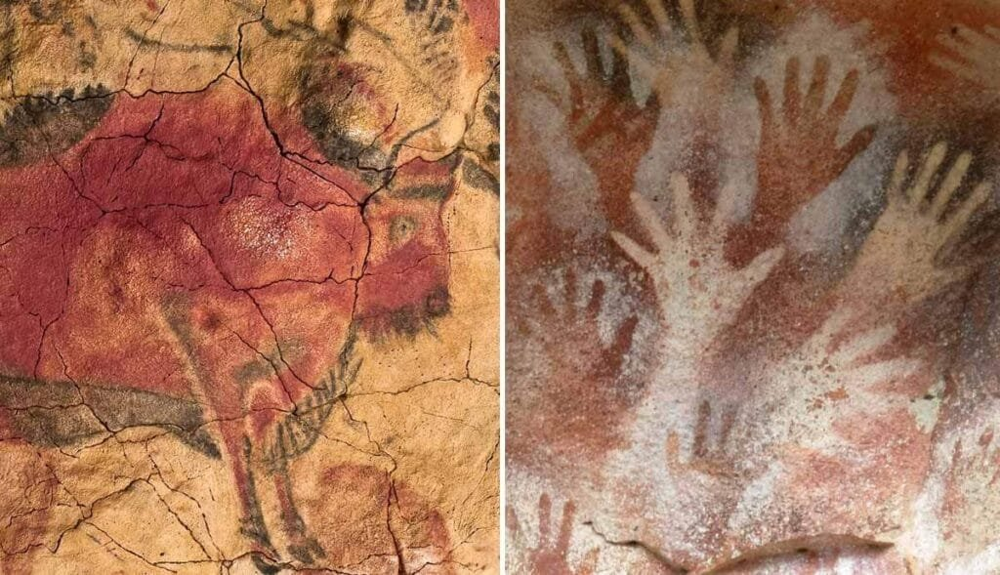
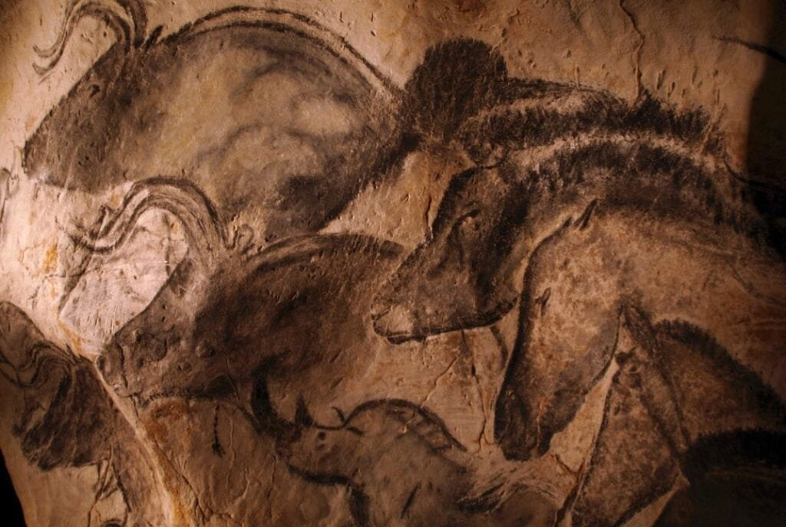
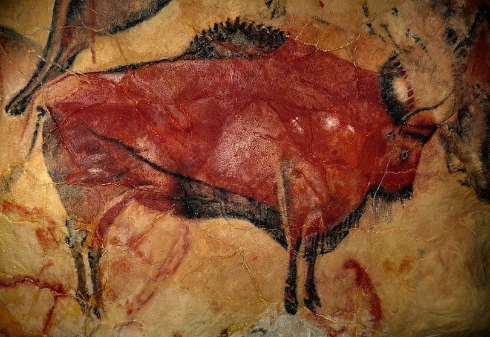

Imagine stepping back in time to a world where prehistoric caves were not just shelters, but canvases for expression. In this article, we will take you on a journey to explore the 5 best prehistoric cave paintings depicting volcanoes. Volcanoes, these majestic natural wonders, have captivated human imagination throughout history, and early humans sought to capture their power and beauty through their artistic abilities. These ancient paintings, found in caves scattered across the globe, provide a glimpse into the minds of our ancestors and their fascination with these fiery phenomena. Join us as we delve into the rich history and significance of these remarkable cave paintings and uncover the stories they tell about the relationship between early humans and the natural world.

<iframe width="560" height="315" src="https://www.youtube.com/embed/ZjejoT1gFOc" frameborder="0" allow="accelerometer; autoplay; encrypted-media; gyroscope; picture-in-picture" allowfullscreen></iframe>

  

## Identifying Characteristics of Prehistoric Cave Paintings

Cave paintings from prehistoric times provide valuable insights into the artistic abilities and cultural practices of early human societies. These ancient artworks showcase various styles and techniques that were unique to different regions and time periods. By studying these paintings, we can gain a deeper understanding of the past and the people who created them.

### Styles and techniques in prehistoric art

Prehistoric cave paintings exhibit a wide range of artistic styles and techniques. Some artworks feature realistic depictions of animals and human figures, while others use more abstract forms. The use of lines, shading, and colors is evident in many paintings, showcasing the skills and creativity of the artists. Additionally, prehistoric artists experimented with different tools and materials to create these artworks, such as using natural pigments and primitive brushes or their fingers.

### Usage of natural pigments

One of the distinguishing characteristics of prehistoric cave paintings is the use of natural pigments. These pigments were derived from various sources, such as minerals, ochre, charcoal, and plant materials. The artists ground these materials into powders and mixed them with water or animal fat to create paint. The use of natural pigments not only allowed for the creation of vibrant colors but also ensured the longevity of the artworks, as these materials were resistant to fading and decay.

### Themes represented in prehistoric cave paintings

Prehistoric cave paintings often depict a wide range of themes, including animals, hunting scenes, and daily life activities. However, one recurring theme that is found in many cave paintings is the depiction of volcanoes. These volcanic motifs are not only aesthetically captivating but also hold significant cultural and symbolic meanings for the ancient societies. The inclusion of volcanoes in cave art offers valuable clues about the beliefs, fears, and experiences of these early humans.

### Understanding the depiction of volcanoes in cave art

The depiction of volcanoes in prehistoric cave art is a fascinating subject of study. These volcanic motifs vary in style and symbolism across different regions and time periods. By analyzing the artistic techniques, colors, and compositions used in these paintings, researchers can gain insights into how ancient societies perceived and understood volcanoes. This understanding can shed light on their beliefs, cultural practices, and their relationship with the natural environment around them.

## Chauvet-Pont-d’Arc Cave in France

The Chauvet-Pont-d’Arc Cave is a renowned archaeological site in France that contains one of the oldest and most well-preserved examples of prehistoric cave art. The cave, discovered in 1994, houses an extensive collection of paintings dating back over 30,000 years. Among the various motifs depicted in the cave, there are several intriguing depictions of volcanic eruptions.

### Historical and geographical context

The Chauvet-Pont-d’Arc Cave is located in the Ardèche region of France. It was created by the Ardèche River, which carved out the limestone cliffs over thousands of years. This natural formation provided an ideal canvas for the prehistoric artists to create their paintings. The region also has a history of volcanic activity, which may have influenced the ancient societies' fascination with volcanoes.

### Analysis of the volcanic eruption depiction

The volcanic eruption depicted in the Chauvet-Pont-d’Arc Cave is a remarkable example of the artist's skill and creativity. The painting vividly captures the chaotic and destructive nature of an erupting volcano. The use of bold and contrasting colors, such as reds and oranges, effectively conveys the intensity of the eruption. Additionally, the skillful use of lines and shading adds depth and realism to the composition, making it a visually striking artwork.

### Interpretation of the artists' intentions and the painting's significance

Interpreting the intentions of the ancient artists who created the volcanic eruption depiction is a challenging task. However, it is believed that these paintings held important cultural and symbolic meanings for the prehistoric societies. It is possible that these depictions were associated with rituals, beliefs, or even stories passed down through generations. The presence of volcanic imagery in the cave art reflects the significant impact of volcanic activity on the lives and perceptions of these early humans.

### Relations between the art and contemporary volcanic events

Studying the connection between the volcanic depictions in the Chauvet-Pont-d’Arc Cave and contemporary volcanic events can provide valuable insights into the cultural and environmental context of the prehistoric societies. By comparing the artistic representations with geological records, researchers can attempt to link specific volcanic eruptions or volcanic activity to the creation of these artworks. [Understanding these relationships can enhance our understanding of the impact of volcanic](https://magmamatters.com/understanding-volcanic-formation-a-comprehensive-guide/ "Understanding Volcanic Formation: A Comprehensive Guide") events on ancient communities and their artistic expressions.

This image is property of imageio.forbes.com.

## Cappadocia, Turkey: Çatalhöyük Mural

The mural depicting a volcanic eruption in Çatalhöyük, a Neolithic settlement in Cappadocia, Turkey, is a significant example of prehistoric cave art. This mural provides a unique glimpse into the lives and beliefs of the people who lived in this ancient society.

### Description of the Çatalhöyük site

Çatalhöyük is an archaeological site dating back to approximately 7,000-9,000 BCE. It is one of the largest and best-preserved Neolithic settlements in the world. The site consists of numerous interconnected houses and features elaborate wall paintings and sculptures. The mural depicting a volcanic eruption is one of the most notable artworks found in Çatalhöyük.

### Discussion of the mural depicting a volcanic eruption

The mural depicting a volcanic eruption in Çatalhöyük showcases the artist's skill in capturing the dramatic and destructive nature of volcanic activity. The use of bold colors, such as red, orange, and black, creates a sense of intensity and movement in the composition. The eruption is depicted in a dynamic and energetic manner, with swirling lines and flames, conveying the chaotic nature of the event.

### Comparison with other Çatalhöyük murals

The mural depicting a volcanic eruption in Çatalhöyük is unique among the other wall paintings found at the site. While most of the other murals depict scenes of everyday life, animals, and geometric patterns, this particular mural stands out for its portrayal of a natural disaster. This contrast suggests that the depiction of volcanoes may have held special significance or conveyed important messages within the Çatalhöyük society.

### Unraveling the connection between the Çatalhöyük society and local volcanic activity

To understand the significance of the volcanic eruption depiction in Çatalhöyük, it is crucial to explore the possible connections between the society and local volcanic activity. Cappadocia region is known for its geological formations, including the presence of volcanic rocks and ash deposits. The volcanic eruptions in the region could have had a significant impact on the lives and beliefs of the ancient inhabitants of Çatalhöyük. Unraveling this connection can provide valuable insights into the cultural and environmental context of the society.

## Lascaux, France: Abstract Volcanic Depictions

Lascaux, a cave complex in southwestern France, is renowned for its exceptional Paleolithic cave paintings. Among the various themes depicted in these artworks, there are some intriguing and unique abstract representations of volcanoes.

### Introduction to Lascaux's cave paintings

Lascaux's cave paintings date back approximately 17,000 years and represent a pinnacle of ancient artistic talent and creativity. The site consists of several interconnected caves adorned with vividly colored paintings of animals, humans, and abstract symbols. The presence of abstract volcanic depictions adds to the complexity and diversity of the artworks found in Lascaux.

### Analysis of their unusual, abstract depiction of a volcano

The abstract volcanic depictions found in Lascaux defy traditional artistic conventions and offer a unique perspective on how prehistoric artists interpreted and portrayed volcanic eruptions. Instead of realistic representations, these artworks use a more abstract and symbolic language to convey the essence of a volcano. Geometric shapes, lines, and patterns are employed to evoke the power and energy associated with volcanic activity.

### Insights into the artist's approach

The abstract volcanic depictions in Lascaux provide valuable insights into the artistic approach and creative processes of the prehistoric artists. It is evident that the artists focused on capturing the essence and energy of a volcano rather than creating a realistic representation. Their use of abstract forms and symbols allowed them to communicate the concept of a volcano in a way that transcended the constraints of literal representation.

### Contextualizing the artwork in prehistory

To fully appreciate the abstract volcanic depictions found in Lascaux, it is essential to contextualize them within the broader artistic and cultural landscape of prehistory. By comparing these artworks with other cave paintings from different regions and time periods, researchers can identify common motifs, themes, and artistic techniques. This comparative analysis deepens our understanding of prehistoric art and its significance in ancient societies.

This image is property of cdn.thecollector.com.

## Pinturas River, Argentina: Cueva de las Manos

Cueva de las Manos, located along the Pinturas River in Argentina, is a remarkable archaeological site adorned with an abundance of cave paintings. Among the various motifs depicted in the caves, there are unique representations of volcanic activity that offer insights into the cultural background of these ancient artworks.

### Overview of Cueva de las Manos

Cueva de las Manos, which translates to "Cave of Hands," is a UNESCO World Heritage Site famous for its collection of cave paintings. The site is situated within the Pinturas River Canyon and is renowned for its extensive display of hand stencils and other intricate motifs. The site provides a valuable glimpse into the cultural practices and artistic abilities of the early inhabitants of the region.

### Description of the volcanic paintings

The volcanic paintings found in Cueva de las Manos depict eruptions and their aftermath in a way that showcases the artistic skills of the ancient inhabitants. These paintings often include representations of volcanic ash, lava flows, and volcanic landscapes. The artists utilized various colors, including reds, oranges, and blacks, to evoke the intense and destructive nature of volcanic activity.

### Examination of stylistic features and symbolism

Studying the stylistic features and symbolism present in the volcanic paintings of Cueva de las Manos can provide valuable insights into the cultural background of these artworks. The use of specific colors, patterns, and motifs may hold significant cultural and symbolic meanings. By analyzing these elements, researchers can gain a deeper understanding of the ancient society that created these artworks and their relationship with volcanic activity.

### Understanding the cultural background of these cave paintings

The volcanic paintings found in Cueva de las Manos reflect the cultural background and beliefs of the ancient inhabitants of the region. To understand the significance of these artworks, it is essential to explore the cultural context in which they were created. This may involve investigating the everyday lives, spiritual beliefs, and societal practices of the ancient community. By unraveling these connections, researchers can gain valuable insights into the cultural and historical significance of these cave paintings.

## Bhimbetka Rock Shelters, India: Early Volcanic Art

The Bhimbetka Rock Shelters in India are renowned for their ancient cave paintings, some of which depict scenes of volcanoes. These early artworks provide an intriguing glimpse into the artistic traditions of ancient India and their relationship with volcanic activity.

### Information about the historic Bhimbetka site

The Bhimbetka Rock Shelters are located in the central Indian state of Madhya Pradesh. The site comprises a series of natural rock shelters that were inhabited by early humans for thousands of years. These shelters contain an extensive collection of cave paintings spanning various historical periods, ranging from 30,000 to 9,000 years ago. The presence of volcanic art within this rich tapestry adds to the cultural significance of Bhimbetka.

### Discussion of the early volcanic art found there

The early volcanic art found in Bhimbetka showcases the ancient artistic traditions and cultural practices of the region. These artworks often depict volcanic eruptions, lava flows, and volcanic landscapes. The artists utilized a range of colors, including reds, yellows, and browns, to bring these scenes to life. The early volcanic art in Bhimbetka provides valuable insights into the perceptions and experiences of ancient Indian societies.

### Analysis of design elements and color utilization

By analyzing the design elements and color utilization in the early volcanic art of Bhimbetka, researchers can gain a deeper understanding of the artistic techniques employed by the ancient artists. The use of lines, shapes, and patterns helps convey the sense of movement, energy, and chaos associated with volcanic eruptions. The choice of colors adds depth and realism to the artworks, allowing viewers to immerse themselves in the volcanic landscapes depicted.

### Connecting Bhimbetka's volcanic rock art with historic volcanic activity

To further unravel the significance of the early volcanic art in Bhimbetka, it is important to establish connections between the cave paintings and historic volcanic activity in the region. India has a rich volcanic history, with several volcanic provinces and past eruptions. By correlating the timing and location of these volcanic events with the creation of the artworks, researchers can gain insights into how volcanic activity influenced the lives and beliefs of ancient Indian societies.

This image is property of th-thumbnailer.cdn-si-edu.com.

## Interpreting the Significance of Volcanic Depictions

The inclusion of volcanic imagery in prehistoric cave paintings raises intriguing questions about the cultural and symbolic meanings associated with volcanoes. By examining the significance of these depictions, we can gain insights into the beliefs, fears, and experiences of ancient societies.

### Culture and mythology surrounding volcanoes

Volcanoes have long held significant cultural and mythological importance in various societies around the world. They are often associated with gods, spirits, and supernatural forces. The presence of volcanic depictions in cave art suggests that ancient societies attributed similar religious or mythological significance to volcanoes. Understanding these cultural and mythological beliefs can provide insights into the spiritual and symbolic worldviews of these early humans.

### Possible reasons for including volcanoes in cave paintings

The reasons behind the inclusion of volcanoes in cave paintings may vary across different regions and time periods. It is possible that ancient societies depicted volcanoes as a way to honor, appease, or seek protection from the powerful natural forces associated with volcanic activity. Moreover, these artworks may have served educational or narrative functions, conveying important stories or lessons related to volcanic eruptions and their impact on human lives.

### The role of natural events in prehistoric art

Natural events, such as volcanic eruptions, played a significant role in shaping the lives and perceptions of prehistoric societies. Cave paintings served as a medium for ancient humans to express their understanding and experiences of these [natural phenomena](https://magmamatters.com/the-art-and-science-of-volcano-monitoring/ "The Art and Science of Volcano Monitoring"). The inclusion of volcanoes in cave art highlights the importance of these events in the cultural and social fabric of ancient societies.

### Impact on the understanding of prehistoric societies' relationship with the natural environment

Studying the volcanic depictions in cave [art can enhance our understanding of prehistoric](https://magmamatters.com/the-environmental-impact-of-volcanic-eruptions-2/ "The Environmental Impact of Volcanic Eruptions") societies' relationship with the natural environment. The inclusion of volcanoes suggests a deep awareness and interaction with the natural world. By unraveling the cultural, symbolic, and environmental significance of these artworks, we can gain insights into how ancient societies perceived, adapted to, and even revered the natural forces that shaped their everyday lives.

## Archaeological Methods in Studying Cave Art

Studying prehistoric cave art is a complex and interdisciplinary endeavor. Archaeologists employ various methods and techniques to analyze and interpret these ancient artworks. These methods help shed light on the cultural practices, beliefs, and artistic abilities of the societies that created them.

### Techniques used in dating cave paintings

Dating prehistoric cave paintings is a crucial step in understanding their chronology and cultural context. Archaeologists use various techniques to determine the age of cave art, including radiocarbon dating, uranium-series dating, and optically stimulated luminescence dating. These methods involve analyzing the materials used in the paintings or the layers of sediments covering them. By establishing the age of the artworks, researchers can place them within specific time periods and understand their relationship to other cultural and environmental phenomena.

### Challenges in interpreting prehistoric art

Interpreting prehistoric cave art poses several challenges due to the limited availability of direct cultural and historical evidence. Archaeologists rely on indirect clues, such as the artistic techniques, motifs, and archaeological context, to unravel the meanings and messages conveyed by these artworks. However, interpretations may vary, and researchers must approach cave art with cautious speculation, considering multiple possibilities and incorporating insights from different disciplines.

### The role of archaeological context in understanding cave paintings

The archaeological context in which cave paintings are discovered plays a crucial role in understanding their meanings and significance. The location of the artwork within the cave complex, the presence of other artifacts or symbols, and the [geological or environmental](https://magmamatters.com/geothermal-energy-and-its-volcanic-origins/ "Geothermal Energy and Its Volcanic Origins") features surrounding the site all contribute to the interpretation of the cave art. By analyzing the archaeological context, researchers can reconstruct the social, cultural, and environmental dynamics of the ancient societies and gain valuable insights into the motivations and meanings behind the creation of cave paintings.

This image is property of www.touropia.com.

## Volcanic Eruptions and Their Role in Prehistory

Volcanic eruptions have had a profound impact on the Earth's history and the development of human societies. By examining the relationship between volcanic activity and prehistoric communities, we can gain insights into how these natural events shaped human migration, living conditions, and the overall environment.

### How eruptions shape the Earth and influence geological events

Volcanic eruptions release vast quantities of molten rock, gases, and debris onto the Earth's surface, resulting in significant geological transformations. Eruptions can reshape landscapes, create new landforms, and alter the composition of the surrounding soil and rocks. The long-term effects of volcanic activity can be observed in the geological record, providing valuable insights into the dynamic processes that have shaped the Earth over millions of years.

### Impact on human migration patterns and living conditions

Volcanic eruptions have played a significant role in shaping human migration patterns and affecting the living conditions of prehistoric communities. Volcanic activity can lead to the displacement of populations, forcing them to seek new habitats and resources. It can also create fertile soils, attracting human settlements due to the agricultural advantages provided by volcanic ash and minerals. Understanding the impact of volcanic eruptions on human migration and living conditions enhances our knowledge of the dynamic relationship between humans and their natural environment.

### How volcanoes influence climate and environment

Volcanic eruptions have the potential to influence climate and environmental conditions on a global scale. When volcanic ash and gases are ejected into the atmosphere, they can block sunlight and cause temporary cooling of the Earth's surface. Additionally, volcanic emissions can release greenhouse gases and affect atmospheric chemistry, leading to long-term climate changes. The impact of volcanic activity on climate and environment has both direct and indirect consequences for human societies, shaping their survival strategies, agricultural practices, and resource availability.

## Comparison and Contrast of the Five Cave Paintings

The study of prehistoric cave paintings depicting volcanoes allows for intriguing comparisons and contrasts between different regions and time periods. By examining the styles, techniques, and thematic choices of the artworks, we can gain insights into the global variation and commonalities in prehistoric artistic practices.

### Similarities and differences in styles and techniques

The five cave paintings discussed in this article exhibit both similarities and differences in their styles and techniques. While all of them feature depictions of volcanoes, they utilize different artistic approaches and motifs. Some paintings emphasize realism, while others explore abstract or symbolic representations. By examining the stylistic choices and techniques employed in each artwork, researchers can identify unique regional characteristics and artistic traditions.

### Comparative discussion on the depiction of volcanoes

Comparing the depiction of volcanoes in the five cave paintings allows for a deeper understanding of the cultural and artistic variations across different regions and time periods. Some artworks may focus on the destructive and chaotic aspects of volcanic eruptions, while others highlight the spiritual or mythological significance of volcanoes. By analyzing these depictions side by side, researchers can identify common themes, symbols, and cultural beliefs, adding to our understanding of the broader human experience.

### Insights on global variation in prehistory's artistic practices

The study of prehistoric cave paintings offers valuable insights into the artistic practices of early human societies across the globe. By comparing the cave paintings from different regions, researchers can identify unique regional styles, techniques, and motifs, as well as explore global artistic themes and influences. This comparative analysis enhances our knowledge of the diverse artistic traditions that thrived during prehistoric times and provides a broader understanding of human cultural expression.

### Inter-cave comparison of the representation of volcanic activity

Examining the representation of volcanic activity across the five cave paintings allows for an inter-cave comparison. By analyzing the stylistic choices, color utilization, and symbolic elements, researchers can identify similarities and differences in how ancient societies depicted and interpreted volcanic eruptions. This comparison deepens our understanding of the cultural, environmental, and historical factors that influenced the creation of these artworks and provides a nuanced perspective on the richness of prehistoric artistic expression.

