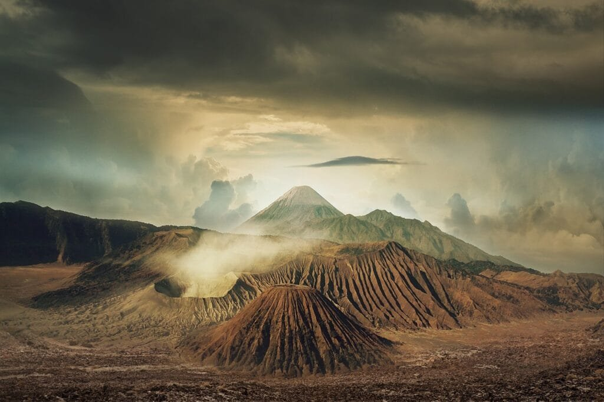

Have you ever wondered about the cultural significance of volcano legends? Volcanoes, with their majestic beauty and eruptive power, have captivated human imagination for centuries. In this article, we will explore the cultural value of volcano legends, delving into the myths, folklore, and stories that have shaped different societies' understanding of these natural wonders. From ancient civilizations to modern-day cultures, volcano legends provide insights into how people view and interact with these awe-inspiring forces of nature. So, come along as we embark on a journey to uncover the cultural significance of volcano legends.

This image is property of pixabay.com.

## The Role of Volcanoes in Various Cultures

Volcanoes have played a significant role in the cultures of various civilizations throughout history. From the indigenous perspectives to modern interpretations, [volcanoes have been regarded as powerful and awe-inspiring natural phenomena](https://magmamatters.com/the-art-and-science-of-volcano-monitoring/ "The Art and Science of Volcano Monitoring"). They have been associated with divine entities, served as inspiration for storytelling and folklore, and shaped the identity and perceptions of different societies. In this article, we will explore the cultural significance of volcano legends and their impact on societal attitudes, disaster preparedness, historical preservation, and more.

### Indigenous Perspectives of Volcanoes

Before the rise of ancient civilizations, indigenous cultures across the world held unique perspectives on volcanoes. These perspectives were rooted in their deep connection to the land and their belief systems. For indigenous communities, volcanoes were not merely physical formations but also sacred sites and the embodiment of powerful spirits. These cultures often regarded volcanoes as significant deities or ancestors who shaped the landscape and held great influence over their lives. Volcanoes were often seen as protectors, sources of spiritual energy, and symbols of creation and destruction.

### Volcanoes in Ancient Civilizations

Ancient civilizations, such as the Mayans, Greeks, Egyptians, and Romans, also held deep reverence for volcanoes. In these societies, volcanoes were often associated with gods and goddesses who controlled natural forces. The eruption of a volcano was seen as a manifestation of divine power, and offerings and rituals were conducted to appease these deities. Volcanic eruptions were believed to be messages from the gods and were closely observed for signs of impending disaster or change. Ancient civilizations incorporated volcanic symbolism and legends into their religious narratives and used them to explain natural phenomena and communicate moral lessons.

### Modern Interpretations of Volcanoes

In the modern era, our understanding of volcanoes has evolved through scientific advancements. However, the cultural significance of volcanoes has not waned. Instead, it has adapted to contemporary perspectives. Volcanoes are no longer solely viewed through a lens of divine entities but also as natural wonders, scientific phenomena, and symbols of fear or awe. In modern interpretations, volcanic activity is studied and monitored closely by scientists to understand the geological processes and mitigate risks. Volcano tourism has also grown in popularity, attracting visitors who seek adventure, education, or simply the experience of witnessing the raw power of these geological marvels.

## Understanding Volcano Legends

Volcano legends have played a crucial role in perpetuating cultural beliefs, shaping societal attitudes, and preserving historical narratives. These legends have been passed down through generations, often through oral storytelling, and have become integral aspects of various folklore and mythologies. They provide insight into how different cultures perceived and interacted with volcanoes, and offer valuable lessons and warnings about the natural world.

### Role of Storytelling in Perpetuating Legends

Storytelling has always been a powerful tool for human communication and cultural preservation. In the context of volcano legends, storytelling has been a means to educate, entertain, and create a sense of community. Through vivid narratives and oral traditions, legends were shared and passed on to future generations. This oral tradition allowed cultures to remember their history, convey moral values, and foster a deeper connection to their surroundings and ancestral lands.

### Evolution of Volcano Legends Over Time

As civilizations developed and interacted with one another, volcano legends underwent evolutionary changes. Different cultures influenced one another, leading to the emergence of new interpretations and variations in volcano legends. These legends were shaped by cultural, geographical, and historical contexts, resulting in a diverse range of stories and beliefs surrounding volcanoes. The evolution of volcano legends reflects the patterns of human migration and cultural exchange throughout history.

### Contribution of Legends to Folklore and Mythology

Volcano legends have contributed significantly to the vast tapestry of folklore and mythology in different cultures. They have inspired epic tales, songs, dances, and artistic expressions, providing a rich source of inspiration for artists, poets, and musicians. These legends have become an intrinsic part of a culture's identity, forming the basis of rituals, ceremonies, and religious practices. They have added depth and meaning to the collective imagination and have served as a way to understand the natural world and human existence.

This image is property of pixabay.com.

## Symbolism in Volcano Legends

Volcano legends are filled with symbolism that reflects the cultural, social, and spiritual aspects of the societies in which they originated. Volcanoes are often interpreted as divine entities, harbingers of change, and powerful forces of nature. The symbolism within these legends helps to convey deeper meanings and metaphors that resonate with humanity's ongoing quest for understanding and expression.

### Volcanoes as Divine Entities

In many cultures, volcanoes are revered as deities or supernatural beings that possess immense power and authority. These volcano deities are seen as creators, destroyers, or both. They are often associated with gods and goddesses who control the natural elements, such as fire, earth, and fertility. Volcanoes are seen as the abode of these divine entities, representing a direct connection between the spiritual realm and the physical world.

### Interpretations of Volcanic Eruptions

The eruption of a volcano is a dramatic event that has captivated human imagination for centuries. Volcanic eruptions are often seen as metaphors for various aspects of life, such as anger, passion, rebirth, or transformation. They can represent the release of pent-up emotions or the breaking of societal norms. In some cultures, volcanic eruptions are interpreted as expressions of divine retribution or signs of impending doom. The interpretation of volcanic eruptions in legends reflects the human desire to make sense of the unpredictable and sometimes chaotic aspects of existence.

### Volcanoes as Harbingers of Change

Volcanoes have long been associated with change and transformation. The destructive power of volcanic eruptions can reshape landscapes, alter ecosystems, and impact human settlements. In many volcano legends, eruptions serve as catalysts for significant events or transitions within a society. They can signal the end of an era, the beginning of a new cycle, or the need for adaptation and resilience. Volcanoes, in this sense, represent the forces of nature that compel humanity to embrace change and navigate uncertain times.

## Characteristics of Volcano Deities

Volcano deities embody distinct characteristics and powers that reflect their role in the mythologies and religious narratives of different cultures. These deities are often personified as powerful beings with the ability to create, destroy, and shape the world. Understanding the traits and powers attributed to volcano deities provides insights into how cultures perceived and interacted with these natural phenomena.

### Personification of Volcanoes

In many legends, volcanoes are personified as anthropomorphic beings with human-like qualities. They are often given names, gender, and anthropomorphic attributes to humanize and relate to these natural features. This personification allows individuals to establish a more personal and emotional connection with volcanoes, enabling a deeper understanding and reverence for their power.

### Traits and Powers Attributed to Volcano Deities

Volcano deities are attributed with a range of characteristics and powers that vary across different cultures. They are often seen as both creators and destroyers, capable of both nurturing life and unleashing devastation. These deities possess control over fire and the earth, and they are associated with fertility, rebirth, and natural disasters. Some volcano deities are depicted as benevolent protectors, guiding communities and granting blessings, while others are depicted as vengeful and prone to destructive acts.

### Role of Volcano Deities in Religious Narratives

Volcano deities play integral roles in the religious narratives of many cultures. They serve as central figures in creation myths, origin stories, and legends that explain the natural world and human existence. Volcano deities are often depicted as key players in the cosmic drama between gods and humans, guiding civilizations and imparting wisdom. The reverence and worship of volcano deities are an essential part of religious practices, rituals, and ceremonies that seek to honor and appease these powerful beings.

This image is property of pixabay.com.

## Significance of Volcano Legends from Different World Regions

Different regions of the world have their own unique volcano legends that reflect the cultural, historical, and geographical contexts in which they originated. These legends provide valuable insights into the diverse perspectives on volcanoes and their impact on societies.

### Asian Volcano Legends

Asian volcano legends are marked by a blend of spirituality, philosophical thought, and historical symbolism. Volcanoes in Asian cultures often represent the intersection of heaven and earth, embodying the spiritual connection between the physical and metaphysical realms. They are associated with concepts such as Yin and Yang, the balance of opposing forces, and the cyclical nature of life. Asian volcano legends emphasize the harmony between humans and nature and the necessity of maintaining balance and respect for the natural world.

### African Volcano Legends

African volcano legends are characterized by a deep connection to ancestral traditions, tribal lore, and the physical landscapes of the continent. Volcanoes in African cultures are often viewed as sacred sites where ancestral spirits reside and communicate with the living. They are associated with spiritual cleansing, initiation rites, and the renewal of life. African volcano legends emphasize the importance of ancestral wisdom, community cohesion, and the interdependence between humans, nature, and the spiritual realm.

### European Volcano Legends

European volcano legends are rooted in the history, mythology, and folklore of ancient civilizations across the continent. Volcanoes in European cultures are often depicted as portals to the underworld or as the abodes of powerful supernatural beings. They are associated with stories of dragons, giants, and other mythological creatures that symbolize the clash between order and chaos. European volcano legends reflect the cultural diversity of the region and the enduring fascination with the mysterious and magical aspects of volcanic landscapes.

### American Volcano Legends

American volcano legends encompass the indigenous perspectives of the Americas and the narratives brought by European colonization. Volcanoes in American cultures are seen as guardians of the land, sources of spiritual energy, and symbols of cultural identity. They are often associated with creation stories, hero myths, and legends that teach respect for the natural world and the need for harmony between humans and the environment. American volcano legends highlight the resilience, wisdom, and cultural heritage of indigenous communities in the face of colonization and modernization.

## Impact of Volcano Legends on Societal Perceptions of Volcanoes

Volcano legends have had a profound impact on societal attitudes and perceptions of volcanoes. They have shaped how communities approach and interact with these natural phenomena, influencing disaster preparedness, community cohesion, and cultural identity.

### Societal Attitudes Towards Volcanoes

Volcano legends have played a crucial role in shaping societal attitudes towards volcanoes. These legends have instilled a deep respect and reverence for the power and unpredictability of volcanic activity. They have taught communities to approach volcanoes with caution and to view them as forces that demand both awe and caution. Volcano legends have cultivated a sense of humility in the face of nature's might, fostering a collective understanding that humans are merely guests on the earth and must learn to coexist with its natural forces.

### Influence on Disaster Preparedness and Response

Volcano legends have contributed to the development of effective disaster preparedness and response strategies. The stories and lessons embedded within these legends serve as cautionary tales, providing communities with valuable knowledge about the signs of volcanic activity and the appropriate actions to take in the event of an eruption. Volcano legends have helped communities recognize the importance of early warning systems, evacuation plans, and the establishment of safe zones to mitigate the impacts of volcanic disasters. By integrating traditional knowledge with scientific understanding, volcano legends have contributed to the resilience and safety of communities residing in volcanic regions.

### Influence on Community Cohesion and Identity

Volcano legends have played a significant role in fostering community cohesion and shaping cultural identity. These legends have provided communities with a shared narrative and a sense of belonging. They have served as a unifying force, connecting individuals to their ancestral roots and the natural landscapes of their homeland. Volcano legends have provided communities with a sense of pride and cultural identity, reinforcing the bonds that hold them together. They have been instrumental in creating a collective consciousness that transcends generations, allowing communities to preserve their traditions, language, and customs.

## Relation of Volcano Legends to Historical Volcanic Events

Volcano legends often have a correlation to historical volcanic events, shedding light on how communities interpreted and remembered these natural disasters. These legends provide insights into the impact of volcanic eruptions on societies, the ways in which communities coped with and adapted to volcanic activity, and the long-lasting effects of these events.

### Correlation of Legends with Known Eruptions

Many volcano legends have been found to have a correlation with known volcanic eruptions. These legends often contain elements that mirror the characteristics and impacts of historical volcanic events. They describe the awe-inspiring displays of fire, ash, and destruction that accompany eruptions. By studying these legends alongside geological evidence and historical records, researchers can gain a deeper understanding of past volcanic activity and its influence on society.

### Interpreting Historical Events Through Legends

Volcano legends provide a unique lens through which historical volcanic events can be interpreted. These legends offer cultural and social perspectives on how communities experienced and made sense of these events at the time. They convey the emotional and psychological impact of volcanic eruptions, as well as the ways in which communities adapted, recovered, and integrated these events into their collective memory. Interpreting historical events through legends allows for a more holistic understanding of the human experience in the face of natural disasters.

### Role of Legends in Preserving History

Volcano legends play a vital role in the preservation of historical narratives and the collective memory of communities affected by volcanic eruptions. Even when written records are limited or unavailable, legends serve as a repository of historical information and help keep alive the stories, experiences, and knowledge of past generations. Legends provide a link between the present and the past, allowing communities to honor and remember the impact of volcanic events on their ancestors and their cultural heritage.

## Scientific Interpretation of Volcano Legends

While volcano legends are rooted in cultural beliefs and storytelling traditions, they also offer insights that can align with scientific understanding of volcanic activity. Analyzing and interpreting these legends through a scientific lens provides opportunities for cross-disciplinary collaboration, enhancing our knowledge of volcanoes and their significance.

### Validity of Legends in Predicting Eruptions

While not scientifically accurate in predicting volcanic eruptions, legends often contain elements that hint at the signs and patterns observed before an eruption. By combining traditional knowledge embedded in legends with scientific monitoring techniques, scientists can gain a more comprehensive understanding of volcanic behavior. Although legends may not provide precise and reliable predictions, they can serve as additional indicators that complement scientific data, increasing the chances of accurate forecasting and warning systems.

### Alignment of Legends with Scientific Understanding

Volcano legends, when analyzed scientifically, can often align with our current understanding of volcanic processes and phenomena. Many legends describe the effects of volcanic phenomena, such as the expulsion of molten rock, the release of gases, and the formation of new landforms. By comparing the details within these legends to scientific observations and studies, researchers can identify commonalities and recognize the accuracy of some cultural interpretations. This alignment allows for a multidimensional perspective on volcanoes, blending cultural narratives with scientific understanding.

### Potential Contributions of Legends to Volcano Science

Legends have the potential to contribute to various aspects of volcano science. They can inspire new research questions, hypotheses, and methodologies. By incorporating cultural narratives into scientific studies, researchers can gain a deeper understanding of the social, psychological, and environmental impacts of volcanic eruptions. Legends can also inform hazard assessments, risk management strategies, and community engagement by integrating traditional knowledge and local perceptions into scientific endeavors. The collaboration between scientific and cultural interpretations of volcanoes can lead to a more holistic and inclusive approach to studying these geological phenomena.

## Role of Volcano Legends in Cultural Preservation

Volcano legends have played a significant role in preserving cultural practices, traditions, and historical narratives across generations. They have served as essential tools for cultural transmission, imparting ancestral wisdom, and keeping cultural heritage alive.

### Influence on Cultural Practices and Traditions

Volcano legends have influenced various cultural practices and traditions associated with volcanic regions. Rituals, ceremonies, and festivals have been developed to honor and appease volcano deities, pay homage to ancestral spirits, or commemorate historical volcanic events. These cultural practices not only provide communities with a sense of identity and belonging but also reinforce the importance of maintaining a harmonious relationship with the natural world. Volcano legends have shaped customs related to agriculture, resource management, and land use, providing communities with practical knowledge and guidance based on centuries of collective wisdom.

### Legends as Tools for Cultural Transmission

Volcano legends have been instrumental in the transmission of cultural knowledge and the preservation of ancestral traditions. Through oral storytelling, these legends have been passed down from generation to generation, ensuring the continuity of cultural practices, language, and values. The act of sharing legends strengthens family and community bonds, allowing individuals to connect with their roots and develop a sense of pride in their cultural heritage. By continuing to pass on these legends, communities ensure that their rich history and traditions are carried forward into the future.

### Preservation and Revitalization of Volcano Legends

In the face of rapid modernization and cultural assimilation, volcano legends have been a catalyst for cultural preservation and revitalization efforts. Recognizing the value of these legends, communities and organizations have embarked on initiatives to document, research, and revitalize volcano legends. Through academic studies, literary works, and community-led projects, efforts are being made to ensure the safeguarding of these legends for future generations. By preserving and revitalizing volcano legends, communities reclaim their cultural heritage, strengthen their cultural identity, and foster a sense of pride in their traditions.

## Modern Usage and Representation of Volcano Legends

Volcano legends continue to inspire and captivate the global imagination in various modern mediums, including literature, film, art, and tourism promotion. The enduring appeal of these legends speaks to the timeless fascination with volcanoes and their cultural significance.

### Volcano Legends in Literature and Film

Volcano legends have been a source of inspiration for countless works of literature and film. They provide rich narratives, vivid imagery, and elements of mystery and adventure that captivate audiences. From classic novels like Jules Verne's "Journey to the Center of the Earth" to contemporary films such as "Pompeii," volcano legends have been interpreted and reimagined in imaginative ways. Through these artistic mediums, volcano legends continue to be shared and enjoyed by people around the world, ensuring their relevance and cultural impact in modern society.

### Influence on Art and Iconography

Volcano legends have also influenced the world of art and iconography. Artists throughout history have been drawn to the dramatic and awe-inspiring nature of volcanoes, capturing their beauty and power in paintings, sculptures, and other forms of artistic expression. Volcanoes have become iconic symbols and motifs in various art movements, representing both the destructive forces of nature and the sublime beauty of the natural world. The visual representation of [volcanoes in art allows for a deeper exploration](https://magmamatters.com/geothermal-energy-and-its-volcanic-origins/ "Geothermal Energy and Its Volcanic Origins") of the emotional and spiritual aspects associated with these geological wonders.

### Usage in Tourism Promotion

Volcano legends have become a powerful tool in tourism promotion, attracting visitors to volcanic regions around the world. Volcano tourism offers unique opportunities to experience the raw power and beauty of these geological phenomena. By incorporating volcano legends into tourism campaigns, destinations can create a sense of intrigue, mystery, and adventure. Visitors are drawn to the rich cultural heritage and the opportunity to witness firsthand the landscapes and traditions associated with volcano legends. Volcano tourism not only provides economic benefits to local communities but also fosters a deeper appreciation for the cultural significance of these legends.

In conclusion, volcano legends have played a multifaceted role in various cultures, shaping perceptions, fostering cultural preservation, and inspiring artistic endeavors. From ancient civilizations to modern society, these legends have served as bridges between the physical and spiritual realms, offering valuable insights into our collective human experience. By exploring the cultural significance of volcano legends, we gain a deeper appreciation for the power of storytelling, the resilience of cultures, and the enduring fascination with nature's mightiest forces.

