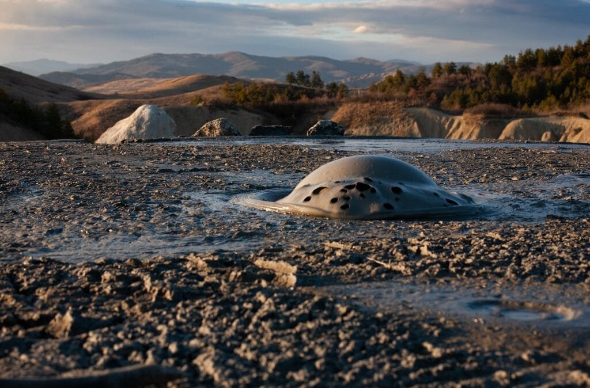

If you've ever been curious about the fiery marvels that dot our planet's surface, then exploring the geological origins of volcanoes is a fascinating journey worth embarking upon. Volcanoes, those majestic and often unpredictable natural formations, are not only awe-inspiring to behold, but they also provide valuable insights into Earth's inner workings. From the fiery eruptions that shape entire landscapes to the devastating disasters they can bring forth, volcanoes are a captivating subject that offers a multitude of stories waiting to be unraveled. By delving into the types, causes, and hazards of volcanoes, we can gain a deeper understanding of these geological wonders that have intrigued humanity for centuries. So, fasten your seatbelt, because we're about to take a thrilling ride into the heart of volcanology.

<iframe width="560" height="315" src="https://www.youtube.com/embed/VNGUdObDoLk" frameborder="0" allow="accelerometer; autoplay; encrypted-media; gyroscope; picture-in-picture" allowfullscreen></iframe>

  

## Formation Process of Volcanoes

### Eruption of molten rock, gases, and debris

Volcanoes are formed when molten rock, known as magma, rises to the surface of the Earth. This process occurs through volcanic eruptions, where the magma, gases, and debris are expelled. The eruption can be explosive or effusive, depending on the viscosity of the magma and the amount of gas content.

During an explosive eruption, highly viscous magma blocks the volcanic vent, causing pressure to build up. Eventually, the pressure becomes too great, leading to a violent eruption. This type of eruption typically results in the formation of composite volcanoes or stratovolcanoes. These are tall and steep-sided volcanoes that are composed of layers of lava, ash, and other volcanic materials.

On the other hand, an effusive eruption occurs when the magma is less viscous and allows gas bubbles to escape more easily. This type of eruption results in the formation of shield volcanoes. Shield volcanoes have a low and broad shape due to the gentle flow of lava over long distances.

### Actions at Earth's tectonic plate boundaries

The formation of volcanoes is closely related to the movements and interactions of tectonic plates. The Earth's lithosphere, which consists of several large plates, floats on the semi-fluid asthenosphere beneath it. At plate boundaries, where the edges of these plates meet, various tectonic processes occur that can lead to the formation of volcanoes.

One type of plate boundary where volcanoes commonly form is called a convergent boundary. In this case, two plates are moving towards each other, often resulting in subduction. Subduction occurs when one plate is forced beneath another into the Earth's mantle. As the subducting plate reaches deeper into the mantle, it begins to melt and form magma. This magma rises to the surface, resulting in volcanic activity.

Another type of plate boundary where volcanoes can form is a divergent boundary. At divergent boundaries, plates are moving apart, creating rift zones. Magma rising from the mantle can exploit these rift zones to reach the surface, forming volcanoes along the cracks.

### Concept of rift zones and the connection to volcanic activities

Rift zones play a significant role in volcanic activities. These zones are created when tectonic plates move apart, creating gaps or cracks in the Earth's crust. The gaps allow magma to rise from the mantle to the surface, resulting in volcanic eruptions.

Rift zones are commonly found along divergent plate boundaries, such as the Mid-Atlantic Ridge. As the plates separate, magma fills the gap, forming a new crust. Over time, repeated eruptions along the rift zone can create long chains of volcanoes.

One well-known example of a rift zone is the East African Rift. This rift extends for thousands of kilometers and is responsible for the formation of many volcanoes in countries like Kenya, Ethiopia, and Tanzania. This demonstrates how rift zones can be a significant factor in the formation of volcanoes.

## Geographic Locations of Volcanoes

### 'Ring of Fire' and its concentration of volcanoes

The 'Ring of Fire' is a major area in the basin of the Pacific Ocean where a large number of earthquakes and volcanic eruptions occur. The ring stretches from the west coast of the Americas, across the Pacific Ocean, to Japan and the Philippines. It encompasses numerous tectonic plate boundaries, including subduction zones and volcanic arcs.

The high concentration of volcanoes in the 'Ring of Fire' is due to the presence of subduction zones. Subduction occurs when one tectonic plate is forced beneath another. This process leads to the formation of volcanoes as the subducting plate melts and generates magma, which eventually rises to the surface.

Volcanoes in the 'Ring of Fire' are known for their explosive eruptions and are responsible for some of the deadliest volcanic events in history, such as the 1815 eruption of Mount Tambora in Indonesia and the 1980 eruption of Mount St. Helens in the United States.

### Distribution of hot spots and their role in volcano formation

Hot spots are another significant factor in the distribution of volcanoes. These are areas of the Earth's mantle where mantle plumes, or columns of hot and buoyant material, rise towards the surface. When a tectonic plate moves over a hot spot, a volcanic eruption can occur.

One well-known example of a hot spot is the Hawaiian Islands. The islands are formed by a hot spot beneath the Pacific Plate. As the Pacific Plate moves northwest, new volcanoes are formed, with the oldest ones eroding and sinking below sea level.

Hot spots can create a chain of volcanoes as the tectonic plate moves over the fixed location of the hot spot. This is evident in the formation of the Hawaiian-Emperor seamount chain, where the combination of volcanic activity and plate movement has created a long chain of underwater seamounts and islands.

Understanding the geographic distribution of volcanoes, such as the 'Ring of Fire' and hot spots, provides valuable insights into the factors that contribute to their formation and activity.

This image is property of pixabay.com.

## Types of Volcanoes

### Composite volcanoes or stratovolcanoes

Composite volcanoes, also known as stratovolcanoes, are tall and symmetrical mountains that are formed by alternating layers of lava flows, volcanic ash, and pyroclastic materials. These types of volcanoes are typically found at subduction zones where an oceanic plate is forced beneath a continental plate.

The eruptions of composite volcanoes are often explosive and can release a combination of ash, gas, and lava. This explosive nature is due to the high viscosity of the magma, which traps gas bubbles and increases pressure before an eruption.

Famous composite volcanoes include Mount Fuji in Japan, Mount Rainier in the United States, and Mount Vesuvius in Italy.

### Shield volcanoes and their link to hot spots

Shield volcanoes are characterized by a low, broad shape and gently sloping sides. They are formed by the accumulation of fluid lava flows that spread out horizontally, creating a shield-like profile.

Shield volcanoes are commonly associated with hot spots, where a mantle plume rises to the surface. The low viscosity of the magma from hot spots allows it to flow easily, resulting in the gradual buildup of a broad volcano over time.

The Hawaiian Islands, Mauna Loa and Kilauea in particular, are prime examples of shield volcanoes. These volcanoes have been continuously erupting for centuries, adding layer upon layer of lava to their slopes.

### Cinder cone volcanoes

Cinder cone volcanoes, also known as scoria cones, are the simplest and smallest type of volcano. They are usually less than 300 meters in height and have steep sides. Cinder cones are formed by the explosive eruption of fragmented magma fragments called cinders or scoria.

These eruptions occur when gases trapped in the magma are rapidly released, causing the magma to explode into the air. The ejected cinders fall back to the ground and accumulate around the vent, forming a cone-shaped volcano.

Cinder cone volcanoes are typically short-lived and can form in various volcanic environments. They can be found as standalone volcanoes or as part of larger volcanic complexes.

### Lava domes

Lava domes are formed when highly viscous lava slowly accumulates around a volcanic vent, causing a dome-shaped structure to form. These domes are composed of thick, sticky lava that does not flow far from the vent.

Lava domes are often associated with explosive eruptions and can occur in a variety of volcanic settings, including composite volcanoes and stratovolcanoes. Their growth is characterized by slow extrusion of lava, which can lead to the formation of steep-sided domes.

Famous examples of lava domes include Mount Pelee in Martinique and the Soufriere Hills volcano in Montserrat.

[Understanding the different types of volcanoes](https://magmamatters.com/understanding-volcanic-formation-a-comprehensive-guide/ "Understanding Volcanic Formation: A Comprehensive Guide") helps us grasp the variety of shapes and eruption styles that can occur. Each type is formed by distinct geological processes and can have different hazards associated with them.

## Eruption Patterns of Volcanoes

### Role of lava viscosity in determining eruption types

The viscosity, or stickiness, of lava plays a crucial role in determining the type of eruption a volcano will experience. The viscosity is influenced by the composition and temperature of the magma.

Highly viscous lava has a thick and sticky consistency, which inhibits gas bubbles from escaping easily. As pressure builds up within the magma chamber, an explosive eruption is more likely to occur. Explosive eruptions are characterized by the violent ejection of ash, pyroclastic materials, and volcanic gases.

On the other hand, low-viscosity lava has a thin and runny consistency, allowing gas bubbles to escape more freely. This type of lava can flow more easily, resulting in effusive eruptions. Effusive eruptions are generally less explosive, and lava flows out from the volcano in a steady manner.

### Importance of gas content in influencing eruption patterns

The gas content in magma also plays a significant role in influencing eruption patterns. As magma rises towards the surface, the decrease in pressure allows dissolved gases, primarily water vapor and carbon dioxide, to come out of solution and form bubbles within the magma.

The amount and composition of these gases can determine the explosiveness of an eruption. Higher gas content can lead to more explosive eruptions because the buildup of gas pressure increases the likelihood of a violent release.

Gas-rich magma can produce violent eruptions that eject large quantities of ash, pyroclastic materials, and volcanic gases into the atmosphere. These eruptions can have significant impacts on the surrounding environment, climate, and air quality.

Understanding the role of lava viscosity and gas content in eruption patterns is crucial for predicting the behavior of volcanoes and assessing the potential hazards they pose.

This image is property of pixabay.com.

## Hazards Associated with Volcanoes

### Release of ash and gas during eruptions

Volcanic eruptions release various hazards that can pose risks to human health and the environment. One significant hazard is the release of ash and volcanic gases into the atmosphere.

Volcanic ash is composed of tiny rock and mineral fragments that are created during explosive volcanic eruptions. The ash can travel long distances, carried by wind, and can severely impact areas far from the volcano. Ashfall can cause respiratory problems, damage crops, disrupt transportation systems, and damage infrastructure.

Volcanic gas emissions during eruptions include gases such as sulfur dioxide, carbon dioxide, and hydrogen sulfide. These gases can pose immediate health risks, such as respiratory issues, as well as contribute to the formation of acid rain, air pollution, and climate change when released into the atmosphere.

### Flows of hot rocks and gas, or pyroclastic flows

Pyroclastic flows are fast-moving currents of hot rock fragments, ash, and gas that can travel down the slopes of a volcano at incredibly high speeds. These flows can reach temperatures of several hundred degrees Celsius and can be devastating to anything in their path.

Pyroclastic flows are caused by the collapse of eruption columns or the release of hot debris from the dome of a [volcano](https://magmamatters.com/the-environmental-impact-of-volcanic-eruptions-2/ "The Environmental Impact of Volcanic Eruptions"). They can travel downhill at speeds of over 100 kilometers per hour, leveling everything in their way. Pyroclastic flows have been responsible for some of the deadliest volcanic events in history, such as the 1902 eruption of Mount Pelée in Martinique.

### Lava flows and volcanic landslides

Lava flows occur when magma reaches the surface and flows downslope, gradually covering the surrounding terrain. These flows can be relatively slow-moving depending on the viscosity of the lava, allowing people to evacuate and minimize casualties.

Nevertheless, lava flows can still pose risks to infrastructure and property, as they can destroy anything in their path. Structures in the way of lava flows can be engulfed and destroyed by the intense heat.

Volcanic landslides, known as lahars, can also occur during or after volcanic eruptions. Lahars are a mixture of volcanic debris, sediment, and water that flow down river valleys, often following heavy rainfall or the melting of snow and ice. Lahars can be extremely destructive, burying communities and infrastructure under layers of mud and debris.

### Gas emissions and their effects

Volcanoes release significant amounts of gases into the atmosphere, both during eruptions and in periods of volcanic activity. These emissions can have various effects on the environment and climate.

Sulfur dioxide (SO2) emissions from volcanoes can lead to the formation of sulfate aerosols in the upper atmosphere. These aerosols can reflect sunlight back into space, causing a temporary cooling effect on the Earth's surface. However, they can also lead to the depletion of the ozone layer and contribute to acid rain formation when they react with water vapor.

Carbon dioxide (CO2) emissions from volcanoes, although lower compared to human activities, can contribute to the greenhouse effect and climate change. Over the long term, volcanic CO2 emissions can accumulate in the atmosphere, affecting global temperatures and contributing to the planet's warming.

Understanding the hazards associated with volcanic eruptions is vital for developing effective mitigation strategies and ensuring the safety of communities living near volcanoes.

## Positive Impacts of Volcanoes

### Contribution of volcanic materials to soil fertility

Volcanic eruptions, despite their destructive nature, have positive impacts on the environment. One of the most significant benefits of volcanic activity is the contribution of volcanic materials to soil fertility.

Volcanic ash is rich in minerals and nutrients, making it an excellent natural fertilizer. When ash settles on the ground, it enriches the soil by replenishing essential elements such as nitrogen, phosphorus, and potassium. These nutrients are vital for plant growth and play a crucial role in agriculture.

Volcanic soil, also known as Andisols, is renowned for its ability to retain moisture and nutrients, allowing plants to thrive. Many volcanic regions around the world have highly productive agricultural lands due to the fertile soil resulting from past volcanic eruptions.

### Generation of geothermal energy

Volcanoes and volcanic areas provide a unique source of renewable energy known as geothermal energy. Geothermal energy harnesses the heat stored within the Earth to generate electricity and heat buildings.

In volcanic regions, heat from the magma chamber beneath the surface can be accessed through wells drilled into the ground. The hot water or steam extracted from these wells is used to power turbines and generate electricity. Additionally, geothermal energy can be directly used for heating purposes, reducing the reliance on fossil fuels.

Countries like Iceland and New Zealand have made significant investments in geothermal energy, utilizing the natural resources provided by volcanic activity to generate sustainable and clean energy.

### Formation of islands and landscapes

Volcanoes play a crucial role in shaping the Earth's surface, contributing to the formation of islands and breathtaking landscapes. Volcanic activity, especially in oceanic regions, can result in the creation of new landmasses and islands.

For example, the Hawaiian Islands were formed by a succession of volcanic eruptions from a single hotspot. Over time, as lava flows cooled and solidified, the islands emerged from the ocean. These volcanic islands form unique ecosystems that support diverse wildlife and attract visitors from around the world.

Volcanic landscapes are also known for their scenic beauty, attracting tourists and nature enthusiasts. Landforms such as lava fields, calderas, volcanic cones, and geothermal features contribute to stunning and unique environments that showcase the dynamic forces of the Earth.

Understanding the positive impacts of [volcanoes helps us appreciate the intricate relationship between geological](https://magmamatters.com/geothermal-energy-and-its-volcanic-origins/ "Geothermal Energy and Its Volcanic Origins") processes and the environment.

This image is property of pixabay.com.

## Volcanology: A Historical Overview

### Early observations and theories on volcanoes

Volcanology, the scientific study of volcanoes, has a long and fascinating history. Throughout the ages, people have been captivated by the awe-inspiring power and beauty of volcanoes, leading to various theories and observations about their nature.

One of the earliest known records of volcanic activity comes from the ancient Romans who witnessed the devastating eruption of Mount Vesuvius in 79 AD. This eruption buried the cities of Pompeii and Herculaneum under layers of volcanic ash and pumice, preserving them for future generations to study.

In the following centuries, natural philosophers and scientists, such as Pliny the Elder, began to study and document volcanic phenomena. They recognized the connection between volcanic eruptions and the release of gases, lava, and ash.

During the Enlightenment, volcanology gained more scientific attention, and theories about the Earth's internal structure and the origin of volcanoes began to emerge. Scientists like George-Louis Leclerc, Comte de Buffon, and James Hutton theorized that volcanic activity was caused by the Earth's internal heat and the movement of molten rock beneath the surface.

### Modern developments in volcanology

In the 20th century, advancements in technology and scientific methods revolutionized the study of volcanoes. The invention of seismographs allowed scientists to monitor and measure earthquake activity associated with volcanic eruptions. This provided valuable insights into the movements of magma beneath the surface.

The development of remote sensing tools, such as satellites and ground-based sensors, enabled scientists to monitor volcanic activity from a distance. These tools can detect changes in volcanic gases, temperatures, and ground deformation, helping to predict eruptions and assess potential hazards.

Volcanic monitoring networks have been established around the world, allowing scientists to continuously monitor active volcanoes. This real-time data helps in the formulation of timely warnings and the implementation of appropriate emergency response measures.

### Influence of technology in studying volcanoes

The rise of technological advancements, such as computer simulations and modeling, has greatly enhanced our understanding of volcanic processes. These tools allow scientists to emulate volcanic eruptions and study the behavior of different types of volcanoes under various conditions. Such simulations aid in predicting the potential impacts of volcanic eruptions and guiding mitigation strategies.

Furthermore, the development of advanced imaging techniques, such as LiDAR (Light Detection and Ranging) and thermal imaging, has enabled scientists to create detailed maps of volcanic features and monitor thermal activity. These tools provide valuable information about the structure, composition, and changes in volcanic landforms.

The field of volcanology continues to evolve as new technologies are developed and insights are gained into the complex processes that govern volcanic activity. This knowledge helps in understanding the history, behavior, and potential hazards of volcanoes, ultimately contributing to the safety and well-being of communities living in volcanic regions.

## Monitoring and Predicting Volcanic Activities

### Techniques used in monitoring volcano activities

Monitoring volcanic activities is essential for assessing the current state of a volcano and predicting potential eruptions. Several techniques and tools are utilized by volcanologists to monitor volcanoes:

1. Seismology: Seismic monitoring involves the use of seismometers to measure the vibrations and movements of the ground. This helps in detecting earthquakes associated with volcanic activity, as well as the movement of magma beneath the surface.
    
2. Gas monitoring: Volcanic gases, such as [sulfur dioxide and carbon](https://magmamatters.com/the-art-and-science-of-volcano-monitoring/ "The Art and Science of Volcano Monitoring") dioxide, are essential indicators of volcanic activity. Gas analyzers and spectrometers are used to measure the concentration and composition of these gases. Changes in gas emissions can signal changes in volcanic activity.
    
3. Ground deformation: Monitoring the shape and elevation changes of a volcano can provide insights into the movement of magma. Techniques like GPS (Global Positioning System) and InSAR (Interferometric Synthetic Aperture Radar) are used to measure and map ground deformation.
    
4. Thermal imaging: Thermal cameras and infrared sensors are used to detect changes in surface temperature, providing information about the presence of magmatic activity and volcanic vents.
    
5. Volcano observatories: Volcano observatories are established in regions with active volcanoes to monitor and collect data on volcanic activity. These observatories serve as central hubs for data collection, analysis, and dissemination to relevant authorities and communities.
    

### Challenges in predicting volcanic eruptions

Although significant advancements have been made in volcano monitoring, accurately predicting volcanic eruptions remains a complex challenge. Volcanic systems are highly dynamic, and the behavior of individual volcanoes can vary greatly.

One of the main challenges is the lack of comprehensive data on volcanic processes. Volcanoes can exhibit subtle or short-lived warning signs before an eruption, making it difficult to anticipate when and how an eruption will occur. Additionally, volcanic eruptions can be influenced by various factors, including the composition and behavior of magma, and the geological structure of the volcano.

Another challenge is the limited understanding of the precursors and indicators of volcanic eruptions. While certain patterns and changes in volcanic activity can be observed before an eruption, these signals can be unpredictable and not always indicative of an imminent eruption.

Furthermore, the social and economic impacts of false alarms and unnecessary evacuations pose ethical challenges for scientists and authorities responsible for predicting volcanic activity. Balancing the need for warning communities and minimizing the disruption caused by false alarms requires careful consideration and effective communication.

Despite these challenges, continuous monitoring, data analysis, and advancements in scientific knowledge offer hope for improved prediction and warning systems in the future. Such progress can help in mitigating the risks associated with volcanic eruptions and saving lives.

## Mitigation Strategies for Volcanic Hazards

### Evacuation plans and emergency responses

One of the most critical mitigation strategies for volcanic hazards is the development and implementation of evacuation plans and emergency response measures. These plans provide guidelines for the orderly evacuation of communities and the organization of emergency services during volcanic crises.

Evacuation plans should include clear protocols and procedures for identifying high-risk areas, triggering evacuation orders, and establishing safe zones for affected populations. It is crucial to ensure that the plans are regularly updated based on the latest scientific knowledge and the evolving nature of volcanic hazards.

In addition to evacuation plans, effective communication systems are essential to ensure that communities receive timely and accurate information about potential volcano-related risks. This includes establishing alert systems, such as sirens, text messages, and social media notifications, to inform residents of impending dangers.

Emergency response measures should involve training emergency personnel, conducting drills and exercises, and stockpiling necessary supplies and equipment. These measures help ensure a coordinated and swift response to volcanic crises, minimizing the impact on the affected population.

### Engineering solutions to control lava flows

In areas prone to frequent lava flows, engineering solutions can be employed to minimize the impact of these hazards on human settlements and infrastructure. One such solution is the construction of lava channels or barriers that divert the flow away from vulnerable areas.

Lava diversion channels can be dug or constructed using materials resistant to high temperatures, such as concrete or refractory bricks. These channels redirect the flow of lava, allowing it to bypass populated areas and infrastructure.

Another engineering solution is the development of heat-resistant materials and building designs. Constructing structures with materials that can withstand high temperatures and incorporating heat-resistant features can help prevent or minimize damage caused by lava flows.

Additionally, land-use planning is crucial in volcanic regions to ensure that vulnerable areas, such as floodplains or areas close to a volcano, are not heavily populated or developed. Regulations and zoning laws can help steer development away from high-risk zones and reduce the potential impact of volcanic hazards.

### Public awareness and preparedness measures

Public awareness and education are vital components of any volcanic hazard mitigation strategy. It is essential to inform communities living in volcanic areas about the risks they face and the actions they can take to protect themselves.

Public awareness campaigns should cover topics such as recognizing signs of volcanic activity, understanding evacuation plans, and knowing where to seek reliable information during volcanic crises. This can be done through community meetings, educational programs in schools, and the dissemination of educational materials.

Preparedness measures should also be implemented at the individual level. This includes creating emergency kits with essential supplies, developing family emergency plans, and familiarizing oneself with evacuation routes and assembly points. Regular drills and exercises can help ensure that individuals and communities are prepared to respond effectively during volcanic crises.

By promoting public awareness, educating communities, and encouraging individual preparedness, mitigation strategies can enhance the resilience of populations living in volcanic regions and reduce the potential impact of volcanic hazards.

## Volcanoes and Climate Change

### Volcanic eruptions and global cooling

Volcanic eruptions can have a significant impact on global climate patterns, both in the short term and long term. Large volcanic eruptions have been known to cause temporary cooling effects on the Earth's surface.

During explosive eruptions, volcanic ash and aerosols are injected into the atmosphere. These particles can remain suspended for months or even years, reflecting sunlight back into space. As a result, less solar radiation reaches the Earth's surface, leading to a decrease in global temperatures.

One notable example of the cooling effect of volcanic eruptions is the 1815 eruption of Mount Tambora in Indonesia. This eruption injected a massive amount of ash and sulfur dioxide into the atmosphere, causing the following year (1816) to be known as the "Year Without a Summer" due to the unusually cold temperatures recorded worldwide.

However, it is important to note that while volcanic eruptions can result in short-term cooling effects, their contribution to long-term climate change is relatively minor compared to human-induced factors such as greenhouse gas emissions.

### Contribution of volcanoes to greenhouse gases

Volcanic eruptions also release greenhouse gases into the atmosphere, albeit on a smaller scale compared to human activities. Volcanoes emit gases such as carbon dioxide, methane, and sulfur dioxide, which can have long-term effects on the Earth's climate.

While the amounts of these gases released by volcanoes are relatively small compared to human activities, they can still contribute to changes in the Earth's energy balance. For example, carbon dioxide emissions from volcanoes can add to the concentration of this greenhouse gas in the atmosphere, contributing to the overall warming effect.

Additionally, volcanic emissions of sulfur dioxide can lead to the formation of sulfate aerosols, which reflect sunlight back into space. The presence of these aerosols can have a cooling effect on the Earth's surface, offsetting some of the warming caused by greenhouse gases.

It is important to understand the role of volcanoes in the global climate system and differentiate between their short-term cooling effects and the long-term consequences of human-induced climate change.

### Long-term climate impacts of large-scale volcanic activities

While individual volcanic eruptions may have short-term impacts on climate, large-scale volcanic activities over thousands or millions of years can play a role in shaping the long-term climate patterns on Earth.

Volcanic emissions, particularly carbon dioxide, can influence atmospheric compositions and greenhouse gas concentrations over geological timescales. Changes in greenhouse gas concentrations can affect the Earth's climate, contributing to global warming or cooling.

Furthermore, volcanic eruptions can alter the chemical composition of the atmosphere, leading to increased aerosol formation and changes in cloud formation processes. These changes can have complex and long-lasting effects on climate, including alterations in precipitation patterns and atmospheric circulation.

Studying the long-term climate impacts of large-scale volcanic activities provides insights into natural climate variability and helps contextualize the human-induced changes occurring today. It highlights the importance of understanding both natural and human factors in climate change discussions and the need for sustainable practices to mitigate and adapt to climate change.

In conclusion, the comprehensive study of volcanoes encompasses various aspects, from their formation processes and geographic locations to eruption patterns, hazards, and positive impacts. Volcanoes have shaped our planet's landscape, impacted our climate, and influenced human history and development. Understanding and studying volcanoes is not only a fascinating scientific pursuit but also holds immense practical value in terms of predicting volcanic activities, managing volcanic hazards, and promoting the safety and well-being of communities living in volcanic regions.

