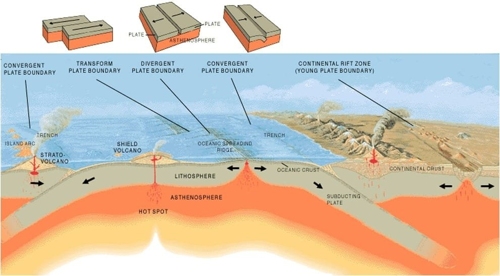
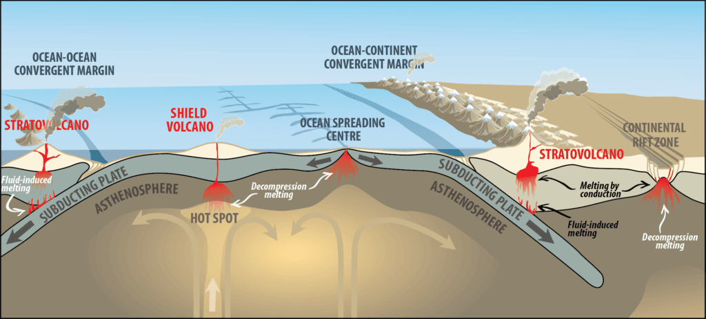
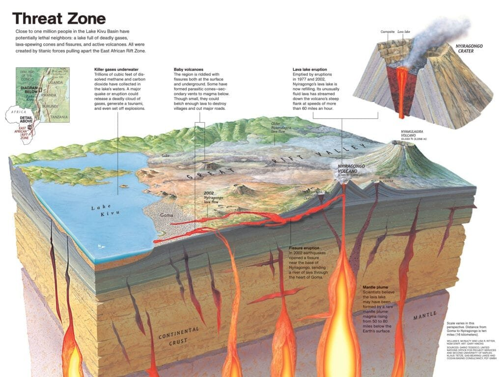
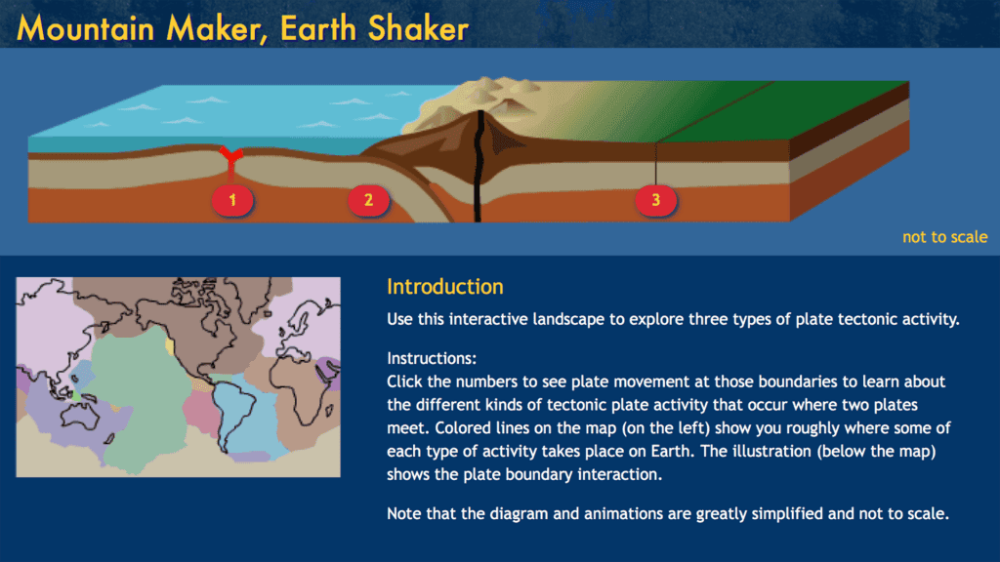

Let's embark on an exciting journey to explore the fascinating mechanisms behind plate tectonics and volcano formation. Volcanoes are born from the explosive combination of molten rock, gases, and debris that erupts onto the earth's surface, unleashing powerful displays of lava and ash. These volcanic phenomena occur at specific locations along plate boundaries, hotspots deep within the earth's crust, or rift zones where tectonic plates slowly drift apart. The famous "Ring of Fire," encircling the Pacific Ocean, is a prime example of a region prone to volcanic eruptions due to the convergence of tectonic plates. From the gradual formation of shield volcanoes in Hawaii to the devastatingly explosive eruptions of stratovolcanoes, the eruption patterns vary depending on factors like the viscosity of lava and gas content. By understanding these mechanisms, we can predict future volcanic activity and mitigate risks to communities living in their vicinity. So, let's dive into the mesmerizing world of plate tectonics and volcano formation, unraveling the mysteries behind these natural wonders.

This image is property of www.bgs.ac.uk.

## Understanding Plate Tectonics

Plate tectonics is a scientific theory that explains the movement and interaction of the Earth's lithospheric plates. The theory suggests that the Earth's crust is divided into several large and small plates that are constantly moving and colliding with each other. These plates float on the semi-fluid asthenosphere beneath them.

### The Theory of Plate Tectonics

The theory of plate tectonics suggests that the Earth's lithosphere is divided into several rigid plates that move and interact with each other. This movement creates various geological features such as mountains, valleys, and oceanic trenches. The theory explains the occurrence of earthquakes, volcanic activity, and the formation of new crust through seafloor spreading and subduction.

### Major and Minor Tectonic Plates

The Earth's lithosphere is divided into several major and minor tectonic plates. The major plates include the Pacific Plate, North American Plate, Eurasian Plate, African Plate, Antarctic Plate, and Indo-Australian Plate. These plates are larger in size and play a significant role in shaping the Earth's surface. The minor plates are smaller in size and include plates such as the Juan de Fuca Plate, Cocos Plate, and Caribbean Plate.

### Movements of Tectonic Plates

Tectonic plates can move in three different ways: divergent boundaries, convergent boundaries, and transform boundaries. At divergent boundaries, plates move apart from each other, creating new crust through seafloor spreading. Convergent boundaries occur when two plates collide, leading to subduction or the formation of mountain ranges. Transform boundaries involve plates sliding past each other horizontally.

## Characteristics of Volcanoes

Volcanoes are fascinating geological features that result from the eruption of molten rock, gases, and debris onto the Earth's surface. They can be found in various forms and exhibit different eruption patterns based on their characteristics.

### Defining a Volcano

A volcano is a vent or opening in the Earth's crust through which molten rock, known as magma, along with gases and solid materials, reach the surface. This eruption can lead to the formation of various landforms such as lava flows, volcanic ash, and volcanic cones.

### Types of Volcanic Eruptions

Volcanoes can exhibit different types of eruptions, classified based on the explosiveness and types of materials emitted. Common volcanic eruption types include effusive eruptions, explosive eruptions, and phreatomagmatic eruptions. Effusive eruptions involve the relatively gentle and steady release of magma onto the surface, while explosive eruptions are characterized by violent and powerful eruptions caused by the rapid expansion of gases. Phreatomagmatic eruptions occur when magma interacts with water.

### Geometry of Volcanoes

Volcanoes can have different shapes and sizes, which are determined by the type of eruption and the characteristics of the magma. The three main types of volcanoes are composite or strato volcanoes, shield volcanoes, and [cinder cones](https://magmamatters.com/the-birth-of-new-land-understanding-cinder-cones/). Composite volcanoes are tall and steep, with alternating layers of lava and ash. Shield volcanoes have a broad and gently sloping shape, formed by the accumulation of fluid lava flows. Cinder cones are smaller, conical volcanoes formed by the eruption of pyroclastic materials.

This image is property of images.nationalgeographic.org.

## Interaction of Plate Tectonics and Volcanoes

The relationship between plate tectonics and volcanoes is crucial in understanding the distribution and formation of volcanic activity around the world. Plate tectonic processes can directly influence the occurrence of volcanic eruptions.

### Plate Tectonics and Volcanic Hotspots

Volcanic hotspots are areas underneath the Earth's crust where there is an upwelling of magma. These hotspots are not directly related to plate boundaries but can be influenced by the movement of tectonic plates. As a tectonic plate moves over a hotspot, a chain of volcanic islands or seamounts is formed. The Hawaiian Islands are a classic example of a hotspot volcano chain.

### Volcanoes and Tectonic Boundaries

Volcanoes are commonly found along tectonic plate boundaries. At convergent plate boundaries, where one plate is subducted beneath another, volcanoes may form due to the melting of the subducting plate. Subduction zones, such as the Pacific Ring of Fire, are known for their intense volcanic activity. Volcanoes can also form at divergent plate boundaries, where magma rises to fill the gap between separating plates. Transform plate boundaries can also experience volcanic activity, although to a lesser extent.

### How Movements of Tectonic Plates Lead to Volcanic Eruptions

The movements of tectonic plates directly influence the occurrence of volcanic eruptions. When plates collide or separate, the resulting stresses and pressures can lead to the melting of rocks and the generation of magma. This magma can then rise to the surface, leading to volcanic eruptions. Additionally, subduction zones can create conditions for the formation of magma chambers, which can later erupt as volcanoes.

## Location of Volcanoes

Volcanoes are distributed around the globe, with certain regions experiencing higher volcanic activity than others. The location of volcanoes is influenced by plate tectonics, hotspots, and rift zones.

### Ring of Fire and its Volcanic Activity

The Ring of Fire is a major area in the basin of the Pacific Ocean where a large number of earthquakes and volcanic eruptions occur. It is associated with a nearly continuous series of oceanic trenches, volcanic arcs, volcanic belts, and plate movements. The Ring of Fire is a result of the subduction of oceanic plates beneath the surrounding continental plates.

### Hotspot Volcanoes like Hawaii

Hotspot volcanoes, like those found in Hawaii, are not directly associated with plate boundaries. They occur as a result of a stationary source of heat beneath the Earth's crust. As the Pacific Plate moves over the hotspot, a chain of volcanic islands is formed. The Hawaiian Islands have been created over millions of years as the Pacific Plate continues to move over the hotspot.

### Volcanoes in Rift Zones

Volcanoes can also be found in rift zones, where the Earth's tectonic plates are moving apart. These regions are characterized by volcanic activity as magma rises to fill the gap created by separating plates. The East African Rift Valley, for example, is a prime location for volcanic activity due to the ongoing separation of the African Plate.

This image is property of opentextbc.ca.

## Types of Volcanoes

Volcanoes come in various forms and shapes, each with its unique characteristics determined by the type of eruption and the composition of the magma.

### Composite or Strato Volcanoes

Composite or strato volcanoes are tall and steep-sided mountains with symmetrical cones. They are composed of alternating layers of solidified lava flows, volcanic ash, and other pyroclastic materials. These volcanoes often exhibit explosive eruptions due to the high viscosity of the magma, which traps gases and leads to pressure build-up.

### Shield Volcanoes

Shield volcanoes have a broad and gently sloping cone shape, resembling a warrior's shield lying on the ground. They are formed by the eruption of fluid lava, which spreads out in all directions and gradually builds up the volcano's gently sloping sides. Shield volcanoes are typically larger in size compared to other volcano types, and they often exhibit relatively non-explosive eruptions.

### Cinder Cones

Cinder cones are the simplest and smallest [type of volcano](https://magmamatters.com/understanding-volcanic-formation-a-comprehensive-guide/ "Understanding Volcanic Formation: A Comprehensive Guide"). They are formed by the eruption of pyroclastic materials, such as volcanic ash, lapilli, and cinders. Cinder cones are typically short-lived and can form quickly during a single eruption. They have a steep, cone-like shape and often have a small crater at the summit.

## Mechanism of Volcanic Eruptions

Volcanic eruptions are complex processes driven by various factors, including the characteristics of magma, lava viscosity, gas content, and pressure build-up.

### Role of Magma in Eruptions

Magma plays a crucial role in volcanic eruptions. Magma is formed through the melting of rock in the Earth's mantle or crust. It consists of molten rock, dissolved gases, and solid materials. As pressure builds up in the magma chamber, the magma rises to the surface, leading to an eruption. The composition and viscosity of the magma determine the explosiveness of the eruption.

### Lava Viscosity and Eruption Patterns

The viscosity of lava, or its resistance to flow, affects the eruption pattern of a volcano. Lava with high viscosity tends to be more sticky and flows slower, leading to more explosive eruptions as gases become trapped within the magma. On the other hand, low viscosity lava can flow more easily, resulting in less explosive eruptions with relatively gentle lava flows.

### Gas Contents in Magma and its Role in Eruptions

Gases dissolved in magma play a significant role in volcanic eruptions. As magma rises to the surface, the decrease in pressure allows the dissolved gases to form bubbles. The expansion of these gas bubbles can lead to explosive eruptions as the magma fragments into volcanic ash and pyroclastic materials. The type and amount of gases in the magma can vary, influencing the eruptive behavior of the volcano.

This image is property of images.nationalgeographic.org.

## Hazards of Volcanoes

Volcanic eruptions can pose various hazards to both the environment and human populations living in their vicinity. These hazards can range from explosive eruptions to non-explosive hazards associated with volcanic activity.

### Eruptive Hazards

Explosive volcanic eruptions can generate numerous hazards. Pyroclastic flows, which are fast-moving currents of hot gas and volcanic particles, can travel down the slopes of a volcano, causing destruction in their path. Ashfall, volcanic ash and rock fragments that are ejected into the atmosphere, can blanket wide areas, affecting visibility, damaging crops, and causing respiratory problems. Lahars, or volcanic mudflows, can occur when volcanic materials mix with water, rapidly flowing down valleys and posing a significant threat to downstream communities.

### Non-Eruptive Hazards

Volcanoes can also create hazards that are not directly associated with explosive eruptions. Ground deformation, such as uplift or subsidence, can occur as magma moves underground, potentially damaging infrastructure and triggering landslides. Volcanic gases released during periods of volcanic activity can be toxic and harmful to human health, particularly [sulfur dioxide and carbon](https://magmamatters.com/the-art-and-science-of-volcano-monitoring/ "The Art and Science of Volcano Monitoring") dioxide. Additionally, volcanic earthquakes can occur as magma moves beneath the surface, potentially causing damage to buildings and infrastructure.

### Volcanic Disasters in History

Throughout history, numerous volcanic eruptions have resulted in devastating disasters. The eruption of Mount Vesuvius in 79 AD buried the Roman cities of Pompeii and Herculaneum, preserving them under layers of ash and debris. The eruption of Mount Tambora in 1815 led to the "Year Without a Summer" and widespread famine. More recently, the eruption of Mount Pinatubo in 1991 caused significant destruction and led to the displacement of thousands of people in the Philippines.

## Benefits of Volcanoes

While volcanoes can be destructive, they also provide several benefits to the environment and human societies. These benefits range from fertile [volcanic soils to the production of geothermal energy](https://magmamatters.com/geothermal-energy-and-its-volcanic-origins/ "Geothermal Energy and Its Volcanic Origins").

### Fertility of Volcanic Soil

Volcanic eruptions can enrich the surrounding soil with minerals and nutrients, making it highly fertile. The volcanic ash and rock fragments contain various elements that are essential for plant growth, including nitrogen, phosphorus, and potassium. Volcanic soils are known for their fertility and are often used for agricultural purposes, yielding bountiful harvests.

### Geothermal Energy Production

Volcanoes also play a crucial role in the production of geothermal energy. Geothermal energy is derived from the heat generated by the Earth's interior, including the heat associated with volcanic activity. Geothermal power plants utilize this heat to produce electricity, providing a sustainable and renewable source of energy.

### Volcanic Materials in Industrial Use

Volcanic materials, such as pumice, obsidian, and basalt, have various industrial applications. Pumice, a lightweight volcanic rock, is used in the production of concrete, abrasive cleaners, and cosmetics. Obsidian, a naturally occurring glassy rock, has been used historically for tools, weapons, and jewelry. Basalt, a common volcanic rock, is utilized in the construction industry for its durability and resistance to weathering.

This image is property of static.pbslearningmedia.org.

## Technologies for Volcano Monitoring and Prediction

Advances in technology have significantly improved the monitoring and prediction of volcanic activity, allowing scientists to better understand volcanic processes and provide early warnings to at-risk communities.

### Seismic Monitoring

Seismic monitoring involves the detection and analysis of earthquakes associated with volcanic activity. By analyzing seismic waves generated by these earthquakes, scientists can determine the location and intensity of magma movement, providing valuable information about potential eruptions.

### Gas Emissions Monitoring

Monitoring the gases emitted by volcanoes is another crucial aspect of volcano monitoring. Changes in gas composition and emission rates can indicate increasing volcanic activity. Gas monitoring techniques, such as remote sensing and ground-based measurements, provide valuable data that can help scientists assess volcanic hazards and issue timely warnings.

### Ground Deformation Monitoring

Ground deformation monitoring is the measurement of changes in the Earth's surface caused by magma movement beneath a volcano. Techniques such as GPS, radar interferometry, and tiltmeters are used to detect and quantify ground deformation. These measurements provide valuable insights into the behavior of a volcano and can help forecast eruptions.

## Volcano Risk Mitigation and Community Planning

Given the potential hazards associated with volcanic eruptions, it is crucial to implement risk mitigation strategies and involve communities in disaster planning.

### Risk Assessment and Mapping

Risk assessment involves identifying and analyzing potential hazards associated with volcanic activity, as well as assessing the vulnerabilities of nearby communities and infrastructure. Hazard maps are created to visualize and communicate the specific risks and potential impacts of volcanic eruptions. These maps help guide land-use planning, evacuation routes, and the development of emergency response plans.

### Community Education and Preparedness

Education and preparedness play a vital role in reducing the risks associated with volcanic eruptions. Communities living in volcanic regions should be educated about the hazards, warning signs, and evacuation procedures. Public awareness campaigns and drills can help ensure that community members are well-informed and prepared to take appropriate actions in case of a volcanic emergency.

### Implementation of Evacuation Plans

Having effective evacuation plans in place is crucial for minimizing the potential impact of volcanic eruptions on human populations. These plans should consider the specific risks, including potential pyroclastic flows, lahars, or volcanic gases, and establish clear procedures for evacuating at-risk communities. Regular drills and exercises can help test the effectiveness of these plans and ensure that they can be implemented quickly and efficiently when needed.

In conclusion, understanding plate tectonics and the mechanisms of volcanic eruptions is essential for comprehensively studying volcanoes. The interaction of plate tectonics and volcanoes plays a significant role in their formation and distribution. Volcanic eruptions exhibit different characteristics and can pose both hazards and benefits to the environment and human societies. Advancements in technology have improved volcano monitoring and prediction, allowing for better risk mitigation strategies and community planning. By studying and understanding volcanoes, we can better prepare for future eruptions and protect the communities living in volcanic regions.

