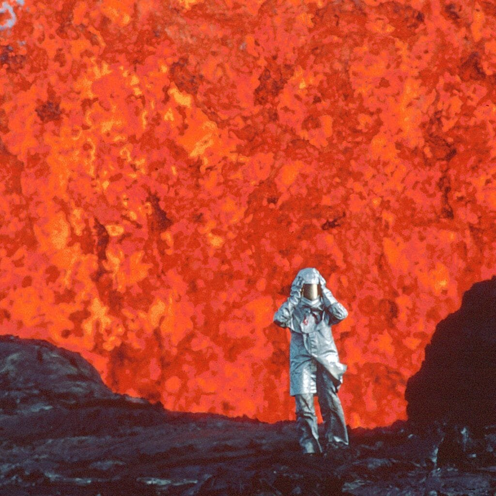
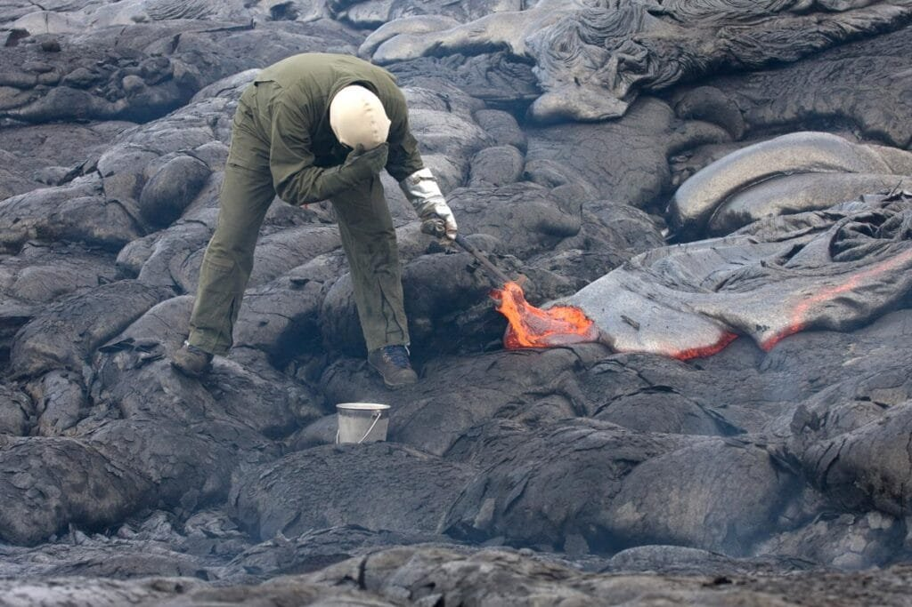
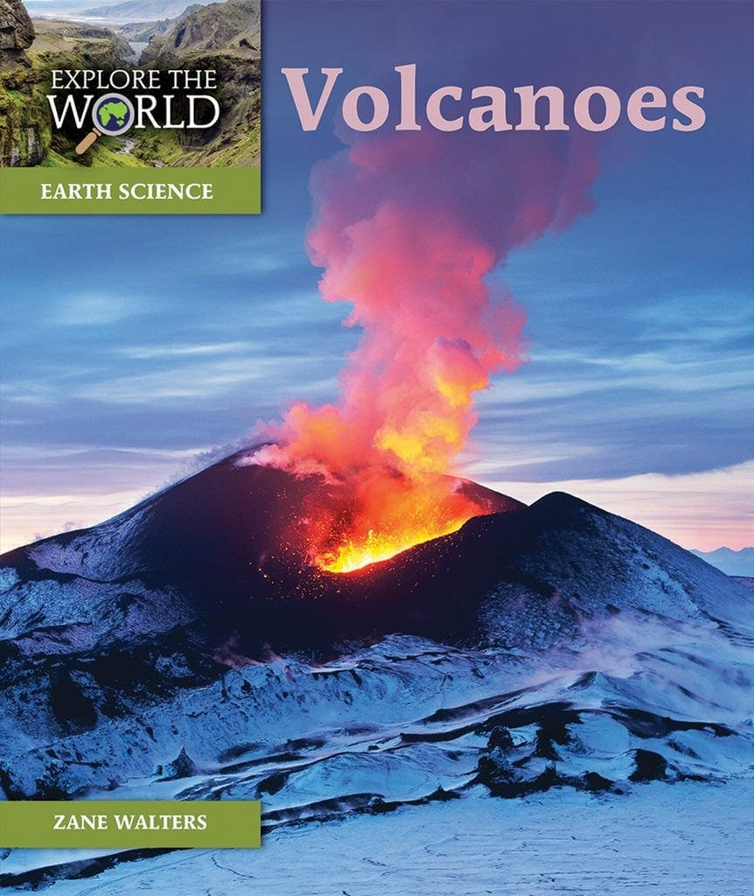
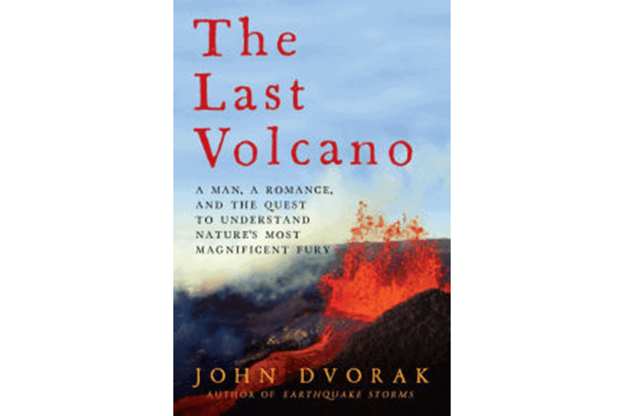
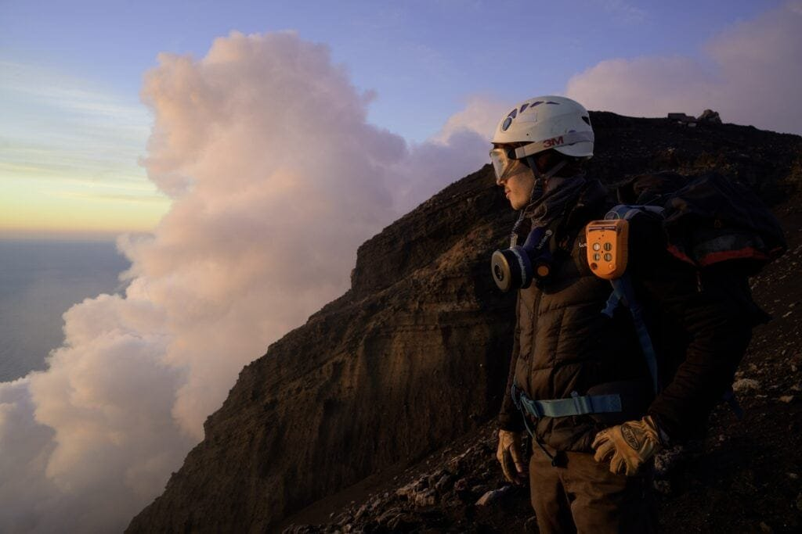

Have you ever wondered about the pioneers who dedicated their lives to studying volcanoes? In this article, we will take a closer look at the trailblazers in the historical study of volcanoes. From the formation of these magnificent geological features to the dangers they pose and the benefits they bring, these pioneers have paved the way for our understanding of volcanoes and their impact on the world around us. Join us on this journey as we explore the fascinating world of volcanic studies and the remarkable individuals who have helped shape our knowledge in this field.

This image is property of cdn.outsideonline.com.

## The Dawn of Volcanic Studies

From early civilizations to the modern era, humans have been captivated by the power and majesty of volcanoes. The study of volcanoes, known as volcanology, has a rich and fascinating history that spans thousands of years. In order to truly appreciate the advancements made in this field, it is important to explore the contributions of the trailblazers who paved the way for our present understanding of volcanoes.

### The early Greeks and their observations

The ancient Greeks were among the first to observe and document volcanic activity. The philosopher Empedocles, for instance, proposed that volcanoes were created by the release of trapped winds beneath the Earth's surface. This idea laid the groundwork for later theories on the formation of volcanoes.

### The contributions of Pliny The Elder

Perhaps one of the most influential figures in early volcanic studies was Pliny the Elder, a Roman historian and naturalist. He documented the eruption of Mount Vesuvius in 79 AD, which completely destroyed the nearby cities of Pompeii and Herculaneum. Pliny's firsthand account of this catastrophic event provided valuable insights into the behavior and hazards of volcanic eruptions.

## Medieval Perceptions of Volcanoes

During the medieval period, volcanoes were often regarded with fear and superstition. Many people believed that eruptions were a punishment from the gods or the result of supernatural forces at work. However, there were some scholars who sought to understand the nature of volcanoes through logical observation and exploration.

### Theories and beliefs

Medieval thinkers developed various theories to explain the origins of volcanic eruptions. Some believed that these fiery phenomena were caused by underground fires or the combustion of combustible materials deep within the Earth. Others attributed volcanic activity to the movement of celestial bodies or the release of underground gases.

### Documented volcanic eruptions

Despite the prevailing superstitions, there were a few brave individuals who risked their lives to document volcanic eruptions. Notable examples include the eruption of Mount Etna in 1614, which was meticulously recorded by noted scientist Francesco Maria Grimaldi. These detailed observations laid the groundwork for future scientific study of volcanic phenomena.

This image is property of upload.wikimedia.org.

## Contribution of Renaissance Scholars

The Renaissance period marked a significant shift in the study of volcanoes. Scholars began to question traditional beliefs and sought to reinterpret ancient texts in order to gain a better understanding of these natural wonders.

### Reinterpretation of ancient texts

During the Renaissance, scholars uncovered and translated ancient texts that contained valuable information about volcanoes. By studying the works of ancient Greek and Roman writers, such as Pliny the Elder, these Renaissance thinkers sought to build upon the knowledge of their predecessors and expand the field of volcanology.

### Emergence of scientific explanations

The Renaissance also saw the emergence of more scientific explanations for volcanic activity. Scholars like Leonardo da Vinci and Francis Bacon sought to understand the underlying causes of volcanic eruptions through careful observation and the application of the scientific method. Their contributions laid the foundation for modern scientific study of volcanoes.

## Early Geologic Study and Volcanism

As the field of geology began to take shape, scientists turned their attention to studying volcanism and its relation to the Earth's structure and history. This period of early geologic study provided important clues to understanding the processes that shape our planet.

### Clues from extinct volcanoes

Scientists examining extinct [volcanoes found important clues that helped to explain the nature](https://magmamatters.com/the-environmental-impact-of-volcanic-eruptions-2/ "The Environmental Impact of Volcanic Eruptions") of volcanic activity. By carefully analyzing volcanic rocks and formations, researchers were able to determine the age and characteristics of past eruptions. This allowed them to piece together a more comprehensive picture of the Earth's volcanic history.

### Fossils and sediment in stratovolcanoes

Stratovolcanoes, which are characterized by alternating layers of lava, ash, and other volcanic materials, provided scientists with a wealth of information about the Earth's geological past. The fossils and sediment found within these layers offered valuable insights into the ancient [environments in which these volcanoes](https://magmamatters.com/geothermal-energy-and-its-volcanic-origins/ "Geothermal Energy and Its Volcanic Origins") formed and erupted.

This image is property of pioneervalleybooks.com.

## The Work of James Hutton

No discussion of the pioneers in volcanic studies would be complete without mentioning the groundbreaking work of James Hutton. Often referred to as the "Father of Modern Geology," Hutton revolutionized our understanding of the Earth's crust and the processes that shape it.

### Role in modern geology

Hutton's observations and theories challenged the prevailing belief that the Earth's surface was shaped solely by biblical events such as the Great Flood. Instead, he proposed that the Earth's geological features were the result of gradual, ongoing processes that operated over vast periods of time. This idea laid the foundation for the modern field of geology, including the study of volcanoes.

### Formulation of the Earth's crust theory

One of Hutton's key contributions was his formulation of the theory of uniformitarianism. This theory posits that the same geological processes that operate today have been operating throughout the Earth's history. Hutton's ideas provided a framework for understanding the formation and behavior of volcanoes, and they continue to shape our understanding of the Earth's dynamic nature.

## The Pioneer - George Poulett Scrope

While many individuals made significant contributions to the study of volcanoes, few had as profound an impact as George Poulett Scrope. His extensive research on Italian and French volcanoes helped validate and expand upon the theories of James Hutton and laid the groundwork for future volcanic studies.

### Study of the Italian and French volcanoes

Scrope's most notable work focused on the volcanoes of Italy and France. He conducted detailed investigations of the geological formations, lava flows, and other volcanic features in these regions. His meticulous observations and analysis provided valuable insights into the processes that shape and characterize volcanic activity.

### Validation of Hutton's theories

Scrope's research played a crucial role in validating James Hutton's theories on the formation of the Earth's crust. By applying Hutton's principles to his own fieldwork, Scrope was able to demonstrate the consistency and applicability of these ideas across different volcanic landscapes. His work further solidified the scientific basis of volcanic studies.

This image is property of images.csmonitor.com.

## Dedicated Eruption Observations

In the late 19th and early 20th centuries, a new wave of scientists emerged who dedicated themselves to observing and documenting volcanic eruptions. Their efforts paved the way for the development of techniques and tools that are still used today in the study of volcanology.

### Giuseppe Mercalli's work on intensity scale

Giuseppe Mercalli, an Italian volcanologist, is best known for his development of the Mercalli intensity scale, which provides a standardized way to measure and describe the effects of an earthquake or volcanic eruption. Mercalli's work revolutionized the field of volcanology by allowing scientists to quantitatively assess the impact and severity of volcanic events.

### Thomas Jaggar's establishment of the Hawaiian Volcano Observatory

Thomas Jaggar, an American volcanologist, played a key role in establishing the Hawaiian Volcano Observatory in 1912. This observatory, located on the slopes of Kīlauea, provided a dedicated space for scientists to monitor and study volcanic activity in real-time. Jaggar's pioneering efforts in volcano monitoring laid the foundation for modern techniques in volcanic studies.

## Strides in Modern Volcanology

As technology and scientific understanding advanced, so too did the field of volcanology. In the mid-20th century, several individuals made significant contributions that propelled volcanic studies into a new era of discovery and understanding.

### Role of Haroun Tazieff

Haroun Tazieff, a French volcanologist, made groundbreaking advancements in the study of volcanic behavior and hazards. His research focused on the processes and dynamics of volcanic eruptions, and he pioneered new methods of data collection and analysis. Tazieff's work laid the groundwork for modern volcano monitoring and risk assessment.

### Impact of Katia and Maurice Krafft, 'volcano tourists'

Katia and Maurice Krafft were a husband-and-wife team of volcanologists who gained international recognition for their work as "volcano tourists." They traveled the world to witness and document volcanic eruptions up-close, often risking their own safety in the process. The Kraffts' dedication and passion for volcanoes inspired a new generation of scientists and brought volcanology into the public eye.

This image is property of media.wired.co.uk.

## Innovation in Volcano Monitoring and Prediction

In recent decades, advances in technology and scientific understanding have revolutionized the field of volcano monitoring and prediction. Several individuals have played instrumental roles in developing new tools and techniques to better understand and mitigate volcanic hazards.

### The contribution of Robert Stephen John Sparks

Robert Stephen John Sparks, a British volcanologist, has made significant contributions to the study of volcanic phenomena. His research has focused on the behavior and dynamics of volcanic eruptions, and he has developed innovative ways to monitor volcanic activity using remote sensing and other advanced technologies. Sparks' work has greatly enhanced our ability to predict and respond to volcanic hazards.

### The development of VDAP - the Volcano Disaster Assistance Program

The Volcano Disaster Assistance Program (VDAP) was established by the United States Geological Survey (USGS) in collaboration with other international agencies. VDAP plays a critical role in providing assistance and resources to countries affected by volcanic activity. Through training, technical support, and the sharing of scientific expertise, VDAP has helped improve volcanic monitoring and disaster response efforts around the world.

## The Future of Volcanic Studies

As we look to the future, there are exciting developments and research on the horizon that promise to further our understanding of volcanoes and their behavior. Advancements in technology and the increasing role of interdisciplinary studies are shaping the next generation of volcanic pioneers.

### Current developments and research

Scientists are currently exploring new avenues of research to better understand the complexities of volcanic activity. From studying [volcanic gases](https://magmamatters.com/the-art-and-science-of-volcano-monitoring/ "The Art and Science of Volcano Monitoring") to using drones for remote sensing, researchers are pushing the boundaries of knowledge in this field. By combining different scientific disciplines, such as geology, chemistry, and physics, we are gaining a more [comprehensive understanding of volcanoes and their impact on the environment](https://magmamatters.com/understanding-volcanic-formation-a-comprehensive-guide/ "Understanding Volcanic Formation: A Comprehensive Guide").

### The increasing role of technology in volcanology

Technology has played a crucial role in advancing volcanic studies, and its importance is only expected to grow in the future. Remote sensing techniques, satellite imagery, and real-time monitoring systems are providing scientists with unprecedented insights into volcanic activity. These technological advancements not only enhance our understanding of volcanoes but also help in predicting eruptions and mitigating the risks associated with them.

### The next generation of volcanic pioneers

As the field of volcanology continues to evolve, it is the next generation of scientists who will shape its future. With their fresh perspectives and innovative ideas, these young researchers will build upon the foundations laid by their predecessors and take volcanic studies in exciting new directions. With the increasing availability of educational resources and opportunities, the future of volcanic studies looks bright.

In conclusion, the study of volcanoes has come a long way since the early observations of the ancient Greeks. From the contributions of Pliny the Elder to the groundbreaking work of modern volcanologists, each era has brought us closer to understanding these powerful natural phenomena. As we continue to explore and study volcanoes, we gain valuable insights that not only expand our scientific knowledge but also help protect and preserve the communities that are affected by volcanic activity. The future of volcanic studies is one of exploration, collaboration, and technological advancements that will unlock further secrets of these magnificent and awe-inspiring geological wonders.

