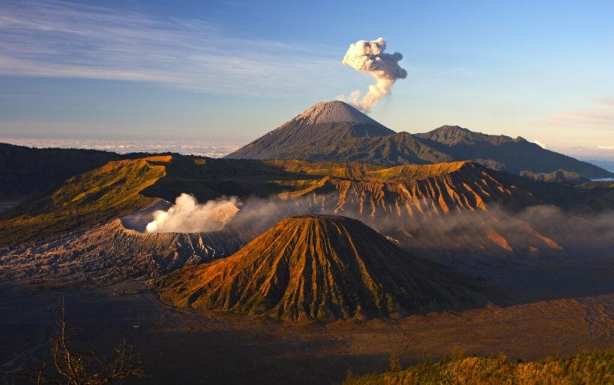
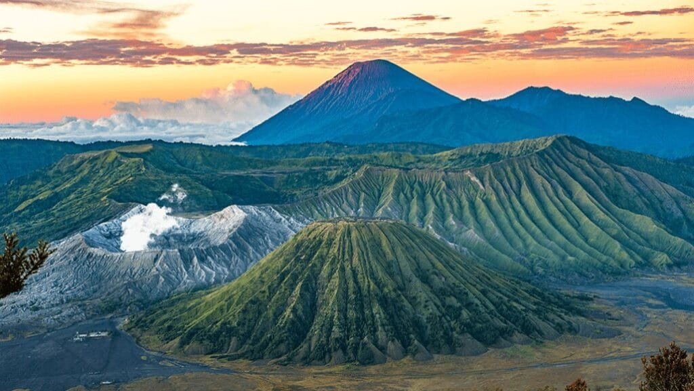
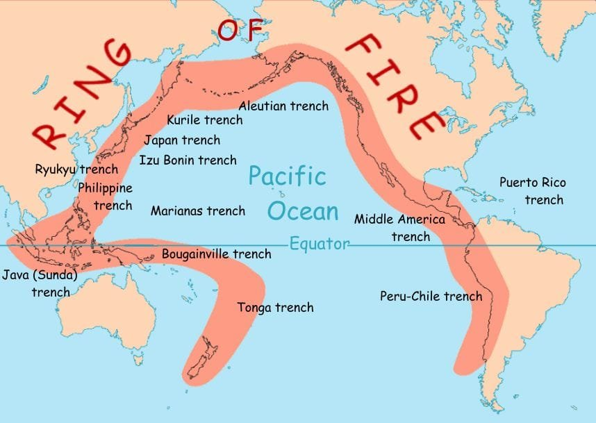
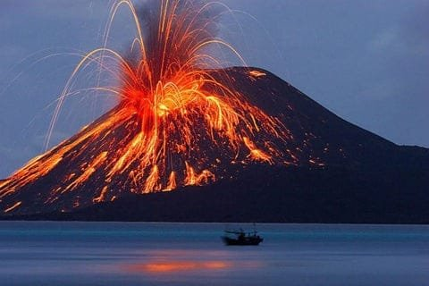
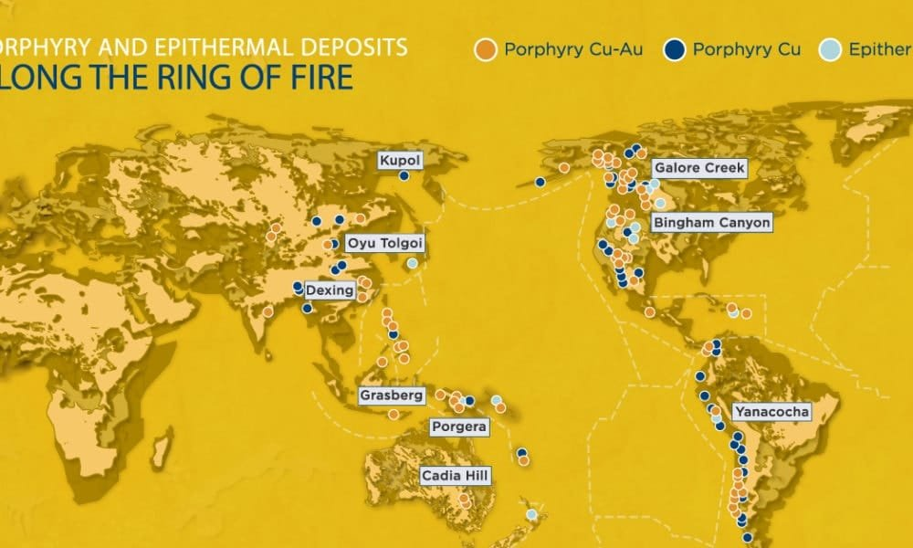

Imagine standing on the edge of a crater, gazing into the depths of one of nature's most magnificent creations. Volcanoes, with their fiery eruptions and molten lava, have fascinated humans for centuries. From the towering peaks of the Ring of Fire to the gentle slopes of shield volcanoes, these geological wonders have shaped our planet for millions of years. In this article, we will explore the three best volcanoes spanning different geological eras, delving into their unique features, eruption patterns, and historical significance. So, grab your hiking boots and get ready to embark on an unforgettable journey into the heart of the earth.

This image is property of images.nationalgeographic.org.

## Understanding Volcanoes and Their Formation

### Definition of a volcano

A volcano is a geological formation on the Earth's crust that is formed by the eruption of molten rock, gases, and debris from beneath the surface. It is essentially a vent or opening through which these materials escape, leading to volcanic eruptions. Volcanoes can vary in size, shape, and eruption patterns, but they all share the common characteristic of being formed by the release of pressure from within the Earth.

### Process of volcano formation

Volcanoes are formed through a complex process that involves the movement of tectonic plates, the buildup of magma beneath the Earth's surface, and the eventual release of this molten rock through volcanic eruptions. The formation of a volcano typically begins when two tectonic plates converge or diverge, creating a weak point in the Earth's crust. This weak point allows magma to rise towards the surface, eventually forming a chamber or reservoir beneath the volcano.

As magma continues to accumulate in the reservoir, the pressure builds up, leading to volcanic activity. When the pressure becomes too great, the magma is expelled through the volcanic vent, resulting in an eruption. This eruption can be explosive, with the magma being forcefully ejected into the air, or it can be effusive, where the magma flows more gently out of the volcano.

### Conditions which lead to volcanic eruptions

Several conditions can contribute to volcanic eruptions. The viscosity of the magma, which refers to its ability to flow, plays a significant role. Magma with high viscosity tends to be more explosive, as the gases and trapped solids cannot escape easily. The composition of the magma, including the amount of gas it contains, also impacts the eruption style. Magma with a high gas content is more likely to undergo explosive eruptions.

Additionally, external factors such as the presence of water or the collapse of the volcano's flanks can trigger eruptions. Water can cause the magma to cool rapidly and solidify, leading to an increase in pressure and potentially explosive eruptions. The collapse of a volcano's flanks can result in the release of built-up pressure, causing a catastrophic eruption.

Understanding these conditions and monitoring volcanic activity can help scientists predict eruptions and mitigate potential hazards.

## The Ring of Fire and Its Significance

### Definition of the Ring of Fire

The Ring of Fire is a major area in the basin of the Pacific Ocean where numerous earthquakes and volcanic eruptions occur. It is a large and highly active region that stretches over 40,000 kilometers (25,000 miles) and is shaped like a horseshoe. The name "Ring of Fire" was coined due to the high amount of seismic and volcanic activity within this region.

### Geographic location and size of the Ring of Fire

The Ring of Fire encompasses a vast area, extending along the coasts of several countries including the western coastline of the Americas, the eastern coastline of Asia, and the western coastline of Oceania. It includes countries such as Chile, Japan, Indonesia, and the United States. This region is home to approximately 75% of the world's active volcanoes and is considered one of the most geologically active areas on Earth.

### Reasons for high volcanic activity in the Ring of Fire

The high volcanic activity within the Ring of Fire can be attributed to its unique geology. This region is located along several tectonic plate boundaries, including the Pacific Plate, the North American Plate, and the Eurasian Plate. These plates are constantly moving and interacting with each other, resulting in intense volcanic and seismic activity.

The subduction of oceanic plates beneath continental plates is a common occurrence within the Ring of Fire. As the denser oceanic plate sinks into the Earth's mantle, it melts and generates magma. This magma then rises to the surface, leading to volcanic eruptions. The interaction between these subduction zones and the surrounding tectonic plates creates a fertile ground for volcanic activity in the Ring of Fire.

The high volcanic activity in this region has significant implications for the surrounding communities. It poses both challenges and opportunities for the people living in these areas, as they must be prepared for potential volcanic eruptions while also benefiting from the fertile soils and geothermal energy resources provided by these volcanoes.

This image is property of www.snexplores.org.

## Mount St. Helens: An Active Stratovolcano

### Location and recent history of Mount St. Helens

Mount St. Helens is located in the state of Washington, United States, within the Cascade Range. It stands out as one of the most well-known and active stratovolcanoes in the world.

The volcano gained significant attention in the 20th century due to its catastrophic eruption on May 18, 1980. This eruption resulted in the loss of lives, destruction of surrounding ecosystems, and extensive damage to infrastructure. The eruption also had far-reaching impacts on the local economy and tourism industry.

### Significant eruptions of Mount St. Helens

Apart from the eruption in 1980, Mount St. Helens has experienced other significant eruptions throughout its history. One of the most notable eruptions occurred around 2,200 years ago, known as the "Osceola Mudflow" eruption. This eruption resulted in the deposition of large amounts of volcanic ash and mudflow in the surrounding area.

Another significant eruption occurred in 2004-2008 when a dome began to grow within the crater. This eruption was characterized by the extrusion of lava and the formation of a new lava dome. Although not as explosive as the 1980 eruption, it demonstrated the ongoing activity and dynamic nature of Mount St. Helens.

### Hazardous effects and benefits of Mount St. Helens

The eruptions of Mount St. Helens have had both hazardous and beneficial effects. The eruption in 1980 caused the tragic loss of lives and extensive damage to the surrounding ecosystem, including the destruction of old-growth forests and the alteration of river channels. The volcanic ash and mudflows also severely impacted the local infrastructure, including roads and bridges.

However, the volcanic activity of Mount St. Helens has also brought several benefits. Volcanic eruptions provide fertile ash deposits, which can promote the growth of new vegetation and improve soil quality. The volcanic landscapes also attract geological researchers and tourists, contributing to the local economy.

Overall, Mount St. Helens serves as a significant example of the potential hazards and benefits associated with living near an active volcano.

## Evolution of Mount St. Helens over Geological Eras

### Mount St. Helens during the Pleistocene Epoch

During the Pleistocene Epoch, Mount St. Helens experienced a series of eruptions that shaped its early geological history. These eruptions resulted in the formation of a significant volcanic cone and the spread of ash and debris across the surrounding landscape. The volcanic activity during this epoch played a crucial role in shaping the mountain as we see it today.

### Mount St. Helens during the Holocene Epoch

The Holocene Epoch marked a period of relatively frequent eruptions and cone-building activity for Mount St. Helens. The volcano continued to grow during this time, with eruptions depositing layers of ash and pyroclastic material. The deposits from these eruptions provide valuable insights into the volcano's eruptive history and the nature of its magma.

### Modern day changes in Mount St. Helens

In recent years, Mount St. Helens has remained relatively quiet compared to its volcanic activity in the past. However, the volcano is still closely monitored by scientists who study its [seismic activity](https://magmamatters.com/the-art-and-science-of-volcano-monitoring/ "The Art and Science of Volcano Monitoring"), gas emissions, and deformation of the volcanic edifice. These monitoring efforts aim to better understand the volcano's behavior and provide early warning systems in the event of potential eruptions.

The ongoing research and monitoring of Mount St. Helens contribute to our understanding of volcanic processes and can help in predicting volcanic behavior in the future.

This image is property of images.nationalgeographic.org.

## Mount Fuji: Japan's Iconic Stratovolcano

### Location and cultural significance of Mount Fuji

Mount Fuji is a prominent stratovolcano located on Honshu Island in Japan. It is considered one of Japan's most significant cultural and religious symbols and has been a source of inspiration for artists, poets, and writers over the centuries. Mount Fuji has also been designated as a UNESCO World Heritage site and attracts millions of visitors each year.

### Significant eruptions of Mount Fuji

Mount Fuji has a recorded history of at least 16 eruptions, with the most recent eruption occurring in 1707 during the Edo period. This eruption, known as the Hoei Eruption, resulted in the deposition of volcanic ash and the formation of a new crater. Since then, Mount Fuji has remained relatively quiet, with no significant eruptions reported.

### Hazardous effects and benefits of Mount Fuji

Although Mount Fuji has not erupted in recent centuries, its potential for future eruptions cannot be ruled out. The volcanic ash and debris from past eruptions have helped create fertile volcanic soils, which have contributed to agriculture and farming in the surrounding areas. These fertile soils, combined with the rich cultural significance of the volcano, have shaped the way people perceive and interact with the landscape.

However, if Mount Fuji were to have a large-scale eruption, it could pose significant hazards to the densely populated regions surrounding the volcano. The release of volcanic ash, lava flows, and pyroclastic material could have devastating effects on nearby communities and infrastructure. Therefore, it is important to continue monitoring Mount Fuji's volcanic activity and educate people about the potential risks.

## Evolution of Mount Fuji over Geological Eras

### Mount Fuji during the Pleistocene Epoch

During the Pleistocene Epoch, Mount Fuji underwent a series of volcanic eruptions that laid the foundation for its current shape and structure. These eruptions resulted in the formation of a large volcanic cone and the deposition of layers of volcanic ash and lava. The volcanic activity during this epoch played a crucial role in the development of Mount Fuji as a stratovolcano.

### Mount Fuji during the Holocene Epoch

The Holocene Epoch marked a period of relative stability for Mount Fuji, with fewer eruptions compared to previous epochs. The volcano underwent a period of dormancy, allowing for the accumulation of flanks and the growth of secondary cones. This period of dormancy contributed to the overall shape and stability of Mount Fuji as it is known today.

### Modern day changes in Mount Fuji

In recent times, Mount Fuji has remained relatively quiet, with no significant eruptions reported. However, there has been ongoing monitoring of the volcano's seismic activity, gas emissions, and ground deformation. These monitoring efforts help scientists understand the current state of Mount Fuji and its potential for future volcanic activity.

This image is property of shop.freetheocean.com.

## Mauna Loa: The World's Largest Shield Volcano

### Location and size of Mauna Loa

Mauna Loa is a massive shield volcano located on the Big Island of Hawai'i. It is one of the world's most impressive volcanic features and dominates the landscape with its sheer size. Mauna Loa stretches over 120 kilometers (75 miles) and rises about 4,169 meters (13,678 feet) above sea level. When measured from its base beneath the ocean floor, Mauna Loa is considered the tallest mountain in the world.

### Significant eruptions of Mauna Loa

Mauna Loa has a long history of eruptions, with its most recent eruption occurring in 1984. This eruption lasted for three weeks and resulted in the emission of large lava flows that threatened nearby communities. Other significant eruptions of Mauna Loa include the eruptions in 1950, 1926, and 1907.

### Hazardous effects and benefits of Mauna Loa

The eruptions of Mauna Loa can have both hazardous and beneficial effects. The volcanic activity poses significant risks to nearby communities, as lava flows and volcanic gases can be destructive and pose health hazards. In the past, lava flows from Mauna Loa have destroyed homes, infrastructure, and farmland.

On the other hand, the volcanic activity of Mauna Loa also contributes to the creation of new land and adds nutrients to the soil. The fresh lava flows from eruptions gradually break down and weather, creating fertile land that supports a variety of plant and animal life. This fertile soil has played a vital role in agriculture and sustains diverse ecosystems on the island.

## Evolution of Mauna Loa over Geological Eras

### Mauna Loa during the Pleistocene Epoch

During the Pleistocene Epoch, Mauna Loa experienced a series of eruptions that contributed to the growth of the volcanic edifice. These eruptions resulted in the accumulation of basaltic lava flows that covered large areas of the island. The volcanic activity during this epoch played a crucial role in the formation and development of the massive shield volcano we see today.

### Mauna Loa during the Holocene Epoch

The Holocene Epoch marked a period of frequent eruptions for Mauna Loa. These eruptions were characterized by the effusion of lava flows, which contributed to the overall growth of the volcano. The eruptions during this epoch added layers of basaltic lava to the exterior of the volcano and expanded its size.

### Modern-day changes in Mauna Loa

Currently, Mauna Loa remains an active volcano, with ongoing volcanic monitoring and research efforts. Scientists closely monitor the volcano's seismic activity, gas emissions, and ground deformation to better understand its behavior and assess potential volcanic hazards. The continued monitoring of Mauna Loa is crucial for both the safety of local communities and the advancement of our knowledge of volcanic processes.

This image is property of www.visualcapitalist.com.

## Understanding the Impact of Volcanic Eruptions

### Hazards associated with volcanic eruptions

Volcanic eruptions can pose significant hazards to both human populations and the environment. One of the most immediate and destructive hazards is the release of volcanic ash and gas. Ash can cause respiratory problems and eye irritation, and in high concentrations, it can damage infrastructure and disrupt air travel. Volcanic gases, such as sulfur dioxide, can create toxic conditions and contribute to the formation of acid rain.

Lava flows can also be hazardous, as they can destroy homes, infrastructure, and agricultural land. Pyroclastic flows, which are hot, fast-moving clouds of gas, ash, and volcanic material, can cause widespread destruction and loss of life. Additionally, volcanic eruptions can trigger secondary hazards such as lahars (mudflows), landslides, and tsunamis.

### Positive impacts of volcanic eruptions

While volcanic eruptions are associated with hazards, they also have several positive impacts on the environment and society. One of the significant benefits is the creation of fertile soils from the deposition of volcanic ash and minerals. These nutrient-rich soils support agriculture and enable the growth of crops and vegetation.

Volcanic eruptions also contribute to the formation of geothermal resources. The heat generated by volcanic activity can be harnessed to produce sustainable and renewable energy. Geothermal power plants utilize the natural heat of the Earth to generate electricity and provide heating and cooling for nearby communities.

Furthermore, volcanic landscapes attract tourists and researchers, contributing to local economies and scientific advancements. Volcanoes provide unique opportunities to study Earth's geological processes and improve our understanding of the planet's history and dynamics.

### Role of volcanoes in Earth's climate

Volcanoes play a significant role in Earth's climate by releasing gases and particles into the atmosphere. [Volcanic eruptions can release large amounts of carbon dioxide](https://magmamatters.com/geothermal-energy-and-its-volcanic-origins/ "Geothermal Energy and Its Volcanic Origins"), sulfur dioxide, and aerosols. Carbon dioxide is a greenhouse gas that contributes to global warming, while sulfur dioxide and aerosols can have a cooling effect by reflecting sunlight back into space.

The impacts of volcanic emissions on the climate can vary depending on the magnitude and duration of the eruptions. Large volcanic eruptions can inject massive amounts of gases and aerosols into the atmosphere, leading to short-term cooling effects known as volcanic winters. These cooling effects can influence weather patterns, crop yields, and overall climate conditions for several years.

Understanding the role of volcanoes in the climate system is crucial for accurately predicting and mitigating the impacts of climate change. Scientists study volcanic activity and its relationship with climate to improve climate models and enhance our ability to forecast future changes.

## Future Predictions and Volcano Monitoring

### Current methods used to predict volcano eruptions

Predicting volcanic eruptions is a complex and challenging task, but scientists employ various methods and techniques to monitor volcanic activity and make forecasts. Monitoring networks are set up around active volcanoes to measure seismic activity, gas emissions, ground deformation, and temperature changes. These networks help scientists detect any changes that may indicate an imminent eruption.

Seismic monitoring involves analyzing the frequency, type, and magnitude of earthquakes occurring near a volcano. Increases in the number and intensity of earthquakes can indicate the movement of magma and potential volcanic activity. Gas emissions are also monitored to identify any changes in gas composition and quantities, as these can be indicators of rising magma.

Ground deformation measurements, such as GPS and satellite data, are used to track changes in the shape and size of a volcano. Significant changes in the surface of the volcano, including swelling or deformation, can provide valuable information about the movement and accumulation of magma.

### Case study: Predicting eruptions in the three mentioned volcanoes

In the case of Mount St. Helens, the 1980 eruption was not predicted with certainty. However, monitoring efforts were in place, and the increased volcanic activity leading up to the eruption allowed scientists to issue warnings and evacuate surrounding areas. This event highlighted the importance of continuous monitoring and the need to improve eruption forecasting techniques.

Mount Fuji, on the other hand, has not experienced a significant eruption in recent centuries. However, monitoring efforts are in place to detect any signs of potential volcanic activity. Seismic monitoring networks, gas monitoring, and ground deformation measurements are continuously monitored to identify any changes that may indicate an impending eruption.

Mauna Loa, being an active volcano, is closely monitored by a comprehensive monitoring network. Seismic activity, gas emissions, ground deformation, and lava flow monitoring systems are in place to provide early warning signs of volcanic unrest. Scientists use these measurements to assess the likelihood of an eruption and provide valuable information for emergency response planning.

### Importance of volcano monitoring for mitigating risks

Volcano monitoring plays a crucial role in mitigating risks associated with volcanic eruptions. By continuously monitoring volcanic activity, scientists can provide timely warnings and updates to affected communities, allowing for appropriate evacuation and emergency response measures. Early detection of volcanic unrest and potential eruptions can save lives and minimize the impact on infrastructure and the environment.

Monitoring also helps advance our understanding of volcanic processes and improve eruption forecasting techniques. By studying the behavior and patterns of volcanoes over time, scientists can develop more accurate models and predictions, leading to improved disaster preparedness and response strategies.

Investments in volcano monitoring technology and research are essential for safeguarding communities living near active volcanoes. These efforts contribute to a better understanding of volcanic activity, the development of robust warning systems, and the mitigation of risks associated with future eruptions.

In conclusion, understanding the formation, behavior, and impact of volcanoes is crucial for predicting and mitigating the risks associated with volcanic eruptions. Volcanoes, such as Mount St. Helens, Mount Fuji, and Mauna Loa, provide fascinating case studies that highlight the diverse nature of volcanic activity and its effects on the surrounding environment and society.

The Ring of Fire, a zone of intense volcanic and seismic activity encircling the Pacific Ocean, showcases the interconnectedness of tectonic plates and the formation of volcanoes. The unique geology of this region, where several tectonic plates converge, contributes to the high volcanic activity. The Ring of Fire serves as a reminder of the dynamic and evolving nature of our planet.

Mount St. Helens, with its recent history of devastating eruptions, reminds us of the potential hazards associated with living near an active volcano. While the eruptions have caused significant destruction, the volcano also provides benefits in terms of nutrient-rich soils and valuable research opportunities.

Mount Fuji, steeped in cultural significance, stands as an iconic symbol of Japan. While its recent eruptive history has been quiet, ongoing monitoring efforts are essential to better understand its behavior and potential risks. Mount Fuji showcases the delicate balance between the hazards and benefits of living near an active volcano.

Mauna Loa, the world's largest shield volcano, exemplifies the power and magnitude of volcanic activity. Its eruptions pose risks to nearby communities, but they also contribute to the creation of fertile land and the production of renewable energy. The ongoing monitoring of Mauna Loa provides crucial information for risk assessment and emergency preparedness.

Volcanic eruptions have both hazardous and beneficial impacts on the environment and society. From the destruction caused by volcanic ash and lava flows to the creation of fertile soils and geothermal resources, volcanoes play a significant role in shaping the Earth's landscapes and supporting various industries.

Understanding the role of volcanoes in the Earth's climate is also essential for predicting and mitigating the impacts of global warming. Volcanic emissions can influence climate conditions, and studying their effects can improve climate models and help us better prepare for future changes.

By utilizing current monitoring methods and studying the behavior of volcanoes, scientists can make more accurate predictions about volcanic eruptions. This knowledge is vital for mitigating risks, providing timely warnings to communities, and protecting lives and infrastructure.

In conclusion, the comprehensive understanding of volcanoes, their formation, evolution, and impact, facilitates effective volcano monitoring and enhances our ability to predict and mitigate the risks associated with volcanic eruptions. Through continuous research and monitoring efforts, we can further advance our knowledge and improve the safety of communities living near volcanoes.

