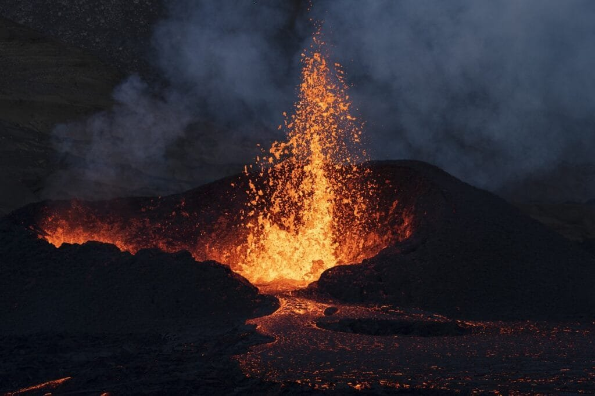
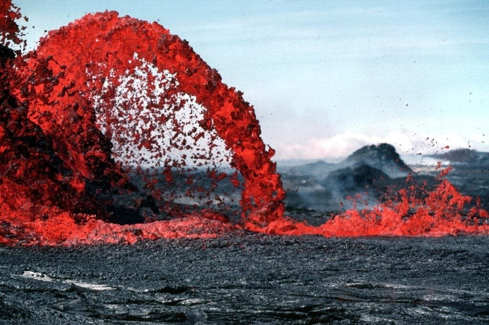

If you've ever been captivated by the awe-inspiring beauty and power of a volcano, then you'll want to delve into the fascinating world of extinct volcanoes. These geological wonders, shaped by eruptions that took place thousands or even millions of years ago, hold a treasure trove of information about our planet's history. From their eruption patterns to their various types, extinct volcanoes offer valuable insights into the inner workings of the Earth. By studying these dormant giants, scientists can piece together clues that help us understand volcanic activity, predict future eruptions, and protect the communities that surround them. Join us as we embark on an exploration of the types and eruption patterns of these mesmerizing geological formations.

<iframe width="560" height="315" src="https://www.youtube.com/embed/LQwZwKS9RPs" frameborder="0" allow="accelerometer; autoplay; encrypted-media; gyroscope; picture-in-picture" allowfullscreen></iframe>

  

## Definition of Extinct Volcanoes

### What extinct volcanoes are

Extinct volcanoes, as the name suggests, are volcanoes that are no longer active and are unlikely to erupt again in the future. These volcanoes have completely ceased any volcanic activity and have undergone a period of inactivity for thousands, if not millions, of years. This state of inactivity distinguishes them from dormant or active volcanoes.

### Difference between dormant, active, and extinct volcanoes

Dormant volcanoes are those that are currently inactive but have the potential to erupt again in the future. These volcanoes have not shown any volcanic activity for a significant period but could become active again due to geological changes or shifts in the earth's crust. Active volcanoes, on the other hand, are currently displaying signs of volcanic activity such as lava flows, ash clouds, or gas emissions.

The main difference between dormant and extinct volcanoes lies in the likelihood of future volcanic activity. While dormant volcanoes have the potential to awaken and erupt, extinct volcanoes have entered a state of permanent dormancy and no longer possess the ability to erupt. They have undergone significant geological changes that have rendered them incapable of any further volcanic activity.

## Classification of Extinct Volcanoes

### Types of extinct volcanoes based on shape: Composite, Shield, Cinder Cone, and Lava Dome volcanoes

Extinct volcanoes can be classified into different types based on their shapes and structures. One common type is the composite volcano, also known as a stratovolcano. These volcanoes are characterized by their steep slopes and symmetrical cone shape. They are formed by alternating layers of lava, ash, and debris, resulting in their composite structure.

Another type of extinct volcano is the shield volcano. Shield volcanoes are characterized by their broad, gently sloping cone shape. They are formed by the accumulation of basaltic lava flows that spread out in all directions, creating a shield-like appearance.

[Cinder cone](https://magmamatters.com/the-birth-of-new-land-understanding-cinder-cones/) volcanoes are another type of extinct volcano. These volcanoes are small in size and are characterized by their steep sides and bowl-shaped craters. They are formed by the eruption of volcanic ash, cinders, and small lava fragments.

Lastly, lava dome volcanoes are formed by the slow extrusion of viscous lava. These volcanoes are characterized by their rounded, dome-shaped appearance and are often the result of highly explosive eruptions.

### Types of extinct volcanoes based on location: Submarine, Subglacial, Aerial, and Rift volcanoes

Extinct volcanoes can also be classified based on their location. Submarine volcanoes are underwater volcanoes that have become extinct. They are formed on the ocean floor and can contribute to the formation of new land masses through volcanic activity.

Subglacial volcanoes, as the name suggests, are volcanoes that are located under glaciers or ice caps. These volcanoes are formed by magma melting the overlying ice and can result in the formation of subglacial lakes or depressions.

Aerial volcanoes are extinct volcanoes that are located on land and rise above the surrounding landscape. They can be found in various geographical settings, ranging from isolated mountain ranges to volcanic fields.

Rift volcanoes are associated with areas of volcanic activity along tectonic plate boundaries. They occur in regions where the earth's crust is being pulled apart, resulting in volcanic activity and the formation of rift valleys.

This image is property of pixabay.com.

## Geographic Distribution of Extinct Volcanoes

### Continental distribution of extinct volcanoes

Extinct volcanoes are found on almost every continent, providing rare glimpses into the earth's geological history. In North America, notable extinct volcanoes can be found in regions such as the Pacific Northwest, where the Cascade Range features towering mountains made up of extinct volcanoes. In South America, the Andes Mountains are home to many extinct volcanoes, reflecting the region's tectonic activity.

In Europe, countries like Italy have a rich history of volcanic activity and are home to dormant and extinct volcanoes, such as Mount Vesuvius and the Phlegraean Fields. Africa also boasts its share of extinct volcanoes, particularly in countries like Tanzania, where Mount Kilimanjaro, an inactive volcano, stands as the continent's highest peak.

### Common locations known for extinct volcanoes

Aside from continental distribution, there are specific locations around the world that are well-known for their abundance of extinct volcanoes. The Pacific Ring of Fire, which encircles the Pacific Ocean, is a major hotspot for volcanic activity and is home to numerous extinct volcanoes. This region stretches from New Zealand, through Southeast Asia, the Philippines, Japan, Alaska, and down to the west coast of the Americas.

Other common locations known for extinct volcanoes include the Canary Islands, Iceland, and the Hawaiian Islands. These areas have a history of volcanic activity and are known for their unique [geological landscapes shaped by both active and extinct volcanoes](https://magmamatters.com/geothermal-energy-and-its-volcanic-origins/ "Geothermal Energy and Its Volcanic Origins").

## Characteristics of Extinct Volcanoes

### Physical features of extinct volcanoes

Extinct volcanoes exhibit a variety of physical features that can provide insights into their past volcanic activity. These features include their shape, size, and composition.

In terms of shape, extinct volcanoes can display a wide range of forms, depending on their classification. Composite volcanoes tend to have steep slopes and distinct cone shapes, while shield volcanoes have broad, gently sloping profiles reminiscent of a shield. Cinder cone volcanoes are usually smaller in size, with steep sides and bowl-shaped craters. Lava dome volcanoes, on the other hand, have rounded, dome-like structures that result from slow extrusions of viscous lava.

Size can also vary among extinct volcanoes, ranging from small cinder cones to massive shield volcanoes. The size of a volcano can be influenced by factors such as eruption frequency, duration, and the amount of material ejected during past eruptions.

### Geological compositions of extinct volcanoes

The geological composition of extinct volcanoes is a crucial aspect of understanding their formation and history. The composition of a volcano is primarily determined by the type of magma that erupted during its active phase.

Typically, volcanoes are formed by the eruption of basaltic or andesitic magma. Basaltic magma is rich in iron and magnesium and is associated with shield volcanoes, while andesitic magma is rich in silica and is often associated with composite volcanoes.

The type of magma erupted can affect the eruption style, viscosity, and explosiveness of a volcano. It also influences the composition of the rocks that make up the volcano, with basaltic eruptions resulting in rocks such as basalt, andesitic eruptions resulting in rocks like andesite.

This image is property of pixabay.com.

## Eruption Patterns of Extinct Volcanoes

### Types of volcanic eruptions

Volcanic eruptions can be classified into different types based on the behavior of the erupting magma. These eruption types are closely related to the viscosity (or thickness) of the magma and the presence of gas.

Effusive eruptions occur when low-viscosity magma, such as basaltic lava, flows relatively smoothly out of the volcano. This type of eruption typically produces lava flows that can travel long distances and cover vast areas.

Explosive eruptions, on the other hand, occur when the magma is highly viscous and contains a significant amount of gas. The thick magma traps gas bubbles, leading to explosive bursts of lava, ash, and other volcanic materials. These eruptions are often characterized by towering ash clouds, pyroclastic flows, and volcanic projectiles.

Phreatomagmatic eruptions are another type of volcanic eruption that occurs when water comes into contact with magma. The resulting interaction between the water and magma leads to explosive eruptions, which can generate ash clouds, steam explosions, and the formation of volcanic tephra.

### What eruption patterns say about a volcano's status

Eruption patterns can provide valuable information about a volcano's current activity level and the potential risks it poses. Monitoring and analyzing eruption patterns can help scientists and geologists determine whether a volcano is dormant, active, or extinct.

Extinct volcanoes, as mentioned earlier, are characterized by a complete lack of volcanic activity for an extended period. They do not display any eruption patterns and are considered to be permanently dormant.

On the other hand, active and dormant volcanoes exhibit varying degrees of eruptive activity. Active volcanoes regularly experience eruptions, releasing lava, ash, and gases. These eruptions can range from relatively mild to highly explosive, depending on the volcano's specific characteristics.

Dormant volcanoes, while currently inactive, have a history of past eruptions and may show signs of unrest. These signs can include increased gas emissions, ground deformation, and [seismic activity](https://magmamatters.com/the-art-and-science-of-volcano-monitoring/ "The Art and Science of Volcano Monitoring"). Monitoring these indicators is essential in assessing the potential threat posed by dormant volcanoes and determining if they may become active again in the future.

## How Volcanoes Become Extinct

### Factors causing a volcano to go extinct

Several factors can contribute to a volcano becoming extinct. One significant factor is the depletion of the magma chamber beneath the volcano. As a volcano erupts over time, it gradually depletes its supply of magma. Once the magma chamber is empty or significantly reduced, the volcano enters a state of dormancy and becomes extinct.

Volcanic activity is also influenced by changes in tectonic activity. As tectonic plates shift, the location of volcanic activity can change, leading to the cessation of eruptions in certain areas. Additionally, the movement of tectonic plates can result in the creation of new volcanic systems, diverting magma away from existing volcanoes and rendering them extinct.

Furthermore, geological changes within a region can affect the volcanic activity of a particular volcano. For example, the formation of a new volcano nearby can divert magma away from an existing volcano, causing it to become extinct.

### Difference between extinct and dormant volcanoes

While both extinct and dormant volcanoes are currently inactive, there is a clear distinction between the two. Extinct volcanoes have entered a state of permanent dormancy and are unlikely to erupt again in the future due to geological changes that have rendered them incapable of any further volcanic activity.

Dormant volcanoes, on the other hand, have the potential to awaken and become active again. Although they are currently not displaying any volcanic activity, dormant volcanoes have a history of eruptions and may show signs of unrest, such as increased gas emissions or seismic activity.

The distinction is crucial when assessing the potential risks posed by these volcanoes. Extinct volcanoes are generally considered to be of no immediate threat, while monitoring and further research are crucial for identifying any potential reactivation of dormant volcanoes.

This image is property of pixabay.com.

## Impact of Extinct Volcanoes on the Environment

### Role of extinct volcanoes in shaping the landscape

Extinct volcanoes have played a significant role in shaping the earth's landscape over millions of years. The accumulation of volcanic material, including volcanic ash, lava, and rocks, has resulted in the creation of unique landforms and geological structures.

One prominent example is the formation of volcanic mountains and ranges. Extinct volcanoes, such as composite and shield volcanoes, have built up over time, creating towering peaks and expansive mountain ranges. These volcanic features contribute to the diversity of landscapes and provide habitat for various plant and animal species.

Volcanic activity also plays a crucial role in the formation of islands and archipelagos. Submarine volcanoes that become extinct can contribute to the growth of underwater mountain ranges, eventually forming islands when they break the water's surface. The Hawaiian Islands, for example, are a chain of islands formed by a series of extinct volcanoes.

### Impact of extinct volcanoes on soil and vegetation

Extinct volcanoes have a significant impact on the surrounding soil and vegetation. Volcanic materials, such as ash and lava, are rich in essential nutrients for plant growth. Over time, these materials break down and weather, creating fertile soils that are highly suitable for agriculture.

Volcanic soils, often referred to as volcanic ash soils or Andisols, have excellent water retention capabilities, allowing for the sustained growth of crops and vegetation. The fertility of these soils also leads to higher biodiversity and supports the growth of unique plant species that are adapted to the specific nutrient compositions.

Extinct volcanoes, therefore, have a positive influence on the environment by providing fertile land for agricultural activities, sustaining diverse ecosystems, and fostering the growth of unique plant species.

## Human Interactions with Extinct Volcanoes

### Habitation of extinct volcano regions

Throughout history, humans have been drawn to the regions surrounding extinct volcanoes. The fertile soils resulting from previous volcanic activity have made these areas highly suitable for agriculture and settlement.

One example of human habitation near extinct volcanoes is the cities of Naples and Pompeii in Italy, located near the infamous Mount Vesuvius. The volcanic soils have allowed for the cultivation of fertile vineyards and agriculture, supporting the local economy and population.

Additionally, some communities have chosen to settle in the vicinity of extinct volcanoes due to the aesthetic beauty and unique landscapes they offer. The towering peaks and picturesque views attract tourists and residents alike, fostering a sense of awe and appreciation for the earth's natural wonders.

### Historical significance and tourism value of extinct volcanoes

Extinct volcanoes hold significant historical and cultural value for many societies. They have shaped the history and mythology of various regions, becoming landmarks and sources of inspiration for art, literature, and religious beliefs.

Famous examples include Mount Fuji in Japan, which is not only an extinct volcano but also a UNESCO World Heritage Site and an iconic symbol of the country. Mount Fuji has been celebrated in countless works of art, poetry, and literature, and its spiritual significance is deeply ingrained in Japanese culture.

Extinct volcanoes also attract tourists from around the world who are captivated by the geological wonders and unique landscapes they offer. Visitors can explore the remnants of past eruptions and witness the geological processes that have shaped the earth over millions of years. The tourism industry surrounding extinct volcanoes provides economic opportunities for local communities and contributes to the preservation of these natural wonders.

## Researching Extinct Volcanoes

### Techniques involved in studying extinct volcanoes

Studying extinct volcanoes involves various techniques and disciplines to uncover their geological history, formation, and potential future implications. Geologists and researchers employ a combination of fieldwork, remote sensing, laboratory analysis, and data modeling to study these volcanoes.

Fieldwork is crucial in collecting samples of volcanic rocks, sediments, and deposits. By studying the physical properties and chemical composition of these samples, researchers can gain insights into volcanic processes and reconstruct the eruptive history of the extinct volcano.

Remote sensing techniques, such as satellite imagery and aerial surveys, provide valuable data on the geography, topography, and structural features of extinct volcanoes. This information helps scientists understand the overall landscape and identify potential hazards associated with the volcano.

Laboratory analysis involves the examination of rock samples to determine their mineralogical composition, age, and formation conditions. This data helps researchers reconstruct the volcanic history and gain a deeper understanding of the processes that shaped the extinct volcano.

Data modeling techniques, such as computer simulations, are used to analyze complex geological processes and create predictive models. These models can help scientists assess the potential risks associated with dormant or active volcanoes and make informed decisions regarding land use planning, hazard mitigation, and evacuation strategies.

### Important discoveries from researching extinct volcanoes

Researching extinct volcanoes has led to significant discoveries and advancements in our understanding of the earth's geological processes. By combining field observations, laboratory analysis, and data modeling, scientists have been able to unravel the complex history and behavior of these volcanoes.

Through research, scientists have been able to determine the eruption chronology of extinct volcanoes, identifying past eruptive events and their potential impact on the surrounding environment. This knowledge is crucial in assessing the volcanic hazards associated with these volcanoes and in predicting future activity.

Additionally, studying extinct volcanoes has provided insights into the role of volcanic activity in the formation of landforms, such as mountains, islands, and valleys. By understanding the geological history of these features, researchers can better comprehend the forces that have shaped the earth's surface over time.

Research on extinct volcanoes has also contributed to our knowledge of the earth's climate and atmosphere. Volcanic eruptions release gases and aerosols into the atmosphere, which can have significant effects on weather patterns and global climate. By studying past eruptions, scientists can gain insights into the impact of volcanic activity on the earth's climate system and its implications for future climate change.

## Notable Extinct Volcanoes

### Examples of famous extinct volcanoes globally

Numerous extinct volcanoes have gained fame and recognition around the world due to their historical significance, geological features, or cultural importance. Here are a few notable examples:

1. Mount Vesuvius, Italy: Mount Vesuvius is one of the most famous extinct volcanoes in the world. Its historic eruption in 79 AD buried the Roman cities of Pompeii and Herculaneum, preserving them for centuries and providing invaluable insights into ancient Roman civilization.
    
2. Mount Fuji, Japan: Mount Fuji is an iconic symbol of Japan and a UNESCO World Heritage Site. This dormant volcano is known for its symmetrical cone shape and its significant cultural and spiritual significance in Japanese art, literature, and religious beliefs.
    
3. Mount Kilimanjaro, Tanzania: Mount Kilimanjaro is Africa's highest peak and a dormant volcano composed of three volcanic cones. It attracts climbers from around the world who are captivated by its stunning landscapes and its unique position near the equator, allowing one to experience multiple climate zones during the ascent.
    
4. Crater Lake, United States: Crater Lake, located in Oregon, is a caldera formed by the collapse of the volcano Mount Mazama. It is known for its deep blue color and pristine waters, providing a breathtaking sight and attracting visitors to its national park.
    

### History of their eruptions and eventual extinction

These notable extinct volcanoes have a rich history of eruptions and subsequent periods of dormancy. Mount Vesuvius, as mentioned earlier, had a catastrophic eruption in 79 AD that buried the Roman cities of Pompeii and Herculaneum. After that eruption, the volcano remained dormant for centuries, with its last eruption recorded in 1944.

Mount Fuji, despite its iconic status, has been dormant since its last eruption in 1707-1708. The volcano's eruptions have been relatively infrequent, with significant eruptions occurring roughly every 200-300 years. The most recent eruption was during the Edo period in Japan.

Mount Kilimanjaro, located in Tanzania, is currently dormant and has not erupted in approximately 200,000 years. It is classified as a dormant stratovolcano and is known for its snow-capped peak, which has been receding over the years due to climate change.

Crater Lake, formed from the collapse of Mount Mazama, is an example of a volcano that has not erupted for thousands of years. The caldera was formed by a cataclysmic eruption around 7,700 years ago, resulting in the formation of the lake. Since then, the volcano has remained dormant.

These examples highlight the diverse geological and historical characteristics of extinct volcanoes and the length of time since their last eruptions, leading to their eventual extinction. Understanding their eruptive history and subsequent periods of inactivity is crucial in assessing the risks associated with dormant or active volcanoes and in ensuring the safety and well-being of nearby communities.

