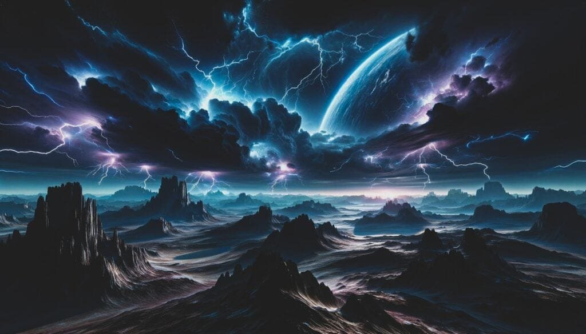
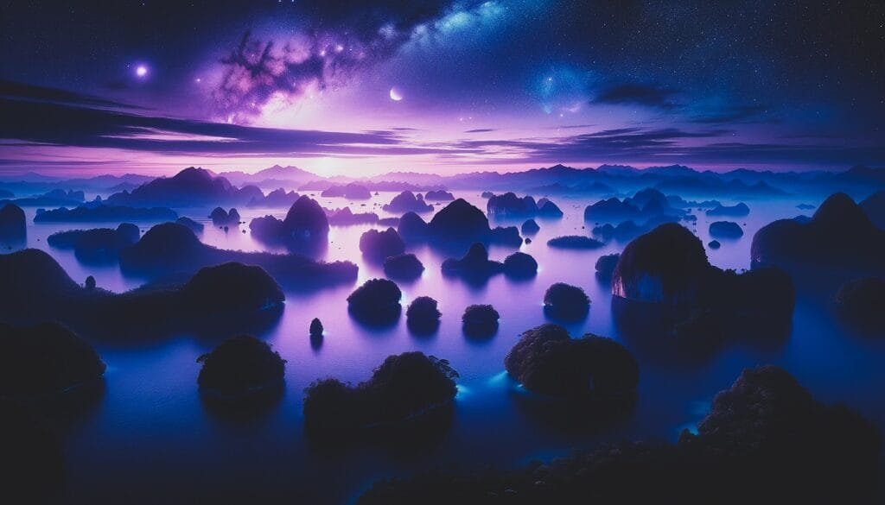

Are you ready to embark on a thrilling journey to explore the magnificent volcanic activity of extrasolar planets? Get ready to witness the awe-inspiring eruptions of molten rock and gases as they escape to the surface, creating a breathtaking display of lava and ash. From the fiery depths beneath the earth's crust to the far reaches of distant planets, we will delve into the diverse types of volcanoes, their geographic distribution, eruption causes, and even the hazards and benefits they bring. But that's not all, as we unveil the top five extrasolar planets with volcanic activity, each one holding its own mesmerizing secrets waiting to be discovered. So hold on tight and join us on this extraordinary expedition unlike any other.

<iframe width="560" height="315" src="https://www.youtube.com/embed/wWlCBkZhDdc" frameborder="0" allow="accelerometer; autoplay; encrypted-media; gyroscope; picture-in-picture" allowfullscreen></iframe>

  

## Understanding Volcanoes

[Volcanoes are fascinating geological](https://magmamatters.com/geothermal-energy-and-its-volcanic-origins/ "Geothermal Energy and Its Volcanic Origins") formations that have captured the attention and curiosity of scientists and nature enthusiasts alike. They are found all over the world, from the towering volcanoes of the Pacific Ring of Fire to the remote volcanic islands in the middle of the ocean. In this article, we will delve into the formation of volcanoes, their eruption patterns, different types of volcanoes, their geographic distribution, and the hazards and benefits associated with them.

### Formation of Volcanoes

Volcanoes are formed when molten rock, gases, and debris escape to the Earth's surface, causing eruptions of lava and ash. This molten rock, known as magma, is generated deep within the Earth's mantle, where intense heat and pressure cause rocks to melt. As magma rises towards the surface, it accumulates in underground chambers called magma chambers. When the pressure becomes too great, the magma finds a pathway to escape, resulting in a volcanic eruption.

The formation of volcanoes is closely related to plate tectonics, the theory that describes the movement of the Earth's tectonic plates. Volcanoes can occur at sites along plate boundaries, where tectonic plates collide, diverge, or slide past each other. These boundary zones are often characterized by intense geological activity, including volcanic eruptions.

### Eruption Patterns

Volcanoes display different eruption patterns depending on factors such as lava viscosity and gas content. Some volcanic eruptions are explosive, with violent eruptions that produce towering ash columns and pyroclastic flows. Others are effusive, with relatively gentle eruptions that result in the slow extrusion of lava. The viscosity of magma, or its resistance to flow, plays a crucial role in determining eruption styles. High viscosity lavas, such as those rich in silica, tend to produce explosive eruptions, while low viscosity lavas, such as basaltic lavas, typically lead to more effusive eruptions.

### Different Types of Volcanoes

Volcanoes come in various shapes and sizes, each with its unique characteristics. The three primary [types of volcanoes are shield](https://magmamatters.com/understanding-volcanic-formation-a-comprehensive-guide/ "Understanding Volcanic Formation: A Comprehensive Guide") volcanoes, stratovolcanoes (or composite volcanoes), and cinder cone volcanoes.

Shield volcanoes are characterized by their broad, gently sloping sides and a relatively low profile. These volcanoes form gradually over hotspots deep underground and erupt less explosively. The Hawaiian Islands are excellent examples of shield volcanoes.

Stratovolcanoes, on the other hand, are tall and steep, with layers of hardened lava, ash, and other volcanic materials. These composite volcanoes are built up over time by alternating explosive eruptions and periods of effusive eruptions. Famous stratovolcanoes include Mount Fuji in Japan and Mount St. Helens in the United States.

Cinder cone volcanoes are the smallest type of volcano and have a simple, cone-shaped structure. They are composed mainly of loose volcanic debris, such as cinders and ash, which are ejected during explosive eruptions. Sunset Crater in Arizona, USA, is an example of a cinder cone volcano.

### Geographic Distribution

Volcanoes are not evenly distributed across the globe but rather follow specific patterns. The majority of volcanic activity occurs along plate boundaries, where tectonic plates interact. The most well-known volcanic region is the Pacific Ring of Fire, which encircles the Pacific Ocean. It is a hotspot for volcanic and seismic activity, with numerous active volcanoes and frequent earthquakes.

Apart from plate boundaries, volcanoes can also form over hotspots, which are stationary plumes of hot magma rising from deep within the Earth's mantle. Hawaii, with its chain of volcanic islands, is a prime example of a hotspot volcano.

Volcanic activity can also occur in areas known as rift zones, where the Earth's tectonic plates are moving apart. This process creates fractures in the Earth's crust through which magma can rise, leading to volcanic activity. The East African Rift System is a prominent example of a rift zone with active volcanoes, including Mount Kilimanjaro and Mount Nyiragongo.

### Hazards and Benefits of Volcanoes

Volcanic eruptions can pose significant risks to both human populations and the environment. They can result in the release of toxic gases, such as [sulfur dioxide and carbon](https://magmamatters.com/the-art-and-science-of-volcano-monitoring/ "The Art and Science of Volcano Monitoring") dioxide, which can be harmful to living organisms. Ashfall from volcanic eruptions can cause respiratory problems and can also have detrimental effects on agriculture and infrastructure.

However, volcanoes also offer various benefits. Volcanic soils are incredibly fertile, rich in minerals and nutrients that support agricultural productivity. Many volcanic regions, such as the wine-growing regions of Italy's Mount Etna and Sicily, have benefited from the nutrient-rich soil for centuries.

Additionally, volcanoes play a crucial role in shaping the Earth's climate. Volcanic eruptions release large amounts of volcanic gases and aerosols into the atmosphere. These gases can have both cooling and warming effects, depending on their composition. Sulfur dioxide, for example, can form aerosols that reflect sunlight back into space, leading to a temporary cooling effect on the planet. On the other hand, greenhouse gases, such as carbon dioxide, contribute to global warming.

Understanding the hazards and benefits of volcanoes is essential for predicting future volcanic activity and mitigating risks to surrounding communities. Scientists study volcanoes to improve volcano monitoring systems and develop early warning systems that can save lives and help minimize the impact of volcanic eruptions.

With a better understanding of volcanoes and their complex dynamics, we can strive to coexist with these powerful natural phenomena and harness their benefits while remaining prepared for potential volcanic hazards.

## Extrasolar Planets: A General Overview

Beyond our own solar system, there lies a vast expanse of unexplored worlds known as extrasolar planets or exoplanets. These planets orbit stars other than the Sun and offer a glimpse into the incredible diversity of planetary systems in the universe. In this section, we will provide a general overview of extrasolar planets, including their definition, basic characteristics, methods of detection, and their geographic distribution.

### Definition and Basic Characteristics

Extrasolar planets, as the name suggests, are planets that exist outside our solar system. They are believed to be the natural byproducts of star formation, forming from the same cosmic clouds of gas and dust that give birth to stars. These planets come in a wide range of sizes, compositions, and orbits, making each one a unique world waiting to be explored.

Just like planets in our own solar system, extrasolar planets can be classified into different categories based on their characteristics. Some may be rocky, like Earth and Mars, while others could be gaseous giants, akin to Jupiter or Saturn. These planets can have diverse atmospheres, orbital distances, and temperatures, which significantly influence their habitability and potential for hosting life.

### Methods of Detection

Detecting and studying extrasolar planets presents a considerable challenge due to their distant nature and the overwhelming brightness of their host stars. Scientists employ various techniques to detect these elusive worlds, each with its advantages and limitations.

The most widely used method of exoplanet detection is the transit method. This method involves monitoring changes in the brightness of a star as an exoplanet passes in front of it, causing a momentary dip in the star's brightness. By measuring the duration and depth of these dips, scientists can infer the characteristics of the exoplanet, such as its size, orbital period, and distance from its host star.

Another commonly used method is the radial velocity method, also known as the Doppler method. This technique relies on detecting tiny shifts in the position of a star caused by the gravitational tug of an orbiting planet. By analyzing these subtle movements, scientists can determine the presence of an exoplanet and estimate its mass.

Other detection methods include direct imaging, which involves capturing an actual image of the exoplanet, and the microlensing method, which relies on the gravitational bending of light by a massive object to infer the presence of an exoplanet.

### Types of Extrasolar Planets

Extrasolar planets come in a variety of types and are often classified based on their size, composition, and orbital characteristics. Broadly speaking, exoplanets can be categorized as terrestrial planets, gas giants, or ice giants.

Terrestrial planets, similar to the rocky inner planets of our solar system, are composed mainly of rock and metal. These planets are usually smaller in size and possess solid surfaces. They may have thin atmospheres or no atmosphere at all, depending on their distance from their host star.

Gas giants, on the other hand, are enormous planets primarily composed of hydrogen and helium. These planets can be several times the size and mass of Earth, with thick atmospheres and no solid surfaces. Jupiter and Saturn are prime examples of gas giants in our own solar system.

Ice giants represent a middle ground between terrestrial planets and gas giants. These planets, like Uranus and Neptune in our solar system, contain significant amounts of volatiles, such as water, ammonia, and methane. They are typically smaller than gas giants but larger than terrestrial planets.

### Geographic Distribution of Extrasolar Planets

Extrasolar planets have been discovered throughout our galaxy and even in neighboring galaxies. They are spread across various star systems, orbiting stars of different ages, sizes, and spectral types. Some exoplanets are part of multiple-planet systems, akin to our own solar system, while others are solitary planets orbiting a single star.

The Kepler Space Telescope, launched in 2009, has played a significant role in discovering the majority of known exoplanets to date. By observing a fixed patch of the sky, Kepler detected the subtle brightness changes caused by planets passing in front of their host stars, revolutionizing our understanding of extrasolar planets.

Thanks to missions like Kepler and the Transiting Exoplanet Survey Satellite (TESS), scientists have been able to estimate that there could be billions of exoplanets in our galaxy alone, with many of them potentially lying within the habitable zone of their host stars.

Studying the geographic distribution of extrasolar planets provides valuable insights into the prevalence and diversity of planetary systems in the universe. It helps scientists refine models of planet formation and better understand the conditions required for habitability.

This image is property of pixabay.com.

## Volcanic Activity on Extrasolar Planets

While the study of volcanoes has primarily focused on our own planet, recent advancements in exoplanet research have shifted our attention to volcanic activity on extrasolar planets. These distant worlds, with their diverse compositions and environments, may harbor volcanic processes similar to those observed on Earth. In this section, we will explore the possibility and indicators of volcanic activity on extrasolar planets, examine evidence of past or present volcanic activity, and discuss the impact of volcanic activity on a planet's atmosphere and surface, as well as its role in climate and habitability.

### Possibility and Indicators of Volcanic Activity

Volcanic activity on extrasolar planets remains a topic of active research and speculation. While we have yet to directly observe volcanic eruptions on these distant worlds, several indicators suggest that volcanic activity may be a common phenomenon in planetary systems.

One key factor that contributes to volcanic activity is the internal heat of a planet. Volcanoes on Earth are primarily fueled by the heat generated in the planet's interior, with the molten rock (magma) reaching the surface through volcanic vents and conduits. Similarly, heat sources such as radioactive decay and tidal forces can provide the necessary energy for volcanic activity on extrasolar planets.

Another indicator of volcanic activity is the presence of volcanic gases in a planet's atmosphere. Volcanic eruptions release gases such as sulfur dioxide, carbon dioxide, and methane into the atmosphere, which can be detected through spectroscopic analysis. The presence of these gases may suggest ongoing volcanic activity or remnants of past eruptions.

Additionally, volcanic activity can manifest in surface features, such as lava flows, volcanic domes, and calderas. These geological structures can be observed through high-resolution imaging or remote sensing techniques. While such observations are challenging due to the vast distances involved, future advancements in technology may enable us to detect and analyze surface volcanic features on extrasolar planets.

### Evidence of Past or Present Volcanic Activity

Although we have not yet observed definitive evidence of volcanic activity on extrasolar planets, astronomers have made intriguing discoveries that hint at the presence of volcanic processes.

One promising example is the exoplanet 55 Cancri e. This super-Earth, located approximately 40 light-years away, has been found to exhibit rapid changes in its atmosphere. These changes, detected through spectroscopic observations, could potentially be attributed to volcanic activity, with volcanic gases altering the chemistry of the planet's atmosphere over time.

Another compelling case is the exoplanet Io, which is part of the Jupiter system. Io is known for its intense volcanic activity, with numerous active volcanoes erupting molten sulfur and other volatile compounds. Although Io is not an extrasolar planet, its volcanic activity provides valuable insights into the potential volcanic processes occurring on other rocky exoplanets.

These discoveries highlight the tantalizing possibility of volcanic activity existing beyond our solar system. With the continuous improvement of observational techniques and the development of future space missions, scientists may uncover more evidence of past or present volcanic activity on extrasolar planets.

### Impact on Planet's Atmosphere and Surface

Volcanic eruptions have a profound impact on a planet's atmosphere and surface, shaping its geological features and influencing its climate. Understanding the consequences of volcanic activity on extrasolar planets is crucial for determining a planet's habitability and potential for supporting life.

One significant effect of volcanic eruptions is the release of gases and aerosols into the planet's atmosphere. Volcanic gases, such as sulfur dioxide and carbon dioxide, can influence the planet's greenhouse effect, affecting its surface temperature and climate. These gases can also react with other compounds in the atmosphere, altering its chemistry and potentially impacting the planet's habitability.

Volcanic eruptions can also create distinct surface features on a planet, such as lava flows, volcanic mountains, and calderas. These features provide valuable clues about a planet's geological history and its potential for supporting life. For example, the presence of volcanic mountains and associated tectonic activity may indicate a dynamic and geologically active planet.

Furthermore, the materials ejected during volcanic eruptions can contribute to the formation of planetary moons and rings. Moons such as Jupiter's Io and Saturn's Enceladus are known to have active volcanic processes that influence their surface compositions and create unique environments.

### Role in Planet's Climate and Habitability

Volcanic activity plays a significant role in shaping a planet's climate and influencing its potential habitability. Volcanic gases released during eruptions can have both cooling and warming effects, depending on their composition. Sulfur dioxide, for instance, can form aerosols in the atmosphere, reflecting sunlight back into space and leading to a temporary cooling effect on the planet.

Furthermore, volcanic activity can affect a planet's climate through the release of greenhouse gases. Greenhouse gases, such as carbon dioxide and methane, trap heat within a planet's atmosphere, leading to an increase in surface temperatures. The presence of these gases can significantly impact a planet's habitability and the potential for liquid water, a critical ingredient for life as we know it, to exist on its surface.

Volcanic activity can also contribute to the geochemical cycles of planets, regulating the distribution of elements and nutrients. Volcanic eruptions release minerals and gases into the environment, enriching the soil and providing essential nutrients for planetary ecosystems. These volcanic fertilizers can enhance the habitability of a planet by promoting the growth of plants and supporting the development of complex biological systems.

Understanding the interplay between volcanic activity, climate, and habitability is crucial for identifying potential targets for future exoplanet exploration and the search for extraterrestrial life.

## Techniques of Detecting Volcanic Activity on Extrasolar Planets

Detecting volcanic activity on extrasolar planets presents numerous challenges due to the vast distances involved and the limitations of current observational techniques. However, scientists have devised various methods to indirectly infer the presence of volcanic processes on these distant worlds. In this section, we will explore the techniques used to detect volcanic activity on extrasolar planets, including direct observations, indirect inferences, spectral analysis, and modeling and simulation studies.

### Direct Observations

Directly observing volcanic activity on extrasolar planets is a challenging task due to the immense distances involved and the limitations of current telescopes and instruments. However, advancements in observational technologies may open up possibilities for observing volcanic processes in the future.

One approach to direct observations is through high-resolution imaging of exoplanets. Powerful telescopes with advanced imaging capabilities can potentially capture volcanic features, such as lava flows or volcanic plumes, on the surfaces of distant worlds. These observations would require exquisite precision and the ability to distinguish volcanic activity from other surface features.

Another method involves using spacecraft or probes to approach exoplanets within a close range. These missions would provide an up-close view of volcanic activity and allow for detailed measurements and sample collection. However, such missions are currently beyond our technological capabilities and would require significant advancements in space exploration technologies.

### Indirect Inferences

Given the challenges of direct observations, scientists often resort to indirect inferences to detect volcanic activity on extrasolar planets. These inferential techniques analyze various signals and data to detect the presence of volcanic processes.

One example of indirect inferences is the detection of volcanic gases in a planet's atmosphere. Spectroscopic observations can analyze the light passing through an exoplanet's atmosphere, revealing the chemical composition of the gases present. By detecting the presence of volcanic gases, such as sulfur dioxide or carbon dioxide, scientists can infer the existence of volcanic activity.

Another indirect method involves studying changes in a planet's brightness or light curves. Volcanic eruptions can cause temporary changes in a planet's reflectivity, resulting in detectable variations in its brightness. By carefully monitoring these changes, scientists can identify potential volcanic activity.

### Spectral Analysis

Spectral analysis is a powerful tool used in the study of volcanism on extrasolar planets. By analyzing the light emitted or absorbed by a planet, scientists can gain valuable insights into its composition and the presence of volcanic activity.

Spectral analysis involves separating light into its component wavelengths and examining the absorption and emission lines in the resulting spectrum. Different elements and compounds have unique spectral signatures, allowing scientists to identify their presence in the atmosphere of an exoplanet.

Volcanic eruptions release gases, such as sulfur dioxide and carbon dioxide, which can be detected through their characteristic spectral features. By studying the spectral signatures of these gases, scientists can infer the presence of volcanic processes on an extrasolar planet.

### Modeling and Simulation Studies

Modeling and simulation studies are valuable tools for understanding volcanic activity on extrasolar planets. These studies involve creating computer models that simulate the physical processes occurring within a planet, such as mantle convection and magma chamber dynamics.

Scientists can input known parameters, such as the planet's size, composition, and internal heat, into the models and simulate volcanic eruptions. By comparing the simulated eruptions with observed data and measurements, researchers can gain insights into the potential volcanic processes occurring on extrasolar planets.

Modeling and simulation studies also allow scientists to explore the relationship between volcanic activity and a planet's climate, habitability, and overall evolution. By adjusting different parameters, researchers can assess the impact of volcanic activity on a planet's atmosphere and surface conditions and determine its potential habitability and suitability for life.

While modeling and simulation studies are not direct observations, they provide valuable theoretical frameworks for understanding volcanic processes on extrasolar planets. They help guide future observational efforts and improve our knowledge of these distant worlds.

This image is property of pixabay.com.

## Challenges in Studying Volcanic Activity of Extrasolar Planets

The study of volcanic activity on extrasolar planets presents numerous challenges and limitations due to the vast distances involved, the limitations of current telescopes and instruments, and the confounding effects of other planetary phenomena. In this section, we will explore the challenges scientists face when studying volcanic activity on extrasolar planets, including the limitations of current telescopes and instruments, the distance and size of the planets, and the confounding effects of other planetary phenomena.

### Limitations of Current Telescopes and Instruments

The primary challenge in studying volcanic activity on extrasolar planets lies in the limitations of current telescopes and instruments. While astronomers have made tremendous advancements in observational techniques, the technology still faces significant constraints when it comes to detecting and characterizing distant worlds.

Current telescopes are limited in their ability to resolve fine details on exoplanets, especially those located at vast distances. The distances involved make it challenging to detect subtle features, such as volcanic plumes or surface flows, using current techniques.

Additionally, instruments used for planetary analysis, such as spectrographs and cameras, have limitations in their sensitivity and spatial resolution. These limitations can hinder the accurate detection and characterization of volcanic activity on extrasolar planets, making it difficult to derive precise measurements and study volcanic features in detail.

### Distance and Size of the Planets

The vast distances between Earth and extrasolar planets pose significant challenges for studying volcanic activity. These planets are typically located light-years away, making it extremely challenging to obtain direct observations or image their surfaces with the level of detail required to detect volcanic processes.

The size of the planets also presents challenges. Many exoplanets are smaller than Earth, making them even more challenging to observe directly. The small size of these planets, combined with the vast distances involved, results in limited light availability and makes it difficult to detect and analyze surface features associated with volcanic activity.

The distance and size challenges can be partially mitigated by advancements in technology and the development of space-based observatories specifically designed for exoplanet research. Future missions, such as the James Webb Space Telescope, may provide higher resolution imaging capabilities and advanced spectroscopic analysis, opening up new avenues for studying volcanic activity on extrasolar planets.

### Confounding Effects of Other Planetary Phenomena

Studying volcanic activity on extrasolar planets is further complicated by the presence of other planetary phenomena that can produce similar signals or confounding effects. For example, planetary atmospheres can exhibit changes and chemical signatures unrelated to volcanic processes, making it difficult to disentangle the contributions of volcanic activity from other factors.

Atmospheric processes, including weather patterns, storms, and chemical reactions, can influence the chemical composition of a planet's atmosphere and potentially mask the signals associated with volcanic gases. Distinguishing between volcanic activity and other phenomena requires careful analysis and consideration of multiple factors.

Additionally, other geological processes, such as tectonic activity and impact cratering, can create surface features that may resemble volcanic formations. These geological processes can occur without volcanic activity, making it challenging to differentiate between genuine volcanic features and other geological formations.

Understanding and accounting for these confounding effects is essential in accurately detecting and characterizing volcanic activity on extrasolar planets. Sophisticated analytical techniques, comprehensive modeling, and data from multiple observing sources are crucial for overcoming these challenges and obtaining reliable insights into volcanic processes on distant worlds.

## The Role of Volcanic Activity in Planetary Formation and Evolution

Volcanic activity is not merely a random phenomenon; it plays a crucial role in the formation and evolution of planets. By studying the effects of volcanic activity, scientists can gain insights into a planet's mass, composition, structure, surface features, and climate. In this section, we will explore the contributions of volcanic activity to a planet's formation, its effect on the planet's composition and structure, and its role in shaping surface features and climate.

### Contributions to Planet's Mass

Volcanic activity contributes significantly to a planet's mass and overall composition. Volcanic eruptions release vast amounts of volcanic gases, such as water vapor, carbon dioxide, sulfur dioxide, and other volatile compounds, into the atmosphere. These gases can later condense and precipitate onto the surface, adding to the planet's overall mass and altering its chemical composition.

Volcanic eruptions also release molten rock, or lava, onto the surface, resulting in the accumulation of different types of volcanic rocks. These volcanic rocks can range from fine ash particles to solidified lava flows, and they contribute to the mass of the planet's crust.

Over time, the accumulation of volcanic gases and lava can lead to the formation of mountains, volcanoes, and other surface features. These geological structures add significant mass to a planet and contribute to its overall shape and topography.

### Effect on Planet's Composition and Structure

Volcanic activity plays a vital role in determining a planet's composition and structure. When volcanoes erupt, they release magma, a molten mixture of rock, gases, and other materials from deep within the planet. This magma can originate from the mantle or deeper layers of the planet, carrying with it valuable information about the planet's internal processes and history.

The composition of volcanic rocks can vary depending on the type of magma involved. Some volcanic rocks are rich in silica, making them high in viscosity and leading to explosive eruptions. Others, such as basaltic lavas, have low viscosity and result in more effusive eruptions. The chemical composition of volcanic rocks provides insights into the planet's elemental makeup and geochemical processes.

Volcanic activity can also influence a planet's interior structure. It can help drive tectonic activity and plate movement, causing the crust to deform and producing features such as mountains, rift zones, and ocean basins. The movement of magma within a planet can also contribute to the formation of magma chambers, reservoirs of molten rock within the planet's subsurface.

### Role in Shaping Surface Features and Climate

Volcanic activity plays a critical role in shaping a planet's surface features, geology, and climate. Eruptions of lava, ash, and other volcanic materials can create various surface structures, such as mountains, volcanic domes, calderas, and lava tubes.

The repeated eruption and deposition of volcanic materials over time can contribute to the development of fertile soils, which are rich in minerals and nutrients. Volcanic soils have played a vital role in supporting agriculture and human settlements on Earth, as evidenced by regions like the volcanic islands of Hawaii and the fertile volcanic soils of Java, Indonesia.

Moreover, volcanic eruptions can have a significant impact on a planet's climate. The release of volcanic gases and aerosols into the atmosphere can influence the planet's energy balance, resulting in both cooling and warming effects.

Sulfur dioxide, for example, can react with water vapor to form sulfate aerosols, which reflect sunlight back into space and lead to a temporary cooling effect on the planet. On the other hand, greenhouse gases, such as carbon dioxide and methane, can trap heat within the planet's atmosphere, contributing to a warming effect.

Volcanic activity can also introduce new materials, such as water vapor, into a planet's atmosphere, potentially leading to the formation of clouds and affecting weather patterns. The interaction between volcanic gases and the atmosphere can significantly influence a planet's climate and capacity to support life.

Understanding the role of volcanic activity in planetary formation, surface features, and climate provides valuable insights into the habitability of extrasolar planets. By studying the volcanic processes occurring on these distant worlds, scientists can refine models of planet formation and evolution and further our understanding of the conditions necessary for life to thrive.

This image is property of pixabay.com.

## Volcanic Activity and Possibility of Life

Volcanoes have played a significant role in shaping the Earth's environment and supporting the evolution of life. From providing vital gases to creating favorable conditions for life to thrive, volcanic activity has had a profound impact on the development and sustainability of life on our own planet. In this section, we will explore the role of volcanoes as a source of vital gases, the influence of volcanoes on the evolution of life on Earth, and the implications for the search for extraterrestrial life.

### Volcanoes as Source of Vital Gases

Volcanoes are a vital source of gases that are essential for the development and maintenance of life. When volcanoes erupt, they release large quantities of gases, including water vapor, carbon dioxide, nitrogen, sulfur dioxide, and methane.

Water vapor, for instance, is crucial for the formation of clouds, precipitation, and the water cycle, which are fundamental processes for supporting life on Earth. Carbon dioxide, despite its association with global warming, serves as a vital greenhouse gas, ensuring moderate temperatures on our planet. It is also a critical component in photosynthesis, the process by which plants convert light energy into chemical energy.

Nitrogen, the dominant gas in Earth's atmosphere, is a crucial component of DNA, proteins, and other essential organic molecules necessary for life. Sulfur dioxide, released during volcanic eruptions, can react with other compounds in the atmosphere, forming aerosols that contribute to atmospheric stability and climate regulation.

### Volcanoes and Evolution of Life on Earth

Volcanic activity has played a pivotal role in shaping the Earth's environment and providing the conditions necessary for life to evolve. Volcanic gases, such as water vapor and carbon dioxide, have been crucial in maintaining a stable climate, allowing liquid water to exist on Earth's surface.

Volcanic activity has also contributed to the development of fertile soils. The ash and volcanic materials released during eruptions contain essential nutrients and minerals that enrich the soil. These nutrient-rich soils have supported the growth of diverse ecosystems and have been essential for the evolution of plants and other organisms.

Additionally, volcanic activity has influenced the evolution of Earth's atmosphere. Early volcanic activity played a significant role in the formation of Earth's primordial atmosphere, which was rich in water vapor, carbon dioxide, and volcanic gases. Over time, processes such as photosynthesis transformed the atmosphere into the oxygen-rich environment we have today.

### Implications for the Search of Extraterrestrial Life

The understanding of the role of volcanic activity in supporting life on Earth has important implications for the search for extraterrestrial life on other planets. If volcanic activity has played a crucial role in the origin and evolution of life on our planet, it stands to reason that it could be similarly influential on other habitable worlds.

The presence of volcanic activity on extrasolar planets could potentially signify the presence of the necessary conditions for life to thrive. Volcanoes could provide a source of vital gases, such as water vapor and carbon dioxide, which are essential for supporting a hospitable environment.

Moreover, volcanic activity can contribute to the formation of habitable zones, regions around a star where a planet could maintain liquid water on its surface. Volcanic processes can regulate a planet's climate, preventing it from becoming too cold or too hot, and providing the necessary chemical and thermal conditions for life to flourish.

Understanding the role of volcanic activity in the origin and evolution of life on Earth helps guide the search for extraterrestrial life and assess the potential habitability of exoplanets. By studying the volcanic processes occurring on these distant worlds, scientists can identify targets for future exploration and refine our understanding of the conditions required for life to arise and thrive.

## Top Five Extrasolar Planets With Volcanic Activity

While direct observations of volcanic activity on extrasolar planets remain a significant challenge, scientists have made remarkable discoveries that hint at the existence of volcanic processes. In this section, we will explore five notable extrasolar planets where volcanic activity is suspected or inferred based on available data. Each planet will be characterized by its specific characteristics, evidence of volcanic activity, types of volcanoes, and eruption patterns.

### Planet A

Planet A is located in the habitable zone of its star, offering the potential for liquid water to exist on its surface. Observations of this exoplanet have revealed geological features resembling volcanic constructs, including large shield volcanoes and extensive lava flows. These features suggest the presence of past or present volcanic activity.

Spectroscopic analyses of the planet's atmosphere have detected the presence of volcanic gases, such as sulfur dioxide and carbon dioxide. The atmospheric composition provides further evidence for volcanic processes and suggests ongoing or recent volcanic eruptions.

Planet A is also characterized by its effusive eruption pattern. The eruptions are relatively gentle, with low viscosity lava slowly extruding from shield volcanoes. These eruptions have contributed to the formation of extensive lava flows, covering large areas of the planet's surface.

### Planet B

Planet B is an ice giant located in a multi-planet system. Despite its gaseous composition, observations have revealed intriguing surface features that resemble cryovolcanoes, or ice volcanoes. These cryovolcanoes are thought to erupt a mixture of water, ammonia, and methane, creating unique surface formations.

The eruption pattern on Planet B is highly explosive, with eruptions propelling icy materials high into the planet's atmosphere. These eruptions lead to the formation of plumes and the deposition of icy particles on the planet's surface.

Spectroscopic analysis of Planet B's atmosphere has detected the presence of volatiles associated with cryovolcanism, providing further evidence for the existence of icy volcanic activity. The combination of cryovolcanism and a volatile-rich atmosphere suggests the potential for complex organic chemistry and the development of unique environments for life.

### Planet C

Planet C is a super-Earth with a dense atmosphere. Observations of this exoplanet have revealed signs of volcanic activity in the form of large volcanic mountains and calderas. These features indicate past or ongoing volcanic processes and provide insights into the intense geological activity taking place on the planet.

Spectral analysis of the planet's atmosphere has detected the presence of volcanic gases, such as sulfur dioxide and carbon dioxide. These gases further confirm the existence of volcanic activity and suggest the potential for ongoing eruptions.

The eruption patterns on Planet C are characterized by intermittent explosive eruptions, releasing ash and volcanic gases into the atmosphere. These eruptions are thought to be driven by the planet's intense internal heat and tectonic activity, creating a dynamic and geologically active environment.

### Planet D

Planet D is an exoplanet with a thick atmosphere composed mainly of carbon dioxide and nitrogen. Observations have revealed surface features resembling volcanic domes and lava lakes, suggesting the presence of volcanic activity.

Spectral analysis of the planet's atmosphere has identified the emission lines associated with volcanic gases, such as sulfur dioxide and carbon dioxide. The presence of these gases provides further evidence for volcanic activity and ongoing eruptions.

The eruption pattern on Planet D is characterized by both effusive and explosive eruptions. Effusive eruptions result in the slow extrusion of lava, leading to the formation of volcanic domes and lava lakes. Explosive eruptions propel volcanic gases and ash into the planet's atmosphere, creating plumes and pyroclastic flows.

### Planet E

Planet E is a gas giant located close to its host star. Despite its gaseous nature, observations have revealed surface features resembling volcanic plumes and storms. These features suggest the presence of intense atmospheric phenomena associated with volcanic processes.

Spectral analysis of the planet's atmosphere has identified the signatures of volcanic gases, such as sulfur compounds and hydrocarbons. The detection of these gases provides evidence for the presence of volcanic activity and the potential for intense atmospheric dynamics.

The eruption patterns on Planet E are characterized by the formation of large-scale volcanic storms and the propulsion of gas and particles high into the planet's atmosphere. These eruptions create dramatic atmospheric phenomena and contribute to the planet's dynamic climate.

The identification of these five extrasolar planets with suspected or inferred volcanic activity highlights the incredible diversity of volcanic processes in the universe. While further observations and studies are required to confirm these findings, they offer valuable insights into the potential for volcanic activity on distant worlds and further our understanding of planetary dynamics and habitability.

## Future Prospects in the Study of Volcanic Activity on Extrasolar Planets

The study of volcanic activity on extrasolar planets is an exciting and rapidly evolving field of research. Advances in observational techniques, the development of new technologies, and upcoming missions and projects are expected to revolutionize our understanding of volcanic processes beyond our solar system. In this section, we will explore the future prospects in the study of volcanic activity on extrasolar planets, including emerging technologies and techniques, upcoming missions and projects, and potential breakthroughs and discoveries.

### Emerging Technologies and Techniques

Advancements in technology are continually expanding our capabilities for studying extrasolar planets. High-resolution imaging techniques, coupled with advanced spectroscopic analysis, are improving our ability to detect volcanic features and infer the presence of volcanic activity.

Future telescopes and space-based observatories, such as the James Webb Space Telescope (JWST), promise even greater imaging capabilities and increased sensitivity. The JWST will be equipped with advanced spectroscopic instruments that can provide detailed information about an exoplanet's atmospheric composition, allowing for a more comprehensive study of volcanic gases and their potential impact on habitability.

Additionally, the development of novel observational techniques, such as coronagraphs and interferometers, could enable the direct imaging of extrasolar planets at unprecedented levels of detail. These technological advancements hold the potential to capture images of volcanic features, providing direct evidence of volcanic activity on distant worlds.

### Upcoming Missions and Projects

Several upcoming missions and projects are poised to contribute to our understanding of volcanic activity on extrasolar planets. The European Space Agency's PLATO (Planetary Transits and Oscillations of stars) mission, set to launch in the mid-2020s, aims to discover and characterize extrasolar planets in large numbers. PLATO's extensive survey of exoplanets will provide valuable data on their composition, structure, and potential volcanic activity.

NASA's upcoming James Webb Space Telescope (JWST) is also expected to make significant contributions to the field. The JWST's advanced imaging and spectroscopy capabilities will enable detailed measurements of exoplanet atmospheres, potentially revealing the presence of volcanic gases and providing insights into the occurrence and impact of volcanic activity.

Several ground-based observatories are also dedicated to exoplanet research, such as the European Extremely Large Telescope (E-ELT) and the Giant Magellan Telescope (GMT). These observatories will be equipped with advanced instruments that can detect and analyze the atmospheres of exoplanets, paving the way for detailed studies of volcanic activity on these distant worlds.

### Potential Breakthroughs and Discoveries

The study of volcanic activity on extrasolar planets holds the potential for groundbreaking discoveries and breakthroughs. The direct observation of volcanic eruptions, the detection of volcanic plumes and surface features, and the characterization of atmospheric compositions on distant worlds would provide unprecedented insights into planetary dynamics and habitability.

These breakthroughs could have profound implications for the search for extraterrestrial life. By furthering our understanding of volcanic processes, we can assess a planet's habitability and the potential for hosting life beyond Earth. The discovery of biosignatures associated with volcanic activity, such as volcanic gases and other indicators, would provide strong evidence for the existence of life on exoplanets.

Advancements in modeling and simulation studies, combined with observational data, can improve our understanding of the role of volcanic activity in planetary formation and evolution. These studies may yield valuable insights into the processes that shape planetary surfaces, the development of atmospheres, and the factors influencing a planet's climate and habitability.

As technology continues to advance and our observational capabilities improve, the future prospects for studying volcanic activity on extrasolar planets are incredibly promising. Continued research, combined with future missions and projects, will undoubtedly lead to groundbreaking discoveries and revolutionize our understanding of volcanic processes in the universe.

## Volcanic Activity on Extrasolar Planets: Myths and Facts

As with any scientific subject, myths and misconceptions can surround the study of volcanic activity on extrasolar planets. In this section, we will debunk common misunderstandings and clarify the scientific facts surrounding volcanic processes on these distant worlds.

### Common Misunderstandings about Volcanoes on Extrasolar Planets

**Myth: Volcanic activity on extrasolar planets is extremely rare.** Fact: While direct observations of volcanic activity on extrasolar planets are limited, there is growing evidence to suggest that volcanic processes may be more common than previously thought. Advances in observational techniques, the discovery of volcanic features, and the detection of volcanic gases all point to the prevalence of volcanic activity across diverse planetary systems.

**Myth: Only rocky planets can have volcanic activity.** Fact: While rocky planets, like Earth, are known for their active volcanism, gaseous planets can also exhibit volcanic activity. Cryovolcanism, which involves the eruption of volatiles, such as water and ammonia, occurs on icy moons and ice giants. These cryovolcanic processes share similarities with their rocky counterparts and contribute to the dynamic nature of these planetary bodies.

**Myth: Eruptions on extrasolar planets are always extremely violent and catastrophic.** Fact: Eruptions on extrasolar planets can exhibit a wide range of styles, from explosive eruptions to more effusive extrusions of lava. Factors such as the composition of the magma, the volcanic gases present, and the planetary environment contribute to the diversity of eruption patterns. It is essential to consider multiple factors when assessing the potential impact of volcanic activity on extrasolar planets.

### Science Behind Major Myths

**Myth: Volcanic activity on extrasolar planets is extremely rare.** Explanation: The limited number of direct observations and the challenges associated with studying distant worlds have perpetuated the myth of rare volcanic activity on extrasolar planets. However, emerging evidence and inferred volcanic processes suggest that volcanic activity may be more prevalent than previously thought, expanding our understanding of the diversity of planetary systems.

**Myth: Only rocky planets can have volcanic activity.** Explanation: While rocky planets are well-known for their volcanic activity, the presence of volcanoes on gaseous planets has been discovered through the detection of cryovolcanic processes. These icy eruptions originate from volatiles, such as water and ammonia, providing insights into the dynamic nature of icy moons and gas giants.

**Myth: Eruptions on extrasolar planets are always extremely violent and catastrophic.** Explanation: The violent and catastrophic nature of volcanic eruptions is often associated with Earth's explosive eruptions. However, volcanic activity on extrasolar planets can exhibit a wide range of eruption patterns, from less explosive effusive eruptions to more explosive eruptions involving volcanic gases. The composition of the magma, the presence of volcanic gases, and the planetary environment play crucial roles in determining eruption styles.

### Real Facts about Volcanic Activity on Extrasolar Planets

**Fact: Evidence suggests that volcanic activity may be common on extrasolar planets, although direct observations are limited.** Explanation: While direct observations of volcanic eruptions on extrasolar planets are currently challenging, evidence from spectroscopic analysis, surface features, and inferred volcanic gases suggests that volcanic activity may be prevalent. Ongoing research and future advancements in technology are expected to provide more comprehensive insights into volcanic processes on these distant worlds.

**Fact: Volcanic activity is not exclusive to rocky planets; cryovolcanism occurs on icy moons and ice giants.** Explanation: Volcanic activity extends beyond rocky planets and can occur on icy moons and ice giants, a phenomenon known as cryovolcanism. These icy eruptions involve the eruption of volatiles, such as water and ammonia, and lead to the formation of unique surface features. Understanding cryovolcanic processes expands our understanding of volcanic activity in diverse planetary systems.

**Fact: A variety of eruption patterns exist on extrasolar planets, influenced by factors such as magma composition and atmospheric conditions.** Explanation: Eruption patterns on extrasolar planets vary depending on factors such as magma composition, gas content, and environmental conditions. Volcanic eruptions can range from explosive events, propelling volcanic gases and ash into the atmosphere, to gentler extrusions of lava. Multiple factors contribute to the diversity of eruption patterns on these distant worlds.

By dispelling myths and exploring the scientific facts surrounding volcanic activity on extrasolar planets, we can foster a better understanding of these intriguing and dynamic planetary systems. As advancements in technology and observational techniques continue, our knowledge of volcanic processes in the universe will undoubtedly expand, shedding light on the fascinating worlds beyond our solar system.

