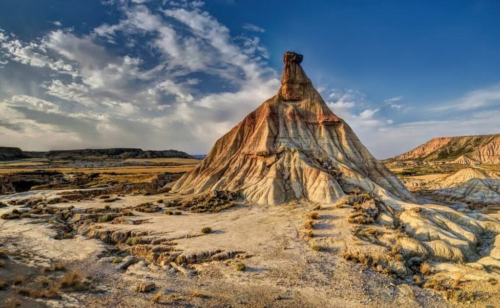
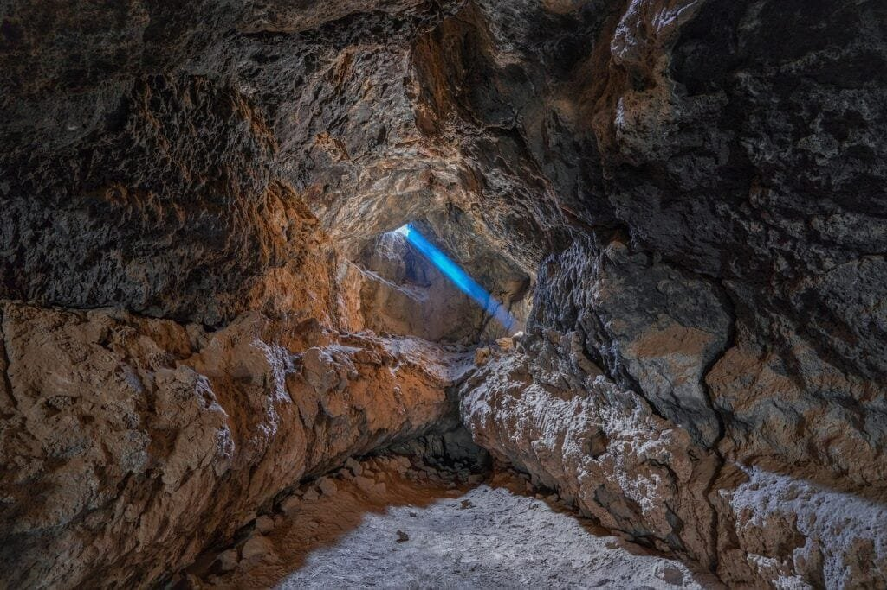
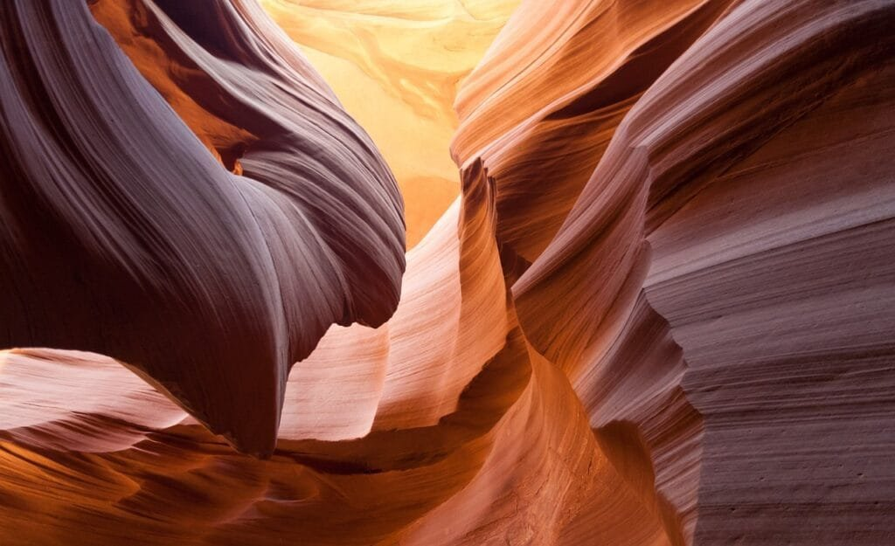

Have you ever wondered why volcanic rocks have such unique names? This article explores the factors that influence the naming of volcanic rocks. Understanding the process behind this seemingly arbitrary practice provides valuable insights into the world of volcanology. From the type of volcano to the specific characteristics of the eruption, various factors come into play when it comes to assigning names to volcanic rocks. So, let's dive in and unravel the intriguing world of how volcanic rocks get their names.

This image is property of pixabay.com.

## The role of Chemical Composition in Naming Volcanic Rocks

### Overview of Key Chemical Components

When it comes to naming volcanic rocks, one of the key factors that plays a crucial role is their chemical composition. The chemical components present in these rocks can vary significantly, and they are often used as a basis for classification and identification. Some of the key chemical components that are considered when naming volcanic rocks include silica, iron, magnesium, aluminum, potassium, and calcium.

### The Significance of Silica

Silica, or silicon dioxide (SiO2), is a particularly important chemical component when it comes to naming volcanic rocks. The amount of silica present in a volcanic rock can determine its overall composition and physical properties. Rocks with high silica content are generally referred to as "felsic" rocks, which are light-colored and rich in quartz and feldspar minerals. On the other hand, rocks with low silica content are known as "mafic" rocks, which are dark-colored and rich in iron and magnesium minerals.

Silica content also plays a role in determining the eruptive style of a volcano. Volcanoes that erupt felsic magma tend to have more explosive eruptions due to the high viscosity of the magma. In contrast, volcanoes that erupt mafic magma have less explosive eruptions because the magma is more fluid and flows more easily.

### Influence of Other Minerals

While silica is a key component in naming volcanic rocks, other minerals also contribute to their overall composition and properties. For example, the presence of certain minerals such as olivine, pyroxene, and amphibole in volcanic rocks can indicate their chemical composition and origin. These minerals can help geologists classify volcanic rocks and provide insights into the history and processes that formed them.

Additionally, the relative abundance of different minerals within a volcanic rock can influence its color, texture, and hardness. For example, rocks rich in olivine may have a greenish color, while those rich in amphibole may have a dark, shiny appearance. These mineral characteristics, along with the overall chemical composition, are taken into account when naming volcanic rocks.

## Impact of Physical Properties on Volcanic Rock Nomenclature

### Texture and Crystal Size

In addition to chemical composition, the texture and crystal size of volcanic rocks are important factors in their naming and classification. The texture refers to the arrangement and size of the mineral grains within the rock. Different textures can indicate different cooling histories and eruption styles.

For example, volcanic rocks with a glassy texture are formed when the lava cools rapidly, preventing the formation of large crystals. On the other hand, volcanic rocks with a fine-grained texture have smaller crystals and are formed when the lava cools more slowly. Coarse-grained volcanic rocks have larger crystals and are typically associated with slow cooling and intrusive processes.

The crystal size can also provide insights into the cooling rate of the lava and the depth at which the rock was formed. By considering the texture and crystal size of volcanic rocks, geologists can further refine their classification and naming of these rocks.

### Color and Luster

Color and luster are visual properties that can also play a role in the naming of volcanic rocks. The color of a volcanic rock can be influenced by the presence of certain minerals or impurities. For example, rocks with a high iron content may appear dark, while those with a high silica content may appear light-colored.

Luster refers to the way light reflects off the surface of a mineral or rock. Volcanic rocks can exhibit different lusters, such as glassy, shiny, dull, or metallic. These visual characteristics can provide clues about the mineral composition and geological processes that formed the rock.

### Density and Porosity

The density and porosity of volcanic rocks are physical properties that are also considered in their naming. Density refers to the mass per unit volume of the rock and can be influenced by the composition and packing of the mineral grains. Porosity, on the other hand, refers to the amount of empty space or pores within the rock.

Different volcanic rocks can have varying densities and porosities depending on factors such as the amount of gas trapped within the rock during volcanic eruptions. These properties can affect the overall strength and durability of the rock, as well as its suitability for certain applications or uses.

### Hardness and Resistance

The hardness and resistance of volcanic rocks are important considerations when it comes to their naming and classification. The hardness of a rock refers to its ability to resist scratching or abrasion, while resistance refers to its ability to withstand weathering and erosion over time.

Volcanic rocks can vary in hardness and resistance depending on factors such as their mineral composition, texture, and porosity. Some volcanic rocks are relatively soft and prone to weathering, while others are more resistant and durable. These properties can impact the usability and longevity of the rock in various applications, such as construction materials or decorative purposes.

<iframe width="560" height="315" src="https://www.youtube.com/embed/VNGUdObDoLk" frameborder="0" allow="accelerometer; autoplay; encrypted-media; gyroscope; picture-in-picture" allowfullscreen></iframe>

  

## Eruptive Style and Its Effect on the Naming of Volcanic Rocks

### Non-Explosive Eruptions and Effusive Lava Flows

The eruptive style of a volcano can have a significant impact on the naming of volcanic rocks. Non-explosive eruptions, also known as effusive eruptions, occur when magma reaches the surface and flows slowly as lava. These eruptions typically produce volcanic rocks with a specific composition and texture.

Volcanoes that experience non-explosive eruptions often produce basaltic lava flows, which are characterized by their low viscosity and fluidity. The resulting volcanic rocks, often referred to as basalt, have a fine-grained texture and a characteristic dark color. Basaltic lava flows can cover vast areas and create distinctive landscapes, such as the basalt plateaus in Iceland or the Columbia River Basalt Group in the northwestern United States.

### Explosive Eruptions and Pyroclastic Material

In contrast to non-explosive eruptions, explosive volcanic eruptions involve the ejection of pyroclastic material, such as ash, pumice, and volcanic bombs. These explosive eruptions can occur when highly viscous magma, often rich in silica, interacts with volatile gases trapped within it. The resulting volcanic rocks exhibit different characteristics compared to those formed during effusive eruptions.

Volcanic rocks formed from explosive eruptions can have a variety of textures and compositions depending on the specific eruption style. Rocks like pumice are extremely porous and light in weight due to the rapid expansion of gas bubbles during the eruption. Volcanic rocks formed from explosive eruptions can also include volcanic ash, which is composed of fine particles that were dispersed into the atmosphere during the eruption.

### Intermediate Eruption Styles

Some volcanic eruptions display characteristics of both non-explosive and explosive styles, resulting in intermediate types of volcanic rocks. These eruptions can occur when magma with intermediate silica content interacts with varying amounts of gas and volatiles.

Intermediate volcanic rocks can show a range of compositions and textures. Andesite, for example, is an intermediate volcanic rock that is often associated with explosive eruptions. Dacite and rhyolite are also intermediate volcanic rocks, with increasing silica content, and are often associated with explosive or domed eruptions.

The eruptive style of a volcano, whether non-explosive, explosive, or intermediate, can strongly influence the naming and classification of volcanic rocks due to the distinct characteristics exhibited by each eruption style.

## Geographical Factors in Volcanic Rock Classification

### Tectonic Plate Boundaries and Volcanism

The geographical location of a volcano can provide valuable insight into the classification and naming of volcanic rocks. Volcanic activity is closely related to plate tectonics, and most volcanoes are located along tectonic plate boundaries.

Convergent plate boundaries, where two plates collide, are often characterized by explosive volcanism due to the subduction of one plate beneath the other. These [types of volcanoes](https://magmamatters.com/understanding-volcanic-formation-a-comprehensive-guide/ "Understanding Volcanic Formation: A Comprehensive Guide"), known as subduction zone volcanoes, produce volcanic rocks with distinct compositions and textures. For example, the Cascade Range in the western United States is a volcanic arc associated with the subduction of the Juan de Fuca plate beneath the North American plate, resulting in the formation of andesitic and rhyolitic volcanic rocks.

Divergent plate boundaries, on the other hand, are characterized by volcanic activity that is linked to the upwelling of magma from the mantle. Volcanoes formed along these boundaries are often non-explosive and produce basaltic lava flows. The Mid-Atlantic Ridge, where the Eurasian and North American plates are moving apart, is an example of a divergent plate boundary associated with the formation of basaltic volcanic rocks.

### The Role of Rift Zones in Magma Formation

Rift zones, where the Earth's crust is extending and thinning, can also impact the classification and naming of volcanic rocks. Rift zones are often associated with non-explosive volcanic activity and the formation of basaltic lava flows.

One well-known example of a rift zone is the East African Rift, which stretches across several countries in East Africa. This rift zone has given rise to numerous volcanoes, including Mount Kilimanjaro and Mount Nyiragongo. The volcanic rocks formed in the East African Rift are predominantly basaltic in [nature](https://magmamatters.com/the-art-and-science-of-volcano-monitoring/ "The Art and Science of Volcano Monitoring") and exhibit characteristics typical of non-explosive eruptions.

### Hotspots and Shield Volcanoes

Hotspots, which are areas of anomalously hot mantle beneath the Earth's crust, can also influence volcanic rock classification. Hotspots are often associated with the formation of shield volcanoes, which are characterized by their broad, gently sloping profiles.

Shield volcanoes typically produce basaltic lava flows, resulting in the formation of basalt volcanic rocks. These volcanic rocks have a low silica content and exhibit characteristics associated with non-explosive eruptions. The Hawaiian Islands are well-known examples of hotspot-related shield volcanoes and are composed of basaltic volcanic rocks.

The geographical factors associated with volcanic activity, such as tectonic plate boundaries, rift zones, and hotspots, can greatly influence the classification and naming of volcanic rocks. Understanding the location and geological context of a volcano is essential in accurately categorizing and naming the volcanic rocks that are associated with it.

This image is property of pixabay.com.

## Time and Age Factors in Naming Volcanic Rocks

### Establishing the Age of Volcanic Rocks

Time and age are important considerations when it comes to naming volcanic rocks. The age of a volcanic rock can provide valuable information about its formation, eruption history, and geological context.

Geologists use various methods to establish the age of volcanic rocks, including radiometric dating techniques. Radiometric dating relies on measuring the abundance of isotopes in volcanic rocks and determining their decay rates. By comparing the abundance of certain isotopes in a volcanic rock to the known decay rates, geologists can estimate the age of the rock.

Establishing the age of volcanic rocks allows for a more accurate classification and naming of these rocks. It helps geologists understand the chronology of volcanic activity in a particular region and provides insights into the geological history and processes that shaped the rocks.

### Historical or Holocene Volcanic Rocks

Volcanic rocks that formed during the recent historical period or Holocene epoch are often named and classified based on their association with documented volcanic eruptions. Historical or Holocene volcanic rocks are typically younger in age and can provide valuable information about recent volcanic activity.

For example, volcanic rocks formed during the eruption of Mount St. Helens in 1980 are referred to as "Holocene volcanic rocks" and are classified based on their specific characteristics and composition. These rocks play a crucial role in understanding the recent [eruptive history of the volcano and assessing potential volcanic hazards](https://magmamatters.com/the-environmental-impact-of-volcanic-eruptions-2/ "The Environmental Impact of Volcanic Eruptions") in the region.

### Prehistoric or Pleistocene Volcanic Rocks

Volcanic rocks that formed during prehistoric periods, such as the Pleistocene epoch, are often classified and named based on their age and geological context. Prehistoric volcanic rocks can provide insights into past volcanic activity and the geological evolution of a particular region.

Geologists use various methods to establish the age of prehistoric volcanic rocks, including radiometric dating and stratigraphic analysis. By studying the sequence of volcanic deposits and their relationship to other rock layers, geologists can piece together the geological history of an area and assign appropriate names to the volcanic rocks.

Understanding the age and timing of volcanic rocks is crucial in accurately classifying and naming them. Time factors provide important context and allow for a more comprehensive understanding of the geological processes and events associated with volcanic activity.

## The Influence of Volcanic Rock Usage on its Naming

### Cultural and Historic Utility of Volcanic Rock

The usage of volcanic rocks throughout history has had a significant influence on their naming. Volcanic rocks have been utilized by humans for various purposes, ranging from construction materials to cultural artifacts.

For example, volcanic rock such as basalt was commonly used in ancient civilizations for constructing buildings, roads, and sculptures. In places like ancient Egypt and Mesoamerica, basalt was highly valued for its durability and aesthetic qualities. The usage of volcanic rocks in such prominent historical contexts has contributed to their recognition and specific naming conventions.

### Modern-Day Uses of Volcanic Rock

In addition to their historical and cultural utility, volcanic rocks continue to be used in various industries and applications today. Modern-day uses of volcanic rocks include construction materials, road aggregates, decorative landscaping, and even in the production of certain types of cement.

Volcanic rocks are valued for their unique physical properties, such as hardness, durability, and resistance to weathering. These properties make them ideal for certain applications where strength and longevity are key considerations. The specific uses and applications of volcanic rocks can influence their naming, as different names are often given to rocks that are specifically tailored for certain purposes.

### Economic and Industrial Importance of Certain Types of Volcanic Rocks

The economic and industrial importance of certain types of volcanic rocks can also contribute to their distinctive naming. Some volcanic rocks possess valuable mineral deposits or resources that have commercial significance.

For example, volcanic rocks associated with mineral deposits of gold, silver, copper, or gemstones are often given specific names to highlight their economic importance. These names can indicate the presence of economically valuable minerals and can guide exploration and mining activities.

In summary, the usage of volcanic rocks throughout history and their modern-day applications, as well as their economic and industrial importance, can all influence their naming. Naming conventions often reflect the cultural, historical, and economic significance of these rocks.

This image is property of pixabay.com.

## Historical and Cultural Context of Volcanic Rock Names

### Preexisting Local or Indigenous Names

The historical and cultural context of a region often plays a role in the naming of volcanic rocks. In many cases, preexisting local or indigenous names are used to refer to specific types of volcanic rocks.

Indigenous communities that have lived in close proximity to volcanic areas for generations often have their own names for the rocks found in their surroundings. These names can be based on the visual characteristics of the rocks, their cultural or spiritual significance, or even their practical uses within the community.

Preserving and acknowledging the preexisting local or indigenous names of volcanic rocks is important for respecting the cultural heritage and knowledge of these communities. Geologists and scientists often incorporate these names alongside scientific classifications to provide a more comprehensive understanding of volcanic rock nomenclature.

### Symbolic or Descriptive Naming Conventions

In addition to preexisting local or indigenous names, volcanic rocks are often named using symbolic or descriptive naming conventions. These conventions can be based on a variety of factors, including the visual characteristics of the rock, its geological context, or its resemblance to familiar objects or landscapes.

For example, volcanic rocks with a porous texture and low density, such as pumice, are often given names that reflect their light and airy nature. Other rocks may be named after their distinctive colors, such as obsidian (a black volcanic glass) or rhyolite (a pink or gray volcanic rock).

Geologists and scientists often strive to select names that are descriptive and intuitive, allowing for easier communication and understanding within the scientific community and beyond. These naming conventions help to create a common language for discussing and classifying volcanic rocks.

### International Standardization of Volcanic Rock Names

In order to promote consistency and facilitate communication among geologists worldwide, there have been efforts to establish international standards for the naming of volcanic rocks. These standards involve the use of standardized names and classification systems that are recognized and accepted globally.

The International Union of Geological Sciences (IUGS) plays a key role in promoting international standardization in the field of geology, including the naming of volcanic rocks. The IUGS, through its commissions and working groups, works to develop and maintain standardized terminology and classification systems that are used by geologists around the world.

The goal of international standardization is to ensure that volcanic rock names are universally understood and can be effectively used in scientific research, communication, and education. By establishing common naming conventions, geologists can facilitate the exchange of knowledge and enhance collaboration in the field of volcanology.

## The Role of Mineral Abundance in Naming Volcanic Rocks

### Mineral Domination in Certain Volcanic Rocks

The mineral composition of volcanic rocks can vary significantly, and the relative abundance of different minerals can have a significant impact on their naming. In some cases, certain minerals may dominate the composition of a volcanic rock, leading to specific names for these rocks.

For example, if a volcanic rock is dominated by the mineral olivine, it may be referred to as "olivine basalt" or "olivine-rich volcanic rock." Similarly, if a rock contains a significant amount of pyroxene or amphibole, it may be named accordingly to highlight the dominant minerals present.

The presence of dominant minerals can influence various physical and chemical properties of volcanic rocks, including color, hardness, and resistance to weathering. By considering the mineral abundance and composition, geologists can gain insights into the processes and conditions under which the rock formed.

### Unique Mineral Combinations and Rock Names

In addition to dominant minerals, the combination of different minerals within a volcanic rock can also contribute to its naming. Some volcanic rocks may contain unique combinations of minerals that are not commonly found together in other rock types.

For example, rocks that contain both feldspar and quartz minerals may be named "feldspar-quartz porphyry" or "granitic volcanic rock." These unique combinations help geologists identify and categorize volcanic rocks based on their mineral assemblages.

By examining the mineral composition and combinations within volcanic rocks, geologists can gain valuable insights into the geological processes, conditions, and origins of these rocks. Mineral abundance and combinations are important factors to consider when naming volcanic rocks and can provide vital information for understanding their properties and formations.

### The Influence of Rare or Exotic Minerals

In some cases, the presence of rare or exotic minerals in volcanic rocks can significantly influence their naming and classification. These minerals may be uncommon in most volcanic rocks but are found in specific geological settings or under unique conditions.

Volcanic rocks that contain rare or exotic minerals may be given specific names to highlight their distinctive characteristics. For example, volcanic rocks that contain diamonds or valuable gemstones may be named accordingly to reflect their economic importance.

The identification and naming of volcanic rocks with rare or exotic minerals can be of great scientific interest, as it allows for a better understanding of the geological processes, conditions, and resources associated with these rocks.

## Weathering and Erosion Impact on Naming Volcanic Rocks

### Weathering Rates and Exposure Time

Weathering and erosion processes can have a significant impact on the physical characteristics and mineral composition of volcanic rocks. Over time, exposure to the elements can lead to the breakdown and alteration of volcanic rocks, affecting their appearance and properties.

The rates of weathering and exposure time can vary depending on factors such as climate, topography, and mineral composition. Volcanic rocks exposed to harsh and humid environments may weather more rapidly compared to those in arid or cooler regions. The length of time that a volcanic rock has been exposed to these weathering processes can influence its surface features and mineral content.

The impact of weathering and erosion on volcanic rocks is an important consideration when it comes to their naming and classification. Rocks that have been subject to extensive weathering may have distinct features that differ from their fresh counterparts, and these differences may be reflected in their names.

### Physical and Chemical Weathering Processes

Weathering can occur through physical or chemical processes, and both can result in changes to the mineral composition and physical characteristics of volcanic rocks. Physical weathering involves the breakdown of rocks into smaller fragments through processes such as freeze-thaw cycles, abrasion, or chemical expansion due to hydration.

Chemical weathering, on the other hand, involves the alteration of the mineral composition through chemical reactions with water, gases, or other substances. Chemical weathering can result in the formation of new minerals or the dissolution of existing minerals within the volcanic rock.

The specific weathering processes that a volcanic rock undergoes can impact its naming by altering its appearance, texture, and mineral content. For example, weathered volcanic rocks may have a more rounded shape, a smoother surface, or a different color compared to fresh volcanic rocks.

### Impact on Mineral Composition and Physical Characteristics

Weathering and erosion can significantly modify the mineral composition and physical characteristics of volcanic rocks, which can in turn affect their naming. For example, weathering may lead to the leaching or removal of certain minerals, resulting in a different overall composition.

Physical characteristics such as color, texture, and hardness can also be influenced by weathering processes. Weathered volcanic rocks may appear lighter or darker in color, have a more porous or crumbly texture, or have a reduced hardness compared to fresh volcanic rocks.

Understanding the impact of weathering and erosion on volcanic rocks is crucial for accurately classifying and naming them. Weathering processes can provide valuable insights into the [geological and environmental history of a volcanic](https://magmamatters.com/geothermal-energy-and-its-volcanic-origins/ "Geothermal Energy and Its Volcanic Origins") area and can help geologists interpret the characteristics and origins of volcanic rocks.

## The Process of Volcanic Rock Name Approval

### International Union of Geological Sciences and Its Role

The process of approving volcanic rock names involves an international governing body known as the International Union of Geological Sciences (IUGS). The IUGS plays a key role in promoting and coordinating scientific research in the field of geology, including the classification and naming of rocks.

The IUGS, through its commissions and working groups, works to establish standardized terminology, classification systems, and guidelines for naming different types of rocks, including volcanic rocks. These efforts help to ensure consistency and facilitate communication within the scientific community.

In the case of volcanic rocks, the IUGS provides guidelines for the naming and classification of these rocks based on their chemical composition, mineralogy, texture, and physical properties. The approval process often involves a rigorous review by experts in the field, who evaluate the proposed names based on established criteria and standards.

### Other Authoritative Bodies in Rock Naming

In addition to the IUGS, there may be other authoritative bodies or organizations involved in the approval of volcanic rock names at regional or national levels. These organizations may work in collaboration with the IUGS to establish and maintain consistent naming conventions and standards.

These bodies often include representatives from academia, geological surveys, and other relevant institutions. Their expertise and knowledge in the field of volcanology contribute to the comprehensive evaluation and approval of proposed volcanic rock names.

### Criteria and Consideration in the Approval Process

The approval process for volcanic rock names involves several criteria and considerations. Proposed names are evaluated based on their adherence to established naming conventions, their accuracy in describing the characteristics and properties of the rock, and their overall scientific merit.

In addition to scientific criteria, the approval process may also consider cultural, historical, and regional significance. Names that have cultural or indigenous origins may be given special consideration and be incorporated alongside scientific names.

The criteria and considerations used in the approval process aim to ensure that volcanic rock names are accurate, meaningful, and useful for communication within the scientific community and beyond. A standardized and well-regulated naming system allows for efficient and effective dissemination of geological knowledge and facilitates collaboration among geologists worldwide.

In conclusion, the naming of volcanic rocks is a complex process that involves considering a wide range of factors and criteria. Chemical composition, physical properties, eruptive style, geographical factors, time and age, usage and significance, cultural context, mineral abundance, weathering and erosion, and the approval process all play a role in the naming and classification of volcanic rocks. By understanding these factors, geologists can develop a comprehensive understanding of volcanic rock nomenclature and enhance our knowledge of these fascinating geological formations.

