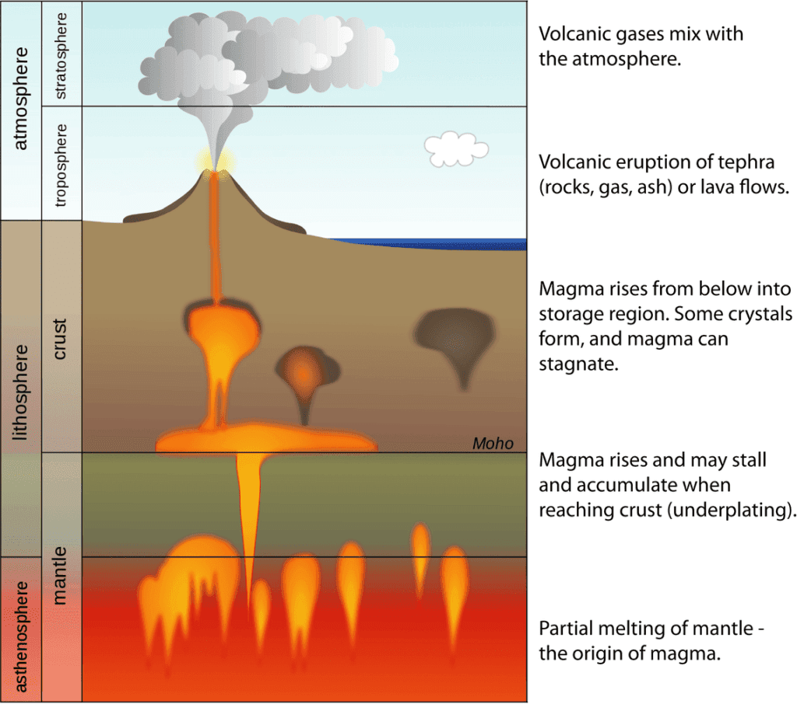

In the fascinating world of volcanoes, there are several factors that influence the patterns of active volcano eruptions. Volcanoes are formed when molten rock, gases, and debris escape to the earth's surface, resulting in the eruption of lava and ash. The locations of these eruptions are typically along plate boundaries, hotspots under the earth's crust, or rift zones where the earth's tectonic plates are moving apart. For instance, the renowned "Ring of Fire" encircling the Pacific Ocean is a prime example of a volcanic region prone to eruptions due to tectonic plate activity. However, not all volcanoes exhibit the same eruption patterns. Factors such as lava viscosity and gas content play a crucial role in determining the intensity and frequency of volcanic activity. By understanding these factors and how they dictate active volcano eruption patterns, scientists can better predict future volcanic activity and mitigate risks to surrounding communities.

This image is property of www.nps.gov.

## Volcano Types and Their Associated Eruption Patterns

### Stratovolcanoes and their explosive eruptions

Stratovolcanoes, also known as composite volcanoes, are tall and symmetrical with steep sides. These volcanoes are characterized by their explosive eruptions. The eruptions occur when viscous magma, rich in silica, accumulates in the volcano's central vent. The high silica content leads to the formation of thick and sticky magma, which traps gases within it. As pressure builds up, the explosive eruption occurs, resulting in ash clouds, pyroclastic flows, and the ejection of volcanic bombs and ash into the atmosphere. These eruptions are often powerful and can cause significant damage and pose risks to nearby communities.

### Shield volcanoes and their effusive eruptions

Shield volcanoes have a broad and gently sloping shape, resembling a warrior's shield lying on the ground. These volcanoes are formed by the eruption of low-viscosity basaltic magma. The magma flows easily due to its low silica content, allowing gases to escape more freely. Shield volcano eruptions are typically effusive, meaning the magma flows steadily and spreads over a large area without explosive eruptions. The lava flows from shield volcanoes tend to be relatively slow-moving, allowing people to evacuate and mitigate the risks associated with the eruption.

### Cinder cones and their sporadic eruptions

[Cinder cones](https://magmamatters.com/the-birth-of-new-land-understanding-cinder-cones/) are small, simple volcanoes that form from explosive eruptions. These volcanoes are composed of loose fragments of volcanic rock called scoria. The eruptions of cinder cones are sporadic in nature and occur when gas-charged magma is ejected into the air. The magma fragments into scoria as it cools and falls back to the ground, forming a cone-shaped hill around the vent. While cinder cones may not have large-scale eruptions like stratovolcanoes, they can still pose hazards to nearby areas, such as the potential for ash clouds and lava bombs.

### Fissure vents and their linear eruption patterns

Fissure vents are long, narrow cracks in the earth's surface from which lava erupts. These volcanic eruptions occur along linear fractures, often resulting in extensive lava flows. Fissure eruptions are commonly associated with basaltic magma, which has low viscosity and can flow easily. The eruptive activity along fissure vents is characterized by the simultaneous eruption of multiple vents, creating a linear pattern of lava flow. This type of eruption can cause significant damage to infrastructure and vegetation in the area surrounding the fissure vents.

## Tectonic Plate Interactions

### Destructive plate boundaries and eruption frequency

Destructive plate boundaries, also known as convergent plate boundaries, occur when two tectonic plates collide. The subduction of one plate beneath another leads to the formation of volcanic arcs. These arcs are associated with a high frequency of volcanic eruptions because subduction zones provide a pathway for magma to reach the surface. The melting of the subducted plate creates magma chambers, which can result in explosive eruptions and the formation of stratovolcanoes.

### Constructive plate boundaries and potential for large eruptions

Constructive plate boundaries, also known as divergent plate boundaries, occur when two tectonic plates move away from each other. Along these boundaries, volcanic activity can be observed at mid-ocean ridges and rift systems. The magma that rises through the fractures in the earth's crust is typically basaltic in composition, resulting in effusive eruptions. While the eruptions along constructive plate boundaries are generally less explosive, they have the potential to generate large volumes of lava and contribute to the formation of shield volcanoes.

### Conservative plate boundaries and their less frequent volcanic activity

Conservative plate boundaries, also known as transform plate boundaries, occur when two tectonic plates slide past each other horizontally. These boundaries are characterized by intense tectonic activity, such as earthquakes, but volcanic activity is less common. While magma generation can occur along conservative plate boundaries, the lack of a clear pathway for magma to reach the surface limits the frequency of volcanic eruptions in these areas.

This image is property of media.springernature.com.

## Magma Composition and Viscosity

### Rhyolitic magma and high-explosive eruptions

Rhyolitic magma is characterized by its high silica content, resulting in a highly viscous and sticky texture. This type of magma has a high gas content and a tendency to trap gases within it. As pressure builds up, the explosive eruption occurs, leading to the formation of pyroclastic flows, volcanic ash clouds, and the ejection of volcanic bombs. Rhyolitic eruptions are known for their high explosivity and can have devastating impacts on the surrounding areas. Many stratovolcanoes are associated with rhyolitic eruptions.

### Andesitic magma and moderate-expressive eruptions

Andesitic magma has a moderate silica content, making it less viscous than rhyolitic magma. This type of magma often leads to eruptions with a moderate explosivity. The eruptions are characterized by a combination of explosive activity and effusive lava flows. Andesitic eruptions can produce volcanic ash, pyroclastic flows, and lava domes. Volcanoes associated with andesitic magma often exhibit a mix of explosive and effusive eruption styles.

### Basaltic magma and low-explosive eruptions

Basaltic magma has a low silica content, resulting in low viscosity and a fluid texture. These properties allow gases to escape more easily, leading to effusive eruptions. Basaltic eruptions are characterized by the steady flow of lava over a large area. The low explosivity of basaltic eruptions reduces the risks posed to nearby communities, although the lava flows can still cause destruction and disrupt transportation routes. Shield volcanoes, such as those in Hawaii, are often associated with basaltic magma.

## Gas Content and Release in Volcanic Eruptions

### Influence of gas content on volcano explosivity

The gas content of magma plays a crucial role in determining the explosivity of volcanic eruptions. When magma contains a high concentration of dissolved gases, such as water vapor, carbon dioxide, and sulfur dioxide, the eruption can be more explosive. The dissolved gases exsolve from the magma as pressure decreases during the ascent to the surface. As the gas bubbles reach the surface, they expand rapidly, fragmenting the magma and propelling it into the surrounding atmosphere.

### Gas release mechanisms and eruption intensity

There are different mechanisms through which gases are released during volcanic eruptions. Some eruptions involve the release of gases from magma through passive degassing, where gas bubbles rise and escape without causing explosive activity. Other eruptions involve the rapid exsolution and expansion of gas bubbles, resulting in explosive eruptions. The intensity of the eruption can depend on factors such as the rate of gas release, the gas composition, and the viscosity of the magma. High-viscosity magma with a high gas content is more likely to result in explosive and highly destructive eruptions.

This image is property of media.springernature.com.

## Volcano Distribution and Geographical Factors

### Ring of Fire and its high volcanic activity

The "Ring of Fire" is a major area in the basin of the Pacific Ocean where a large number of earthquakes and volcanic eruptions occur. This region is characterized by its high volcanic activity due to the presence of many subduction zones, where tectonic plates converge, along its boundaries. The subduction of oceanic plates beneath continental plates or other oceanic plates creates ideal conditions for the formation of volcanic arcs and the occurrence of explosive eruptions.

### Volcanism in Rift Zones, Hotspots, and Their Eruption Patterns

Volcanic activity can also be observed in rift zones and hotspots. Rift zones occur where tectonic plates are moving apart, creating a linear series of fractures. Magma has the opportunity to reach the surface through these fractures, resulting in volcanic eruptions. Hotspots, on the other hand, are areas where plumes of hot material rise from deep within the earth's mantle. The upward movement of these plumes causes the formation of volcanic activity, such as shield volcanoes. Eruptions in rift zones and hotspots are often characterized by effusive lava flows.

### Island arc volcanoes and their explosive nature

Island arc volcanoes are formed on the overriding plate in subduction zones. These volcanoes are typically associated with explosive eruptions due to the high silica content of the magma and the presence of water released from the subducted plate. As the magma rises through the overriding plate, the water in the magma rapidly expands, leading to explosive eruptions and the release of volcanic ash and pyroclastic flows. Island arc volcanoes are prominent in regions such as the Pacific Ring of Fire and are known for their explosive nature.

## Volcanic Chambers and Plumbing Systems

### Shallow magma chambers and violent eruptions

Shallow magma chambers are typically located within the upper crust and are associated with violent volcanic eruptions. These chambers contain highly pressurized magma that can rapidly release energy during an eruption. The pressure buildup within the shallow chamber can lead to explosive eruptions, with magma being fragmented and ejected forcefully from the volcano. The violent nature of eruptions from shallow magma chambers can result in the formation of volcanic ash clouds, pyroclastic flows, and volcanic bombs.

### Deep magma reservoirs and less explosive eruptions

Deep magma reservoirs are located at greater depths within the earth's crust or mantle. Eruptions from deep reservoirs are often less explosive compared to eruptions from shallow chambers. The greater depth allows for the gradual release of pressure, resulting in less violent eruptions. The magma from deep reservoirs is typically more fluid and less prone to fragmentation. As a result, eruptions from deep magma reservoirs are characterized by effusive lava flows, rather than explosive pyroclastic activity.

### Complexity of plumbing systems and varied eruption patterns

Volcanic plumbing systems refer to the network of channels and conduits through which magma travels from its source to the surface. The complexity of these systems can vary, leading to different eruption patterns. Some volcanoes may have a simple plumbing system, with a single conduit leading straight from the magma source to the surface. These volcanoes often exhibit more predictable eruption patterns. In contrast, other volcanoes may have a complex plumbing system, with multiple interconnected chambers and conduits. The complexity of these systems can result in more varied eruption patterns, including intermittent eruptions and the formation of secondary vents.

This image is property of i.ytimg.com.

## Eruption Histories and Recurring Patterns

### Influence of past eruptions on future activity

The eruption history of a volcano can provide valuable insights into its future activity. By studying past eruptions, scientists can identify recurring patterns, including the frequency and style of eruptions. For example, if a volcano has exhibited explosive eruptions in the past, it is likely to continue exhibiting similar activity in the future. Understanding past eruption patterns can help scientists and communities prepare for future volcanic events and implement appropriate mitigation measures.

### Importance of eruption history in prediction models

Eruption history plays a crucial role in the development of volcanic eruption prediction models. By analyzing the patterns and characteristics of past eruptions, scientists can develop models that estimate the likelihood and potential impact of future eruptions. Factors such as eruption frequency, eruption style, and the duration of dormant periods between eruptions are considered in these models. However, predicting volcanic eruptions accurately remains challenging due to the many complex and interrelated factors influencing volcanic activity.

## External Triggers of Volcanic Eruptions

### Role of external water in triggering eruptions

External water can play a significant role in triggering volcanic eruptions. When water interacts with magma, it can rapidly convert to steam, causing an increase in pressure. This increase in pressure can lead to explosive eruptions as the steam expands and fragments the magma. The external water can come from various sources, such as heavy rainfall, glacial meltwater, or the interaction between groundwater and magma. Volcanoes located in coastal regions or regions with high precipitation are particularly susceptible to eruptions triggered by external water sources.

### Effects of tectonic stress and seismic activity on eruptions

Tectonic stress and seismic activity can also influence volcanic eruptions. The movement and interaction of tectonic plates generate stress within the earth's crust. This stress can be released through seismic activity, such as earthquakes. [Seismic activity near a volcano](https://magmamatters.com/the-art-and-science-of-volcano-monitoring/ "The Art and Science of Volcano Monitoring") can impact the behavior of the volcano by affecting the fractures and conduits through which magma rises to the surface. The release of stress during an earthquake can also lead to the reactivation of dormant volcanoes or trigger new eruptions. Understanding the relationship between tectonic stress, seismic activity, and volcanic eruptions is crucial for accurately predicting volcanic behavior.

This image is property of media.springernature.com.

## Signs of Upcoming Eruptions and Prediction Difficulties

### Seismic activity as an indicator of upcoming eruptions

Seismic activity is one of the key indicators used to monitor volcanoes and predict upcoming eruptions. Volcanic processes generate specific seismic signals, such as volcano-tectonic earthquakes, harmonic tremors, and long-period earthquakes. Monitoring and analyzing these seismic signals allow scientists to detect changes in magma movement, pressure, and gas release within the volcano. However, interpreting seismic data can be challenging as different volcanoes exhibit varying seismic patterns, and there can be natural variations in background seismicity.

### Challenges in accurately predicting eruption timings

Despite advancements in volcano monitoring technology, accurately predicting the timing of volcanic eruptions remains a significant challenge. Volcanic systems are complex, and multiple factors influence eruption behavior. The interaction between magma, gas, and rock properties is highly dynamic and can change rapidly, making it difficult to pinpoint the exact moment of an eruption. Furthermore, volcanic systems can exhibit periods of unrest without progressing to an eruption, making it challenging to differentiate between precursory signals and false alarms. Improving eruption timing predictions requires continued research, monitoring, and collaboration among volcanologists.

## Eruption Consequences, Risks, and Protection Measures

### Hazards posed by volcanic eruptions

Volcanic eruptions can pose various hazards to life, property, and the environment. These hazards include pyroclastic flows, which are fast-moving clouds of hot gas and volcanic debris that can incinerate everything in their path. Ash clouds can pose risks to human health, disrupt transportation systems, and damage infrastructure and agriculture. Volcanic ash can also have long-term impacts on air quality and cause respiratory issues in affected areas. Lava flows can destroy homes, vegetation, and infrastructure. In addition to these hazards, volcanic eruptions can trigger mudflows, known as lahars, as well as generate volcanic gases that pose health risks.

### Benefits of volcanic eruptions

Despite the hazards they pose, volcanic eruptions also bring several benefits. Volcanic soils are highly fertile due to the presence of minerals and nutrients, making them suitable for agriculture. Volcanic eruptions contribute to the formation of new land, such as volcanic islands and lava plateaus, which can support unique ecosystems. Volcanic activity also plays a crucial role in the Earth's geologic processes, such as plate tectonics and the cycling of minerals. Furthermore, volcanic eruptions have attracted tourists to certain regions, providing economic opportunities for local communities.

### Measures for mitigating risks associated with volcanic activity

Mitigating the risks associated with volcanic activity involves various strategies and measures. Volcano monitoring networks provide early warning systems by detecting changes in volcanic activity and allowing for timely evacuations. Adequate emergency planning, education, and communication with local communities are essential for ensuring their safety during eruptions. Land-use zoning can help prevent the construction of critical infrastructure in high-risk areas. Volcano observatories and research institutions play a crucial role in advancing scientific knowledge about volcanoes and improving eruption predictions. International cooperation and the sharing of information and resources are vital for effectively managing volcanic risks and protecting vulnerable communities.

In conclusion, the factors influencing active volcano eruption patterns are diverse and interconnected. Volcano types, tectonic plate interactions, magma composition, gas content, geographical factors, volcanic chambers, eruption histories, external triggers, and prediction difficulties all play significant roles in shaping volcanic eruptions. Understanding these factors can help us predict and mitigate the risks associated with volcanic activity, protecting lives and property while harnessing the benefits that volcanic eruptions bring to the Earth's ecosystems. Continued research and monitoring are necessary to improve our understanding and ability to forecast volcanic eruptions accurately.

