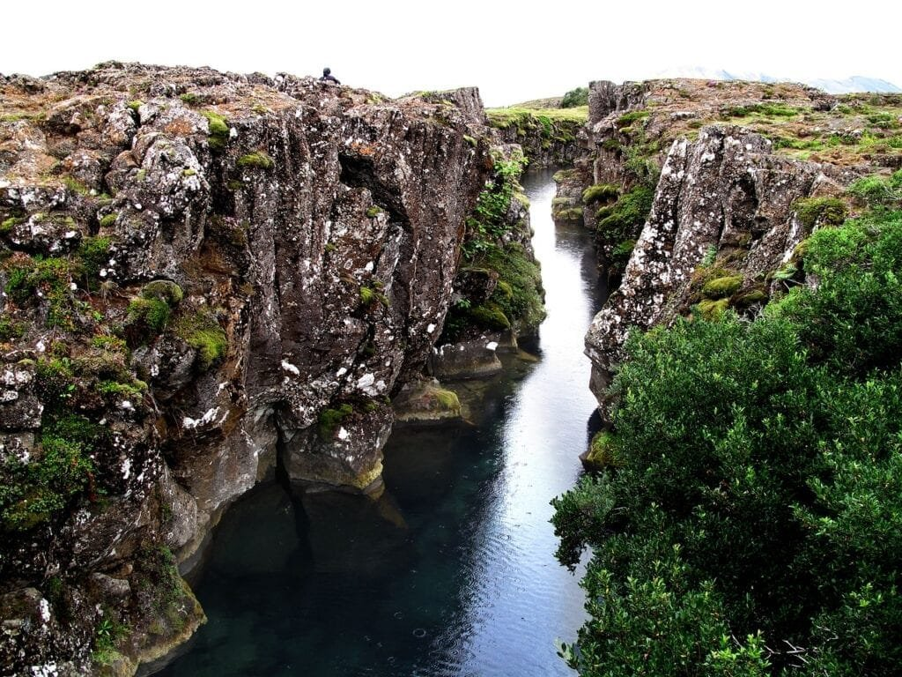
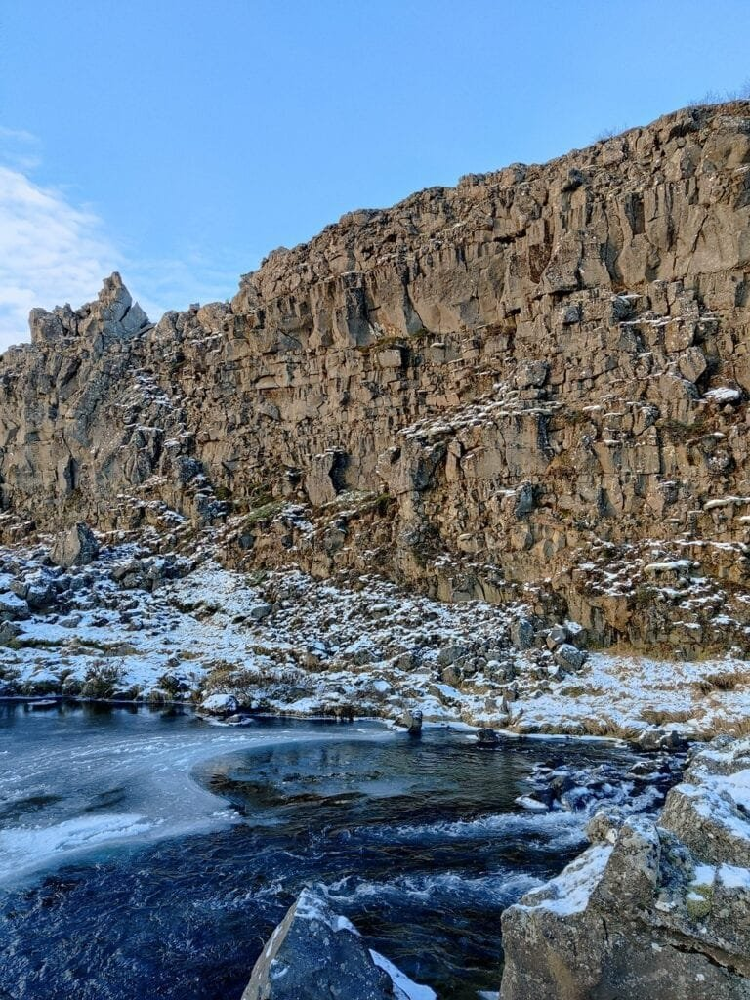
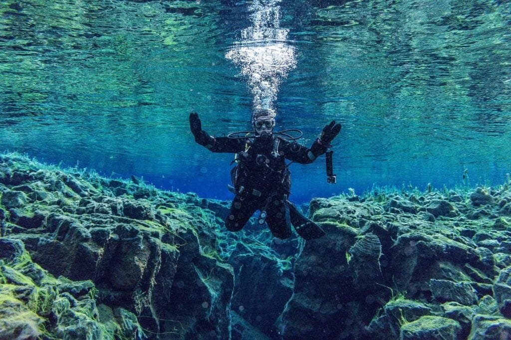

In the fascinating world of geology, volcanic islands stand as captivating marvels formed through the powerful forces of plate tectonics. When molten rock, gases, and debris escape to the Earth’s surface, they give rise to explosive eruptions of lava and ash, creating these remarkable landforms. These volcanic islands typically emerge from specific locations along plate boundaries, hotspots beneath the Earth's crust, or rift zones where the Earth’s tectonic plates separate. The infamous "Ring of Fire" encircling the Pacific Ocean hosts numerous eruptive hotspots, while other locations, like Hawaii's shield volcanoes, gradually form through underground hotspots and erupt with less intensity. Understanding the formation of these volcanic islands not only provides insights into their various eruption patterns, but also assists in predicting future volcanic activity and mitigating potential risks to communities in their vicinity.

This image is property of pixabay.com.

## Volcanic Islands: Basic Understanding

Volcanic islands are geologically active landforms that are formed through volcanic activity. They are typically located in the middle of the ocean and are characterized by their volcanic origin and unique landscapes. These islands are formed when magma from beneath the Earth's surface erupts and solidifies, creating new landmasses.

### Definition and general characteristics of volcanic islands

A volcanic island is defined as an island that is predominantly formed by volcanic activity. These islands are typically formed from underwater volcanoes, also known as seamounts, that rise above the water's surface due to accumulated volcanic materials. They often have steep and rugged terrains due to the accumulation of volcanic rocks and ash.

### Overview of the formation process of volcanic islands

The formation of volcanic islands begins with the movement of tectonic plates. These plates, which make up the Earth's crust, constantly interact with each other. When two plates collide, one is forced beneath the other, forming a subduction zone. In these subduction zones, magma is generated as the subducting plate interacts with the Earth's mantle.

As the magma rises towards the surface, it often encounters weak spots in the Earth's crust, such as cracks and fissures. This causes the magma to erupt, resulting in volcanic activity. Over time, repeated eruptions can lead to the accumulation of volcanic materials, eventually forming a volcanic island.

## Role of Plate Tectonics in the Formation of Volcanoes

Plate tectonics plays a critical role in the formation of volcanoes. It is the study of the movement and interaction of the Earth's lithospheric plates, which are rigid sections of the Earth's crust. These plates constantly move, collide, and diverge, resulting in various geological phenomena such as earthquakes and volcanic activity.

### Detailed explanation of plate tectonics process

Plate tectonics is driven by the convective currents in the underlying mantle of the Earth. These currents cause the plates to move away from, collide with, or slide past each other. The three main types of plate boundaries are convergent boundaries, divergent boundaries, and transform boundaries.

Convergent boundaries occur when two plates collide. In these areas, one plate is forced beneath the other, creating a subduction zone. The descending plate melts as it reaches deeper into the Earth's mantle, generating magma. This magma rises through the overlying plate, leading to volcanic activity.

Divergent boundaries happen when two plates move apart from each other. In these areas, magma from the mantle pushes through the gap between the plates, creating new crust and forming volcanic activity such as mid-ocean ridges.

Transform boundaries occur when two plates slide past each other horizontally. While they do not directly cause volcanic activity, the stress and friction between the plates may result in the formation of fractures and faults that can serve as conduits for magma.

### Association between plate tectonics and volcano formation

Volcanoes are primarily formed at convergent and divergent plate boundaries. At convergent boundaries, the subduction of one plate beneath another generates magma that leads to volcanic activity. This is commonly observed in areas like the "Ring of Fire," a major area in the basin of the Pacific Ocean where many volcanic eruptions and earthquakes occur.

Divergent boundaries, on the other hand, create volcanic activity through the process of seafloor spreading. When two plates move apart, magma rises to fill the gap, solidifying and forming new crust. This process often results in the formation of underwater volcanoes and eventually volcanic islands.

This image is property of pixabay.com.

## Types of Volcanoes and Their Relation to Tectonic Plates

Volcanoes come in various shapes and sizes, each with its own characteristics and eruption patterns. The type of volcano formed is closely related to the type of tectonic plate boundary where it is located.

### Identification of the different types of volcanoes

The three main types of volcanoes are stratovolcanoes (composite volcanoes), shield volcanoes, and [cinder cones](https://magmamatters.com/the-birth-of-new-land-understanding-cinder-cones/).

Stratovolcanoes, also known as composite volcanoes, are large and symmetrical volcanoes characterized by steep slopes. They are composed of alternating layers of lava flows, volcanic ash, and debris. Stratovolcanoes are commonly found at convergent plate boundaries where subduction is occurring.

Shield volcanoes, on the other hand, have a broad and gently sloping profile. They are formed by the accumulation of fluid lava flows that spread out in thin sheets. Shield volcanoes are often associated with hotspots and can be found in areas such as Hawaii.

Cinder cones are the simplest form of volcanoes and are typically small in size. They are formed by explosive eruptions that eject cinders and volcanic ash into the air. Cinder cones are commonly found near other [types of volcanoes and are often associated with volcanic](https://magmamatters.com/understanding-volcanic-formation-a-comprehensive-guide/ "Understanding Volcanic Formation: A Comprehensive Guide") vents.

### Explanation of each type’s relation to plate tectonics

Stratovolcanoes are closely associated with convergent plate boundaries where subduction is occurring. The interaction between the descending oceanic plate and the overlying continental plate leads to the formation of stratovolcanoes. The subducting plate melts as it descends into the mantle, generating magma that eventually rises to the surface, forming a stratovolcano.

Shield volcanoes, on the other hand, are often associated with hotspots. Hotspots are areas of intense volcanic activity that are believed to be caused by plumes of hot mantle material rising from deep within the Earth. As the tectonic plate moves over the hotspot, magma rises to the surface, forming shield volcanoes such as those found in Hawaii.

Cinder cones are usually found near other volcanic features and are often associated with volcanic vents. They can form along both convergent and divergent plate boundaries, depending on the specific geologic conditions in the area. Cinder cones are typically formed by explosive eruptions that eject cinders and ash into the air.

## Geographical Distribution of Volcanoes and Tectonic Plate Boundaries

The distribution of volcanoes around the world is closely linked to the boundaries of tectonic plates. Volcanoes tend to occur in specific regions where the plates interact, creating prime conditions for volcanic activity.

### The global spread of volcanoes in relation to plate boundaries

The majority of volcanoes are found in regions of the world where tectonic plates converge or diverge. These areas include the "Ring of Fire," which encircles the Pacific Ocean and is known for its intense volcanic and seismic activity. Other notable volcanic regions include the East African Rift, the Mediterranean region, and the Caribbean.

The "Ring of Fire" is a prime example of a volcanic region closely associated with plate boundaries. It is located where several tectonic plates, including the Pacific Plate, the North American Plate, and the Philippine Sea Plate, meet. These interacting plates create a volatile environment, leading to frequent volcanic eruptions and earthquakes.

### Explanation of terms such as ‘Ring of Fire’ and other notable volcanic regions

The "Ring of Fire" refers to a major area in the basin of the Pacific Ocean where a large number of earthquakes and volcanic eruptions occur. It is named after the volcanic activity that encircles the region like a ring. The "Ring of Fire" is characterized by its high concentration of active volcanoes and frequent seismic activity.

Apart from the "Ring of Fire," there are other notable volcanic regions around the world. The East African Rift, for example, is a geological feature that stretches from the Afar Triangle in northeastern Africa to Mozambique. It is an active volcanic zone where the African Plate is slowly splitting apart, leading to the formation of new volcanoes.

The Mediterranean region is another area with significant volcanic activity. It includes volcanic features such as Mount Etna in Sicily and Mount Vesuvius near Naples. These volcanoes are associated with the subduction of the African Plate beneath the Eurasian Plate.

This image is property of pixabay.com.

## Understanding Hot Spots and Their Role in Formation of Volcanic Islands

Hot spots are areas of intense volcanic activity that are believed to be caused by plumes of hot mantle material rising from deep within the Earth. These plumes are believed to be stationary, while the tectonic plates above them move, resulting in the formation of chains of volcanic islands.

### Definition of hot spots

Hot spots are localized regions where magma rises to the Earth's surface, creating volcanic activity. Unlike plate boundaries, hot spots do not move with the tectonic plates. Instead, they are believed to originate from deep within the mantle, where hot material rises in the form of plumes.

### How hot spots contribute to the formation of volcanic islands, example of Hawaii

Hot spots contribute to the formation of volcanic islands by generating magma that rises to the Earth's surface. As the tectonic plate moves over the stationary hot spot, a chain of volcanic islands is formed. This can be observed in the case of Hawaii, which is a prominent example of a volcanic island chain.

The Hawaiian Islands were formed by a hot spot located beneath the Pacific Ocean. As the Pacific Plate moved over the stationary hot spot, magma rose to the surface, creating a series of volcanoes. Over time, as the tectonic plate continued to move, new volcanoes formed, resulting in a chain of islands. The Big Island of Hawaii, with its active volcano Mauna Loa, is the youngest and most active island in the chain.

## Formation Process of Volcanic Islands

The formation of volcanic islands is a complex and multi-stage process that involves various geological factors. It is a result of the interaction between tectonic plates, magma, and the Earth's crust.

### Detailed stages of volcanic island formation

The formation of volcanic islands can be divided into several stages.

1. Stage 1: Subduction or Melting - The process typically begins at a convergent plate boundary where one tectonic plate subducts beneath another. As the subducting plate descends into the mantle, it heats up and melts, generating magma.
    
2. Stage 2: Eruption and Accumulation - The generated magma rises through cracks and weaknesses in the Earth's crust, known as vents. This magma then erupts onto the surface, releasing gases and creating volcanic explosions. Over time, repeated eruptions cause the accumulation of volcanic materials, including lava, ash, and debris.
    
3. Stage 3: Growth and Emergence - As eruptions continue, the accumulated volcanic materials begin to build up and form a distinct landmass. The volcanic island starts to emerge from the ocean, with its shape and size evolving according to the characteristics of the eruptions and the surrounding geological features.
    
4. Stage 4: Consolidation and Erosion - Once the volcanic island has fully formed, it undergoes a process of consolidation, where the volcanic materials solidify and become more stable. However, the island is also subjected to erosion from various forces such as wind, water, and ice, which shape the island's features over time.
    

### Factors influencing the formation process of volcanic islands

The formation process of volcanic islands is influenced by several factors, including the type of tectonic boundary, the composition of magma, and the geological conditions in the area.

At convergent plate boundaries, where subduction occurs, the composition of the magma is determined by the interaction between the subducting plate and the mantle. This can vary depending on the characteristics of the two plates involved. The type of magma formed, whether it is more explosive or effusive, will have a significant impact on the shape and eruption style of the volcanic island.

The geological conditions in the area, such as the presence of cracks and weaknesses in the Earth's crust, also play a role in the formation process. These features act as pathways for magma to rise to the surface, facilitating volcanic eruptions. Additionally, the surrounding oceanic and atmospheric conditions can influence the rate of erosion and consolidation, shaping the final form of the volcanic island.

## Effects of Volcanoes on their Surrounding Environments

Volcanic eruptions have a profound impact on their surrounding environments, affecting the climate, soil, and landscape. While eruptions are often associated with destruction, they also bring about some positive effects in the long run.

### Impact of volcanic eruptions on climate

Volcanic eruptions can significantly impact the climate, both locally and globally. During an eruption, large amounts of volcanic gases, ash, and aerosols are released into the atmosphere. These materials can reflect and absorb sunlight, leading to a decrease in temperature near the volcano.

On a global scale, the release of volcanic gases, particularly sulfur dioxide, can result in the formation of sulfate aerosols in the stratosphere. These aerosols can stay in the atmosphere for an extended period, reflecting sunlight and causing a cooling effect on the Earth's surface. This phenomenon is often referred to as volcanic winter.

### Influence of volcanic activity on soil and landscape

Volcanic activity can have a profound influence on soil formation and landscape development. Volcanic eruptions release vast amounts of lava, ash, and other volcanic materials, which are rich in nutrients and minerals.

Once these materials cool and solidify, they break down over time to form fertile volcanic soil. This nutrient-rich soil is highly beneficial for agriculture and supports the growth of various plants. This is why many volcanic regions around the world have highly productive agricultural lands.

In terms of landscape development, volcanic eruptions can create various landforms such as calderas, lava fields, and volcanic cones. These unique features contribute to the overall diversity and beauty of volcanic landscapes.

## Hazards and Risks of Living near Volcanic Islands

Living near volcanic islands can pose significant hazards and risks due to the potential for volcanic eruptions. These hazards can have devastating consequences for both human populations and the surrounding environment.

### Possible dangers posed by nearby volcanic activities

The main dangers associated with living near volcanic islands include volcanic eruptions, pyroclastic flows, lahars, volcanic gases, and volcanic ash.

Volcanic eruptions can be highly destructive, with the potential to release lava flows, ash clouds, and volcanic bombs. These eruptions can cause widespread damage to infrastructure, vegetation, and human settlements. Additionally, pyroclastic flows, which are fast-moving currents of hot gas, ash, and rock fragments, can travel at high speeds and pose a significant threat to anyone in their path.

Lahars, or volcanic mudflows, are another hazard associated with volcanic activity. They occur when volcanic ash or debris mixes with water, causing a fast-moving flow that can destroy everything in its path. Lahars can travel down river valleys and cause significant damage to infrastructure and agriculture.

Volcanic gases, such as [sulfur dioxide and carbon](https://magmamatters.com/the-art-and-science-of-volcano-monitoring/ "The Art and Science of Volcano Monitoring") dioxide, can also pose risks to human health. These gases can be released during eruptions and accumulate in low-lying areas, leading to respiratory problems and even death. Volcanic ash, which contains sharp glass particles, can also cause respiratory issues and damage machinery and infrastructure.

### Examples of past catastrophic volcanic eruptions

Throughout history, there have been numerous catastrophic volcanic eruptions that have caused significant damage and loss of life. One notable example is the eruption of Mount Vesuvius in 79 AD, which buried the cities of Pompeii and Herculaneum under layers of ash and volcanic debris. Thousands of people were killed, and the cities were preserved under the ash, providing valuable insights into ancient Roman life.

Another infamous eruption is the 1815 eruption of Mount Tambora in Indonesia. This eruption, known as the largest eruption in recorded history, resulted in the global climate anomaly known as the "Year Without a Summer." The eruption caused widespread crop failures, famine, and social unrest in many parts of the world.

More recent examples include the eruption of Mount Pinatubo in the Philippines in 1991, which caused the temporary relocation of thousands of people and had a significant impact on the global climate. The eruption of Eyjafjallajökull in Iceland in 2010 disrupted air travel across Europe and caused economic losses amounting to billions of dollars.

## Benefits of Volcanic Activity

While volcanic eruptions can have devastating consequences, volcanic activity also brings about several advantages and benefits.

### Identification of several advantages linked to volcanoes

One of the main benefits of volcanic activity is the creation of fertile soil. Volcanic eruptions release minerals and nutrients into the environment, enriching the soil and making it highly fertile. This allows for the cultivation of crops and supports agriculture in volcanic regions.

Volcanic landscapes also attract tourism, contributing to the economic development of the surrounding areas. Volcanic features such as lava fields, hot springs, and volcanic cones are often popular tourist attractions that draw visitors from all over the world.

Volcanoes also have the potential to generate geothermal energy. Geothermal energy utilizes the heat stored deep within the Earth, often associated with volcanic activity. Geothermal power plants can harness this energy to generate electricity, providing a sustainable and renewable energy source.

### Explanation of how volcanic soil aids agriculture

Volcanic soil, also known as volcanic ash soil or Andisol, is highly fertile and contains abundant nutrients that are beneficial for plant growth. The minerals released during volcanic eruptions, such as potassium, phosphorus, and magnesium, enrich the soil and provide essential nutrients for plants.

The porous nature of volcanic soil allows for good drainage and aeration, preventing waterlogging and allowing plant roots to access oxygen. This promotes healthy root development and helps plants to thrive.

In addition, volcanic soil retains moisture well, ensuring that plants have a constant water supply. This is particularly advantageous in areas with dry or arid climates, where water availability is a limiting factor for agriculture.

The combination of nutrient-rich soil, good drainage, and moisture retention in volcanic regions creates ideal conditions for agricultural productivity. This is why volcanic areas such as the slopes of Mount Etna in Sicily and the fertile valleys of Hawaii are known for their abundant crops and agricultural activities.

## Mitigating Risks: Importance of Understanding Volcanoes

Understanding volcanoes is crucial for predicting future eruptions and mitigating the risks associated with volcanic activity. By studying volcanic processes and monitoring volcanic behavior, scientists can provide early warning systems and implement necessary measures to protect vulnerable communities.

### How understanding volcanoes can help in predicting future eruptions

Understanding the signs and signals of volcanic activity can provide valuable insights into the potential for future eruptions. By monitoring various parameters such as volcanic gas emissions, ground deformation, and seismic activity, scientists can detect changes indicative of an impending eruption.

Advanced techniques and technologies such as satellite monitoring, ground-based sensors, and GPS measurements allow for real-time monitoring of volcanic activity. This provides scientists with valuable data to analyze and make informed predictions about the likelihood and intensity of future eruptions.

### Methods and techniques used in volcano monitoring

Volcano monitoring involves a range of methods and techniques to gather data and monitor volcanic activity. These methods include:

1. Seismic Monitoring: Seismic instruments are used to detect and record volcanic earthquakes. The location, frequency, and intensity of these earthquakes can provide valuable information about the movement of magma and the potential for eruptions.
    
2. Gas Monitoring: Gas emissions from volcanoes are monitored to detect changes in the composition and quantity of volcanic gases. These measurements can help identify increasing volcanic activity and provide insights into the eruptive processes.
    
3. Ground Deformation Monitoring: Techniques such as GPS and satellite-based interferometric synthetic aperture radar (InSAR) are used to measure ground deformation near volcanoes. These measurements can detect changes in volcano shape and size, indicating the movement of magma beneath the surface.
    
4. Thermal Monitoring: Infrared cameras and satellite sensors are used to measure the thermal emissions from volcanoes. Changes in the amount of heat being emitted can indicate variations in volcanic activity.
    
5. Ash and Tephra Monitoring: Volcanic ash and tephra are monitored using ground-based sensors and satellite imagery. This helps in tracking the movement of ash clouds, predicting their dispersion, and assessing potential hazards to aviation and human health.
    

By combining these monitoring techniques with geological studies and historical data, scientists can develop models and forecasts to predict volcanic eruptions, allowing for early warnings and the implementation of necessary measures to protect lives and property.

In conclusion, the formation of volcanic islands is a result of complex geological processes involving tectonic plate movement and volcanic activity. Plate tectonics play a significant role in the formation of volcanoes, with convergent and divergent plate boundaries being the primary locations where volcanic activity occurs. Different types of volcanoes, such as stratovolcanoes, shield volcanoes, and cinder cones, are associated with specific tectonic settings. Understanding the [geological distribution of volcanoes](https://magmamatters.com/geothermal-energy-and-its-volcanic-origins/ "Geothermal Energy and Its Volcanic Origins") and the associated hazards is essential for mitigating risks and ensuring the safety of communities living near volcanic islands. Additionally, volcanic activity brings benefits such as fertile soil, geothermal energy, and tourism opportunities. By studying volcanoes, monitoring their behavior, and predicting eruptions, scientists can contribute to the protection and well-being of communities and the sustainable management of volcanic regions.

