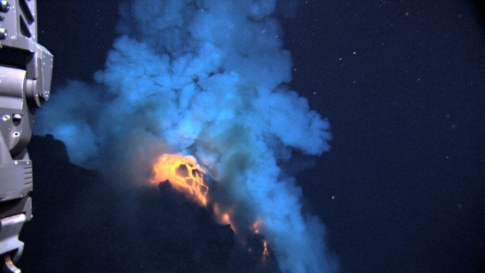
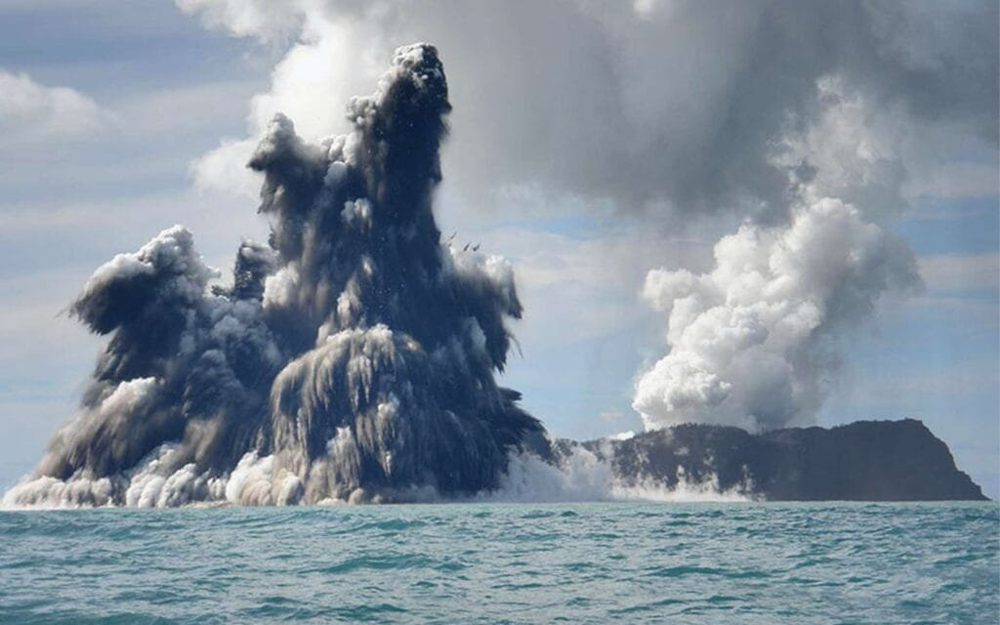
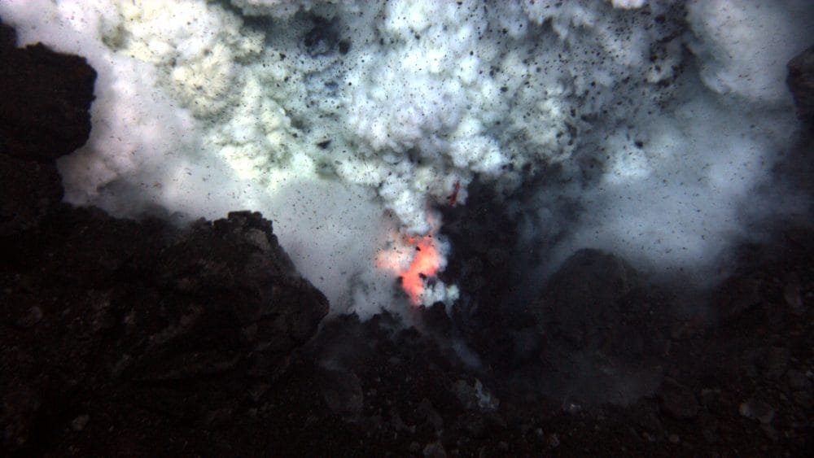
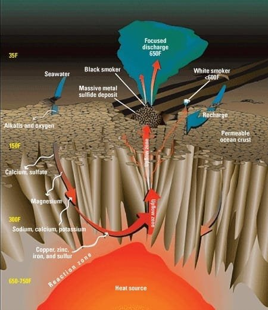
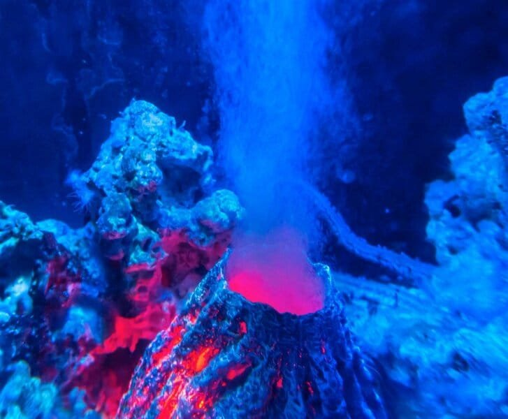

Did you know that beneath the vast oceans, there is a hidden force that powers submarine volcanoes? It's called geothermal energy, and it plays a crucial role in the formation and activity of these underwater volcanoes. Submarine volcanoes are formed when molten rock, gases, and debris rise to the surface of the Earth's crust, causing spectacular explosions of lava and ash. These volcanic eruptions occur at sites along plate boundaries, hotspots beneath the Earth's crust, or rift zones where tectonic plates are moving apart. In this article, we will explore the fascinating connection between geothermal energy and the powerful forces that shape our underwater landscapes.

<iframe width="560" height="315" src="https://www.youtube.com/embed/5Hb_ONJUA9I" frameborder="0" allow="accelerometer; autoplay; encrypted-media; gyroscope; picture-in-picture" allowfullscreen></iframe>

  

## Understanding Geothermal Energy

Geothermal energy is a renewable source of energy derived from the heat stored within the earth. It is a sustainable and environmentally friendly alternative to fossil fuels. Geothermal energy is harnessed by tapping into the natural heat of the earth's core. This heat is generated through the slow decay of radioactive materials such as uranium and thorium in the earth's mantle and crust.

## How Heat is Generated and Transferred in the Earth's Core

The earth's core is composed of a solid inner core and a liquid outer core. The heat generated within the core is primarily a result of the radioactive decay of elements and the residual heat left over from the earth's formation. This heat is transferred from the core to the earth's crust through a process known as convection. The movement of hot, less-dense materials in the mantle causes the transfer of heat towards the surface.

This image is property of video-images.vice.com.

## Technologies Used for Harnessing Geothermal Energy

Several technologies are employed for harnessing geothermal energy. The most common method is by using geothermal power plants. These plants drill deep into the earth to access hot water or steam sources that exist naturally underground. The steam or hot water is used to power turbines, which in turn generate electricity. Another method is direct use geothermal systems, where the heat is utilized directly for heating or cooling purposes in residential or commercial buildings. Additionally, ground source heat pumps utilize the relatively stable temperatures found just a few meters below the earth's surface to provide heating and cooling for buildings.

## The Science of Volcanoes

Volcanoes are fascinating geological formations that result from the eruption of molten rock, gases, and debris onto the earth's surface. There are different types of volcanoes, including composite volcanoes, shield volcanoes, and cinder cones, each with unique characteristics.

### Types of Volcanoes: Composite, Shield, and Cinder Cone

Composite volcanoes, also known as stratovolcanoes, are tall and conical in shape. They are formed by alternating layers of lava, ash, and rock debris. These types of volcanoes are typically steep and symmetrical, and their eruptions can be explosive.

Shield volcanoes, on the other hand, are broad and low-profile volcanoes with gently sloping sides. They are characterized by basaltic lava flows that spread out over large areas. Shield volcanoes have non-explosive eruptions and are mostly found in oceanic hotspots like Hawaii.

Cinder cone volcanoes are the simplest type of volcanoes and are usually small in size. They have steep, cone-shaped sides and are formed by the accumulation of fragmented volcanic material, such as cinders and ash, around a vent.

### Factors that Dictate Volcanic Eruption Patterns

Several factors determine the eruption patterns of volcanoes. One important factor is the composition and viscosity of the magma. Magma with high viscosity, such as andesitic or rhyolitic magma, tends to trap gases, leading to explosive eruptions. In contrast, magma with low viscosity, such as basaltic magma, allows gases to escape more easily, resulting in effusive eruptions.

Other factors include the presence of volatile gases, the location and size of the volcanic vent, and the pressure exerted by the overlying rocks. These factors interact in complex ways to determine the eruption style and magnitude of a volcano.

### Geographic Distribution of Volcanoes

Volcanoes are not evenly distributed across the globe. They are commonly found along plate boundaries, where tectonic plates meet or separate. The Pacific Ring of Fire, for example, is a horseshoe-shaped region surrounding the Pacific Ocean known for its high concentration of active volcanoes.

Different types of volcanoes are also associated with specific tectonic settings. Composite volcanoes are typically found at convergent plate boundaries, where one plate subducts beneath another. Shield volcanoes, on the other hand, are commonly associated with hotspot volcanism, where plumes of hot mantle material rise to the surface.

This image is property of www.syfy.com.

## The Role of Underwater Tectonic Plate Movements in Volcano Formation

Tectonic plate movements play a crucial role in the formation of both surface and submarine volcanoes. [Understanding these movements can provide insights into volcanic](https://magmamatters.com/understanding-volcanic-formation-a-comprehensive-guide/ "Understanding Volcanic Formation: A Comprehensive Guide") activities and their impact on the environment.

### Understanding Tectonic Plate Motion

The Earth's lithosphere is divided into several large tectonic plates that continuously move, albeit slowly, due to the convective currents in the underlying asthenosphere. There are three main types of plate boundaries: convergent boundaries, where plates collide; divergent boundaries, where plates move apart; and transform boundaries, where plates slide past each other.

### Role of Plate Tectonics in Magma Formation

Plate tectonics directly influences the formation of magma, which is the molten rock material found beneath the earth's surface. At convergent plate boundaries, one tectonic plate can be forced beneath another in a process called subduction. The subducting plate brings water and other volatile substances into the mantle, causing the overlying mantle to melt and generate magma.

At divergent plate boundaries, such as mid-ocean ridges, the plates move apart, creating a gap that allows magma to rise from the asthenosphere to the surface. This process is known as decompression melting. The magma that reaches the surface forms new crust, leading to the formation of submarine volcanoes.

### How Underwater Tectonic Plate Movements Lead to Volcanic Activities

Underwater tectonic plate movements can trigger volcanic activities, particularly in seafloor spreading centers and subduction zones. In seafloor spreading centers, as plates move apart, magma rises to fill the gap, forming underwater volcanoes. These volcanoes can become active and erupt, releasing lava and gases into the surrounding water.

In subduction zones, where one tectonic plate is forced beneath another, the subducting plate can release water and volatile substances into the mantle, causing the overlying mantle to melt and form magma. This magma can then rise to the surface, leading to the formation of submarine volcanoes.

## Submarine Volcanoes: A Deep Sea Phenomenon

Submarine volcanoes are volcanoes that form beneath the sea. Although they are hidden from view, they play a significant role in shaping the underwater landscape and influencing various geological processes.

### What are Submarine Volcanoes?

Submarine volcanoes, also known as underwater volcanoes or seamounts, are volcanic structures that rise from the seafloor. They are similar to their surface counterparts in terms of their formation and eruption processes, but they are hidden beneath the ocean's depths. These volcanoes can be found in all oceans and contribute to the creation and transformation of the earth's crust.

### Unique Features of Submarine Volcanoes Compared to Surface Volcanoes

Submarine volcanoes possess several unique features that distinguish them from surface volcanoes. One distinct characteristic is the presence of pillow lava formations. Pillow lavas are formed when lava erupts underwater and solidifies rapidly due to the cooling effect of the surrounding water. The result is a pillow-shaped structure that stacks on top of each other, creating a fascinating geological formation.

Another unique feature is the abundance of hydrothermal vents in the vicinity of submarine volcanoes. These vents are formed when seawater seeps into fractures in the crust, gets heated by magma, and is then expelled back into the ocean. Hydrothermal vents support diverse ecosystems and serve as habitats for unique species that thrive in extreme conditions.

### The Process of Formation of Submarine Volcanoes

The formation of submarine volcanoes follows a similar process to that of surface volcanoes. It begins with the movement of tectonic plates, which can lead to the creation of a seafloor spreading center or a subduction zone. At seafloor spreading centers, magma rises from the asthenosphere to fill the gap created by the plates moving apart. This magma eventually reaches the surface, forming new crust and giving rise to underwater volcanoes.

In subduction zones, the subducting plate carries water and other volatile substances into the mantle, causing the overlying mantle to melt and generate magma. This magma can then rise to the surface, forming submarine volcanoes along the subduction zone.

This image is property of www.planetcustodian.com.

## Geothermal Energy as a Power Source for Submarine Volcanoes

Geothermal energy plays a crucial role in fueling the activities of submarine volcanoes. It provides the energy necessary for the formation of magma and contributes to the heat transfer processes within the volcano.

### How Geothermal Energy Fuels Submarine Volcanoes

Geothermal energy is derived from the heat stored within the earth and is a significant source of energy for submarine volcanoes. The heat generated by the slow decay of radioactive elements and the residual heat from the earth's formation power the volcanic activities underwater.

The heat generated in the earth's core and transferred to the crust through convection drives the movement of tectonic plates. This movement, in turn, leads to the formation of magma and the subsequent eruption of submarine volcanoes.

### The Cycle of Heat Transfer in Submarine Volcanoes

Heat transfer is a fundamental process within submarine volcanoes. The heat from the surrounding rock and magma is transferred to the water through conduction, convection, and radiation.

The water surrounding the volcano absorbs heat from the magma, causing it to warm up and sometimes boil. This heated water can then escape through hydrothermal vents, carrying dissolved minerals and gases from the volcano. As the water cools and mixes with the surrounding seawater, it creates unique ecosystems around submarine volcanoes.

### The Relationship between Magma, Water, and Power Generation in Submarine Volcanoes

The interaction between magma, water, and power generation is closely linked in submarine volcanoes. When magma and water come into contact, the water can rapidly boil, turning into steam. This steam, along with other [volcanic gases](https://magmamatters.com/the-art-and-science-of-volcano-monitoring/ "The Art and Science of Volcano Monitoring"), is released during eruption events, propelling material into the water column.

The release of steam and heat from underwater volcanic activities can be harnessed for power generation. By utilizing the steam produced by submarine volcanoes, it is possible to generate electricity using steam turbines similar to those used in geothermal power plants. This process converts the energy of the steam into mechanical energy, which is then transformed into electrical energy.

## Hazards and Benefits of Submarine Volcanoes

Submarine volcanoes, like their surface counterparts, pose both hazards and benefits to the marine environment and surrounding communities. Understanding these risks and advantages is crucial for managing and utilizing the resources associated with submarine volcanoes effectively.

### Potential Threats Posed by Submarine Volcanoes

Submarine volcanoes can pose several hazards to the marine environment and nearby communities. One immediate threat is the eruption itself, which can result in the release of volcanic materials, such as lava, ash, and gases, into the water. This can have detrimental effects on marine ecosystems, leading to changes in water chemistry and temperature.

The eruption of submarine volcanoes can also generate tsunamis, which are large ocean waves that can cause widespread destruction along coastlines. These tsunamis can be triggered by the displacement of large volumes of water as a result of volcanic eruptions.

### Positive Impacts of Submarine Volcanoes on Marine Life and Environment

Despite the potential hazards, submarine volcanoes also offer several benefits to the marine environment. The nutrient-rich volcanic materials, such as lava and ash, add vital minerals and elements to the surrounding water. These materials serve as fertilizers for marine plants and support the growth of phytoplankton, which forms the base of the marine food chain.

Submarine volcanoes and their associated hydrothermal vents create unique habitats that support diverse ecosystems. These ecosystems harbor specialized organisms, including extremophiles, which are adapted to survive in the extreme conditions of high heat and mineral-rich environments.

### Contribution of Submarine Volcanoes in Creating New Landmass

Submarine volcanoes play a crucial role in the creation of new landmass. When magma reaches the surface and solidifies, it forms volcanic rocks, which accumulate over time to build up the seafloor. Over millions of years, these volcanic rocks can emerge from the ocean depths to form islands or even continents.

The formation of new landmass through volcanic activities has significant implications for the colonization of new species and the overall biodiversity of the planet.

This image is property of www.powermag.com.

## Technologies for Studying Submarine Volcanoes

Studying submarine volcanoes presents several challenges due to their remote and hazardous nature. However, advancements in technology have enabled scientists to explore and understand these deep-sea phenomena more comprehensively.

### Challenges Involved in Studying Submarine Volcanoes

Submarine volcanoes are located in remote and often harsh environments, making them challenging to access and study. The extreme depths of the ocean require specialized equipment capable of withstanding high pressures. The presence of hot, acidic, and sometimes toxic fluids in hydrothermal vents also poses risks to researchers and their equipment.

Another challenge is the limited visibility in the deep ocean. Low light conditions and the presence of sediment can obstruct observations and data collection. Furthermore, the dynamic and unpredictable nature of underwater volcanic eruptions makes it difficult to capture real-time data.

### Innovative Technology Solutions for Research

Despite the challenges, scientists have developed various innovative technologies to study submarine volcanoes. Remotely Operated Vehicles (ROVs) and Autonomous Underwater Vehicles (AUVs) equipped with cameras, sensors, and sampling instruments allow researchers to explore underwater volcanic environments remotely. These vehicles can withstand the high pressures and extreme temperatures associated with deep-sea exploration.

Sophisticated seafloor mapping systems, such as multibeam sonar, enable scientists to create detailed maps of submarine volcanoes and their surroundings. These maps provide valuable information about the topography, hydrothermal vent locations, and volcanic structures in the deep ocean.

### Successful Research Missions to Study Submarine Volcanoes

Over the years, several successful research missions have contributed to our understanding of submarine volcanoes. These missions often involve international collaborations and cutting-edge technology.

For example, the Integrated Ocean Drilling Program (IODP) has conducted drilling expeditions to retrieve rock samples from beneath the seafloor. These samples provide insights into the composition, age, and history of submarine volcanoes.

Other missions, such as the National Oceanic and Atmospheric Administration's (NOAA) Submarine Ring of Fire Expedition, have used ROVs and AUVs to explore and document underwater volcanic features. These missions have greatly expanded our knowledge of the geological processes taking place beneath the ocean's surface.

## Harnessing Geothermal Energy of Submarine Volcanoes

The potential for harnessing geothermal energy from submarine volcanoes is an exciting prospect for future sustainable energy sources. However, several technological advancements and ecological considerations need to be addressed to make this a viable option.

### Potential for Harnessing Geothermal Energy from Submarine Volcanoes

Submarine volcanoes hold immense potential for harnessing geothermal energy. The heat generated by these underwater volcanic activities can be captured and used to generate electricity, providing a renewable and sustainable source of power.

By drilling into the seafloor close to active submarine volcanoes, scientists could tap into the hot water and steam reservoirs beneath the surface. These resources can be harnessed to produce clean and continuous power, reducing dependence on fossil fuels.

### Technological Advancements and Their Limitations

The development of appropriate technologies is crucial for harnessing geothermal energy from submarine volcanoes. Efficient drilling techniques and materials that can withstand the extreme conditions of the deep ocean need to be developed. Additionally, advanced heat exchange systems and power generation technologies are required to convert the captured geothermal energy into usable electricity.

However, there are limitations to consider. The remote and harsh conditions of the deep sea make it challenging and expensive to maintain and operate geothermal power plants. The corrosive nature of seawater can also pose a significant risk to the longevity and efficiency of the equipment used for harnessing geothermal energy.

### Ecological Implications of Harnessing Geothermal Energy from Submarine Volcanoes

The ecological impact of harnessing geothermal energy from submarine volcanoes must be carefully evaluated. Changes in the flow of hot water and steam could potentially disrupt the unique ecosystems surrounding submarine volcanoes, affecting marine organisms that rely on these habitats.

Furthermore, the release of gases and fluids during geothermal power generation may have environmental consequences. It is crucial to study the potential impacts and develop mitigation strategies to minimize any negative effects on marine life and the surrounding environment.

This image is property of www.syfy.com.

## Role of Submarine Volcanoes in Climate Change

Submarine volcanoes play a role in the Earth's climate system by releasing greenhouse gases and influencing ocean temperatures. Understanding these interactions is essential for predicting climate change and its potential impacts.

### Emission of Greenhouse Gases by Submarine Volcanoes

Submarine volcanoes release significant amounts of greenhouse gases, including carbon dioxide (CO2) and methane (CH4), into the atmosphere. The exact quantity of these emissions is still a subject of ongoing research, but it is believed that submarine volcanoes contribute a small fraction to the total anthropogenic greenhouse gas emissions.

While the emissions from individual submarine volcanoes may be relatively small compared to human activities, the cumulative effect of numerous eruptions over time can have a measurable impact on the global climate.

### Impact of Volcanic Eruptions on Ocean Temperature

Volcanic eruptions, both on land and underwater, can have a profound effect on the Earth's climate system. When submarine volcanoes erupt, they release large amounts of heat into the surrounding water. This sudden increase in temperature can disrupt marine ecosystems, affecting the distribution and behavior of marine organisms.

The release of gases and particulate matter during eruptions can also have indirect effects on ocean temperature. Fine volcanic ash and sulfate aerosols can reflect sunlight back into space, leading to a temporary cooling effect on the Earth's surface. This phenomenon, known as volcanic winter, can have significant short-term impacts on global climate patterns.

### Effects of Submarine Volcano Eruptions on Global Climate

The influence of submarine volcano eruptions on global climate is complex and multifaceted. While individual eruptions may have a localized impact, the global effects are typically short-lived due to the relatively small scale of the volcanic emissions compared to other factors driving climate change.

However, the cumulative effect of submarine volcano eruptions, along with other natural and anthropogenic factors, contributes to the overall climate variability and can influence long-term trends. Understanding the role of submarine volcanoes in the climate system is crucial for accurately predicting future [climate changes](https://magmamatters.com/geothermal-energy-and-its-volcanic-origins/ "Geothermal Energy and Its Volcanic Origins") and their potential impacts.

## Future Scope: Protecting Communities and Utilizing Resources

As scientists continue to study and understand submarine volcanoes, there are several important considerations for protecting communities and effectively utilizing the resources associated with these volcanic systems.

### Predicting Volcanic Activities for Risk Mitigation

Improving our ability to predict volcanic activities is crucial for safeguarding communities living near submarine volcanoes. Monitoring systems, such as seafloor sensors and satellite observations, can provide valuable data on changes in volcanic behavior, including gas emissions, seismic activity, and ground deformation.

By integrating data from monitoring systems with advanced modeling techniques, scientists can develop better forecasts of volcanic eruptions. This information can be used to issue early warning systems and implement evacuation plans, reducing the risk to human lives and property.

### Opportunities for Harnessing Geothermal Energy

As renewable energy sources become increasingly important, the harnessing of geothermal energy from submarine volcanoes holds immense potential. Advancements in technology and a better understanding of the geothermal resources present in submarine volcanic systems can unlock new opportunities for clean and sustainable power generation.

Developing efficient and cost-effective methods for extracting geothermal energy from the deep sea is a promising avenue for future research. This could involve the deployment of geothermal power plants near active submarine volcanoes, utilizing the natural heat reservoirs to produce electricity.

### Balancing Harnessing Energy with Preserving Marine Ecosystems

While the utilization of geothermal energy from submarine volcanoes presents exciting prospects, it is essential to find a balance between energy production and environmental conservation. Careful consideration must be given to the potential ecological impacts, such as changes to thermal regimes and disruptions to marine ecosystems.

Implementing stringent regulations and environmental impact assessments can help ensure that the extraction of geothermal energy is conducted in an environmentally responsible manner. By promoting sustainable practices and employing innovative technologies, it is possible to harness geothermal energy from submarine volcanoes while minimizing the impact on marine ecosystems.

In conclusion, the study of submarine volcanoes and the harnessing of geothermal energy present exciting avenues for scientific research, sustainable energy production, and environmental conservation. Understanding the processes and dynamics of these deep-sea phenomena is key to predicting volcanic activities, protecting communities, and utilizing the resources associated with submarine volcanoes responsibly. With continued advancements in technology and interdisciplinary collaborations, we can unlock the potential of submarine volcanoes while preserving the delicate balance of our marine ecosystems.

