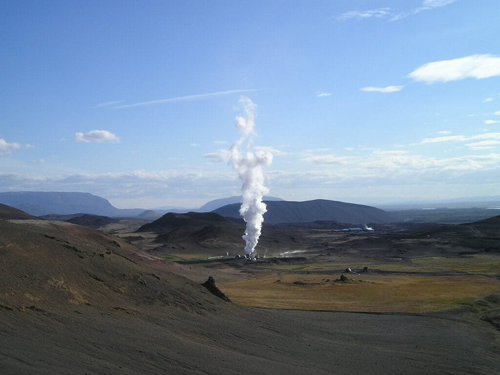
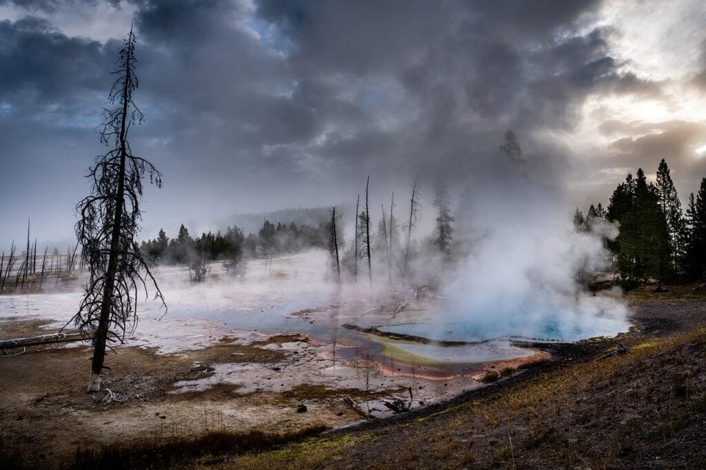

In "Geothermal Power Generation in Volcanic Regions," we explore why volcanic regions are ideal for geothermal power. Volcanoes, formed through the escape of molten rock, gases, and debris to the earth's surface, occur mainly along plate boundaries, hotspots, and rift zones. Areas like the "Ring of Fire" in the Pacific Ocean are particularly prone to volcanic activity due to the convergence of tectonic plates. Shield volcanoes in Hawaii, on the other hand, form gradually over hot spots underground. Understanding the different types of volcanoes, their eruption patterns, and the hazards and benefits they bring is crucial in harnessing geothermal energy effectively. By delving into the uniqueness of volcanic regions, we can uncover the potential they hold for sustainable power generation.

This image is property of pixabay.com.

## What Makes Volcanic Regions Ideal for Geothermal Power?

Volcanic regions are considered ideal for geothermal power generation due to several factors. One of the main reasons is the presence of high heat flow beneath the Earth's surface. This heat is generated by the molten rock, or magma, that lies beneath the volcanoes. As the magma rises and interacts with the Earth's crust, it heats up the surrounding rocks and water reservoirs.

The heat from the volcanic activity can be harnessed by drilling wells into the geothermal reservoirs. These reservoirs are essentially underground reservoirs of hot water and steam. The geothermal fluids in these reservoirs can reach temperatures as high as 300 degrees Celsius or more.

Another factor that makes volcanic [regions ideal for geothermal power](https://magmamatters.com/understanding-volcanic-formation-a-comprehensive-guide/ "Understanding Volcanic Formation: A Comprehensive Guide") is the presence of permeable rock formations. These formations allow the hot water and steam from the geothermal reservoirs to flow to the surface, where it can be used to generate electricity. In volcanic regions, the permeable rock formations are often created by the volcanic activity itself, as the magma and fluids from the volcanic eruptions create fractures and openings in the rocks.

The availability of water is also crucial for geothermal power generation, and volcanic regions usually have a good supply of water. This is because the volcanic activity creates reservoirs of water beneath the surface. The water can circulate through the geothermal reservoirs, absorbing heat from the rocks and becoming hot enough to be used for power generation.

Moreover, volcanic regions often have a high concentration of geothermal resources. This means that there are multiple geothermal reservoirs within a relatively small geographical area. This concentration of resources allows for more efficient and effective development of geothermal power plants.

The combination of high heat flow, permeable rock formations, abundant water supply, and concentration of geothermal resources in volcanic regions makes them highly suitable for geothermal power generation.

### Case studies of successful geothermal power generation in volcanic regions

Several volcanic regions around the world have successfully harnessed geothermal power for electricity generation. One such example is Iceland, which has become a global leader in geothermal energy production. The country is located on the Mid-Atlantic Ridge, a tectonic plate boundary, and is known for its active volcanoes and geothermal activity.

Iceland utilizes its geothermal resources to provide clean and sustainable energy for its population. Around 30% of the country's electricity comes from geothermal power plants, and a significant portion of its heating needs are met through geothermal district heating systems. The success of geothermal power in Iceland can be attributed to its favorable geology and active tectonic activity.

Another notable example is New Zealand, which also has a significant amount of geothermal resources due to its volcanic activity. The country has several geothermal power plants that contribute to its renewable energy mix. These power plants utilize the heat from underground reservoirs to generate electricity, helping New Zealand reduce its reliance on fossil fuels.

These case studies demonstrate the potential and viability of geothermal power generation in volcanic regions. The success of these projects showcases the economic, environmental, and social benefits of harnessing geothermal energy from volcanic activity.

## Understanding the Basics of Geothermal Power

Geothermal power is a renewable energy source that harnesses the Earth's natural heat for electricity generation. It involves tapping into the heat stored within the Earth's crust and converting it into usable energy.

The process of geothermal power production typically involves drilling wells into the geothermal reservoirs and extracting the hot water or steam. The hot fluid is then used to turn turbines, which generate electricity. After passing through the turbine, the spent fluid is re-injected into the geothermal reservoir, where it is reheated and can be used again.

Geothermal energy has a wide range of applications beyond electricity generation. It can be used for space heating and cooling, as well as for industrial processes such as drying crops and generating steam for manufacturing.

There are several benefits of geothermal power. It is a clean and sustainable source of energy, as the heat extracted from the Earth is renewable and does not produce greenhouse gas emissions. Geothermal power plants also have a small land footprint compared to other forms of renewable energy, such as wind and solar.

However, there are also some drawbacks to geothermal power. One challenge is the high upfront costs of drilling and developing geothermal power plants. The exploration and drilling processes can be complex and expensive, requiring specialized equipment and expertise. In addition, geothermal resources are not evenly distributed globally, which limits the geographic availability of this energy source.

Overall, geothermal power offers a reliable and environmentally friendly alternative to traditional fossil fuel-based energy sources. With advancements in technology and increasing recognition of the importance of renewable energy, geothermal power is expected to play a significant role in the future energy landscape.

### Benefits and drawbacks of geothermal power

Geothermal power has several benefits that make it an attractive energy source. One of the main advantages is its sustainability. Unlike fossil fuels, which are finite and contribute to [climate change](https://magmamatters.com/geothermal-energy-and-its-volcanic-origins/ "Geothermal Energy and Its Volcanic Origins"), geothermal energy is renewable and does not release greenhouse gas emissions during operation.

Another advantage is the consistent and reliable nature of geothermal power. Unlike wind and solar energy, which are intermittent and dependent on weather conditions, geothermal power can be harnessed 24/7. This makes it a valuable asset for meeting baseload power demand and ensuring grid stability.

Furthermore, geothermal power plants have a small land footprint compared to other types of power plants. Geothermal reservoirs can be located underground, minimizing the visual impact on the surrounding landscape. This is particularly beneficial in areas where land is scarce or conservation is a priority.

In addition to its environmental benefits, geothermal power can also provide economic opportunities. Developing geothermal projects can create jobs and stimulate local economies. The operation and maintenance of geothermal power plants also require a skilled workforce, which can contribute to the growth of the renewable energy sector.

Despite its advantages, geothermal power also has some drawbacks. One major challenge is the high upfront costs associated with exploration, drilling, and plant development. Geothermal projects require significant investments in infrastructure and technology, which can be a barrier to entry for some countries or companies.

Geothermal resources are not evenly distributed globally, which limits the geographic availability of this energy source. Most geothermal regions are located in specific tectonic or volcanic areas, which may not be accessible or suitable for large-scale development. This can lead to disparities in the utilization of geothermal energy among countries.

Furthermore, geothermal power generation can have environmental impacts, although they are generally considered relatively low compared to fossil fuel-based energy sources. There is a potential for subsidence, induced seismicity, and the release of trace amounts of harmful gases from the geothermal reservoirs. However, with proper monitoring and mitigation measures, these risks can be minimized.

Overall, the benefits of geothermal power significantly outweigh the drawbacks. With ongoing advancements in technology and increasing global focus on renewable energy, geothermal power is expected to play a crucial role in the transition to a more sustainable and low-carbon future.

This image is property of pixabay.com.

## The Role of Tectonic Activity in Power Generation

Tectonic activity plays a vital role in the generation of geothermal power, especially in volcanic regions. Tectonic activity refers to the movement and interactions of the Earth's tectonic plates, which are large pieces of the Earth's lithosphere that fit together like a jigsaw puzzle.

Tectonic activity occurs at plate boundaries, where the tectonic plates meet. There are three main types of plate boundaries: divergent boundaries, convergent boundaries, and transform boundaries. Each type of boundary has different characteristics and geological processes associated with it.

In volcanic regions, tectonic activity is commonly observed at divergent plate boundaries. These boundaries occur when two plates move away from each other, creating a gap between them. As the plates separate, magma from the Earth's mantle rises to fill the gap, forming a volcanic ridge or rift zone. This volcanic activity is driven by the movement and interaction of the tectonic plates.

The presence of tectonic activity in volcanic regions is crucial for geothermal power generation. The movement of the tectonic plates creates fractures and openings in the Earth's crust, allowing magma and fluids to rise to the surface. This process creates geothermal reservoirs, which contain hot water and steam that can be utilized for power generation.

The heat from the volcanic activity is transferred to the rocks and water reservoirs, making them ideal for geothermal power production. The tectonic activity also contributes to the permeability of the rock formations, enabling the circulation of the geothermal fluids.

Moreover, tectonic activity can lead to the formation of geothermal systems with high temperatures and pressures. These conditions are favorable for the efficient generation of electricity, as they allow for the production of high-pressure steam that can drive turbines with greater efficiency.

In summary, tectonic activity is a key factor in power generation in volcanic regions. It creates the geological conditions necessary for the formation of geothermal reservoirs and facilitates the circulation of hot fluids. Understanding the role of tectonic activity is vital for the exploration and development of geothermal power plants in volcanic regions.

### Definition and explanation of tectonic activity

Tectonic activity refers to the movement and interactions of the Earth's tectonic plates. These plates are huge pieces of the Earth's lithosphere, which is the rigid outer layer of the planet. Tectonic plates fit together like a jigsaw puzzle, covering the Earth's surface and drifting slowly over time.

The movement of the tectonic plates is driven by the convective currents in the Earth's mantle, which is the layer beneath the lithosphere. These currents are caused by the transfer of heat from the Earth's core to the surface. As the hot material in the mantle rises and cools, it sinks back down, creating a circular motion known as convection.

There are three main types of plate boundaries, each characterized by different geological processes:

1. Divergent boundaries: These boundaries occur when two tectonic plates move away from each other. As the plates separate, magma from the Earth's mantle rises to fill the gap, creating new crust and forming volcanic ridges or rift zones. Divergent boundaries are often associated with volcanic activity and the generation of geothermal resources.
    
2. Convergent boundaries: Convergent boundaries happen when two tectonic plates collide. Depending on the type of crust involved, three subtypes can occur: oceanic-oceanic convergence, oceanic-continental convergence, and continental-continental convergence. When the plates collide, one plate is usually forced beneath the other in a process called subduction. This can result in the formation of mountain ranges and volcanic arcs.
    
3. Transform boundaries: Transform boundaries occur when two tectonic plates slide past each other horizontally. They are typically characterized by large fault lines, such as the San Andreas Fault in California. Transform boundaries do not involve the creation or destruction of crust but often result in significant seismic activity.
    

The movement and interactions of tectonic plates can have significant geological and geophysical effects. It can lead to the formation of mountains, earthquakes, and the creation of new crust through volcanic activity. Tectonic activity is a dynamic process that shapes the Earth's surface and plays a crucial role in the generation of geothermal power in volcanic regions.

## Exploration and Drilling in Volcanic Regions for Geothermal Power

Exploration and drilling are crucial steps in the development of geothermal power plants in volcanic regions. These processes are necessary to identify suitable geothermal reservoirs and extract the hot fluids for power generation.

### Methods for exploration and drilling in volcanic geothermal reservoirs

The first step in exploring for geothermal resources is the identification of potential geothermal reservoirs. This is often done through a combination of geological mapping, geophysical surveys, and geochemical analysis. These methods help to identify areas with high heat flow, permeable rock formations, and other characteristics indicative of geothermal activity.

Once potential reservoirs are identified, exploratory drilling is conducted to confirm the presence of geothermal fluids and assess their temperature and flow rates. Exploratory drilling involves drilling test wells into the ground to collect samples of the fluids and rocks. These samples are then analyzed to determine the suitability of the reservoir for power generation.

If a reservoir is found to be viable, production drilling is carried out to create production wells for the extraction of geothermal fluids. Production wells are larger and deeper than exploratory wells and are designed to withstand the high pressures and temperatures associated with geothermal reservoirs.

The drilling process can be challenging in volcanic regions due to the complex geological conditions. Volcanic rocks are often hard and abrasive, making drilling more difficult and requiring specialized equipment. The presence of fractures and faults in the rocks can also pose challenges, as they can affect drilling stability and fluid flow within the reservoir.

### Risks and safety measures in exploration and drilling

Exploration and drilling in volcanic regions for geothermal power generation carry certain risks and require stringent safety measures to protect workers and the environment.

One of the main risks is the potential for encountering high temperatures and pressures during drilling. Geothermal fluids can be extremely hot and under high pressure, which can pose risks to the drilling crew and equipment. To mitigate these risks, proper drilling techniques and equipment must be employed to ensure the safety of the personnel and equipment.

Another risk is the potential for encountering hazardous gases during drilling operations. Geothermal fluids can contain gases such as hydrogen sulfide, which is highly toxic. Special gas monitoring and ventilation systems are employed to protect workers from exposure to these gases.

The drilling process can also have an impact on the stability of the surrounding geological formations. In volcanic regions, there is a risk of inducing seismic activity or causing subsidence due to the extraction of fluids from the reservoir. Careful monitoring and mitigation measures, such as injection of fluids to maintain reservoir pressure, are implemented to minimize these risks.

To ensure the safety of workers, strict safety protocols and training programs are implemented during exploration and drilling operations. Personal protective equipment and safety barriers are used to protect workers from potential hazards. Regular inspections and maintenance of drilling equipment are also carried out to ensure their safe operation.

Overall, exploration and drilling in volcanic regions for geothermal power generation require careful planning, specialized equipment, and adherence to safety protocols. By implementing appropriate safety measures, the risks associated with these processes can be minimized, allowing for the development of geothermal resources in a safe and responsible manner.

This image is property of pixabay.com.

## Tapping Heat from Volcanic Regions: The Technology

The harnessing of geothermal power in volcanic regions involves the use of various technologies to tap into the heat stored beneath the Earth's surface. Over the years, several different technologies have been developed and implemented for geothermal power generation.

### Discussions on the various technologies available for geothermal power harnessing

1. Dry Steam Power Plants: This technology is one of the earliest and simplest methods of harnessing geothermal energy. Dry steam power plants utilize geothermal fluids in the form of high-pressure steam to drive turbines and generate electricity. The steam is directly extracted from the geothermal reservoir and used to rotate the turbine. After passing through the turbine, the steam is condensed back into water and re-injected into the reservoir. Dry steam power plants are most suitable for regions with high-temperature geothermal reservoirs.
    
2. Flash Steam Power Plants: Flash steam power plants are the most common type of geothermal power plant in operation today. These plants utilize high-pressure hot water from the geothermal reservoir. When the high-pressure water is released into a lower pressure environment, it flashes into steam, which is then used to drive turbines. After passing through the turbine, the spent steam is condensed and re-injected into the reservoir. Flash steam power plants are versatile and can be used with a range of geothermal reservoir temperatures.
    
3. Binary Cycle Power Plants: Binary cycle power plants are ideal for geothermal reservoirs with lower temperatures. These power plants use a binary fluid, which is a working fluid with a lower boiling point than water. The hot geothermal water is used to heat the binary fluid, causing it to vaporize and drive a turbine. The spent geothermal water is then reinjected into the reservoir. Binary cycle power plants are known for their high energy efficiency and environmental sustainability.
    
4. Enhanced Geothermal Systems (EGS): EGS technologies involve the creation of artificial geothermal reservoirs by injecting cold water into hot dry rock formations deep underground. The water eventually becomes heated by the surrounding rocks and is extracted as hot water or steam for power generation. EGS [technologies have the potential to expand geothermal power](https://magmamatters.com/the-environmental-impact-of-volcanic-eruptions-2/ "The Environmental Impact of Volcanic Eruptions") production to regions without naturally occurring geothermal reservoirs.
    

### Success stories of technology implementation

One of the notable success stories in geothermal technology implementation is the Hellisheiði Geothermal Power Plant in Iceland. This power plant utilizes a combination of flash steam and binary cycle technologies to generate electricity. It has an installed capacity of 303 MW, making it one of the largest geothermal power plants in the world. The Hellisheiði plant has been instrumental in providing sustainable and clean energy to meet Iceland's electricity and heating demands.

Another success story is the Olkaria Geothermal Power Plant in Kenya. This power plant utilizes flash steam technology to generate electricity. It has an installed capacity of over 800 MW, making it the largest geothermal power plant in Africa. The Olkaria plant has significantly contributed to Kenya's energy mix, reducing the country's reliance on fossil fuels and promoting sustainable development.

These success stories highlight the effectiveness and reliability of various geothermal power generation technologies in volcanic regions. By leveraging technological advancements, countries around the world can tap into their geothermal resources for clean and sustainable energy.

## Safety Measures in Geothermal Power Generation in Volcanic Regions

While geothermal power generation offers many benefits, it is essential to be aware of potential safety hazards associated with working in volcanic regions. Implementing appropriate safety measures is crucial to ensure the well-being of workers and prevent accidents.

### Potential dangers of geothermal power production in volcanic regions

One of the potential dangers in geothermal power production is encountering hot fluids with high temperatures and pressures. Geothermal fluids can reach temperatures up to several hundred degrees Celsius and have high pressure due to their underground storage. Contact with hot fluids can cause severe burns or scalding, posing a significant risk to personnel.

Another potential danger is the release of hazardous gases from geothermal reservoirs. Geothermal fluids can contain gases such as hydrogen sulfide, which is highly toxic and can be fatal in high concentrations. Workers in geothermal power plants need to be trained in gas monitoring and equipped with suitable protective gear to prevent exposure to these gases.

Additionally, geothermal power generation in volcanic regions can involve drilling operations, which carry inherent risks. Drilling can encounter unexpected geological formations, such as faults or fractures, which can impact the stability of the well and pose risks to workers' safety.

Seismic activity is another safety concern in volcanic regions. The extraction of fluids from geothermal reservoirs can induce minor seismic events. While most of these events are small and not felt, large seismic events can occur in some cases. Proper monitoring and early warning systems need to be in place to ensure the safety of personnel and infrastructure.

### Safety measures taken to prevent accidents

To prevent accidents in geothermal power generation, various safety measures are implemented at every stage of the process.

During exploration and drilling, personnel are trained on safety protocols and procedures. Proper personal protective equipment, such as helmets, gloves, and safety boots, is provided to workers. Safety barriers and warning signs are used to demarcate hazardous zones.

In the power plant operation phase, continuous monitoring of geothermal fluids and gases is essential. Gas monitoring systems are installed to detect the presence of toxic gases and to trigger alarms when necessary. Adequate ventilation and extraction systems are implemented to minimize exposure to hazardous gases.

Regular maintenance and inspection of equipment and infrastructure are carried out to ensure their safe and reliable operation. Emergency response plans and evacuation procedures are in place in the event of an accident or natural disaster. Personnel are trained on emergency protocols and are aware of evacuation routes and assembly points.

### Case studies of safety incidents and how they were managed

Prevention and proper management of safety incidents are critical in geothermal power generation. Despite stringent safety measures, unforeseen accidents can occur.

One such incident occurred at the Puna Geothermal Venture (PGV) plant in Hawaii in 2018. The plant was severely affected by the Kilauea volcanic eruption, resulting in the release of toxic gases and the shutdown of the facility. In response, safety measures were immediately implemented, including the evacuation of personnel and the establishment of an exclusion zone. The incident highlighted the importance of emergency preparedness and the need to consider volcanic hazards when siting geothermal power plants.

In another case, a drilling accident occurred during an exploratory drilling operation in a geothermal project in Indonesia. The drilling rig collapsed, resulting in injuries to several workers. Prompt emergency response and medical assistance were provided, and safety protocols were reviewed and reinforced to prevent future accidents.

These case studies underscore the significance of robust safety measures and emergency preparedness in geothermal power generation. Learnings from such incidents help improve safety protocols and prevent accidents, ensuring the well-being of workers and the surrounding communities.

## Environmental Impact of Geothermal Power Generation in Volcanic Regions

Geothermal power generation in volcanic regions has both positive and negative environmental impacts. Understanding these impacts is crucial to ensure the sustainable development and utilization of geothermal resources.

### Positive environmental impacts

Geothermal power generation offers several positive environmental benefits. Firstly, it is a renewable and clean source of energy. Unlike fossil fuel-based power generation, geothermal energy does not produce greenhouse gas emissions during operation. This helps reduce the carbon footprint and mitigates the impacts of climate change.

Geothermal power plants also have a small land footprint compared to other types of power plants. The infrastructure required for geothermal power generation is primarily underground, with only small surface facilities visible. This allows for the conservation of natural habitats and reduces disruption to ecosystems.

Furthermore, geothermal power generation does not require large amounts of water for operation, unlike some other forms of energy generation. The water used in geothermal power plants is typically recycled within the system, minimizing the impact on water resources.

### Negative environmental impacts

While geothermal power generation is generally considered environmentally friendly, it is not without its negative impacts. One significant concern is the potential for subsidence, which is the sinking or settling of the ground surface. When fluids are extracted from geothermal reservoirs, the rocks may compact, causing the ground to sink. Subsidence can lead to changes in topography, affecting natural drainage systems and potentially impacting nearby ecosystems.

Another potential impact is the release of trace amounts of harmful gases from the geothermal reservoirs. Geothermal fluids can contain gases such as hydrogen sulfide and mercury, which can be emitted into the atmosphere during power generation. These gases, even in small quantities, can have detrimental effects on air quality and human health.

Geothermal power generation can also have localized impacts on water resources. The extraction of geothermal fluids and reinjection into the reservoirs can lead to changes in the hydrological regime. This can affect the availability of groundwater for local communities and ecosystems.

### Regulations and policies aimed at mitigating negative impacts

To mitigate the negative environmental impacts of geothermal power generation, regulations and policies have been put in place in many countries.

Environmental impact assessments (EIAs) are required before the development of geothermal projects. EIAs help identify potential environmental risks and impacts and ensure that appropriate mitigation measures are taken. Regulatory bodies and government agencies oversee the EIA process and ensure compliance with environmental standards.

Monitoring and reporting systems are implemented to track the performance of geothermal power plants and assess their environmental impacts. This includes monitoring the emissions of harmful gases, groundwater levels, and impacts on ecosystems and natural resources.

Regulations are also in place to address water resource management in geothermal projects. These regulations aim to ensure the sustainable use of water resources and prevent depletion or contamination of groundwater sources.

Furthermore, partnerships between the geothermal industry, scientific institutions, and government agencies are established to promote research and development in environmental management practices. This collaboration helps identify best practices for mitigating environmental impacts and ensures continuous improvement in sustainability.

By implementing these regulations and policies, the potential negative impacts of geothermal power generation in volcanic regions can be minimized. This allows for the sustainable utilization of geothermal resources, contributing to a greener and more environmentally friendly energy sector.

## Economic Viability of Geothermal Power Generation in Volcanic Regions

The economic viability of geothermal power generation in volcanic regions is influenced by various factors, including the cost of development, operational expenses, and the potential for economic growth and job creation.

### Cost analysis of geothermal power vs traditional energy sources

The cost of geothermal power generation is influenced by several factors, including the initial investment in drilling and plant development, as well as ongoing operational expenses.

The initial investment in geothermal power plants can be high, especially for exploratory drilling and infrastructure development. Geological surveys, exploration drilling, and plant construction require significant capital investments. However, once the initial investment is made, the operational costs of geothermal power plants are relatively low compared to traditional energy sources.

Geothermal power plants have low fuel costs since they utilize heat from the Earth's core, which is a renewable resource. In contrast, traditional power plants that rely on fossil fuels are susceptible to price fluctuations in the fuel market.

The operational costs of geothermal power plants primarily include maintenance and repair expenses. Geothermal wells may require occasional maintenance and rehabilitation over time. However, these costs are typically lower than those associated with conventional power plants that require regular fuel purchases.

Moreover, geothermal power projects have long lifespans, typically lasting for several decades. This long-term operation allows for stable and predictable electricity generation, reducing the uncertainty associated with fuel prices and ensuring a secure and reliable energy supply.

### Potential for economic growth and job creation

Geothermal power generation has significant potential for economic growth and job creation, particularly in volcanic regions.

Developing geothermal projects requires a range of skilled professionals, including geologists, engineers, and technicians. These projects create employment opportunities in various stages, from exploration and drilling to plant construction and operation. Job creation extends beyond the geothermal sector, as the supply chain for geothermal projects requires goods and services from various industries.

Furthermore, the development of geothermal power plants can attract investments and foster economic growth in the local communities. The operation and maintenance of geothermal infrastructure, including power plants and transmission lines, provide ongoing economic benefits to the region. Additionally, geothermal power projects can diversify the energy mix and reduce reliance on imported fossil fuels, leading to increased energy security and reduced trade imbalances.

The economic viability of geothermal power generation in volcanic regions is highly dependent on the availability and accessibility of geothermal resources, as well as supportive policies and regulatory frameworks. By leveraging these resources and creating a conducive environment for investment, countries can enhance their energy security, promote economic growth, and foster job creation.

## Government Policies Supporting Geothermal Power

Governments around the world have recognized the importance of geothermal power in achieving sustainable and clean energy goals. As a result, various policies and incentives have been implemented to support the development and growth of geothermal power generation.

### Current policies supporting geothermal power generation

Many countries have introduced policies and regulations to incentivize the development of geothermal power plants. These policies vary depending on the specific national context but generally aim to support investment, reduce barriers, and provide a favorable business environment for geothermal projects.

Financial incentives, such as tax credits and grants, are commonly used to attract investment in geothermal power generation. These incentives help offset the high upfront costs associated with exploration, drilling, and plant development. They can include tax breaks for geothermal energy production or reduced import duties on geothermal equipment and machinery.

Feed-in tariffs and power purchase agreements (PPAs) are also used to promote geothermal power generation. Feed-in tariffs guarantee a fixed price for the electricity generated by geothermal plants, providing long-term revenue certainty for project developers. PPAs establish agreements between developers and utilities, ensuring a market for geothermal electricity at predetermined prices.

Moreover, streamlined and efficient permitting processes are essential to expedite the development of geothermal projects. Governments have implemented policies to expedite the approval process for exploration, drilling, and plant construction. This helps reduce administrative burdens and regulatory barriers that can hinder project development.

### Effects of government incentives on industry growth

Government incentives have had a significant impact on the growth and development of the geothermal power industry. Incentives help reduce financial risks and increase investor confidence in geothermal projects. They stimulate private sector investments and contribute to the expansion of the geothermal power sector.

Financial incentives have been instrumental in driving innovation and cost reduction in geothermal technologies. The availability of tax credits and grants encourages research and development activities, leading to advancements in exploration techniques, drilling technologies, and plant efficiency.

Feed-in tariffs and PPAs provide revenue stability and long-term contracts, making geothermal projects more attractive to investors. These agreements ensure a market for geothermal electricity and enable project developers to secure funding for project development.

Streamlined permitting processes have also been effective in accelerating project timelines and reducing investment risks. By simplifying and expediting the approval processes, governments have facilitated a favorable business environment for geothermal power generation.

The combined effects of government policies and incentives have resulted in increased geothermal capacity and expanded development in many countries. Geothermal power has become a reliable and sustainable energy source, contributing to the global transition towards a low-carbon economy.

## Future Trends in Geothermal Energy from Volcanic Regions

As the world continues to prioritize renewable energy sources, geothermal power from volcanic regions is expected to play an increasingly significant role. Several future trends are likely to shape the development and utilization of geothermal energy in volcanic regions.

### Emerging technologies and their potential

Advancements in drilling and exploration technologies are expected to unlock previously untapped geothermal resources. Enhanced Geothermal Systems (EGS) are one such emerging technology that holds promise for expanding geothermal power generation. EGS involves creating artificial geothermal reservoirs by injecting water into hot dry rock formations. This [technology can potentially enable geothermal power generation in regions](https://magmamatters.com/the-art-and-science-of-volcano-monitoring/ "The Art and Science of Volcano Monitoring") without naturally occurring geothermal reservoirs.

In addition to EGS, other technologies, such as advanced drilling techniques and geophysical imaging, are being developed to improve resource identification and increase the efficiency of geothermal power plants. These technologies aim to reduce costs, enhance energy extraction rates, and improve the reliability of geothermal power generation.

### Predicted growth and challenges of the industry

The geothermal power sector is expected to experience steady growth in the coming years, driven by the increasing global focus on renewable energy and decarbonization. The International Renewable Energy Agency (IREA) projects that geothermal power generation capacity could more than double by 2030.

However, several challenges need to be addressed to maximize the potential of geothermal power generation. One challenge is the high upfront costs associated with exploration and drilling. Incentives and supportive policies are needed to attract investments and reduce financial risks for developers.

Access to financing is another key challenge. Geothermal projects often face difficulties in securing funding, as their economics can be perceived as risky compared to other renewable energy sources. Collaboration between government institutions, financial institutions, and the private sector is crucial to address these financing challenges.

Furthermore, skilled labor and specialized expertise are necessary for the development and operation of geothermal power plants. Investing in education and training programs can help address the skills gap and ensure a competent workforce for the industry.

The continued improvement in technological capabilities, along with supportive policies and investments, will be instrumental in overcoming these challenges and driving the growth of the geothermal power industry in volcanic regions.

In conclusion, geothermal power generation in volcanic regions offers numerous advantages, including high heat flow, permeable rock formations, and abundant water supply. The presence of tectonic activity facilitates the formation of geothermal reservoirs and the availability of hot fluids for power generation. Exploration and drilling techniques are essential for identifying and developing geothermal resources. Various technologies, such as flash steam, binary cycle, and enhanced geothermal systems, provide different options for harnessing geothermal power. Safety measures and environmental regulations ensure responsible and sustainable development of geothermal power plants. Government policies and incentives support the growth of the geothermal power sector, driving economic growth and job creation. The future of geothermal energy from volcanic regions will be shaped by emerging technologies, predicted growth, and the need to address challenges. With ongoing advancements and increasing global focus on renewable energy, geothermal power is poised to play a crucial role in the transition to a sustainable and low-carbon energy future.

