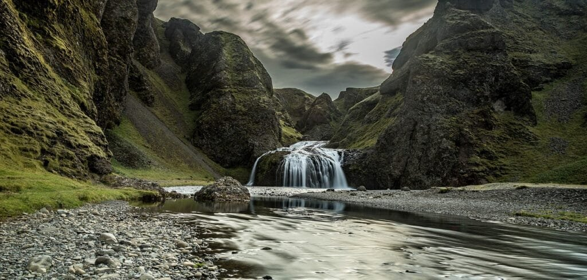
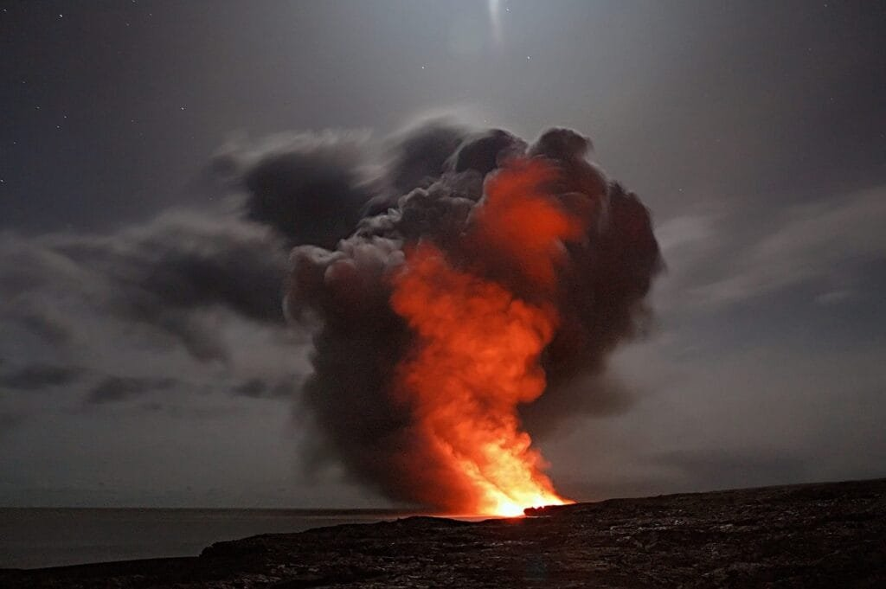
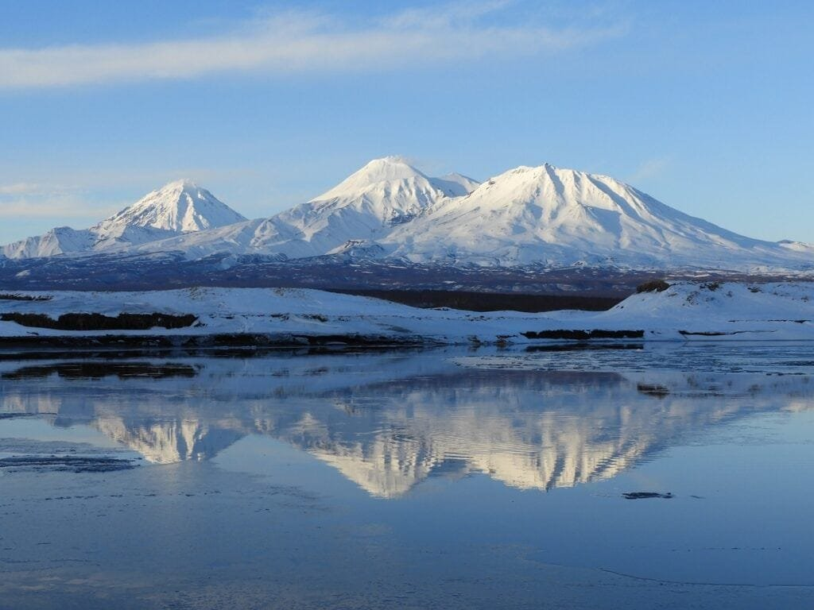

In the fascinating world of volcanoes, there is so much to explore and discover. From the types of volcanoes to their distribution around the world, their causes and hazards, and even the unexpected benefits they bring, the study of volcanoes is truly captivating. Volcanoes are born when hot molten rock, gases, and debris burst forth from beneath the Earth's surface, resulting in explosive eruptions of lava and ash. These majestic formations can be found along plate boundaries, in hotspot regions deep underground, or in rift zones where tectonic plates are shifting apart. The notorious "Ring of Fire" surrounding the Pacific Ocean is a prime example of volcanic activity, with its numerous volcanoes positioned at plate boundaries. On the other hand, gentle shield volcanoes like those in Hawaii slowly build up over time from hotspots. Different [types of volcanoes](https://magmamatters.com/understanding-volcanic-formation-a-comprehensive-guide/ "Understanding Volcanic Formation: A Comprehensive Guide") exhibit varying eruption patterns, influenced by factors such as the viscosity of the lava and the gas content. While volcanic eruptions can provide essential nutrients to the soil, they can also unleash devastating natural disasters. The study of volcanoes not only helps us understand their workings but also aids in predicting future eruptions and safeguarding the communities living nearby. So, buckle up as we embark on a thrilling journey into the world of volcanoes, unveiling their secrets and unraveling their mysteries. Welcome to the "Guide to Volcanoes: Types, Distribution, Causes, Hazards, and Benefits."

<iframe width="560" height="315" src="https://www.youtube.com/embed/VNGUdObDoLk" frameborder="0" allow="accelerometer; autoplay; encrypted-media; gyroscope; picture-in-picture" allowfullscreen></iframe>

  

## Understanding Volcanoes

[Volcanoes are fascinating natural phenomena](https://magmamatters.com/the-art-and-science-of-volcano-monitoring/ "The Art and Science of Volcano Monitoring") that have been a source of both wonder and destruction throughout history. In order to truly grasp the significance of these powerful forces of nature, it is important to have a clear understanding of what volcanoes are and how they are formed. This article will provide an in-depth look into the definition of a volcano, the process of volcano formation, and the role of tectonic plates and hot spots in volcano formation.

### Definition of a volcano

A volcano can be defined as an opening or rupture in the Earth's crust through which molten rock, gases, and debris escape to the surface. This process is known as a volcanic eruption and is typically accompanied by the ejection of lava, ash, and pyroclastic material. Volcanoes can vary in size, shape, and eruptive activity, but they all share the common characteristic of being a conduit for the release of pent-up energy within the Earth.

### Process of volcano formation

Volcano formation is a complex process that occurs over millions of years. It begins with the movement of tectonic plates, which are enormous pieces of the Earth's lithosphere that float on the semi-fluid asthenosphere beneath them. When these plates converge, diverge, or move laterally past each other, they create zones of intense geologic activity.

Convergent plate boundaries, where two plates collide, are particularly prone to volcanic activity. In these areas, one plate is forced beneath the other in a process known as subduction. As the subducting plate sinks into the Earth's mantle, it melts due to the high temperatures and pressures. The molten rock, or magma, then rises through cracks and fractures in the Earth's crust, eventually reaching the surface and forming a volcano.

### Role of tectonic plates and hot spots in volcano formation

Tectonic plates play a crucial role in the formation of volcanoes. As mentioned earlier, convergent plate boundaries are a prime location for volcanic activity. When two plates collide, the subduction of one plate beneath the other triggers the melting of the subducting plate and the subsequent formation of magma.

Hot spots, on the other hand, are areas of intense volcanic activity that are unrelated to plate boundaries. These hot spots are thought to be caused by mantle plumes, which are columns of hot, buoyant rock rising from deep within the Earth's mantle. As the mantle plume rises to the surface, it melts the overlying rock and forms magma chambers. This magma then erupts through the Earth's crust, producing a series of volcanic eruptions over time.

Together, tectonic plates and hot spots are responsible for the creation and distribution of volcanoes worldwide. They shape our planet's geology and play a crucial role in its ever-evolving landscape.

## Types of Volcanoes

Volcanoes come in various shapes and sizes, each with its own unique characteristics and eruption styles. In this section, we will explore the different types of volcanoes, namely shield volcanoes, stratovolcanoes, cinder cone volcanoes, composite volcanoes, and lava domes.

### Characteristics of Shield Volcanoes

Shield volcanoes are characterized by their broad, gently sloping sides and low profiles. They are primarily formed from the eruption of highly fluid basaltic lava, which spreads out in thin layers, creating a shield-like shape. These volcanoes typically have large craters at their summits and are associated with effusive eruptions, where lava flows continuously rather than explosively.

One of the most notable examples of a shield volcano is Mauna Loa in Hawaii. Mauna Loa is the largest shield volcano on Earth and has experienced numerous eruptions throughout history. These eruptions have added layers upon layers of lava, gradually building up the mountain over time.

### Features of Stratovolcanoes

Stratovolcanoes, also known as composite volcanoes, are characterized by their steep sides and conical shape. They are built by alternating layers of lava flows, volcanic ash, and pyroclastic material. These eruptions tend to be explosive in nature, with eruptions occurring intermittently over long periods of time.

Mount Fuji in Japan is a prime example of a stratovolcano. Its symmetrical cone shape and iconic beauty make it one of the most recognizable volcanoes in the world. Despite its beauty, stratovolcanoes can also pose significant hazards due to their explosive eruptions.

### Understanding Cinder Cone Volcanoes

Cinder cone volcanoes are the simplest and smallest type of volcano. They are formed from explosive eruptions that eject small pieces of lava, known as cinders, into the air. These cinders fall back to the ground and pile up around the volcanic vent, creating a steep-sided, cone-shaped volcano.

Cinder cone volcanoes tend to be short-lived and relatively small in size. They often form in clusters on the flanks of larger volcanoes or along fissures in the Earth's crust. While they may not be as impressive as shield or stratovolcanoes, cinder cones can still pose risks to nearby communities if they erupt unexpectedly.

### Detailing Composite Volcanoes

Composite volcanoes are a type of stratovolcano that possess additional features due to their complex eruption history. In addition to the alternating layers of lava, ash, and pyroclastic material, composite volcanoes also exhibit lava domes, which are mounds of viscous lava that accumulate in the volcanic crater.

These volcanoes have a more gradual slope than cinder cone volcanoes and tend to be much larger. They are often found at subduction zones where one tectonic plate is forced beneath another. Mount Rainier in Washington State, USA, is a notable example of a composite volcano, with its towering peak and extensive system of glaciers.

### Explaining Lava Domes

Lava domes, also known as volcanic domes, are formed when extremely viscous lava accumulates around a volcanic vent. Unlike other types of volcanoes, lava domes do not erupt explosively; instead, they slowly extrude viscous lava, which piles up to form a dome-shaped volcano.

Lava domes can be found on their own or as part of larger composite volcanoes. They are typically associated with intermediate and felsic magma, which has a higher silica content and is more viscous than basaltic magma. The eruption of a lava dome can be dangerous, as pressure can build up within the dome, leading to explosive eruptions.

This image is property of pixabay.com.

## Geographic Distribution of Volcanoes

Volcanoes are not randomly scattered across the Earth's surface; instead, they tend to occur in specific regions that are closely related to plate tectonics and other geologic processes. In this section, we will explore the geographic distribution of volcanoes and the factors that influence their location.

### The 'Ring of Fire' explained

The "Ring of Fire" is a term used to describe a major area in the basin of the Pacific Ocean where a large number of earthquakes and volcanic eruptions occur. It is a direct result of plate tectonics and the movement and interaction of several tectonic plates.

The Pacific Ring of Fire stretches over 40,000 kilometers and is home to approximately 75% of the world's active volcanoes. It is a restless region characterized by subduction zones, where one tectonic plate is forced beneath another. These subduction zones are responsible for the formation of many of the world's largest and most explosive volcanoes, such as Mount St. Helens in the United States and Mount Pinatubo in the Philippines.

### Hot spots and their influence on volcano location

In addition to plate boundaries, hot spots play a significant role in determining the location of volcanoes. Hot spots are stationary sources of magma within the Earth's mantle and are unrelated to plate tectonics. These hot spots are thought to be caused by mantle plumes, which are columns of hot, buoyant rock rising from deep within the Earth's mantle.

As the tectonic plates move over these hot spots, volcanic activity can occur. One of the most famous examples of a hot spot volcano is the Hawaiian Islands. The Hawaiian Islands were formed by a hot spot beneath the Pacific Plate, resulting in a chain of islands that gradually decrease in age from west to east.

### Distribution of volcanoes along rift zones

Rift zones, also known as divergent plate boundaries, are another important location for volcanic activity. Rift zones occur where tectonic plates are moving apart, causing the Earth's crust to crack and create a gap. Magma from the mantle then rises to fill this gap, leading to the formation of volcanoes.

The East African Rift System is a prominent example of a rift zone. This region has been shaped by the movement of tectonic plates and the subsequent formation of numerous volcanic features, including impressive volcanoes such as Mount Kilimanjaro and Mount Nyiragongo.

## Understanding the Causes of Volcanic Eruptions

Volcanic eruptions are awe-inspiring events that can have profound impacts on both the natural environment and human populations. In this section, we will explore the causes of volcanic eruptions, including the role of pressure build-up, tectonic activity, and magma composition and gas content.

### Role of pressure build-up

One of the primary causes of volcanic eruptions is the build-up of pressure within magma chambers beneath the Earth's surface. When magma is trapped underground and continues to accumulate, the pressure can eventually overcome the confining strength of the surrounding rock.

As the pressure increases, the magma will seek a path of least resistance to the surface, eventually erupting through a volcanic vent. The intensity of the eruption is often determined by the amount of pressure build-up and the properties of the magma.

### Impact of tectonic activity

Tectonic activity plays a significant role in triggering volcanic eruptions. As tectonic plates move and interact with each other, they create zones of intense geologic activity. Subduction zones, where one tectonic plate is forced beneath another, are particularly prone to volcanic activity.

When the subducting plate sinks into the Earth's mantle, it eventually reaches a point where the high temperatures and pressures cause it to melt. This molten rock, or magma, then rises through cracks and fractures in the Earth's crust, leading to volcanic eruptions.

### Role of magma composition and gas content in causing eruptions

The composition and gas content of magma also play a crucial role in determining the explosiveness of volcanic eruptions. Magma can be classified into three main types based on its silica content: basaltic magma, andesitic magma, and rhyolitic magma.

Basaltic magma, which has a low silica content, tends to be more fluid and less explosive. This type of magma often leads to effusive eruptions, where lava flows freely. In contrast, rhyolitic magma, which has a high silica content, is more viscous and can trap gas bubbles within it. This can result in explosive eruptions as the gas bubbles expand rapidly and fragment the magma.

The gas content of magma, primarily water vapor and carbon dioxide, can greatly impact the eruptive behavior of volcanoes. As magma rises to the surface, the decrease in pressure allows dissolved gases to exsolve from the magma. If the gas content is high, it can lead to explosive eruptions, as seen in the devastating eruption of Mount Pinatubo in 1991.

This image is property of pixabay.com.

## Patterns of Volcanic Eruptions

Volcanic eruptions can exhibit a wide range of patterns and behaviors depending on factors such as lava viscosity and gas content. In this section, we will explore the three main eruption patterns: effusive eruptions, explosive eruptions, and phreatomagmatic eruptions.

### Effusive eruption pattern

Effusive eruptions, also known as non-explosive eruptions, are characterized by the slow and steady flow of lava from a volcanic vent. This type of eruption occurs when magma is relatively low in viscosity and gas content.

Effusive eruptions can create lava flows that travel long distances, gradually building up the size of the volcano over time. These eruptions can be relatively benign, allowing nearby communities to evacuate safely and minimize the risk of damage.

### Explosive eruption pattern

Explosive eruptions are the most dramatic and destructive type of eruption. They occur when magma is high in viscosity and gas content, creating a volatile mixture that can lead to violent explosions.

During an explosive eruption, the pressure within the magma chamber builds up to the point where it can no longer be contained. The resulting eruption releases a combination of gases, ash, and pyroclastic material into the atmosphere, forming a towering column of erupted material.

Explosive eruptions can have far-reaching impacts, including the potential for ash fall, lahars (mudflows), and pyroclastic flows. The explosive eruption of Mount St. Helens in 1980 remains one of the most well-known examples of this type of eruption.

### Phreatomagmatic eruption pattern

Phreatomagmatic eruptions occur when water comes into contact with magma, causing a rapid generation of steam and explosive activity. These eruptions typically occur in volcanic environments that are in close proximity to bodies of water or where groundwater is present.

When water enters the magma chamber, it quickly turns into steam, expanding rapidly and fragmenting the magma. This can result in a violent and explosive eruption, similar to what is observed in explosive eruptions.

Phreatomagmatic eruptions can create eruption columns, ash clouds, and pyroclastic material. They can also produce volcanic ash clouds that pose risks to aviation safety and have a significant impact on the environment.

## Hazards Associated with Volcanoes

Volcanic eruptions can pose a wide range of hazards to both the immediate vicinity of the volcano and areas located hundreds or even thousands of kilometers away. In this section, we will explore some of the main hazards associated with volcanoes, including lava flow, volcanic ash, pyroclastic flows, volcanic gases, landslides, tsunamis, and climate change.

### Lava flow hazard

One of the most recognizable hazards associated with volcanoes is the potential for lava flows. As magma rises to the surface and erupts, it can flow downslope, engulfing anything in its path.

Lava flows can be slow-moving or fast-moving, depending on the viscosity of the magma. Slow-moving lava flows, known as pahoehoe, can give people time to evacuate and minimize the potential for damage. Fast-moving lava flows, known as aa, can be much more dangerous and destructive, making it difficult to escape their path.

### Volcanic ash and its effects

Volcanic ash is another significant hazard associated with volcanic eruptions. It consists of tiny particles of fragmented volcanic rock, glass, and other materials that are carried into the atmosphere during an eruption.

Volcanic ash can have wide-ranging impacts, both on the ground and in the air. On the ground, ash fall can blanket vast areas, smothering vegetation, damaging infrastructure, and impacting human health. In the air, volcanic ash can pose risks to aviation, as it can severely damage aircraft engines and affect visibility.

### Pyroclastic flows and their dangers

Pyroclastic flows are dense, fast-moving clouds of hot gas, ash, and volcanic debris that race down the slopes of a volcano during an eruption. These deadly flows can reach velocities of several hundred kilometers per hour and temperatures of several hundred degrees Celsius.

Pyroclastic flows are highly destructive and can level everything in their path. They can cause widespread devastation, burying communities and leaving behind a trail of destruction. Pompeii, the ancient Roman city buried by the eruption of Mount Vesuvius in 79 AD, is a tragic example of the destructive power of pyroclastic flows.

### Volcanic gases and their impact

Volcanic eruptions release a variety of gases into the atmosphere, including water vapor, carbon dioxide, sulfur dioxide, hydrogen sulfide, and others. These gases can have significant impacts on the environment and human health.

Sulfur dioxide, for example, can combine with water vapor in the atmosphere to form sulfuric acid, which can lead to acid rain. This can have detrimental effects on vegetation, bodies of water, and infrastructure.

Volcanic gases can also pose health risks to nearby communities. Inhalation of sulfur dioxide, hydrogen sulfide, and other acidic gases can cause respiratory problems and exacerbate existing health conditions.

### Secondary hazards: landslides, tsunamis, and climate change

In addition to the primary hazards associated with volcanic eruptions, there are also several secondary hazards that can pose significant risks. Landslides, or volcanic debris avalanches, can occur during or after an eruption, particularly on steep volcano slopes. These landslides can bury communities and infrastructure, leading to additional loss of life and damage.

Tsunamis can also be triggered by volcanic eruptions that occur in or near bodies of water. The rapid displacement of water during an eruption can generate powerful waves that can propagate across the ocean, posing risks to coastal communities.

Finally, volcanic eruptions can have long-term effects on the climate. Large-scale eruptions can release massive amounts of ash and gases into the atmosphere, which can reflect sunlight and cause a temporary cooling of the Earth's surface. This cooling effect can have significant impacts on weather patterns and climate conditions.

This image is property of pixabay.com.

## Mitigating Volcanic Hazards

While volcanic eruptions cannot be prevented, their impacts can be mitigated through careful planning, preparedness, and mitigation measures. In this section, we will explore some of the ways in which communities can reduce the risks associated with volcanic hazards.

### Importance of disaster preparedness

One of the most crucial aspects of mitigating volcanic hazards is disaster preparedness. This involves developing comprehensive emergency plans that outline the necessary actions to be taken before, during, and after an eruption.

Communities at risk of volcanic activity should establish early warning systems and evacuation plans that help residents navigate potential hazards. Education and public awareness campaigns are also essential in ensuring that individuals understand the risks and know how to respond to an eruption.

### Role of monitoring and early warning systems

Monitoring volcanic activity is key to early detection and warning of impending eruptions. Volcano observatories and monitoring networks play a crucial role in monitoring changes in volcanic activity, such as ground deformation, gas emissions, and seismic activity.

By continuously monitoring these parameters, scientists can detect any changes that may indicate an impending eruption. This information can then be used to issue timely warnings and alerts, allowing communities to take necessary precautions and evacuate if required.

### Planning and practicing evacuation routes

Planning and practicing evacuation routes is another vital aspect of mitigating volcanic hazards. Communities at risk should identify safe evacuation routes that lead individuals to designated evacuation centers or safe zones away from the volcano.

Regular drills and simulations can help familiarize residents with evacuation procedures and ensure that they know what to do in the event of an eruption. This proactive approach can save lives and reduce panic during a crisis.

### Understanding the risk area and adapting construction methods

Understanding the risk area is essential in mitigating volcanic hazards. Communities should conduct thorough risk assessments to determine the areas most susceptible to volcanic activity and its associated hazards.

Building codes and construction methods should be adapted to reduce the vulnerability of structures to volcanic hazards. This may involve using materials that can better withstand ash fall, designing buildings to be resistant to pyroclastic flows and lahars, and implementing appropriate infrastructure improvements.

## Benefits of Volcanic Activity

While volcanic eruptions can pose significant hazards, they also provide a range of benefits that should not be overlooked. In this section, we will explore some of the positive aspects of volcanic activity, including volcanic soil and agriculture, geothermal power generation, mining, and mineral extraction, as well as tourism and economic benefits.

### Volcanic soil and agriculture

Volcanic eruptions contribute to the creation of some of the most fertile soils on Earth. The ash, lava, and other volcanic materials deposited during eruptions break down over time, releasing essential nutrients into the soil.

These nutrient-rich soils, known as volcanic soils or Andisols, are highly fertile and ideal for agriculture. They support the growth of a wide range of crops, including coffee, cocoa, bananas, and other tropical fruits. Many volcanic regions, such as the volcanic islands of Indonesia, have thriving agricultural industries that benefit from the fertile volcanic soil.

### Geothermal power generation

Volcanic activity also provides a valuable source of renewable energy in the form of geothermal power. Geothermal power plants harness the natural heat stored beneath the Earth's surface and convert it into electricity.

Regions with active volcanoes often have significant geothermal resources, as the magma and heat from volcanic activity help to maintain elevated temperatures underground. Countries like Iceland and New Zealand have harnessed geothermal power to provide a significant portion of their energy needs, reducing their reliance on fossil fuels.

### Mining and mineral extraction

Volcanic activity can also create mineral-rich environments that are highly valued for their mineral resources. Volcanic eruptions can transport valuable minerals and metals from deep within the Earth to the surface, where they can be mined and extracted.

Some volcanic regions, such as the Andean Volcanic Belt in South America, are known for their extensive mineral deposits. These deposits contain valuable resources like copper, gold, silver, and other metals that are vital for various industries.

### Tourism and economic benefits

Volcanoes, with their awe-inspiring beauty and unique landscapes, attract tourists from around the world. Volcanic regions often become popular tourist destinations, providing an economic boost to the local communities.

Tourists flock to places like Hawaii, Iceland, and Indonesia to experience the natural wonders of volcanic landscapes, such as lava fields, volcanic craters, and hot springs. These visitors contribute to the local economy through accommodation, dining, and various tourism-related activities.

The economic benefits of tourism can be substantial, supporting local businesses and providing employment opportunities for the community.

## Volcanic Activity and Climate Change

Volcanic activity has been recognized as a significant driver of [climate change](https://magmamatters.com/geothermal-energy-and-its-volcanic-origins/ "Geothermal Energy and Its Volcanic Origins") throughout Earth's history. In this section, we will explore the relationship between [volcanic activity and climate change](https://magmamatters.com/the-role-of-volcanoes-in-earths-carbon-cycle-5/ "The Role Of Volcanoes In Earth’s Carbon Cycle"), focusing on volcanic gases and the greenhouse effect, as well as the impact of volcanic aerosols in cooling the Earth.

### Volcanic gases and the greenhouse effect

Volcanic eruptions release large amounts of gases into the atmosphere, including water vapor, carbon dioxide, sulfur dioxide, and others. These gases can contribute to the greenhouse effect, which traps heat in the Earth's atmosphere and leads to global warming.

Carbon dioxide is a particularly important greenhouse gas released by volcanic activity. While volcanic carbon dioxide emissions are relatively small compared to human-induced emissions, they can still impact the Earth's climate system.

### Role of volcanic aerosols in cooling the Earth

In addition to greenhouse gases, volcanic eruptions also release tiny particles known as aerosols into the atmosphere. These aerosols can reflect sunlight back into space, reducing the amount of solar radiation that reaches the Earth's surface.

Large volcanic eruptions can inject significant amounts of aerosols high into the atmosphere, forming a layer that can persist for years. This can have a cooling effect on the planet, offsetting some of the warming caused by greenhouse gases.

The 1991 eruption of Mount Pinatubo in the Philippines, for example, injected large amounts of sulfur dioxide into the stratosphere, forming a sulfuric acid aerosol layer. This aerosol layer resulted in a cooling effect on global temperatures for several years following the eruption.

## Notable Volcanoes and Historical Eruptions

Throughout history, there have been numerous notable [volcanoes](https://magmamatters.com/the-environmental-impact-of-volcanic-eruptions-2/ "The Environmental Impact of Volcanic Eruptions") and eruptions that have left a lasting impact on both the natural environment and human civilization. In this section, we will explore some of these notable volcanoes and the historical eruptions associated with them.

### Mount Vesuvius and the destruction of Pompeii

Mount Vesuvius is one of the most famous and dangerous volcanoes in the world. Located near the city of Naples in Italy, it has a long history of volcanic activity, with its most famous eruption occurring in 79 AD.

During this eruption, Mount Vesuvius unleashed a tremendous amount of ash, pumice, and other volcanic material, burying the nearby cities of Pompeii and Herculaneum under several meters of debris. The eruption of Mount Vesuvius preserved the towns almost perfectly, providing an extraordinary glimpse into life in ancient Rome.

### 1980 eruption of Mount St. Helens

The 1980 eruption of Mount St. Helens in the state of Washington, USA, is one of the most significant volcanic eruptions in recent history. Prior to the eruption, Mount St. Helens had been dormant for over a century.

On May 18, 1980, the volcano suddenly exploded, releasing a massive lateral blast that flattened trees and caused widespread devastation. The eruption produced a towering ash cloud that spread across the United States and affected air travel as far away as Europe.

The eruption of Mount St. Helens claimed the lives of 57 people and caused extensive damage to the surrounding area. It served as a stark reminder of the destructive power of volcanic eruptions and the importance of preparedness and monitoring.

### The ongoing eruption of Kīlauea in Hawaii

Kīlauea, located on the Big Island of Hawaii, has been erupting continuously since 1983, making it one of the longest-lived eruptions in recorded history. It is one of the most active volcanoes in the world and has created vast lava flows and volcanic landscapes over the years.

The recent eruption of Kīlauea in 2018 gained international attention due to its dramatic lava flows and the destruction of homes and infrastructure in the Puna region of Hawaii. The eruption served as a reminder of the ever-present risk posed by volcanic activity and the need for constant monitoring and preparedness.

In conclusion, understanding volcanoes is crucial for predicting future activity, mitigating risks, and harnessing their benefits. Volcanoes come in various forms, each with its own unique characteristics and eruption patterns. They are shaped by the movement of tectonic plates and the presence of hot spots, and their distribution is influenced by plate boundaries, rift zones, and the famous "Ring of Fire." Volcanic eruptions can have devastating consequences, including the release of lava flows, volcanic ash, pyroclastic flows, and hazardous gases. However, volcanic activity also offers valuable resources, such as fertile volcanic soil, geothermal energy, and mineral deposits. By understanding the causes and patterns of volcanic eruptions, and through careful planning, monitoring, and preparedness, the impacts of volcanic hazards can be mitigated, ensuring the safety and well-being of communities living near volcanic areas.

