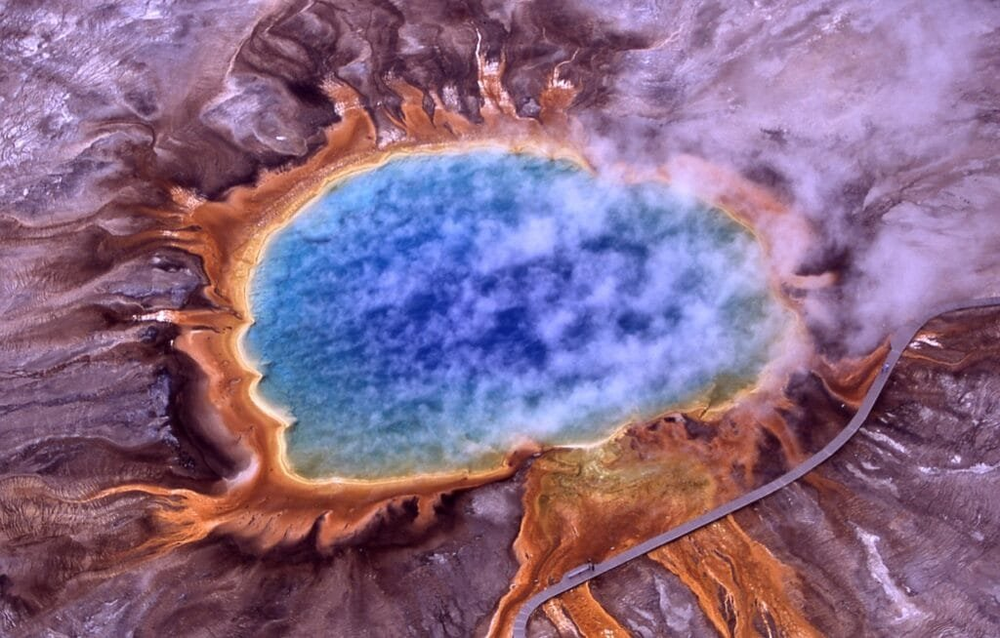
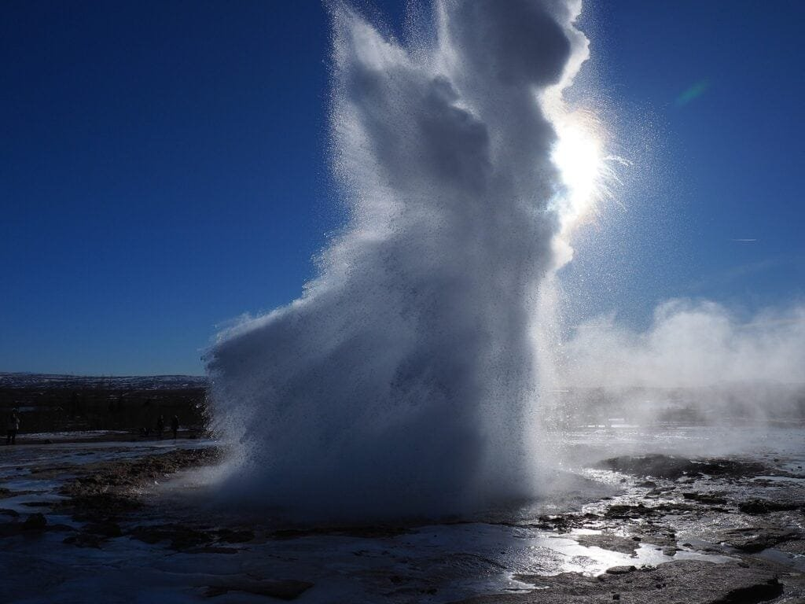
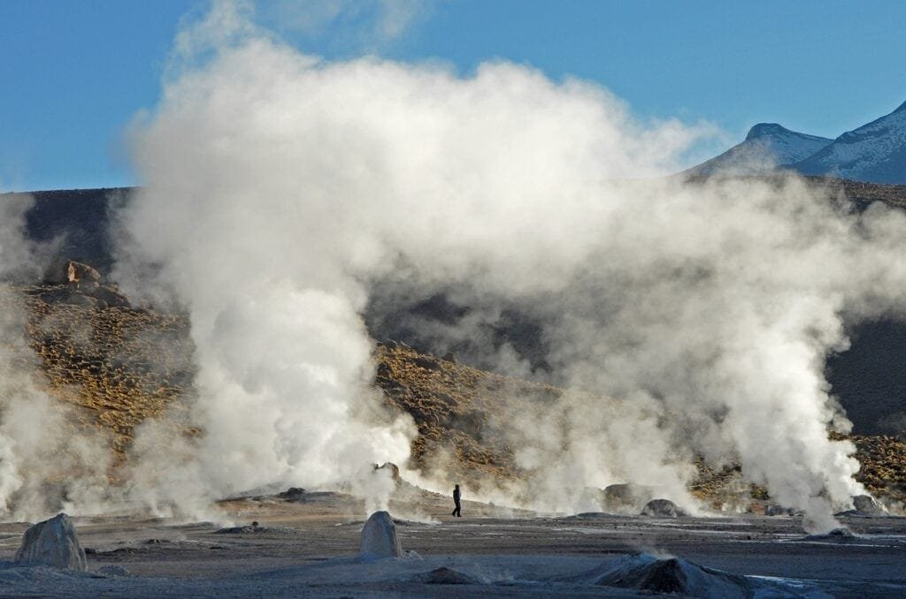

Are you curious about harnessing the immense power of geothermal energy from volcano eruptions? Look no further! In this article, we will provide you with seven tips on how to effectively utilize this renewable energy source. Volcanoes, formed by the escape of molten rock and gases from the Earth's surface, are fascinating and powerful natural phenomena. They occur in various locations around the world, such as along plate boundaries and hotspots, each with their own unique eruption patterns. While volcanic eruptions can bring devastation, they also provide opportunities for harnessing geothermal energy. So, if you're interested in learning how to tap into this incredible resource, read on to discover the seven key tips to successfully harness volcano geothermal energy.

This image is property of pixabay.com.

## Understanding Geothermal Energy

Geothermal energy refers to the heat energy that is generated and stored beneath the Earth's surface. This renewable energy source is harnessed by tapping into the natural heat produced by the Earth's core, which is mainly driven by the decay of radioactive isotopes such as uranium and thorium. By utilizing this heat, geothermal energy can be converted into electricity or used for heating and cooling purposes.

## Benefits of geothermal energy

There are several advantages to harnessing geothermal energy. First and foremost, it is a sustainable and renewable energy source, as the heat deriving from the Earth's core is essentially limitless. Unlike fossil fuels, which are non-renewable and deplete over time, geothermal energy provides a constant and reliable source of power.

Furthermore, geothermal energy is highly efficient. The conversion of heat into electricity has a significantly higher efficiency rate compared to traditional fossil fuel-based power plants. Geothermal power plants also generate minimal greenhouse gas emissions, reducing the carbon footprint associated with energy production.

Another significant benefit of geothermal energy is its versatility. It can be used for various purposes, including electricity generation, heating systems, and even hot water supply. This flexibility makes geothermal energy an attractive option for both residential and industrial applications.

## Caveats and challenges in utilizing geothermal energy

While geothermal energy has many advantages, there are also some challenges to consider. One limitation is the geographic availability of suitable locations for harnessing geothermal energy. Not all areas have the necessary geological features, such as hot water reservoirs, to support the efficient extraction of heat.

Another challenge is the high upfront costs associated with geothermal energy projects. The exploration and drilling required to access the geothermal resource can be costly. Additionally, the construction of geothermal power plants and the infrastructure needed to distribute the energy require significant investments.

Furthermore, there can be environmental concerns associated with geothermal energy extraction. The release of gases and fluids from deep underground can contain trace amounts of harmful substances, such as hydrogen sulfide and heavy metals. Proper monitoring and management of these byproducts are necessary to ensure minimal environmental impact.

This image is property of pixabay.com.

## The Connection Between Volcanoes and Geothermal Energy

Volcanoes play a crucial role in geothermal energy production. The heat sources found beneath volcanoes are a result of the molten rock, or magma, that rises from the Earth's mantle to the surface during volcanic eruptions. This magma, along with the associated gases and debris, provides the necessary heat and energy for geothermal power generation.

The volcanic activity associated with these eruptions creates fractures and channels within the Earth's crust. These pathways allow water to circulate and be heated by the hot rocks and magma underneath. By drilling wells into these geothermal reservoirs, the heated water can be extracted and used to power turbines, generating electricity.

## How volcanic activities provide geothermal energy sources

Volcanic activities result in the creation of various geothermal energy sources. One primary source is the hot water or steam found in geothermal reservoirs. These reservoirs are formed when rainwater seeps deep underground and gets heated by the Earth's core. As the heated water rises, it collects in underground reservoirs, which can be tapped into for geothermal energy extraction.

Another source is the hot rock or magma itself. In some volcanic regions, like Iceland, the molten rock is close enough to the surface to be accessed directly. By drilling into the hot rock, water can be injected, creating a steam that can power turbines and generate electricity.

Overall, the volcanic processes and the associated heat provided by magma and hot water reservoirs make [volcanoes ideal locations for harnessing geothermal](https://magmamatters.com/geothermal-energy-and-its-volcanic-origins/ "Geothermal Energy and Its Volcanic Origins") energy.

## Identifying Suitable Volcanic Locations for Geothermal Energy Harvesting

When identifying suitable volcanic locations for geothermal energy harvesting, several crucial factors need to be considered. These factors include the presence of a geothermal reservoir, the temperature and depth of the reservoir, and the permeability of the surrounding rocks.

A geothermal reservoir is a critical component as it holds the hot water or steam that will be extracted for energy generation. The presence of an extensive and productive reservoir is essential for sustained power production.

The temperature and depth of the reservoir are also crucial factors. The higher the temperature and the shallower the reservoir, the more efficient the energy extraction process will be. Higher temperatures provide greater energy potential, while shallower reservoirs reduce drilling and infrastructure costs.

Permeability refers to the ability of rocks to transmit fluids, such as water and steam. Rock permeability affects the flow of geothermal fluids and, consequently, the efficiency of energy extraction. Identifying areas with high permeability is essential to ensure a steady and consistent flow of geothermal fluids.

Techniques such as seismic surveys, geochemical sampling, and temperature gradient drilling are commonly used to identify promising geothermal sites. These techniques allow scientists and engineers to assess the presence of geothermal resources and determine their productivity and viability for energy harvesting.

This image is property of pixabay.com.

## Harnessing Geothermal Energy: On-site Setup

To harness geothermal energy effectively, specific infrastructure is required. This includes drilling wells, constructing power plants, and implementing a distribution system.

Drilling wells is a crucial step in accessing the geothermal reservoir. Deep wells are drilled to reach the geothermal fluids, allowing them to be brought to the surface. The wells need to be properly designed and constructed to withstand the high pressures and temperatures associated with geothermal reservoirs.

Power plants are then built to convert the geothermal energy into electricity. The most common type of power plant used in geothermal energy production is the binary cycle power plant. In this system, the hot geothermal fluid is used to heat a secondary fluid (such as butane or pentane), which vaporizes and drives a turbine connected to an electric generator.

The final step is to establish a distribution system for the generated electricity. This can involve connecting the geothermal power plant to the existing electrical grid or establishing a local distribution network for supplying electricity to nearby communities.

While the on-site setup for geothermal energy harvesting is generally straightforward, there can be potential issues or challenges that arise. One common challenge is the corrosion and scaling that can occur due to the high mineral content in geothermal fluids. Proper maintenance and treatment systems must be in place to mitigate these issues and ensure the longevity of the infrastructure.

## The Importance of Safety Measures

Safety considerations are of utmost importance when working with geothermal energy, particularly in geothermal locations. There are inherent risks associated with harnessing energy from deep underground, which must be properly managed to protect both workers and the surrounding environment.

First and foremost, proper training and awareness programs should be implemented to educate workers on the potential hazards and safety protocols. This includes understanding the risks associated with geothermal fluid handling, well drilling operations, and power plant maintenance.

Technologies and procedures also play a vital role in ensuring safety in geothermal installations. For example, pressure relief systems are essential to prevent the build-up of excessive pressure in geothermal wells. Additionally, automated monitoring and control systems can detect abnormal conditions and initiate shutdown procedures to prevent accidents.

Emergency response plans and procedures should be established to address unforeseen issues or incidents. This includes protocols for evacuations, medical emergencies, and well blowouts. Regular drills and exercises are essential for ensuring that all personnel are familiar with these procedures and can respond effectively in case of emergencies.

## Monitoring and Maintenance of Geothermal Installations

Routine inspection and maintenance protocols are crucial to the successful operation of geothermal installations. Regular monitoring ensures that the infrastructure is functioning optimally and allows for the early detection of any potential issues or abnormalities.

Inspections typically include visual assessments, as well as more advanced techniques such as temperature monitoring, pressure measurements, and fluid sampling. These inspections help identify any signs of deterioration, corrosion, or scaling within the geothermal infrastructure.

Maintenance activities can involve cleaning the wells to remove mineral deposits, replacing faulty equipment, or repairing any damaged components. Regular maintenance ensures the longevity of the geothermal installations and helps prevent any unexpected failures or disruptions in energy production.

In the case of unforeseen issues or malfunctions, repair and emergency procedures should be in place. These procedures should outline the necessary steps to be taken to address any failures or abnormalities and restore the system to normal operation as quickly as possible.

## The Role of Research and Technological Advancements

Research and technological advancements play a significant role in advancing geothermal energy harvesting and making it more efficient and cost-effective. Ongoing research aims to improve the understanding of geothermal resources, explore new extraction techniques, and develop innovative technologies for geothermal power generation.

One current research trend is the use of enhanced geothermal systems (EGS). EGS involves creating artificial reservoirs by injecting water into hot and low-permeability rocks. This expands the geographic availability of geothermal energy and opens up new possibilities for energy generation.

Another area of research is focused on improving the efficiency of geothermal power plants. This includes developing advanced heat exchangers, optimizing fluid cycles, and enhancing energy conversion processes. These advancements aim to increase the overall energy output and reduce operational costs.

[Technological advancements such as improved drilling techniques and remote monitoring](https://magmamatters.com/the-art-and-science-of-volcano-monitoring/ "The Art and Science of Volcano Monitoring") systems also contribute to the efficiency and cost-effectiveness of geothermal energy harvesting. These advancements allow for more accurate and reliable resource assessments, reduced exploration and drilling costs, and enhanced maintenance and control capabilities.

## Potential Environmental Impacts

As with any form of energy production, geothermal energy extraction has potential environmental impacts that need to be carefully managed. While geothermal energy is generally considered to be a clean and sustainable energy source, certain aspects of its extraction can have localized environmental consequences.

One environmental impact associated with geothermal energy extraction is the release of gases and fluids from deep underground. These fluids can contain trace amounts of substances such as hydrogen sulfide and heavy metals, which, if not properly managed, can pose risks to air and water quality. Implementing appropriate treatment and monitoring systems can mitigate these risks and ensure minimal environmental impact.

Another potential environmental concern is the thermal pollution of surface waters. The discharge of hot fluids back into rivers or lakes can disrupt aquatic ecosystems and affect water quality. Proper temperature regulation and monitoring can help minimize the impact on surrounding ecosystems.

Best practices for minimal ecological disruption in geothermal energy production include careful site selection, regular monitoring of environmental parameters, and stringent compliance with regulations and guidelines. By following these practices, the potential environmental impacts of geothermal energy extraction can be effectively managed and mitigated.

## Community Involvement and Awareness

Involving local communities in geothermal energy projects is crucial for their success and acceptance. Engaging with the community from the early stages of project development allows for open communication, addressing concerns, and ensuring that the project aligns with the needs and priorities of the community.

Methods for raising awareness and garnering support for geothermal projects include public consultation sessions, educational initiatives, and establishing community benefit programs. Public consultation sessions provide opportunities for community members to voice their opinions and ask questions about the project. Educational initiatives, such as workshops and informational materials, can help increase public understanding of geothermal energy and its benefits.

Community benefit programs can also be implemented to ensure that the local community benefits directly from the geothermal project. This can include job creation, revenue sharing agreements, or supporting local infrastructure and services. By actively involving the community and addressing their concerns, geothermal projects can gain the necessary support and ensure long-term success.

## Global Examples and Case Studies

Countries around the world have successfully harnessed geothermal energy from volcanoes. Iceland, for example, derives a significant portion of its electricity from geothermal sources, with geothermal power plants accounting for approximately 30% of the country's total electricity generation. Iceland's utilization of its abundant geothermal resources has not only reduced its reliance on fossil fuels but has also positioned it as a leader in renewable energy.

New Zealand is another example of a country harnessing volcano geothermal energy successfully. The country has several geothermal power plants that contribute to its clean energy mix. Geothermal energy plays a significant role in both electricity generation and heating systems, helping to reduce carbon emissions and promote sustainability.

These global examples and case studies provide valuable insights and lessons for other countries and regions looking to harness geothermal energy. They showcase the potential of geothermal energy as a viable and sustainable alternative to traditional energy sources and highlight the importance of proper planning, community involvement, and ongoing research and development for successful geothermal projects.

In conclusion, geothermal energy, especially when harnessed from volcanoes, offers a renewable, efficient, and versatile source of power. While there are challenges and considerations to address, such as identifying suitable locations, ensuring safety measures, and managing environmental impacts, the benefits of geothermal energy are significant. By understanding the connection between volcanoes and geothermal energy, utilizing appropriate technologies and protocols, and involving local communities, geothermal energy has the potential to play a crucial role in meeting the world's energy needs while reducing greenhouse gas emissions and promoting sustainable development.

