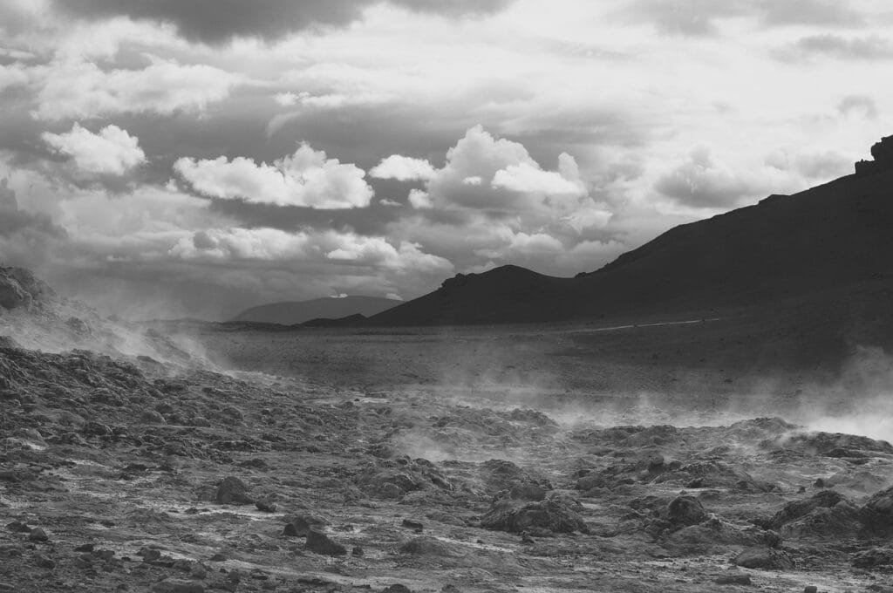
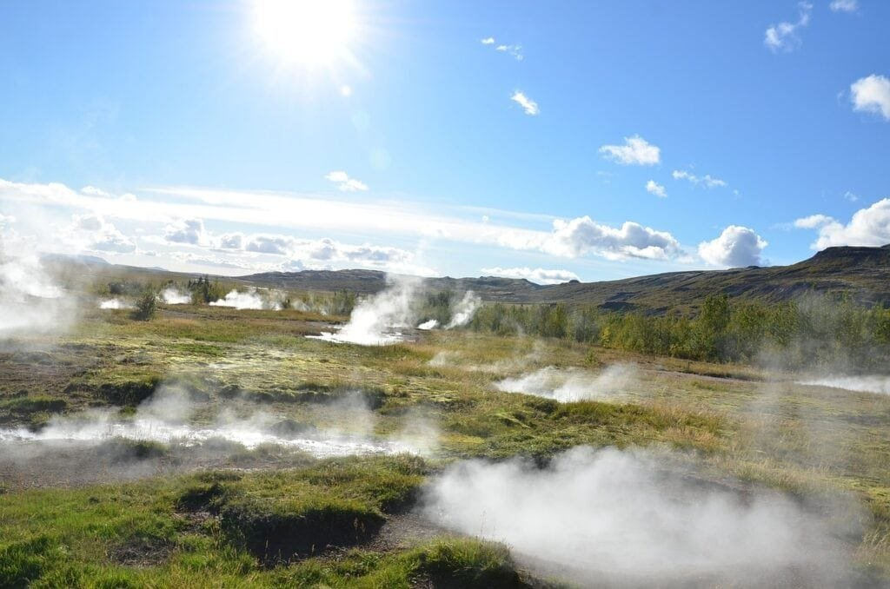
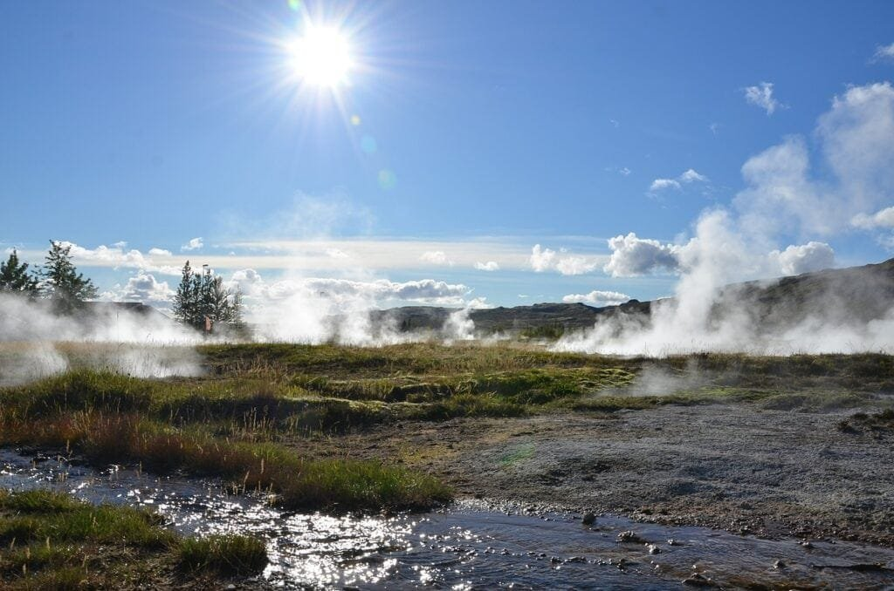

Are you fascinated by volcanoes and their immense power? Do you ever wonder if there’s a way to harness that power for something beneficial? Look no further, because in this article, we will delve into the world of volcano geothermal energy and explore the top 10 methods to harness this incredible resource. From understanding the different types of volcanoes to discovering how their eruptions can provide both hazards and benefits, we will take a comprehensive look at the fascinating world of volcanoes and their potential for renewable energy. So, get ready to learn about these incredible natural phenomena and the innovative ways we can harness their geothermal energy!

<iframe width="560" height="315" src="https://www.youtube.com/embed/wXR6Vi_dHUY" frameborder="0" allow="accelerometer; autoplay; encrypted-media; gyroscope; picture-in-picture" allowfullscreen></iframe>

  

## Understanding Volcanic Geothermal Energy

Geothermal energy is a renewable source of power that utilizes the heat stored within the Earth's crust. Volcanic geothermal energy, in particular, harnesses the intense heat generated by volcanic activity to generate electricity and heat for various applications. This article will provide a comprehensive overview of the different methods used to harness volcanic geothermal energy, highlighting the [natural](https://magmamatters.com/the-art-and-science-of-volcano-monitoring/ "The Art and Science of Volcano Monitoring") process of its creation, discussing the energy potential in volcanic areas, and explaining how this energy translates into usable power.

## Drilling into Geothermal Reservoirs

One of the primary techniques used to extract geothermal energy from volcanic areas is drilling into geothermal reservoirs. A geothermal reservoir is a subsurface area that contains hot water or steam that can be tapped into for energy extraction. The process of drilling into these reservoirs involves several steps, including identifying suitable locations, determining the ideal depth, and circumventing the challenges and risks involved in drilling.

The location and depth of a geothermal reservoir play a crucial role in the success of drilling operations. Typically, areas with active volcanic systems are prime locations for geothermal energy extraction. These areas experience intense heat transfer between the Earth's mantle and crust, resulting in the generation of vast amounts of geothermal energy. Furthermore, drilling into deeper reservoirs allows for access to higher temperatures, which in turn leads to increased power generation.

However, drilling into geothermal reservoirs is not without its challenges. Factors such as high pressure, corrosive fluids, and geological complexities can pose significant risks during the drilling process. To mitigate these challenges, advanced drilling technologies and techniques are employed. These include directional drilling, where the wellbore can be steered to target specific reservoir areas, and the use of specialized drilling fluids to withstand high temperatures and pressures.

This image is property of pixabay.com.

## Utilizing Hydrothermal Energy

Hydrothermal resources, such as naturally occurring hot water and steam, are another valuable source of volcanic geothermal energy. These resources are abundant in volcanic areas and can be tapped into to generate electricity. The process of electricity generation from hydrothermal resources involves the conversion of the energy in the hot water or steam into mechanical energy, which is then transformed into electrical energy.

There are several types of hydrothermal power plants used to harness this energy. Dry steam power plants utilize the high-pressure steam directly extracted from the geothermal reservoir to power a turbine, which drives a generator to produce electricity. Flash steam power plants, on the other hand, use water from the geothermal reservoir that is at a temperature above its boiling point but remains in liquid form under high pressure. As the water is released to a lower pressure environment, it instantly flashes into steam, which is then used to power a turbine. Lastly, binary cycle power plants transfer the heat from the geothermal reservoir's water or steam to a different liquid with a lower boiling point, such as a hydrocarbon fluid. The vaporized fluid then powers a turbine, while the geothermal fluid is re-injected back into the reservoir.

Each type of hydrothermal power plant has its advantages and suitability for different geothermal resources. The choice of plant depends on factors such as the temperature and pressure of the geothermal resource, the fluid composition, and the location of the plant.

## Geopressurized Resources

Geopressurized resources refer to areas where natural gas and hot brine are found at high pressures and temperatures beneath sedimentary rocks. This form of geothermal energy presents a unique opportunity for electricity generation. The process begins by extracting the hot brine and natural gas from the geopressurized resource. The hot brine is then depressurized, allowing it to release steam, which is subsequently used to power a turbine and generate electricity.

However, harnessing geopressurized resources poses several technological challenges. The high pressures involved in these resources require robust equipment and materials to withstand the conditions. Additionally, the extraction process must be carefully managed to prevent the escape of greenhouse gases and ensure the safe extraction of energy. Despite these challenges, geopressurized resources offer great potential for geothermal energy extraction and are an area of ongoing research and development.

This image is property of pixabay.com.

## Exploiting Hot Dry Rock (HDR) Energy

Hot Dry Rock (HDR) is another method of harnessing volcanic geothermal energy that does not rely on the presence of natural geothermal reservoirs. This approach involves creating an artificial geothermal reservoir in a deep geological formation where the rocks are permeable but lack sufficient natural water or steam. Water is injected into the reservoir, and heat is transferred from the surrounding hot rocks, turning the water into steam. The steam is then used to power a turbine and generate electricity.

The advantages of the HDR method are its potential for widespread implementation and its independence from specific geologic features. This means that HDR energy can be harnessed in areas without natural geothermal resources, expanding the reach of geothermal energy. Additionally, HDR energy has the potential for continuous power generation, as water can be continuously circulated to extract heat from the hot rocks.

However, there are practical challenges associated with the HDR method. Creating an artificial geothermal reservoir requires drilling deep into the Earth's crust, which can be technically demanding and expensive. Furthermore, ensuring the engineered reservoir is stable and capable of sustaining continuous heat extraction poses engineering challenges. Nevertheless, ongoing research and technological advancements continue to improve the viability and efficiency of HDR energy extraction.

## Harnessing Volcanic Geothermal Heat for Direct Use

Apart from electricity generation, volcanic geothermal energy can also be utilized directly for heating purposes in homes, offices, and industrial applications. Geothermal heat pumps are a popular method of harnessing this heat for space heating and cooling. These systems use the stable temperature of the Earth below the surface to transfer heat between a building and the ground, providing efficient and sustainable heating and cooling solutions.

Geothermal heat pumps work by circulating a fluid through a loop of underground pipes known as a ground heat exchanger. In the winter, the fluid absorbs heat from the ground and transfers it to the building for heating. In the summer, the system reverses, drawing heat from the building and dissipating it into the ground for cooling. This method of harnessing geothermal heat directly offers numerous advantages, including energy savings, reduced carbon emissions, and decreased reliance on traditional heating and cooling systems.

It is essential to consider the ecological impact of direct geothermal heat use. Improperly designed or implemented systems can disrupt the natural balance of the subterranean environment. Careful consideration must be given to the extraction rate and the potential impact on groundwater resources. Responsible and sustainable practices ensure the long-term viability of geothermal heat utilization.

This image is property of pixabay.com.

## Geothermal Energy Storage Systems

Geothermal energy storage systems play a crucial role in maximizing the efficiency and reliability of volcanic geothermal energy. These systems allow excess energy to be stored during periods of low demand and discharged during periods of high demand, ensuring a steady and consistent supply of electricity.

One method of geothermal energy storage is through the use of underground thermal energy storage (UTES). In this system, excess heat from the geothermal power plant is stored in the form of heated water or other fluids in underground reservoirs or aquifers. During times of high demand, the stored heat can be retrieved and used to generate electricity, supplementing the power generation from the geothermal source.

Geothermal energy storage systems also play a significant role in load balancing. By storing excess energy during low-demand periods, power plants can operate at maximum efficiency, reducing wastage and optimizing resource utilization. Additionally, the ability to store excess energy helps stabilize the power grid, especially in areas heavily reliant on geothermal energy.

Ongoing research and development in geothermal energy storage systems are focused on improving efficiency and exploring new storage mediums and techniques. These advancements hold great potential for enhancing the overall reliability and sustainability of volcanic geothermal energy.

## Maximizing Efficiency in Geothermal Power Plants

Efficiency is a critical factor in optimizing the utilization of volcanic geothermal energy. The process of transferring heat from the Earth's surface to generate electricity must be as efficient as possible to minimize energy losses and maximize power generation. Advanced technologies are employed to improve the efficiency of geothermal power plants.

One key innovation is the use of enhanced geothermal systems (EGS). EGS involves stimulating the underground reservoir by fracturing the rocks and introducing fluid to increase permeability and heat transfer. This technology allows access to deeper and hotter resources, significantly expanding the potential for geothermal energy extraction.

Another technique to maximize efficiency is the implementation of advanced power plant designs. Binary cycle power plants, for example, are known for their higher conversion efficiency compared to other geothermal power plant types. These power plants utilize the heat from the geothermal fluid to vaporize a secondary fluid, which then powers the turbine. This secondary fluid can be chosen based on its boiling point, ensuring it efficiently converts the available heat into mechanical energy.

Furthermore, steps are being taken to reduce CO2 emissions in geothermal power plants. The development and implementation of carbon capture and storage (CCS) technologies allow the capture and sequestration of CO2 emissions from geothermal power plants, significantly reducing their environmental impact. These advancements in efficiency and emissions reduction technologies continue to drive the sustainability and viability of volcanic geothermal energy.

## Waste Disposal and Ecosystem Preservation

Waste disposal is an important aspect of geothermal energy extraction, as the process generates various byproducts that must be appropriately managed. One of the primary waste products is the geothermal brine that is extracted along with the hot water or steam. This brine can contain dissolved minerals and naturally occurring hazardous substances that need to be properly treated and disposed of to prevent environmental contamination.

To address waste disposal challenges, innovative wastewater treatment technologies have been developed specifically for geothermal waste. These technologies aim to remove contaminants and harmful chemicals from the brine, making it safe for discharge or reinjection back into the geothermal reservoir. Proper waste management practices help mitigate the ecological impact of geothermal energy extraction and ensure the long-term preservation of surrounding ecosystems.

Furthermore, the preservation of ecosystems in volcanic regions is vital for maintaining the natural balance and biodiversity of these areas. [Volcanoes and their surrounding environments](https://magmamatters.com/geothermal-energy-and-its-volcanic-origins/ "Geothermal Energy and Its Volcanic Origins") often serve as important habitats for unique plant and animal species. It is crucial to implement measures to preserve these ecosystems while harnessing volcanic geothermal energy. This can be achieved through effective land use planning, ecosystem monitoring, and the establishment of protected areas.

## Future Perspectives in Volcanic Geothermal Energy

The field of volcanic geothermal energy continues to evolve, with ongoing research and developments aimed at unlocking its full potential. Current trends in volcanic geothermal energy research focus on improving the efficiency and sustainability of existing methods while exploring new techniques for energy extraction.

As technology advances, it is expected that untapped volcanic regions will play a significant role in future energy transitions. Areas with active volcanoes or geothermal resources yet to be fully explored present opportunities for expanding geothermal energy production. These regions could become important contributors to the global shift towards sustainable and renewable energy sources.

The role of volcanic geothermal energy in global sustainable energy transitions cannot be overstated. As the world seeks to reduce reliance on fossil fuels and combat climate change, geothermal energy has emerged as a reliable and environmentally friendly alternative. With its immense potential, volcanic geothermal energy offers a promising pathway towards a more sustainable and greener future.

